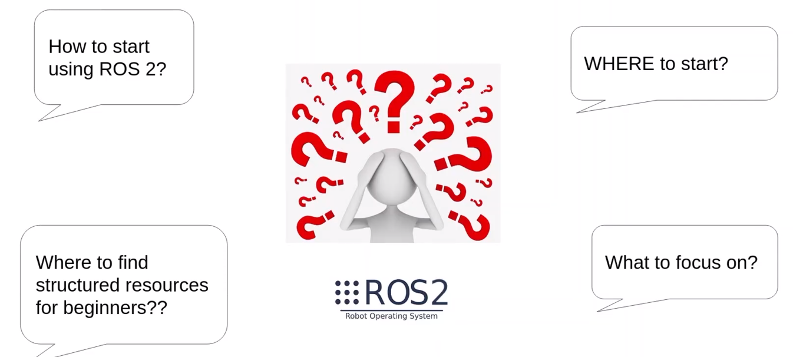
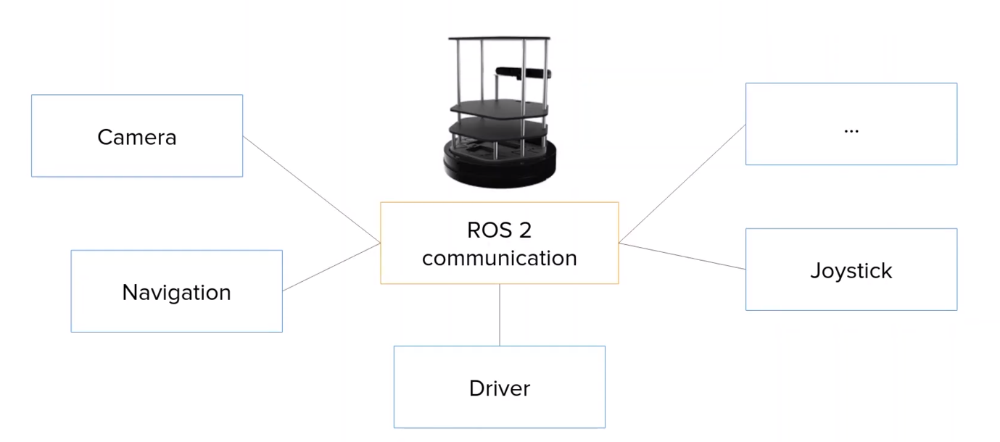
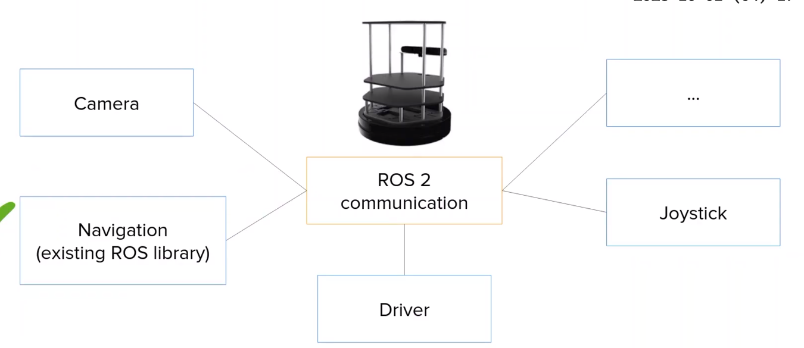

# 欢迎

> 良好的课程和教程，知道起步阶段什么最重要

  
> 循序渐进，便于初学者追随，通过大量实践直切要点。课程结束时将掌握ROS2基础知识，并运用所有ROS2核心概念创建一个完整机器人应用

> 课程中不仅会看到怎么做，还有为什么

> 将学习在Ubuntu安装、配置ROS2，如何创建、构建和使用ROS2节点、主题、服务、消息、参数、启动文件等。一些ROS工具

> 通过众多活动进行大量练习，一同编写代码、讲解每一个步骤、布置挑战，在关键概念上不断精进。所有代码都是用Python和C++两种语言编写

> 最后会通过trutlesim完成完成的ROS2项目，综合运用本课程所学全部内容

turtlesim 是 ROS 官方提供的最简单模拟环境，主要用于学习 ROS2 基础概念，不是真正的机器人仿真。它相当于 ROS2 的“Hello World”。

它模拟的是：
- 一个二维窗口
- 一只小乌龟（turtle）
- 你可以通过 ROS2 节点控制它移动


# ROS2是什么、何时使用、为什么使用

  

> ROS2，RobotOperatingSystem，介于中间件和框架之间的东西，专为机器人应用而构建

> ROS目标：为机器人应用提供标准，让开发者可以在任何机器人上使用和复用

> 需要掌握**基础知识**和**核心功能**  

## 何时使用

> 当为新机器人编程时，会积累更多应用于其他机器人的技能

> 每当你想要创建一个需要在子程序之间进行大量通信的机器人软件，或者他的功能超出简单应用场景就可以使用它

## 是什么

> 提供了将代码分离成可复用模块的方法，并提供了一套通信工具，以便在所有子程序之间轻松通信

> 假设编程移动机器人，可以用摄像头创建一个称为节点的子程序，为导航算法创建另一个节点，为硬件驱动程序再创建一个等等。得益于ROS2的通信机制，这些独立的模块彼此之间可以通信

  
> ROS2提供许多工具和即插即用库 ~~防止重复造轮子~~ 

  

> 和语言无关，可以用Python编写一部分，CPP编写另一部分

> 本课程会专注于ROS2的基础知识、核心功能、以及那些工具，让你能够使用Python和CPP轻松启动任何由ROS2驱动的机器人应用

# 使用哪个ROS2发行版

https://docs.ros.org/en/rolling/Releases.html 

| Distro            | Release date     | Logo                  | EOL date         | ROS Boss                        |
| ----------------- | ---------------- | --------------------- | ---------------- | ------------------------------- |
| **Lyrical Luth**  | **May 22, 2026** | Lyrical Luth Logo     | **May 2031**     | **Shane Loretz**                |
| Kilted Kaiju      | May 23, 2025     | Kilted Kaiju Logo     | December 2026    | Scott K Logan                   |
| **Jazzy Jalisco** | **May 23, 2024** | Jazzy Jalisco Logo    | **May 2029**     | **Marco A. Gutiérrez**          |
| Iron Irwini       | May 23, 2023     | Iron Irwini Logo      | December 4, 2024 | Yadunund Vijay                  |
| Humble Hawksbill  | May 23, 2022     | Humble Hawksbill Logo | May 2027         | Christophe Bédard / Audrow Nash |

本视频课程发布时，最新的是 Jazzy，所以这里使用的是Jazzy

~~如果最新的LTS已经发布3-6个月了，就可以直接使用最新的LTS版本好了。~~   

> 对于Jazzy

一级平台：

- Ubuntu 24.04 (Noble)： amd64 和 arm64  ~~这里我用的wsl2装的ubuntu24.04~~ 
- Windows 10（Visual Studio 2019）： amd64 

> 对于lyrical

- Ubuntu Resolute (26.04) 
- Windows 11 (VS2022) 

# 虚拟机上安装Ubuntu24.04

> 这里我是在windows11上的wsl2，安装的Ubuntu24.04

```python
sudo apt update
sudo apt upgrade

╭─ ~/ros2_test                     
╰─❯ sudo apt install build-essential gcc make perl dkms -y


```

# 本课程使用的编程工具

由于我使用的是windows11 的 wsl2安装的Ubuntu24.04，这里附上分屏的一些快捷键

- 上下分屏： Alt + Shift + -
- 左右分屏： Alt + Shift + +
- 取消当前分屏： Ctrl + Shift + W 
- 调整当前面板大小：Alt + Shift + 方向键（左/右/上/下）
- 切换窗格缩放 ~~最大化某个窗格~~ ：Alt+Shif+Z

VSCODE安装扩展：CMake，以及 ROS ~~微软那个。提示弃用就按提示安装另一个~~ ，XML，CMakeInteliSense，CMakeFormat。还有 在windows的环境变量中，配置好 VSCode路径`D:\software\VSCode\bin`。

```bash
#编辑简单的文件
╭─ ~/ros2_test
╰─❯ sudo apt install gedit -y
```

> 本课程编辑简单的文本使用的是 gedit

# ubuntu24.04安装Jazzy

https://docs.ros.org/en/jazzy/Installation/Ubuntu-Install-Debs.html  

> Set locale

```bash
locale  # check for UTF-8

sudo apt update && sudo apt install locales
sudo locale-gen en_US en_US.UTF-8
sudo update-locale LC_ALL=en_US.UTF-8 LANG=en_US.UTF-8
export LANG=en_US.UTF-8

locale  # verify settings
```

> Enable required repositories

```bash
sudo apt install software-properties-common -y
sudo add-apt-repository universe
```

```bash
sudo apt update && sudo apt install curl -y
export ROS_APT_SOURCE_VERSION=$(curl -s https://api.github.com/repos/ros-infrastructure/ros-apt-source/releases/latest | grep -F "tag_name" | awk -F'"' '{print $4}')
curl -L -o /tmp/ros2-apt-source.deb "https://github.com/ros-infrastructure/ros-apt-source/releases/download/${ROS_APT_SOURCE_VERSION}/ros2-apt-source_${ROS_APT_SOURCE_VERSION}.$(. /etc/os-release && echo ${UBUNTU_CODENAME:-${VERSION_CODENAME}})_all.deb"
sudo dpkg -i /tmp/ros2-apt-source.deb

```

> Install development tools (optional)
>  ~~我们要用ROS2开发，所以这里是必选~~ 

检查 `/etc/apt/sources.list.d/ubuntu.sources` 文件，确保 Suites: 行包含 `noble-updates` 和 `noble-backports` ：

`grep Suites /etc/apt/sources.list.d/ubuntu.sources`
如果缺少 `noble-updates` 或 `noble-backports` ，请编辑该文件并将该行更新为：

`Suites: noble noble-updates noble-backports`
然后运行：

```
sudo apt clean && sudo apt update && sudo apt full-upgrade -y
```

如果上面没有问题，直接执行  

```bash
sudo apt update && sudo apt install ros-dev-tools
```

> 提示出错

```bash
╭─ ~/ros2_test
╰─❯ sudo apt update && sudo apt install ros-dev-tools

E: Conflicting values set for option Signed-By regarding source http://packages.ros.org/ros2/ubuntu/ noble: /usr/share/keyrings/ros-archive-keyring.gpg != -----BEGIN PGP PUBLIC KEY BLOCK-----
   mQINBFzvJpYBEADY8l1YvO7iYW5gUESyzsTGnMvVUmlV3XarBaJz9bGRmgPXh7jc
   VFrQhE0L/HV7LOfoLI9H2GWYyHBqN5ERBlcA8XxG3ZvX7t9nAZPQT2Xxe3GT3tro
   u5oCR+SyHN9xPnUwDuqUSvJ2eqMYb9B/Hph3OmtjG30jSNq9kOF5bBTk1hOTGPH4
   K/AY0jzT6OpHfXU6ytlFsI47ZKsnTUhipGsKucQ1CXlyirndZ3V3k70YaooZ55rG
   aIoAWlx2H0J7sAHmqS29N9jV9mo135d+d+TdLBXI0PXtiHzE9IPaX+ctdSUrPnp+
   TwR99lxglpIG6hLuvOMAaxiqFBB/Jf3XJ8OBakfS6nHrWH2WqQxRbiITl0irkQoz
   pwNEF2Bv0+Jvs1UFEdVGz5a8xexQHst/RmKrtHLct3iOCvBNqoAQRbvWvBhPjO/p
   V5cYeUljZ5wpHyFkaEViClaVWqa6PIsyLqmyjsruPCWlURLsQoQxABcL8bwxX7UT
   hM6CtH6tGlYZ85RIzRifIm2oudzV5l+8oRgFr9yVcwyOFT6JCioqkwldW52P1pk/
   /SnuexC6LYqqDuHUs5NnokzzpfS6QaWfTY5P5tz4KHJfsjDIktly3mKVfY0fSPVV
   okdGpcUzvz2hq1fqjxB6MlB/1vtk0bImfcsoxBmF7H+4E9ZN1sX/tSb0KQARAQAB
   tCZPcGVuIFJvYm90aWNzIDxpbmZvQG9zcmZvdW5kYXRpb24ub3JnPokCVAQTAQgA
   PgIbAwULCQgHAgYVCgkICwIEFgIDAQIeAQIXgBYhBMHPbjHmut6IaLFytPQu1vur
   F8ZUBQJoEhoGBQkUtHZwAAoJEPQu1vurF8ZUv1AP/2gID+uw7pw3WpPevny3pliZ
   JeDx4Y+ut+5c2nCfkpUc3lG50v9ly4ZpNQTWKIm9yB6dxgary7EKpAlGVmiU75JA
   LyftVtjeyQcre2f7Z00u2lXw8Red52AsWHkh/dtctgLSGQiJdTd0donO6cszZFVa
   sCiFdRKlizGvBkE8uFdKYMGixOgnvQZrb9OLqRsoj10aDzN0X3NJk1LTxiS3+udY
   poOk2Bm9VGyrNmgIrYiNqbYPBHYkWGHBqJxvAK92lJ2I/n6X4U8r6sMdDE7QDw4j
   FMdrxC0XmCL4cFPkkR1qadtJy9FiCtpKyqiKuUsCG6AUi5EOY+7Y3oSpKn8Wp1K5
   VMbv12JRIatDIeaAnwa2qyBQVAVC1F/OqWUFKluPjKyMR3DXKwjxpt1P+HUmda0w
   HcnhFIu2th/egmGKH5e3atcVxjAxYfm+f92MN7fFEuFQsMZhI/gt3IgESWrgdaAz
   opRInrMz7yEtz3VaaehwmUUR2gevPQMzBRaA+NIqMLDUvV5jujvFe8c1VUtBLTYc
   /alBiM/Mo1niy3aUfDahzhTr6zz+ur6BFRnNFWv56M3NOVlreNm3NIbNX2kTKh0Z
   QJSSCklJuDUqnPmAzT2BZWUpwfe7QYRwvQhF0YB2N1LavyNwiyfinCQlAh+Q9eme
   2jqGsxvQym3sAPnWvA68
   =xH9H
   -----END PGP PUBLIC KEY BLOCK-----
E: The list of sources could not be read.

```

> 诊断

```bash
╭─ ~/ros2_test
╰─❯ grep -R "packages.ros.org" /etc/apt/sources.list /etc/apt/sources.list.d/
/etc/apt/sources.list.d/ros2.sources:URIs: http://packages.ros.org/ros2/ubuntu
/etc/apt/sources.list.d/ros2.list:deb [arch=amd64 signed-by=/usr/share/keyrings/ros-archive-keyring.gpg] http://packages.ros.org/ros2/ubuntu noble main
```


是因为有两个 ROS2 软件源：

```
/etc/apt/sources.list.d/ros2.sources
/etc/apt/sources.list.d/ros2.list
```


删除旧的即可

```bash
sudo rm /etc/apt/sources.list.d/ros2.sources
sudo apt update
```

重新执行 `sudo apt update && sudo apt install ros-dev-tools`

> 安装jazzy

```bash
sudo apt update
sudo apt upgrade

sudo apt install ros-jazzy-desktop
```

> 最基础的，没有GUI

```bash
#不要用这个
#sudo apt install ros-jazzy-ros-base
```

# 设置环境

```bash
#如果是bash环境执行下面这个
source /opt/ros/jazzy/setup.bash
#如果是myzsh则执行下面这个
source /opt/ros/jazzy/setup.zsh
```

我用的是ohmyzsh，所以

```bash
vim ~/.zshrc

#最后一行添加
source /opt/ros/jazzy/setup.zsh
```

如果是bash，那么就  

```bash
vim ~/.bashrc

#最后一行添加
source /opt/ros/jazzy/setup.bash
```

环境设置成功后如果执行`ros2`，则会出现如下：  

```bash
╭─ ~/ros2_test
╰─❯ ros2
usage: ros2 [-h] [--use-python-default-buffering]
            Call `ros2 <command> -h` for more detailed usage. ...

ros2 is an extensible command-line tool for ROS 2.

options:
  -h, --help            show this help message and exit
  --use-python-default-buffering
                        Do not force line buffering in stdout and instead use the
                        python default buffering, which might be affected by
                        PYTHONUNBUFFERED/-u and depends on whatever stdout is
                        interactive or not

Commands:
  action     Various action related sub-commands
  bag        Various rosbag related sub-commands
  component  Various component related sub-commands
  daemon     Various daemon related sub-commands
  doctor     Check ROS setup and other potential issues
  interface  Show information about ROS interfaces
  launch     Run a launch file
  lifecycle  Various lifecycle related sub-commands
  multicast  Various multicast related sub-commands
  node       Various node related sub-commands
  param      Various param related sub-commands
  pkg        Various package related sub-commands
  plugin     Various plugin related sub-commands
  run        Run a package specific executable
  security   Various security related sub-commands
  service    Various service related sub-commands
  topic      Various topic related sub-commands
  wtf        Use `wtf` as alias to `doctor`

  Call `ros2 <command> -h` for more detailed usage.
```

> 表示环境已经设置成功

# 启动第一个ROS2程序

使用 Alt + Shift + +，增加左右分屏  

```bash
#左边的屏
╭─ ~/ros2_test
╰─❯ ros2 run demo_nodes_cpp talker
[INFO] [1790860091.468857868] [talker]: Publishing: 'Hello World: 1'
[INFO] [1790860092.468868100] [talker]: Publishing: 'Hello World: 2'
[INFO] [1790860093.469320913] [talker]: Publishing: 'Hello World: 3'
[INFO] [1790860094.468935639] [talker]: Publishing: 'Hello World: 4'
[INFO] [1790860095.468981325] [talker]: Publishing: 'Hello World: 5'
[INFO] [1790860096.468912620] [talker]: Publishing: 'Hello World: 6'
[INFO] [1790860097.468814406] [talker]: Publishing: 'Hello World: 7'
[INFO] [1790860098.469044110] [talker]: Publishing: 'Hello World: 8'
```

```bash
#右边的屏
╭─ ~/ros2_test
╰─❯ ros2 run demo_nodes_cpp listener
[INFO] [1790860419.905200814] [listener]: I heard: [Hello World: 5]
[INFO] [1790860420.253340960] [listener]: I heard: [Hello World: 6]
[INFO] [1790860421.253378116] [listener]: I heard: [Hello World: 7]
[INFO] [1790860422.253452841] [listener]: I heard: [Hello World: 8]
```

> 按Ctrl + C可以停止程序

