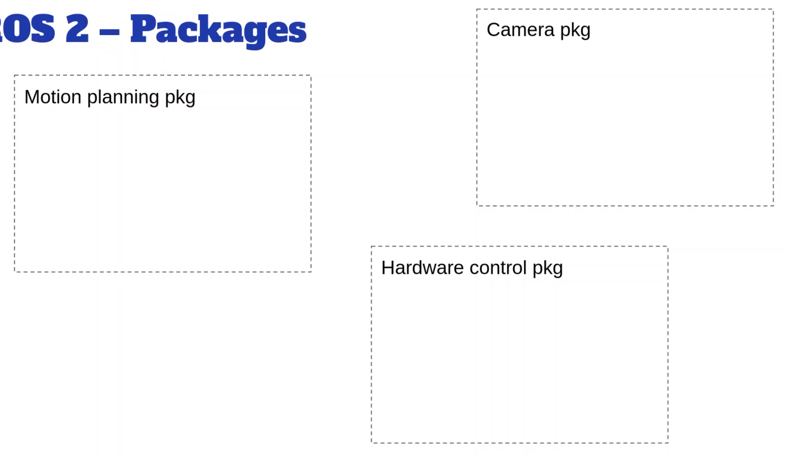
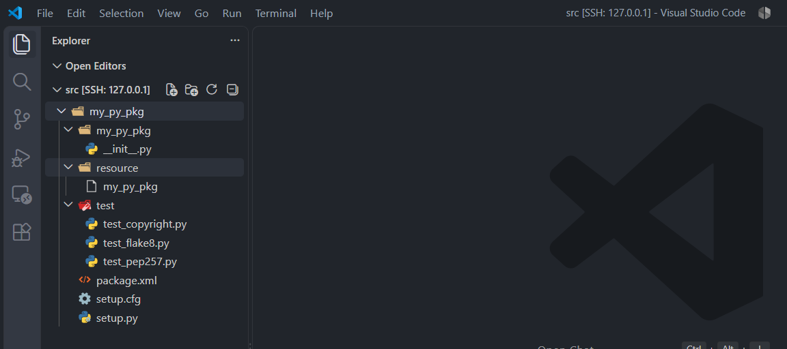

# 创建一个ROS2工作空间

> 创建和设置一个ROS2工作空间

> 编写所有ROS2应用程序代码的地方，也是安装和编译这些代码的地方

```bash
╭─ ~/HelloROS2
╰─❯ mkdir ros2_ws

╭─ ~/HelloROS2
╰─❯ cd ros2_ws

╭─ ~/HelloROS2/ros2_ws #这个是ROS2工作空间
╰─❯ mkdir src

╭─ ~/HelloROS2/ros2_ws
╰─❯ tree
.
└── src #source目录，课程和应用程序创建的所有代码都位于src文件夹内

2 directories, 0 files
```

> 在工作目录下，可以执行`colcon build`

```bash
#如果该命令无效，确保使用了
#sudo apt install ros-dev-tools
#colcon是构建工具
╭─ ~/HelloROS2/ros2_ws
╰─❯ colcon build

Summary: 0 packages finished [0.77s]

#运行colcon build时自动生成了build install log 这三个文件夹
╭─ ~/HelloROS2/ros2_ws
╰─❯ dir
build  install  log  src

```

> 文件夹查看

```bash
╭─ ~/HelloROS2/ros2_ws
╰─❯ tree
.
├── build
│   └── COLCON_IGNORE
├── install #有一堆脚本，比如setup.bash setup.zsh 如果想访问工作空间的功能，就需要source它 
│   ├── COLCON_IGNORE
│   ├── local_setup.bash #只会source这个工作空间
│   ├── local_setup.ps1
│   ├── local_setup.sh
│   ├── _local_setup_util_ps1.py
│   ├── _local_setup_util_sh.py
│   ├── local_setup.zsh #只会source这个工作空间
│   ├── setup.bash #source全局ROS2安装和这个工作空间 #为了简单我们这里只使用这个，如果我在工作空间安装了东西并想使用它，就需要从这个工作空间中source这个setup.bash
│   ├── setup.ps1
│   ├── setup.sh
│   └── setup.zsh #source全局ROS2安装和这个工作空间
├── log
│   ├── build_2026-10-02_10-18-41
│   │   ├── events.log
│   │   └── logger_all.log
│   ├── COLCON_IGNORE
│   ├── latest -> latest_build
│   └── latest_build -> build_2026-10-02_10-18-41
└── src

8 directories, 15 files
```

> 如果在工作空间安装了东西并想使用它，就需要从这个工作空间中source这个`install/setup.bash` ~~当然，如果是myzsh则需要source `install/setup.zsh`~~ 

> 在~/.bashrc 末尾添加 `soruce ~/HelloROS2/ros2_ws/install/setup.bash`，即

```bash
#~/.bashrc 末尾目前有这样两行
source /opt/ros/jazzy/setup.bash
source ~/HelloROS2/ros2_ws/install/setup.bash
```

> 或者 在~/.zshrc 末尾添加 `soruce ~/HelloROS2/ros2_ws/install/setup.zsh`，即

```bash
#~/.zshrc 末尾目前有这样两行
source /opt/ros/jazzy/setup.zsh
source ~/HelloROS2/ros2_ws/install/setup.zsh
```

> 至此，如果打开一个新的终端，那么ROS2已被正确source，工作空间也被正确source

# 创建一个Python包

> 例如，在一个应用程序中，可以有一个包来处理摄像头，另一个包来运行机器人的轮子，还有一个包来处理机器人在环境中的运动规划



> 这里先创建一个简单Python包，将在整个课程中学习更多关于包和最佳实践的知识

> ROS2中，Python包和C++包具有完全不同的架构

> ament是构建系统；colcon是构建工具
> ament_python 表明这是一个Python包
> my_py_pkg，命名规范，多个单词之间下划线隔开
> --dependencies rclpy ，rclpy是Python库，因此可以使用Python代码来使用ROS2功能。如果要编写Python节点，我们希望使用Python ROS

```python
#使用ROS2命令行工具创建包
╭─ ~/HelloROS2/ros2_ws/src
╰─❯ ros2 pkg create my_py_pkg --build-type ament_python --dependencies rclpy
going to create a new package
package name: my_py_pkg
destination directory: /home/ly/HelloROS2/ros2_ws/src
package format: 3
version: 0.0.0
description: TODO: Package description
maintainer: ['ly <lwmfjc@gmail.com>']
licenses: ['TODO: License declaration']
build type: ament_python
dependencies: ['rclpy']
creating folder ./my_py_pkg
creating ./my_py_pkg/package.xml
creating source folder
creating folder ./my_py_pkg/my_py_pkg
creating ./my_py_pkg/setup.py
creating ./my_py_pkg/setup.cfg
creating folder ./my_py_pkg/resource
creating ./my_py_pkg/resource/my_py_pkg
creating ./my_py_pkg/my_py_pkg/__init__.py
creating folder ./my_py_pkg/test
creating ./my_py_pkg/test/test_copyright.py
creating ./my_py_pkg/test/test_flake8.py
creating ./my_py_pkg/test/test_pep257.py

#说明没有开源许可证文件
[WARNING]: Unknown license 'TODO: License declaration'.  This has been set in the package.xml, but no LICENSE file has been created.
It is recommended to use one of the ament license identifiers:
Apache-2.0
BSL-1.0
BSD-2.0
BSD-2-Clause
BSD-3-Clause
GPL-3.0-only
LGPL-3.0-only
MIT

╭─ ~/HelloROS2/ros2_ws/src
╰─❯ ls
my_py_pkg
```

> 接下来，在windows中的vscode中，打开远程（ssh）的/home/ly/HelloROS2/ros2_ws/src/ 目录  



```bash
╭─ ~/HelloROS2/ros2_ws/src
╰─❯ tree
.
└── my_py_pkg
    ├── my_py_pkg #名称与包名相同
    │   └── __init__.py #编写Python代码的地方
    ├── package.xml
    ├── resource
    │   └── my_py_pkg
    ├── setup.cfg
    ├── setup.py
    └── test
        ├── test_copyright.py
        ├── test_flake8.py
        └── test_pep257.py

5 directories, 8 files
```

> package.xml 文件相当重要，对于任何ROS包都是必须的

```xml
<?xml version="1.0"?>
<?xml-model href="http://download.ros.org/schema/package_format3.xsd" schematypens="http://www.w3.org/2001/XMLSchema"?>
<package format="3">
  <name>my_py_pkg</name>
  <version>0.0.0</version>
  <description>TODO: Package description</description>
  <maintainer email="lwmfjc@gmail.com">ly</maintainer>
  <license>TODO: License declaration</license>

  <!--因为我们在命令行创建包时提供了依赖项-->
  <depend>rclpy</depend>

  <test_depend>ament_copyright</test_depend>
  <test_depend>ament_flake8</test_depend>
  <test_depend>ament_pep257</test_depend>
  <test_depend>python3-pytest</test_depend>

  <export>
    <!--构建类型-->
    <build_type>ament_python</build_type>
  </export>
</package>

```

> 安装节点时将使用 `setup.cfg` 和 `setup.py` ~~创建节点时会回头讲这个~~ 

```config
[develop]
script_dir=$base/lib/my_py_pkg
[install]
install_scripts=$base/lib/my_py_pkg
```

```python
from setuptools import find_packages, setup

package_name = 'my_py_pkg'

setup(
    name=package_name,
    version='0.0.0',
    packages=find_packages(exclude=['test']),
    data_files=[
        ('share/ament_index/resource_index/packages',
            ['resource/' + package_name]),
        ('share/' + package_name, ['package.xml']),
    ],
    install_requires=['setuptools'],
    zip_safe=True,
    maintainer='ly',
    maintainer_email='lwmfjc@gmail.com',
    description='TODO: Package description',
    license='TODO: License declaration',
    extras_require={
        'test': [
            'pytest',
        ],
    },
    entry_points={
        'console_scripts': [
        ],
    },
)
```

> 即使目前没有节点，照样可以构建他

```bash
#切换到ros2_ws，即工作目录
╭─ ~/HelloROS2/ros2_ws
╰─❯ colcon build
Starting >>> my_py_pkg
Finished <<< my_py_pkg [4.57s]

#包已经构建完成
Summary: 1 package finished [5.34s]
```

> 也可以只构建某些包

```bash
 ~/HelloROS2/ros2_ws
╰─❯ colcon build --packages-select my_py_pkg
Starting >>> my_py_pkg
Finished <<< my_py_pkg [2.89s]

Summary: 1 package finished [3.12s]
```

> 现在Python包已经准备好容纳一个节点了

# 创建一个CPP包

