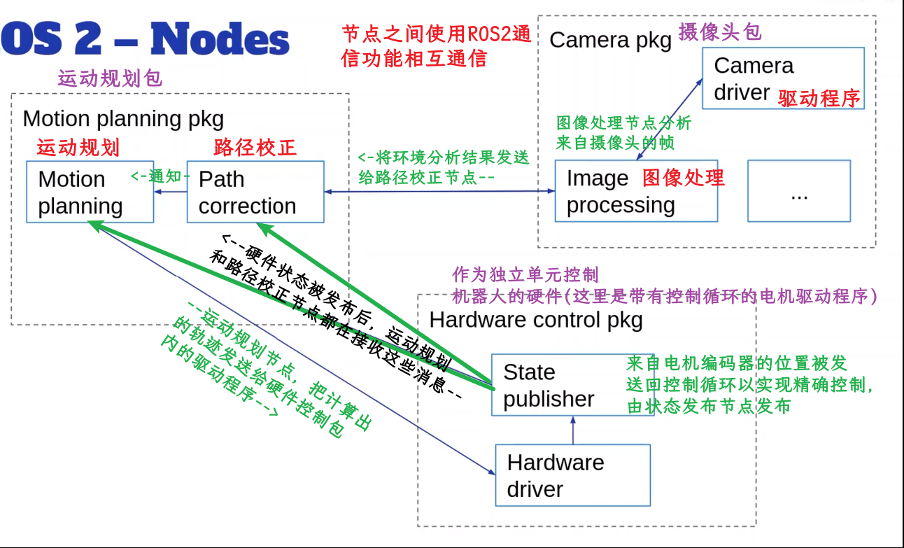
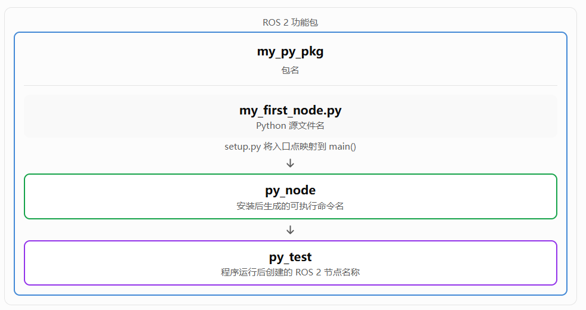
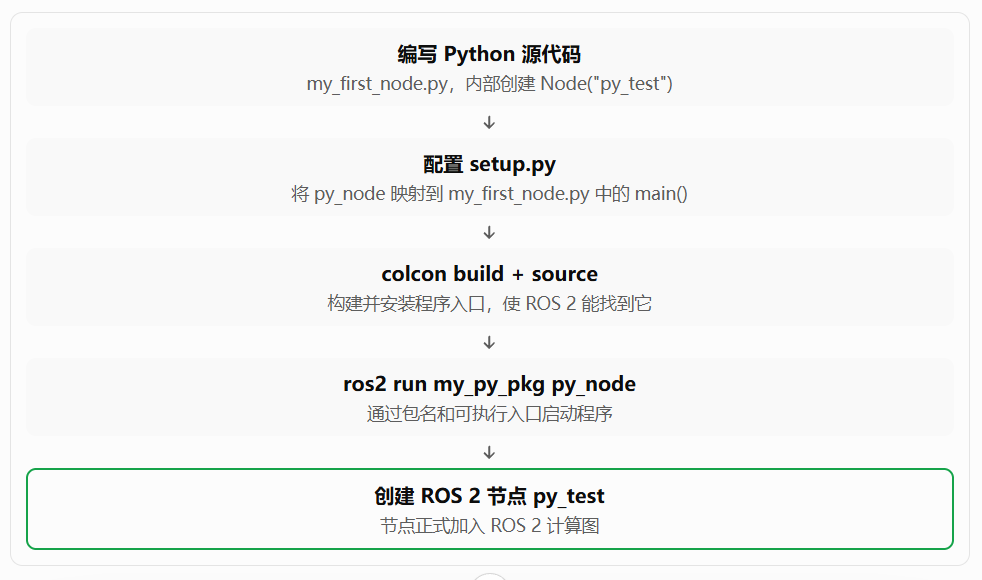

# 什么是ROS2节点

> 节点是应用程序的一个子部分，可以使用Python或C++语言对其进行编码

> 一个节点应该只有一个单一的目的，应用程序将包含很多节点，这些***节点将放入包***中，***节点之间将相互通信***

> 示例 ~~每个节点可以单独启动~~ 
> 有时很难判断是否将两个节点放入同一个包中：图像处理节点那可以是另一个包的一部分（因为可以让它只处理***任何***摄像头的图像） ~~这里还假设摄像头驱动程序和图像处理拥有同样依赖项（所以放同一个包中）~~ 

  
1. 运动规划包（Motion planning pkg）
   - Path correction（路径校正节点）： 接收视觉分析发来的环境信息，进行路径校正，并向运动规划节点发送通知。   
   - Motion planning（运动规划节点）： 结合校正后的路径与硬件状态数据，计算出机器人的运动轨迹。   
2. 摄像头包（Camera pkg）
   - Camera driver（驱动程序节点）： 负责获取摄像头的原始图像帧，并将其传递给图像处理节点。   
   - Image processing（图像处理节点）： 对摄像头图像进行处理分析，并将环境分析结果发送给路径校正节点（Path correction）。   
3. 硬件控制包（Hardware control pkg）
   作为一个独立单元控制机器人的底层硬件（如带有控制循环的电机驱动程序）：   
   - State publisher（状态发布节点）： 将来自电机编码器等硬件的位置/状态信息发布出去；运动规划节点和路径校正节点都会接收这些硬件状态消息。   
   - Hardware driver（硬件驱动节点）： 接收来自运动规划节点（Motion planning）计算好的轨迹指令，驱动底盘或电机运行；同时将其运行数据传给状态发布节点。   

数据流与通信关系

- 摄像头 ➔ 路径校正： 图像处理节点分析环境后，将分析结果发送给 Path correction 节点。   
- 路径校正 ➔ 运动规划： Path correction 节点向 Motion planning 节点发送通知。   
- 硬件状态反馈： State publisher 节点发布硬件状态后，Motion planning 和 Path correction 节点都在接收这些状态消息。   
- 控制指令下发： Motion planning 节点将计算出的轨迹直接发送给 Hardware driver 执行。   

> 节点是应用程序的一个子程序，负责一件事，就像在使用面向对象编程编写类一样，您知道该类只服务于单一目的

> 节点组合成一个图，并使用话题、服务、参数等相互通信。 ~~接下来的部分将介绍通信工具~~ 

> 节点的优点

- 降低代码复杂度（是程序容易扩展）
- 极好的容错能力，如果在不同进程中运行节点，那么他们不是直接连接的，可以借助ROS2通信继续通信 ~~如果一个节点崩溃不会导致其他节点（功能）崩溃~~ 
- 与语言无关 ~~可以使用Python、CPP且他们之间可以通信~~ 
    - 可以使用Python开发大部分应用程序，而某些节点 ~~需要快速执行速度的~~ 用CPP编写

> 两个节点不能有相同名称，如果想运行同一个节点多个实例，那么必须修改它们的名称或者放入不同的命名空间，例如

```bash
ros2 run demo_nodes_cpp talker 
```

里面：

- demo_nodes_cpp = ***ROS 2 软件包（package）名称***
- talker = ***可执行程序（executable）名称***
    - 默认情况下：***可执行程序名 = 节点名***  ~~指的不是自动，而是手动在.py程序中编写`node = Node("talker")`~~ 

```bash
#程序启动后，把节点名字改成 talker1
ros2 run demo_nodes_cpp talker --ros-args --name talker1
#或者把它放入另一个命名空间
ros2 run demo_nodes_cpp talker --ros-args -r __ns:=/robot1
```

默认命名空间是：`/` ，也就是根命名空间（root namespace）。

所以：`ros2 run demo_nodes_cpp talker`

实际上创建的是：

```bash
节点名: /talker
命名空间: /
```

> 接下来将看到如何实际在Python和C++中创建节点，使用命令行工具使用它们，然后如何让它们通信

# 编写一个Python节点(最小代码)

```bash
#先切换到Python包所在的目录
╭─ ~/HelloROS2/ros2_ws/src/my_py_pkg
╰─❯ ls
my_py_pkg  package.xml  resource  setup.cfg  setup.py  test

#进入与包同名的文件夹
╭─ ~/HelloROS2/ros2_ws/src/my_py_pkg
╰─❯ cd my_py_pkg

╭─ ~/HelloROS2/ros2_ws/src/my_py_pkg/my_py_pkg
╰─❯ ls
__init__.py

╭─ ~/HelloROS2/ros2_ws/src/my_py_pkg/my_py_pkg
╰─❯ touch my_first_node.py

```

在VSCode中打开 `ros2_ws/src` 文件夹  

```python
#!/usr/bin/env python3

#请系统调用 /usr/bin/env，让它在当前环境的 PATH 中（按照目录顺序）找到 python3（这个可执行程序），然后用这个 Python3 来执行本文件。
#记得现在VSCode安装ROS拓展
import rclpy 
from rclpy.node import Node

def main(args=None):
    #将初始化ROS2通信以及需要的所有内容，以便创建和使用节点
    rclpy.init(args=args)
    #创建一个节点，给它一个名称：py_test
    node=Node("py_test")
    #在终端打印内容
    node.get_logger().info("Hello world");
    #关闭
    rclpy.shutdown()

#如果直接从终端运行程序则执行main
if __name__ == "__main__":
    main()

```

> 执行

```bash
╭─ ~/HelloROS2/ros2_ws/src/my_py_pkg/my_py_pkg
╰─❯ ls
__init__.py  my_first_node.py

╭─ ~/HelloROS2/ros2_ws/src/my_py_pkg/my_py_pkg
╰─❯ chmod +x my_first_node.py

╭─ ~/HelloROS2/ros2_ws/src/my_py_pkg/my_py_pkg
╰─❯ ./my_first_node.py
[INFO] [1790938553.858442914] [py_test]: Hello world
```

> 修改程序并在`rclpy.shutdown()`之前添加`rclpy.spin(node)`

```python
#!/usr/bin/env python3

#请系统调用 /usr/bin/env，让它在当前环境的 PATH 中（按照目录顺序）找到 python3（这个可执行程序），然后用这个 Python3 来执行本文件。
#记得现在VSCode安装ROS拓展
import rclpy 
from rclpy.node import Node

def main(args=None):
    #将初始化ROS2通信以及需要的所有内容，以便创建和使用节点
    rclpy.init(args=args)
    #创建一个节点，给它一个名称：py_test
    node=Node("py_test")
    #在终端打印内容
    node.get_logger().info("Hello world");
    #spin将使节点保持存活，知道按下Ctrl+C
    rclpy.spin(node)
    #关闭
    rclpy.shutdown()

#如果直接从终端运行程序则执行main
if __name__ == "__main__":
    main()
    
```

## 直接执行节点.py文件

```bash
╭─ ~/HelloROS2/ros2_ws/src/my_py_pkg/my_py_pkg
╰─❯ ./my_first_node.py
[INFO] [1790938735.830189034] [py_test]: Hello world
^CTraceback (most recent call last): #这里我按了ctrl+c，报错是正常的
  File "/home/ly/HelloROS2/ros2_ws/src/my_py_pkg/my_py_pkg/./my_first_node.py", line 22, in <module>
    main()
  File "/home/ly/HelloROS2/ros2_ws/src/my_py_pkg/my_py_pkg/./my_first_node.py", line 16, in main
    rclpy.spin(node)
  File "/opt/ros/jazzy/lib/python3.12/site-packages/rclpy/__init__.py", line 247, in spin
    executor.spin_once()
  File "/opt/ros/jazzy/lib/python3.12/site-packages/rclpy/executors.py", line 926, in spin_once
    self._spin_once_impl(timeout_sec)
  File "/opt/ros/jazzy/lib/python3.12/site-packages/rclpy/executors.py", line 907, in _spin_once_impl
    handler, entity, node = self.wait_for_ready_callbacks(
                            ^^^^^^^^^^^^^^^^^^^^^^^^^^^^^^
  File "/opt/ros/jazzy/lib/python3.12/site-packages/rclpy/executors.py", line 877, in wait_for_ready_callbacks
    return next(self._cb_iter)
           ^^^^^^^^^^^^^^^^^^^
  File "/opt/ros/jazzy/lib/python3.12/site-packages/rclpy/executors.py", line 781, in _wait_for_ready_callbacks
    wait_set.wait(timeout_nsec)
KeyboardInterrupt
```

> 刚刚是直接执行文件，但是我们需要的是**安装它并创建一个可执行文件**，然后可以用ROS2命令行启动它

## 安装节点

> 更准确地说是构建并安装功能包

> 修改my_py_pkg/setup.py

```python
from setuptools import find_packages, setup

package_name = 'my_py_pkg'

setup(
    #省略了
    #只修改下面这个块
    entry_points={
        'console_scripts': [
            #文件夹my_py_pkg下的my_first_node.py文件
            #main是.py文件中的函数
            #py_node 是可执行文件的名称
            "py_node = my_py_pkg.my_first_node:main",
            #可以再添加其他的可执行文件，和上面同样的格式即可
        ],
    },
)

```

> 切换回工作空间进行操作

> colcon 会根据 setup.py 中的 console_scripts 配置，生成名为 py_node 的可执行入口，并将它安装到工作空间的 install 目录中。

```bash
╭─ ~/HelloROS2/ros2_ws/src/my_py_pkg/my_py_pkg                    
╰─❯ cd ~/HelloROS2/ros2_ws

#构建Python的那个包
╭─ ~/HelloROS2/ros2_ws
╰─❯ colcon build --packages-select my_py_pkg
Starting >>> my_py_pkg
Finished <<< my_py_pkg [4.99s]

Summary: 1 package finished [6.04s]
```

> 由于在工作空间中创建了新东西，所以需要source工作空间

```bash
source install/setup.sh
#或者(如果是ohmyzsh终端)
source install/setup.zsh
#或者（因为最后有两行 source /opt/ros/jazzy/setup.bash 和 source ~/HelloROS2/ros2_ws/install/setup.bash
source ~/.bashrc
#或者(如果是ohmyzsh终端)
source ~/.zshrc
```

> 这里我切换到了用户根目录，然后仅仅source 工作空间下的install的setup.zsh

## 启动节点

> 程序运行后，ROS 2 会通过节点名称来识别和管理这个节点

```bash
╭─ ~
╰─❯ ls -l  HelloROS2/ros2_ws/src/my_py_pkg/my_py_pkg/my_first_node.py
-rwxr-xr-x 1 ly ly 761 Oct  2 18:57 HelloROS2/ros2_ws/src/my_py_pkg/my_py_pkg/my_first_node.py

#这里去不去除都没事，我只是验证他没有可执行权限也可以通过ros2命令运行
╭─ ~
╰─❯ chmod -x  HelloROS2/ros2_ws/src/my_py_pkg/my_py_pkg/my_first_node.py

╭─ ~
╰─❯ ls -l  HelloROS2/ros2_ws/src/my_py_pkg/my_py_pkg/my_first_node.py
-rw-r--r-- 1 ly ly 761 Oct  2 18:57 HelloROS2/ros2_ws/src/my_py_pkg/my_py_pkg/my_first_node.py

#其中 my_py_pkg py_node 都支持自动补全
#可执行文件名py_node是 setup.py中创建的 "py_node = my_py_pkg.my_first_node:main"，是安装节点之后才有的东西
#my_first_node.py中的node=Node("py_test")中的"py_test"是节点名称
#my_py_pkg 是包名
╭─ ~
╰─❯ ros2 run  my_py_pkg py_node
[INFO] [1790939723.045164980] [py_test]: Hello world

```

> 1. 可执行文件名py_node是 `setup.py`中创建的 `"py_node = my_py_pkg.my_first_node:main"`，是安装节点之后才有的东西
> 2. `my_first_node.py`中的`node=Node("py_test")`中的"py_test"是节点名称
> 3. 可执行文件名，和节点名称，是不同的东西
> 4. `my_first_node.py` 是文件名

它们的关系是：

| 名称                 | 作用                           |
| ------------------ | ---------------------------- |
| `my_py_pkg`        | ROS 2 功能包名，用于定位程序所属的包        |
| `my_first_node.py` | Python 源代码文件名                |
| `py_node`          | 安装后用于启动程序的可执行命令名             |
| `py_test`          | ROS 2 节点名称，供 ROS 2 通信系统识别和管理 |

> 包名、源文件名、可执行命令名、节点名称---他们之间的关系

  
> 完整的执行流程




> 我们在文件内部创建了节点（有节点名称），有文件名，有创建的可执行文件名 ~~配置后构建并安装功能包~~ 

> 有时候节点名称(`py_test`)、文件名(`my_first_node.py`)、执行文件名(`py_node`)是相同的。比如创建了一个温度传感器文件，可能会将文件名命名为 temperature_sensor.py，节点名称可能是 temperature_sensor，可执行文件名也可能是 temperature_sensor

> 目前，在包下的与包名的同名文件夹my_py_pkg下编写了文件my_first_node.py来编写节点，编写节点基本版本（有节点名称），安装该节点（有执行文件名）并从终端运行该节点

# 使用面向对象编程改进该节点

> 使用继承方式组织节点代码

> 这将使节点更具扩展性，根据官方指南，这是在ROS2编写代码的推荐方式

> 为节点创建一个类，有了这个类之后将拥有一个模版，用于将来创建的任何节点

> 这里我把原`my_first_node.py`重命名为了`my_first_node_dian_py.bak`，然后新建了一个 `my_first_node.py`

> `my_first_node.py`内容

```python
#!/usr/bin/env python3

#请系统调用 /usr/bin/env，让它在当前环境的 PATH 中（按照目录顺序）找到 python3（这个可执行程序），然后用这个 Python3 来执行本文件。
#记得现在VSCode安装ROS拓展
import rclpy 
from rclpy.node import Node

class MyNode(Node):
    def __init__(self):
        super().__init__("py_test")
        self.get_logger().info("Hello world")
        

def main(args=None):
    #将初始化ROS2通信以及需要的所有内容，以便创建和使用节点
    rclpy.init(args=args)
    #创建一个节点，给它一个名称：py_test
    node=MyNode() 
    #spin将使节点保持存活，知道按下Ctrl+C
    rclpy.spin(node)
    #关闭
    rclpy.shutdown()

#如果直接从终端运行程序则执行main
if __name__ == "__main__":
    main()

```

> 在工作目录ros2_ws文件夹中使用`colcon build`  

```bash
#① 构建功能包
╭─ ~/HelloROS2/ros2_ws main !1
╰─❯ colcon build --packages-select my_py_pkg
Starting >>> my_py_pkg
Finished <<< my_py_pkg [4.71s]

Summary: 1 package finished [5.85s]

#② 加载构建后的环境
#工作空间被source后包含了所有的新更新
╭─ ~/HelloROS2/ros2_ws main !1                                             
╰─❯ source install/setup.zsh

#③ 运行可执行程序
╭─ ~/HelloROS2/ros2_ws main !1
╰─❯ ros2 run my_py_pkg py_node
[INFO] [1790998299.657390737] [py_test]: Hello world
```

## 定时器

> 修改my_first_node.py

```python
#!/usr/bin/env python3

#请系统调用 /usr/bin/env，让它在当前环境的 PATH 中（按照目录顺序）找到 python3（这个可执行程序），然后用这个 Python3 来执行本文件。
#记得现在VSCode安装ROS拓展
import rclpy 
from rclpy.node import Node

class MyNode(Node):
    def __init__(self):
        super().__init__("py_test")
        self.get_logger().info("Hello world")
        #多少秒(1.0秒)调用一次 callback
        self.create_timer(1.0,self.timer_callback)
    def timer_callback(self):
        self.get_logger().info("Hello")

def main(args=None):
    #将初始化ROS2通信以及需要的所有内容，以便创建和使用节点
    rclpy.init(args=args)
    #创建一个节点，给它一个名称：py_test
    node=MyNode() 
    #spin将使节点保持存活，知道按下Ctrl+C
    rclpy.spin(node)
    #关闭
    rclpy.shutdown()

#如果直接从终端运行程序则执行main
if __name__ == "__main__":
    main()

```

> build 构建功能包 --> source 加载构建后的环境 --> run 运行可执行程序

```bash
# ① 构建功能包
colcon build --packages-select my_py_pkg
# Starting >>> my_py_pkg
# Finished <<< my_py_pkg
# Summary: 1 package finished

# ② 加载构建后的环境
source install/setup.zsh

# ③ 运行可执行程序
ros2 run my_py_pkg py_node

# ④ 程序内部创建节点：
# node = Node("py_test")
#
# 所以运行后可以看到：
[INFO] [1790998727.245336670] [py_test]: Hello world
[INFO] [1790998728.247261198] [py_test]: Hello
[INFO] [1790998729.247369154] [py_test]: Hello
[INFO] [1790998730.247471364] [py_test]: Hello
[INFO] [1790998731.247696087] [py_test]: Hello
```

## 增加次数累计

```python
#!/usr/bin/env python3

#请系统调用 /usr/bin/env，让它在当前环境的 PATH 中（按照目录顺序）找到 python3（这个可执行程序），然后用这个 Python3 来执行本文件。
#记得现在VSCode安装ROS拓展
import rclpy 
from rclpy.node import Node

class MyNode(Node):
    def __init__(self):
        super().__init__("py_test")
        #简单的为这个类添加属性counter_
        self.counter_=0
        self.get_logger().info("Hello world")
        #多少秒(1.0秒)调用一次 callback
        self.create_timer(1.0,self.timer_callback)
    def timer_callback(self):
        #语法错误
        self.get_logger().info("Hello" str(self.counter_))
        #无错误版本
        #self.get_logger().info("Hello" + str(self.counter_))
        self.counter_+=1

def main(args=None):
    #将初始化ROS2通信以及需要的所有内容，以便创建和使用节点
    rclpy.init(args=args)
    #创建一个节点，给它一个名称：py_test
    node=MyNode() 
    #spin将使节点保持存活，知道按下Ctrl+C
    rclpy.spin(node)
    #关闭
    rclpy.shutdown()

#如果直接从终端运行程序则执行main
if __name__ == "__main__":
    main()

```

```bash
╭─ ~/HelloROS2/ros2_ws main !1
╰─❯ colcon build --packages-select my_py_pkg
Starting >>> my_py_pkg
--- stderr: my_py_pkg
  File "/home/ly/HelloROS2/ros2_ws/install/my_py_pkg/lib/python3.12/site-packages/my_py_pkg/my_first_node.py", line 17
    self.get_logger().info("Hello" str(self.counter_)) #语法错误
                           ^^^^^^^^^^^^^^^^^^^^^^^^^^
SyntaxError: invalid syntax. Perhaps you forgot a comma?

---
Finished <<< my_py_pkg [4.54s]

Summary: 1 package finished [4.99s]
  1 package had stderr output: my_py_pkg
  
#修改错误 #self.get_logger().info("Hello" + str(self.counter_))
#构建功能包
╭─ ~/HelloROS2/ros2_ws main !1
╰─❯ colcon build --packages-select my_py_pkg
Starting >>> my_py_pkg
Finished <<< my_py_pkg [4.54s]

Summary: 1 package finished [4.99s]

#加载构建后的环境
╭─ ~/HelloROS2/ros2_ws main !1   
╰─❯ source install/setup.zsh

#运行可执行程序
╭─ ~/HelloROS2/ros2_ws main !1
╰─❯ ros2 run my_py_pkg py_node
[INFO] [1790999320.374408691] [py_test]: Hello world
[INFO] [1790999321.376545372] [py_test]: Hello0
[INFO] [1790999322.376557890] [py_test]: Hello1
[INFO] [1790999323.376485171] [py_test]: Hello2
[INFO] [1790999324.376721472] [py_test]: Hello3

```

# 总结一下

> 最小代码并不是“非面向对象代码”，它直接实例化 ROS 2 提供的 Node 类；后面的写法则是在此基础上，通过继承 Node 创建自己的 MyNode 子类，再把节点的功能封装到这个类中。