# rqt 和 rqt_graph

> RQT，ROS中的一个工具，可以使用它进行内省，并与ROS应用程序内部许多内容交互。类似ROS2命令行，但这次使用的是图形用户界面

```bash
╭─ ~
╰─❯ rqt
WARNING: CPU random generator seem to be failing, disabling hardware random number generation
WARNING: RDRND generated: 0xffffffff 0xffffffff 0xffffffff 0xffffffff
```

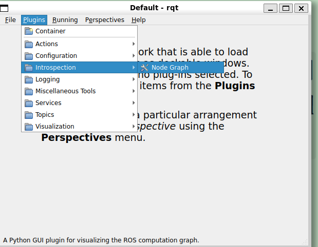

```bash
#或者直接命令行启动
╭─ ~            
╰─❯ rqt_graph
WARNING: CPU random generator seem to be failing, disabling hardware random number generation
WARNING: RDRND generated: 0xffffffff 0xffffffff 0xffffffff 0xffffffff
```

> 应用程序内部运行的所有节点的图

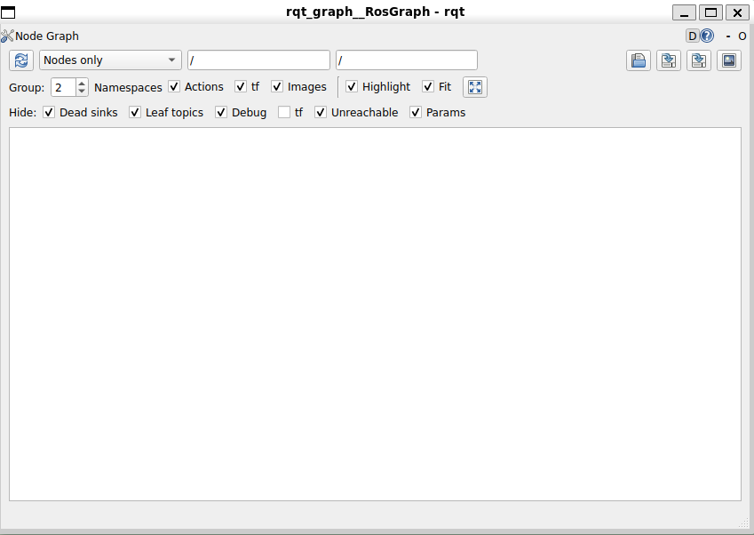  

> 运行两个节点

```bash
╭─ ~
╰─❯ ros2 run my_py_pkg py_node
[INFO] [1791099750.453740594] [py_test]: Hello world--symlink-install
[INFO] [1791099751.457387286] [py_test]: Hello0
[INFO] [1791099752.456476933] [py_test]: Hello1

╭─ ~/HelloROS2/ros2_ws main !1
╰─❯ ros2 run my_cpp_pkg cpp_node
[INFO] [1791099840.437328729] [cpp_test]: Hello world
[INFO] [1791099841.438061328] [cpp_test]: Hello 0
[INFO] [1791099842.438075946] [cpp_test]: Hello 1
```

> 刷新后出现

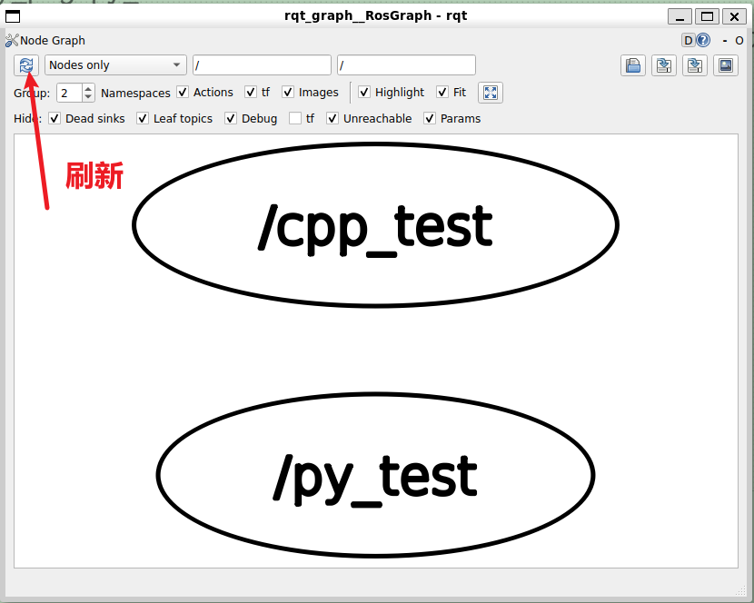

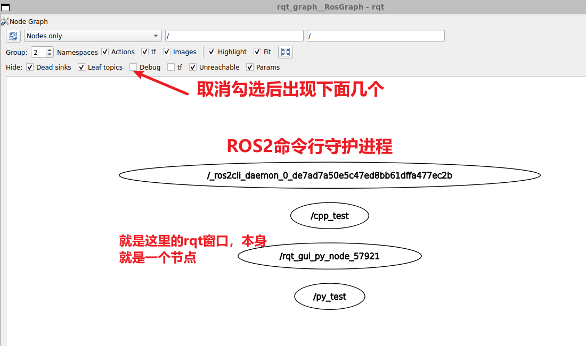  
> `/rosout` 是 ROS 系统中专门用来接收和记录所有节点日志信息（Logs）的全局话题/节点。   
> 其他所有节点（如 `/cpp_test`、`/py_test` 等）都会把日志发送给 `/rosout`，但 `/rosout` 不会再向其他计算节点转发数据（它只负责收集日志或写入控制台/文件）。因此在计算图的角度来看，它属于典型的 Dead Sink。***只要一个主题/节点“只有流入、没有流出”，就会被认定为 Dead sink***。
> `/rosout` 既是一个 Topic（主题），在 ROS 1 中同时也是一个独立的 Node（节点）。而在您截图的 ROS 2 rqt_graph 图中，框里显示的 `/rosout` 是 Topic（主题）。

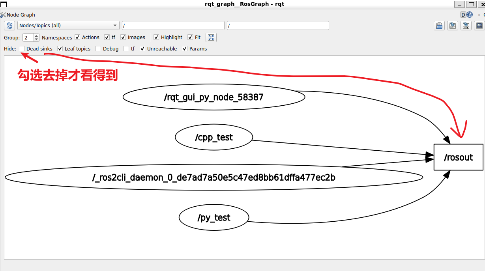

# 探索 turtlesim

```bash
#如果不能自动补全，先安装 sudo apt install ros-distro-turtlesim
#不过这个是ros2-desktop的一部分，应该不需再次安装
╭─ ~                                                                              6s
╰─❯ ros2 run turtlesim turtlesim_node
WARNING: CPU random generator seem to be failing, disabling hardware random number generation
WARNING: RDRND generated: 0xffffffff 0xffffffff 0xffffffff 0xffffffff
#这里，启动了在终端中打印内容的节点
[INFO] [1791101289.351772569] [turtlesim]: Starting turtlesim with node name /turtlesim
[INFO] [1791101289.393875049] [turtlesim]: Spawning turtle [turtle1] at x=[5.544445], y=[5.544445], theta=[0.000000]
```

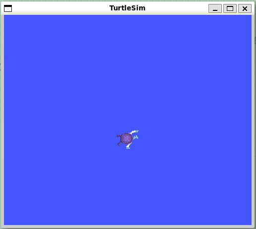

> 新开一个终端，启动另一个节点，来控制海龟
> 这个节点将从键盘读取输入

```bash
╭─ ~/HelloROS2/ros2_ws main !1
╰─❯ ros2 run turtlesim turtle_teleop_key
 Reading from keyboard
---------------------------
Use arrow keys to move the turtle.
Use g|b|v|c|d|e|r|t keys to rotate to absolute orientations. 'f' to cancel a rotation.
'q' to quit.

```

> 翻译：
> 1. 使用方向键（↑ ↓ ← →）移动海龟。
> 2. 使用 g | b | v | c | d | e | r | t 键旋转至绝对方向。按 'f' 键取消旋转。
> 3. 按 'q' 键退出。

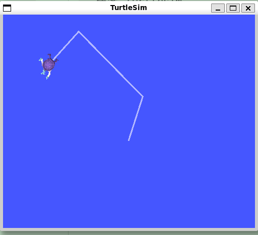  

> 打开rqt_graph

```bash
╭─ ~/HelloROS2/ros2_ws main !1
╰─❯ rqt_graph
WARNING: CPU random generator seem to be failing, disabling hardware random number generation
WARNING: RDRND generated: 0xffffffff 0xffffffff 0xffffffff 0xffffffff
```

> 两个节点：`/teleop_turtle`和`/turtlesim`

> `/teleop_turtle` 通过 `/turtle1/cmd_vel` ~~这个是主题~~  向 `/turtlesim` 发送消息

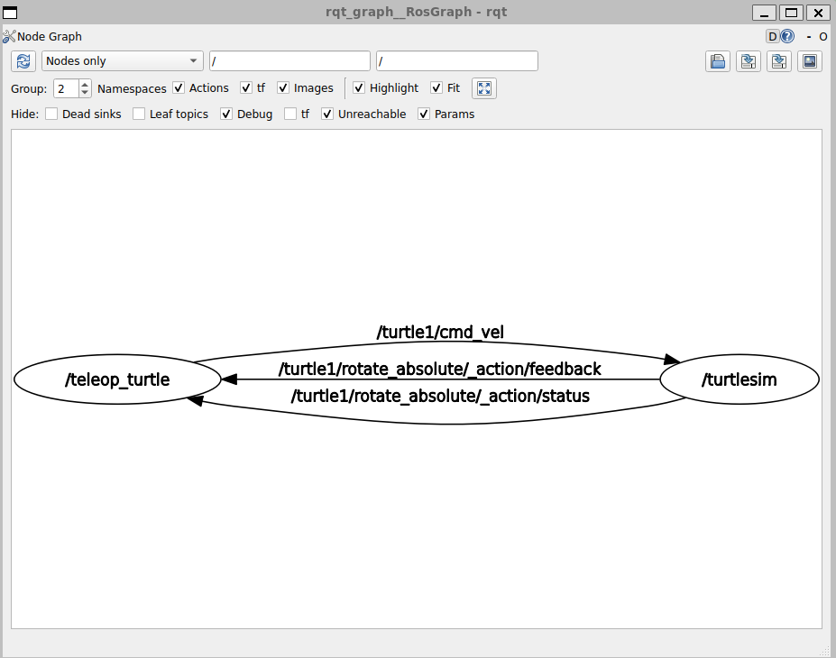

> 启动一个从键盘读取的节点`/teleop_turtle`，然后向`/turtlesim`发送命令，该节点将输出命令并将其提供给屏幕上的海龟

```bash
#重命名这个海龟地图节点并运行
╭─ ~                                 14s
╰─❯ ros2 run turtlesim turtlesim_node --ros-args -r __node:=my_turtle
WARNING: CPU random generator seem to be failing, disabling hardware random number generation
WARNING: RDRND generated: 0xffffffff 0xffffffff 0xffffffff 0xffffffff
[INFO] [1791102204.342105388] [my_turtle]: Starting turtlesim with node name /my_turtle
[INFO] [1791102204.403757386] [my_turtle]: Spawning turtle [turtle1] at x=[5.544445], y=[5.544445], theta=[0.000000]
```

> 刷新视图，名字已经切换了

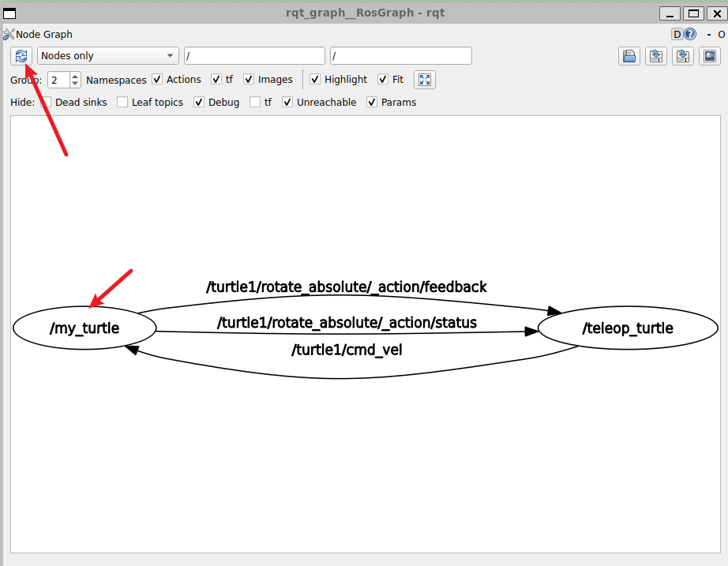 
# 解决方案(问答)

> 启动rqt时获得与这张图一样的视图

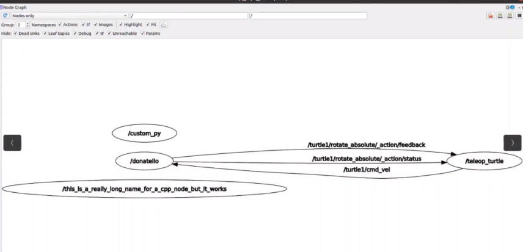

> 放大

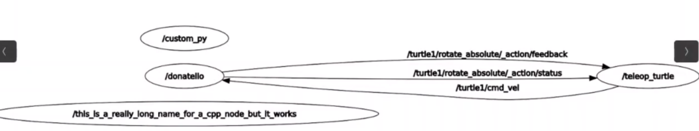  

```bash
#启动第一个节点并重命名
╭─ ~                         
╰─❯ ros2 run my_py_pkg py_node --ros-args -r __node:=custom_py
[INFO] [1791103391.710888770] [custom_py]: Hello world
[INFO] [1791103392.718825397] [custom_py]: Hello0
[INFO] [1791103393.714512280] [custom_py]: Hello1 

#启动第二个节点并重命名
╭─ ~/HelloROS2/ros2_ws main !1
╰─❯ ros2 run my_cpp_pkg cpp_node --ros-args -r __node:=this_is_really_long_name_for_a_cpp_node_but_it_works
[INFO] [1791103183.540914117] [this_is_really_long_name_for_a_cpp_node_but_it_works]: Hello world
[INFO] [1791103184.541767955] [this_is_really_long_name_for_a_cpp_node_but_it_works]: Hello 0
[INFO] [1791103185.541823245] [this_is_really_long_name_for_a_cpp_node_but_it_works]: Hello 1


#启动第三个节点并重命名，小乌龟地图
╭─ ~
╰─❯ ros2 run turtlesim turtlesim_node --ros-args -r __node:=donatello
WARNING: CPU random generator seem to be failing, disabling hardware random number generation
WARNING: RDRND generated: 0xffffffff 0xffffffff 0xffffffff 0xffffffff
[INFO] [1791103008.397418503] [donatello]: Starting turtlesim with node name /donatello
[INFO] [1791103008.428801402] [donatello]: Spawning turtle [turtle1] at x=[5.544445], y=[5.544445], theta=[0.000000]

#启动第四个节点（可以不重命名，因为默认名字就是图中那个）
╭─ ~/HelloROS2/ros2_ws main !1
╰─❯ ros2 run turtlesim turtle_teleop_key --ros-args -r __node:=teleop_turtle
Reading from keyboard
---------------------------
Use arrow keys to move the turtle.
Use g|b|v|c|d|e|r|t keys to rotate to absolute orientations. 'f' to cancel a rotation.
'q' to quit.
```

> 启动rqt后刷新

```bash
╭─ ~/HelloROS2/ros2_ws main !1
╰─❯ rqt_graph
WARNING: CPU random generator seem to be failing, disabling hardware random number generation
WARNING: RDRND generated: 0xffffffff 0xffffffff 0xffffffff 0xffffffff

```

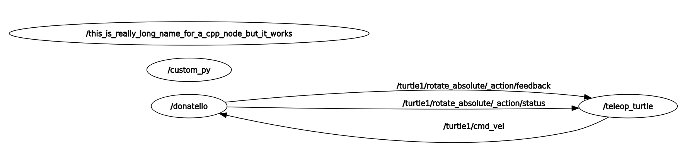