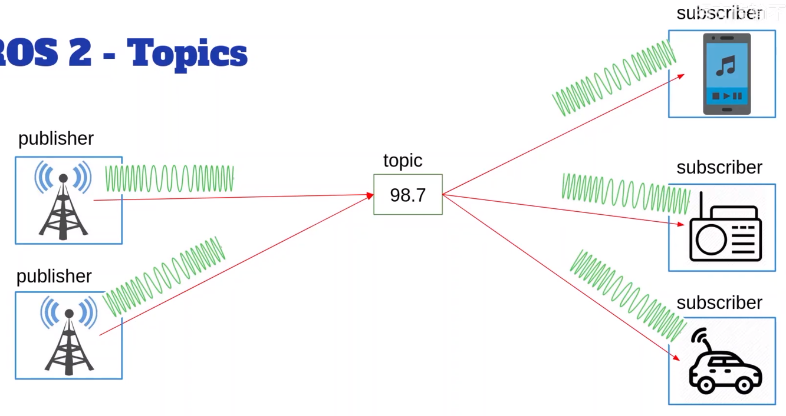
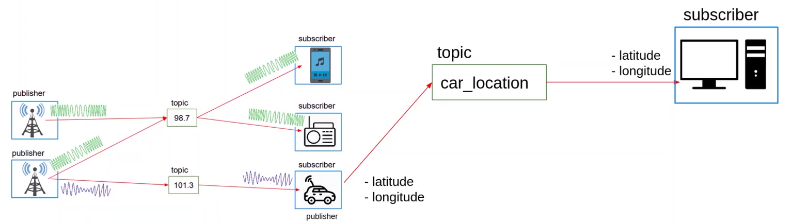

- Topic（话题）：ROS 2 节点之间进行数据通信的一个通道。
- Message（消息）：通过话题传输的具体数据。
- Publisher（发布者）：向话题发布消息的节点。
- Subscriber（订阅者）：订阅话题并接收消息的节点。

翻译  

| 英文             | ROS 2 常见中文翻译 | 含义                 |
| -------------- | ------------ | ------------------ |
| **Topic**      | **话题**       | 节点之间传递某类消息的“通道”    |
| **Publisher**  | **发布者**      | 向 Topic 发布消息的节点/实体 |
| **Subscriber** | **订阅者**      | 从 Topic 接收消息的节点/实体 |
| **Message**    | **消息**       | 实际传输的数据            |
| **Node**       | **节点**       | ROS 2 中的基本运行单元     |
| **Service**    | **服务**       | 请求—响应式通信           |
| **Client**     | **客户端**      | 发起 Service 请求的一方   |
| **Server**     | **服务端**      | 提供 Service 的一方     |

# 什么是Topic(话题)

## 类比

> 话题
> 类比：无线电发射器和无线电接收器  

  

> 1. 无线电发射器，会在某个特定频率 ~~话题~~ 发送数据
> 2. 手机 ~~订阅者~~，但是要在手机上播放来自无线电发射器的音乐，还需要发送和接收***相同类型*** ~~即数据结构~~ 的信号（如果无线发射器通过话题发送的是调频信号，而手机试图解码调幅信号，则无法工作）
> 3. 要确保发布者和订阅者都发送接收具有相同数据结构的消息
> 4. 可以有多个发布者、多个订阅者。也可以只订阅或者只发布，他们之间都不知道对方的存在，只知道topic ~~话题~~ 
> 5. 总结：可以在话题上发布数据，并订阅它以接收数据

> 一个节点可以在不同话题上发布不同类型 ~~数据结构~~ 的数据

  
> 1. 还需要注意的是，Node 是一个运行中的 ROS2 程序，而 Publisher 和 Subscriber 是这个 Node 内部创建出来的通信对象。所以一个 Node 可以同时拥有多个 Publisher 和多个 Subscriber。
> 2. Node 是程序；Publisher/Subscriber 是程序中的通信角色；Topic 是它们交换消息的通道。

## 总结

- 话题是一个命名的总线，节点通过它交换消息
- 话题名称必须以字母开头，包括字母、数字、下划线、波浪号、斜杠
- 从技术上讲，消息是通过DDS发送的，DDS是ROS2的中间件 ~~代码中使用的客户端（RCLCPP和RCLPY）将提供足够的抽象，无需处理DDS~~ 
- 当需要发送数据流时，需要使用话题
- 一些节点可以在话题上发布，一些节点可以订阅该话题
    - 订阅者不会向发送者发送响应，数据是单向只朝一个方向流动
    - 例子：传感器。有一个节点从传感器读取数据并发布到话题上，然后其他所有节点都可以监听该话题
- 发布者和订阅者是匿名的，发布者知道他在向某个话题发布，而订阅者只知道他在向某个话题订阅
- 话题有一个名称，还有消息类型。该话题上的所有发布者和订阅者都必须使用与该话题关联的消息类型
- 可以使用多种语言编写节点，RCLCPP库（C++），RCLPY库（Python），这些库也包含了话题功能。可以在节点内创建发布者或者订阅者
- 一个节点，可以包含，针对许多不同话题，的多个发布者和订阅者

> 可以轻松的将代码分离成独立的节点，然后让您的节点***通过发送到其他话题的数据流***进行通信
