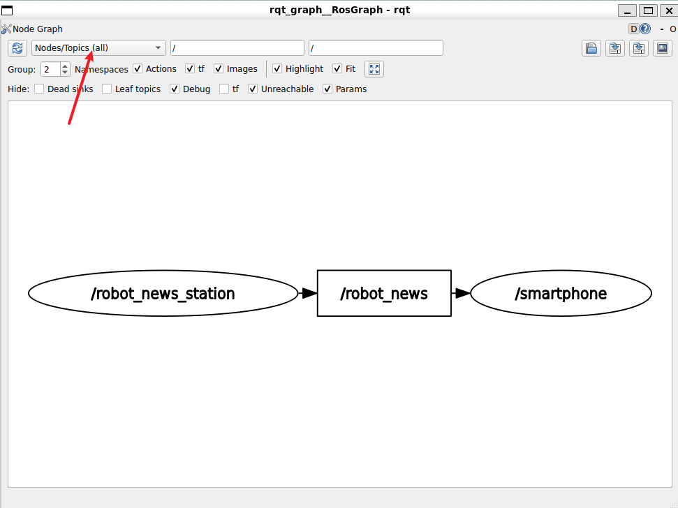
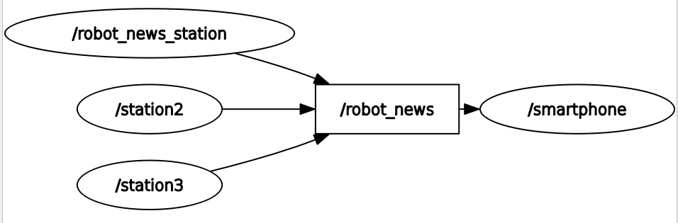
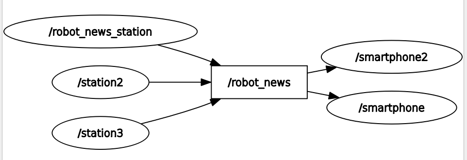
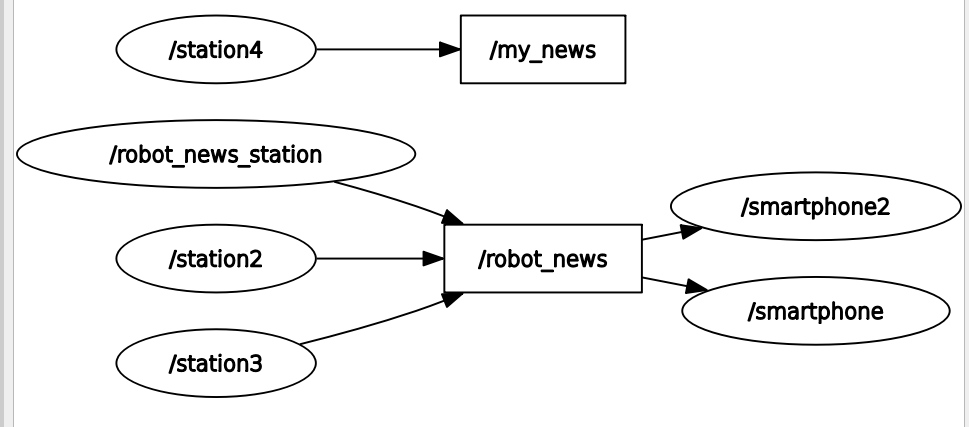

# 使用rqt和rqt_graph监控话题

```bash
#发布者
╭─ ~/HelloROS2/ros2_ws main
╰─❯ ros2 run my_cpp_pkg robot_news_station
[INFO] [1791269361.482275319] [robot_news_station]: Robot News Station has been started

#订阅者
╭─ ~/HelloROS2/ros2_ws main
╰─❯ ros2 run my_py_pkg smartphone
[INFO] [1791269375.849771364] [smartphone]: Smartphone has been started.
[INFO] [1791269376.429802152] [smartphone]: Hi,this is R2D2 from the robot news station.


```

> 1. 如图，方框 `/robot_news` 是一个话题，`/robot_news_station` 在向该话题发布，`/smartphone`从该话题接收数据
> 2. 如果看到通信不起作用，就可以打开rqt_graph查看 ~~注意，终端cli中启动的发布者和订阅者还是都看不到~~ 



```bash
#再运行一个发布者
╭─ ~/HelloROS2/ros2_ws main     ✘ 254 3s
╰─❯ ros2 run my_py_pkg robot_news_station --ros-args -r __node:=station2
[INFO] [1791269924.077641824] [station2]: Robot News Station has been started.

```

  
> 再启动一个发布者

```bash
╭─ ~/HelloROS2/ros2_ws main
╰─❯ ros2 run my_py_pkg robot_news_station --ros-args -r __node:=station3
[INFO] [1791270026.884870681] [station3]: Robot News Station has been started.
```

  

> 再添加一个订阅者

```bash
╭─ ~/HelloROS2/ros2_ws main
╰─❯ ros2 run my_cpp_pkg smartphone --ros-args -r __node:=smartphone2
[INFO] [1791270133.314900394] [smartphone2]: Smartphone has been started.
[INFO] [1791270133.353832233] [smartphone2]: Hi, this is C3PO from the robot news station.
[INFO] [1791270133.483298589] [smartphone2]: Hi,this is R2D2 from the robot news station.
[INFO] [1791270133.537133343] [smartphone2]: Hi, this is C3PO from the robot news station.
[INFO] [1791270133.855190482] [smartphone2]: Hi, this is C3PO from the robot news station.
[INFO] [1791270133.983124855] [smartphone2]: Hi,this is R2D2 from the robot news station. 
```

  

> 再添加一个发布者，同时重映射主题

```bash
╭─ ~/HelloROS2/ros2_ws main
╰─❯ ros2 run my_cpp_pkg robot_news_station --ros-args -r __node:=station4 -r robot_news:=my_news
[INFO] [1791270272.970022515] [station4]: Robot News Station has been started

```




> 再添加一个订阅者通过重映射订阅`/my_news`

```bash
╭─ ~/HelloROS2/ros2_ws main
╰─❯ ros2 run my_py_pkg smartphone --ros-args -r __node:=smartphone3 -r robot_news:=my_news
[INFO] [1791270396.797759683] [smartphone3]: Smartphone has been started.
[INFO] [1791270400.775449603] [smartphone3]: Hi,this is R2D2 from the robot news station.
```

  
> 通过在运行时重命名节点和主题，可以让应用程序变得相当动态

# 使用turtlesim进行话题实验

> 使用turtlesim包和二维机器人仿真来进一步实验主题

