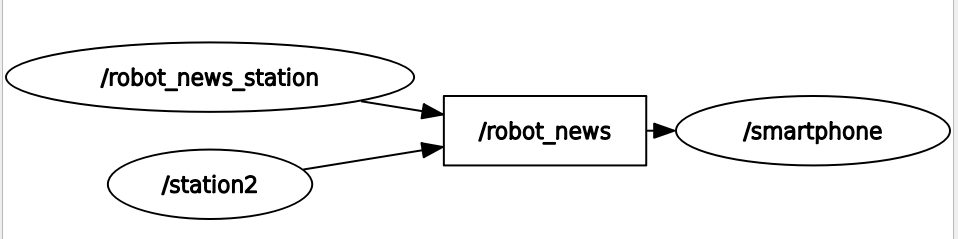
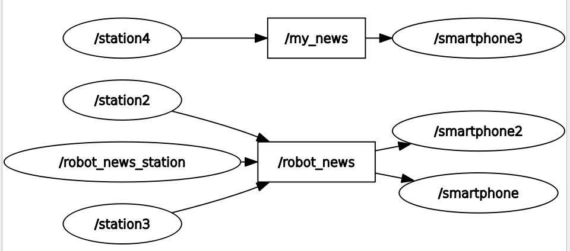
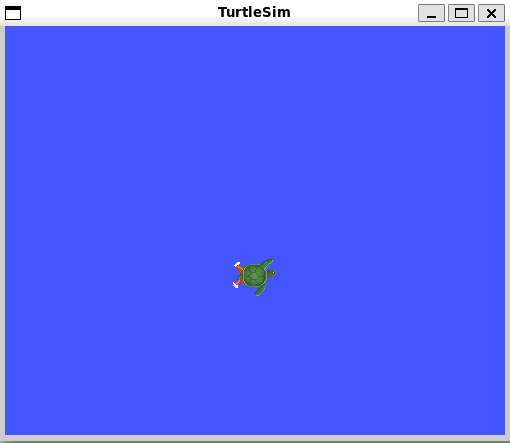
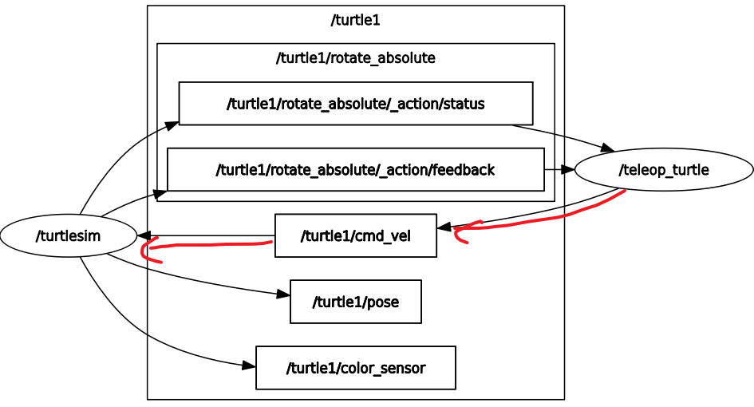
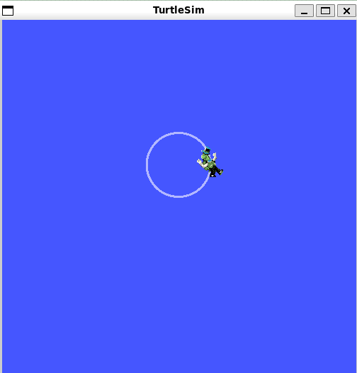

# 使用rqt和rqt_graph监控话题

```bash
#发布者
╭─ ~/HelloROS2/ros2_ws main
╰─❯ ros2 run my_cpp_pkg robot_news_station
[INFO] [1791269361.482275319] [robot_news_station]: Robot News Station has been started

#订阅者
╭─ ~/HelloROS2/ros2_ws main
╰─❯ ros2 run my_py_pkg smartphone
[INFO] [1791269375.849771364] [smartphone]: Smartphone has been started.
[INFO] [1791269376.429802152] [smartphone]: Hi,this is R2D2 from the robot news station.


```

> 1. 如图，方框 `/robot_news` 是一个话题，`/robot_news_station` 在向该话题发布，`/smartphone`从该话题接收数据
> 2. 如果看到通信不起作用，就可以打开rqt_graph查看 ~~注意，终端cli中启动的发布者和订阅者还是都看不到~~ 


```bash
#再运行一个发布者
╭─ ~/HelloROS2/ros2_ws main     ✘ 254 3s
╰─❯ ros2 run my_py_pkg robot_news_station --ros-args -r __node:=station2
[INFO] [1791269924.077641824] [station2]: Robot News Station has been started.

```

  
> 再启动一个发布者

```bash
╭─ ~/HelloROS2/ros2_ws main
╰─❯ ros2 run my_py_pkg robot_news_station --ros-args -r __node:=station3
[INFO] [1791270026.884870681] [station3]: Robot News Station has been started.
```

  

> 再添加一个订阅者

```bash
╭─ ~/HelloROS2/ros2_ws main
╰─❯ ros2 run my_cpp_pkg smartphone --ros-args -r __node:=smartphone2
[INFO] [1791270133.314900394] [smartphone2]: Smartphone has been started.
[INFO] [1791270133.353832233] [smartphone2]: Hi, this is C3PO from the robot news station.
[INFO] [1791270133.483298589] [smartphone2]: Hi,this is R2D2 from the robot news station.
[INFO] [1791270133.537133343] [smartphone2]: Hi, this is C3PO from the robot news station.
[INFO] [1791270133.855190482] [smartphone2]: Hi, this is C3PO from the robot news station.
[INFO] [1791270133.983124855] [smartphone2]: Hi,this is R2D2 from the robot news station. 
```

  

> 再添加一个发布者，同时重映射话题

```bash
╭─ ~/HelloROS2/ros2_ws main
╰─❯ ros2 run my_cpp_pkg robot_news_station --ros-args -r __node:=station4 -r robot_news:=my_news
[INFO] [1791270272.970022515] [station4]: Robot News Station has been started

```


> 再添加一个订阅者通过重映射订阅`/my_news`

```bash
╭─ ~/HelloROS2/ros2_ws main
╰─❯ ros2 run my_py_pkg smartphone --ros-args -r __node:=smartphone3 -r robot_news:=my_news
[INFO] [1791270396.797759683] [smartphone3]: Smartphone has been started.
[INFO] [1791270400.775449603] [smartphone3]: Hi,this is R2D2 from the robot news station.
```

  
> 通过在运行时重命名节点和话题，可以让应用程序变得相当动态

# 使用turtlesim进行话题实验

> 使用turtlesim包和二维机器人仿真来进一步实验话题

```bash
#启动小乌龟GUI
╭─ ~/HelloROS2/ros2_ws main
╰─❯ ros2 run turtlesim turtlesim_node
WARNING: CPU random generator seem to be failing, disabling hardware random number generation
WARNING: RDRND generated: 0xffffffff 0xffffffff 0xffffffff 0xffffffff
[INFO] [1791276517.934967195] [turtlesim]: Starting turtlesim with node name /turtlesim
[INFO] [1791276518.002575594] [turtlesim]: Spawning turtle [turtle1] at x=[5.544445], y=[5.544445], theta=[0.000000]
```

  

```bash
#启动小乌龟键盘控制
╭─ ~/HelloROS2/ros2_ws main
╰─❯ ros2 run turtlesim turtle_teleop_key 
Reading from keyboard
---------------------------
Use arrow keys to move the turtle.
Use g|b|v|c|d|e|r|t keys to rotate to absolute orientations. 'f' to cancel a rotation.
'q' to quit.
```

> gui查看话题

```bash
╭─ ~/HelloROS2/ros2_ws main
╰─❯ rqt_graph

```




> `geometry  [dʒiˈɒm.ə.tri]` 几何

```bash
╭─ ~/HelloROS2/ros2_ws main       9m 53s
╰─❯ ros2 node list
/teleop_turtle
/turtlesim

╭─ ~/HelloROS2/ros2_ws main
╰─❯ ros2 node info /turtlesim #订阅者
/turtlesim
  Subscribers:
    /parameter_events: rcl_interfaces/msg/ParameterEvent
    /turtle1/cmd_vel: geometry_msgs/msg/Twist #订阅类型（接口）
  Publishers:
    /parameter_events: rcl_interfaces/msg/ParameterEvent
    /rosout: rcl_interfaces/msg/Log
    /turtle1/color_sensor: turtlesim/msg/Color
    /turtle1/pose: turtlesim/msg/Pose
  Service Servers:
    /clear: std_srvs/srv/Empty
    /kill: turtlesim/srv/Kill
    /reset: std_srvs/srv/Empty
    /spawn: turtlesim/srv/Spawn
    /turtle1/set_pen: turtlesim/srv/SetPen
    /turtle1/teleport_absolute: turtlesim/srv/TeleportAbsolute
    /turtle1/teleport_relative: turtlesim/srv/TeleportRelative
    /turtlesim/describe_parameters: rcl_interfaces/srv/DescribeParameters
    /turtlesim/get_parameter_types: rcl_interfaces/srv/GetParameterTypes
    /turtlesim/get_parameters: rcl_interfaces/srv/GetParameters
    /turtlesim/get_type_description: type_description_interfaces/srv/GetTypeDescription
    /turtlesim/list_parameters: rcl_interfaces/srv/ListParameters
    /turtlesim/set_parameters: rcl_interfaces/srv/SetParameters
    /turtlesim/set_parameters_atomically: rcl_interfaces/srv/SetParametersAtomically
  Service Clients:

  Action Servers:
    /turtle1/rotate_absolute: turtlesim/action/RotateAbsolute
  Action Clients:

#查看节点turtle_teleop_key
╭─ ~/HelloROS2/ros2_ws main
╰─❯ ros2 node info /teleop_turtle
/teleop_turtle
  Subscribers:
    /parameter_events: rcl_interfaces/msg/ParameterEvent
  Publishers:
    /parameter_events: rcl_interfaces/msg/ParameterEvent
    /rosout: rcl_interfaces/msg/Log
    /turtle1/cmd_vel: geometry_msgs/msg/Twist #发布者
  Service Servers:
    /teleop_turtle/describe_parameters: rcl_interfaces/srv/DescribeParameters
    /teleop_turtle/get_parameter_types: rcl_interfaces/srv/GetParameterTypes
    /teleop_turtle/get_parameters: rcl_interfaces/srv/GetParameters
    /teleop_turtle/get_type_description: type_description_interfaces/srv/GetTypeDescription
    /teleop_turtle/list_parameters: rcl_interfaces/srv/ListParameters
    /teleop_turtle/set_parameters: rcl_interfaces/srv/SetParameters
    /teleop_turtle/set_parameters_atomically: rcl_interfaces/srv/SetParametersAtomically
  Service Clients:

  Action Servers:

  Action Clients:
    /turtle1/rotate_absolute: turtlesim/action/RotateAbsolute
```

> 查看话题列表

```bash
╭─ ~/HelloROS2/ros2_ws main
╰─❯ ros2 topic list
/parameter_events
/rosout
/turtle1/cmd_vel
/turtle1/color_sensor
/turtle1/pose

#查看话题信息
╭─ ~/HelloROS2/ros2_ws main
╰─❯ ros2 topic info /turtle1/cmd_vel
Type: geometry_msgs/msg/Twist
Publisher count: 1
Subscription count: 1

#查看接口信息
╭─ ~/HelloROS2/ros2_ws main
╰─❯ ros2 interface show geometry_msgs/msg/Twist  
# This expresses velocity in free space broken into its linear and angular parts.
#两个字段 linear，angular 
#linear.x，linear.y，linear.z
#angular.x，angular.y，angular.z
Vector3  linear
        float64 x
        float64 y
        float64 z
Vector3  angular
        float64 x
        float64 y
        float64 z
```

## 解释一下接口类型

你这里看到的 `geometry_msgs/msg/Twist`，可以把它理解成：

> **“描述一个物体在空间中怎么运动的消息类型”**。

它不是一个简单的 `float64`，而是一个**嵌套的数据结构**。

### 1. 最外层：Twist

实际上它可以近似理解成这样的结构：

```text
Twist
├── linear
│   ├── x : float64
│   ├── y : float64
│   └── z : float64
│
└── angular
    ├── x : float64
    ├── y : float64
    └── z : float64
```

也就是说，`Twist` 有两个字段：

```text
linear
angular
```

而且这两个字段的类型都不是 `float64`，而是：

```text
Vector3
```

---

### 2. `linear` 是什么？

`linear` 表示**线速度**：

```text
linear
├── x
├── y
└── z
```

三个值分别表示沿三个坐标轴方向的线速度。

例如：

```text
linear.x = 1.0
linear.y = 0.0
linear.z = 0.0
```

可以理解成：

> 沿 X 轴方向，以 `1.0` 的速度直线运动。

在机器人中经常把 X 轴理解成机器人**前方**，所以你会经常看到：

```cpp
cmd_vel.linear.x = 1.0;
```

意思就是：

> 让机器人向前运动。

---

### 3. `angular` 是什么？

> 一整圈 = 360° = 2π rad ≈ 6.28 rad

`angular` 表示**角速度**：

```text
angular
├── x
├── y
└── z
```

同样是三个轴：

* `angular.x`：绕 X 轴旋转
* `angular.y`：绕 Y 轴旋转
* `angular.z`：绕 Z 轴旋转

对于一个普通的**轮式小车**，最常用的是：

```text
linear.x
angular.z
```

例如：

```text
linear.x  = 1.0
angular.z = 0.5
```

意思大致就是：

> 小车一边向前运动，一边绕 Z 轴旋转。

> 可以把它想象成一个人在走路：人永远朝着自己脸的方向走，但同时不断转身。

$$boxed{半径=\frac{线速度}{角速度}}$$

$$r=\frac{1}{0.5}=2m$$  

所以小车就会走一个弧线。 ~~机器人以 1 m/s 沿着圆周运动，同时以 0.5 rad/s 绕圆心转，所以它的转弯半径是 2 米。~~ 

---

### 4. 为什么 `linear` 又是一个 `Vector3`？

这正是你现在学习 ROS 2 消息接口时比较重要的地方。

`Twist` 并不是：

```text
float64 linear
float64 angular
```

而是：

```text
Vector3 linear
Vector3 angular
```

而 `Vector3` 本身又是：

```text
Vector3
├── float64 x
├── float64 y
└── float64 z
```

所以实际上是**嵌套结构**：

```text
Twist
   │
   ├── linear ──→ Vector3
   │                ├── x : float64
   │                ├── y : float64
   │                └── z : float64
   │
   └── angular ─→ Vector3
                    ├── x : float64
                    ├── y : float64
                    └── z : float64
```

这和你之前理解的：

```text
example_interfaces/msg/String
        │
        └── data : string
```

是同一个思路。

只不过 `Twist` 更复杂一些。

---

### 5. 所以代码为什么这样写？

例如 Python：

```python
msg.linear.x = 1.0
msg.angular.z = 0.5
```

你可以按照“对象里面还有对象”来理解：

```text
msg
 │
 ├── linear
 │     │
 │     └── x = 1.0
 │
 └── angular
       │
       └── z = 0.5
```

相当于：

```python
msg.linear
```

先取得 `linear` 这个 `Vector3` 对象，

然后：

```python
msg.linear.x
```

再取得这个 `Vector3` 里面的 `x`。

---

### 6. 你终端里的那几行应该这样读

你看到：

```text
# This expresses velocity in free space broken into its linear and angular parts.

Vector3 linear
Vector3 angular
```

意思是：

> Twist 表示自由空间中的速度，由**线速度**和**角速度**两部分组成。

然后 `Vector3` 的定义：

```text
float64 x
float64 y
float64 z
```

所以完整展开就是：

```text
Twist
├── linear.x    float64
├── linear.y    float64
├── linear.z    float64
├── angular.x   float64
├── angular.y   float64
└── angular.z   float64
```

**最终真正存储数据的，就是这 6 个 `float64`。**

你现在可以把它和前面学过的 `example_interfaces/msg/String` 放在一起理解：

```text
String
└── data : string
```

而：

```text
Twist
├── linear : Vector3
│   ├── x : float64
│   ├── y : float64
│   └── z : float64
│
└── angular : Vector3
    ├── x : float64
    ├── y : float64
    └── z : float64
```

```bash
Twist
│
├── linear   线速度
│   ├── x   前后速度
│   ├── y   左右速度
│   └── z   上下速度
│
└── angular  角速度
    ├── x   绕 X 轴转
    ├── y   绕 Y 轴转
    └── z   绕 Z 轴转
```

这就是 ROS 2 **消息可以嵌套其他消息类型**的一个典型例子。

## 在命令行发布消息

> 我们要让海龟做，圆周运动，我们只需要发送恒定的linear x命令和angular z命令即可

> 因为是2D，所以只有angular.z旋转。我们也只控制linear.x

```bash
╭─ ~/HelloROS2/ros2_ws main           9s
╰─❯ ros2 topic pub -r 2 /turtle1/cmd_vel   geometry_msgs/msg/Twist "{linear: {x: 1.0}, angular:{z: 1.0}}"
publisher: beginning loop
publishing #1: geometry_msgs.msg.Twist(linear=geometry_msgs.msg.Vector3(x=1.0, y=0.0, z=0.0), angular=geometry_msgs.msg.Vector3(x=0.0, y=0.0, z=1.0))

publishing #2: geometry_msgs.msg.Twist(linear=geometry_msgs.msg.Vector3(x=1.0, y=0.0, z=0.0), angular=geometry_msgs.msg.Vector3(x=0.0, y=0.0, z=1.0))

publishing #3: geometry_msgs.msg.Twist(linear=geometry_msgs.msg.Vector3(x=1.0, y=0.0, z=0.0), angular=geometry_msgs.msg.Vector3(x=0.0, y=0.0, z=1.0)) 
```

> 效果

