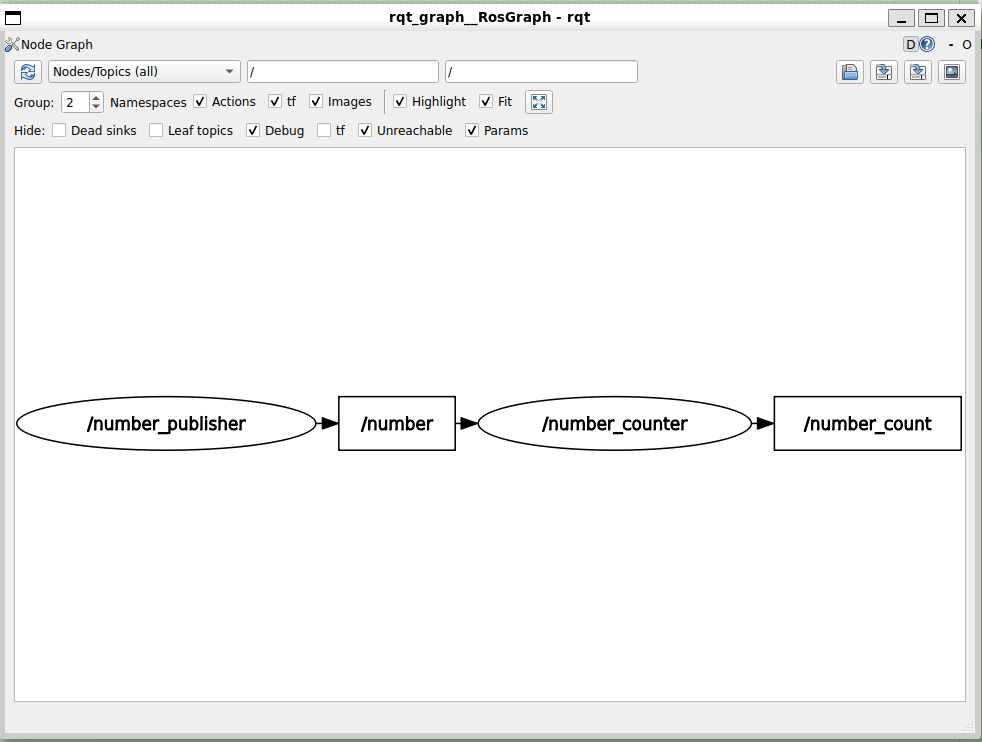

# 活动2解决方案01

> 这一步将创建数字发布者节点
> 发布者：每秒发布一个数字
> 可以使用ros2命令行工具***验证***该发布者是否正常工作

> 下一步将制作数字计数器节点 ~~订阅者~~ 

```bash
╭─ ~/HelloROS2/ros2_ws/src/my_py_pkg/my_py_pkg main
╰─❯ touch number_publisher.py

#查看整数相关的接口
╭─ ~/HelloROS2/ros2_ws/src main ?1
╰─❯ ros2 interface show example_interfaces/msg/Int64
# This is an example message of using a primitive datatype, int64.
# If you want to test with this that's fine, but if you are deploying
# it into a system you should create a semantically meaningful message type.
# If you want to embed it in another message, use the primitive data type instead.
int64 data
```

> `number_publisher.py`

```python
#!/usr/bin/env python3
import rclpy 
from rclpy.node import Node
from example_interfaces.msg import Int64

class NumberPublisherNode(Node):  
    def __init__(self):
        super().__init__("number_publisher")   
        self.number_=2
        #创建发布者
        #类型、名称、队列大小
        self.number_publisher_=self.create_publisher(
            Int64,"number",10
        );
        #每1.0秒调用一次
        self.number_timer=self.create_timer(1.0,self.publish_number);
        self.get_logger().info("Number publisher has been started.")
    
    def publish_number(self):
        msg=Int64()
        msg.data=self.number_
        self.number_publisher_.publish(msg)
        
def main(args=None):
    rclpy.init(args=args) 
    node=NumberPublisherNode()   
    rclpy.spin(node)
    rclpy.shutdown()

if __name__ == "__main__":
    main()

```

> 创建可执行文件

```python
entry_points={
        'console_scripts': [
            #文件夹my_py_pkg下的my_first_node.py文件
            #main是.py文件中的函数
            #py_node 是可执行文件的名称
            #可以再添加其他的可执行文件，和上面同样的格式即可
            "py_node = my_py_pkg.my_first_node:main",
            "robot_news_station = my_py_pkg.robot_news_station:main",
            "smartphone=my_py_pkg.smartphone:main",
            #仅添加这行
            "number_publisher=my_py_pkg.number_publisher:main"
        ],
    },
```

> build-->source-->run

```bash
╭─ ~/HelloROS2/ros2_ws main !1 ?1
╰─❯ colcon build --packages-select my_py_pkg --symlink-install
Starting >>> my_py_pkg
Finished <<< my_py_pkg [13.3s]

Summary: 1 package finished [13.7s]

╭─ ~/HelloROS2/ros2_ws main !1 ?1   
╰─❯ source install/setup.zsh

╭─ ~/HelloROS2/ros2_ws main !1 ?1
╰─❯ ros2 run my_py_pkg number_publisher
[INFO] [1791288589.178232302] [number_publisher]: Number publisher has been started.


```

> 查看

```bash
#查看节点
╭─ ~/HelloROS2/ros2_ws main !1 ?1
╰─❯ ros2 node list
/number_publisher

#查看话题列表
╭─ ~/HelloROS2/ros2_ws main !1 ?1
╰─❯ ros2 topic list
/number
/parameter_events
/rosout

#订阅者
╭─ ~/HelloROS2/ros2_ws main !1 ?1
╰─❯ ros2 topic echo /number
data: 2
---
data: 2
---
data: 2
```

# 活动2解决方案02

> 创建第二个节点（第二个文件），其中包含另一个节点，将订阅这个数字话题，然后将收到的每个数字累加到计数器中，并将这个计数器发布到一个新话题

```bash
╭─ ~/HelloROS2/ros2_ws main
╰─❯ cd src/my_py_pkg/my_py_pkg/

╭─ ~/HelloROS2/ros2_ws/src/my_py_pkg/my_py_pkg main
╰─❯ touch number_counter.py


```

> 简单的订阅者代码

```python
#!/usr/bin/env python3
import rclpy
from rclpy.node import Node
from example_interfaces.msg import Int64


class NumberCounterNode(Node):
    def __init__(self):
        super().__init__("number_counter")
        # 创建订阅者
        self.number_subscriber_ = self.create_subscription(
            Int64, "number", self.callback_number, 10
        )

    def callback_number(self, msg: Int64):
        self.get_logger().info(msg.data)


def main(args=None):
    rclpy.init(args=args)
    node = NumberCounterNode()
    rclpy.spin(node)
    rclpy.shutdown()


if __name__ == "__main__":
    main()

```

> `setup.py`添加可执行文件

```python

    entry_points={
        'console_scripts': [
            #文件夹my_py_pkg下的my_first_node.py文件
            #main是.py文件中的函数
            #py_node 是可执行文件的名称
            #可以再添加其他的可执行文件，和上面同样的格式即可
            "py_node = my_py_pkg.my_first_node:main",
            "robot_news_station = my_py_pkg.robot_news_station:main",
            "smartphone=my_py_pkg.smartphone:main",
            "number_publisher=my_py_pkg.number_publisher:main",
            #添加这行
            "number_counter=my_py_pkg.number_counter:main"
        ],
    },


```

> colcon,source,run 

```bash
╭─ ~/HelloROS2/ros2_ws main !1 ?1
╰─❯ colcon build --packages-select my_py_pkg --symlink-install
Starting >>> my_py_pkg
Finished <<< my_py_pkg [5.24s]

Summary: 1 package finished [5.64s]

╭─ ~/HelloROS2/ros2_ws main !1 ?1            
╰─❯ source install/setup.zsh

#发布者
╭─ ~/HelloROS2/ros2_ws main !1 ?1
╰─❯ ros2 run my_py_pkg number_publisher
[INFO] [1791292086.928634738] [number_publisher]: Number publisher has been started.

#订阅者
╭─ ~/HelloROS2/ros2_ws main !1 ?1
╰─❯ ros2 run my_py_pkg number_counter
[INFO] [1791292302.967268081] [number_counter]: 2
[INFO] [1791292303.895556737] [number_counter]: 2
[INFO] [1791292304.895341978] [number_counter]: 2
[INFO] [1791292305.894834587] [number_counter]: 2


```

> 完整的`number_counter.py`

```python
#!/usr/bin/env python3
import rclpy
from rclpy.node import Node
from example_interfaces.msg import Int64


class NumberCounterNode(Node):
    def __init__(self):
        super().__init__("number_counter")
        self.counter_ = 0
        self.number_count_publisher_ = self.create_publisher(Int64, "number_count", 10)
        # 创建订阅者
        self.number_subscriber_ = self.create_subscription(
            Int64, "number", self.callback_number, 10
        )
        self.get_logger().info("Number Counter has been started.")

    def callback_number(self, msg: Int64):
        # info参数必须是字符串，否则会报错
        # self.get_logger().info(str(msg.data))
        self.counter_ += msg.data
        # 在计数器更新(订阅者回调)时发布
        new_msg = Int64()
        new_msg.data = self.counter_
        self.number_count_publisher_.publish(new_msg)


def main(args=None):
    rclpy.init(args=args)
    node = NumberCounterNode()
    rclpy.spin(node)
    rclpy.shutdown()


if __name__ == "__main__":
    main()

```

> 启动订阅者

```bash
╭─ ~/HelloROS2/ros2_ws main !1 ?1
╰─❯ ros2 run my_py_pkg number_counter
[INFO] [1791292724.262064408] [number_counter]: Number Counter has been started.
```

> 目前话题`/number`和话题`/number_counter`没有东西

```bash
╭─ ~/HelloROS2/ros2_ws main !1 ?1
╰─❯ ros2 topic list
/number
/number_count
/parameter_events
/rosout

╭─ ~/HelloROS2/ros2_ws main !1 ?1
╰─❯ ros2 topic echo /number
^C%                                      
╭─ ~/HelloROS2/ros2_ws main !1 ?1     4s
╰─❯ ros2 topic echo /number_count
^C%     
```

> 流程测试

```bash
#启动发布者
╭─ ~/HelloROS2/ros2_ws main !1 ?1
╰─❯ ros2 run my_py_pkg number_publisher
[INFO] [1791292895.727352851] [number_publisher]: Number publisher has been started.
#此时number_counter正在接收消息并累加到计数器中


```

> 查看此时的`number`和`number_counter`

```bash
╭─ ~/HelloROS2/ros2_ws main !1 ?1
╰─❯ ros2 topic echo /number
data: 2
---
data: 2
---
data: 2
---
data: 2
---
^C%                                      
╭─ ~/HelloROS2/ros2_ws main !1 ?1     7s
╰─❯ ros2 topic echo /number_count
data: 200
---
data: 202
---
data: 204
---
data: 206
---
data: 208
---

#此时关闭counter发布者
#ros2 topic echo /number_count 停止
#ros2 topic echo /number 停止

```

```bash
#如果关闭number_counter后重新打开，
╭─ ~/HelloROS2/ros2_ws main !1 ?1
╰─❯ ros2 run my_py_pkg number_counter
[INFO] [1791293178.740902015] [number_counter]: Number Counter has been started.

#number_count将重新计数
╭─ ~/HelloROS2/ros2_ws main !1 ?1     7s
╰─❯ ros2 topic echo /number_count
data: 244
---
data: 246
---
data: 2
---
data: 4
---
data: 6
---
```

```bash
rqt_graph
```

  

> 如上，节点`/number_publisher`发布数据到话题`/number`，节点`/number_counter`订阅话题`/number`  并发布数据到话题 `/number_counter` 。我们有了一个数据管道  ~~data pipeline~~ 

> data pipeline（数据管道） 可以理解成：数据从一个节点产生，经过一个或多个节点处理，再传给下一个节点，最终形成一条“数据流动的路线”。pipeline 不是 ROS 2 的一个特殊技术名词，而是一种***描述系统结构的概念*** 

