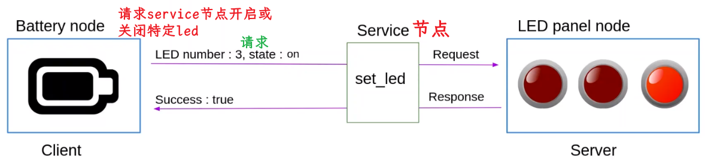

# 什么是ROS2服务

> 从现实生活中的类比开始，在线天气服务

> 假如有一个在线天气服务，在我们发送位置后，可以提供当地的天气情况。想象你 ~~客户端~~ 想要获取天气 ~~服务端~~ 

> 节点内的客户端和服务器，彼此并不知道互相的存在。只看到service 接口层面的内容

> 更接近ROS2实际开发的例子

  
## 总结

ROS2 Service是一个客户端/服务器 系统