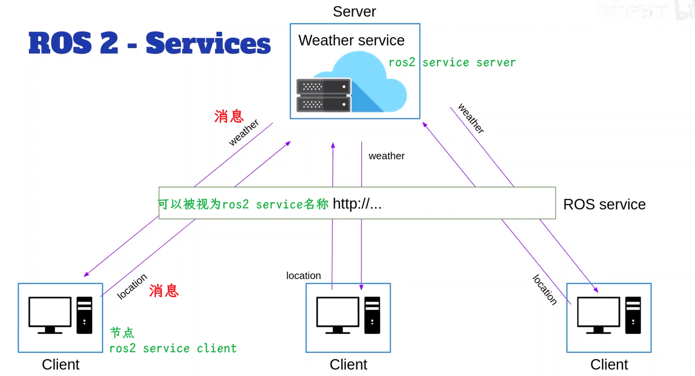

# 什么是ROS2服务

> 从现实生活中的类比开始，在线天气服务

> 假如有一个在线天气服务，在我们发送位置后，可以提供当地的天气情况。想象你 ~~客户端~~ 想要获取天气 ~~服务端~~ 

> 节点内的客户端和服务器，彼此并不知道互相的存在。只看到service 接口层面的内容

> 更接近ROS2实际开发的例子

  
## 总结

- ROS2 Service是一个客户端/服务器 系统
    - 可以是同步的，也可以是异步的
- 同步时，客户端将发送请求，然后阻塞知道收到响应
- 异步时，客户端将发送请求，然后为响应注册一个回调函数并继续执行其他操作。当服务器回复时回调将被触发
- service由一个名称，和**一对**消息定义
    - 一条消息是请求（Request）
    - 一条消息是响应（Response）
- 如同节点和话题，可以直接在ros2节点内创建service client和service server ~~使用c++的rclcpp库、或者python的rclpy库~~ 

- 一个service server只能存在一次，但可以拥有许多客户端
- 当你创建server时，service就开始存在了

- service为话题提供良好的互补性
- 主题将用于单向数据流，而当需要client-server通信时需要使用service

