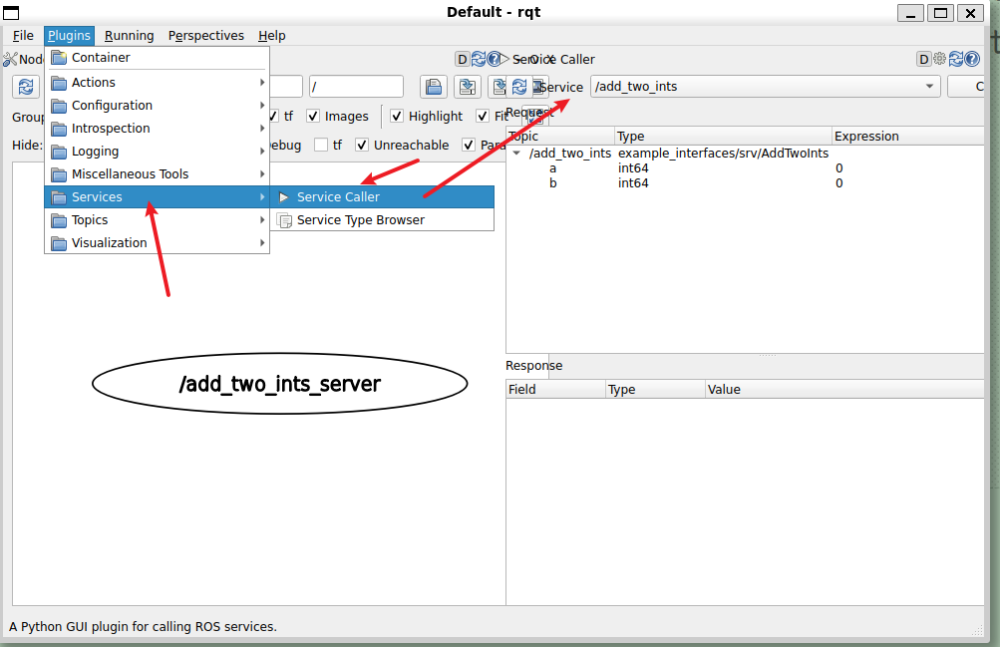
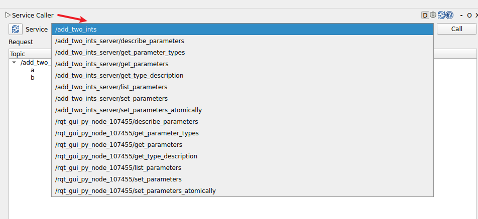
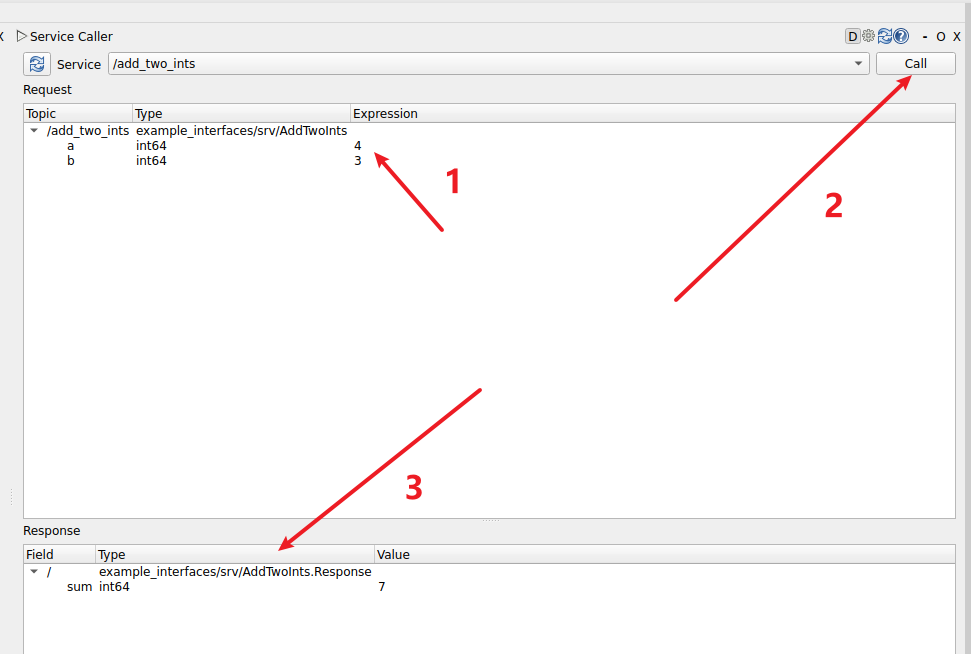

# 使用ROS2命令行自检服务

```bash
╭─ ~/HelloROS2/ros2_ws main
╰─❯ ros2 service
type  list  info  find  echo  call  -- None
```

```bash
╭─ ~/HelloROS2/ros2_ws main
╰─❯ ros2 service -h
usage: ros2 service [-h] [--include-hidden-services]
                    Call `ros2 service <command> -h` for more detailed usage. ...

Various service related sub-commands

options:
  -h, --help            show this help message and exit
  --include-hidden-services
                        Consider hidden services as well

Commands:
  call  Call a service
  echo  Echo a service
  find  Output a list of available services of a given type
  info  Print information about a service
  list  Output a list of available services
  type  Output a service's type

  Call `ros2 service <command> -h` for more detailed usage.

```

> 先启动一个服务

```bash
╭─ ~/HelloROS2/ros2_ws main
╰─❯ ros2 run my_cpp_pkg add_two_ints_server
[INFO] [1791466370.227873817] [add_two_ints_server]: Add Two Ints Service has been started.


```

> 查看节点信息（所有信息）

```bash
╭─ ~/HelloROS2/ros2_ws main
╰─❯ ros2 node list
/add_two_ints_server

╭─ ~/HelloROS2/ros2_ws main
╰─❯ ros2 node info /add_two_ints_server
/add_two_ints_server
  Subscribers: #订阅者
    /parameter_events: rcl_interfaces/msg/ParameterEvent
  Publishers: #发布者
    /parameter_events: rcl_interfaces/msg/ParameterEvent
    /rosout: rcl_interfaces/msg/Log
  # 服务端
  Service Servers:
    # 这个是我们启动的服务
    /add_two_ints: example_interfaces/srv/AddTwoInts
    /add_two_ints_server/describe_parameters: rcl_interfaces/srv/DescribeParameters
    /add_two_ints_server/get_parameter_types: rcl_interfaces/srv/GetParameterTypes
    /add_two_ints_server/get_parameters: rcl_interfaces/srv/GetParameters
    /add_two_ints_server/get_type_description: type_description_interfaces/srv/GetTypeDescription
    /add_two_ints_server/list_parameters: rcl_interfaces/srv/ListParameters
    /add_two_ints_server/set_parameters: rcl_interfaces/srv/SetParameters
    /add_two_ints_server/set_parameters_atomically: rcl_interfaces/srv/SetParametersAtomically
  #客户端
  Service Clients:

  Action Servers:

  Action Clients:

```

> 查询所有服务

```bash
╭─ ~/HelloROS2/ros2_ws main
╰─❯ ros2 service list
/add_two_ints #我们启动的
#parameter 用于参数的 
#对于（每个）启动的节点，有一堆服务，允许例如获取参数、修改参数等等
/add_two_ints_server/describe_parameters
/add_two_ints_server/get_parameter_types
/add_two_ints_server/get_parameters
/add_two_ints_server/get_type_description
/add_two_ints_server/list_parameters
/add_two_ints_server/set_parameters
/add_two_ints_server/set_parameters_atomically

#主题是ros2 topic info xxx
#用来查看服务 /add_two_ints 使用的接口类型
╭─ ~/HelloROS2/ros2_ws main
╰─❯ ros2 service type /add_two_ints
example_interfaces/srv/AddTwoInts
#查看接口内容（接口定义）
╭─ ~/HelloROS2/ros2_ws main
╰─❯ ros2 interface show example_interfaces/srv/AddTwoInts
int64 a
int64 b
---
int64 sum

#如果接口请求内容简单，那么可以尝试从终端创建请求
#发送请求并获得响应（！！！a: 后面有个空格，是必须的）
╭─ ~/HelloROS2/ros2_ws main
╰─❯ ros2 service call /add_two_ints example_interfaces/srv/AddTwoInts "{a: 5,b: 7}"
waiting for service to become available...
requester: making request: example_interfaces.srv.AddTwoInts_Request(a=5, b=7)

response:
example_interfaces.srv.AddTwoInts_Response(sum=12)


#╭─ ~/HelloROS2/ros2_ws main
#╰─❯ ros2 run my_cpp_pkg add_two_ints_server
[INFO] [1791515063.279888590] [add_two_ints_server]: Add Two Ints Service has been started.
[INFO] [1791516665.640034393] [add_two_ints_server]: 5 + 7 = 12

#只提供一个参数
#如果没有提供某个参数的值，低于整数而已会自动设置0，对于字符串会自动设置为空字符串
╭─ ~/HelloROS2/ros2_ws main           4s
╰─❯ ros2 service call /add_two_ints example_interfaces/srv/AddTwoInts "{a: 5}"    requester: making request: example_interfaces.srv.AddTwoInts_Request(a=5, b=0)

response:
example_interfaces.srv.AddTwoInts_Response(sum=5)


```

> 也可以进入 `rqt` gui界面进行处理



> 可选服务列表

  
  
# 启动节点时重映射服务

```bash
╭─ ~/HelloROS2/ros2_ws main
╰─❯ ros2 run my_py_pkg  add_two_ints_server
[INFO] [1791519817.569547519] [add_two_ints_server]: Add Two Ints server has been started.

╭─ ~/HelloROS2/ros2_ws main
╰─❯ ros2 service list
/add_two_ints #刚刚启动的服务
/add_two_ints_server/describe_parameters
/add_two_ints_server/get_parameter_types
/add_two_ints_server/get_parameters
/add_two_ints_server/get_type_description
/add_two_ints_server/list_parameters
/add_two_ints_server/set_parameters
/add_two_ints_server/set_parameters_atomically


```

> 重映射

```bash
╭─ ~/HelloROS2/ros2_ws main
╰─❯ ros2 run my_py_pkg  add_two_ints_server --ros-args -r add_two_ints:=abc
[INFO] [1791520138.071642501] [add_two_ints_server]: Add Two Ints server has been started.

#查看服务端
╭─ ~/HelloROS2/ros2_ws main
╰─❯ ros2 service list
/abc
#其他服务保持不变，因为那是自动的
/add_two_ints_server/describe_parameters
/add_two_ints_server/get_parameter_types
/add_two_ints_server/get_parameters
/add_two_ints_server/get_type_description
/add_two_ints_server/list_parameters
/add_two_ints_server/set_parameters
/add_two_ints_server/set_parameters_atomically

```

> 运行客户端

```bash
╭─ ~/HelloROS2/ros2_ws main
╰─❯ ros2 run my_py_pkg add_two_ints_client
#找不到服务器，因为名称已经重命名了
[WARN] [1791520245.960073364] [add_two_int_client]: Waiting for Add Two Ints server...
[WARN] [1791520246.964054264] [add_two_int_client]: Waiting for Add Two Ints server...
[WARN] [1791520247.968964831] [add_two_int_client]: Waiting for Add Two Ints server...
^CTraceback (most recent call last):
  File "/home/ly/HelloROS2/ros2_ws/install/my_py_pkg/lib/my_py_pkg/add_two_ints_client", line 33, in <module>
    sys.exit(load_entry_point('my-py-pkg', 'console_scripts', 'add_two_ints_client')())
             ^^^^^^^^^^^^^^^^^^^^^^^^^^^^^^^^^^^^^^^^^^^^^^^^^^^^^^^^^^^^^^^^^^^^^^^^^
  File "/home/ly/HelloROS2/ros2_ws/build/my_py_pkg/my_py_pkg/add_two_ints_client.py", line 45, in main
    node.call_add_two_ints(2, 7)
  File "/home/ly/HelloROS2/ros2_ws/build/my_py_pkg/my_py_pkg/add_two_ints_client.py", line 15, in call_add_two_ints
    while not self.client_.wait_for_service(1.0):
              ^^^^^^^^^^^^^^^^^^^^^^^^^^^^^^^^^^
  File "/opt/ros/jazzy/lib/python3.12/site-packages/rclpy/client.py", line 188, in wait_for_service
    time.sleep(sleep_time)
KeyboardInterrupt
[ros2run]: Interrupt

```

> 运行客户端时重命名为abc

```bash
╭─ ~/HelloROS2/ros2_ws main
╰─❯ ros2 run my_py_pkg add_two_ints_client  --ros-args -r add_two_ints:=abc
[INFO] [1791520418.671084229] [add_two_int_client]: Got response: 9
[INFO] [1791520418.674167010] [add_two_int_client]: 2 + 7 = 9
[INFO] [1791520418.676493792] [add_two_int_client]: Got response: 5
[INFO] [1791520418.678928541] [add_two_int_client]: 1 + 4 = 5
[INFO] [1791520418.681971656] [add_two_int_client]: Got response: 30
[INFO] [1791520418.683601809] [add_two_int_client]: 10 + 20 = 30

#查看服务端
#╭─ ~/HelloROS2/ros2_ws main
#╰─❯ ros2 run my_py_pkg  add_two_ints_server --ros-args -r add_two_ints:=abc
[INFO] [1791520138.071642501] [add_two_ints_server]: Add Two Ints server has been started.
[INFO] [1791520418.635673044] [add_two_ints_server]: 2 + 7 = 9
[INFO] [1791520418.638860368] [add_two_ints_server]: 1 + 4 = 5
[INFO] [1791520418.641814458] [add_two_ints_server]: 10 + 20 = 30
```

