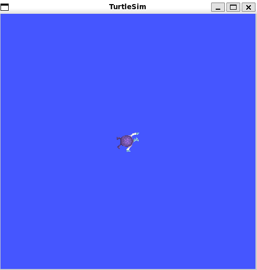
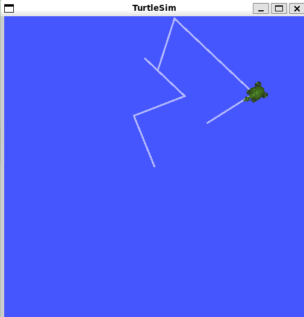
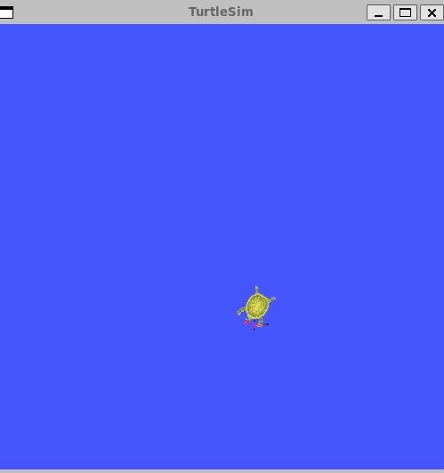
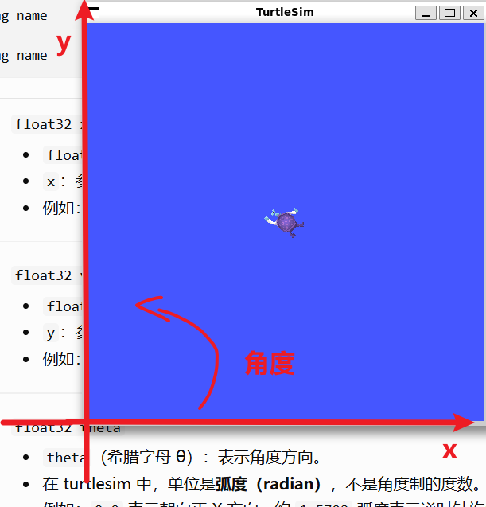
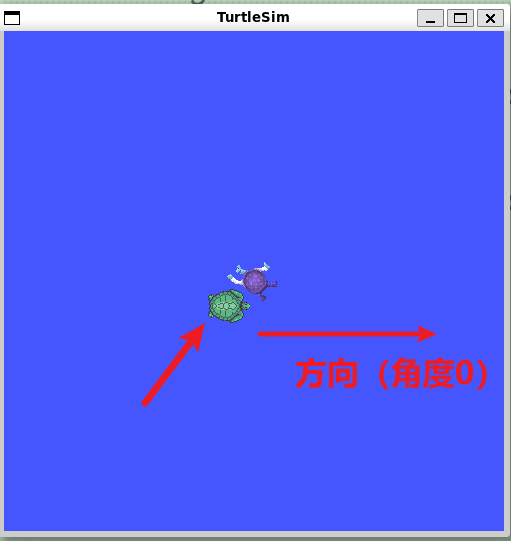
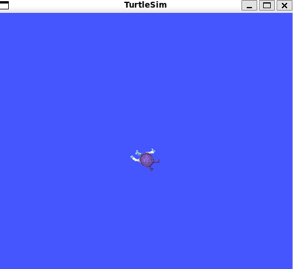

```bash
#启动小乌龟gui
╭─ ~/HelloROS2/ros2_ws main
╰─❯ ros2 run turtlesim turtlesim_node
WARNING: CPU random generator seem to be failing, disabling hardware random number generation
WARNING: RDRND generated: 0xffffffff 0xffffffff 0xffffffff 0xffffffff
[INFO] [1791522339.122474523] [turtlesim]: Starting turtlesim with node name /turtlesim
[INFO] [1791522339.174964115] [turtlesim]: Spawning turtle [turtle1] at x=[5.544445], y=[5.544445], theta=[0.000000]

```

  

```bash

╭─ ~/HelloROS2/ros2_ws main
╰─❯ ros2 service list
/clear
/kill
/reset
/spawn
/turtle1/set_pen
/turtle1/teleport_absolute
/turtle1/teleport_relative

/turtlesim/describe_parameters
/turtlesim/get_parameter_types
/turtlesim/get_parameters
/turtlesim/get_type_description
/turtlesim/list_parameters
/turtlesim/set_parameters
/turtlesim/set_parameters_atomically

#启动键盘控制的service
╭─ ~/HelloROS2/ros2_ws main
╰─❯ ros2 run turtlesim turtle_teleop_key
 Reading from keyboard
---------------------------
Use arrow keys to move the turtle.
Use g|b|v|c|d|e|r|t keys to rotate to absolute orientations. 'f' to cancel a rotation.
'q' to quit.

╭─ ~/HelloROS2/ros2_ws main
╰─❯ ros2 run turtlesim turtle_teleop_key
Reading from keyboard
---------------------------
Use arrow keys to move the turtle.
Use g|b|v|c|d|e|r|t keys to rotate to absolute orientations. 'f' to cancel a rotation.
'q' to quit.
```

```bash
#另一个终端查看服务
╭─ ~/HelloROS2/ros2_ws main
╰─❯ ros2 service list
#=====4个（服务名称使用动词）=====
/clear 
/kill
/reset
/spawn
#与节点参数关联的七个（自动生成的）
/teleop_turtle/describe_parameters
/teleop_turtle/get_parameter_types
/teleop_turtle/get_parameters
/teleop_turtle/get_type_description
/teleop_turtle/list_parameters
/teleop_turtle/set_parameters
/teleop_turtle/set_parameters_atomically
#=====3个（服务名称使用动词）=====
/turtle1/set_pen
/turtle1/teleport_absolute
/turtle1/teleport_relative
#与节点参数关联的七个（自动生成的）
/turtlesim/describe_parameters
/turtlesim/get_parameter_types
/turtlesim/get_parameters
/turtlesim/get_type_description
/turtlesim/list_parameters
/turtlesim/set_parameters
/turtlesim/set_parameters_atomically

```

>  g|b|v|c|d|e|r|t keys 是转向的。↑↓是前进后退的

  

> 现在我们使用 /clear这个服务

```bash
#先查看一下接口类型
╭─ ~/HelloROS2/ros2_ws main
╰─❯ ros2 service type /clear
std_srvs/srv/Empty

#查看一下接口定义
╭─ ~/HelloROS2/ros2_ws main
╰─❯ ros2 interface show std_srvs/srv/Empty
#请求为空且响应为空
---
```

```bash
#请求清空
#不填也行
╭─ ~/HelloROS2/ros2_ws main
╰─❯ ros2 service call /clear std_srvs/srv/Empty
requester: making request: std_srvs.srv.Empty_Request()

response:
std_srvs.srv.Empty_Response()

#或者放空字符串"{}"
╭─ ~/HelloROS2/ros2_ws main
╰─❯ ros2 service call /clear std_srvs/srv/Empty "{}"
requester: making request: std_srvs.srv.Empty_Request()

response:
std_srvs.srv.Empty_Response()


```

```bash
#╭─ ~/HelloROS2/ros2_ws main       6m 55s
#╰─❯ ros2 run turtlesim turtlesim_node
WARNING: CPU random generator seem to be failing, disabling hardware random number generation
WARNING: RDRND generated: 0xffffffff 0xffffffff 0xffffffff 0xffffffff
[INFO] [1791533826.430719412] [turtlesim]: Starting turtlesim with node name /turtlesim
[INFO] [1791533826.455049515] [turtlesim]: Spawning turtle [turtle1] at x=[5.544445], y=[5.544445], theta=[0.000000]
[INFO] [1791533834.304793029] [turtlesim]: Clearing turtlesim.


^C[INFO] [1791533852.725025942] [rclcpp]: signal_handler(SIGINT/SIGTERM)

```

  

```bash
#现在关闭turtle_teleop_key这个服务
#╭─ ~/HelloROS2/ros2_ws main
#╰─❯ ros2 run turtlesim turtle_teleop_key
Reading from keyboard
---------------------------
Use arrow keys to move the turtle.
Use g|b|v|c|d|e|r|t keys to rotate to absolute orientations. 'f' to cancel a rotation.
'q' to quit.

╭─ ~/HelloROS2/ros2_ws main
╰─❯ ros2 service list
/clear
/kill
/reset
/spawn
/turtle1/set_pen
/turtle1/teleport_absolute
/turtle1/teleport_relative

/turtlesim/describe_parameters
/turtlesim/get_parameter_types
/turtlesim/get_parameters
/turtlesim/get_type_description
/turtlesim/list_parameters
/turtlesim/set_parameters
/turtlesim/set_parameters_atomically
```

```bash
#接口类型查看
╭─ ~/HelloROS2/ros2_ws main
╰─❯ ros2 service type /spawn
turtlesim/srv/Spawn

#查看接口定义
╭─ ~/HelloROS2/ros2_ws main
╰─❯ ros2 interface show turtlesim/srv/Spawn
float32 x
float32 y
float32 theta
string name # Optional.  A unique name will be created and returned if this is empty #提供小海龟的名称
---
string name #返回小海龟的名称
```

> 像下面这样

 

```bash
╭─ ~/HelloROS2/ros2_ws main
╰─❯ ros2 service call /spawn turtlesim/srv/Spawn "{x: 5.0, y: 5.0,name: 'my_turtle'}"
waiting for service to become available...
requester: making request: turtlesim.srv.Spawn_Request(x=5.0, y=5.0, theta=0.0, name='my_turtle')

response:
turtlesim.srv.Spawn_Response(name='my_turtle')


#服务器端的日志
╭─ ~/HelloROS2/ros2_ws main       5m 29s
╰─❯ ros2 run turtlesim turtlesim_node 
[INFO] [1791534366.459512621] [turtlesim]: Spawning turtle [turtle1] at x=[5.544445], y=[5.544445], theta=[0.000000]
[WARN] [1791534380.828325498] [turtlesim]: Rotation goal received before a previous goal finished. Aborting previous goal
[INFO] [1791534382.764300333] [turtlesim]: Rotation goal completed successfully
[INFO] [1791534383.244185231] [turtlesim]: Rotation goal completed successfully 
[INFO] [1791534815.156402953] [turtlesim]: Spawning turtle [my_turtle] at x=[5.000000], y=[5.000000], theta=[0.000000]
```

> 这是新创建的那只海龟

  

> 使用kill来移除海龟

```bash

╭─ ~/HelloROS2/ros2_ws main
╰─❯ ros2 service  type /kill
turtlesim/srv/Kill

╭─ ~/HelloROS2/ros2_ws main
╰─❯ ros2 interface show turtlesim/srv/Kill
string name
---
```

> 移除海龟

```bash
#这里故意写错，也没有报错但是没有移除成功
╭─ ~/HelloROS2/ros2_ws main
╰─❯ ros2 service call /kill turtlesim/srv/Kill '{name: "my_turtle1"}'
requester: making request: turtlesim.srv.Kill_Request(name='my_turtle1')

response:
turtlesim.srv.Kill_Response()


#成功移除
╭─ ~/HelloROS2/ros2_ws main
╰─❯ ros2 service call /kill turtlesim/srv/Kill '{name: "my_turtle"}'
requester: making request: turtlesim.srv.Kill_Request(name='my_turtle')

response:
turtlesim.srv.Kill_Response()

```

  

> 如上，turtlesim非常适合练习**节点**、**主题**和**服务**

