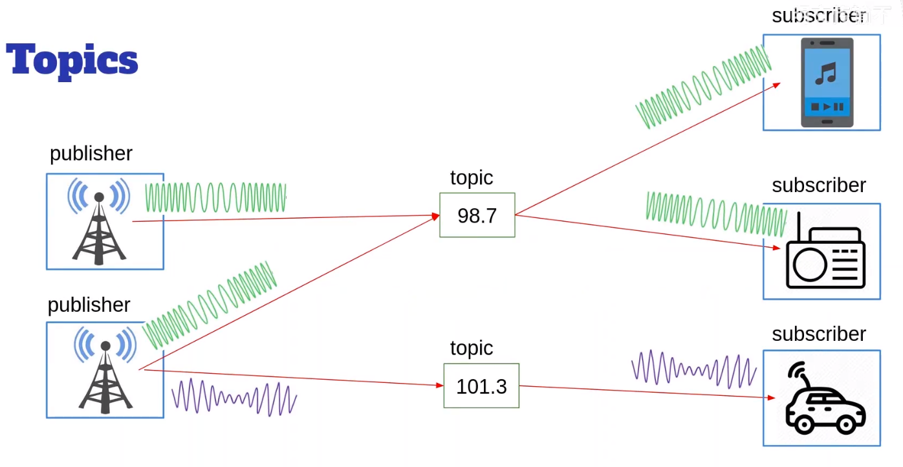
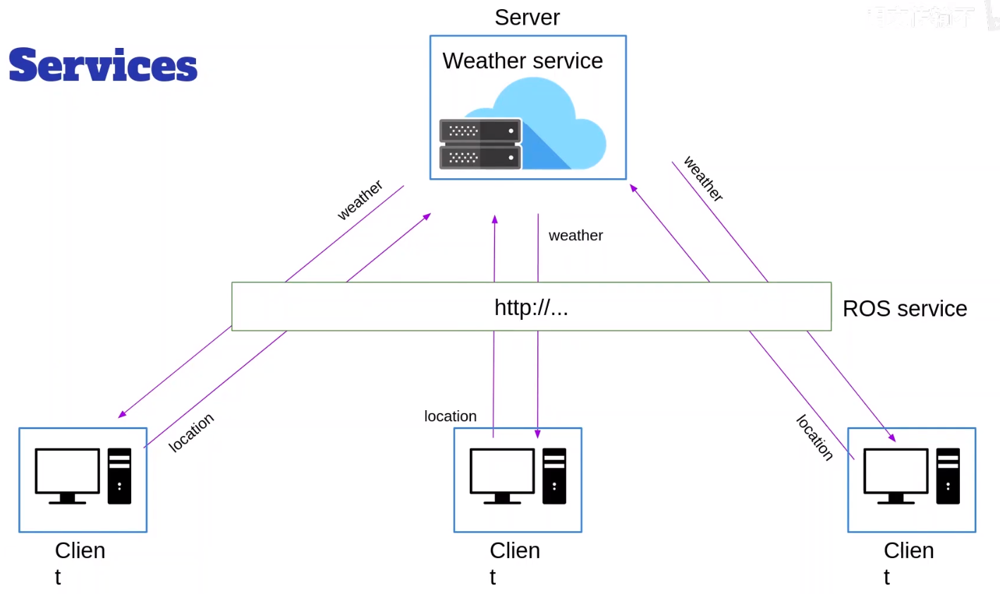
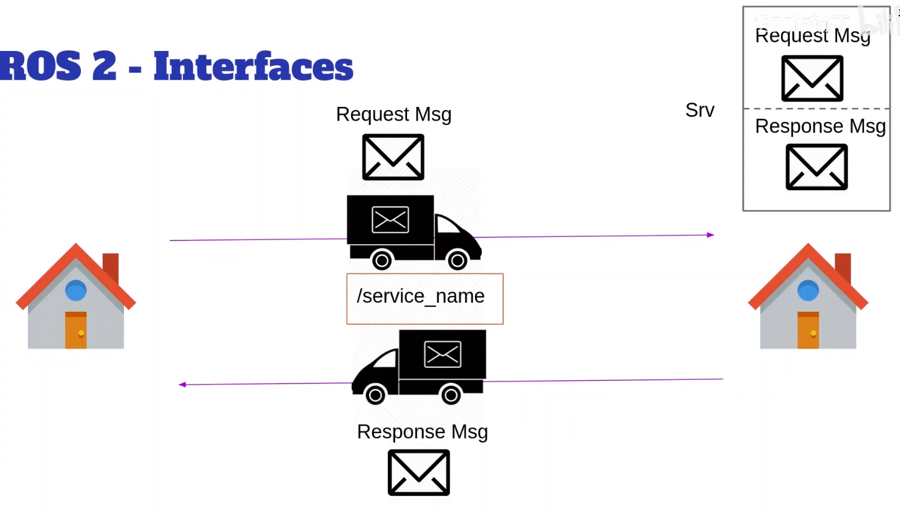
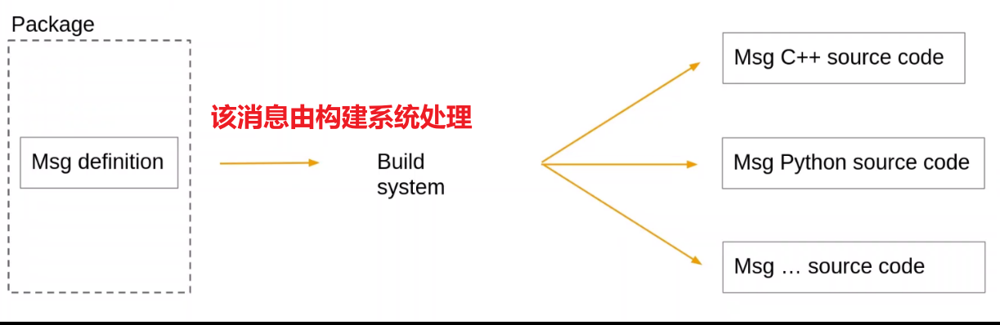
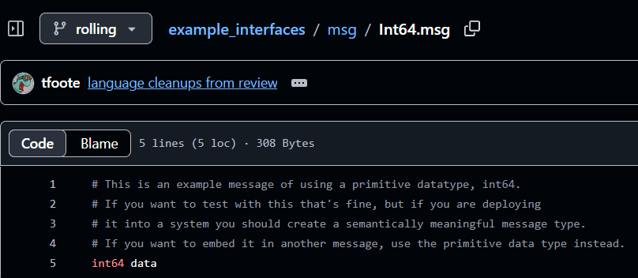
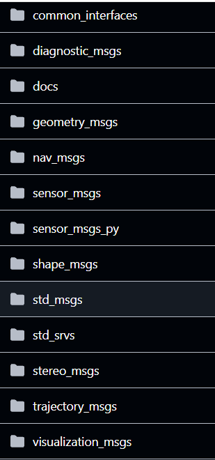

> 在**话题和服务**的内容中，使用了常见的**接口**在节点之间进行通信

> 对于话题，所有发布或订阅同一个话题的节点必须使用相同的数据类型

  
> 对于服务，客户端必须发送符合特定数据类型的数据，而服务器必须响应领养给也符合另一种数据类型的消息

  
话题由两件事定义

1. 名称 （`/number_count`）
2. 基于消息定义的**接口** ~~`example_interfaces/msg/Int64`~~ ，即发送消息的结构


服务由两件事定义

1. 定义名称 （`/reset_number_count`）
2. 接口，或者说服务定义 （Srv定义）(`example_interfaces/srv/SetBool`) ~~包括一个用于请求的消息定义和一个用于响应的消息定义~~ 

```bash
#一对消息
Request: msg
---
Response: msg
```

> 可以将话题和服务视为**通信层**工具，而接口或消息则是您**实际发送的内容**

> 类比，寄信。RequestMsg和ResponseMsg定义的组合，就是服务定义  

  
> 假设创建了消息定义，当您使用colcon build命令行时，该消息将由构建系统处理。然后，系统生成任何ROS2支持语言的源代码

  
最后构建系统生成了源代码

------
> 当前支持的内置类型

| Type name | C++            | Python          | DDS type           |
| --------- | -------------- | --------------- | ------------------ |
| bool      | bool           | builtins.bool   | boolean            |
| byte      | uint8_t        | builtins.bytes* | octet              |
| char      | char           | builtins.int*   | char               |
| float32   | float          | builtins.float* | float              |
| float64   | double         | builtins.float* | double             |
| int8      | int8_t         | builtins.int*   | octet              |
| uint8     | uint8_t        | builtins.int*   | octet              |
| int16     | int16_t        | builtins.int*   | short              |
| uint16    | uint16_t       | builtins.int*   | unsigned short     |
| int32     | int32_t        | builtins.int*   | long               |
| uint32    | uint32_t       | builtins.int*   | unsigned long      |
| int64     | int64_t        | builtins.int*   | long long          |
| uint64    | uint64_t       | builtins.int*   | unsigned long long |
| string    | std::string    | builtins.str    | string             |
| wstring   | std::u16string | builtins.str    | wstring            |

> 每个内置类型都可以用来定义数组 

| Type name | C++ | Python | DDS type |
| --- | --- | --- | --- |
| static array | std::array<T, N> | builtins.list* | T[N] |
| unbounded dynamic array | std::vector | builtins.list | sequence |
| bounded dynamic array | custom_class<T, N> | builtins.list* | sequence<T, N> |
| bounded string | std::string | builtins.str* | string |

 ~~所有比其 ROS 定义更宽松的类型，都通过软件强制执行 ROS 在范围和长度上的限制。 ~~

> 示例

```bash
int32[] unbounded_integer_array # 无界整型数组（长度不限）
int32[5] five_integers_array # 包含5个整数的定长数组
int32[<=5] up_to_five_integers_array # 最多包含5个整数的有界数组

string string_of_unbounded_size # 无界字符串（长度不限）
string<=10 up_to_ten_characters_string # 最多10个字符的有界字符串

string[<=5] up_to_five_unbounded_strings # 最多包含5个无界字符串的数组
string<=10[] unbounded_array_of_strings_up_to_ten_characters_each # 无界数组，其中每个字符串最多包含10个字符
string<=10[<=5] up_to_five_strings_up_to_ten_characters_each # 最多包含5个字符串的数组，其中每个字符串最多包含10个字符

```

> 找到现有的包(定义)

https://github.com/ros2/example_interfaces/tree/rolling/msg  

| Bool.msg              | Byte.msg             | ByteMultiArray.msg      |
| --------------------- | -------------------- | ----------------------- |
| Char.msg              | Empty.msg            | Float32.msg             |
| Float32MultiArray.msg | Float64.msg          | Float64MultiArray.msg   |
| Int16.msg             | Int16MultiArray.msg  | Int32.msg               |
| Int32MultiArray.msg   | Int64.msg            | Int64MultiArray.msg     |
| Int8.msg              | Int8MultiArray.msg   | MultiArrayDimension.msg |
| MultiArrayLayout.msg  | String.msg           | UInt16.msg              |
| UInt16MultiArray.msg  | UInt32.msg           | UInt32MultiArray.msg    |
| UInt64.msg            | UInt64MultiArray.msg | UInt8.msg               |
| UInt8MultiArray.msg   | WString.msg          |                         |

  

```bash
#和在命令行查看的是一样的
╭─ ~/HelloROS2/ros2_ws main
╰─❯ ros2 interface show example_interfaces/msg/Int64
# This is an example message of using a primitive datatype, int64.
# If you want to test with this that's fine, but if you are deploying
# it into a system you should create a semantically meaningful message type.
# If you want to embed it in another message, use the primitive data type instead.
int64 data
```

------

> 一些消息的包

https://github.com/ros2/common_interfaces  

  

> 有一些包已经安装了有一些包还没有。如果要安装没有的包，则 比如 shape_msgs，则`sudo apt install ros-jazzy-shape-msgs`  ~~下划线用连字符替代~~   

github上，查看 `common_interfaces/sensor_msgs/msg/JointState.msg`  

> 作用：举个例子，假设有一个带五个关节的机械臂，并且想发布关节状态。从编码器读取数据，然后想创建一条消息来发布包含位置、速度、力矩的状态 ~~为机器人所有关节创建的数据~~ 。不需要创建新的消息类型，直接使用这个即可

```bash
# This is a message that holds data to describe the state of a set of torque controlled joints.
#
# The state of each joint (revolute or prismatic) is defined by:
#  * the position of the joint (rad or m),
#  * the velocity of the joint (rad/s or m/s) and
#  * the effort that is applied in the joint (Nm or N).
#
# Each joint is uniquely identified by its name
# The header specifies the time at which the joint states were recorded. All the joint states
# in one message have to be recorded at the same time.
#
# This message consists of a multiple arrays, one for each part of the joint state.
# The goal is to make each of the fields optional. When e.g. your joints have no
# effort associated with them, you can leave the effort array empty.
#
# All arrays in this message should have the same size, or be empty.
# This is the only way to uniquely associate the joint name with the correct
# states.

#来自另一个包的消息
std_msgs/Header header

#字符串数组，针对机器人的每一个关节
string[] name 
#位置数组
float64[] position
#速度数组
float64[] velocity
#力矩数组
float64[] effort
```

------

> 传感器：`common_interfaces/sensor_msgs/msg`
> 这个之下的Joy.msg是操作杆，还有其他的

> 安装了这个包之后，消息会被构建。就可以在Python中使用了

```bash
BatteryState.msg
CameraInfo.msg
ChannelFloat32.msg
CompressedImage.msg
FluidPressure.msg
Illuminance.msg
Image.msg
Imu.msg
JointState.msg
Joy.msg
JoyFeedback.msg
JoyFeedbackArray.msg
LaserEcho.msg
LaserScan.msg
MagneticField.msg
MultiDOFJointState.msg
MultiEchoLaserScan.msg
NavSatFix.msg
NavSatStatus.msg
PointCloud.msg
PointCloud2.msg
PointField.msg
Range.msg
RegionOfInterest.msg
RelativeHumidity.msg
Temperature.msg
TimeReference.msg
```

> `common_interfaces/geometry_msgs/msg/`

```bash
Accel.msg
AccelStamped.msg
AccelWithCovariance.msg
AccelWithCovarianceStamped.msg
Inertia.msg
InertiaStamped.msg
Point.msg
Point32.msg
PointStamped.msg
Polygon.msg
PolygonInstance.msg
PolygonInstanceStamped.msg
PolygonStamped.msg
Pose.msg
PoseArray.msg
PoseStamped.msg
PoseWithCovariance.msg
PoseWithCovarianceStamped.msg
Quaternion.msg
QuaternionStamped.msg
Transform.msg
TransformStamped.msg
Twist.msg
TwistStamped.msg
TwistWithCovariance.msg
TwistWithCovarianceStamped.msg
Vector3.msg
Vector3Stamped.msg
VelocityStamped.msg
VelocityWithCovarianceStamped.msg
Wrench.msg
WrenchStamped.msg
```

> Twist.msg  ~~之前的turtle simalation。但是如果要使用turtlebot这样的机器人或者基本上任何移动机器人，也都会使用twist.msg~~ 

```bash
# This expresses velocity in free space broken into its linear and angular parts.
#Vector3是什么？这里没看到包名，是因为我们正使用同一个包的包名
Vector3  linear
Vector3  angular
```

> Vector3.msg

```bash
# This represents a vector in free space.

# This is semantically different than a point.
# A vector is always anchored at the origin.
# When a transform is applied to a vector, only the rotational component is applied.

float64 x
float64 y
float64 z
```

------

> 查看 `std_srvs/srv/SetBool.srv`

> `---`将请求和响应分开

> 可以包含 基本数据类型，或者其他 msg ，但是不能包含服务

```bash
bool data # e.g. for hardware enabling / disabling
---
bool success   # indicate successful run of triggered service
string message # informational, e.g. for error messages
```

> 所以说，为 topic 创建的任何 message，不仅可以用于 topic，还可以用于 service.srv (service定义) 中

> 接下来学习如何在自己工作区的包中亲手创建这些

> 本节学习了什么是ROS2接口，以及如何通过**消息** ~~.msg~~ 和**服务定义** ~~.srv~~ 来创建他们 。还有一些常见的现有**接口**

