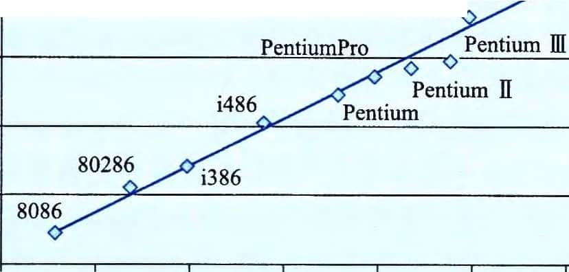
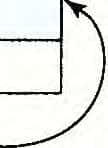
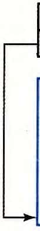
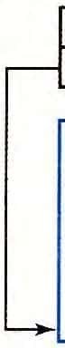
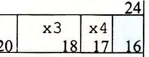

第 3 章

—- CH APTER 3

##### 程序的机器级表示

计算机执行机器代码，用字节序列编码低级的操作，包括处理数据、管理内存、读写 存储设备上的数据，以及利用网络通信。编译器基于编程语言的规则、目标机器的指令集 和操作系 统遵循的 惯例， 经过一系列的 阶段生成 机器代码 。GCC C 语言编译器以汇编代码的形式产生输出，汇编代码是机器代码的文本表示，给出程序中的每一条指令。然后

GCC调用汇编 器和 链接器， 根据汇编代码生成可执行的机器代码。在本章中， 我们会近距离地观察机器代码，以及人类可读的表示 汇编代码。

当我们用高级语言 编程的时候（例如C 语言， Java 语言更是如此）， 机器屏蔽了 程序的 细节，即机器级的实现。与此相反，当用汇编代码编程的时候（就像早期的计算），程序员必须 指定程序用来执行计算的低级指令。高级语言提供的抽象级别比较高，大多数时候，在这种 抽象级别上工作效率会更高，也更可靠。编译器提供的类型检查能帮助我们发现许多程序错 误，并能够保证按照一致的方式来引用和处理数据。通常情况下，使用现代的优化编译器产 生的代码至少与一个熟练的汇编语言程序员手工编写的代码一样有效。最大的优点是，用高级 语言编写的程序可以在很多不同的机器上编译和执行，而汇编代码则是与特定机器密切相关的。 那么为什么我们还要花时间学习机器代码呢？即使编译器承担了生成汇编代码的大部

分工作，对千严谨的程序员来说，能够阅读和理解汇编代码仍是一项很重要的技能。以适 当的命令行选项调用编译器，编译器就会产生一个以汇编代码形式表示的输出文件。通过 阅读这些汇编代码，我们能够理解编译器的优化能力，并分析代码中隐含的低效率。就像 我们将在 第 5 章中体会到的那样， 试图最大化一 段关键代码性能的程序员 ， 通常会尝试源代码的各种形式，每次编译并检查产生的汇编代码，从而了解程序将要运行的效率如何。 此外，也有些时候，高级语言提供的抽象层会隐藏我们想要了解的程序的运行时行为。例 如，第 12 章会讲到，用线程包写并 发程序时 ，了 解不同的线程是如何共享程序数 据或保持数据私有的，以及准确知道如何在哪里访问共享数据，都是很重要的。这些信息在机器代码 级是可见的。另外再举一个例子，程序遭受攻击（使得恶意软件侵扰系统）的许多方式中，都涉及程序存储运行时控制信息的方式的细节。许多攻击利用了系统程序中的漏洞重写信息， 从而获得了系统的控制权。了解这些漏洞是如何出现的，以及如何防御它们，需要具备程序 机器级表示的知识。程序员学习汇编代码的需求随着时间的推移也发生了变化，开始时要求 程序员能直接用汇编语言编写程序，现在则要求他们能够阅读和理解编译器产生的代码。

在本章 中， 我们 将详细学习一 种特别的 汇编语 言，了 解如何将 C 程序编译成这种形式的机器代码。阅读编译器产生的汇编代码，需要具备的技能不同千手工编写汇编代码。我 们必须 了解典型的编译器在将 C 程序结 构变换成 机器代码时所做的转换 。相对于 C 代码表示的计算操作，优化编译器能够重新排列执行顺序，消除不必要的计算，用快速操作替换 慢速操作，甚至将递归计算变换成迭代计算。源代码与对应的汇编代码的关系通常不太容易 理解一一－就像要拼出的 拼图与盒子上图 片的设 计有点不太一样。这是一种逆向 工程 ( reverse engineering ) — 通过研究 系统 和逆向工作， 来试图了解系统 的创建过程。 在这里， 系统是一个机器产生的汇编语言程序，而不是由人设计的某个东西。这简化了逆向工程的任

务，因为产生的代码遵循比较规则的模式，而且我们可以做试验，让编译器产生许多不同程序的代码。本章提供了许多示例和大量的练习，来说明汇编语言和编译器的各个不同方面。精通细节是理解更深和更基本概念的先决条件。有人说：“我理解了一般规则，不愿意劳神去学习细节！”他们实际上是在自欺欺人。花时间研究这些示例、完成练习并对照提供的答案来检查你的答案，是非常关键的。

我们的表述基千 x86-64, 它是现在笔记本电脑和台式机中最常见处理器的机器语言，也是驱动大型数据中心和超级计算机的最常见处理器的机器语言。这种语言的历史悠久，开始于 Intel 公司 1978 年的第一个 16 位处理器 ， 然后扩展为 32 位， 最近又扩展到 64 位。一路以来，逐渐增加了很多特性，以更好地利用巳有的半导体技术，以及满足市场需求。这些进步中很多是 Intel 自己驱动的 ， 但它的对手 AMD( Advanced Micro Devices)也作出了重要的贡献。演化的结果是得到一个相当奇特的设计，有些特性只有从历史的观点来看才有意义，它还具有 提供后向兼容性的特性，而现代编译器和操作系统早已不再使用这些特性。我们将关注

GCC 和 Linux 使用的那些特性， 这样可以 避免 x86-64 的大量复杂性 和许多隐秘特性。

我们 在技术讲解之 前，先 快速浏览 C 语言、汇编代码以及机器代码之间 的关系。然后介绍 x86-64 的细节 ， 从数据的表示 和处理以及控制的实现开始。了解如何 实现 C 语言中的控制结构， 如 if 、wh i l e 和 s wi t c h 语句。之后 ， 我们会 讲到过程的实 现， 包括程序如何维护一个运行栈来支持过程间数据和控制的传递，以及局部变最的存储。接着，我们会考虑在机器级如何实现像数组、结构和联合这样的数据结构。有了这些机器级编程的背景知识，我们会讨论内存访问越界的问题，以及系统容易遭受缓冲区溢出攻击的问题。在这一部分的结尾， 我们会 给出一 些用 GDB 调试器检查机器级程序运行时行为的 技巧。本章的最后展示了包含浮点数据和操作的代码的机器程序表示。

\- IA32 编程

IA32, x86- 64 的 32 位前身，是 Intel 在 1985 年提出的 。几十年 来一 直是 Intel 的机 器语言之选。今天出售的 大多数 x86微处理器，以及这些机 器上安装的 大多数操作 系统， 都是为运行 x86-64设计的。不过 ， 它们也可以向后 兼容执行 IA32 程序。所以，很 多应用 程序还是基于 IA32 的。除此之外， 由于硬件或 系统软件的限制， 许多已有的 系统不能够执行 x86-64。

IA32 仍然是一种重要的机 器语言。学习过 x86-64会使你很容易地学会 IA32 机器语言。

计算机工业已经完成从 32 位到 64 位机器的过渡 。32 位机器只能使用大概 4GB( 沪 字节）的随机访问存储器。存储器价格急剧下降，而我们对计算的需求和数据的大小持续增 加， 超越这个 限制既经 济上可行又有技术上的需要。当前的 64 位机器能够使用多达256T B( 248 字节）的内存空间 ， 而且很容易 就能扩展至 16EB ( 26 4 字节）。虽然很难想象一台机器需要这么大的内存， 但是回想 20 世纪 70 和 80 年代， 当 32 位机器开始普及的时候，

4GB 的内存看上去也是超级大的 。

我们的 表述集 中于以现代操作 系统为目标， 编译 C 或类似编 程语言时， 生成的 机器级程序类型 。x86-64 有一些 特性是 为了 支持遗留下来的 微处理器早期 编程风格 ， 在此，我 们不试图去描述这些特性 ， 那时候大部分代码都是手工编写的， 而程序员 还在努力与 16 位机器允许的有限地址空间奋战。

2.  1 历史观点

    Intel 处理器系列俗称 x86, 经历了一个长期的、不断进化的发展过程。开始时，它是第

一代单芯片 、16 位微处理器之一， 由千当时 集成电 路技术水 平十分 有限， 其中做了很多妥协。以后，它不断地成长，利用进步的技术满足更高性能和支持更高级操作系统的需求。

以下列举 了一些 In tel 处理器的模型， 以及它们的一些关键特性， 特别是影响机器级编程的特性。我们用实现这些处理器所需要的品体管数量来说明演变过程的复杂性。其 中， " K" 表示 1000 , " M" 表示 1 000 000, 而 " G" 表示 1 000 000 000 。

8086(1978 年， 29K 个晶体管）。它是第一代单芯片、16 位微处理器之一。 8088 是 8086

的一个变 种， 在 8086 上增 加了一个 8 位外部总线， 构成最初的 IBM 个人计算机的心脏。

IBM 与当时还不强大的微软签订合同 ， 开发 MS-DOS 操作系统。最初的机器型号有32 768 字节的内存和两个软驱（没有硬盘驱动器）。从体系结构上来说 ， 这些机器只有 655 360 字节的地址空间 地址只有 20 位长（可寻址范围为 1 048 576 字节）， 而操作系统保 留了 393 216 字节自用。 1980 年， Int el 提出了 8087 浮点 协处理器( 45K 个晶体管）， 它与一个 8086 或 8088处理器一同运行 ， 执行浮点指令 。8087 建立了 x86 系列的浮点模型 ， 通常被称为 " x87"。

80286(1 982 年， 13 4K 个晶体管）。增加了更多的寻址模式（现在巳 经废弃了）， 构成了 IBM PC- AT 个人计算机的基础， 这种计算 机是 MS Windows 最初的使用平台。

i386(1 985 年， 275K 个晶体管）。将体系结构扩展到 32 位。增 加了平坦寻址模式 ( flat addressing model) , Linux 和最近版本的 Windows 操作系统都是使用的这种模式。这是

Intel 系列中第一台全 面支持 U nix 操作系统的机器。

i486 (1 989 年， 1. 2M 个晶体管）。改善了性能， 同时将浮点 单元集成到了处 理器芯片上，但是指令集没有明显的改变。

Pentium (1 993 年， 3. l M 个晶体管）。改善了性能， 不过只对指令集 进行了小 的扩展。

PentiumP ro(1 995 年， 5. 5M 个晶体管）。引入全新的处理器设计， 在内部被称为 P 6

微体系 结构。指令集 中增加了一类 ”条件传送 ( cond iti onal move) " 指令。

Pentium/ MMX C1997 年， 4. 5M 个晶体管）。在 Pentium 处理器中增加了一类新的处理整数 向量的指令 。每个数据大小 可以是 1、2 或 4 字节。每个向量 总长 64 位。

Pentium 11(1 997 年， 7M 个晶体管）。P6 微体系结构的延伸。

Pentium 111(1 999 年， 8. 2M 个晶体管）。引入了 SSE , 这是一类处理整数或浮点数向最的指令 。每个数 据可以是 1、2 或 4 个字节， 打包成 128 位的向量。由 千芯片上包括了二级高速缓 存， 这种芯片后来的 版本最多使用了 24M 个品体管。

Pentium 4 ( 2000 年， 42M 个晶体管）。SSE 扩展 到了 SSE 2 , 增加了新的数据类型（包括双精 度浮点数）， 以及针对这些格式的 144 条新指令。有了这些 扩展， 编译器可以 使用

SSE 指令（而不是x87 指令）， 来编译浮点 代码。

Pentium 4E ( 2004 年， 1 25M 个晶体管）。增加了超线程 ( hypert hreading ) , 这种技术可以在 一个处理器上同时运行 两个程序； 还增 加了 EM64T , 它是 In tel 对 AMD 提出的对

IA32 的 64 位扩展的 实现， 我们称之为 x86-64 。

Core 2( 2006 年， 291 M 个晶体管）。回归到类似于 P6 的微体系结 构。Intel 的第一个多核微处理器，即多处理器实现在一个芯片上。但不支持超线程。

Core i7, Nehalem ( 2008 年， 781 M 个晶体管）。既支持超线程， 也有多核， 最初的版

本支持每个核上执行两个程序，每个芯片上最多四个核。

Core i7, Sandy Brid ge( 20 11 年， 1. 1 7G 个晶体管）。引入了 AV X , 这是对 SSE 的扩展， 支持把数 据封装 进 256 位的向量。

Core i7, H aswe ll ( 2013 年， 1. 4G 个晶体管）。将AV X 扩展 至 AV X2 , 增加了更多的

指令和指令格式。

每个后继处理器的设计都是后向兼容的一较早版本上编译的代码可以在较新的处理 器上运行。正如我们看到的那样，为了保持这种进化传统，指令集中有许多非常奇怪的东 西。Int el 处理器 系列 有好几个名字， 包括 IA 32 , 也就是 " Intel 32 位 体系结构 \< Intel Architecture 32-bit) ", 以及最新的 In tel6 4 , 即 IA32 的 64 位扩展， 我们也称为 x86-64 。最常用的名字是 " x86" , 我们用它指 代整个 系列 ， 也反映了直到 i486 处理器命名的惯例。

m 摩尔定律 ( Moo re ' s Law)

如果我们画 出各种不同的 Int el 处理 器 中晶 体管的 数量与 它们 出现 的年份 之间的 图( y 轴为晶 体管数 量的 对数值）， 我们能够 看 出， 增长是 很显著的。画一条拟合这些数 据的线， 可以 看到晶 体管数 量以每年 大约 37 % 的速率增 加， 也就是 说， 晶体管数 量每 26 个月就 会翻一 番。在 x86 微处理 器的 历 史上 ， 这种增长已经持 续 了好几十年 。

Intel微处理器的复杂性

I.OE+ 10

LOE+ 09

Neha。lem◊

Pentium4 夕ePentium4

／Core 2 Duo

I.OE+ 05

I.OE+ 04

1975 1980 1985 1990 1995 2000 2005 2010 2015

年份

1965 年， G ordon Moore, Intel 公 司的创始 人， 根据当时 的芯片技术（那时他们能够在一个芯 片 上制造有 大约 64 个晶 体管的电 路）做出推 断， 预测在 未来 10 年， 芯片 上的晶体管数量每年都会翻一番 。这个预测就称为摩 尔定律。正如事实证明的那样， 他的预测有点乐观， 而且 短视。在超过50 年中， 半导体工业一直能够使得晶体管数目每 18 个月翻一倍。

对计算机技术的其他方面，也有类似的呈指数增长的情况出现，比如磁盘和半导体 存储 器的 存储 容量。 这些惊人的 增长速度一 直是 计 算机 革命的 主要驱动力。

这些年来 ， 许多公司生产出了 与 Inte l 处理器兼 容的处理器， 能够运行完全相同 的机器级程序。其 中， 领头的是 AMD。数年来， AMD 在技术上紧跟 In tel, 执行的市场策略是： 生产性能 稍低但是价格更便宜的处理器。2002 年， AMD 的处理器变得更加有竞争力， 它们率先突破了 可商用微处理器的 1G H z 的时钟速度屏障， 并且引 入了广泛采用的

IA32 的 64 位扩展 x86-64。虽 然我们讲的是 Inte l 处理器， 但是对于其竞争对手生产的与之兼容的处理器来说 ， 这些表述也同样成 立。

对于由 CCC 编译器产生的 、在 Linux 操作系统平台上运行的程序 ， 感兴趣的人大多并不关心 x86 的复杂性。最初的 8086 提供的内 存模型和它在 80286 中的扩展 ， 到 i386 的时候就都已经过时了。原来的x87 浮点指令到引入 SSE2 以后就过时了 。虽然在 x86-64 程序中 ， 我们能看到历史发展的痕迹 ， 但 x86 中许多最晦涩难懂的特性已经不会出现了。

3\. 2 程序编码

假设一个 C 程序， 有两个 文件 p l. c 和 p 2 . c 。我们用 Unix 命令行编译这些代码 ：

linux\> gee -Og -op p1.e p2.e

命令 g e e 指的就是 GCC C 编译器。因 为这是 Lin u x 上默认的编译器， 我们也可以 简单地用 cc 来启 动它。编译 选项 - Oge 告诉编译器使用 会生成符合原 始 C 代码整体结 构的机器代码的优化等级。使用较高级别优化产生的代码会严重变形，以至于产生的机器代码和 初始源 代码之间的 关系非常难以 理解。因 此我们会使 用- Og 优化作为学 习工具 ， 然后当我们增加优化级别时，再看会发生什么。实际中，从得到的程序的性能考虑，较高级别的优 化（例如， 以选项 - 0 1 或- 0 2 指定）被认为是 较好的 选择。

实际上 gee 命令调用了一 整套的 程序 ， 将源代码转化成可执行代码。首先， C 预 处理器扩展源代码 ， 插入所有用 \#i ne l ude 命令指定的文件， 并扩展所有用\#de f i ne 声明指定的宏。其 次， 编译 器产生两个源文件的 汇编代码 ， 名字分别为 p l. s 和 p 2 . s 。接下 来， 汇编器会 将汇编代码转化成二 进制 目标 代码文 件 p l. o 和 p 2 . o 。目 标代码是机器代码的一种形式，它包含所有指令的二进制表示，但是还没有填入全局值的地址。最后，链接器将两 个目标代码 文件与实现库函数（例如 p r i n t f ) 的代码合并 ， 并产生最终 的可执行代码文件 p

（由命令行指示符 - o p 指定的）。可执行代码是我们要考虑的 机器代码的 第二种形式， 也就是处理器执 行的代码格式 。我们会在第 7 章更详细地介绍 这些不同形式的机器代码 之间的关系以及链接的过程。

1.  2\. 1 机器级代码

    正如在 1. 9. 3 节中讲 过的那样， 计算机系统 使用了多种不同形式的抽象 ， 利用更简单的抽象模型来隐藏实现的细节。对于机器级编程来说，其中两种抽象尤为重要。第一种是由指令集 体 系结构或指令 集 架构 O ns tru et ion Set Arehiteeture, ISA ) 来定义机器级程序的格式和行为，它定义了处理器状态、指令的格式，以及每条指令对状态的影响。大多数

    ISA, 包括 x86-64 , 将程序的行为描述成好像每条指令都是按顺序执行的，一条指令结束后，下一条再开始。处理器的硬件远比描述的精细复杂，它们并发地执行许多指令，但是可 以采取 措施保证整体行为与 ISA 指定的顺序执行的行为完全一致。第二种抽象是 ， 机器级程序使用的内存地址是虚拟地址，提供的内存模型看上去是一个非常大的字节数组。存储器系 统的实际实现是将多个硬件存储器和操作系统软件组合起来， 这会在第 9 章中讲到。

    在整个编译过程中 ， 编译器会完成大部分的工作 ， 将把用 C 语言提供的 相对比较抽象的执行模型表示的程序转化成处理器执行的非常基本的指令。汇编代码表示非常接近于机器代 码。与机器代码的二进制格式 相比， 汇编代码的 主要特点 是它用可读性更好的文本格式 表示。能够理解汇编代码 以及它与原始C 代码的联系， 是理解计算机如何执行程序的关键一步。

    x86-64 的机器代码 和原始的 C 代码差别非常大。一些通常对 C 语言程序员隐藏的处理器状态都是可见的：

    -   程序计数 器（通常称为 " PC" , 在 x86-64 中用%r i p 表示）给出将要执行的下一条指令在内存中的地址。

8 GCC 版本 4. 8 引入了这个优化等级。较早的 CCC 版本 和其他 一些非 G U 编译器不认 识这个选项 。对这样一些编译器， 使用一级优化（由命令行标志-0 1 指定）可能是最好的选择， 生成的代码能 够符合原始程序的结构。

-   整数寄存器文件包含 16 个命名的位置， 分别存储 64 位的值。这些寄存器可以存储地址

    （对应于 C 语言的指针）或整数数据。有的寄存器被用来记录某些重要的程序状态， 而其他的寄存器用来保存临时数据， 例如过程的参数和局部变量， 以及函数的返回值。

-   条件码寄存器保存着最近执行的算术或逻辑指令的状态信息。它们用来实现控制或 数据流中的 条件变化 ， 比如说用来实现 if 和 wh i l e 语句。
-   一组向量寄存器 可以存放一个或多个 整数或 浮点 数值。

    虽然 C 语言提供了一种模型， 可以在内存中声明 和分配各种数 据类型的对象， 但是机器代码只是简单地将内存看成一个很大的、按字节寻址的数组。 C 语言中的聚合数据类型， 例如数组和结构，在机器代码中用一组连续的字节来表示。即使是对标量数据类型，汇编代码 也不区分有符号或无符号整数，不区分各种类型的指针，甚至于不区分指针和整数。

    程序内存包含：程序的可执行机器代码，操作系统需要的一些信息，用来管理过程调 用和返回的运行时栈 ，以 及用户分 配的内存块（比如说用 ma l l o c 库函数分配的）。正如前面提到的，程序内存用虚拟地址来寻址。在任意给定的时刻，只有有限的一部分虚拟地址 被认为是合法的。例如， x86-64 的虚拟地址是由 64 位的字来表示的。在目前的实现中，

    这些地址的高 16 位必须设置为 o, 所以一个地址实际 上能 够指定的是 2 4 8 或 64T B 范围内

    的一个字节。较为典型的程序只会访问几兆字节或几千兆字节的数据。操作系统负责管理虚拟地址空间，将虚拟地址翻译成实际处理器内存中的物理地址。

    一条机器指令只执行一个非常基本的操作。例如，将存放在寄存器中的两个数字相加， 在存储器和寄存器之间传送数据，或是条件分支转移到新的指令地址。编译器必须产生这些 指令的序列，从而实现（像算术表达式求值、循环或过程调用和返回这样的）程序结构。

田 日 不断变化的 生成 代码的 格式

在本书的 表述中，我们给 出的 代码是由特定版本的 GCC 在特定的命令行选项设置下产 生的 。如 果你在自己 的机 器上编 译代码， 很有可能 用到 其他的 编译 器或 者不 同版本的 GCC , 因 而会产 生不同的代 码。 支持 GCC 的 开源社区 一 直在修 改代码产 生 器，试图根据微处理 器制 造商提供的 不断 变化的代码规则 ，产 生更有效的 代码。

本书示例的目标是展示如何查看汇编代码，并将它反向映射到高级编程语言中的结 构。你需要 将这些技 术应 用到 你的 特定的编译 器产 生的 代码格 式上 。

1.  2\. 2 代码示例

    假设我们写 了一个 C 语言代码文 件 ms t or e . c , 包含如下的函数定义：

    long mult2(long, long);

void multstore(long x, long y, long \*dest) { long t = mult2(x, y);

\*dest = t;

｝

在命令行 上使用 "-s" 选项 ， 就能看到 C 语言编译器产生的 汇编代码 ：

linux\> gee -Og -S mstore.e

这会使 GCC 运行 编译 器， 产生一个汇编文件 ms t or e . s , 但是不做其他进一步的工作。（通常情况下，它还会继续调用汇编器产生目标代码文件）。

汇编代码文件包含各种声明，包括下面几行：

multstore: pushq %rbx

movq %rdx, %rbx

call mult2

movq %rax, (%rbx)

popq %rbx ret

上面代码 中每个缩进去的行都对应于一条机器指令。比如， p us hq 指令表示应该 将寄存器％

r bx 的内容压入程序栈中。这段代码中已经除去了所有关于局部变星名或数据类型的信息 。如果我们 使用 " - c" 命令行选项， GCC 会编译并 汇编该 代码：

linux\> gee -Og -e mstore.e

这就会 产生目标 代码文件 ms t or e . o , 它是二进制格式的， 所以无法直接查看。1 368 字节的文件 ms t or e . o 中有一段 1 4 字节的序列， 它的十六进制 表示为：

53 48 89 d3 e8 00 00 00 00 48 89 03 Sb c3

这就是上面列出的汇编指令对应的目标代码。从中得到一个重要信息，即机器执行的程序只 是一个字节序列，它是对一系列指令的编码。机器对产生这些指令的源代码几乎一无所知。

m 如何展 示程序的 字节表示

要展示程序（比 如说 ms t or e ) 的二进制目 标代码， 我们 用反汇编 器（ 后 面会 讲到）确定该过程的代码 长度是 1 4 宇 节。 然后， 在文件 ms t or e . o 上运行 GNU 调试工具 GOB, 输入命令 ：

(gdb) x/14xb multstore

这条命令 告诉 GOB 显示（ 简写 为 ' x ' ) 从 函 数 mu l t s t or e 所处地 址开始的 1 4 个十 六进 制格式表 示（也简写为 ' x ' ) 的 宇 节（ 简写 为 ' b ' ) 。 你会发现， GOB 有很 多 有用的 特性可以用来 分析机 器级程序 ， 我们会 在 3. 10. 2 节中讨 论。

要查看机器代码 文件的内容， 有一类称为反汇 编 器 ( dis assem bier ) 的程序非常有用。这些程 序根据机器代码产生一 种类似于汇编代码的 格式。在 Lin u x 系统中， 带｀－扩命令行标志的程序 OBJDUMP ( 表示 " o bject d um p" ) 可以充当这个角色：

linux\> objdump -d mstore.o

结果如下（这里，我们在左边增加了行号，在右边增加了斜体表示的注解）： Disassembly of function multstore in binary file mst or e . o 0000000000000000 \<multstore\>:

Offset Bytes

0: 53

1: 48 89 d3

4: e8 00 00 00 00

9: 48 89 03

c: 5b

d: c3

Equivalent assembly language

push %rbx

mov %rdx,%rbx

callq 9 \<multstore+Ox9\> mov %rax, (%rbx)

pop %rbx retq

在左边 ， 我们看到按照前 面给出 的字节顺序排列的 14 个十六 进制字节值， 它们分成了若干组 ， 每组有 1 \~ 5 个字节。每组都是一条指令 ， 右边是等价的 汇编语言 。

其中一些关千机器代码和它的反汇编表示的特性值得注意：

-   x8 6- 64 的指令长 度从 1 到 1 5 个字节不等。 常用 的指令以及操作数较少的指令所需的字节数少，而那些不太常用或操作数较多的指令所需字节数较多。

    ·设计指令格式的方式是，从某个给定位置开始，可以将字节唯一地解码成机器指 令。例如 ，只 有指令 p us h q % r b x 是以字节值 53 开头的 。

-   反汇编器只是基于机器代码文件中的字节序列来确定汇编代码。它不需要访问该程序的源代码或汇编代码。
-   反汇编器使 用的指令命名规则与 GCC 生成的汇编代码使用的有些细微 的差别。在我们的示 例中， 它省略了很 多指令结尾的 ' q ' 。这些后缀是大小指示符， 在大多数情况中可以省略。相反， 反汇编器 给 c a l l 和r e t 指令添加了＇矿后缀， 同样， 省略这些后缀也没有问题。

    生成实际可执行的代码需要对一组目标代码文件运行链接器，而这一组目标代码文件 中必须含有一个 ma i n 函数。假设在文件 ma i n . c 中有下面这样的 函数：

    \#include \<stdio.h\>

    void multstore(long, long, long\*); int main() {

    long d;

    multstore(2, 3, \&d); printf("2 \* 3 --\> %1d\\n", d); return O;

    ｝

    long mult2(long a, long b) { longs= a\* b; returns;

    ｝

然后， 我们用 如下方法生成 可执行 文件 pr o g : linux\> gee -Og -o prog main.e mstore.e

文件 pr og 变成了 8 655 个字节， 因为它不仅包含了 两个 过程的 代码 ， 还包 含了用来启动和终止程序的 代码， 以及用来与操作 系统交互的 代码。我 们也可以反汇编 pr o g 文件：

linux\> objdump -d prog

反汇编器会抽取出各种代码序列，包括下面这段： Disassembly of function sum mul tstore binary file prog 0000000000400540 \<multstore\>:

这段代码与 ms t or e . c 反汇编产生的 代码几乎完全一样。其 中一个主要的 区别是左边

列出的地址不同一—－链接器将这段代码的地址移到了一段不同的地址范围中。第二个不同 之处在千链接器 填上了 c a l l q 指令调 用函数 mu l t 2 需要使用的地址（反汇编代码第 4 行）。链接器的任 务之一就是为函数调用 找到匹 配的函数的 可执行 代码的位置。最后一个区别是多了两行代码（第 8 和 9 行）。这两条指 令对程序没有影响 ， 因为它们 出现在返回指令后面

（第 7 行）。插入这些指 令是为了使函数代码变为 1 6 字节， 使得就存储器系统性能而言， 能更好地放置下一个代码块。

1.  2\. 3 关千格式的注解

    GCC 产生的汇编代码 对我们来说有点 儿难读。一 方面， 它包含一些我们不需要关心的信息，另一方面，它不提供任何程序的描述或它是如何工作的描述。例如，假设我们用 如下命令 生成文件 ms t or e . s 。

    linux\> gee -Og -S mstore.e

    mstore. s 的完整内 容如下：

.file

.text

.globl

.t ype multstore:

pushq movq call movq popq ret

"010-mstore.c"

multstore

multstore, @function

%rbx

%rdx, %rbx mult2

%rax, (%rbx)

%rbx

.size multstore, .-multstore

.ident "GCC: (Ubuntu 4.8.1-2ubuntu1-12.04) 4.8.1"

.section .not e . GNU-stack, 1111 ,@progbits

．所有以｀．开，头的行都是 指导汇编器和链 接器工作的伪指令。我们通常可以忽略这些行。另 一方面， 也没有关于指令的用途以及它们 与源代码之间 关系的解释说明。

为了更清楚地说明汇编代码，我们用这样一种格式来表示汇编代码，它省略了大部分

伪指令 ， 但包括行 号和解释性说明。对于我们的示例 ， 带解释的汇编代码 如下：

void multstore(long x, long y, l ong • des t )

x in %rdi , y in multstore:

r%s i , dest in %rdx

通常我们只会给出与讨论内容相关的代码行。每一行的左边都有编号供引用，右边是 注释 ， 简单地 描述指令 的效果以及它与原始 C 语言代码中的 计算操作的关 系。这 是一种汇编语言程序员写代码的风格。

我们还提供网络旁注，为专门的机器语言爱好者提供一些资料。一个网络旁注描述的 是 IA32 机器代码 。有了 x8 6-64 的背景 ， 学习 IA 32 会相当简 单。另外一个网络旁 注简要

描述了在C 语言中插入汇编代码的方法。对千一些应用程序， 程序员必须用汇编代码来访问机器的低级特性。一种方法是用汇编代码编写整个函数， 在链接阶段把它们和 C 函数组合起来。另一种方法是利用 GCC 的支持，直 接在 C 程序中嵌入汇编代码。

日 日 ATT 与 Inte l 汇编代码格式

我们的 表述是 AT T ( 根据 " AT & T " 命名的， AT & T 是运营贝 尔 实验 室 多 年的公司）格式的 汇编代码， 这 是 GCC 、 OBJDUMP 和其他一 些我们使 用的 工具的默认格式。其他一些编程工具， 包括 Micro s of t 的 工具， 以 及 未 自 Int el 的 文档， 其 汇 编代码都是

Intel 格式的。这两种 格 式在许多 方 面 有所不 同。 例如 ，使 用 下述命令行， GCC 可以 产

生 mul t s t or e 函数的 Intel 格 式的代码：

linux\> gee -Og -S -masm=intel mstore.e

这个命令得到下列汇编代码：

multstore: push rbx

mov rbx, rdx

call mult2

mov QWORD PTR [rbx], rax pop rbx

ret

我们看到 Intel 和 AT T 格式在如下方 面有 所不同 ：

-   Intel 代码省略了指示大小的后 缀。我们看到指令 pus h 和 mov , 而不是 pus hq 和 movq 。
    -   I ntel 代码省略 了寄存器名 宇前面的 飞 ＇符号， 用的 是 r bx , 而不是 %r bx 。
-   Intel 代码用 不 同的 方式来描 述内存中的位置 ， 例如是 ' QWORD PTR r[

    , ( %r bx ) ' 。

    bx ) ' 而 不是

-   在带有多 个操 作数的指令情况下， 列 出操 作数的顺序相反。当 在 两种格式之间进行转换的时候 ， 这一点非 常令人 困 惑。

    虽 然在我们的表 述中不使 用 In tel 格 式， 但 是 在 来 自 Int el 和 Microso f t 的 文档 中， 你会遇到 它。

日 百 五 一 把 C 程序和汇编代码结合起来

虽 然 C 编译 器在 把程序中表 达的 计算转换到机 器代 码方 面表 现出 色，但 是 仍 然有一些机 器特 性是 C 程序访问不 到 的。例 如 ， 每 次 x86- 64 处理 器执 行 算术或逻辑运 算 时， 如 果得 到 的 运算 结果的低 8 位 中有偶数 个 1, 那 么 就会把 一 个名为 P F 的 1 位 条件码(condition code) 标志设 置 为 1, 否则 就设置 为 0。 这里的 PF 表 示 " par it y flag ( 奇偶标志）”。 在 C 语言中计算这个信 息需要至 少 7 次移位、掩码和异或运算（参见习题 2. 65) 。即使 作 为 每 次算术或逻辑运算的 一部分，硬 件都完成 了这项计算， 而 C 程序却无法知道 PF 条件码标志的值。在程序中插入几条汇编代码指令就能很容易地 完成 这项任务。

在 C 程序中插 入汇编代码有两种方法。 笫一 种是， 我们可以 编写 完整 的函数，放 进一个独立的 汇编代码文件 中， 让汇编 器和 链 接 器把 它 和 用 C 语 言 书 写的代码合并起 来。笫 二 种 方法是 ， 我们 可以 使 用 GCC 的内联 汇编(i nline assem bly) 特性， 用 as m 伪指令可 以在 C 程序中 包含 简短的汇编 代码。这种方 法的 好处是减 少 了与 机器相关的 代码量。

当然， 在 C 程序 中 包含 汇 编代码使得这些代 码与 某 类特 殊的机器相 关（例如 x86-

64), 所以只应该在想要的特性只能以此种方式才能访问到时才使用它。

3\. 3 数据格式

由千是从 16 位体系结构扩展成 32 位的 ， I ntel 用术语 ”字( word )" 表示 16 位数据类型。因此， 称 32 位数为“ 双字 ( double words)", 称 64 位数 为“ 四 字 ( quad words ) " 。图 3-1 给出了 C 语言基本数据类型对应的 x86-64 表示。标准 i n t 值存储为双字( 32 位）。指针（在此用 c har \* 表示）存储为 8 字节的四字， 64 位机器本来就预期如此。x86-64 中， 数据类型 l ong 实现为 64 位，允 许表示的 值范围较大。本章代码示 例中的大部分都使 用了指针和 l ong 数据类型， 所以都是四字操作。x86-64 指令集同 样包括完 整的 针对字节、字和双字的指令。

| C 声明 | Intel 数据类型 | 汇编代码后缀 | 大小（字节） |
|--------|----------------|--------------|--------------|
| char   | 字节           | b            | 1            |
| short  | 字             | w            | 2            |
| int    | 双字           | 1            | 4            |
| long   | 四字           | q            | 8            |
| char\* | 四字           | q            | 8            |
| float  | 单精度         | s            | 4            |
| double | 双精度         | 1            | 8            |

图 3-1 C 语言数据类型在 x86-64 中的大小。在 64 位机器中 ， 指针长 8 字节

浮点 数主要有 两种形式 ： 单精度 ( 4 字节）值， 对应于 C 语言数据类型 fl oa t ; 双精度

(8 字节）值， 对应千 C 语言数据类型 d oub l e 。x86 家族的微处理器历史上实现过对一种特殊的 80 位(1 0 字节）浮点格式进行全套的浮点 运算（参见家庭作业 2. 86) 。可以 在 C 程序中用声明 l ong do ub l e 来指定这种格 式。不过我们不建议使用 这种格式 。它不能移植到其他类型的机器上，而且实现的硬件也不如单精度和双精度算术运算的高效。

如图所示， 大多数 GCC 生成的 汇编代码指令都有一个字符的后缀， 表明 操作数的大小。例如，数据传送指令有四个变种： mov b ( 传送字节）、mov w ( 传送字）、mov l ( 传送双字）和movq ( 传送四字）。后缀＇口用来表示双字， 因为 32 位数被看成是“长字 ( l o ng w or d) " 。注意， 汇编代码也 使用后缀' l ' 来表示 4 字节整数 和 8 字节双精度浮点 数。这不会产生歧义，因为浮点数使用的是一组完全不同的指令和寄存辞。

3\. 4 访问信息

一个 x86-64 的中央处理单元( CPU ) 包含一组 16 个存储 64 位值的通 用 目 的寄存 器。这些寄存器用来存储 整数数 据和指针。图 3-2 显示了这 16 个寄存器。它们的名字都以%r 开头，不过后面还跟着一些不同的命名规则的名字，这是由于指令集历史演化造成的。最 初的 8086 中有 8 个 16 位的寄存器， 即图 3-2 中的%a x 到%bp 。 每个寄存器都有特殊的用

途， 它们的名字就反映 了这些不同的用途。扩展到 IA32 架构时， 这些寄存器也扩展成 32 ／

位寄存器， 标号从%e a x 到%e bp 。 扩展到 x86-64 后，原 来的 8 个寄存器扩展成 64 位， 标

号从 r% a x 到%r bp 。除此之外 ， 还增加了 8 个新的寄存器， 它们的 标号是按照新的命名规

则制定的 ：从 %r 8 到%r 1 5。

31

%eax

%ebx [%bx

7 0

雪返回值

二 l 被调用者保存

毛r d i

%r bp

%ecx

%edx

毛e s i

I%bp

二 \| 第4 个参数

二二］第3个参数三 l 第2个参数工 二 l 第1个参数

三\|被调用者保存

% r s p %esp

%r 8 %r8d

%r9d [%r9w

%r10d [%rl0w

%r ll [ %r l l d [ %rllw

%r l 2 %rl2d [ %rl2w

%r l 3 %r 1 3d [%rl3w

%r l 4d [%rl4w

%rl5d [%r15w

三 l 栈指针

二 l 第5个参数

三 \| 第 6 个 参 数

二 l 调用者保存

匡 l 调用者保存

三 l 被调用者保存

二\|被调用者保存严 l 被调用者保存三 l 被调用者保存

图 3- 2 整数 寄存器。所有 16 个寄存器的低位部分都可以作为字节、字(1 6 位）、双字( 32 位）和四字( 64 位）数字来访问

如图 3-2 中嵌 套的方框标 明的， 指令可以 对这 16 个寄存器的低位字节中存放的不同大小的数据进行操作。字节级操作可以访问最低的字节 ， 1 6 位操作可以访问最低的 2 个字节， 32 位操作 可以访问最低的 4 个字节 ， 而 64 位操作 可以访问整个寄存 器。

在后面的章 节中， 我们会展现很 多指令， 复制和生成 1 字节、2 字节、4 字节和 8 字节值。当这些指令以寄存器作为目标 时， 对于生成小 于 8 字节结果的指令， 寄存器中剩下的字节会怎 么样， 对此有两条规则： 生成 1 字节和 2 字节数字的 指令会保持剩下的字节不变； 生成 4 字节数字的指令会把高位 4 个字节置为 0 。后面这条规则是作为从 IA32 到x86-64 的扩展的一部分 而采用的 。

就像图 3-2 右边的解释说 明的那样， 在常见的程序里不同的寄存器扮演不同的角色。其中最特别的是栈指针%r s p , 用来指明运行时栈的结束位置。有些程序会明确地读写这个寄存器。另外 15 个寄存器的用法更灵活。少量指令会使用某些特定的寄存器。更重要 的

是，有一组标准的编程规范控制着如何使用寄存器来管理栈、传递函数参数、从函数的返回值， 以及存储 局部和临时数据。我们会 在描述过程的实现时（特别是在 3. 7 节中）， 讲述这些惯例。

3\. 4. 1 操作数指示符

大多数指令有 一个或多个操作数( o p e ra n d ) , 指示出执行一个操作中要使用的源数据值，以及放 置结果的 目的位置。 x86-64 支持多 种操作数格式（参见图 3-3 ) 。源数据值可以以常数形式 给出 ， 或是从寄存器或内存中读出。结果 可以 存放在寄存器或内存中。因此， 各种不同的 操作数的 可能 性被分为三种类型。第一种类型是立 即数( im m e d ia t e ) , 用来表示常数 值。在 A T T 格式的汇编代 码中， 立即数的书写 方式是｀＄＇后面跟一 个用标准 C 表示法 表示的整数 ， 比如， \$ - 5 77 或\$0x1 F。不同的指令允许的立即数值范围不同， 汇编器会自动选 择最紧凑的 方式进行 数值编码。第二种类型是寄存 器 ( r eg is t e r ) , 它表示某个寄存器的 内容， 1 6 个寄存器的低位 1 字节、2 字节、4 字节或 8 字节中的一个作为操作数，这些字节 数分别 对应于 8 位、16 位、32 位或 64 位。在图 3-3 中， 我们用符号r a 来表示任意寄存器 a , 用引用 R[r a] 来表示它的值， 这是 将寄存 器集合看成一个数组 R , 用寄存器标识 符作为索引。

第三类操作数是内存引用，它会根据计算出来的地址（通常称为有效地址）访问某个内 存位置。 因为将内存 看成一个很大的字节数组， 我们用符号 凶[ Ad d r ] 表示对存储在内 存中从地址 Ad d r 开始的 b 个字节值 的引用。为了 简便， 我们 通常省去下标 b。

如图 3-3 所示 ， 有多种不同的寻址模 式，允 许不同形式的内存引用。表中底部用语法

Imm(rb, r;, s) 表示的 是最常用的形式。这样的引用有四个组成部分： 一个立即数偏移

Imm, 一个基址寄存器r b' 一个变址寄存器r ,和一个比例因子 s , 这里 s 必须是1、2、4 或者

8。基址和变址寄存器都必须是 64 位寄存器。有效地址被计算为 I m m + R[r b] + R[r ;] • s。引用数组元素时，会用到这种通用形式。其他形式都是这种通用形式的特殊情况，只是省略 了某些部分 。正如我们 将看到的 ， 当引用数组 和结构元素时 ， 比较复杂的寻址模式是很有用的。

| 类型   | 格式            | 操作数值             | 名称                 |
|--------|-----------------|----------------------|----------------------|
| 立即数 | \$Imm           | Imm                  | 立即数寻址           |
| 寄存器 | ra              | R[r. ]               | 寄存器寻址           |
| 存储器 | Imm             | M[Imm]               | 绝对寻址             |
| 存储器 | (r.)            | M[R[r。]]            | 间接寻址             |
| 存储器 | lmm(r.)         | M[Imm+R[r.]]         | （基址＋偏移量）寻址 |
| 存储器 | (rb, r;)        | M[R[r.J+R[r,]]       | 变址寻址             |
| 存储器 | Jmm(r., r,)     | M[Jmm+R[r.]+R[r,]]   | 变址寻址             |
| 存储器 | (,r,, s)        | M[R[r;) · s]         | 比例变址寻址         |
| 存储器 | /mm(,r,,s)      | M[/mm+R[r,J · s]     | 比例变址寻址         |
| 存储器 | (rb, r;,s)      | M[R[rb ]+R[r;] · s]  | 比例变址寻址         |
| 存储器 | Imm(r b, r,, s) | M[/mm+R[r.]+R[r,]·s] | 比例变址寻址         |

图 3-3 操作数格式 。操作数 可以 表示立即数（常数）值、寄存器 值或是 来自内存的值 。比例因子 s 必须 是 1、2、4 或者 8

霆 练习题 3. 1 假设下面的值存放在指明的内存地址和寄存器中：

寄存器 值

%r a x

%r c x

OxlOO Oxl

填写下表，给出所示操作数的值：

%r dx Ox3

| 操作数                | 值 |
|-----------------------|----|
| 令r a x               |    |
| Ox104                 |    |
| \$0xl08               |    |
| ( %r a x )            |    |
| 4(%rax)               |    |
| 9(%rax, 毛r dx )      |    |
| 260 (%rcx, 号r dx )   |    |
| OxFC (, %r c x , 4)   |    |
| ( % r a x, %r d x, 4) |    |

3\. 4. 2 数据传送指令

最频繁使用的指令是将数据从一个位置复制到另一个位置的指令。操作数表示的通用性使得一条简单的数据传送指令能够完成在许多机器中要好几条不同指令才能完成的功 能。我们会介绍多种不同的数据传送指令，它们或者源和目的类型不同，或者执行的转换不同，或者具有的一些副作用不同。在我们的讲述中，把许多不同的指令划分成指令类， 每一类中的指令执行相同的操作，只不过操作数大小不同。

图 3-4 列出的是最简单形式的数据传 送指令- MOV 类。这些指令把数据从 源位 置复制到目 的位 置， 不做任 何变 化。MOV 类 由 四条 指令 组 成： mov b 、 mov w、 mov l 和mov q 。 这些指令都 执行同样的操作； 主要区别在于它们操作的数据大小不同： 分别是 l 、

2、 4 和 8 字节。

| 指令         | 效果  | 描述       |                         |
|--------------|-------|------------|-------------------------|
| MOV          | S, D  | D+-S       | 传送                    |
| movb         |       |     R 壬 I | 传送字节                |
| rnovw        |       |            | 传送字                  |
| movl         |       |            | 传送双字                |
| movq movabsq |  I, R |            | 传送四字 传送绝对的四字 |

图 3- 4 简单的数据传送指令

源操作数指定的值是一个立即数，存储在寄存器中或者内存中。目的操作数指定一个位置， 要么是一个寄存器或者 ， 要么是一个内存地址。x86-64 加了一 条限制， 传送指令的两个操作数不能都指向内存位置。将一个值从一个内存位置复制到另一个内存位置需要两条指令—— 第一条指令 将源值加载到寄存 器中， 第二条将该寄存 器值写 人目的位置。参考图 3-2 , 这些指令的寄存 器操作数 可以是 16 个寄存器有标号部分中的任意一个 ， 寄存器部

分的大小必须与指令最后一个字符( ' b' , ' w' , ' l ' 或 ' q ' ) 指定的大小 匹配。大多数情况中， MOV 指令只会更新目的操作数指定的那些寄存器字节或内存位置。 唯一的例外是mov l 指令以 寄存器作 为目的 时， 它会把该寄存器的高 位 4 字节设置为 0 。造成这个 例外的原因是 x 8 6- 6 4 采用的 惯例， 即任何为寄存 器生成 3 2 位值的指令都会把该寄存器的高位部

分置成 0。

下面的 MOV 指令示例给出了源和目的类型的 五种可能的组合。记住 ， 第一个是源操作数，第二个是目的操作数：

movl \$0x4050,%eax movw %bp,%sp

movb (%rdi,%rcx),%al movb \$-17, (%rsp) movq %rax,-12(%rbp)

Immedi a t e - - Regi s t er , 4 bytes Register--Register, 2 bytes Memor y 一 Regi s t er , 1 byte

Immediate--Memory, 1 byte

Register--Memory, 8 bytes

图 3- 4 中记录的 最后一条指令是处 理 6 4 位立即数数据的。常规的 mo v q 指令只能以表示为 3 2 位补码数字的 立即数作为源操作数 ， 然后把这个值 符号扩展得 到 6 4 位的值， 放到目的位置 。mo v a b s q 指令能够以任意 6 4 位立即数值作 为源操 作数， 并且只能以寄存器作为目的。

图 3- 5 和图 3- 6 记录的是 两类数 据移动指令， 在将 较小的源值 复制到较 大的目的时使

用。所有这些指 令都把数据从源（在寄存器或内 存中）复制到目的寄存器。MOVZ 类中的指令把目 的中剩余的字节填充 为 o , 而 MOVS 类中的指令通过符号 扩展来填 充， 把源操作

的最高位进行复制。可以观察到，每条指令名字的最后两个字符都是大小指示符：第一个 字符指定源的大小，而第二个指明目的的大小。正如看到的那样，这两个类中每个都有三 条指令 ， 包括了所有的 源大小 为 1 个和 2 个字节、目的 大小为 2 个和 4 个的 情况 ， 当然只考虑目的大千源的情况。

| 指令                                   | 效果 | 描述                                                                                                                                              |    |              |                   |
|----------------------------------------|------|---------------------------------------------------------------------------------------------------------------------------------------------------|----|--------------|-------------------|
| MOVZ                                   | S,   | R                                                                                                                                                 | R- | 零扩展 ( S ) | 以零扩展进行 传送 |
| mov zb w mo v zbl movzwl movzbq movzwq |      | 将做了笭扩展的 字节传 送到字将做了零扩展的 字节传送到 双字将做了零扩展的 字传送 到双字将做了笭 扩展的字节传送 到四字 将做了零扩展的 字传送 到四字 |    |              |                   |

图 3-5 零扩展数据传送指令。这些指令以寄存器或内存地址作为源，以寄存器作为目的

| 指令                                           | 效果                               | 描述                                                                                                                                                                                                          |
|------------------------------------------------|------------------------------------|---------------------------------------------------------------------------------------------------------------------------------------------------------------------------------------------------------------|
| MOVS S, R                                      | R- 符号扩展 (S )                   | 传送符号扩展的字节                                                                                                                                                                                            |
| movsbw movsbl movswl movsbq movswq movslq cltq |        告r a x - 符号扩展（告ea x) | 将做了符号扩展的字节传送到字 将做了符号扩展的字节传送到双字将做了符号扩展的字传送到 双字将做了符号扩展的字节传送到四字将做了符 号扩展的 字传送到四字 将做了符号扩展的双字传送到四字 把%ea x 符号扩展到 r% a x |

图 3-6 符号扩展数据传送指令。MO VS 指令以 寄存器或内 存地址作 为源 ，以 寄存器作为目的 。c l t q 指令只作用于寄存器 %e a x 和 %r a x

因日 理解数据传送如何 改变目的寄存器

正如我们描述的那样，关于数据传送指令是否以及如何修改目的寄存器的高位字节有两种不同的方法。下面这段代码序列会说明其差别：

movabsq \$0x0011223344556677, %rax ¾rax = 0011223344556677

| movb | \$-1,   | %al  | ¾rax = 00112233445566FF |
|------|---------|------|-------------------------|
| mo四 | \$- 1 , | %ax  | ¾rax = 001122334455FFFF |
| movl | \$-1,   | %eax | ¾rax = OOOOOOOOFFFFFFFF |
| movq | \$-1,   | %rax | ¾rax = FFFFFFFFFFFFFFFF |

在接下来的讨论中 ， 我们使用十六进制表示 。在这个例子中 ，笫 1 行的指令把寄存器％

r a x 初始化 为位 模式 0011 223344556677 。剩下的指令的 海操作数值是立即数值 一1 。回想一

1 的十六进制表 示形如 FF… F, 这里 F 的数量是 表述中 宇 节数量的 两倍。因此 movb 指令

（第 2 行）把%r a x 的低位宇节设 置为 F F, 而 mo vw 指令（第3 行）把低2 位字节 设置为 FFFF, 剩下的 宇节保持 不 变。 mov l 指令（第 4 行）将低4 个宇 节设置为 FFFFFFFF, 同 时把 高位 4 宇节设 置为 00000000 。最后 movq 指令（第5 行）把整个寄存器设置为 FFFFFFFFFFFFFFFF。

注意图 3-5 中并没有一 条明确的指令把 4 字节源值 零扩展 到 8 字节目的。这样的 指令逻辑上应该被命名为 mo v z l q , 但是并没有这样的指令。不过，这样的数据传送可以用以寄存器为目的的 mov l 指令来实现。这一技 术利用的属性是， 生成 4 字节 值并以寄存器作为目的 的指令会把高 4 字节置为 0。对于 64 位的目标， 所有三种源类 型都有对应的符号 扩展传送，而只有两种较小的源类型有零扩展传送。

图 3-6 还给出 c l 七q 指令。这条指令 没有操作数： 它总是以寄存器%e a x 作为源，%r a x 作为符号扩展结果的目的。它的效果与指令 mov s l q %eax, %r a x 完全一致 ， 不过编码更紧凑。

; 练习题 3. 2 对于下面汇编代码的每一行，根据操作数，确定适当的指令后缀。（例 如， mov 可以 被 重写成 mo v b 、 mo v w、 mo v l 或者 mo v q 。)

mov\_ mov— mov

%eax, (%rsp) (%rax), %dx

\$0xFF, %bl

mov\_

Cir儿

s p , %r dx , 4) , %dl

mov\_ mov

(%rdx), %rax

%dx, (%rax)

日 字节传送指令比较

下面这个示例说明了不同的数据传送指令如何 改变或者不改 变目的的 高位宇节。仔细观

察可以发现， 三个字节传送指令 movb 、 movs bq 和 mov zbq 之间有细微的差别。 示例如下 ：

movabsq \$0x0011223344556677, %rax movb \$0xAA, %dl

movb %dl,%al movsbq %dl,%rax movzbq %dl,%rax

¼rax = 0011223344556677 7.dl = AA

¼rax = 00112233445566AA

¼rax = FFFFFFFFFFFFFFAA 7.rax = OOOOOOOOOOOOOOAA

在下 面的 讨论中，所有的值都使 用十六进制 表示。代码的 头 2 行将寄存 器%r a x 和%dl分别初始化 为 0011223344556677 和 AA。 剩下的 指令都是将%r dx 的低位宇 节复 制到 %r a x的低位 宇节。 movb 指令（笫3 行）不改 变其 他宇节。根据源宇节的 最高位， mov s bq 指令（第4 行）将其他 7 个宇节设为全 1 或全 0。由于十六进制 A 表示二进制值 1 01 0, 符号扩展会把高位宇节都设 置为 F F。mov zbq 指令（笫 5 行）总是将其他7 个字节全都设 置为 0 。

讫 练习题 3. 3 当我们调用汇编器的时候，下面代码的每一行都会产生一个错误消息。 解释每一行都是哪里出了错。

movb \$0xF, (%ebx) movl %rax, (%rsp) movw (%rax),4(%rsp) movb %al,%s1

movq %rax,\$0x123 movl %eax,%rdx movb %si, 8(%rbp)

1.  4\. 3 数据传送示例

    作为一个使用数 据传送 指令的 代码示例 ， 考虑图 3-7 中所示的数据交换函数， 既有 C

    代码 ， 也有 GCC 产生的汇编代码 。

long exchange(long \*xp, long y)

｛

long x = \*xp;

\*xp = y; return x;

｝

1.  C语言代码

long exchange(long•xp, long y)

xp 江 肚 d工， y 卫1 %rsi exchange:

movq (%rdi), %rax

movq %rsi, (%rdi) ret

Get x at xp. Set as return val ue . Store y at xp

Ret ru n .

b ) 汇编代码

图 3-7 exch ange 函数的 C 语言和汇 编代码。寄存器 r% 中 和r%

s i 分别 存放参数 xp 和 y

如图 3-7 b 所示， 函数 e x c h a ng e 由三条指令实现： 两个数据传送 C mov q ) , 加上一条返回函数 被调用点 的指令 Cr e t ) 。 我们 会在 3. 7 节中讲述函数调用和返回的细节。在此之前，知道参数通过寄存器传递给函数就足够了。我们对汇编代码添加注释来加以说明。函数通过把值存储 在寄存器 %r a x 或该寄存器的某个低 位部分 中返回。

当过程开始 执行时 ， 过程参数 xp 和 y 分别存储在寄存器%r d i 和%r s i 中。 然后， 指 令 2 从内存中读出 x , 把它存放 到寄存 器%r a x 中， 直接实现了 C 程序中的 操作 x=\*xp。稍后， 用寄存器%r a x 从这个函数返回一个值， 因而返回值就是 x。指令 3 将 y 写入到寄存器%r d i 中的 x p 指向的内存位置， 直接实 现了操作\*x p =y。这个例子说明了如何用 MOV 指令从内 存中读值到寄存 器（第2 行）， 如何从 寄存器写到内存（第 3 行）。

关于这段汇编代码有 两点值得注意。首先， 我们看到 C 语言中所谓的 ”指针” 其 实就是地址。间接引用指针就是将该指针放在一个寄存器中，然后在内存引用中使用这个寄存 器。其次 ， 像 x 这样的局 部变量通常 是保存在寄存器中 ， 而不是内 存中。访问 寄存器比访问内存要快得多。

芦 练习题 3 . 4 假设 变量 s p 和 d p 被声明 为 类型

src_t \*sp; dest_t \*dp;

这里 sr c \_ t 和 d e s t \_ 七 是用 t y p e d e f 声明 的数 据类型。 我们 想使 用 适 当的数据传 送指令来实现 下 面的操作

\*dp = (dest_t) \*sp;

假设 s p 和 d p 的值分别存储在寄 存器 %r d i 和%r s i 中。 对千表 中的 每个表 项，给出实现指定 数据传 送的 两条指令。其中第 一条指 令应该从内存 中读 数， 做适 当的 转换，并设置寄存器 %r a x 的适 当部 分。 然后， 第二条 指令 要把 %r a x 的 适 当部 分写到内存。 在这两种情况中 ， 寄存器的部分可以是 %r a x 、%e a x 、%a x 或 %a l , 两者可以互不相同。

记住 ， 当 执行 强制类型 转换 既 涉及 大小 变化又 涉及 C 语言中符号 变化 时 ， 操作 应该先 改 变大 小( 2. 2. 6 节）。

| src t         | de s 七 七    | 指令                                              |
|---------------|---------------|---------------------------------------------------|
| long          | long          | mo vq ( 号r di ) , 号r a x movq %r a x, 伐r s i ) |
| char          | int           |                                                   |
|               |               |                                                   |
| char          | unsigned      |                                                   |
|               |               |                                                   |
| unsigned char | long          |                                                   |
|               |               |                                                   |
| int           | char          |                                                   |
|               |               |                                                   |
| unsigned      | unsigned char |                                                   |
|               |               |                                                   |
| char          | short         |                                                   |
|               |               |                                                   |

一 指针的一些示例

函数 e x c h a n g e ( 图 3- 7a ) 提供了一 个关 于 C 语言中指针使 用的 很好说明。参数 x p 是一 个指向 l o n g 类型的 整数的指针， 而 y 是一个 l o n g 类型的 整数。语句

long x = \*xp;

表示我 们将 读存储在 x p 所指位 置中的 值， 并将它存 放到名 字 为 x 的局部 变量 中。 这个读操 作称 为指 针的间接 引 用 ( po in t er dereferencing), C 操作符＊ 执行指针的间接 引 用。

语句

\*XP = y;

正好相反 它将 参数 y 的值 写到 x p 所指的 位置。这也是 指针 间接 引用的 一种形式（所以有操作符＊），但是它表明的是一个写操作，因为它在赋值语句的左边。

下 面是调用 e x c h a ng e 的一个实际例 子：

long a= 4;

long b = exchange(&a, 3);

printf("a = %ld, b = %ld\\n", a, b);

这段代码会打印出：

a= 3, b = 4

C 操作符 ＆（称为“取 址” 操作符）创建一个指针 ， 在本例 中， 该指针 指向保存局 部 变量 a 的位置。 然后 ， 函数 e x c ha nge 将用 3 覆盖存储在 a 中的 值， 但是返回原来的 值 4 作为函数的值。 注意如何将指针传递给 e xc ha ng e , 它能修改存在某个远处位置的数据。

区 练习题 3. 5 已知信息如下。将一个原型为

void decodel(long•xp, long \*YP, long•zp);

的函数编译成汇编代码，得到如下代码：

vo1d decode1 (long \*xp, long \*YP, long \*zp) xp in¼rdi , yp in¼rsi , zp in¼rdx

decode!:

movq (%rdi), %r8

movq (%rsi), %rcx

movq (%rdx), %rax

movq %r8, (%rsi) movq %rcx, (%rdx) movq %rax, (%rdi) ret

参数 x p 、 y p 和 z p 分别存 储在对 应的寄 存器 %r d i 、%r s i 和%r d x 中。

请写 出 等效于 上 面 汇编 代码 的 d e c o d e l 的 C 代码。

3\. 4. 4 压入和弹出栈数据

最后两个数据传送操作可以 将数据压入程序栈 中，以 及从程序栈 中弹出数据， 如图 3-8 所示。正如我们将看到的，栈在处理过程调用中起到至关重要的作用。栈是一种数据结 构， 可以添加或者 删除值， 不过要遵循 ”后进先 出” 的原则。通过 p us h 操作把数据压入栈中 ， 通过 po p 操作删除数据； 它具有一个属性： 弹出的 值永远是最 近被压 入而且仍然在栈中的值。栈可以实现为一个数组，总是从数组的一端插入和删除元素。这一端被称为栈顶 。在 x86-64 中， 程序栈存 放在内 存中某个区域。如图 3-9 所示， 栈向下增长， 这样一来，栈顶元素的地址是所有栈中元素地址中最低的。（根据惯例，我们的栈是倒过来画的，栈 ＂顶” 在图的底部。）栈指针%r s p 保存着栈顶元 素的地址。

图 3-8 入栈和出栈指令

p u s hq 指令的功能是 把数据压入到栈上 ， 而 p o p q 指令是弹出 数据。这些指令都只有一个操作数 一一 压入的数 据源和弹出的 数据目的 。

将一个四字值 压入栈中， 首先要将栈指针减 8 , 然后将值写到新的栈顶地址。因此， 指令 p u s h q %r b p 的行为等价 于下面两条指 令：

subq \$8,%rsp movq %rbp, (%rsp)

Decrement stack pointer Store 7.rbp on stack

它们之间的区别是在机器代码中 p us hq 指令编码为 1 个字节 ， 而上面那两条指令一共需 要

8 个字节。图 3-9 中前两栏给出的是， 当%r s p 为 Ox1 08 , %r a x 为 Ox1 23 时， 执行指令pushq %r a x 的效果。首先%r s p 会减 8 , 得到 Ox l OO, 然后会将 Ox1 23 存放到内存地址Ox l OO 处 。

最初

%rax

pushq %rax

popq %rdx

%rdx

¾rsp

栈＂底” 栈＂底” 栈＂底”

地址增大

Oxl08 Oxl08 Ox108

栈＂顶” Ox!OO

Oxl23

栈“顶”

Oxl23

栈“顶”

图 3-9 栈操作说明 。根据惯例， 我们的栈是倒过来画的， 因而栈 ＂顶” 在底部。x86-64 中， 栈向低地址方向增长， 所以压栈是减小栈指针（寄存器%r s p) 的值， 并将数据存放到内存中，而出栈是从内存中读数据，并增加栈指针的值

弹出一个四字的操作包括从栈顶位 置读出数 据， 然后将栈指针加 8。因此， 指令 p op q

%r a x 等价千下面两条指令 ：

movq (%rsp),%rax addq \$8,%rsp

Read 7.rax from stack Increment stack pointer

图 3-9 的第三栏说明 的是在执行 完 p us hq 后立即执行 指令 po pq %r d x 的效果。先从内存中读出值 Ox1 23 , 再写到寄存器%r d x 中， 然后， 寄存器%r s p 的值将增加回到 Ox10 8 。如图中所示， 值 Ox1 23 仍然会保持 在内存位置 Ox l OO 中， 直到被覆盖（例如被另一条入栈操作覆盖）。无论如何，% rs p 指向的 地址总是栈顶 。

因为栈和程序代码以及其他形式的程序数据都是放在同一内存中，所以程序可以用标 准的内存寻址方法访问栈内的任意位置。例如， 假设栈顶元素是四字， 指令 mov q 8 (% rsp), %r d x 会将第二个四字从栈中复制到寄存 器%r d x 。

3\. 5 算术和逻辑操作

图 3-10 列出了 x86-64 的一些整数 和逻辑操作。大多数操作都分成了指令类， 这些指令类有各种带不同大小操作数的变种（只有 l e a q 没有其他大小的变种）。例如， 指令类

ADD 由四条加法指令组成： a d db 、 a d d w、a d d l 和 a d d q , 分别是字节加法、字加法、双字加法和四字加法。事实上，给出的每个指令类都有对这四种不同大小数据的指令。这些

操作被分为四组：加载有效地址、一元操作、二元操作和移位。二元操作有两个操作数， 而一元操 作有一个操作数 。这些 操作数的描 述方法与 3. 4 节中所讲的一样。

| 指令                    | 效果                    | 描述                                                         |                                          |
|-------------------------|-------------------------|--------------------------------------------------------------|------------------------------------------|
| leaq                    | S,D                     | D 七 - \&S                                                   | 加载有效地址                             |
| INC DEC NEG NOT         | D D D D                 | D 七 - D+l D 仁 D - 1 D ..--D D--D                           | 加 1 减 l 取负 取补                      |
| ADD SUB IMUL XOR OR AND | S,D S,D S,D S,D S,D S,D | D 七 D + S D 七 D - S D 七 - D \* S v-v-s D 仁 D I S D\<-D&S | 加 减 乘 异或或 与                       |
| SAL SHL SAR SHR         | k,D k,D k, D k,D        | D-D«k D 七 - D«k D 七 D »A k D-D»ik                          | 左移 左移（等同于SAL ) 算术右移 逻辑右移 |

图 3-10 整数算术操作。加 载有效地址 ( l eaq) 指令通常用来执行简单的算术操作。其余的指令 是更加标准的一元或二元操作。我们用\> \> A 和 \> \> L 来分别 表示算术右移 和逻辑 右 移。注意 ，这 里 的 操 作 顺 序 与 AT T 格式的汇编代码中的相反

3\. 5. 1 加载有效地址

加栽有效地 址O oa d effective address ) 指令 l e a q 实际上是 mo v q 指令的变形。它的指令形式是从内存读数据到寄存器，但实际上它根本就没有引用内存。它的第一个操作数看上去是一个内存引用，但该指令并不是从指定的位置读入数据，而是将有效地址写人到目的操作数。在 图 3-10 中我们用 C 语言的地址操作符 \&S 说明这种计算 。这条指令可以 为后面的内存引用产生指针。另外，它还可以简洁地描述普通的算术操作。例如，如果寄存器%r d x 的值为 x , 那么指令 l e a q 7 ( %r d x , %rdx, 4), %r a x 将设 置寄 存器%r a x 的值为 5x +

7。编译器经常 发现 l e a q 的一些灵活用法 ， 根本就与有效地址计算无关 。目的操作数必须是一个寄存器。

为了说明 l e a q 在编译出的 代码中的使用 ， 看看下 面这个 C 程序 ：

long scale(long x, long y, long z) { long t = x + 4 \* y + 12 \* z; return t;

编译时 ， 该函数的算术 运算以 三条 l e a q 指令实现， 就像右边 注释说明 的那样：

long scale(long x, long y, long z)

X 立 加 di , y in¼rsi , z in¼rdx scale:

| leaq | (o/.rdi,o/.rsi,4), | o/.rax | X + 4\*y                                  |
|------|--------------------|--------|-------------------------------------------|
| leaq | (o/.rdx,o/.rdx,2), | o/.rdx | Z + 2\*z = 3\*Z                           |
| leaq | (o/.rax,o/.rdx,4), | o/.rax | (x +4\*y) + 4\* (3\*z) = x + 4\*y + 12\*z |
| ret  |                    |        |                                           |

l e a q 指令能执行加法和有限形式的乘法， 在编译如上简单的算术表达式时 ， 是很有用处的。

芦 练习题 3. 6 假设寄 存器 %r a x 的 值 为 x , %r c x 的 值 为 y 。 填 写 下表， 指明 下 面每条 汇编代 码指令 存储在寄 存器 %r d x 中的值 ：

| 表达式                              | 结果 |
|-------------------------------------|------|
| leaq 6 ( %ax ) , r% dx              |      |
| leaq (r% ax, r% cx ) , r% dx        |      |
| leaq (r% a x, r沦 cx, 4) , r毛 dx   |      |
| leaq 7 (%r a x, % r ax, 8) , % r dx |      |
| leaq OxA(,%rcx,4), r令 dx           |      |
| leaq 9 ( 毛r ax, r% cx , 2), r毛 dx |      |

沁 义 练习题 3. 7 考虑下面的代码，我们省略了被计算的表达式：

long scale2(long x, long y, long z) { long t = return t;

｝

用 GCC 编译 实际的 函 数得到 如下的 汇编代码 ：

long scale2(long x, long y, long z)

x in r7. di , y in 7.rsi , z in scale2:

r7. dx

leaq leaq leaq ret

(%rdi,%rdi,4), %rax (%rax,%rsi,2), %rax (%rax,%rdx,8), %rax

填写 出 C 代码 中缺 失的 表达 式。

3\. 5. 2 一元和二元操作

第二组中的操作是一元操作，只有一个操作数，既是源又是目的。这个操作数可以是一个寄存 器， 也可以是一个内 存位置。比如说， 指令 i n c q ( %r s p ) 会使栈顶的 8 字节元 素加 1。这种语法让人想起 C 语言中的 加 1 运算符 \<+ + ) 和减 1 运算符（一—)。

第三组是 二元操作， 其中， 第二个操作数既是源又是目的 。这种语法让人想起 C 语言中的赋值运算符， 例如 x - =y 。不过， 要注意 ， 源操 作数是第一个，目 的操作数是第二个， 对千不可交换操作来说 ， 这看上去 很奇特。例 如， 指令 s u b q %r a x , %r d x 使寄存器%r d x 的值减去 %r a x 中的值。（将指令解读成“从%r d x 中 减去%r a x " 会有所帮助。）第一个操作数可以是立即数、寄存器或是内存位置。第二个操作数可以是寄存器或是内存位置。注意， 当第二个操作数为内存地址时，处理器必须从内存读出值，执行操作，再把结果写回 内存。

; 练习题 3. 8 假设下面的值存放在指定的内存地址和寄存器中：

寄存器 值

r号 a x OxlOO

毛r c x Oxl

告rd x Ox3

填写下表，给出下面指令的效果，说明将被更新的寄存器或内存位置，以及得到

的值：

| 指令                              | 目的 | 值 |
|-----------------------------------|------|----|
| addq %rcx, 伐rax )                |      |    |
| subq %rdx, 8 (r% ax )             |      |    |
| 耳 nul q \$16, 伐r ax, 毛r dx, 8) |      |    |
| incq 16 (r% ax )                  |      |    |
| decq r% cx                        |      |    |
| subq 号r dx, r% ax                |      |    |

3\. 5. 3 移位操作

最后一组是 移位操作 ，先 给出移位量， 然后第二项给出的 是要移位的 数。可以 进行 算术和逻辑右移。移位量可以 是一个立即数， 或者放在单字节寄存器% c l 中。（这些指令很特别 ， 因为只允 许以这个特定的寄存器作 为操作 数。）原则上来说， 1 个字节的移位量使得

移位量的 编码范围 可以达到 28 — 1 = 255 。x86- 64 中， 移位操作对 w 位长的 数据值进行 操

作， 移位量是由 %c l 寄存器的低 m 位决定的， 这里 2'"= w。高位会被忽略。所以， 例如当寄存器 %c l 的十六进制值 为 Ox FF 时， 指令 s a l b 会移 7 位， s a l w 会移 15 位， s a l l 会移

31 位， 而 s a l q 会移 63 位。

如图 3-10 所示 ，左 移指令有两个 名字： S AL 和 S HL。两者的效果是一样的， 都是将右边填上 0。右移指 令不同 ， S AR 执行算术移位（填上符号位）， 而 SHR 执行逻辑 移位（填上0) 。移位操作的目 的操作数可以 是一个寄存器或是一个内存位置。图 3-10 中用\>\>A (算

术）和＞＞凶逻辑）来表示这两种不同的右移运算。

练习题 3. 9 假设 我们 想生成以 下 C 函 数的 汇编代 码 ：

long shift_left4_rightn(long x, long n)

X \<\<= 4;

X \>\>= n;

return x;

｝

下 面这 段 汇编代 码执 行 实 际 的 移位 ， 并 将最 后 的 结果放在寄 存器%r a x 中。 此处

省略 了两 条关键 的指令。 参数 x 和 n 分别 存放在寄 存器 %r d i 和%r s i 中。

long shi f t \_l ef t 4工 i ght n (l ong x, long n)

X l D r加 di , n in Y.rsi shift_left4_rightn:

movq %rdi, %rax Get x

X \<\<= 4

movl %esi, %ecx Get n (4 byt es )

X \>\>= n

根据右边的注释，填出缺失的指令。请使用算术右移操作。

3\. 5. 4 讨 论

我们看到图 3-10 所示的大多数指令 ， 既可以 用千无 符号 运算 ， 也可以 用千补码 运算。

只有右移操作要求区分有符号和无符号数。这个特性使得补码运算成为实现有符号整数运算的一种比较好的方法的原因之一。

图 3-11 给出 了一个执行算术操作的函数示例，以 及 它 的 汇编代码。参数 x 、y 和 z 初始时分别存放在内存%r d i 、%r s i 和 %r d x 中 。 汇编代码指令和 C 源代码行对应很紧密。第 2行计算 x " y 的值。指令 3 和 4 用 l e a q 和移位指令的组合来实现表达式 z \* 48 。第 5 行 计算 七1 和 Ox OF OF OF OF 的 AND 值 。第 6 行 计算 最 后 的 减法。由于减法的目的寄存器是％

rax, 函数会返回这个值。

long arith(long x, long y, long z)

｛

long ti= x y; long t2 = z \* 48;

long t3 = ti & OxOFOFOFOF; long t4 = t2 - t3;

return t4;

1.  C语言代码

| 3 | leaq | (%rdx,%rdx,2), %rax | 3\*Z    |                   |
|---|------|---------------------|---------|-------------------|
| 4 | salq | \$4, %rax           | t2 = 16 | \* (3\*z) = 48\*Z |
| 5 | andl | \$252645135, %edi   | t3 = t1 | & OxOFOFOFOF      |
| 6 | subq | %rdi, %rax          | Return  | t2 - t3           |
| 7 | ret  |                     |         |                   |

b ) 汇编代码

图 3-11 算术运算 函数的 C 语言和汇编代 码

在图 3-11 的汇编代码中，寄 存 器 %r a x 中 的 值 先 后 对 应于程序值 3 \* z 、 z \* 48 和 t 4( 作为返回值）。通常，编译器产生的代码中，会用一个寄存器存放多个程序值，还会在寄存 器之间传送程序值。

沁氐 练习题 3. 10 下 面的 函 数是 图 3- ll a 中 函 数 一个 变种 ， 其 中有些表达式用 空 格替 代 ：

long arith2(long x, long y, long z)

｛

long t1 = long t2 = \_ long t3 = long t4 = return t4;

｝

实现这些表达式的汇编代码如下：

long arith2(long x, long y, long z) x i n ¼r d工， y 工n r¼s 工， z 工丑 肚 dx

arith2:

orq %rsi, %rdi

sarq \$3, %rdi

notq %rdi

movq ir儿

dx , %rax

subq %rdi, %rax ret

基于这 些 汇编代码 ， 填写 C 语言代码 中缺 失的部分。

练习题 3. 11 常常可以看见以下形式的汇编代码行：

xorq %rdx,%rdx

但是在产 生这 段 汇编代 码的 C 代码 中，并 没 有出现 E XC L U S I V E-O R 操作。

1.  解释这条 特殊的 E XC L U S I V E- O R 指令 的效果 ， 它实现 了什 么有用 的操作。
2.  更直接地表达这个操作的汇编代码是什么？
3.  比较同样一个操作的两种不同实现的编码字节长度。

3\. 5. 5 特殊的算术操作

正如我们在 2. 3 节中看到的 ， 两个 6 4 位有符号 或无符号 整数相乘得到的 乘积需 要 1 28

位来表示 。x8 6-64 指令集对 1 28 位(1 6 字节）数的操作提供 有限的支持。延续字 ( 2 字节）、双字( 4 字节）和四字( 8 字节）的命名惯例 ， Intel 把 16 字节的 数称为八 宇 ( oct word ) 。图 3-1 2 描述的是 支持产 生两个 64 位数字的 全 1 28 位乘积以 及整数除 法的指令。

| 指令            | 效果                                                                               | 描述                     |
|-----------------|------------------------------------------------------------------------------------|--------------------------|
| irnulq s mulq s | R[ %r dx] : R[ % r ax] - S XR [ r% ax] R[ %r dx] , R[ % r ax] +-S X R[ r% ax]      | 有符号全乘法无符号全乘法 |
| clto            | R[ r% dx] : R[r% ax] - 符号扩 展\<R[ r% ax] )                                      | 转换为八字               |
| idivq s         | R[ 毛r dx] - R[ 毛r dx] : R[ r沧 ax] mod S R[ r% dx]- R[ 毛r dx] : R[ r% ax] -c- S |  有符号除法              |
| divq s          | R[ %rdx]-R[r% dx] : R[r% ax] mod S R[ %r dx] - R[ %r dx] , R[%rax]7S               |  无符号除法              |

图 3-12 特殊的算术操作 。这些操作提供了有符号 和无符号数的全 128 位乘法和除法。

一对寄存器 r%

dx 和 r%

a x 组成一个 128 位的八 字

i mu l q 指令有两种不同 的形式。其中一种， 如图 3-1 0 所示， 是 IM U L 指令类中的一种。这种形式的 i mu l q 指令是一个“双操作 数＂ 乘法指 令。它从两个 64 位操作数产生一个 64 位乘积 ， 实现了 2. 3. 4 和 2. 3. 5 节中描述的操作 \* 4 和 \* 4 。（回想一下， 当将乘积 截取到 64 位时， 无符号乘 和补码 乘的位级行为是一样的 。）

此外 ， x8 6- 64 指令集还提供 了两条不 同的“单操作数” 乘法指令，以 计算两个 64 位 值的全 1 28 位乘积 一个是无符号数乘法( mu l q ) , 而另一个是补码乘法( i mu l q ) 。这 两条指令都要求一个参数必须 在寄存器%r a x 中， 而另一个作为指令的源操作数给出。然后乘积存放在寄存 器%r d x ( 高 64 位）和%r a x ( 低 64 位）中。虽然 i mu l q 这个名字可以 用 于两个不同的乘法操作，但是汇编器能够通过计算操作数的数目，分辨出想用哪条指令。

下面这段 C 代码是一 个示例， 说明了如何从 两个无符号 64 位数字 x 和 y 生成 1 28 位的乘积：

\#include \<inttypes.h\>

typedef unsigned int128 uint128_t;

void store_uprod(uint128_t \*dest, uint64_t x, uint64_t y) {

\*dest = x \* (uint128_t) y;

｝

在这个程序中 ， 我们显式 地把 x 和 y 声明为 64 位的数字， 使用文件 i n t t yp e s . h 中声明的定义， 这是对标 准 C 扩展的一部分。不幸的是， 这个标 准没有提供 128 位的 值。所以我们只好 依赖 GCC 提供的 1 28 位整数支持 ， 用名字\_ \_ i n tl 28 来声明。代码用 t yp e de f 声明定义了一 个数据类型 u i n t l 28 \_ t , 沿用 的 i n t t yp e s . h 中其他数据类型的 命名规律。这段代码指明 得到的 乘积应该 存放在指 针 d e s t 指向的 16 字节处 。

GCC 生成的 汇编代码 如下 ：

void store_uprod(uint128_t \*des t , uint64_t x, uint64_t y) des t 工 n r% di , x 耳 1 %rsi , y in %rdx

store_uprod:

| movq      | 7.rsi,       | %rax     | Copy x to multiplicand                        |
|-----------|--------------|----------|-----------------------------------------------|
| mulq movq | 7.rdx 7.rax, |  (%rdi)  | Mult i p l y by y Store lower 8 bytes at dest |
| movq      | 7.rdx,       | 8(7.rdi) | Store upper 8 bytes at dest+8                 |
| ret       |              |          |                                               |

可以 观察到， 存储乘积需要两个 mo v q 指令： 一个存储低 8 个字节（第4 行）， 一个存储高 8 个字节（第5 行）。由于生成这段 代码针对的 是小端法机器， 所以高位字节存储 在大地址 ， 正如地址 8 ( %r d i ) 表明的那样。

前面的算术 运算 表（图3-10 ) 没有列 出除法或取模 操作。这些操作是由单操作数除法指令来提供的 ， 类似于单操作数乘法指令 。有符号除法指令 J.中 v l 将寄存器%r d x ( 高 64 位）和%r a x ( 低 64 位）中的128 位数作 为被 除数， 而除 数作为指 令的操作数给出。 指令将商存储在寄存器 %r a x 中， 将余数存储 在寄存 器%r d x 中。

对千大多数 64 位除法应用来说 ， 除数也常常是一 个 64 位的值。这个值应该存放在％

r a x 中 ，%r d x 的 位应该设 置为 全 0 ( 无符号运算）或者%r a x 的符号位（有符号运算）。后面这个操作可以用指令 c q 七0 8 来完成。这条指令不需 要操作数一一 它隐含读出 %r a x 的符号位 ， 并 将它复 制到 %r d x 的所有位 。

我们 用下面这个 C 函数来 说明 x86-6 4 如何实现除 法， 它计算了两个 64 位有符号数的商和余数： -;-

void remdiv(long x, long y,

long \*qp, long \*rp) { long q = x/y;

longr = x%y;

\*qp = q;

\*rp = r;

｝

该函数编译得到如下汇编代码：

e 在 Intel 的 文档中 ， 这条指 令叫做 cqo, 这是指 令的 ATT 格式 名字和 Intel 名字无 关的少数情况之一．

voi d remdiv(long x, long y, long•qp, long•rp) x in 7.rdi , y in 7.rsi , qp in 7.rdx, rp in 7.rcx remdiv:

movq movq cqto idivq movq movq ret

%rdx, %r8

%rdi, %rax

%rsi

%rax, (%r8)

%rdx, (%rcx)

Copy qp

Move x to lower 8 bytes of dividend

Sign-extend to upper 8 bytes of dividend Di vi de by y

Store quotient at qp Store remainder at rp

在上述代码中 ，必须 首先把参数 qp 保存到另一个寄存器中（第2 行）， 因为除 法操作要使用参数寄存器 %r d x 。 接下来 ， 第 3\~ 4 行准备被除 数， 复制并 符号扩展 x 。除法之后，寄存器 %r a x 中的商被保存 在 qp ( 第 6 行）， 而寄存 器%r d x 中的余数被保存 在r p ( 第 7 行）。

无符号除 法使用 d i v q 指令。通常 ， 寄存器%r d x 会事先设 置为 0。

练习题 3. 12 考虑如下 函数， 它计 算 两个 无符 号 64 位数的 商和 余数 ：

void urerndiv(unsigned long x, unsigned long y, unsigned long \*qp, unsigned long \*rp) {

unsigned long q = x/y;

unsigned longr = x%y;

\*qp = q;

\*rp = r;

3\. 6

｝

修 改有符号除 法的 汇编代 码来 实现这个 函数。

###### 控制

到目前为止 ， 我们只 考虑了 直线代 码的行为， 也就是指令一条接着一条顺序地执行。

C 语言中的某些结构 ， 比如条件语句、循 环语句和分支语句， 要求有条件的执行 ， 根据数据测试的结果来 决定操作执行的顺序。机器代码提供两种基本的 低级机制来实现有条件的行为： 测试数 据值， 然后根据测试的结果来改 变控制流或者数 据流。

与数据相关的控制流是实现有条件行为的更一般和更常见的方法，所以我们先来介绍 它。通常 ， C 语言中的语句和机器代码中的指令 都是按照它们在程序中 出现的次序， 顺序执行的。 用 jum p 指令可以改 变一组 机器代码指 令的执行顺序， jum p 指令指定控制应该被传递到程序的某个 其他部分， 可能是 依赖于某个测试的结果 。编译器必须产生构 建在这种低级机制基础之上的指令 序列， 来实 现 C 语言的控制结构。

本文会先涉及实 现条件操作的 两种方式 ， 然后描 述表达循 环和 s wi t c h 语句的方法。

1.  6\. 1 条件码

    除了整数寄存 器， CPU 还维护着一组单个位的条件码( co nd it io n cod e ) 寄存器， 它们描述了最 近的算术 或逻辑操作的 属性。可以检测这些寄存器来 执行条件分支指令。最常用的条件码有：

    CF: 进位标志 。最近的操作使最高位产生了进位 。可用来 检查无符号操作的溢出 。

    ZF: 零标志。最近的操作得出的结果为 0 。

    SF: 符号标志。最近的操作得到的结果为负数。

    OF : 溢出标志。最近的操作导致一个补码溢出 正溢出或负溢 出。

比如说， 假设我们 用一条 ADD 指令完成 等价 千 C 表达式 t =a + b 的功能 ， 这里变簸

a 、b 和 t 都是整型的 。然后 ， 根据下 面的 C 表达式来设 置条 件码：

CF (unsigned) t \< (unsigned) a

ZF （ 七 = 0 )

SF （ 七\<0 )

无符号溢出零

负数

OF (a\<O==b\<O) && ( 七\<0 ! =a\<O) 有符号溢出

l e aq 指令不改变任何 条件码， 因为它是 用来进行 地址 计算的。除此之外， 图 3-10 中列出的所有指令 都会设置条 件码。对千逻 辑操作， 例如 XOR , 进位标志和溢出标志会设置成 0。对千移 位操作 ， 进位标 志将设置为最后一个被移出的位， 而溢出标志设置为 0。I NC 和 DEC 指令会设置溢出 和零标志， 但是不会改变进位标志， 至千原 因， 我们就不在这里深入探讨了。

除了 图 3-10 中的指令会设置 条 件

码， 还有两类指令（有8、16 、32 和 64 位形式），它们只设置条件码而不改变任何其他寄存器； 如图 3-13 所示。CMP 指令根据两个操作数之差 来设置 条件码。除了只设置条件码而不更新目的寄存器 之外， CMP 指令与 SUB 指令的行 为是一样的。在 AT T 格式中， 列出操作 数的顺序是相反的，这使代码有点难读。如 果两个 操作数相等， 这些指令会将零标志设置为 1 , 而其他的标志可以用来确定两个操作数之间的大小 关系。T EST 指

令的行为与 AND 指令一样 ，除 了 它们只设置条件码而不改变目的寄存器的值。

图 3-13 比较和测试指令。这些指令不修改任何

寄存器的值，只设置条件码

典型的用法是， 两个操作数是一样的（例如， t e s t q % r a x, %r a x 用来检查%r a x 是负数、零，还是正数），或其中的一个操作数是一个掩码，用来指示哪些位应该被测试。

1.  6\. 2 访问条件码

    条件码通常不会直接读取，常用的使用方法有三种： 1 ) 可以 根据条件码的某种组合， 将一个字节设 置为 0 或者 1 , 2) 可以 条件跳 转到程序的 某个其他的部分， 3 ) 可以 有条 件地传送数据。对于第一种情 况，图 3-1 4 中描述的指令根据条件码的某种组合， 将一个字节设置为 0 或者 1。我们将 这一整类指令 称为 SET 指令； 它们之间的区别就在于它们考虑的条件码的组合是什么 ， 这些指令 名字的不同后缀指明了它们 所考虑的条件码的组合。这些指令的后缀表示不同的条件而不是操 作数大小 ，了 解这一点很重要。例如， 指令 s e t l 和s e t b 表示“小于时设 置( set less ) " 和“低 千时设置( set below)", 而不是“设置长字 ( set long word ) " 和“设置字节 ( set byte) " 。

    一条 SET 指令的目的操作数是 低位单字节寄 存器元素（图3-2 ) 之一， 或是一个字节的内存位置， 指令会将这个 字节设 置成 0 或者 1。为了得到一个 32 位或 64 位结果， 我们必须对高位 清零。一个计算 C 语言表达式 a \< b 的典型指令序列如下 所示 ， 这里 a 和 b 都是l o ng 类型 ：

| 指令                  | 同义名  | 效果                      | 设置条件 |            |                                                      |                                                                                     |
|-----------------------|---------|---------------------------|----------|------------|------------------------------------------------------|-------------------------------------------------------------------------------------|
| sete setne            | D D     | setz setnz                | D D      | 七七       | ZF - ZF                                              | 相等／零不等／非零                                                                  |
| sets setns            | D D     |                           | D D      | 七七       | SF - SF                                              | 负 数 非负数                                                                        |
| setg setge setl setle | D D D D | setnle setnl setnge setng | D D D D  |  七七七 仁 | \~(SF - OF) & -ZF - (SF - OF) SF - OF (SF - OF) I ZF | 大千（有符号＞） 大于等于（有符号＞＝） 小于（有符号＜） 小千等于（有符号＜＝）     |
| seta setae setb setbe | D D D D | setnbe setnb setnae setna | D D D D  |  七七七 七 | - CF &-ZF \~CF CF CF I ZF                            | 超过（无符号＞） 超过或相等（无符号＞＝） 低于（无符号＜） 低于或相等（无符号＜＝） |

图 3- 1 4 SET 指 令 。 每条指令 根据条件码的某种组合， 将 一 个 字 节 设 置 为 0 或 者 1 。有些指令有“同义名“，也就是同一条机器指令有别的名字

1.  nt comp(data_t a, data_t b) a in 7.rdi , b in 7.rsi

    comp:

cmpq setl movzbl ret

%rsi, %rdi

%al

%al, %eax

Compare a: b

Set low-order byte of 7.eax to O or 1 Clear rest of 7.eax (and rest of 7.rax)

注意 c mpq 指令的比较顺 序（第2 行）。虽然参 数列出的顺 序先是%r s i ( b ) 再是%r d i ( a ) , 实际上比较 的是 a 和 b 。还要记得 ， 正如在 3. 4. 2 节中讨 论过的那样 ， mo v z b l 指令不仅会把%e a x 的高 3 个字节清零 ， 还会把 整个寄 存器%r a x 的高 4 个字节都 清零。

-   某些底层 的机器指令可能有多个名字， 我们称之为“同 义名 ( s y no n ym ) " 。比如说， s e t g ( 表示“设置大千")和 s e t n l e ( 表示“设 置不 小千等千")指 的就是同一条机器指令。编译器和反汇编器会随意决定使用哪个名字。

    虽然所有的算术和逻辑操作都会设 置条件码， 但是各个 SET 命令的描述都适用的情况 是： 执行比较指令， 根据计算 t =a - b 设置条件码。更具体地说， 假设 a 、b 和 t 分别是 变量 a 、 b 和 t 的补码形式表示的整数， 因此 t = a - 口,b, 这里 w 取决 千 a 和 b 的大小。

    来看 s e t e 的 情况 ， 即“当相等时设置( set when equal) " 指令。当 a = b 时， 会得到t = O,

    因此零标志置位就表示相等。类 似地 ， 考虑用 s e t l , 即“当小千时设 詈( set when less) " 指令， 测试一个有符号比较。当没有发生溢出时( OF 设置为0 就表明无溢出）， 我们有当 a —:Vb \< O时 a \< b, 将 SF 设置为 1 即指明这一点， 而当 a —:Vb O 时 a 多b, 由 SF 设置为 0 指明。另一 方面， 当发生溢出时 ， 我们有当 a — .b\> O( 负溢出）时a \< b , 而当 a —汹\< O( 正溢出）时a \> b。

    当 a = b 时， 不会有溢出。因此 ， 当 OF 被设置为 1 时， 当且仅当 SF 被设置为 o, 有 a \< b。将

    这些情况组合起来 ， 溢出和符号位的 EXCLUSIVE-OR 提供了 a \< b 是否为真的测试。其他的有符号比较测试基千 SF A OF 和 ZF 的其他组合。

    对于无符号 比较的测试 ， 现在设 a 和b 是变量 a 和 b 的无符号形式表示的 整数。在执行计算 t =a - b 中， 当 a - b\< O 时， CMP 指令会设置进位标 志， 因而尤 符号比较使用的是

进位标志和零标志的组合。

注意到机器代码 如何区分有符号和无符号值是很重要的 。同 C 语言不同， 机器代码不会将每个程序值都和一个数据类型联系起来。相反，大多数情况下，机器代码对千有符号和无符号两种情况都使用一样的指令，这是因为许多算术运算对无符号和补码算术都有一样的位级行为。有些情况需要用不同的指令来处理有符号和无符号操作，例如，使用不同版本的右移、除法和乘法指令，以及不同的条件码组合。

芦 练习题 3. 13 考虑下 列的 C 语言代 码 ：

int comp(data_t a, data_t b) { return a COMP b;

它给 出 了 参 数 a 和 b 之 间 比 较 的 一 般 形 式 ， 这 里 ， 参 数 的 数 据 类 型 d a t a \_ t ( 通 过t yp e d e f ) 被声明 为表 3-1 中列 出的 某种整数 类型 ， 可以是 有符 号的也 可以是 无符号的 c omp 通过 \# d e f i ne 来定 义。

假设 a 在 %r 土 中某个部 分， b 在 %r s i 中 某个 部 分。 对于下 面每 个 指令 序 列， 确定哪 种数 据类型 d a t a \_ t 和比 较 COMP 会导致编译 器 产 生这 样的代码。（可能 有 多个 正确答案，请列出所有的正确答案。）

1.  cmpl %esi, %edi setl %al
    1.  cmpw %si, %di setge %al
        1.  cmpb %sil, %dil setbe %al
            1.  cmpq %rsi, %rdi setne %a

                比氐 练习题 3. 14 考虑下 面的 C 语言代 码 ：

                int test(data_t a) { return a TEST O;

                ｝

它给出了参数 a 和 0 之间比较的 一般形 式，这里，我们 可以 用 t yp e de f 来声明 da t a \_t , 从而设置参数的数据类型，用\# de f i ne 来声明 TEST, 从而设置比较的类型。对于下面每个指令 序列， 确定 哪种 数据 类 型 d a t a \_ t 和比 较 TEST 会导 致 编译器 产 生 这样的代码。（可能有多个正确答案，请列出所有的正确答案。）

1.  testq %rdi, %rdi

    setge %al

2.  testw %di, %di sete %al
3.  testb %dil, %dil seta %al
4.  testl %edi, %edi setne %al

3\. 6. 3 跳转指令

正常执行的情况 下， 指令按照它们 出现的顺 序一条一条地执行 。跳转( j um p ) 指令会导致执行切换到程序中一个全新的位置。在汇编代码中，这些跳转的目的地通常用一个标号

(labe l) 指明。考 虑下面的汇编代码 序列（完全是人为编造的）：

movq \$0,%rax jmp .L1

movq (%rax),%rdx

.L1:

popq %rdx

Set 7.rax to 0 Goto .L1

Null pointer dereference (s 虹 pped)

Jump target

指令 j mp . Ll 会导致程序跳过 mo v q 指令， 而从 p o p q 指令开始继续 执行。在产生目标代码文件时，汇编器会确定所有带标号指令的地址，并将跳转目标（目的指令的地址）编码 为跳转指令的一部分。

图 3-15 列举了不同的 跳转指令。j mp 指令是无条件跳转 。它可以是直接跳转 ， 即跳转目标是作为指令的一部分编码的；也可以是间接跳转，即跳转目标是从寄存器或内存位置 中读出的。汇编语言中，直接跳转是给出一个标号作为跳转目标的，例如上面所示代码中 的标号".Ll " 。间接跳转的写 法是 '\* '后面跟一个 操作数指 示符 ， 使用图 3-3 中描述的内存操作数格式中的一种。举个例子，指令

jmp \*%rax

用寄存器 %r a x 中的值作为跳转目标 ， 而指令

jmp \*(%rax)

以%r a x 中的值作为读地址， 从内存中读出跳转目标 。

| 指令          | 同义名                  | 跳转条件          | 描述                                              |                                                                                      |
|---------------|-------------------------|-------------------|---------------------------------------------------|--------------------------------------------------------------------------------------|
| jmp jmp       | Label \*Operand         |                   | 1 1                                               | 直接跳转间接跳转                                                                     |
| je jne        | Label Label             | jz jnz            | ZF -ZF                                            | 相等／零 不相等／非零                                                                |
| js jns        | Label Label             |                   | SF -SF                                            | 负 数 非负数                                                                         |
| jg jge jl jle | Label Label Label Label | jnle jnl jnge jng | -(SF - OF) &: -ZF -(SF- OF) SF- OF (SF - OF) I ZF | 大千（有符号＞） 大于或等于（有符号＞＝） 小于（有符号＜） 小于或等于（有符号＜＝）  |
| ja jae jb jbe | Label Label Label Label | jnbe jnb jnae jna | -CF &-ZF -CF CF CF I ZF                           | 超过（无符号＞） 超过或相等（无符号 ＞＝） 低于（无符号＜） 低于或相等（无符号＜＝） |

图 3-15 ju mp 指令。当跳转条 件满足时 ，这 些 指 令 会 跳 转 到 一 条 带 标 号 的 目 的 地 。有些指令有“同义名“，也就是同一条机器指令的别名

表中所示的其他跳转指令都是有条件的－它们根据条件码的某种组合，或者跳转， 或者继续 执行代码序列 中下一条指令。这些指令的名字和跳 转条件与 SET 指令的名字和 设置条件是 相匹配的（参见图3-14) 。同 SET 指令一样 ， 一些底层的 机器指令有多个名字。条件跳转只能是直接跳转。

1.  6\. 4 跳转指令的编码

    虽然我们不关 心机器代码格式的细节 ， 但是理 解跳转指令的目标如何编码， 这对第 7

章研究链接非常重要。此外，它也能帮助理解反汇编器的输出。在汇编代码中，跳转目标 用符号标号书写。汇编器，以及后来的链接器，会产生跳转目标的适当编码。跳转指令有 几种不同的编码 ， 但是最 常用都是 P C 相对的 ( P C- relat ive ) 。也 就是 ， 它们会将目标指令 的地址与紧跟在跳转指令后面那条指令的地址之间的差作为编码。这些地址偏移量可以编 码为 1 、2 或 4 个字节。第二 种编码方 法是给出“绝对“地址，用 4 个字节直接指定 目标。汇编器和链接器会选择适当的跳转目的编码。

下面是一 个 P C 相对寻址的 例子， 这个函数的汇编代码由 编译文件 bra nch. c 产生。它包含两个 跳转： 第 2 行的 j mp 指令前向 跳转 到更高的地址， 而第 7 行的 j g 指令后向跳转到较低的地址。

movq jmp

.13:

sarq

.12:

%rdi, %rax

.L2

%rax

testq %rax, %rax jg .13

rep; ret

汇编器产生的 " . o" 格式的 反汇编版本 如下 ：

| 0: | 48 | 89 | f8 | mov  | %rdi,%rax      |
|----|----|----|----|------|----------------|
| 3: | eb | 03 |    | jmp  | 8 \<loop+Ox8\> |
| 5: | 48 | d1 | f8 | sar  | %rax           |
| 8: | 48 | 85 | co | test | %rax, %rax     |
| b: | 7f | f8 |    | jg   | 5 \<loop+Ox5\> |
| d: | f3 | c3 |    | repz | retq           |

右边反汇编器产生的 注释中 ， 第 2 行中跳转指令的跳转目标指明为 Ox B, 第 5 行中跳转指令的跳转目标是 Ox S( 反汇编器以 十六 进制格式给出 所有的数字）。不过， 观察指令的字节编码 ， 会看到第一 条跳转 指令的目标 编码（在第二个字节中）为Ox 03 。把它加上 Ox S, 也就是下一条指令的 地址 ， 就得到跳转目 标地址 Ox 8 , 也就是第 4 行指令的地址。

类似， 第二个跳转指令的目标用单字节 、补码表示 编码为 Ox f B( 十进制 -8 ) 。将这个数加上 Oxd ( 十进制 13 ) , 即第 6 行指令的地址 ， 我们得到 Ox S, 即第 3 行指令的地址。

这些例子说明 ， 当执行 P C 相对寻址时 ， 程序计 数器的值是跳转指令后面的 那条指令的地址，而不是跳转指令本身的地址。这种惯例可以追溯到早期的实现，当时的处理器会将更新程序计数器作为执行一条指令的第一步。

下面是链接后的程序反汇编版本：

| 4004d0: | 48 89 f8 | mov  | %rdi,%rax           |
|---------|----------|------|---------------------|
| 4004d3: | eb 03    | jmp  | 4004d8 \<loop+Ox8\> |
| 4004d5: | 48 d1 f8 | sar  | %rax                |
| 4004d8: | 48 85 co | test | %rax,%rax           |
| 4004db: | 7f f8    | jg   | 4004d5 \<loop+Ox5\> |
| 4004dd: | f3 c3    | repz | retq                |

这些指令被重定 位到不同的 地址， 但是 第 2 行和第 5 行中跳转 目标的编码并 没有变。通过使用 与 P C 相对的跳转目标 编码， 指令编码很简洁（只需要 2 个字节）， 而且目标代码 可以不做改变就移到内存中不同的位置。

m 指令r e p 和r e p z 有什么用

本节开始的 汇编代码的 笫 8 行 包含指令组合r e p ; r e t 。它们在 反汇编 代码中（笫 6 行）对应于r e p zr e 七q 。 可以推 测 出r e p z 是r e p 的 同 义名， 而r e t q 是r e t 的同 义名。查阅 Intel 和 AMD 有关r e p 的 文档，我 们发现它通 常 用 来 实现重复的 字符 串操作[ 3 ,

51] 。在这 里用它似乎很 不合 适。 这个问 题的答案 可以 在 AMD 给编译器编 写 者的 指导意见书 [ l ] 中找到 。他们建议用r e p 后 面跟r e t 的组合来避免 使r e t 指令成为条件跳 转指令的目标 。如果没有r e p 指令 ， 当 分 支不跳 转时， j g 指令（汇编代码的 第 7 行）会继续到 r e t 指令。根据 AM D 的说法， 当r e t 指令通过跳 转指令到 达时 ， 处理 器不能 正确预测 r e t 指令的 目的 。这里的r e p 指令就是作为 一种空操 作， 因此 作为 跳转目 的插入它， 除了能使代码在 AMD 上运行得 更快之 外， 不会 改 变代码的 其他 行为。 在本书后 面其他代 码中再遇到 r e p 或r e p z 时，我 们可以很 放心地无视 它们。

区§练习题 3. 15 在下 面这 些反 汇编 二进 制 代 码 节选 中 ， 有 些 信息 被 X 代替 了。 回答下列关于这些指令的问题。

1.  下 面 j e 指令的 目标是 什 么？（在此， 你不需 要知道任何 有关 c a l l q 指令的 信息。）

    4003fa: 74 02 je xxxxxx

    4003f c : ff dO callq \*%rax

    1.  下面尸：指令的目标是什么？

        40042f: 74 f4 je xxxxxx

        400431: 5d pop %rbp

    2.  j a 和 p o p 指令的 地址是 多少？

        XXXXXX: 77 02 ja 400547

        XXXXXX: 5d pop %rbp

    3.  在下 面的代 码 中，跳 转目标的编 码是 PC 相对的 ， 且是 一个 4 字节补码数。 字节桉

        ． 照从最低位到 最高位 的顺序列 出，反 映 出 x86-6 4 的 小端 法 字节 顺 序。 跳 转 目标 的地址是什么？

4005e8: e9 73 ff ff ff 4005ed: 90

jmpq XXXXXXX nop

跳转指令提供了一种实现条件执行（江）和儿种不同循环结构的方式。

1.  6\. 5 用条件控制来实现条件分支

    将条件表达式 和语句从 C 语言翻译 成机器代码 ， 最常用的方式是结 合有条件 和无条件跳转。（另一种方式在 3. 6. 6 节中会看到， 有些条件可以 用数据的条件转移实现， 而不是用控制的条 件转移来 实现。）例如， 图 3-1 6a 给出了一个计 算两数之差绝对值 的函数的 C 代码气 这个函数有一 个副作用 ， 会增加两个计数 器， 编码为全局 变最 l t \_ c n t 和 g e \_ c n t 之一。G CC 产生的汇编代码 如图 3-1 6c 所示。把这个 机器代码再转换成 C 语言， 我们称之为函数 g o t o d i f f \_s e ( 图 3-1 6b ) 。它 使用了 C 语言中的 go t o 语句， 这个语句类似于汇编代码中的无条件跳转 。使用 go t o 语句通常认 为是一种不好的编程风格， 因为它会使代码非

e 实际上， 如果一个减法 溢出， 这个函数就会返回一 个负数值。 这里我们主要 是为了 展示机器代码， 而不 是实现代码的健壮性。

常难以阅 读和调试。本文中使用 goto 语句， 是为了 构造描述汇编代码程序控制流的 C 程序。我们称这样的编程风格 为 " g o t o 代码”。

在 g o t o 代码中（图3-166 ) , 第 5 行中的 go t o x_g e \_y 语句会导致跳转到第 9 行中的标号 x_ge \_ y 处（当x 娑y 时会进行跳转）。从这一点继续执行， 完成函数 a b s d i f f \_ s e 的e l s e 部分并返回。另一方面， 如果测试 x \>=y 失败， 程序会计算 a b s d i f f \_ s e 的 江 部分指定的步骤并返回。

汇编代码的 实现（图3- l 6c ) 首先比较了两个 操作数（第2 行）， 设置条件码。如果 比较的结果表明 x 大千或者等 于 y , 那么它就会跳转到第 8 行， 增加全局变量 g e \_ c n t , 计算 x

\- y 作为返回 值并返回。由此我们可以 看到 a b s d i f f \_s e 对应汇编代码的 控制流非 常类似于

g o t o d i f f —s e 的 g o t o 代码。

｝

return result;

｝

a ) 原始的C语言代码 b ) 与之等价的got o版本

long absdiff_se(long x, long y)

X 江 肚 di , y 立 肚s i

1.  absdiff_se:
2.  cmpq %rsi, %rdi Compare x : y
3.  jge .L2 If\>= goto x_ge \_y

    4 addq \$1, lt_cnt(%rip) lt_cnt++

5 movq 。r儿

s i , %rax

6 subq %rdi, %rax result = y - x

7 ret Return

8 .L2: x_ge_y :

9 addq \$1, ge_cnt Or 儿

1.  movq %rdi, %rax

    i p) ge_cnt++

2.  subq %rsi, %rax result= x - y
3.  ret Return

    c ) 产生的汇编代码

    图 3-16 条 件 语 句 的 编 译 。 a)C 过程 abs di f f s e 包含一个 迂- e l se 语句 ； b)C 过程 got odif f \_se

    模拟了汇编代码的控制； c ) 给出了产生的汇编代码

C 语言中的 江- e l s e 语旬的通用形式模板如下：

if (test-expr)

then-statement

else

else-statement

这里 test-e工 p r 是一个整数表达式 ，它 的 取 值 为 0 ( 解释为“假" )或者为非 0 ( 解释为“真" )。两个分 支语句 中 ( then-sta tement 或 else-sta tement ) 只会执行一个。

对于这种通用形式， 汇编实现通常会使用下面这种形式， 这里， 我们用 C 语法来描述控制流：

t = test-expr; if (!t)

goto false; then-statement goto done;

false:

else-statement done:

也就是 ， 汇编器为 the n-sta tement 和 else-sta tement 产生各自的代码块。它会插入条件和无条件分支，以保证能执行正确的代码块。

m 用 C 代码描述机器代码

图 3-1 6 给出 了 一个示例 ， 用 来展 示把 C 语言控 制 结构翻译成机 器代码。图 中 包括示例 的 C 函数 a 和由 GCC 生成 的汇编代码的 注释 版本 c , 还有一个与汇编代码结构高度一致的 C 语言版本 b。机 器代 码的 C 语言表 示有 助 于你理解其中的 关键 点 ， 能引导你理解实际的汇编代码。

江 练习题 3 . 16 已 知下列 C 代 码 ：

void cond(long a, long \*p)

｛

if (p && a\> \*p)

\*P = a;

｝

GCC 会产 生下 面的 汇编 代码 ： void cond(long a, long \*p) a in %rdi, p in %rsi

cond:

testq %rsi, %rsi

je .Ll

cmpq %rdi, (%rsi)

jge .Ll

movq %rdi, (%rsi)

.Ll:

rep; ret

1.  按照 图 3-1 66 中所 示的 风格， 用 C 语言 写 一个 go to 版本， 执行 同 样的 计 算 ， 并模拟汇编代码的控制流。像示例中那样给汇编代码加上注解可能会有所帮助。
2.  请说 明为什 么 C 语 言代码 中只有 一个 if 语 句 ， 而 汇编 代码包 含 两个 条件分支。

让 练习题 3. 17 将 i f 语句 翻译成 go to 代码 的另 一种 可行 的 规则 如下：

t = test-expr;

if Ct)

goto true; else-statement goto done;

tr ue :

then-statement done :

1.  基于这种规则 ， 重 写 a b s d i f f \_s e 的 go to 版本。
    1.  你能想出选用一种规则而不选用另一种规则的理由吗？

        已 练习题 3. 18 从如下形 式 的 C 语 言代码 开 始 ：

        long test(long x, long y, long z) { long val = ;

        if () {

        if () val=

        else

        val=

        } else if ()

        val= return val;

        ｝

        GCC产 生 如 下的 汇编代码 ：

        long test (long x, long y, long z)

        x in %rdi, y i n r¼ si , z i n %rdx test:

        leaq (%rdi,%rsi), %rax addq %rdx, %rax

        cmpq \$-3, o/.rdi

        jge .L2

        cmpq %rdx, %rsi

        jge .L3

        movq %rdi, %rax imulq %rsi, %rax ret

        .L3:

        movq %rsi, %rax imulq %rdx, %rax ret

        .L2:

        cmpq \$2, %rdi

        jle .14

        movq %rdi, %rax imulq %rdx, %rax

        .14:

        rep; ret

填写 C 代码 中缺 失的表 达 式 。

1.  6\. 6 用条件传送来实现条件分支

    实现条件操 作的传统方法是通过使用 控制的条件转移 。当条件满足时， 程序沿 着一条执行路 径执行， 而当条 件不满足时 ， 就走另 一条路径。这种 机制简单而通用 ， 但是 在现代处理器上 ， 它可能 会非常低效。

    一种替 代的 策略是使用 数据的条 件转移 。这种方法计算 一个条件操作的两种结果 ， 然后再根据条件是否满足从中选取一个。只有在一些受限制的情况中，这种策略才可行，但 是如果可行，就可以用一条简单的条件传送指令来实现它，条件传送指令更符合现代处理 器的性能特性 。我们 将介绍 这一策略 ， 以及它在 x8 6-64 上的实现。

    图 3- l 7a 给出了一 个可以用条件传送编译的 示例代码。这个函数计算参数 x 和 y 差的绝对值 ， 和前面的例子一样（图3-1 6 ) 。不过前面的例子中， 分支里有副作用， 会修改 lt

    cnt 或 g e \_ c n t 的值， 而这个 版本只是简单地计算 函数要返 回的值。

    GCC 为该 函数产生 的 汇 编代 码 如图 3- l 7c 所 示， 它与图 3-1 76 中所 示 的 C 函数cmovdif f 有相似的形式。研究 这个 C 版本 ， 我们可以 看到它既计算了 y- x , 也计算了 x - y , 分别命名为 r va l 和 e va l 。然后 它再测试 x 是否大于等千 y , 如果 是， 就在函数返回r va l 前，将 e va l 复制到r v a l 中。图 3-l 7c 中的汇编代码有相同的逻辑 。关键就在千汇编代码的那条cmovge 指令（第7 行）实现了cmovd i ff 的条件赋值（第8 行）。只有当第6 行的 cmpq 指令表明一 个值大于等于另一 个值（正如后缀ge 表明的那样）时， 才会把数据源寄存器传送到目的 。

long absdiff(long x, long y)

｛

long result; if (x \< y)

result= y - x;

else

result= x - y; return result;

｝

long cmovdiff(long x, long y)

2 {

3 long rval = y-x;

4 long eval = x-y;

5 long ntest = x \>= y;

6 I\* Line below requires

7 single instruction: \*I

8 if (ntest) rval = eval;

9 return rval;

10 }

a ) 原始的C语言代码 b ) 使用条件赋值的实现

| 1 | abs di ff : |       |                    |                     |
|---|-------------|-------|--------------------|---------------------|
| 2 | movq        | %rsi, | %rax               |                     |
| 3 | subq        | %rdi, | 1r儿 ax rval = y-x |                     |
| 4 | movq        | %rdi, | %rdx               |                     |
| 5 | subq        | %rsi, | ir儿 dx            | eval = x- y         |
| 6 | cmpq        | %rsi, | %rdi               | Compare xy.         |
| 7 | crnovge     | %rdx, | %rax               | If \>=, rval = eval |
| 8 | ret         |       |                    | Return tval         |

C ) 产生的汇编代码

图 3-17 使用 条件赋值的条件语句的 编译。a)C 函数 absd if f 包 含一个条件表达式 ；

b)C 函数 cmo vdi f f 模 拟 汇编代码操作； c) 给出产生的 汇编代码

为了理解为什么基于条件 数据传送的 代码会比基千条 件控制转移的代码（如图 3-16 中那样）性能要好 ， 我们必须 了解一些关于现代处理器如何运行的知识。正如我们将在第 4 章 和第 5 章中看到的 ， 处理器通过使用 流水线 ( pipelining ) 来获得高性能 ， 在流水线中 ， 一条指令的 处理要经过一 系列的阶段， 每个阶段执行所需操作的一小部分（例如， 从内存取指令、确定指令类型、从内存读数据、执行算术运算、向内存写数据，以及更新程序计数 器）。这种方法通过重叠连续指令的步骤来获得高性能，例如，在取一条指令的同时，执 行它前面一条指令的算术运算。要做到这一点，要求能够事先确定要执行的指令序列，这 样才能保持流水线中充满了待执行的指令。当机器遇到条件跳转（也称为“分支")时，只 有当分支条件求值完成之后，才能决定分支往哪边走。处理器采用非常精密的分支预测逻 辑来猜测每条跳转指令是否会执行。只要它的猜测还比较可靠（现代微处理器设计试图达 到 90 % 以上的成功 率）， 指令流水线中就会充满着指令。另一方面， 错误预测一个跳转， 要求处理器丢掉它为该跳转指令后所有指令己做的工作，然后再开始用从正确位置处起始 的指令去填充流水线。正如我们会看到的，这样一个错误预测会招致很严重的惩罚，浪费 大约 15 \~ 30 个时钟周期 ， 导致程序性能 严重下降 。

作为一 个示例 ， 我们在 In tel H aswe ll 处理器上运行 a bs d if f 函数， 用两种方 法来实现条件操作。在一个典型的应用 中， x \< y 的结果非常地不可预测 ， 因此即使是最 精密 的分支预测硬件也 只能有大约 50 % 的概率 猜对。此外 ， 两个代码 序列中的 计算执行都只需 要一个时钟周期。因此，分支预测错误处罚主导着这个函数的性能。对千包含条件跳转的 x86-64 代码， 我们 发现当分 支行为模式 很容易预测时 ， 每次调用函数需要大约 8 个时钟周期； 而分支行为模式 是随机的时 候， 每次调用需 要大约 1 7. 50 个时钟周期。由此我们可以推断出分 支预测错误 的处罚是大约 19 个时钟周期。这就意味着函数需要的时间范围大约在 8 到 27 个周期 之间， 这依赖于分支预测是 否正确。

田 如何 确定分支预测错误的 处罚

假设预测错误 的概率是 p , 如果没有 预测错 误， 执行代码的 时间是 T oK , 而预测错误的处罚是 T MP 。 那 么， 作为 p 的一个函数 ， 执行代码的平 均 时间 是 T ,v. C p ) = (l - p ) ToK + P (T oK + T MP) = T oK +PT MP 。 如果已知 T oK 和 T ,."( 当 p = O. 5 时的 平 均 时间）， 要确定 T MP 。 将参数代入等式， 我们有 T can = Tavg (0. 5) = ToK + 0. 5T MP , 所以 有 T MP = 2 (Tran - T OK) 。 因此 ， 对于 T oK= 8 和 T can= l 7. 5, 我们有 T MP= l 9。

另一方面，无论测试的数据是什么，编译出来使用条件传送的代码所需的时间都是大 约 8 个时钟周期 。控制流不 依赖于数据， 这使得处理器更容易 保持流水线是 满的 。

; 练习题 3. 19 在 一个比较旧的处 理器模 型上运 行， 当 分 支行 为模 式非常 可预测 时，我们的代码需要大约 1 6 个时钟周期 ， 而当模 式是随机 的时候 ， 需要大约 31 个时钟周期。

1.  预测错误处罚大约是多少？
    1.  当分支预测错误时，这个函数需要多少个时钟周期？

        图 3-18 列举了 x86- 64 上一些 可用的 条件传送指令。每条指 令都有两个操作数： 源寄存器或者内存地址 S , 和目的 寄存器 R。与不同的 SET (3. 6. 2 节）和跳转指令( 3. 6. 3 节） 一样，这些指令的结果取决千条件码的值。源值可以从内存或者源寄存器中读取，但是只 有在指定 的条件满 足时 ， 才会被复 制到目的 寄存 器中。

        源和目的的值可以是 16 位、32 位或 64 位长。不支持单字节的条件传送。无条件指令的操作数的长度显式地编码在指令名中（例如movw 和 mov U , 汇编器可以从目标寄存器的名字推断

出条件传送指令的操作数长度，所以对所有的操作数长度，都可以使用同一个的指令名字。

| 指令                      | 同义名            | 传送条件                        | 描述                                              |                                                                                      |
|---------------------------|-------------------|---------------------------------|---------------------------------------------------|--------------------------------------------------------------------------------------|
| cmove cmovne              | S,R S,R           | cmovz cmovnz                    | ZF -ZF                                            | 相等／零 不相等／非零                                                                |
| cmovs cmovns              | S,R S,R           |                                 | SF -SF                                            | 负 数 非负数                                                                         |
| cmovg cmovge cmovl cmovle | S,R S,R S,R S,R   | cmovnle cmovnl cmovnge cmovng   | -(SF\~ OF) & -ZF -(SF- OF) SF\~ OF (SF\~ OF) I ZF | 大于（有符号＞） 大于或等于（有符号＞＝） 小千（有符号＜） 小于或等千（有符号＜＝）  |
| cmova cmovae cmovb cmovbe | S,R S,R S , R S,R | crnovnbe crnovnb cmovnae cmovna | \~CF & \~ZF \~CF CF CF I ZF                       | 超过（无符号＞） 超过或相等（ 无符号＞＝） 低于（无符号＜） 低于或相等（无符号＜＝） |

图 3-18 条件传送指令。当传送条件满足时 ，指 令 把 源值 S 复制到目的 R 。有些指令是“同义名＂，即同一条机器指令的不同名字

同条件跳转不同，处理器无需预测测试的结果就可以执行条件传送。处理器只是读源值（可能是从内存 中）， 检查条 件码， 然后要 么更新目的寄存器， 要么保持不变。我们会在第 4 章中探讨条件传送的 实现。

为了理解如何通过条件数据传输来实现条件操作，考虑下面的条件表达式和赋值的通 用形式：

v = test-expr ? then-expr : else-expr;

用条件控制转移的标准方法来编译这个表达式会得到如下形式：

if (! test-expr)

goto false; v = then-expr; goto done;

false:

v = else-expr; done:

这段代码包含两个代码 序列 ： 一个对 then-ex p r 求值， 另一个对 els e-ex p r 求值。条件跳转和无条件跳转结合起来使用是为了保证只有一个序列执行。

基于条 件传送的代码 ， 会对 the n-ex p r 和 else-ex p r 都求值， 最终值的选择 基于对 test­

ex pr 的求值。可以用下面的抽象代码描述：

v = then-expr; ve = else-expr; t = test-expr; if (!t) v = ve;

这个序列中的最后一条语旬是用条件传送实现的 只有当测试条件 t 满足时， v t 的值才会被复制到 v 中。

不是所有的条件表达式都可以用条件传送来编译。最重要的是，无论测试结果如何，

我们 给出的 抽象代码会对 th en-ex p r 和 else-ex p r 都求值。如果这两个表达式 中的任意一个可能 产生错误条件或者副作用 ， 就会导 致非法的行 为。前 面的一 个例子（图3-16 ) 就是这种情况。实际 上， 我们在该 例中引 入副作用就是 为了强 制 GCC 用条件转移来实 现这个函数。

作为说明 ， 考虑下面这个 C 函数：

long cread(long \*xp) { return (xp? \*xp : O);

乍一 看， 这段代码似乎很适 合被编译成使 用条件传送 ， 当指针为空时 将结果设置为 o,

如下面的汇编代码所示：

long cread(long•xp)

Invalid implementation of function cread

xp 工n register %r d工cread:

| movq      | (%rdi), %rax | V = \*Xp                  |
|-----------|--------------|---------------------------|
| testq     | %rdi, %rdi   | Test x                    |
| movl      | \$0, %edx    | Set ve = 0                |
| cmove ret | %rdx, %rax   | If x ==O, v = ve Return v |

不过， 这个 实现是非 法的 ， 因为即使 当测试 为假时 ， mo v q 指令（第2 行）对x p 的间接引用还是发生了 ， 导致一个间接引 用空指针的错误。所以， 必须用分支代码来 编译这段代码。

使用条件传送也不 总是会提高 代码的效 率。例如， 如果 th en-ex p r 或者 else-ex p r 的求值需要大量的计算， 那么当相对应的 条件不满 足时 ， 这些工 作就白费了。编译器必须 考虑浪费的 计算和由于分支预测错 误所造成的性能处罚 之间的相对性能。说实话 ， 编译器并不具有足够的信息来做出 可靠的决定； 例如， 它们不知道分支会多好地遵循可预测 的模式。我们对 GCC 的实验表明 ， 只有当两个表达式 都很容易 计算时， 例如表达式 分别都只是一条加法指令，它才会使用条件传送。根据我们的经验，即使许多分支预测错误的开销会超 过更复杂的计算， GCC 还是 会使用条件控制转移 。

所以，总的来说，条件数据传送提供了一种用条件控制转移来实现条件操作的替代策略。它们只能用于非常受限制的清况，但是这些情况还是相当常见的，而且与现代处理器的运行方式更契合。

亡 练习题 3. 20 在下 面的 C 函数 中 ， 我们对 OP 操作的定 义是 不 完整的 ：

\#define OP \_ I\* Unknown operator \*I

long arith(long x) { return x OP 8;

｝

当编译时， GCC 会产 生如下 汇编代 码 ：

long arith(long x) x in %r d 工

arith:

leaq testq cmovns sarq ret

7(%rdi), %rax

%rdi, %rdi

%rdi, %rax

\$3, %rax

1.  OP 进行 的是 什 么操作？
2.  给代码 添加注释 ， 解释 它是 如何工作的。讫§ 练习题 3. 21 C 代码 开始的形 式如下 ：

    long test(long x, long y) { long val = ;

    if () {

    if ()

    val=

    else

    val= \_—;

    } else if ()

    val= return val;

    ｝

    GCC 会产 生如下 汇编代码 ：

    long test(long x, long y) x in %rdi , y in %rsi

    test:

    leaq O(,%rdi,8), %rax testq %rsi, %rsi

    jle .L2

    movq %rsi, %rax

    subq %rdi, %rax

    movq %rdi, %rdx

    andq %rsi, %rdx

    cmpq %rsi, %rdi cmovge %rdx, %rax ret

    ,L2:

    addq %rsi, %rdi

    cmpq \$-2, %rsi cmovle %rdi, %rax ret

    填补 C 代码 中缺 失的 表达 式。

1.  7 循环

    C 语言提供了多种循环结构， 即 d o - wh i l e 、 wh i l e 和 f o r 。汇编中没有相应的指令存在， 可以用条件测试 和跳转组 合起来实现循环的效果。GCC 和其他汇编器产生的循环代码主要 基于两种基本的 循环模式 。我们会循 序渐进地研究循环的 翻译 ，从 d o - wh i l e 开始，然后再研究具有更复杂实现的循环，并覆盖这两种模式。

    1.  d o - wh i l e 循环

        do - wh i l e 语句的通用形式 如下 ：

        do

        body-statement while (test-expr);

        这个循环 的效果就是重复执行 body sta tement , 对 test-ex pr 求值， 如果求值的结果为非

零， 就继续循环。可以 看到 ， bod y-sta tement 至少会 执行一次。这种通用形式可以被翻译 成如下所示的条 件和 g o t o 语句： loop:

body-statement

t = test-expr;

if (t)

goto loop;

也就是说，每次循环，程序会执行循环体里的语句，然后执行测试表达式。如果测试为 真， 就回去再执行一次循环。

看一个示例 ， 图 3-19a 给出了一 个函数的实现， 用 d o - wh i l e 循环来计算函数参 数的阶乘， 写作 n ! 。这个函数只计算 n \> 0 时 n 的阶乘的值。

亡 练习题 3. 22

1.  用 一个 32 位 i n t 表 示 n !' 最 大的 n 的值 是 多少？
    1.  如果 用 一个 64 位 l o ng 表 示，最大的 n 的值 是 多少？

        图 3-196 所示的 goto 代码展示了如何把循环变成低级的测试和条件跳转的组合。 r e s ul t 初始化之后 ， 程序开始循环。首先执行循环体 ， 包括更新变量r e s u止 和 n。然后测试 1'!\> 1 , 如果是真 ， 跳转到循环开始处。图 3-19c 所示的汇编代码就是 goto 代码的原型。条件跳转指令 j g ( 第 7 行）是实现循环的关键指令， 它决定了是需要继续重复还是退出循环。

long fact_do(long n)

｛

long result = 1; do {

result\*= n; n = n-1;

} while (n \> 1); return result;

｝

long fact_do_goto(long n)

｛

long result = 1; loop:

result\*= n; n = n-1;

if (n \> 1)

goto loop; return result;

｝

1.  C代码 b ) 等价的go七o版本

|    1 | long fact_do(long n) n in %rdi fact_do: |              |            |                      |
|------|-----------------------------------------|--------------|------------|----------------------|
| 2    | movl \$1, %eax                          | Set result 1 |            |                      |
| 3    | .12:                                    | l oop:       |            |                      |
| 4    | imulq                                   |              | %rdi, %rax | Compute result \*= n |
| 5    | subq                                    |              | \$1, %rdi  | Decrement n          |
| 6    | cmpq                                    |              | \$1, %rdi  | Compare n: 1         |
| 7    | jg                                      |              | .L2        | If\>, goto l oop     |
| 8    | rep;                                    | ret          |            | Return               |

C ) 对应的汇编代码

佟I 3- 1 9 阶 乘 程序的 do- whi l e 版本的代码。条件跳转会使得程序循环

逆向工程像图 3-19c 中那样的汇编代码 ，需 要确定 哪个寄存器对应的是 哪个程序值 。本例中， 这个对应 关系很容易确定 ： 我们知道 n 在寄存 器%r d i 中传递给函数。可以 看到寄存器%r ax 初始化为 1 ( 第 2 行）。（注意， 虽然指令的目 的寄存 器是 %e a x , 它实际上还会 把%r a x 的高 4 字节设 置为 0。)还可以看到这个寄存器还会在第 4 行被乘法改变值。此外，%r a x 用来返回函数值 ， 所以通常会用来存放需要返回的程 序值。因此我们断定%r ax 对应程序值r e s ul t 。

练习题 3. 23 已 知 C 代 码 如下 ：

long dw_loop(long x) { long y = x\*x;

long \*P = \&x; long n = 2\*x; do {

X += y;

(\*p)++;

n--;

} while (n \> 0); return x;

｝

GCC 产 生的 汇编代码 如下：

long d w_l oop(l ong x) x initially in %rdi dw_loop:

| 2  | movq     | %rdi, %rax         |
|----|----------|--------------------|
| 3  | movq     | %rdi, %rcx         |
| 4  | imulq    | %rdi, %rcx         |
| 5  | leaq     | (%rdi,%rdi), %rdx  |
| 6  | . L2:    |                    |
| 7  | leaq     | 1(%rcx,%rax), %rax |
| 8  | subq     | \$1, %rdx          |
| 9  | testq    | %rdx, 1r儿 dx      |
| 10 | jg       | .L2                |
| 11 | rep; ret |                    |

1.  哪 些寄 存器用来存 放程序值 x、 y 和 n?
2.  编译器 如何 消 除对指 针 变 量 p 和表达 式 ( \*p ) ++ 隐含的指针 间 接引用的 需求？
3.  对 汇编 代码 添加 一些注释 ， 描述 程序的 操作 ， 类似于 图 3-1 9c 中所 示的 那样。

    m 逆向 工程循环

    理解产生的汇编代码与原始沌代码之间的关系，关键是找到程序值和寄存器之间的 映射 关 系。 对于图 3-1 9 的循 环 来说 ， 这个任 务非 常 简 单， 但是对于更 复杂的 程序来说 ， 就可能是 更具挑战性 的任务。C 语言编译 器常常 会重组 计算， 因此 有些 C 代码中的 变量在机器代码中没有对应的值；而有时，机器代码中又会引入源代码中不存在的新值。此 外，编译器还常常试图将多个程序值映射到一个寄存器上，来最小化寄存器的使用率。

    我们描 述 f a c t \_d o 的过程对于逆 向工程循 环 来说 ， 是一 个通 用的 策略 。 看 看在循环之前如何初始化寄存器，在循环中如何更新和测试寄存器，以及在循环之后又如何使 用寄存器。这些步骤中的每一步都提供了一个线索，组合起来就可以解开谜团。做好准

备，你会看到令人惊奇的变换，其中有些情况很明显是编译器能够优化代码，而有些情 况很 难解释编译 器 为 什 么要 选用 那些奇怪的 策略。根 据我们的 经验 ， G CC 常 常做 的一些变换，非但不能带来性能好处，反而甚至可能降低代码性能。

1.  while 循环

    wh i l e 语 句 的 通用 形 式如下：

    while (test-expr) body-statement

    与 d o- wh i l e 的 不 同 之 处 在 于， 在 第 一 次 执 行 bod y-s ta tem ent 之 前， 它 会 对 tes t- expr 求值 ， 循 环 有 可 能就中 止 了。 有很 多 种 方 法 将 wh i l e 循 环 翻 译成 机器代 码 ， G CC 在代 码生成 中使 用 其 中 的 两种 方 法。 这 两种 方 法使 用 同 样的 循 环结构， 与 d o - wh i l e 一 样， 不 过 它们实现初始测试的方法不同。

    第 一种 翻译方 法 ， 我 们 称之 为 跳 转 到 中 间 ( jum p to middle), 它执行一个无条件跳转跳到 循 环结尾处 的 测试， 以 此来 执行初始的 测 试。 可 以用 以下模板来 表 达这种 方 法 ， 这个模板把 通用 的 wh i l e 循 环格 式 翻译 到 g o t o 代码 ：

    goto test; loop:

    body-statement test:

    t = test-expr;

    if (t)

    goto loop;

作为 一个 示 例 ， 图 3- 20a 给 出 了使用 wh i l e 循 环的 阶 乘 函 数 的 实 现。这个 函 数 能 够 正确地 计算 0 ! = l 。 它 旁 边的 函 数 f a c t \_ wh i l e \_ j m_g o t o ( 图 3-20 b ) 是 GCC 带优 化命令行选项-Og 时产 生的 汇编 代码 的 C 语言翻译。 比 较 f a c 七_wh il e ( 图 3-20 b) 和 f a c 七\_ d o ( 图 3- l 9b) 的代码 ， 可 以 看到 它们 非 常 相 似 ， 区 别 仅在 于 循 环 前 的 g o t o t e s t 语 句 使得 程 序 在 修 改 r e s u l t 或 n 的值之前， 先执行对 n 的 测 试。 图 的 最下 面（图 3- 20c) 给出 的是 实际产 生 的 汇编代码。

立 练习题 3. 24 对于如下 C 代 码 ：

long loop_while(long a, long b)

｛

long result = ; while () {

result= ，

a = ，

｝

return result;

｝

以命令行选项 - Og 运行 GCC 产 生 如下代码 ：

long l oop \_ w 加 l e (l ong a, long b) a in %rdi, b i n %rsi loop_while:

| 2 | movl | \$1, %eax |
|---|------|-----------|
| 3 | jmp  | .L2       |

4 .L3:

1.  leaq (%rdi,%rsi), %rdx
2.  imulq %rdx, %rax
3.  addq \$1, %rdi

    8 . L2 :

4.  cmpq %rsi, %rdi
5.  jl .L3

    11 rep; ret

可以 看到 编译器使用 了 跳 转 到 中 间 的 翻 译 方 法 ， 在 第 3 行用 jm p 跳 转 到 以 标 号

1.  2 开始的 测试。填写 C 代码 中缺失的部分。

long fact_while(long n)

｛

long result= 1; while (n \> 1) {

result\*= n; n = n-1;

｝

return result;

｝

long fact_while_jm_goto(long n)

｛

long result = 1; goto test;

loop:

result\*= n; n = n-1;

test:

if (n \> 1)

goto loop; return result;

｝

1.  C代码 b ) 等价的goto版本

long f act \_ w 加 l e ( l ong n)

n 工 n %rdi fact_while:

movl \$1, %eax

jmp .L5

.L6:

Set result 1 Goto test

l oop:

imulq %rdi, %rax Compute result \*= n subq \$1, %rdi Decrement n

.15: t es t :

cmpq \$1 , %rdi Compare n: 1

jg .16 If \>, goto loop

rep; ret Return

C ) 对应的汇编代码

图 3-20 使用跳转到中间 翻译方法的 阶乘算 法的 whi l e 版本的 C 代码和汇编代 码。

C 函数 f ac t \_whi l e\_ j m_g ot o 说明了汇编代码 版本的操作

第二种翻译 方法 ， 我们称之为 g ua r d ed-d o , 首先用条件分支，如果初始条件不成立就跳过循 环， 把代码变换为 d o - wh i l e 循 环 。 当使用较高优化等级编译时，例 如 使 用 命 令 行选项 - 0 1 , GCC 会采用这种策略。可以用如下模板来表达这种方法， 把通用的 wh i l e 循 环

格式翻译 成 d o - wh i l e 循 环 ：

t = test-expr;

if (!t)

goto done;

do

body-statement while (test-expr) ;

done:

相应地， 还可以把它翻译 成 go to 代码如下：

t = test-expr;

if (! t)

goto done; loop:

body-statement

t = test-expr;

if (t)

goto loop;

done:

利用这种实现策略 ， 编译器常常可以 优化初始的测试，例 如 认 为测试条件总是满足。

再来看 个 例 子，图 3 - 21 给出了图 3- 20 所示阶乘函数同样的 C 代码， 不 过给出的是

GCC 使用命令行选项- 01 时的编译。图 3-2 l c 给出实际生成的汇编代码，图 3 - 21 b 是这个汇编代码更易读的 C 语言表示。根据 goto 代码， 可以看到如果对千 n 的初始值有 n l, 那 么将跳过该循环。该循环本身的基本结构与该函数 d o - wh 工l e 版 本 产 生的结构（图3-19 ) 一样。不过，一 个 有趣的特性是，循 环测试（汇编代码的第 9 行）从 原 始 C 代码的 n \> l 变成 了 n =I= 1 。 编译器知道只有当 n\> l 时才会进入循环， 所以将 n 减 1 意味着 n \> l 或者 n =

1 。因此 ，测 试 n =I= l 就 等价于测试 n l 。

long fact_while(long n)

｛

long result = 1; while (n \> 1) {

result\*= n; n = n-1;

｝

return result;

｝

long f act \_wh辽 e \_gd_got o ( l ong n)

｛

long result = 1;

if (n \<= 1)

goto done;

loop:

result\*= n; n = n-1;

if (n != 1)

goto loop;

done:

return result;

｝

1.  C代码 b ) 等价的goto版本

图 3-21 使用 guarded -do 翻译方法的 阶乘算法的 whil e 版本的 C 代码和汇编代 码。函数 f act \_whi l e_gd_got o 说明 了汇编代 码版本的 操作

long f act \_whi l e (l ong n) n in %rdi

fact_while:

cmpq \$1 , %rdi

jle .17

movl \$1, %eax

.16:

Compare n:1 If\<=, goto done Set result= 1

loop:

imulq subq cmpq jne rep;

.17:

movl ret

ret

%rdi, ;儿r ax

\$1, %rdi

\$1, %rdi

.L6

\$1, %eax

Compute result \*= n Decrement n

Compare n:1 If!=, goto loop Return

done:

Compute result = 1 Return

练习题 3. 25 对 于如下 C 代码 ：

C ) 对应的汇编代码

图 3-21 （续）

long loop_while2(long a, long b)

｛

long result = ; while () {

result=

b =

｝

return result;

｝

以命 令行选项 - 0 1 运行 GCC , 产生如下代码：

a in %rdi , b in %rsi loop_while2:

testq %rsi, %rsi jle .L8

movq %rsi, %rax

.L7:

imulq %rdi,

subq %rdi,

testq %rsi,

jg .L7

rep; ret

.L8:

%rax

%rsi

%rsi

movq ret

%rsi, %rax

可以看到编译 器使用 了 guard e d- do 的翻译 方法 ， 在第 3 行使用了 j l e 指令使得当初 始测试不成 立时 ， 忽略循环代 码。 填写缺 失的 C 代码。 注意 汇编 语言中的 控制结构 不 一定 与根据翻译规则 直接 翻译 C 代码得 到的 完全 一致。 特别 地， 它有 两个 不同的r e t 指令（第10 行和第 13 行）。不过 ， 你可以根 据等价的 汇编代码 行为填写 C 代码中缺 失的部分。

让 练习题 3. 26 函数 f un_a 有如下 整体 结构 ：

long fun_a(unsigned long x) { long val= O;

while (...) {

｝

return ... ;

｝

GCC C 编译器 产 生如 下 汇编 代码 ：

long f un \_a ( unsi gned long x) x in¼rdi

fun_a:

| 2  | movl  | \$0, %eax  |                  |
|----|-------|------------|------------------|
| 3  | jmp   | .LS        |                  |
| 4  | .L6:  |            |                  |
| 5  | xorq  | %rdi, %rax |                  |
| 6  | shrq  | %rdi       | Shift right by 1 |
| 7  | .LS:  |            |                  |
| 8  | testq | %rdi, %rdi |                  |
| 9  | jne   | .L6        |                  |
| 10 | andl  | \$1, %eax  |                  |
| 11 | ret   |            |                  |

逆向工程这段代码的操作，然后宪成下面作业：

1.  确定这段代码使用的循环翻译方法。
2.  根据 汇编 代码版本填 写 C 代码 中缺 失的部分。
3.  用 自 然语 言描述这 个函 数是 计算 什 么的 。
    1.  for 循环

        for 循环的通用形式如下 ：

        for (init-expr; test-expr; update-expr) body-statement

        C 语言标准说明（有一个例外， 练习题 3. 29 中有特别说明）， 这样一个循环的行为与下面这段使 用 wh il e 循环的 代码的 行为一样：

        init-expr;

        while (test-expr) { body-statement update-exp,;

        ｝

        程序 首先对初始表达式 init-ex pr 求值， 然后 进入循环 ； 在循环 中它先对测试 条件 test 飞 x pr 求值， 如果测试结果为“ 假” 就会退出， 否则执行循环体 bod :r sta tement ; 最后对更新表达式 up d a te-ex pr 求值。

        GCC 为 f o r 循环产生 的代码是 wh i l e 循环的两种翻译 之一， 这取决于优化的等级。也就是， 跳转到 中间策略 会得到如下 go to 代码：

        init-expr; goto test;

loop:

body-statement update-expr;

test:

t = test-expr; if (t)

goto loop;

而 gua rded-do 策略得到 ：

init-expr;

t = test-expr; if (! t)

goto done;

l oop :

body-statement update-expr;

t = test-expr;

if (t)

goto loop;

done:

作为一个 示例 ， 考虑用 f or 循环写的 阶乘函数：

long fact_for(long n)

long i;

long result = 1;

for (i = 2; i \<= n; i++) result\*= i;

return result;

如上述代码所示 ， 用 f o r 循环编写阶乘函数最自然的 方式就是将从 2 一直到 n 的因子乘起来 ， 因此， 这个 函数与我们使用 wh il e 或者 d o - wh il e 循环的代码很不一 样。

这段代码中的 f or 循环的不同 组成部分 如下 ：

init-expr i = 2

test-expr i \<= n

update-expr i ++

body-statement result \*= i;

用这些部分替换前面给出的 模板中相应 的位置， 就把 f or 循环转换成了 wh i l e 循环， 得到下面的代码：

long fact_for_while(long n)

｛

long i = 2;

long result = 1; while (i \<= n) { result\*= i;

i++;

｝

return result;

｝

对 wh i l e 循环进行跳转到中间 变换 ， 得到如下 g o to 代码 ：

long fact_for_jrn_goto(long n)

｛

long i = 2;

long result= 1; goto test;

loop:

result\*= i;

i++;

test:

if (i \<= n)

goto loop; return result;

确实， 仔细查看使用命令行选项--Og 的 GCC 产生的汇编代码， 会发现它非常接近于以下模板：

long fact_for(long n) n in¼rdi

fact_for:

movl movl jmp

.19:

imulq addq

.18:

cmpq jle rep;

ret

\$1, %eax

\$2, %edx

.L8

%rdx, %rax

\$1, %rdx

%rdi, %rdx

.L9

Set result= 1

Seti= 2

Goto test loop:

Computer es ul t \*= 工

Increment i test:

Compare i : n If\<=, goto loop Return

; 练习题 3. 27 先 把 f a c t —f or 转 换 成 wh i l e 循 环 ， 再 进 行 g ua rd ed- do 变 换， 写出

f a c t \_ f o r 的 g o t o 代码。

综上所述 ， C 语言中三种形式的 所有的 循环 d o - wh i l e 、 wh i l e 和 f o r 都可以用一种简单的策略来翻译，产生包含一个或多个条件分支的代码。控制的条件转移提供了 将循环翻译成机器代码的基本机制。

江 义 练习题 3. 28 函 数 f u n—b 有如下整体结 构：

long fun_b(unsigned long x) { long val= O;

long i;

for (. . . ; . . . ; . . .) {

｝

return val;

GCC C 编译器产 生如下 汇编 代码 ：

l ong 丘m \_ b ( 皿s i gned long x) x in %rdi

fun_b:

movl movl

.110:

movq

\$64, %edx

\$0, %eax

%rdi, %rcx

| 6  | andl   |     | \$1, %e | c x  |                  |
|----|--------|-----|---------|------|------------------|
| 7  | ad dq  |     | %rax,   | %rax |                  |
| 8  | or q   |     | %rcx,   | %rax |                  |
| 9  | s hr q |     | r% di   |      | Shift right by 1 |
| 10 | s ubq  |     | \$1, %r | dx   |                  |
| 11 | jne    |     | .110    |      |                  |
| 12 | rep;   | ret |         |      |                  |

逆向工程这段代码的操作，然后完成下面的工作：

1.  根据 汇编代 码版本填 写 C 代码 中缺 失的部分。
2.  解释循环前为什么没有初始测试也没有初始跳转到循环内部的测试部分。
3.  用自然语言描述这个函数是计算什么的。

    讫； 练习题 3. 29 在 C 语 言 中执行 c o n t i n ue 语 句会导 致 程 序 跳 到 当 前 循环 迭代 的 结 尾。当处理 c o n t i n ue 语句 时 ， 将 f or 循环 翻译 成 wh i l e 循 环 的 描述 规则 需 要 一 些 改进。例如，考虑下面的代码：

    I\* Example of for l oop cont a i ni ng a continue statement \*I I\* Sum even numbers between O and 9 \*I

    long sum= O; long i;

    for (i = O; i \< 10; i++) {

    if (i & 1)

    continue; sum += i ;

1.  如果 我们 简 单地 直 接 应 用 将 f o r 循 环 翻译 到 wh i l e 循 环 的 规则 ， 会得 到 什 么呢？ 产生的代码会有什么错误呢？
2.  如何用 g o t o 语 句来 替代 c o n t i n ue 语句 ， 保证 wh i l e 循环的行 为同 f or 循环的行为完全一样？
1.  6\. 8 s w itc h 语句

    s wi t c h ( 开关）语句可以根据一个整数 索引值进行多重分支( m ult iw ay bra nching ) 。 在处理具有多种可能结果 的测试时 ， 这种 语句特别有用。它们不仅提高了 C 代码的可读性，而且通 过使用跳 转表 ( jum p ta ble ) 这种数据结构使得实现更加高效。跳转表是一个数组，表项 t 是一个代码段的 地址 ， 这个代码 段实现当开关 索引值等千 1 时程序应该 采取的 动作。程序代码用开关索引值来执行一个跳转表内的数组引用，确定跳转指令的目标。和使用一组很 长 的 江- e l s e 语句相比， 使用跳转表的优点 是执行开关 语句的时间与开关情况的 数 扯无关。GCC 根据开关 情况的数 量和开关情况值的稀疏程度来 翻译 开关语句。当开关情况数量比较多（例如4 个以上）， 并且值的 范图跨度比较小 时， 就会使用跳转 表。

    图 3- 22a 是一个 C 语言 SW止 c h 语句的示例。这个 例子有些 非常有意思的特征， 包括情况标号 ( case la be!) 跨过一个不 连续 的区域（对于情况 101 和 105 没有标 号）， 有些情况有多个标号（情况 104 和 106 ) , 而有些情况则 会落入其他情况之 中（情况 10 2 ) , 因为对应该情况的代码段没有 以 br e a k 语句结尾。

    图 3-23 是编译 s wi t c h_e g 时产生的汇编代码。这段 代码的行为用 C 语言来描述就是图 3-226 中的过程 s wi t c h_e g \_ i mp l 。 这段代码使用了 GCC 提供的 对跳转表的支持， 这是

对 C 语言的扩展。数组 j t 包含 7 个表项 ， 每个都是一个代码块的地址 。这些位置由 代码中的标号定义，在］七的表项中由代码指针指明，由标号加上飞矿前缀组成。（回想运算符

＆ 创建一个指向数 据值的指针。在做这个扩展时， GCC 的作者们创造了一个新的运算 符

＆＆， 这个运算 符创建一个指向代码位 置的指 针。）建议你研究一下 C 语言过程 s wi t c h_e g —

impl, 以及它与汇编代码版本之间的关系。

void switch_eg_impl(long x, long n,

2 long \*dest)

3 ｛

1.  I\* Table of code pointers \*I
2.  static void \*jt [7] = {

    void switch_eg(long x, long n, 6 &&loc_A, &&loc_def, &&loc_B, long \*dest) 7 &&loc_C, &&loc_D, &&loc_def,

    ｛ 8 &&loc_D

    long val= x; 9 };

    10 unsigned long index= n - 100;

    switch (n) { I ,, long val;

|                      | 12                  |       |                   |                           |                               |
|----------------------|---------------------|-------|-------------------|---------------------------|-------------------------------|
| case 100: val\*= 13; |                     | 13 14 | if                | (index\> 6) goto loc_def; |                               |
| break;               |                     | 15    | I\*               | Multiway branch           | \*I                           |
|                      |                     | 16    | goto \*jt[index]; |                           |                               |
|                      | case 102: val+= 10; |       |                   | 17 18                     |  loc_A: I\* Case 100 \*I      |
|                      | I\* Fall through    | \*I   |                   | 19                        | val= x \* 13;                 |
|                      |                     |       |                   | 20                        | goto done;                    |
|                      | case 103:           |       |                   | 21                        | loc_B: I\* Case 102 \*I       |
|                      | val += 11;          |       |                   | 22                        | X = X + 10;                   |
|                      | break;              |       |                   | 23                        | /• Fall through•/             |
|                      |                     |       |                   | 24                        | loc_C: I\* Case 103 \*I       |
|                      | case 104:           |       |                   | 25                        | val = x + 11;                 |
|                      | case 106:           |       |                   | 26                        | goto done;                    |
|                      | val\*= val;         |       |                   | 27                        | loc_D: I\* Cases 104, 106 \*I |
|                      | break;              |       |                   | 28                        | val= x \* x;                  |
|                      |                     |       |                   | 29                        | goto done;                    |
|                      | default:            |       |                   | 30                        | loc_def: I\* Default case \*I |
|                      | val= O;             |       |                   | 31                        | val= O;                       |
|                      | ｝                  |       |                   | 32                        | done:                         |
|                      | \*dest = val;       |       |                   | 33                        | \*dest = val;                 |
| ｝                   |                     |       |                   | 34                        | ｝                            |

a ) s wi t c h语句 b ) 翻译到扩展的 C语言

图 3-22 s wi t c h 语句示例以及翻译到扩展的 C 语言。该翻译 给出了 跳转表 j t 的结构， 以 及如何访问它。作为对 C 语言的扩展 ， GCC 支持 这样 的表

原始的 C 代码有针对值 100 、102-104 和 10 6 的清况 ， 但是开关变量 n 可以是任意整数。编译器首先将 n 减去 100 , 把取值范围移到 0 和 6 之间， 创建一个新的程序变量 ， 在我们的 C 版本中称为 i nde x。补码表示的负数会映射成无符号表示的大正数 ， 利用这一事实 ， 将 i nde x 看作无符号值， 从而进一步简化了分支的可能性。因此可以 通过测试 i nde x 是否大于 6 来判定i nde x 是否在 0 \~ 6 的范围之外。在 C 和汇编代码中 ， 根据 i nde x 的值， 有五个不同的跳转位

置： loc A( 在汇编代码中标识为 . 1 3) , loc B(.LS), loc C(.16), loc D( . 1 7 ) 和 l o c def

(.18), 最后一个是默认的目的地址。每个标号都标识一个实 现某个情 况分支的代码块。在 C

和汇编代码 中， 程序都是将 i nde x 和 6 做比较， 如果大千 6 就跳转到默认的代码处。

void switch_eg(long x, long n, long \*des t )

x in %rdi, n in %sr switch_eg:

i , dest in %rdx

subq \$100, %rsi

cmpq \$6, %rsi

ja .18

jmp \*. 14(,%rsi, 8)

.13:

leaq (%rdi,%rdi,2), %rax leaq (%rdi,%rax,4), %rdi jmp .12

.15:

addq \$10, %rdi

.16:

addq \$11, %rdi

jmp .12

.17:

imulq %rdi, %rdi jmp .12

.18:

movl \$0, %edi

.12:

movq %rdi, (%rdx) ret

Comp ut e index = n-1 00

Compar e i nde x: 6 If\>, goto l oc_def Goto \*jt [index]

l oc \_A : 3•x

val = 13•x

Goto done l oc \_B :

X = X + 10

l oc\_ C :

val = x + 11 Goto done

l oc \_D:

val = x \* x Goto done

l oc \_de f : val = 0

done :

•dest = val Return

图 3-23 图 3-22 中 s wi t c h 语句示例的汇编代码

执行 s wi t c h 语句的关键步骤是通过跳转 表来访问代码位 置。 在 C 代码中是 第 1 6 行， 一条 g o t o 语句引用了跳转表 j t 。GCC 支持计算 g o t o ( co m p u ted goto), 是对 C 语言的扩展。在我们的 汇编代码 版本中， 类似的操作是在第 5 行， j mp 指令的操作数有前缀｀＊＇，表明这 是一个间 接跳转 ， 操作数指定一个内存位置， 索引由寄存器%r s i 给出 ， 这个寄存 器保存着 i n d e x 的值。（我们会在 3. 8 节中看到如何 将数组引 用翻译 成机器代码 。）

C 代码将跳转 表声明 为一个 有 7 个元素的 数组 ， 每个元素都是 一个指向代码位置的指针。这些元素跨越 i n d e x 的值 0 \~ 6 , 对应于 n 的值 100 \~ 10 6。可以 观察到， 跳转表对重复情况 的处理就是 简单地对表项 4 和 6 用同样的 代码标号( l o c \_ D) , 而对千缺失的情况的处理就是对表 项 1 和 5 使用默认情 况的标 号( l o c \_ d e f ) 。

在汇编代码中，跳转表用以下声明表示，我们添加了一些注释：

|   2 | .section .align 8 |     | .rodata Align address to multiple of 8 |
|-----|-------------------|-----|----------------------------------------|
| 3   | .L4:              |     |                                        |
| 4   | .quad             | .L3 | Case 100: loc_A                        |
| 5   | .quad             | .LS | Case 101: loc_def                      |
| 6   | .quad             | .15 | Case 102: loc_B                        |
| 7   | .quad             | .L6 | Case 103: loc_C                        |
| 8   | .quad             | .L7 | Case 104: loc_D                        |
| 9   | .quad             | .L8 | Case 105: loc_def                      |
| 10  | .quad             | .17 | Case 106: loc_D                        |

这些声明 表明 ， 在叫做 " . r o d a t a " ( 只读数据， R e ad- O nly Dat a ) 的目标代码文件的 段中 ， 应该有一组 7 个“四” 字( 8 个字节）， 每个字的值都是与指定 的汇编代码标号（例如 . L3) 相关联的指令地址。标号 . L4 标记出这个分配地址 的起始。与这个标号相对应的 地 址会作为间 接跳转（第5 行）的基地址。

不同的代码块CC 标号 l oc \_A 到 l oc \_ D 和 l oc—de f ) 实现了 s wi t ch 语句的不同分支。它

们中的大多数只是简单地计算了 va l 的值， 然后跳转到函数的结 尾。类似地 ， 汇编代码块计 算了寄存器 %r 中 的值， 并且跳转到函数结 尾处由标号. L2 指示的位置。只有情况标号 102 的 代码不是这种模式的 ， 正好说明在原始 C 代码中情况 102 会落到 情况 103 中。具体处理如下： 以标号. LS 起始的汇编代码块中， 在块结尾处没有 j rnp 指令， 这样代码就会继续执行下一个块。类似地， C 版本 s wi t c h_e g \_i rnp l 中以标号 l oc_B 起始的块的结尾处也没有 got o 语句。

检查所有这些代码需要很仔 细的研究， 但是关键是领会使 用跳转表是一种非常有效 的实现多 重分 支的方法。在我 们的例子中， 程序可以 只用一次跳转表引用就分支到 5 个不同的位置。甚 至当 s wi t c h 语句有上百 种情况的时候 ， 也可以只 用一次跳转表访问 去处理。 亡 练习题 3. 30 下 面的 C 函数省略 了 S W 江 c h 语句的 主体 。在 C 代码 中 ， 情况标 号是不

连续的，而有些情况有多个标号。

void switch2(long x, long \*dest) { long val= O;

switch (x) {

Body of switc h statement omitted

\*dest = val;

在编译该函数时， GCC 为程序的初 始部分生成了以 下汇编代码，变 量 x 在寄存器r%

V O 工 d swi tch2(long x, long \*dest)

x in %rdi swi t ch2 :

di 中：

addq cmpq ja jmp

\$1, %rdi

\$8, 1r儿 di

.12

\*. 14(,%rdi, 8)

为跳转表生成以下代码：

.L4:

.quad

.quad

. quad

. quad

.quad

.quad

.quad

.quad

.quad

. L9

.LS

.L6

. L7

. L2

.L7

.L8

.L2

.LS

根据 上述 信息 回答下 列问题 ：

1.  s wi t c h 语 句内 情况标 号的值 分别是 多少？
2.  C 代码 中哪 些情况 有 多个标 号？

诈 练 习题 3. 31 对于 一 个 通用 结构的 C 函 数 s wi t c h er :

void switcher(long a, long b, long c, long \*dest)

｛

long val; switch(a) {

casa : I\* Case A \*I

C =

I\* Fall through \*I

case I\* Case B \*I

val= break;

case I\* Case C \*I

case I\* Case D \*I

val= break;

case I\* Case E \*I

val= break;

default:

val=

｝

\*dest = val;

｝

GCC 产 生如 图 3- 24 所 示 的 汇 编代码 和跳 转 表。

VO 工 d switcher(long a, long b, l ong c, long \*dest) a in %rdi, b 工 n %rsi, c in %rdx, dest in %rcx switcher:

cmpq ja jmp

.section

.L7:

\$7, %rdi

.12

\*. 14(,%rdi ,8)

r. odat a

xorq \$15, %rsi

movq %rsi, %rdx

.L3:

leaq 112(%rdx), %rdi jmp .L6

.LS:

leaq salq jmp

.L2:

(%r dx , %r s i ) , %rdi

\$2, %rdi

.L6

movq %rsi, %rdi

.L6:

movq %rdi, (%rcx) ret

a ) 代码

图 3-2 4 练习题 3. 31 的汇编代 码和跳转表

b ) 跳转表

填写 C 代码 中 缺 失的 部 分。除 了 情 况标 号 C 和 D 的 顺 序 之 外， 将 不 同 情 况 填入这个模板的方式是唯一的。

3\. 7 过程

过程是软件中一种很重要的抽象。它提供了一种封装代码的方式，用一组指定的参数和一个可选的返回值实现了某种功能。然后，可以在程序中不同的地方调用这个函数。设计良好的软件用过程 作为抽象机制，隐藏某个行为的具体实现，同时又提供清晰简洁的接口定义，说明要计算的是哪些值， 过程会对程序状态产生什么样的影响。不同编程语言中， 过程的形式多样： 函数( function) 、方法( method) 、子例程( sub ro utine) 、处理函数( handler ) 等等， 但是它们有一些共有的特性。

要提供对过程的机器级支持，必须要处理许多不同的属性。为了讨论方便，假设过程

p 调用过程 Q , Q 执行后返回到 P。这些动作包括下 面一个 或多个 机制 ：

传递控 制。在进入过 程 Q 的时候， 程序计数 器必须被设置为 Q 的代码的起始地址 ， 然后在返回时， 要把程序计 数器设置为 P 中调用 Q 后面那条指令的 地址。

传递数 据。P 必须能够向 Q 提供一个或多个参数， Q 必须 能够向 P 返回一个值 。

分配和释放 内存。在开始 时， Q 可能需 要为局 部变量分 配空间， 而在返回前， 又必 须释放这些存储空间。

x86-64 的过程实现 包括一组特殊的指令 和一些 对机器资源（例如寄存器和程序内存）使用的约定规则。人们花了大量的力气来尽量减少过程调用的开销。所以，它遵循了被认为 是最低要求策略的方法，只实现上述机制中每个过程所必需的那些。接下来，我们一步步 地构建起不同的机制，先描述控制，再描述数据传递，最后是内存管理。

3\. 7. 1 运行时栈

C 语言过程调用机制的一个关键特性（大多数其他语言也是如此）在于使用了栈数据结构提供的后进先出的内存管理原则。在过 程 P 调用过程 Q 的例子中， 可以看到当 Q 在执行 时， p 以及所有在向上追溯到 P 的调用链中的过程， 都是暂时被挂起的。当Q 运行时， 它只需要为局部 变量分 配新的存储空间，或者设置到另一个过程的调用。 另一方面， 当 Q 返回时， 任何它所分配的局部存储空间都可以被释放。因此，程序可以用栈来管 理它的过程所需要的存储空间，栈和程序寄存器 存放着传递控制和数据、分配内存所需要的信息。当 P 调用 Q 时， 控制和数据信息添加到栈尾。当 P 返回时，这些信息会释放掉。

如 3. 4. 4 节中讲过的， x86-64 的栈向低地址方向增长， 而栈指 针%r s p 指向栈顶元 素。 可以用 p us hq 和 p o p q 指令将数据存入栈中或是从栈中取出。将栈指针减小一个适当的量可以 为没有指定初始值的数据在栈上分配空间。类 似地，可以通过增加栈指针来释放空间。

地址增大

栈指针

%rsp

栈底

栈“顶”

较早的帧

调用函数

P的帧

正在执行的

函数Q的帧

当 x86-64 过程需要的存储空间 超出寄存器能够存放的大小时，就会在栈上分配空间。这个部分 称为过程的栈帧 ( s t ack fr am ) 。图 3- 25

图 3-25 通用的栈帧结构（栈用来传递参数、存储返回信息、保存寄存器，以及局部 存储。省略了不必要的部分）

给出了运行时栈的通用结构，包括把它划分为栈帧。当前正在执行的过程的帧总是在栈 顶。当过程 P 调用过程 Q 时， 会把返回地址压入栈中， 指明当 Q 返回时， 要从 P 程序的哪个位置继续 执行。我们把这个 返回地址 当做 P 的栈帧的一部分， 因为它存 放的是与 P 相关的状态 。Q 的代码会 扩展当前 栈的边界 ， 分配它的栈帧所需的空间。在这个空间中， 它可以保存寄存器的 值， 分配局部 变量空间， 为它调用的 过程设 置参数。大多数过程的 栈帧都是定长的 ， 在过程的 开始就分 配好了。但是有些过程需 要变长的帧 ， 这个问题会在 3. 10. 5 节中讨论。通过寄存 器， 过程 P 可以 传递最多 6 个整数 值（也就是指针和整数）， 但是如果

Q 需要更多的参数 ， P 可以在调用 Q 之前在自己 的栈帧里存储好这些参数。

为了提高空间 和时间效 率， x 8 6 - 64 过程只分 配自己所需 要的栈帧部分。例如， 许多过程有 6 个或者更 少的参数， 那么所有的参数都可以 通过寄存器传递。因此， 图 3- 25 中画出的某些栈 帧部分可以省略。实际上， 许多函数甚至根本不 需要栈帧。当所有的局部变量都可以保存在寄存器中，而且该函数不会调用任何其他函数（有时称之为叶子过程，此时 把过程调用看做树结构）时，就可以这样处理。例如，到目前为止我们仔细审视过的所有 函数都不 需要栈帧。

1.  7\. 2 转移控制

    将控制从函数 P 转移到函数 Q 只需 要简单地把程序计数器 ( PC)设置为 Q 的代码的起始位置。不过 ， 当稍后从 Q 返回的时候 ， 处理器必须记录好它需要继续 P 的执行的代码位置。在x86-64 机器中， 这个信息是用指令 c a ll Q 调用过程 Q 来记录的。该指 令会把地址 A 压入栈中， 并将 PC 设置为 Q 的起始地址。压入的地址 A 被称为返回地址 ， 是紧跟 在 c a l l 指令后面的那 条指令的地址。对应的指令r e t 会从栈中弹出地址 A , 并把 PC 设置为 A 。

    下表给出的是 c a l l 和r e t 指令的一般形式 ：

| 指令 |         | 描述             |
|------|---------|------------------|
| call | Label   | 过程调用         |
| call | Operand | 过程调用         |
| ret  |         | 从过程调用中返回 |

（这些指令在程序 OBJDUMP 产生的反汇编输出中 被称为 c a ll q 和r e t q 。添加的后缀' q ' 只是为了强 调这些是 x8 6- 64 版本的调用和返 回， 而不是 I A 3 2 的。在 x8 6- 64 汇编代码中， 这两种版本可以互换。）

c a l l 指令有一个 目标， 即指明 被调用过程起始的指令地址。同 跳转一样， 调用可以是直接的，也可以是间接的。在汇编代码中，直接调用的目标是一个标号，而间接调用的 目标是 ＊ 后面跟一个操作数指示符 ， 使用的是图 3-3 中描述的格式之一。

图 3- 26 说明了 3. 2. 2 节中介绍的 mu l t s t or e 和 ma i n 函数的 c a l l 和r e t 指令的执行情况。下面是这两个 函数的反汇编代码的 节选 ：

Beginning of function multstore

1 0000000000400540 \<multstore\>:

2 400540: 53

3 400541: 48 89 d3

push %rbx

mov %rdx,%rbx

Return from f unc t i on mul tstore

40054d: c3 retq

Call to multstore from ma 工 n 400563: e8 d8 ff ff ff 400568: 48 8b 54 24 08

callq 400540 \<multstore\> mov Ox8(%rsp),%rdx

在这段 代码中 我们 可以 看到 ， 在 ma i n 函数中 ， 地址 为 Ox 400 5 63 的 c a l l 指令调用 函 数 mu l t s t or e 。此 时的状态如图 3- 26a 所示， 指明了栈指针%r s p 和程序计数 器％豆 p 的值。 c a ll 的效果是 将返回地址 Ox 40 05 68 压入栈中，并跳到函数 mu l t s t or e 的第一条指令，地址为 Ox 0 40 05 40 ( 图 3- 266 ) 。函数 mu l t s t or e 继续执行， 直到 遇 到地址 Ox 40 05 4d 处的

r e t 指令。这条指 令从 栈中弹出值 Ox 40 05 68 , 然后跳转到这个地址， 就在 c a l l 指令之后， 继续 ma i n 函数的 执行。

霍。x7f f f驾言罚

Ox400568

a ) 执行ca l l b) ca ll 执行之后

c) r e t 执行之后

图 3-26 ca ll 和 r e t 函数的说明。ca l l 指令将控制 转移到一 个函数的起 始， 而 r e t 指令 返回 到这 次调 用后面的 那条指 令

再来看一个更详细说明在过程间传递控制的 例子， 图 3- 27a 给出了两个函数 t op 和 l e a f 的反汇编代码， 以及 ma i n 函数中调用 t op 处的代码。每条指令都以标号标出： Ll \~ L 2 O e a f 中）， T l \~ T 4 ( ma i n 中）和M l \~ M 2 ( ma i n 中）。该图的 b 部分给出了 这段代码执

Disassembly of leaf(long y) y in¼rdi

1 0000000000400540 \<l e af \> :

2 400540: 48 8d 47 02

3 400544: c3

4 0000000000400545 \<top\>:

历 s as s embl y of top(long x) x in¼rdi

lea Ox2 (%rdi) , %rax L1: y+2 retq L2: Return

|    | Call to | top from function main |       |                |                   |
|----|---------|------------------------|-------|----------------|-------------------|
| 9  | 40055b: | e8 e5 ff ff ff         | callq | 400545 \<top\> | Ml: Call top(100) |
| 1O | 400560: | 48 89 c2               | rnov  | %rax, %rdx     | M2: Resume        |

a ) 说明过程调用和返回的反汇编代码

图 3-27 包含过 程调 用和返回的 程序的 执行细节 。使用栈来存储返回地址使得能够返回到过程中正确的位置

| 指令 | 状态值（指令执行前） |  描述 |        |      |                        |          |                  |
|------|----------------------|-------|--------|------|------------------------|----------|------------------|
| 标号 | PC                   |  指令 | 兮r di | %rax | %rsp                   | 飞 r s p |                  |
| Ml   | Ox40055b             | callq | JOO    |      | Ox7fffffffe820         |          | 调用t op(100)    |
| Tl   | Ox400555             | sub   | 100    |      | Ox7fffffffeS18         | Ox400560 | 进入t op         |
| T2   | Ox400559             | callq | 95     |      | Ox7fffffffe818         | Ox400560 | 调用l e a f (95) |
| LI   | Ox400540             | lea   | 95     |      | Ox7 fffffffe810        | Ox40054e | 进人l e a f      |
| L2   | Ox400544             | retq  |        | 97   | Ox7 f ff f ff f e 81 0 | Ox40054e | 从l e a f 返回97 |
| T3   | Ox40054e             | add   |        | 97   | Ox7f f f f f f f e 818 | Ox400560 | 继续t op         |
| T4   | Ox400551             | retq  |        | 194  | Ox7f f f ff ff e 818   | Ox400560 | 从t op返回194    |
| M2   | Ox400560             | rnov  |        | 194  | Ox7 ff f ff ff e 820   |          | 继续ma i n       |

b ) 示例代码的执行过程图 3-27 (续）

行的详细 过程， ma i n 调 用 t o p ( l OO) , 然后 t o p 调用 l e a f ( 9 5 ) 。 函数 l e a f 向 t o p 返回

97, 然后 t o p 向 ma i n 返回 1 9 4 。前面三列描述了被执行的指令， 包括指令标号、地址和指令类 型。后面四列给出了在该指令执行前程序的状态， 包括寄存器%r d i 、%r a x 和 %r s p 的内容，以及位于栈顶的值。仔细研究这张表的内容，它们说明了运行时栈在管理支持过 程调用和返回所需的存储空间中的重要作用。

l e a f 的指令 L l 将%r a x 设 置为 9 7 , 也就是要返回的值。然后指令 L2 返回，它 从 栈中弹出 Ox 40 0 0 5 4e 。通过将 PC 设置为这个弹出的值，控 制转移回 七o p 的 T3 指令。程序成功 完成对 l e a f 的 调 用 ，返 回 到 t o p 。

指令 T3 将%r a x 设 置为 1 9 4 , 也就是要从 t o p 返回的值。然后指令 T 4 返回，它 从 栈中弹出 Ox 4 0 0 0 5 60 , 因此将 PC 设置为 ma i n 的 M2 指令。程序成功完成对 t o p 的调用， 返回到 m釭n。可以 看到，此 时 栈 指针也恢复成了 Ox 7 f f f f f f f e 8 2 0 , 即 调 用 t o p 之 前 的 值 。

可以看到，这种把返回地址压入栈的简单的机制能够让函数在稍后返回到程序中正确 的点。C 语言（以及大多数程序语言）标准的调用／返回机制刚好与栈提供的后进先出的内存管理方法吻合。

讫 ］练习题 3 . 32 下面 列 出 的是 两个 函 数 f ir s t 和 l a 江 的 反 汇编 代 码 ， 以 及 ma i n 函 数调用 f ir s t 的代码 ：

|   | D 工 sas s e mbl y of last (long u, U 立 1 r% di , v in %rsi | long v) |       |           |      |        |
|---|--------------------------------------------------------------|---------|-------|-----------|------|--------|
| 1 | 0000000000400540 \<last\>:                                   |         |       |           |      |        |
| 2 | 40054 0 : 48 89 f8                                           |         | rnov  | %rdi,%rax | L1 : | u      |
|   | 400543: 48 Of af c6                                          |         | irnul | %rsi,%rax | L2 : | u• v   |
| 4 | 400547: c3                                                   |         | retq  |           | L3 : | Return |

釭 s ass embl y of first(long x) x in %rdi

| 5 | 0000000000400548 \<first\>: |       |                  |                         |
|---|-----------------------------|-------|------------------|-------------------------|
| 6 | 400548: 48 8d 77 01         | lea   | Ox1(%rdi) , %rsi | Fl : x+1                |
| 7 | 40054c: 48 83 ef 01         | sub   | \$0x1,%rdi       | F2: x-1                 |
| 8 | 4 00550 : e8 eb ff ff ff    | callq | 400540 \<last\>  | F3: Call last (x-1,x+1) |

9 400555: f3 c3 repz retq F4: Return

1o 400560: e8 e3 ff ff ff 11 400565: 48 89 c2

callq 400548 \<first\> M1 : Call f r工s t (10) mov %rax, %rdx M2 : Resume

每条指令都 有 一个标 号 ， 类似 于图 3- 2 7 a 。 从 ma i n 调用 丘r s 七 (1 0 ) 开始 ，到 程序返回 ma i n 时为止 ， 填写 下表 记 录指令 执行 的过 程。

| 指令 | 状态值（指令执行前） |         |       |       |        |                |           |                |
|------|----------------------|---------|-------|-------|--------|----------------|-----------|----------------|
| 标号 | PC                   | 指令    | r% di | r%s i | % r ax | r% s p         | \* r% s p | 描述           |
| Ml   | Ox400560             | ca ll q | 10    |       |        | Ox7fffffffe820 |           | 调用 f1rstO O) |
| Fl   |                      |         |       |       |        |                |           |                |
| F2   |                      |         |       |       |        |                |           |                |
| F3   |                      |         |       |       |        |                |           |                |
| L1   |                      |         |       |       |        |                |           |                |
| L2   |                      |         |       |       |        |                |           |                |
| L3   |                      |         |       |       |        |                |           |                |
| F4   |                      |         |       |       |        |                |           |                |
| MZ   |                      |         |       |       |        |                |           |                |

1.  7\. 3 数据传送

    当调用一个过程时，除了要把控制传递给它并在过程返回时再传递回来之外，过程调 用还可能包括把数 据作为参数 传递， 而从 过程返回还有可能 包括返回一个值。x8 6- 64 中， 大部分 过程间 的数据传送 是通过寄 存器实现的 。例如 ， 我们 已经看到无数的函数 示例 ， 参数在寄存器 %r d i 、%r s i 和其他寄存 器中传递 。当过程 P 调用过程 Q 时， P 的代码必须首先把参数复制到适 当的寄存器中。类似地 ， 当 Q 返回到 P 时， P 的代码 可以 访问寄存器%r a x 中的返回值。在本节中，我们更详细地探讨这些规则。

    x 8 6- 6 4 中， 可以 通过寄存特最多 传递 6 个整型（例如整数 和指针）参数。寄存器的使用是有特殊顺 序的 ， 寄存器使用的名字取决千要传递的数据类型的大小， 如图 3- 28 所示。会根据参数在参数列表中的顺 序为它们分配寄 存器。可以 通过 6 4 位寄存器适 当的部分访问小于 6 4 位的参数 。例如 ， 如果第一个参数是 3 2 位的 ， 那么可以用%e d i 来访间它。

|  操作数大小（位） | 参数数扭 |         |        |         |       |        |
|-------------------|----------|---------|--------|---------|-------|--------|
|                   | 1        | 2       | 3      | 4       | 5     | 6      |
| 64                | % r di   | % r s i | % r dx | 毛r c x | r号 8 | % r 9  |
| 32                | %edi     | %es i   | %ed x  | %ec x   | %r8d  | r号 9d |
| 16                | %di      | %s i    | %dx    | %e x    | %r8w  | %r9w   |
| 8                 | 令dil    | % s i l | %dl    | %cl     | %r8b  | r皂 9b |

图 3-28 传递函数参数的寄存器。寄存器是按照特殊顺序来使用的 ， 而使用的 名字是 根据参数的大小来 确定的

如果一 个函数有 大于 6 个整型参 数， 超出 6 个的部分就要通过栈来传递。假设过程 P

调用过程 Q, 有 n 个整型 参数 ， 且 n \> 6 。那么 P 的代码分配的栈帧必须要能容纳 7 到 n

号参数的存储空间 ， 如图 3- 25 所示。要 把参数 1 \~ 6 复制到 对应的寄存 器， 把参数 7 \~ n 放

到栈上 ， 而参数 7 位于栈顶 。通过栈 传递参数时 ， 所有的数 据大小都向 8 的倍数对齐。参数到位 以后， 程序就可以 执行 c a l l 指令将控 制转 移到过 程 Q 了。过程 Q 可以 通过寄存器访问参数， 有必要的 话也可以 通过栈 访问。相应地 ， 如果 Q 也调用了 某个 有超过 6 个参数的函数 ， 它也需要在自己的 栈帧中为超出 6 个部分的参数分配空 间， 如图 3- 25 中标号为“参数构造区”的区域所示。

作为参数 传递的示例 ， 考虑图 3- 2 9 a 所示的 C 函数 p r o c 。这个 函数有 8 个参数 ， 包括字节数 不同的整数 ( 8 、4 、2 和 1) 和不同类 型的指针， 每个都是 8 字节的 。

void proc(long a1, long \*alp,

int a2, int \*a2p, short a3, short \*a3p, char a4, char \*a4p)

｛

\*a1p += a1;

\*a2p += a2;

\*a3p += a3;

\*a4p += a4;

｝

1.  C代码

void proc(a1, a1p, a2, a2p, a3, a3p, a4, a4p) Arguments passed as follows:

a1 in %rdi (64 bi ts)

alp in %rsi (64 bi ts)

a2 in %edx (32 bi ts)

a2p in %rcx (64 bi ts)

a3 in %r 8 日 (16 bits)

a3pin %r9 (64 bi ts)

a4 at %rsp+8 (8 bi ts)

a4p at %rsp+16 (64 bits) proc:

movq addq addl addw movl addb ret

16(%rsp), %rax

%rdi, (%rsi)

%edx, (%rcx)

%r8w, (%r9) 8(%rsp), %edx

%dl, (%rax)

Fetch a4p

•a1p += a1

•a2p += a2

•a3p += a3 Fetch a4

•a4p += a4 Return

(64 bits)

(64 bits)

(32 bits)

(16 bits)

(8 bits)

(8 bits)

图 3-29

b ) 生成的汇编代码

有多个不同 类型参数的函数示例。参数 1 \~ 6 通过寄 存器传递 ， 而参 数 7\~ 8 通过 栈传递

图 3- 2 9 6 中给出 pr o c 生成的 汇编代码。前面 6 个参数通过寄存器传递， 后面 2 个通过栈 传递 ， 就像图 3-30 中画出来 的那样。可以看到， 作为过程调用的一部分， 返回地址被压 入栈中。因 而这两 个参数位千相对千栈指针距离为 8 和 16 的位置。 在这段代码中， 我们可 以看到根 据操作数的大小， 使用了 ADD 指令的不同版本： a l ( l o n g ) 使用 a d d q , a 2釭n 七）使用 a d d l , a 3 ( s h o r 七） 使用 a d d w, 而 a 4 ( c h ar ) 使用 a d d b 。请注意第 6 行的mov l 指令从内存 读入 4 字节， 而后面的 a d db 指令只使用其中的 低位一字节。

a4p

返回地址

16

a4 8

。（ 栈指针r% s p

图 3-30 函数 proc 的栈帧结构。参数 a 4 和 a 4p 通过栈传递

芦 练习题 3. 33 C 函 数 pr o c pr o b 有 4 个参数 u、a 、v 和 b , 每个参 数 要 么 是 一个 有 符号数，要么是一个指向有符号数的指针，这里的数大小不同。该函数的函数体如下：

\*U += a;

\*V += b;

return sizeof(a) + sizeof(b);

编译得到 如下 x86-64 代 码 ：

procprob:

movslq %edi, %rdi addq %rdi, (%rdx)

addb %s il, (%rcx)

movl \$6, %eax ret

确定 4 个参数的合 法 顺 序 和 类 型。 有 两种 正 确 答案。

1.  7\. 4 栈上的局部存储

    到目前为止我们看到的大多数过程示例都不需要超出寄存器大小的本地存储区域。不 过有些时候，局部数据必须存放在内存中，常见的情况包括：

    -   寄存器不足够存放所有的本地数据。
    -   对一个局部变最使用地址运算符＇＆＇，因此必须能够为它产生一个地址。
    -   某些局部变量是数组或结构，因 此 必 须 能 够 通过数组或结构引用被访问到。在描述数组和结构分配时 ， 我们会讨论这个问题。

        一般来说， 过程通过减小栈指针在栈上分配空间。分配的结果作为栈帧的一部分， 标号为 ＂局部变量” ，如 图 3- 25 所示。

        来看一个处理地址运算符的例子，图 3-3 l a 中给出的两个函数。函数 s wa p \_ a d d 交换指 针 xp 和 yp 指向的两个值，并 返回这两个值的和。函数 c a l l er 创建到局部变量 a r g l 和 ar g 2 的指针，把 它 们传递给 s wa p_a d d 。 图 3-31 6 展 示了 c a l l er 是如何用栈帧来实现这些局 部 变最的。c a l l er 的代码开始的时候把栈指针减掉了 1 6 ; 实际上这就是在栈上分配了 16 个 字节。S 表示栈指针的值， 可以 看到这段代码计算 \&ar g 2 为 S + 8 \< 第 5 行）， 而 \&ar g l 为 S 。因此可以推断局部变量 ar g l 和 ar g 2 存放在栈帧中相对于栈指针偏移量为 0 和 8 的 地 方 。 当 对 s wa p \_ a d d 的 调 用 完成后， c a l l er 的 代码会从栈上取出这两个值（第8 \~ 9 行），计 算它们的差，再 乘以 s wa p\_ a d d 在寄存器 %r a x 中 返回的值（第10 行）。最后， 该 函数把栈指针加 16 , 释放栈帧（第11 行）。通过这个例子可以看到， 运行时栈提供了一种简单的 、在需要时分配、函数完成时释放局部存储的机制。

        如图 3-32 所示 ， 函数 c a l l \_pr o c 是一个更复杂的例子，说 明 x8 6-64 栈行为的一些特性。尽管这个例子有点儿长，但还是值得仔细研究。它给出了一个必须在栈上分配局部变 量存储空间的函数，同 时 还要向有 8 个参数的函数 pr o c 传递值（图3-29 ) 。该 函数创建一个栈帧 ， 如图 3-33 所示。

long swap_add(long \*XP, long \*yp)

｛

long x = \*xp; long y = \*yp;

\*XP = y;

\*YP = x; return x + y;

long caller()

｛

long argl = 534; long arg2 = 1057;

long sum= swap_add(&argl, \&arg2); long diff = argl - arg2;

return sum\* diff;

｝

a) swap_add和调用函数的代码

long caller() caller:

b ) 调用函数生成的汇编代码

图 3-31 过程定义和调用的示例。由于会使用地址运算符，所以调用代码必须分配一个栈帧

long call_proc ()

｛

long xl = 1; int x2 = 2; short x3 = 3; char x4 = 4;

proc(xl, \&xl, x2, \&x2, x3, \&x3, x4, \&x4); return (x1+x2)\*(x3-x4);

｝

a) swap_add 和调用函数的代码

图 3-32 调 用 在图 3-29 中定义的函数 pr oc 的代码示 例。该代码创建了一个栈帧

long call_proc() call_proc:

Set up arguments to proc

| 2  | subq      | \$32, %rsp               | Allocate 32-byte stack frame |
|----|-----------|--------------------------|------------------------------|
| 3  | movq      | \$1, 24(%rsp)            | Store 1 in \&xl              |
| 4  | movl      | \$2, 20(%rsp)            | Store 2 in \&x2              |
| 5  | movw      | \$3, 18 (%rsp)           | Store 3 in \&x3              |
| 6  | movb      | \$4, 17(%rsp)            | Store 4 in \&x4              |
| 7  | leaq      | 17(%rsp), %rax           | Create \&x4                  |
| 8  | movq      | %rax, 8(%rsp)            | Store \&x4 as argument 8     |
| 9  | movl      | \$4, (%rsp)              | Store 4 as argument 7        |
| 10 | leaq      | 18(%rsp), %r9            | Pass \&x3 as argument 6      |
| 11 | movl      | \$3, %r8d                | Pass 3 as argument 5         |
| 12 | leaq      | 20(%rsp), %rcx           | Pass \&x2 as argument 4      |
| 13 | movl      | \$2, 1儿 e dx            | Pass 2 as argument 3         |
| 14 | leaq      | 24()儿r s p ) , )儿r s i | Pass \&xl as argument 2      |
| 15 | movl      | \$1, %edi                | Pass 1 as argument 1         |
|    | Call proc |                          |                              |
| 16 | call      | proc                     |                              |
|    | Retrieve  | changes to memory        |                              |
| 17 | movslq    | 20(%rsp), %rdx           | Get x2 and convert to long   |
| 18 | addq      | 24(%rsp), %rdx           | Compute x1+x2                |
| 19 | movswl    | 18(%rsp), %eax           | Get x3 and convert to int    |
| 20 | movsbl    | 17(%rsp), %ecx           | Get x4 and convert to int    |
| 21 | subl      | %ecx, %eax               | Compute x3-x4                |
| 22 | cltq      |                          | Convert to long              |
| 23 | imulq     | %rdx, %rax               | Compute (x1+x2) \* (x3-x4)   |
| 24 | addq      | \$32, %rsp               | Deallocate stack frame       |
| 25 | ret       |                          | Return                       |

b ) 调用函数生成的汇编代码图 3 32 (续）

看看 c a l l \_pr o c 的汇编代码（图3- 3 2 b ) , 可以看到 代码中一 大部分（第2 \~ 1 5 行）是为调用 pr o c 做准备。其中包括为局部 变最 和函数参数建立栈 帧， 将函数参数 加载至寄 存器。如 图 3- 33 所示， 在栈上分 配局部变量 x l \~ x 4 , 它们具有不同的大小： 24\~3l(xl), 20\~23 (x2), 18\~ 19(x3)和 1 7 ( s 3 ) 。用 l e a q 指令生成 到这些 位置的指针（第7 、10 、1 2 和 1 4 行）。参数 7 ( 值为 4 ) 和 8 ( 指向 x 4 的位置的指针）存放在栈中相对于栈指针偏移量为 0 和 8 的地方。

当调用过 程 pr o c 时， 程序会 开始执行 图 3- 2 9 b 中的代码 。如图 3- 30 所示， 参数 7 和

8 现在位 千相 对千栈 指针偏移量为 8 和 16 的地方 ， 因为返回地址这时已 经被压入栈中了。当程序返 回 c a ll —pr o c 时， 代码会取出

返回地址

32

xl

4 个局部变量（第1 7 \~ 20 行）， 并执行最终的计算。在 程序结束前， 把栈指针加 3 2 , 释放这个栈帧。

1.  7\. 5 寄存器中的局部存储空间

    x2

参数8 = \&x4

参数7

ol ---一 栈指针釭 s p

寄存器组是唯一被所有过程共享的资源。

图 3-33 函数 ca ll \_yr oc 的栈帧。该栈帧包含局部

变量 和两个要传递 给函数 proc 的参数

虽然在给定时刻只有一个过程是活动的，我们仍然必须确保当一个过程（调用者）调用另一 个过程（被调用者）时， 被调用 者不会覆盖调用 者稍后 会使用的寄 存器值。 为此， x86-64 采用了一组统一的寄存器使用惯例，所有的过程（包括程序库）都必须遵循。

根据惯例 ， 寄存器%r b x 、%r b p 和 %r 1 2\~ %r 1 5 被划分为 被调 用者保 存寄存器。当过程 P 调用过程 Q 时， Q 必须保存这些寄存器的值， 保证它们的值在 Q 返回到 P 时与 Q 被调用时是一样 的。过程 Q 保存一个寄存器的值不变， 要么就是根本不去改 变它， 要么就是把原 始值压入栈中，改变寄存器的值，然后在返回前从栈中弹出旧值。压入寄存器的值会在栈帧 中创建标 号为“保 存的寄存器” 的一部分 ， 如图 3- 25 中所示。有了 这条惯 例， P 的代码就能安全地 把值存 在被调用 者保存寄存器中（当然， 要先把之前的值保存到栈上）， 调用 Q, 然后继续使用寄存器中的值，不用担心值被破坏。

所有其他的 寄存器 ， 除了栈指针%r s p , 都分类为调用者保存寄存器。这就意味着任何函数都 能修改它 们。可以这样来理解“调用 者保存” 这个名 字： 过程 P 在某个此类寄存器中有局部数 据， 然后 调用过程 Q。因为 Q 可以 随意修改 这个 寄存器， 所以在调 用之前首先保存好这 个数据是 p ( 调用者）的责任。

来看一个例子 ， 图 3-34a 中的函数 P。它两次调用 Q。在第一次调用中 ，必 须保存 x 的值以备后面 使用。类似地， 在第二次调用中 ， 也必须保存 Q (y ) 的值。图 3-346 中， 可以 看到 GCC 生成的代码使用了 两个被调用 者保存 寄存器：%r b p 保存 x 和%r b x 保存计算出来的

long P(long x, long y)

｛

long u = Q(y); long v = Q(x); return u + v;

｝

a ) 调用函数

long P(long x, long y)

|    | x in %rdi , | y in %rsi  |                               |
|----|-------------|------------|-------------------------------|
| 1  | P:          |            |                               |
| 2  | pushq       | %rbp       | Save ¼r bp                    |
| 3  | pushq       | %rbx       | Sa ve r¼ bx                   |
| 4  | subq        | \$8, %rsp  | Align stack frame             |
| 5  | movq        | %rdi, %rbp | Save x                        |
| 6  | rnovq       | %rsi, %rdi | Move y to first argument      |
| 7  | call        | Q          | Call Q(y)                     |
| 8  | rnovq       | %rax, %rbx | Save result                   |
| 9  | movq        | %rbp, %rdi | Move x to first argument      |
| 10 | call        | Q          | Call Q(x)                     |
| 11 | addq        | %rbx, %rax | Add saved Q(y) to Q( x) ·     |
| 12 | addq        | \$8, %rsp  | Deallocate last part of stack |
| 13 | popq        | %rbx       | Restore %rbx                  |
| 14 | popq        | %rbp       | Res t or e r 妇 bp            |
| 15 | ret         |            |                               |

b ) 调用函数生成的汇编代码

图 3-34 展示被调用者保存寄存器使用的代码。在第 一次调用中 ， 必须保存 x 的值 ， 第二次调用中 ， 必须保存 Q( y ) 的值

Q (y ) 的值。在函数的开头 ， 把这两个寄存 器的值保存到栈中（第2\~ 3 行）。在第一 次调用 Q

之前， 把参数 x 复制到 %r bp ( 第 5 行）。在第二次调用Q 之前， 把这次调用的结果复制到 %r bx

（第8 行）。在函数的结尾 ，（第1 3 \~ 1 4 行）， 把它们从栈中弹出 ， 恢复这两个被调用者保存寄存器的值。注意它们的弹出顺序与压入顺序相反，说明了栈的后进先出规则。

亡 练习题 3. 34 一个 函数 P 生成名 为 a 0\~ a 7 的 局部 变 量 ， 然后调 用 函 数 Q, 没 有参数。

GCC 为 P 的 第一部分 产 生如下代码 ：

long P(long x) x in %rdi

P:

| 2   | pushq | ．r儿 15         |
|-----|-------|------------------|
| 3   | pushq | %r14             |
| 4   | pushq | %r13             |
| 5   | pushq | %r12             |
| 6   | pushq | %rbp             |
| 7   | pushq | %rbx             |
| 8   | subq  | \$24, %rsp       |
| 9   | movq  | 。r 儿 di , %rbx |
| 10  | leaq  | 1(%rdi), ;r儿 15 |
| 1 1 | leaq  | 2(%rdi), %r14    |
| 12  | leaq  | 3(%rdi), %r13    |
| 13  | leaq  | 4(%rdi), %r12    |
| 14  | leaq  | 5(%rdi), %rbp    |
| 15  | leaq  | 6(%rdi), %rax    |
| 16  | movq  | %rax, (%rsp)     |
| 1 7 | leaq  | 7(%rdi), %rdx    |
| 18  | movq  | %rdx, 8(%rsp)    |
| 19  | movl  | \$0, %eax        |
| 20  | call  | Q                |

1.  确定哪些局部值存储在被调用者保存寄存器中。
    1.  确定 哪 些局部 变量存储在栈 上。

        c. 解释 为 什 么不能把所有的局部值都 存储在被调用老保 存寄 存器 中。

2.  7\. 6 递归过程

    前面已 经描述的寄 存器和栈 的惯例使得 x8 6- 64 过程能够递归地调用它们自身。每个过程调用 在栈中都有它自己 的私有空间 ， 因此多个未完成 调用的局部变量 不会相互影响 。此外，栈的原则很自然地就提供了适当的策略，当过程被调用时分配局部存储，当返回时 释放存储 。

    图 3- 35 给出了 递归的阶乘函数的 C 代码 和生 成的汇编代码。可以 看到汇编代码使用寄存器%r b x 来保存参数 n , 先把巳有的值保存在栈上（第2 行），随 后在返回前恢复该值

    （第 11 行）。根据栈的使用特性 和寄存器保 存规则 ， 可以 保证当递归调用r f a c t (n - 1 ) 返回时（第9 行）， (1 ) 该 次调用的结果会保存在寄存器%r a x 中， ( 2 ) 参数 n 的值仍然 在寄存器% r b x 中。把这两个值相乘就能 得到期望的 结果。

    从这个例子我们可以 看到 ， 递归调用一个函数本身 与调用其他函数是一样的。栈规则提供了一种机制， 每次 函数调用 都有它自己 私有的状态信息（保存的返回位置和被调 用者保存寄存器的值）存储空间。如果需 要， 它还可以 提供 局部变量的存储。栈分配和释放的

规则很自然 地就与函数 调用－返回的顺序匹配。这种实现函数调用和返回的方法甚至对更复杂的 情况也适用 ， 包括相 互递归调用（例如， 过程 P 词用 Q , Q 再调用 p ) 。

longr fa ct (l ong n)

｛

long result;

辽 (n \<= 1)

result= 1;

else

result= n \*r fact(n-1);

return result;

｝

1.  C代码

long rfact(long n) n in %rdi

rfact:

pushq movq movl cmpq jle leaq call imulq

.135:

popq ret

%r b x

%rdi, %rbx

\$1, %ea x

\$1, %rdi

. L35

\-1(%rdi), %rdi rfact

%rbx, %rax

%rbx

Save %rbx

Store n in callee-saved register Set return value = 1

Compare n: 1

If \<=, goto done Compute n-1

Callr f act (n-1)

加 l t i pl y result by n done :

Restore %rbx Return

b ) 生成的汇编代码

图 3-35

a 练习题 3. 35

递归的阶乘程序的代码。标准过程处理机制足够用来实现递归函数

一个具有通用 结构的 C 函 数如下：

long rfun(unsigned long x) { if ( - - ---- - )

return - '

unsigned long nx = ; longr v = rfun(nx);

return -- '

｝

GCC 产 生 如下 汇 编代 码 ：

long rfun (uns i gned long x) x in %rdi

rfun:

pushq movq movl testq

%rbx

%rdi, %rbx

\$0, %eax

%rdi, %rdi

| 6  | je   | .12        |
|----|------|------------|
| 7  | shrq | \$2, %rdi  |
| 8  | call | rfun       |
| 9  | addq | %rbx, %rax |
| 10 | .12: |            |
| 11 | popq | %rbx       |
| 12 | ret  |            |

1.  r f u n 存储在被调用 者保 存寄 存器%r b x 中的值 是什 么？
2.  填写上述 C 代码 中缺 失的 表达 式。

3\. 8 数组分配和访问

C 语言中的数组是一种将标量数据聚集成更大数据类型的方式。 C 语言实现数组 的方式非常简单 ， 因此很容易 翻译成机器代码。 C 语言的一个不同寻常的 特点是可以产生指向数组中元素的指针，并对这些指针进行运算。在机器代码中，这些指针会被翻译成地址计算。

优化编译器非 常善于简化数组索引 所使用的 地址计算 。不过这使 得 C 代码和它到机器代码的翻译之间的对应关系有些难以理解。

3\. 8. 1 基本原则

对于数据类型 T 和整型常数 N , 声明如下：

T A[N];

起始位 置表示 为 环。这个声明有两个效果。首先 ， 它在内存中分配一个 L • N 字节的连续

区域， 这里 L 是数据类型 T 的大小（单位为字节）。其次 ， 它引入了标识符 A , 可以用 A 来作为指向 数组开头的 指针， 这个指针的值就是 X A 。 可以 用 O\~ N -1 的整数索引来访问该数

组元素。数组元 素 z 会被存放 在地址 为 X A +L. i 的地方。作为示例，让我们来看看下面这样的声明：

char A[12];

char \*B[8];

int C [6]; double \*D[5];

这些声明会产生带下列参数的数组：

| 数组     | 元素大小 | 总的大小    | 起始地址      | 元素 t                         |
|----------|----------|-------------|---------------|--------------------------------|
| A B C  D | 1 8 4 8  | 12 64 24 40 | x. Xa Xe 工·o | 乓卢- l xs +, 8 xc+4, X 。+ B, |

数组 A 由 1 2 个单字节 ( c h ar ) 元素组成 。数组 C 由 6 个整数组成 ， 每个需 要 8 个字节。

B 和 D 都是指针数组 ， 因此每个数组元 素都是 8 个字节。

x8 6- 64 的内存引用指令可以用来简化数组访问。例如， 假设 E 是一个 i n t 型的数组， 而我们 想计算 E [i], 在此， E 的地址存放在寄存器%r d x 中， 而 l 存放在寄存器%r c x 中。然后，指令

movl (%rdx, %rcx, 4) , i儿e ax

会执行地址计算 XE+ 4 i , 读这个内 存位置的值， 并将结果存放到寄 存器%e a x 中。允许的

伸缩因子 1 、2 、4 和 8 覆盖了所有基本简单 数据类型的 大小。

江 练习题 3. 36 考虑下面的声明：

short 8[7];

short \*T [3] ; short \*\*U [6] ; int V[8]; double \*W[4];

填写下表 ， 描述每个 数 组的 元 素大小 、整个 数 组的 大小 以及 元 素 t 的地 址：

| 数组 | 元素大小 | 整个数组的大小 | 起始地址 | 元素 t |
|------|----------|----------------|----------|--------|
| s    |          |                | 工s      |        |
| T    |          |                | .rr      |        |
| u    |          |                |  Xu      |        |
| V    |          |                | .rv      |        |
|  付  |          |                | .:rw     |        |

3\. 8. 2 指针运算

C 语言允许对指针进行 运算 ， 而计算出来的 值会根据该 指针引 用的数据类型的 大小 进行伸缩。也 就是说 ， 如果 p 是一个指向类型 为 T 的数据的指针， p 的值为 芬， 那么表达式p+ i 的值为 丐+ L • i, 这里 L 是数据类型 T 的大小。

单操作数操作符｀矿和'\*'可以产生指针和间接引用指针。也就是，对千一个表示某 个对象的 表达式 Ex pr , \&Ex pr 是给出该对象地址的一个指针。对于一 个表示地址的表达式 AExpr , \*AEx pr 给出该 地址处的 值。因此 ， 表达式 Exp r 与\* \&Ex pr 是等价的。可以 对数组和指针应用数组下 标操作。数组引 用 A [ i ) 等同千表 达式 \* (A+ i ) 。 它计算第 z 个数组元素的地址，然后访问这个内存位置。

扩展一下前面的例子， 假设整型数组 E 的起始地址和整数索引 z 分别存放在寄存器

%r dx 和%r c x 中。下 面是一些 与 E 有关的表达式 。我们还给出 了每个 表达式 的汇编代码实现， 结果存放在寄 存器 %e a x ( 如果是 数据）或寄存器 %r a x ( 如果是指针）中。

| 表达式     | 类型  | 值               | 汇编代码                                     |
|------------|-------|------------------|----------------------------------------------|
| E          | int\* | 工E              | movq % r dx , % r a x                        |
| E[O]       | int   | M[ .r r.]        | mo v l ( % r dx ) , 另r a x                  |
| E [i )     | int   | M 妇 + 4,]       | movl ( % r dx, 毛 r c x , 4 ) , %e a x       |
| \&E[2]     | int\* | 工 E+ 8          | leaq 8( % r dx ) , 毛 r a x                  |
| E+i-1      | int\* | 工E 十如一4      | l e aq - 4 ( 毛r d x, 毛r c x, 4 ) , %r a x  |
| \* (E+i-3) | int   | M伍 + , 4 - 1 2] | mo v l - 1 2 ( %r d x, %r c x , 4 ) , %e a x |
| \&E[i}-E   | long  |  l               | movq %r c x , % r a x                        |

在这些 例子中 ， 可以 看到返 回数组值的操作类型为 i n t , 因此涉及 4 字节操作（例如

mov l ) 和寄存器（例如%e a x ) 。 那些返回指针的操作类型为 i n t \* , 因此涉及 8 字节操作

（例如 l e a q ) 和寄存 器（例如%r a x ) 。最后一个例子表明 可以 计算同一个数据结构中的两个指针之差 ， 结果的数据类型为 l o ng , 值等于两个地址之差除以该数据类型的大小。

江 练习题 3. 37 假设短 整 型 数 组 s 的 地 址 X s 和 整 数 索引 1 分 别 存 放 在 寄 存 器%r d x 和

% r c x 中。 对下 面每个表 达 式， 给出 它的 类型 、值的表达 式和 汇编代码 实现。 如果 结果

是指针 的话 ， 要保 存 在 寄 存 器%r a x 中 ， 如果数 据 类 型 为 s h or t , 就保存在寄存器元素 %a x 中。

| 表达式        | 类型 | 值 | 汇编代码 |
|---------------|------|----|----------|
| S+ 1          |      |    |          |
| S [ 3]        |      |    |          |
| \&S [ i j     |      |    |          |
| S [4 \*i + l] |      |    |          |
| S+ i-5        |      |    |          |

3\. 8. 3 嵌套的数组

当我们创建 数组的数组时 ， 数组分 配和引 用的 一般原则也是 成立的。例如 ， 声明

int A [ 5 ] [ 3 ] ;

等价于下 面的声明

typedef int r ow3 \_t [ 3) ; row3_t A[5 ] ;

数据类型r o w3 —t 被定义为一个 3 个整数的 数组。数组 A 包含 5 个这样的元素， 每个 元素需要 1 2 个字节来 存储 3 个整数 。整个数 组的大小就是 4 X 5 X 3 = 6 0 字节。

数组 A 还可以 被看成一个 5 行 3 列的二维数组， 用 A [ O ] [ 0 ] 到 A [ 4 ) [ 2 ] 来引用。数组元素在内存中按照“行优先” 的顺序排列 ， 意味着第 0 行的所有元素， 可以 写作 A [OJ, 后面跟着第 1 行的所有元 素 ( A [l]), 以此类推， 如图 3- 3 6 所示。

这种 排列顺 序是嵌 套声明的结果。将 A 看作一个有 5 个元素的数组 ， 每个元素都 是 3 个 i n t 的数组， 首先是 A [OJ, 然后 是 A [ l ] , 以此类推。

要访问多维数组的 元素 ， 编译 器会以数组 起始为基地址，

（可能需要经过伸缩的）偏移量为索引 ， 产生计算期望的元素的偏移量， 然后使用某种 MO Y 指令。通常来说， 对 千一个声明如下的数组 ：

T D[R ] [CJ;

它的数组元素 D [ i l [ j J 的内存地址 为

& D [ i ] [ j ] = 工 。 十 L \<C • i + j ) (3.1)

这里 ， L 是数据类型 T 以字节为单 位的大小。作为一个示例，

图 3-36 按照行优先顺序

存储的数组元素

考虑前 面定 义的 5 X 3 的整型数组 A。假设 石、1 和）分别 在寄存器%r d i 、%r s i 和% r d x 中。然后 ， 可以用下面的 代码将数组元 素 A [i] [ j l 复制到 寄存器%e a x 中：

A in % 过 i' 工 i n %rsi, and j i n %rdx

l e a q ( %r s i , %r s i , 2 ) , %r ax

l e a q ( %r d i , %r a x , 4 ) , %rax mov l (%rax,%rdx,4), %eax

Compute 31 Compute xA + 12,

Read from M[xA + 12i + 4 八

正如可以 看到的那样 ， 这段代码计算 元素的地址为 XA + 1 2 i + 4j = x A + 4C 3 i 十 j )' 使用了

x8 6 - 6 4 地址运算的 伸缩和加法特性 。

诠 练 习 题 3. 38

long P [M] [NJ ;

long Q [NJ [M] ;

考 虑下 面的 源 代码 ， 其 中 M 和 N 是 用 \# d e f i ne 声明 的 常数 ：

long sum_element(long i, long j) { return P [i] [j] + Q [j] [i] ;

｝

在编译这个程 序 中 ， GCC 产 生 如下 汇编 代 码 ：

long sum_element(long i , l ong j) i in %rdi , j in %rsi sum_element:

leaq O (, %rdi, 8), %rdx subq %rdi, %rdx

addq %rsi, %rdx

leaq (%rsi,%rsi,4), %rax addq %rax, %rdi

movq Q (, %rdi,8), %rax addq P(, %rdx,8), %rax ret

运用 逆 向 工程 技 能 ， 根据这 段 汇编 代 码 ， 确定 M 和 N 的值。

3\. 8. 4 定长数组

C 语 言 编译器能够优化定长多维数组上的操作代码。这里我们展示优化等级设置为－

01 时 GCC 采用的一些优化。假设我们用如下方式将数据类型 f i x \_ ma tr i x 声 明 为 16 X 16

的整型数组：

\#define N 16

\_ t ypedef int fix_matrix [NJ [NJ ;

（这个例子说明了一个很好的编码习惯。当程序要用一个常数作为数组的维度或者缓 冲区的大小时，最好通过\# d e f i ne 声明将这个常数与一个名字联 系起来， 然后 在后面一直使用这个名字代替常数的数值。这样一来，如果需要修改这个值，只用简单地修改这个＃ def i ne 声明就可以 了。）图3-3 7a 中的代码计算矩阵 A 和 B 乘积的元素 i , k, 即 A 的 行 t 和

B 的列 k 的 内 积 。 G CC 产生的代码（我们再反 汇编成 C )' 如图 3-3 7 b 中函数 f i x—pr o d \_

e i e \_o p t 所示。这段代码包含很多聪明的优化。它去掉了整数索引 j , 并把所有的数组弓I 用都转换 成了指针间接引用，其 中 包 括(1 ) 生成一个指针，命 名为 Ap t r , 指向 A 的 行 1 中连续的元素； ( 2 ) 生成一个指针，命 名为 Bp tr , 指向 B 的 列 k 中连续的元素； ( 3 ) 生成一个指 针，命 名为 Be nd , 当需要终止该循环时， 它 会等于 Bp tr 的 值。Ap tr 的 初始值是 A的行 1 的 第一个元素的地址， 由 C 表达式 \&A [ i ) [ O J 给出。Bp tr 的 初始值是 B 的列 k 的 第一个元素的地址， 由 C 表达式 \&B [ O J [ k l 给出。Be n d 的 值是 假想中 B 的列）的第 C n + l) 个元素的 地址， 由 C 表达式 \&B [NJ [ k ) 给出。

下面给出 的是 GCC 为函数 f i x \_ pr o d \_ e l e 生成的这个循环的实际汇编代码。我们看到 4 个寄存器的使用如下： %e a x 保 存 r e s u l 七，%r 土 保存 Ap t r , % r c x 保存 Bp tr , 而%r s i 保 存 Be nd 。

I\* Compute i,k of fixed matrix product \*I

int fix_prod_ele (fix_matrix A, fix_matrix B, long i, long k) { long j;

int result= O;

for (j = 0; j \< N; j++)

result += A [i] [j] \* B [j] [k] ; return result;

a ) 原始的C代码

I\* Compute i,k of fixed matrix product \*I

1.  int fix_prod_ele_opt(fix_matrix A, fix_matrix B, long i, long k) {
2.  int \*Aptr = \&A[i] [OJ; I\* Points to elements in row i of A \*I
3.  int \*Bptr = \&B[O] [k]; I\* Points to elements in column k of B \*I

    5 int \*Bend= \&B[N] [k]; I\* Marks stopping point for Bptr \*I int result= O;

do {

result+= \*Aptr \* \*Bptr; Aptr ++;

Bptr += N;

I\* No need for initial test \*I I\* Add next product to sum \*I I\* Move Aptr to next column \*I I\* Move Bptr to next row \*I

} while (Bptr != Bend);

12 return result;

13 }

I\* Test for stopping point \*I

1.  优化过的C代码

    图 3-37 原 始的和优化过的 代码 ，该 代码计算定 长数组的 矩阵乘 积的元素 i , k。

    编译器会自动完成这些优化

    int fix_prod_ele_opt (fix_matrix A , fix_matrix B, long i, long k)

    A in %rdi, Bin %rsi, i in %r dx , kin %rcx fix_prod_ele:

    2 salq \$6, %rdx Compute 64 \* 1.

    3 addq %rdx, %rdi Compute Aptr = xA + 64i = \&A [i] [OJ

    4 leaq (%rsi, %rcx, 4) , %rcx Compute Bptr = x8 + 4k = \&B[OJ [k]

    5 leaq 1024(%rcx), %rsi Compute Bend = x8 + 4k +1024 = \&B[N] [k]

    6 movl \$0, %eax Set result = 0

    7 .17: l oop :

movl (%rdi), %edx imull (%rcx), %edx addl %edx, %eax

addq \$4, %rdi

addq \$64, %rcx

cmpq %rsi, %rcx

jne .17

rep; ret

Read \*Aptr

Mul t i pl y by \*Bptr Add to result Increment Aptr ++ Increment Bptr += N

Compare Bptr : Bend If!=, got o loop Return

; 练习题 3. 39 利用 等式 3. 1 来解释图 3-376 的 C 代码中 Ap tr 、 Bptr 和 Be nd 的初始值计算（第3\~ 5 行）是如何正确反映 f i x_p ro d—e l e 的 汇编代码中它们的计算 （第 3\~ 5 行）的。

诠 练习题 3. 40 下 面的 C 代码将定 长数 组的对 角 线上的元 素设 置 为 v a l :

I\* Set all diagonal elements to val \*I

void fix_set_diag(fix_matrix A, int val) { long i;

for (i = 0; i \< N; i ++)

A[i] [i] = val;

｝

当以优 化等级 - 0 1 编译 时 ， GC C 产 生如下 汇编代 码 ：

fix_set_diag:

voi d fix_set_diag(fix_matrix A, int val)

A 立 1 %rdi , val in¼rsi movl \$0, %eax

.113:

movl %esi, (%rdi, %rax) addq \$68, %rax

cmpq \$1088, %rax

jne .113

rep; ret

创建 一个 C 代码 程序 f i x \_ s 包 \_ d i a g \_ o p t , 它使用类似于这段汇编代码中所使用

的优化 ， 风格 与图 3-37 b 中 的 代 码 一致。 使用 含有 参 数 N 的 表 达 式 ， 而不 是整 数 常量，使得 如果 重新定 义 了 N , 你的代码仍能够正确地工作。

3\. 8. 5 变长数组

历史上 ， C 语言只支持大小 在编译时就能确定的多维数组（对第一维可能有些例外）。程序员需要变长数组时 不得不用 m a ll o c 或 call o c 这样的函数为这些 数组分配存储 空间 ， 而 且不得 不显式地 编码，用 行优先索引将多维数组映射到一维数组 ， 如公式( 3. 1) 所示。ISO

C吁引入了一种功能 ，允 许数组的维度是表达式 ， 在数组被分配的时候才计算出来。在变长数组的 C 版本中 ， 我们可以将一个数组声明如下 ：

int A [exprl] [expr2]

它可以作为 一个局部变量 ， 也可以作为一个 函数的参数 ， 然后在遇到 这个声明的时候， 通过对 表达式 ex p r l 和 ex pr 2 求值来确定数组的维度。因此， 例如要访问 n X n 数组的元素i,, j' 我们可以 写一个如下的函数：

int var_ele(long n, int A[n] [n], long i, long j) { return A [i] [j] ;

参数 n 必须在参数A[n ] [n ] 之前， 这样函数就可以在遇到这个数组的时候计算出数组的维度。

GCC 为这个引 用函数产生的代码如下所示 ：

mt vra \_el e (long n, int A [n] [n], long i, long j )

n in¼rdi, A in¼rsi, i in¼rdx, j in¼rcx var_ele:

imulq

%rdx, %rdi

Compute n · 1

leaq

Cir儿

s i , %r d i , 4 ) , %rax

Compute xA + 4(n · i)

movl ret

(%rax,%rcx,4), %eax

Read from M[ 入A + 4(11 · ,) + 4 八

正如注释所示， 这段代码计算元素 i' j 的 地址为 工A + 4 ( n · i ) + 4j = xA + 4 ( n · i + 户。这个地址的计算类似千定 长数组的地址计算（参见 3. 8. 3 节）， 不同点在千 1) 由于增加了参数

n, 寄存器的使用变化了； 2 ) 用了乘法指令来计算 n · i( 第 2 行）， 而不是用 l e a q 指令来计

算 3i。因此引用变长数组只需要对定长数组做一点儿概括。动态的版本必须用乘法指令对

t 伸缩 n 倍 ， 而不能用一系列的移位和加法。在一些处理器中，乘 法会招致严重的性能处罚 ， 但是在这种情况中无可避免。

在一个循环中引用变长数组时，编译器常常可以利用访问模式的规律性来优化索引的 计算。例如， 图 3-38a 给出 的 C 代码， 它 计 算 两个 n X n 矩阵 A 和 B 乘积的元素 i , k 。

GCC 产生的汇编代码， 我们再重新变为 C 代码（图3-38b) 。这个代码与固定大小数组的优化代码（图3-37 ) 风格不同， 不过这更多的是编译器选择的结果 ， 而不是两个函数有什么根本的不同造成的。图 3-38 b 的 代码保留了循环变量 j' 用 以 判定循环是否结束和作为到 A 的行 1 的元 素组成的数组的索引。

I\* Compute i,k of variable matrix product \*I

| 2  | int | var_prod_ele(long n, int A[n] [n], int B[n] [n], long i, long k) { |
|----|-----|--------------------------------------------------------------------|
| 3  |     | long j;                                                            |
| 4  |     | int result= O;                                                     |
| 5  |     |                                                                    |
| 6  |     | for (j = 0; j \< n; j++)                                           |
| 7  |     | result += A[i] [j] \* B[j] [k];                                    |
| 8  |     |                                                                    |
| 9  |     | return result;                                                     |
| 10 | }   |                                                                    |
|    |     | a ) 原始的C代码                                                    |

I\* Compute i,k of variable matrix product \*I

int var_prod_ele_opt(long n, int A[n] [n], int B[n] [n], long i, long k) { int \*Arow = A[i];

int \*Bptr = \&B[O] [k]; int result= O;

long j;

for (j = O; j \< n; j++) { result+= Arow[j] \* \*Bptr; Bptr += n;

｝

return result;

｝

b) 优化后的C代码

图 3\<l8 计算变长数组的矩 阵乘积的 元素 i , k 的原始代码 和优化后的 代码。编译 器自动执行 这些优化

下 面是 v ar —pr o d —e l e 的 循 环的汇编代码：

Regs工

t re

s : n i n r¼ di , Arow in¼rsi, Bptr in¼rcx 4n in %r9, result in¼eax, j in¼edx

.L24: l oop :

movl Cr 儿 s i , %r dx , 4 ) , %r8d imull (%rcx), %r8d

Read Arow[j]

Mul t i p l y by•Bptr

| addl | %r8d, %eax | Add t o result  |
|------|------------|-----------------|
| addq | \$1, %rdx  | j++             |
| addq | %r9, %rcx  | Bptr += n       |
| cmpq | %rdi, %rdx | Compare j:n     |
| jne  | .L24       | If!=, goto loop |

我们看到 程序既使 用了伸缩过的值 4 n ( 寄存器%r 9) 来增加 Bp tr , 也使用了 n 的值（寄存器 %r 主 ）来检查循环的边界。C 代码中并没有体现出需要这两个 值， 但是由于指针运算的伸缩，才使用了这两个值。

可以看到 ， 如果允许使用优化， GCC 能够识别出程序访问多维数组的元素的步长。然后生 成的代码会避免 直接应 用等式 ( 3. 1) 会导致的乘法。不论生成基于指针的 代码（图3- 37b)还是基于数组的代码（图 3-38b) , 这些优化都能显著提高程序的性能。

1.  9 异质的数据结构

    C 语言提供了 两种将不同类型的对象组合到一起创建数据类型的机制： 结 构 ( s t ru c­ ture) , 用关键字 s 七r u 吐 来声明， 将多个对象 集合到一个单位中； 联合 ( u nio n ) , 用关键字 un i o n 来声明，允 许用几种不同的 类型来引 用一个对象。

3\. 9. 1 结构

C 语言的 s tr u c t 声明创建一个数据类型 ， 将可能不同 类型的 对象聚合到一 个对象 中。用名字来引用结构的各个组成部分。类似于数组的实现，结构的所有组成部分都存放在内 存中一段连续 的区域内， 而指向结 构的指针就是结 构第一个字节的 地址。编译器维护关于每个结构类型的信息 ， 指示每个字段（如 Id ) 的字节偏移。它以 这些偏移作为内 存引用指令中的位移 ， 从而产生 对结构元素的引用。

， 3 将一个对 象表 示为s 七r u e 七

·c语言提供的 s tr uc t 数据类型的构造函数(cons tru ctor) 与 C++ 和 Java 的对象最为接近。

它允许程序员在一个数据结构中保存关于某个实体的信息，并用名字来引用这些信息。 例如，一个图形程序可能要用结构来表示一个长方形：

struct rect {

long llx; I\*X coordinate of lower-left corner \*I

long lly; I\*Y coordinate of lower-left corner \*I

unsigned long wi dt h ; I\* Width (in pixels) ＊／

unsigned long height; I\* Height (in pixels) ＊／

unsigned color; I\* Coding of color ＊／

};

可以声明 一个 s tr u c t r e c t 类型的 变量r , 并将它的字段值设置如下：

struct rect r; r.llx = r.lly = O; r.color = OxFFOOFF; r.width = 10;

r.height = 20;

这里表达式 r . l l x 就会选择结构r 的 l l x 字段。

另外，我们可以在一条语句中既声明变量又初始化它的宇段：

struct rectr = { 0, 0, 10, 20 , OxFFOOFF } ;

将指向结构的指针从一个地方传递到另一个地方，而不是复制它们，这是很常见的。例如，下面的函数计算长方形的面积，这里，传递给函数的就是一个指向长方形s tr uc 七的指针：

long area(struct rect \*rp) {

return (\*rp).width \* (\*rp).height;

｝

表达式 (\*r p ) . wi d t h 间接 引 用 了 这个指针， 并且 选取 所得 结构的 wi d t h 字段 。 这里必须要 用括 号， 因 为 编译器会 将 表 达式 \*r p . wi d t h 解释 为 \* (rp.width), 而这是非法的 。间接 引 用和字段 选取结合起 来使 用非 常常见，以 至 于 C 语言提供了一种替代的表示法－＞ 。 即 r p - \> wi d t h 等价于表 达式 (\*r p ) . wi d t h 。 例如 ， 我们可以 写一个函数， 它将 一个长方形顺时针旋转 90 度 ：

void rotate_left(struct rect \*rp) { I\* Exchange width and height \*I long t = rp-\>height;

rp-\>height = rp-\>width; rp-\>width = t;

I\* Shift to new lower-left corner \*I rp-\>llx -= t;

｝

C++ 和 J ava 的对象比 C 语言中的 结构要复杂精 细得 多 ， 因 为 它们将一组可以 被调用 来执行计算的方 法与一个对象联 系起 来。在 C 语言中， 我们可以 简 单地把这些 方 法写成普通函数 ， 就像上面所示的 函数 ar e a 和r o七a t e —l e f t 。

让 我们来看看这样一个例子，考 虑 下 面这样的结构声明 ：

struct rec { inti; int j; inta[2]; int \*p;

};

这个结构包括4 个 字段： 两个 4 字节 i n t 、一个由两个类型为 i n t 的元素组成的数组和一个 8 字节整型指针，总 共 是 24 个字节：

偏移 0

内容 ［＿二

a [OJ a[l]

16 24

可以观察到，数 组 a 是嵌入到这个结构中的。上图中顶部的数字给出的是各个字段相对于结构开始处的字节偏移。

为了访问结构的字段，编译器产生的代码要将结构的地址加上适当的偏移。例如，假 设 s tr uc t r e c \* 类型的变最r 放在寄存器%r 生 中 。 那 么 下 面的代码将元素r - \>i 复制到元 素r - \> j :

Regsi

t esr

:r in r% d 工

movl (%rdi), %eax movl %eax, 4(%rdi)

Getr - \>1. Store in r-\>j

因为字段 1 的偏移盘为 o , 所以这个字段的地址就是r 的值。为了存储到字段 j , 代码要

将 r 的地址加上偏移量 4 。

要产生一个指向结构内部对象的指针，我们只需将结构的地址加上该字段的偏移量。 例如，只用 加上偏移量 8 + 4 X l = l 2 , 就可以 得 到指针 & (r - \>a [ l ] ) 。 对于在寄存器%r d i 中的指针 r 和在寄存器%r s i 中 的 长整数变量 i , 我们可以用一条指令产生指针& (r-\>a [i ]) 的值：

Registers:r in %rdi, i %sr 工

leaq 8(%rdi,%rsi,4), %rax Set %rax to \&r-\>a [i)

最后举一个例子，下面的代码实现的是语句：

r-\>p = \&r-\>a[r-\>i + r-\>j];

开始 时 r 在寄存器%r 土 中 ：

Registers:r in %rd1.

| movl addl cltq | 4(%rdi), %eax (%rdi), %eax     |      | Get r-\>J Add r-\>i Extend to 8 bytes         |
|----------------|--------------------------------|------|-----------------------------------------------|
| leaq movq      | 8(%rdi,%rax,4), %rax, 16(%rdi) | %rax | Compute \&r-\>a[r-\>i + r-\>j] Store in r-\>p |

综上所述，结构的各个字段的选取完全是在编译时处理的。机器代码不包含关于字段声明或字段名字的信息。

讫 练习题 3. 41 考虑下面的结构声明：

struct prob { int \*p; struct {

int x; int y;

} s;

struct prob \*next;

};

这个声明说明一个结构可以嵌套在另一个结构中，就像数组可以嵌套在结构中、数组可以嵌套在数组中一样。

下面的过程（省略了某些表达式）对这个结构进行操作：

void sp_init(struct prob \*sp) { sp-\>s.x = ，

sp-\>p = ，

sp-\>next = ，

｝

1.  下列字段的偏移量是多少（以字节为单位）？

    p: s.x:

    s.y:

    next:

    1.  这个结构总共需要多少字节？
    2.  编译器为 s p \_ i 汇 t 的 主体产 生 的 汇编 代码 如下 ：

void sp_init(struct prob \*sp) sp in %rdi

s p_i ni t :

movl movl leaq movq movq ret

12(%rdi), %eax

%eax, 8 (%r d沁 8(%rdi), %rax

%rax, (%rdi)

%rdi, 16(%rdi)

根据这 些 信息 ， 填写 s p \_ i 工 t 代码 中缺 失的表达 式 。

练习题 3. 42 下 面 的代 码 给 出 了 类 型 ELE 的结构声 明 以及 函 数 f u n 的原 型：

struct ELE {

long v; struct ELE \*p;

};

long fun(struct ELE \*ptr);

当 编译 f u n 的代码 时 ， GCC 会 产 生 如下 汇 编代码 ：

long f un (s rt ptr in %rdi fun:

movl jmp

.L3:

addq movq

.L2:

testq jne

uct ELE•ptr)

\$0, %eax

.L2

(%rdi), %rax 8(%rdi), %rdi

%rdi, %rdi

.L3

rep; ret

1.  利 用 逆 向 工 程 技 巧 写 出 f u n 的 C 代码 。
    1.  描述这个结 构 实 现的 数 据结 构 以 及 f u n 执行的操 作。

3\. 9. 2 联合

联合提供了一种方式，能 够 规避 C 语言的类型系统 ， 允 许 以 多 种 类型来引用一个对象 。 联合声明的语法与结构的语法一样，只 不过语义相差比较大。它们是用不同的字段来引 用 相同的内存块。

考虑下面的声明：

struct S3{

char c; int i[2]; double v;

};

union U3 {

char c; int i [2]; double v;

};

在一台 x86- 64 Linux 机器上编译时 ， 字段的偏移最、数据类型 S3 和 U3 的完整大小如下：

类型 C V 大小

#### 。

（稍后会解 释 S3 中 l 的偏移最为什么是 4 而不是 1' 以 及为什么 v 的偏移量是 16 而不是 9 或 12 。)对千类型 un i o n U3 \* 的 指 针 p , p-\> C 、p - \> i [ O ] 和 p - \> V 引 用 的 都是数据结构的起始位 置。还可以 观察到， 一 个 联合的总的大小等于它最大字段的大小。

在一些 下上文中 ， 联合十分 有用。但是，它 也 能 引 起一些讨厌的错误， 因 为它们绕过了 C 语言类型系统提供的安全措施。一种应用情况是， 我们事先知道对一个数据结构中的两个不同字段的使用是互斥的，那么将这两个字段声明为联合的一部分，而不是结构的一 部分 ， 会减小 分配空间的总量。

例如， 假设我们想实现一个二叉树的数据结构， 每个叶子节点都有两个 doub l e 类型的数据值 ， 而每个内部节点都有指向两个孩子节点的指针， 但是没有数据。如果声明如下：

struct node_s {

struct node_s \*left; struct node_s \*right; double data[2];

};

那么每个 节点需要 32 个字节 ， 每种类型的节点都要浪费一半的字节。相反， 如 果 我们如下声明一个节点 ：

union node_u { struct {

union node_u \*left; union node_u \*right;

} internal; double data[2];

} ;

那么 ， 每个 节点就只需要 1 6 个字节。如果 n 是一个指针， 指向 u n i o n no d e \_ u \*类型的节点， 我们 用 n - \> d a 七a [ 0 ] 和 n - \> d a t a [ l ] 来引用叶子节点的数据， 而用 n - \> internal.

typedef enurn { N_LEAF, N_INTERNAL} nodetype_t; struct node_t {

nodetype_t type; union {

struct {

struct node_t \*left; struct node_t \*right;

} internal; double data[2];

} info;

};

这个结构总共需 要 24 个字节： t ype 是 4 个字节 ， i n fo . i n t er na l . l e f t 和 i nfo . i 阰 e r na l . 豆 g h t 各要 8 个字节， 或者是 i n f o . d a t a 要 1 6 个字节。我们后面很 快会谈到， 在字段七yp e 和联合的元 素之间需 要 4 个字节的 填充， 所以 整个 结构大小 为 4 + 4 + 1 6 = 24 。在这种情况中，相对于给代码造成的麻烦，使用联合带来的节省是很小的。对于有较多字段的 数据结构，这样的节省会更加吸引人。

联合还可以用来访问不同数据类型的位模式。例如，假设我们使用简单的强制类型转换将一个 d o ub l e 类型的值 d 转换为 u ns i g ne d l o ng 类型的值 U :

unsigned long u = (unsigned long) d;

值 u 会是 d 的整数表示。除 了 d 的值为 0 . 0 的情况以外， u 的位表示会与 d 的很不一样。再看下面这段 代码 ， 从一个 d o ub l e 产生一个 u ns i g ne d l o ng 类型的值：

unsigned long double2bits(double d) { union {

doubled; unsigned long u;

} temp; temp.d = d;

return temp.u;

};

在这段代码中，我们以一种数据类型来存储联合中的参数，又以另一种数据类型来访 问它。结果会是 u 具有和 d 一样的 位表示， 包括符号位字段 、指数和尾数 ， 如 3. 11 节中描述的那样。 u 的数值与 d 的数值没有任何关 系， 除了 d 等于 0. 0 的 情况。

当用联合来将各种不同大小的数据类型结合到一起时，字节顺序问题就变得很重要 了。例如， 假设我们写了一 个过程， 它以两个 4 字节 的 u ns i g ne d 的位模 式， 创建一个 8 字节的 d o ub l e :

double uu2double(unsigned i.ordO, unsigned i.ord1)

｛

union {

doubled; unsigned u[2];

} temp;

temp.u[O] = wor dO ; temp.u[1] = word1; return temp.d;

｝

在 x86-64 这样的小端法 机器上 ， 参数 wor d O 是 d 的低位 4 个字节， 而 wo r d l 是高位

4 个字节 。在大端法机器上 ， 这两个参数的 角色刚好相反 。

; 练习题 3. 43 假设 给你个任 务， 检查 一下 C 编译 器 为 结 构 和联 合 的 访 问 产 生正 确的代码。你写了下面的结构声明：

typedef union { struct {

long u;

short v;

char w;

} t1;

struct {

int a[2]; char \*p;

} t2;

} u_type;

你写 了一 组具 有下 面这种形 式的 函数 ：

void get (u_type \*up, type \*dest) {

\*dest = expr;

｝

这组函数有不 一样的 访问 表达 式 ex p r , 而且 根据 ex p r 的 类 型 来设 置目 的 数 据 类 型 t y p e 。然后再检查编译这些函数时产生的代码，看看它们是否与你预期的一样。

假设在这 些函数 中 ， u p 和 d e s t 分别被 加 载 到寄 存器 %r d i 和 %r s i 中。 填 写 下表 中的数据类 型 ty p e , 并用 1 \~ 3 条指令 序列来计 算表达 式 ， 并将结果 存储到 d e s 七 中。

| expr                 | type | 代码                                             |
|----------------------|------|--------------------------------------------------|
| up - \>t l . u       | long | movq ( %r d 切 ，r% a x movq r% a x, ( % r s i ) |
| up - \>t l . v       |      |                                                  |
| \&up-\>tl. w         |      |                                                  |
| up-\>t2.a            |      |                                                  |
| up-\>t2.a[up-\>tl.u) |      |                                                  |
| \*up-\>t2.p          |      |                                                  |

1.  . 3 数据对齐

    许多计算 机系统对基本数 据类型的合法地 址做出了一些限制， 要求某种 类型对象的地址必须是某个值 K ( 通常是 2、 4 或 8) 的倍数。这种对齐限 制简化了形成处 理器和内存 系统之间接口 的硬件设 计。例如， 假设一个处理器总是从内存中取 8 个字节， 则地址必须为 8 的倍数 。如果我们能保证 将所有的 d o u b l e 类型数据的地址对齐成 8 的倍数， 那么就可以用一个内存操作来读 或者写值 了。否则， 我们 可能需 要执行 两次内存访问， 因为对象可能被分放在 两个 8 字节内存 块中。

    无论数 据是否对齐， x8 6- 64 硬件都能正确工作。不过， I n t e l 还是建议要对齐数据以提高内存系统的性能 。对齐原则是 任何 K 字节的基本对象的地址必须是 K 的倍数。可以看到这条原则会得到如下对齐：

确保 每种数 据类型都是 按照指定 方式来组织 和分配， 即每种 类型的对象都满足它的 对齐限制， 就可保证实施对 齐。编译 器在汇编代码中放入命令， 指明全局数据所需 的对齐。例如， 3. 6. 8 节开始的跳转 表的 汇编代码声明 在第 2 行包含下 面这样 的命令：

.align 8

这就保证 了它后面的数 据（在此， 是跳转表的开始）的起始地址是 8 的倍数。因为每个表项长 8 个字节 ， 后面的元素都 会遵守 8 字节 对齐的限 制。

对于包含结构的代码，编译器可能需要在字段的分配中插入间隙，以保证每个结构元素都 满足它的 对齐要求 。而结构本身 对它的起始地址也 有一些对齐要求。

比如说 ， 考虑下面的 结构声明 ：

struct S1{

int i; char c; int j;

};

假设 编译器用最 小的 9 字节分 配， 画出图 来是 这样的 ：

偏移 0 4 5

内容I i I C I

它是不可能 满足字段 认偏移 为 0 ) 和 ］（偏移为5 ) 的 4 字节对齐要求的 。取而代 之地， 编译器在 字段 c 和 ］之间插入一 个 3 字节的 间隙（在此用蓝色阴影 表示）：

偏移 0 4 5 12

内容 I i IC I

结果， J 的偏 移晕 为 8' 而 整 个结构的 大小 为 12 字 节。 此外， 编译 器必须保 证 任 何struct Sl \* 类型的 指针 p 都满足 4 字节对 齐。用 我们前面的 符号， 设指针 p 的值为 Xp, 那么， X p必须是 4 的倍数。这就保证了 p - \> i ( 地址 X p) 和 p - \> j ( 地址 x p + S ) 都满足它们的 4 字节对齐要求 。

另外 ， 编译 器结构的末尾可能 需要一些填充， 这样结 构数组中的每个元 素都 会满 足它的对齐要求 。例如 ， 考虑下 面这个结 构声明 ：

struct S2{

int i ;

int j; char c;

};

如果 我们将这个结 构打包成 9 个字节，只 要保证结构的起始地址满足 4 字节对齐要求， 我们仍然能够保证满 足字段 l 和 J 的对齐要求。不过 ， 考虑下面的声明：

struct S2 d[4];

分配 9 个字节， 不可能满足 d 的每个元素的对齐要求 ， 因 为这些元索的地址分别为 互、xd+ 9、xct+ 1 8 和 孔+ 27。相反， 编译器会为结构 S2 分配 12 个字节 ，最后 3 个 字节是浪费的空间：

偏移 0 4 8 9 12

内容 I i I j I 叶

这样一来， d 的 元素的地址分别为 工心 Xct+ 1 2 、工ct + 24 和 工d + 36。 只 要 Xd 是 4 的 倍 数 ， 所有的 对齐限制就都可以满足了。

讫§ 练习题 3. 44 对下 面 每 个 结 构 声 明 ， 确 定每 个 字 段 的 偏 移 量 、 结 构 总 的 大 小 ， 以 及

在 x86-64 下 它的 对齐 要 求 ：

1.  struct P1 {inti; char c; int j ; char d; } ;
    1.  struct P2 { int i; char c; char d; long j ; } ;
        1.  struct P3 { short w [3] ; char c [3] };
        2.  struct P4 { short w [5] ; char \*c [3] } ;
        3.  struct PS { struct P3 a [2] ; struct P2 t } ;

            讫§ 练习题 3. 45 对于下列结构声明回答后续问题：

            struct {

            char \*a;

            short b，·

            double c·，

            char d.，

            float e，·

            char f ，·

            long g;

            int h ;

            }r ec ;

1.  这个结构中所有的字段的字节偏移量是多少？
2.  这个结构 总 的 大小是 多少？
3.  重新排列这个结构中的字段，以最小化浪费的空间，然后再给出重排过的结构的 字节偏移量和总的大小。

    m 强制对齐的 情 况

    对于大多数 x86- 64 指令 来说 ， 保 持 数 据对 齐能 够提 高 效率， 但是 它 不 会 影响程序的行 为。 另 一 方 面 ， 如 果数据没有对 齐， 某些型号的 Intel 和 AMD 处理 器 对于有些 实现多媒 体操作的 SS E 指令， 就无 法正确执行。这些 指令 对 16 字 节 数 据块进行操作 ， 在

    SSE 单元和内存之间传送数据的指令要 求 内存地址必须是 16 的倍数。任何试图以 不 满足对 齐要 求的 地址未访问内存都会导致异常（参见 8. 1 节），默 认 的行为是 程序终止。

    因此 ，任 何针对 x86-64 处理器的 编译 器和运行 时系统都必须保证分配用来保存 可能会被

    SSE 寄存器读或 写的数据结构的 内存， 都必须满足 16 字节对 齐。这个要求有两个后 果：

-   任何内存分配函数 ( a l l o c a 、rna l l o c 、 c a l l o c 或r e a l l o c ) 生成的块的起 始地址都必须是 1 6 的倍数。
-   大 多数 函数的栈 帧的边界 都必须是 16 字节的倍数。（这个要 求有一些例 外。）

    较近版本的 x86- 64 处理 器 实现了 A V X 多媒 体指令。除了 提 供 SSE 指令的超 集 ， 支

    持 AVX 的指令并没有强 制性的对齐要 求。

3\. 10 在机器级程序中将控制与数据结合起来

到目前为止，我们已经分别讨论机器级代码如何实现程序的控制部分和如何实现不同 的数据结构。在本节中 ， 我们会看看数 据和控制如何交互 。首先， 深入审视一下指针， 它是 C 编程语 言中最重要的 概念之一 ， 但是许多 程序员 对它的 理解都非 常浅显 。我们复习符号调试器 GDB 的使用，用 它仔细检 查机器级程序的详细运行 。接下来， 看看理解机器级程序如何帮助我们研究缓冲区溢出，这是现实世界许多系统中一种很重要的安全漏洞。最 后，查看机器级程序如何实现函数要求的栈空间大小在每次执行时都可能不同的情况。

1.  10\. 1 理解指针

    指针是 C 语言的一个核心特色。它们以 一种统一方式， 对不同数据结构中的元素产生引用。对于编程新手来说，指针总是会带来很多的困惑，但是基本概念其实非常简单。在此，我们重点介绍一些指针和它们映射到机器代码的关键原则。

    -   每个指针都对应一个类型。这个类型表明该指针指向的是哪一类对象。以下面的指针声明为例：

        int \*ip; char \*\*cpp;

        变最 i p 是一个指向 i n t 类型对象的 指针 ，而 c p p 指针指向的 对象自身 就是一个指向c h a r 类型对象的 指针。通常 ， 如果 对象类型为 T , 那么指针的类型为 T \* 。特殊的v o i d \* 类型代表通用指 针。比 如说 ， ma 荨 o c 函数返回一个通用 指针， 然后 通过显式强制类型转换或者赋值操作那样的隐式强制类型转换，将它转换成一个有类型的 指针。指针类型不是 机器代码中的 一部分 ； 它们是 C 语言提供的一种抽象 ， 帮助程序员避免寻址错误。

    -   每个指针 都有一个值。这个值是 某个 指定类型的 对象的地址。特殊的 NULL ( O) 值表示该指针没有指向 任何 地方 。
    -   指针 用 ＇矿运 算 符 创 建。 这个运 算符可以应用 到任何 l v a l ue 类的 C 表 达式上， l v a l ue 意指可以 出现在赋值语句左边的表达式。这样的例子包括变量以及结 构、联合 和数组的 元素。我 们已经看到， 因为 l e a q 指令是设 计用来计算内存引用的地址的，＆运算符的机器代码实现常常用这条指令来计算表达式的值。
    -   \*操作符用于间接引用指针。其结果是一个值，它的类型与该指针的类型一致。间接引用是用内存引用来实现的，要么是存储到一个指定的地址，要么是从指定的地址读取。
    -   数组与指针 紧密 联系。 一个数 组的名字可以 像一个指针变最一样引用（但是不能修改）。数组引用（例如a [ 3 ] ) 与指 针运算和间 接引 用（例如 \* (a+ 3 ) ) 有一样的效果。数组引用和指针运算都需 要用对象大小对偏移量进行 伸缩。当我们写 表达式 p + i, 这里指 针 p 的值为 p , 得到的 地址计算 为 p + L · i , 这里 L 是与 p 相关联的 数据类型的大小。
    -   将指针从一种类型强制转换成另一种类型，只改变它的类型，而不改变它的值。强 制类型转换的 一个效果是改 变指针运 算的伸缩。例如， 如果 p 是一个 c har \* 类型的指针， 它的值为 p , 那么表达式 (i n t \* ) p + 7 计算为 p + 28 , 而 (i n t \*) (p+ 7) 计算为 p + 7。（回想一下， 强制类型转换的 优先级高千加法。）
-   指针也可以指向函数。这提供了一个很强大的存储和向代码传递引用的功能，这些引用 可以被程序的某个其他部分调用 。例如， 如果我们有一个函数，用 下面这个原型定义：

    int fun(int x, int \*p);

然后 ， 我们 可以声 明一个指针 f p , 将它赋值为这个函数，代码如下：

int (\*fp)(int, int\*); fp = fun;

然后用这个 指针来调 用这个函数：

int y = 1;

int result= fp(3, \&y);

函数指针的值是该函数机器代码表示中第一条指令的地址。

四亘正l王詈ll 函数指 针

函数指针声明的语法对程序员新手来说特别难以理解。对于以下声明：

int (\*f)(int\*);

要从里（从 " f " 开始）往外读。 因此 ， 我们看到像 " (\* f ) " 表明的 那样 ， f 是一个指 针； 而 " (\*f ) (i n t \* ) " 表明 f 是一个指 向函数 的指针， 这个函数以一 个 辽比＊ 作为 参数。最后 ， 我们 看到 ， 它是 指向以 i n 七 ＊ 为参数并返回 i n t 的函数的 指针 。

\*f 两边的 括号是 必需的 ， 否则声明 变成

int \*fCint\*);

它会被解读成

(int•) f(int•);

也就是说 ， 它会 被解释 成一 个函数原 型 ， 声明 了一 个函数 f , 它以 一个 l 让 ＊ 作为 参数并返 回一个 i n t \* 。

K ern ig h a n 和 民tch ie [61, 5. 12 节］提供了一 个有 关阅读 C 声明的很 有帮助的教 程。

1.  10\. 2 应用： 使 用 GDB 调试 器

    GNU 的调试器 GDB 提供了许多有用的特性 ， 支持机器级 程序的 运行时评估和分析。对千本书中的示 例和练习， 我们试图通过阅读代码， 来推断出程序的行为。有了 GDB , 可以 观察正在运行的程序， 同时又对 程序的执行有相当的 控制， 这使得研究程序 的行为变 为可能 。

    图 3-39 给出了 一些 GDB 命令的例子， 帮助研究机器级 x86-64 程序。 先 运行 OBJ­

    DUMP 来获得程序的 反汇编版本， 是很有好处的。我们的示例都基于对文件 pr o g 运行

    GDB, 程序的描述 和反汇编见 3. 2. 3 节。我们用 下面的命令行来启 动 GDB :

    linux\> gdb prog

通常的方法是在程序中感兴趣的地方附近设置断点。断点可以设置在函数入口后面， 或是一个程序的 地址处。程序在执行过程中遇到一个 断点时， 程序 会停下来， 并将控制返回给用户。在断点处，我们能够以各种方式查看各个寄存器和内存位置。我们也可以单步 跟踪程序 ， 一次只执行几 条指令， 或是前进到下一个 断点。

| A.PP女A                                                      | 效果                                                                                        |
|--------------------------------------------------------------|---------------------------------------------------------------------------------------------|
| 开始和停止 quit run kill                                     |  退出 GOB 运行程序（在此给出命令行参数） 停止程序                                           |
| 断点 break mu l 七S 七or e break \* Ox400540 delete 1 delete |  在函数 mu l t s t or e 入口处设 置断点在地址 Ox 400540 处设 置断点 删除断点 1 删除所有断点 |
| 执行                                                         |                                                                                             |
| stepi                                                        | 执行 1 条指令                                                                               |
| stepi 4                                                      | 执行 4 条指令                                                                               |
| nexti                                                        | 类似于 s t e p i , 但以函数调用为单位                                                       |
| continue                                                     | 继续执行                                                                                    |
| finish                                                       | 运行到当前函数返回                                                                          |
| 检查代码                                                     |                                                                                             |
| disas                                                        | 反汇编当前函数                                                                              |
| disas mu l t s t or e                                        | 反汇 编函数 mul t s t or e                                                                  |
| disas Ox400544                                               | 反汇编位于地址 Ox 400544 附近的 函数                                                        |
| disas Ox400540, Ox40054d                                     | 反汇编指定地址范围内的代码                                                                  |
| print /x \$rip                                               | 以十六进制输出程序计数器的值                                                                |
| 检查数据                                                     |                                                                                             |
| print \$rax                                                  | 以十进制输出 %r a x 的内容                                                                  |
| print /x \$rax                                               | 以十六进制输出 %r a x 的内容                                                                |
| print /t \$rax                                               | 以二进制输出 %r a x 的内 容                                                                 |
| print OxlOO                                                  | 输出 Ox l OO 的十进制 表示                                                                  |
| print /x 555                                                 | 输出 555 的十六 进制表示                                                                    |
| print /x (\$rsp+ 8)                                          | 以十六 进制输出 %r s p 的内容加上 8                                                         |
| print \*(long \*) Ox7fffffffe818                             | 输出位 于地址 Ox 7ff f f f f f e 81 8 的 长整数                                             |
| print \*(long \*) (\$rsp+ 8)                                 | 输出位 于地址 %r s p + 8 处的长整数                                                         |
| x/2g Ox7fffffffe818                                          | 检查从 地址 Ox 7f f f f ff f e 81 8 开始的双 ( 8 字节）字                                   |
| x/20brnultstore                                              | 检查函数 mu l t s t or e 的 前 20 个字节                                                    |
| 有用的信息                                                   |                                                                                             |
| info frame                                                   | 有关当前栈帧的信息                                                                          |
| info registers help                                          | 所有寄存器的值 获取有关 GOB 的信息                                                          |

图 3-39 GDB 命令示例。说明 了一些 GDB 支持 机器级 程序悯试的方式

正如我们的示 例表明的那样 ， GDB 的命令语法有点 晦涩， 但是在线 帮助信息（用 GDB 的 he l p 命令调用）能克服这些 毛病。相对于使用命令行接口来访问 GDB, 许多程序员更愿意使用 DDD , 它是 GDB 的一个扩展 ， 提供了图 形用户界 面。

1.  10 . 3 内存越界引用和缓冲区溢出

    我们已 经看到 ， C 对千数组引 用不进行 任何边界检查， 而且局部变量和状态信息（例如保存的寄存器值和返回地址）都存放在栈中。这两种情况结合到一起就能导致严重的程 序错误，对越界的数组元素的写操作会破坏存储在栈中的状态信息。当程序使用这个被破

坏的状态， 试图重新加载寄存 器或执行 r e t 指令时 ， 就会出现很 严重的错误 。

一种特别常 见的状态破坏称 为缓 冲 区 溢 出 ( b uff e r o ve r fl o w ) 。通常， 在栈 中分配某个字符数组来保 存一个字符串 ， 但是字符串的 长度超出了 为数组 分配的 空间。下面这 个程序示例就说明了这个问题：

I\* Implementation of library function gets() \*I char \*gets(char \*s)

｛

int c;

char \*dest = s ;

while ((c = getchar()) !='\\n'&& c != EDF)

\*dest++ = c;

if (c == EDF && dest == s)

I\* No characters read \*I return NULL;

\*dest++ ='\\0'; I\*Terminate string \*I returns;

｝

I\* Read input line and write it back \*I void echo()

｛

char buf[8]; gets(buf); puts(buf);

I\* Way too small! \*I

前面的代码 给出了 库函数 g e t s 的一个实现，用来说明这个 函数的严 重问题。它从标准输入读入 一行 ，在遇到一个回 车换行字符或某个 错误情况时 停止。它将这个字符串复制到参数. s 指明 的位置，并在字符串结尾加上 n u l l 字符。在函数 e c h o 中，我们使用了 g e t s , 这个函 数只是简单 地从标准输入中读入 一行， 再把它回送 到标 准输出 。

ge t s 的问题是它没有 办法确定是否为保存 整个 字符串分 配了足够的 空间。在 e c h o 示例中 ， 我们故意 将缓 冲区设 得非常小一 只有 8 个字节 长。任何长度超 过 7 个字符的字符串都会导致写越界。

检查 GCC 为 e c h o 产生的 汇编代码 ， 看看栈 是如何组织的 ：

void echo() echo :

| subq      | \$24,      | %rsp  | Allocate 24 bytes on stack       |
|-----------|------------|-------|----------------------------------|
| movq      | %rsp,      | %rdi  | Compute buf as %rsp              |
| call movq | gets %rsp, |  %rdi | Call gets Compute buf as %rsp    |
| call addq | puts \$24, |  %rsp | Call puts Deallocate stack space |
| ret       |            |       | Return                           |

图 3- 40 画出了 e c h o 执行时 栈的组织 。该程序把栈 指针减去了 24 ( 第 2 行）， 在栈上分配了 24 个字节 。字符数组 b u f 位于栈顶， 可以 看到，%r s p 被复制到%r d i 作为调用 g e t s 和 p u t s 的参数。这个调用的参 数和存储的 返回指针之间的 1 6 字节是未 被使用的。只要用户输入 不超过 7 个字符 ， g e t s 返回的字符串（包括结尾的 n u ll ) 就能够放进为 b u f 分配的

空间里。不 过， 长一些 的字符串 就会导致 g e t s 覆盖栈上存储的某些信息。随着字符串变长，下面的信息会被破坏：

| 输入的字符数量 | 附加的被破坏的状态    |
|----------------|-----------------------|
| 0-7            | 无                    |
| 9-23           | 未被使用的栈空间      |
| 24-31          | 返回地址              |
| 32+            | cal l er 中保存的状态 |

字符串 到 23 个字符之前都没有严重的后果，但是超过以后，返回指针的值以及更多可能的保存状态会被破坏。如果存储的返回地址的值被破坏了 ， 那么r e t 指令（第8 行）会导致程序跳转 到一个完全意

调用者的栈帧

echo

返回地址 \< —

r% sp + 24

想不到的位置。如果只 看 C 代码 ， 根本 就

不可能看出会有上面这些行为。只有通过研究机器代码级别的程序才能理解像

ge 七s 这 样 的 函数 进 行 的内 存 越 界 写的影响。

的栈帧

[7Jl[ 6Ji(5J!(4 J!(3J!(2J!(l J!(Dl l-+ buf = %rsp

图 3-40 ech o 函数的栈组织。字符数组 buf 就在保存的 状 态 下 面。对 buf 的 越界写会破坏程序的状态

我们的 e c h o 代码很 简单 ， 但是有点 太随意了。更好一点的版本是使用 f ge 七s 函数， 它包括一个参数 ， 限制待读入 的最大字节数。家庭作业 3. 71 要求你写出一个能处理任意长度输入字符串 的 e c h o 函数。通常， 使用 ge t s 或其他任何能导致存储溢出的函数， 都是不好的编程习 惯。 不幸的是， 很多常用的库函数， 包括 s tr c p y、 s tr c a t 和 s pr i n t f , 都有一个属性 不需要告诉 它们目 标缓 冲区的 大小， 就产生一个字节 序列 [ 97] 。这样的情况就会导致缓冲区溢出漏洞。

" 、练习题 3 . 46 图 3- 41 是 一个 函数的（不大好的 ）实现 ， 这个函数从标 准 输入 读入 一行 ， 将字符串复制到新分配的存储中，并返回一个指向结果的指针。

考虑下 面这 样 的 场 景。 调 用 过 程 g e t \_ l i ne , 返 回地 址 等 于 Ox 40007 6 , 寄存器

%r b x 等于 Ox 012345678 9ABCDEF。输入 的 字符 串 为 " 012345678901 2345678901 234" 。程

序会因为段错误 ( segmentation fault ) 而中止。运 行 GDB, 确定 错误是在 执行 g 武 \_ l i ne

的r e t 指令 时发 生的。

1.  填写下 图 ， 尽可能 多地 说 明 在 执行 完反 汇编 代 码 中 第 3 行指 令 后 栈 的 相 关 信息。在右边标注出存储在栈中的数字含意（例如“返回地址")'在方框中写出它们的十 六进 制值（如果知道 的 话）。每 个 方 框 都 代 表 8 个 字节。 指 出 %r s p 的位 置。 记住 ， 字符 0 \~ 9 的 ASCII 代码是 Ox 3\~ 0x 3 9。

    00 00 00 00 00 40 00 76 1 返回地址

1.  修改你的 图 ， 展现调 用 g e t s 的 影响（第 5 行）。
    1.  程序应该试图返回到什么地址？
1.  当 ge t —巨 n e 返回 时， 哪个（些）寄存器 的值被破坏 了？
    1.  除了可能 会缓冲 区溢 出以 外， g e t —l i ne 的代 码还有哪 两个错误？

        I\* This is very low-quality code.

        It is intended to illustrate badprogramming practices.

        See Practice Problem 3.46. \*I char \*get_line ()

        ｛

        char buf [4] ; char \*result; gets(buf);

        result= malloc(strlen(buf)); strcpy(result, buf);

        return result;

        ｝

        1.  C代码

char \*get \_l i ne () 0000000000400720 \<get_line\>:

2 400720: 53

3 400721: 48 83 ec 10

Di agr 却 st ack at this point

4 400725: 48 89 e7

400728: e8 73 ff ff ff

push %rbx

sub \$0x10,%rsp

mov %rsp,%rdi callq 4006a0 \<gets\>

Modify diagram to show stack contents at this point

b ) 对gets调用的反汇编

图 3-41 练习题 3. 46 的 C 和反汇编代码

．缓冲区溢出的一个更加致命的使用就是让程序执行它本来不愿意执行的函数。这是一 种最常见的通过计算机网络攻击系统安全的方法。通常，输入给程序一个字符串，这个字 符串包含一些 可执行 代码的 字节编码 ， 称为攻击代码 ( e xploit code), 另外，还有一些字节会用一个指向攻 击代码的 指针覆盖返 回地址。那么， 执行r e t 指令的效果 就是跳转到攻击代码。

在一种攻 击形式 中， 攻击代码会 使用系统 调用启动一个 shell 程序， 给攻 击者提供一组操作系统函数。在另一种攻击形式中，攻击代码会执行一些未授权的任务，修复对栈的 破坏， 然后第二次执行r e t 指令，（表面上）正常返回到调用者。

让我们来看一个例子 ， 在 1 988 年 11 月， 著名的 In ternet 蠕虫病毒通过 Int ernet 以四种不同 的方法获取 对许多计算机的访问。一种是对 fi nger 守护进程 f i ng er d 的缓冲区 溢出攻击 ， f i ng er d 服务 F I NG E R 命令请求。通过以一个适当的字符串调用 F I NG E R , 蠕虫可以使远程的守护进程缓冲区溢出并执行一段代码，让蠕虫访问远程系统。一旦蠕虫获得了对系统的访问，它就能自我复制，几乎完全地消耗掉机器上所有的计算资源。结果， 在安全专家制定出如何消除这种蠕虫的方法之前，成百上千的机器实际上都瘫痪了。这种蠕虫的始作桶者最后被抓住并被起诉。时至今日，人们还是不断地发现遭受缓冲区溢出攻击的系统安全漏洞，这更加突显了仔细编写程序的必要性。任何到外部环境的接口都应该是“防弹的＂，这样，外部代理的行为才不会导致系统出现错误。

日 日 蠕虫和病 毒

蠕虫 和病毒都 试图 在计 算机中 传播它们 自 己的 代码段。正如 S pa fford [ 105 J 所 述， 蠕 虫 ( w o rm ) 可以 自己 运行 ， 并且 能 够将 自 己的 等效副 本传播 到 其他 机 器。 病毒( vi ru s ) 能将自己添加到包括操作系统在内的其他程序中，但它不能独立运行。在一些大众媒体 中，“ 病毒“ 用来指 各种在 系统间 传播 攻击代 码的 策略 ， 所以 你 可能 会听到人们把 本 来应该叫做＂蠕虫”的东西称为“病毒”。

3\. 10 . 4 对抗缓冲区溢出攻击

缓冲区溢 出攻击的普遍发 生给计算 机系统 造成了许多 的麻烦。现代的 编译器和操作 系统实现了很多 机制 ， 以避免遭受这 样的攻 击， 限制入侵者 通过缓 冲区 溢出攻击获得 系统控制的方式。在本节中 ， 我们 会介绍一些 L in u x 上最新 G CC 版本所 提供的机制。

1 栈随机化

为了 在系统 中插入攻 击代码 ， 攻击者既要插入代 码， 也要插入指向这段代码的指针， 这个指针也是 攻击字符串的 一部分。产生这个指 针需 要知道这个 字符串放置的 栈地址 。在过去 ， 程序的 栈地址非常容易 预测。对于所 有运行 同样程序和操 作系统 版本的 系统 来说， 在不同的 机器之间 ， 栈的位置是相 当固定的 。因此， 如果 攻击者可以确定 一个常见的 We b 服务器所使用的 栈空间 ， 就可以设 计一个在许多 机器上都能 实施的攻击。以 传染病来打个

比方， 许多系统都容易 受到同一种病毒的攻击， 这 种现象常被称作安全 单 一 化 ( sec u rit y monoculture) [ 96] 。

栈随机化的思 想使得栈的 位置在程序每 次运行时都 有变化。 因此， 即使许多机器都 运行同样的 代码 ， 它们的 栈地址 都是不同 的。实现的方式是 ： 程序 开始时， 在栈上分配一段 O\~ n 字节之间的随 机大小 的空间， 例如， 使用分配函 数 a l l o c a 在栈上 分配指定 字节数 量 的空间 。程序不使 用这段空间， 但是 它会导致程序 每次执行时后续的栈位置发 生了变化。分配的范围 n 必须足够大 ， 才能 获得 足够多的 栈地址 变化 ， 但是 又要 足够小 ， 不至千浪费 程序太多 的空间 。

下面的代码是一种确定 ”典型的＂ 栈地址的 方法：

int main() { long local;

printf ("local at %p\\n", \&local); return O;

这段 代码只 是简单 地打印出 ma i n 函数中局部 变量的 地址。在 32 位 L in u x 上运行这段 代码

10 000 次， 这个地址的 变化范围为 Ox f f7 f c 5 9c 到 Ox f f f f d 09c , 范围大小 大约是 2气 在更新 一点 儿的 机 器上 运 行 64 位 L i n ux , 这 个地址的 变 化范围 为 Ox 7 f f f 000 l b 698 到Ox 7 f f f f f f a a 4a 8 , 范围大小大约是 2 32 0

在 L i n u x 系统 中， 栈随机化已经变成了标准行 为。它是更大的一类技术中的一种， 这类技术 称为地址空间布局 随机化 ( A dd r ess -S pace La yo ut Ra nd omiza tio n ) , 或者简 称 AS LR [ 99] 。采用 AS LR , 每次运行时 程序的 不同部分， 包括程序 代码 、库 代码、栈 、全局 变撮和堆数 据， 都会被 加载到内 存的不同区域 。这就意 味着在 一台机器上运行一个程序 ， 与在其他机器上 运行同样的程 序， 它们的地址映射大相径庭。 这样才能够对抗一些形式的攻击。

然而，一个执著的攻击者总是能够用蛮力克服随机化，他可以反复地用不同的地址进 行攻击 。一种常见的把戏就是在实际的攻击代码前插入很长一段的 no p ( 读作 " no op", no ope ratio in 的缩写）指令。执行这种指令除了对程序计数器加一，使 之指向下一条指令之外，没有任何的效果。只要攻击者能够猜中这段序列中的某个地址，程序就会经过这个序 列， 到达攻 击代码。这个序列常用的术语是“ 空操 作雪橇 ( no p sled)" [97], 意思是程序会“滑过“ 这个序列。如果我们建立一个 256 个字节的 no p sled, 那么枚举 215 = 32 768 个 起始地 址， 就能破解 n 2 23 的 随 机化， 这对于一个顽固的攻击者来说 ， 是完全可行的。对千 64 位的 情况， 要尝试枚举 沪 —1 6 777 216 就有点儿令人畏惧了。我们可以看到栈随机化和其 他一些 AS LR 技术能够增加成功攻击一个系统的难度， 因而大大降低了病毒或者蠕虫的传播速度，但是也不能提供完全的安全保障。

练习题 3. 47 在运行 L in u x 版本 2. 6. 1 6 的机器上运行栈检查代 码 10 000 次， 我 们 获得地 址的 范 围从 最小的 Ox ff f f b 75 4 到 最 大 的 Ox f f f f d 75 4。

1.  地址的大概范围是多大？
2.  如果 我 们 尝试 一个 有 1 28 字节 no p s led 的 缓冲 区 溢 出 ， 要 想 穷尽 所 有 的 起始地址， 需要尝试多少次？

    2 栈破坏检测

    计算机的第二道防线是能 够检测到何时栈已经被破坏。我们在 e c ho 函数示例（图3-

3.  中看到 ， 破坏通常发生在当超越局部缓 冲区的边界时。在 C 语言 中 ， 没有可靠的方法来防止对数组的越界写。但是，我们能够在发生了越界写的时候，在造成任何有害结果之 前，尝试检测到它。

    最近的 GCC 版本在产生的代码中加

    入了一种栈保护者 ( s t ack pro t ecto r ) 机制，

来检测缓冲区越界。其思想是在栈帧中任 何局部缓冲区与栈状态之间存储一个特殊 的全·丝 雀 ( cana ry ) 值s , 如 图 3-42 所 示

调用者

的栈帧

echo

返回地址

\< — r%

s p + 24

[26, 97] 。这个金丝雀值，也 称为哨兵值 的栈帧

(guard value), 是在程序每次运行时随机

金丝雀

[7 Jl[ 6 Ji [ S Jl[ 4 Ji[ 3Jl [ 2 Jl[l li[ O]

\< — buf = %rsp

产生的，因此，攻击者没有简单的办法能够知道它是什么。在恢复寄存器状态和从函数返回之前，程序检查这个金丝雀值是否被该函数的某个操作或者该函数调用的

图 3-42 ech o 函数具有栈保护者的栈组织（在数组

buf 和保存的状态之间放了 一个特殊的“金丝雀＂ 值。代码检查这个金丝雀值 ， 确定栈状态是否被破坏）

某个函数的某个操作改变了。如果是的，那么程序异常中止。

最近的 GCC 版本会试着确定一个函数是否容易遭受栈溢出攻击，并 且自动 插入这种溢出检测。实际上，对 于前面的栈溢出展示， 我们不得不用命令行选项 " - f no - s t a c k- pr ot e c t or " 来阻止 GCC 产生这种代码。当不用这个选项来编译 e c ho 函数时，也 就是允许使用栈保护者，得到下面的汇编代码：

void echo()

1.  echo:
    1.  subq \$24, %rsp Allocate 24 bytes on stack

e 术语“金丝雀＂源于历史上用这种鸟在煤矿中察觉有毒的气体。

议

1.  movq %fs:40, %rax Retrieve canary

    4 movq %rax, 8(%rsp) Store on stack

    5 xorl %eax, %eax Zero out register

    6 movq %rsp, %rdi Compute buf as¼rsp

    7 call gets Call gets

    8 movq ．r 儿 s p , %rdi Compute but as %rsp

    9 call puts Call puts

    10 movq 8(%rsp), %rax Retrieve canary

    11 xorq %fs:40, %rax Compare to stored value

    12 je .19 If=, goto ok

    13 call stack_chk_fail Stack corrupted!

    14 .L9: ck:

    15 addq \$24, %rsp Deallocate stack space

    16 ret

    这个版本的函数从内存中读出一个值（第3 行），再 把它存放在栈中相对千%r s p 偏移量 为 8 的地方 。指令参数%f s : 40 指明金丝雀值是用段寻址 ( s eg m e n ted ad d ress ing ) 从 内 存中读入的， 段寻址机制可以 追溯到 80286 的 寻 址， 而在现代系统上运行的程序中已经很少见到了。将金丝雀值存放在一个特殊的段中，标志为“只读“，这样攻击者就不能覆盖存 储的金丝雀值。在恢复寄存器状态和返回前，函数将存储在栈位置处的值与金丝雀值做比 较（通过第 11 行的 x or q 指令）。如果两个数相同， x or q 指令就会得到 0 , 函数会按照正常的方式完成。非零的值表明栈上的金丝雀值被修改过，那么代码就会调用一个错误处理 例程。

    栈保护很好地防止了缓冲区溢出攻击破坏存储在程序栈上的状态。它只会带来很小的性能损失， 特别是因为 GCC 只在函数中有局部 c h ar 类型缓 冲区的 时 候 才插入这样的代码。当然，也有其他一些方法会破坏一个正在执行的程序的状态，但是降低栈的易受攻击性能够对抗许多常见的攻击策略。

    让 练习题 3. 48 函 数 i n t l e n 、l e n 和 i p t o a 提供 了 一 种很 纠结 的 方 式 ， 来计算 表 示 一个整数所 需 要 的 十 进 制 数 字 的 个 数。 我 们 利 用 它 来 研 究 GCC 栈保 护 者 措 施 的 一 些情况。

    int len(char \*s) { return strlen(s);

    ｝

void iptoa(char \*s, long \*p) { long val= \*p;

sprintf (s, "%ld", val) ;

｝

int intlen(long x) { long v;

char buf[12];

V = x;

iptoa(buf, \&v); return len(buf);

｝

下 面是 i n t l e n 的 部分代码 ， 分别 由 带和 不 带栈 保护者 编译：

|   |                          |   | int intl en (1 ong x) |                     |
|---|--------------------------|---|-----------------------|---------------------|
|   |                          |   | x in %rdi             |                     |
|   |                          |   | 1                     | intlen:             |
|   | i nt 工 nt l en(l ong x) |   | 2                     | subq \$56, %rsp     |
|   | x in %rdi                |   | 3                     | movq %fs:40, %rax   |
|   | intlen:                  |   | 4                     | movq %rax, 40(%rsp) |
| 2 | subq \$40, %rsp          |   | 5                     | xorl %eax, 1儿eax   |
| 3 | movq %rdi, 24(%rsp)      |   | 6                     | movq %rdi, 8(%rsp)  |
| 4 | leaq 24(%rsp), %rsi      |   | 7                     | leaq 8(%rsp), %rsi  |
| 5 | movq %rsp, %rdi          |   | 8                     | leaq 16(%rsp), %rdi |
| 6 | call iptoa               |   | 9                     | call iptoa          |

a ) 不带保护者 b ) 带保护者

1.  对于两个版本： b u f 、v 和金 丝雀值（如果 有的 话）分别 在栈 帧 中的 什 么 位置？
2.  在有保护的代码中，对局部变量重新排列如何提供更好的安全性来对抗缓冲区越界攻击？

    3 限制可 执行代码区域

    最后一招是消除攻击者向系统中插入可执行代码的能力。一种方法是限制哪些内存区域能够存放可执行代码。在典型的程序中，只有保存编译器产生的代码的那部分内存才需要是可执行的。其他部分可以被限制为只允许读和写。正如第 9 章中会看到的 ， 虚拟内存空间 在逻辑上被分成了页( page) , 典型的每页是2048 或者 4096 个字节。硬件支持多种形式的内存保护， 能够指明用户程序和 操作系统内核所允许的访问形式。许多系统允许控制三种访问形式： 读（从内存读数据）、写（存储数据到内存）和执行（将内存的内容看作机器级代码）。， 以x8 前6 体系结构将读和执行访问控制合并成一个1 位的标志， 这样任何被标记为可读的 页也都是可执行的。栈必须是既可读又可写的，因而栈上的字节也都是可执行的。已经实现的很多机制，能够限制一些页是可读但是不可执行的，然而这些机制通常会带来严重的性能损失。

    最近， AMD 为它的 64 位处理器的内 存保护引 入了 " N X" (No-Execute, 不执行）位， 将读和执行 访问模式分开， In t el 也跟进了 。有 了这个特性 ， 栈可以 被标记为可读和可写， 但是不可执行，而检查页是否可执行由硬件来完成，效率上没有损失。

    有些类型的 程序要求 动态产生 和执 行代码的能力。例如， ”即时( jus t-in- t ime ) " 编译技术为解 释语言（例如J a va ) 编写的 程序动态地产生 代码 ， 以提高执行 性能。是否能够将可执行代码限制在由编译器在创建原始程序时产生的那个部分中，取决千语言和操作系统。

    我们讲到的这些技术 随机化、栈保护和限制哪部分内存可以存储可执行代码

    是用千最小化程序缓冲区溢出攻击漏洞三种最常见的机制。它们都具有这样的属性，即不需要程序员做任何特殊的努力，带来的性能代价都非常小，甚至没有。单独每一种机制都降低了漏洞的等级，而组合起来，它们变得更加有效。不幸的是，仍然有方法能够攻击计算机 [ 85 , 97], 因而蠕虫和病毒继续危害着许多机器的完整性。

1.  10\. 5 支持变长栈帧

    到目前为止，我们已经检查了各种函数的机器级代码，但它们有一个共同点，即编译 器能够预先确定需要为栈帧分配多少空间。但是有些函数，需要的局部存储是变长的。例 如， 当函数调用 a l l o c a 时就会发生这种情况。 a l l o c a 是一个标准库函数， 可以在栈上分配任意字节数量的存储。当代码声明一个局部变长数组时，也会发生这种情况。

    虽然本节介绍 的内容实际上是如何实现过程的一部分， 但我们还是 把它推迟 到现在才

讲， 因为它需 要理解数组和对齐。

图 3-43a 的代码 给出了一 个包含变长数组的 例子。该函数声明了 n 个指针的局部数组

p, 这里 n 由第一个参数 给出 。这要求 在栈上分 配 8 n 个字节， 这里 n 的值每次调 用该函数时都会不同 。因此编译 器无 法确定 要给该 函数的 栈帧分配多少空间。此外 ，该 程序 还产生一个对局部 变鼠 1 的地址引 用， 因此该 变星必须存储在栈 中。在执 行工程中 ， 程序必须能够访问 局部变最 1 和数组 p 中的元素。返回时， 该函数必须 释放这个栈 帧， 并将栈指针设置为存储 返回地址的 位置。

long vframe(long n, long idx, long \*q) { long i;

long \*p[n]; p[O] = \&i;

for (i = 1; i \< n; i++) p[i] = q;

return \*p[idx];

｝

1.  C代码

    long vframe(long n, l ong 工 dx , long \*q)

    n 江I %r 中 ， 过 x in %r s 工， q 耳1 %rdx Only portions of code shown vframe:

| 2  | pushq | %rbp            |                               | Save old %rbp       |                     |
|----|-------|-----------------|-------------------------------|---------------------|---------------------|
| 3  | rnovq | %rsp, %rbp      |                               | Set fr 动 e pointer |                     |
| 4  | subq  | \$16, %rsp      |                               | Allocate space for  | i (%rsp = s1)       |
| 5  | leaq  | 22(,%rdi,8),    | %rax                          |                     |                     |
| 6  | andq  | ＄一1 6 , %rax  |                               |                     |                     |
| 7  | subq  | %rax, %rsp      |                               | Allocate space for  | array p (%rsp = s2) |
| 8  | leaq  | 7(%rsp), %rax   |                               |                     |                     |
| 9  | shrq  | \$3, %rax       |                               |                     |                     |
| 10 | leaq  | 0(,%rax,8), %r8 | Set %r8 to !tp[O]             |                     |                     |
| 11 | rnovq | %r8, %rcx       | Set %rcx to !tp[O] (%rcx = p) |                     |                     |

Code for initialization loop

i in¼rax and on stack, n in¼rdi, pin¼rcx, q in¼rdx

| 12 | .13:    |                     | loop:                 |
|----|---------|---------------------|-----------------------|
| 13 | movq    | %rdx, (%rcx,%rax,8) | Set p[i] to q         |
| 14 | addq    | \$1, %rax           | Increment i           |
| 15 | movq    | %rax, - 8 C儿r bp ) | Store on stack        |
| 16 | . 1 2 : |                     |                       |
| 17 | movq    | -8(%rbp), %rax      | Retrieve i from stack |
| 18 | cmpq    | %rdi, %rax          | Compare i : n         |
| 19 | jl      | .L3                 | If \<, goto loop      |

Code for function exit

1.  leave
2.  ret

Restore¾rbp and 7.rsp Return

b ) 生成的部分汇编代码

图 3-43 需 要使用帧 指针的 函数。变长数组 意味着在编译 时无法确定栈帧的 大小

为了管理 变长栈帧 ， x8 6-64 代码使用 寄存器%r b p 作为帧 指针( fr am e pointer) (有时称为基指 针 ( base pointer) , 这也是%r bp 中 b p

两个字母的由来）。当使用帧指针时，栈帧的

组织结 构与图 3-44 中函数 v fr a me 的情况一 帧指针r% 样。可 以看到代码必须把%r b p 之前的值保存

到栈中，因为它是一个被调用者保存寄存器。然后在函 数的整个执行过程中， 都使得%r b p 指向那个时刻栈的位置，然后用固定长度的 局部变量（例 如 i ) 相对于%r b p 的偏移趾来引

bp -­

\< s,

｝e,

用它们。 8n字节

图 3-43 b 是 GCC 为 函数 v fr a me 生成的部分代码。在函数的开始，代码建立栈帧， 并为数组 p 分配空间。首先把%r b p 的当前 值

压入栈 中， 将%r b p 设置为指向当前的栈位詈 栈指针%r sp — — \>

).... p

(s,

（第 2\~ 3 行）。然后， 在栈上分配 1 6 个字节， 图 3-44 函数 vf ra me 的栈帧结构（该函数使用寄其中前 8 个字节 用于存储局部变最 i , 而后 8 存器 %r bp 作为帧指针。图右边的注释供个字节是未 被使用的。接着， 为数组 p 分配 练习题 3. 49 所 用 ）

空间（第 5 \~ 11 行）。练习题3. 49 探讨了分配多 少空间以 及将 p 放在这段 空间 的什么位置。当程序到第 11 行的时候， 已经 (1 ) 在栈上分 配了 8 n 字节 ， 并( 2 ) 在已分配的 区域内 放置好数组 p , 至少有 811 字节可 供其使用 。

初始化循环的 代码展示 了如何引 用局部变蜇 1 和 p 的例子。第 13 行表明 数组元素 p 肛］被设 置为 q 。该指令用 寄存器%r c x 中的值作 为 p 的起始地址 。我们可以 看到修 改局部变量 i( 第 1 5 行）和读局部变最（第1 7 行）的例子。1 的地址是引用- 8 (%rbp), 也就是相对千帧指 针偏移扯 为- 8 的地方。

在函数的结 尾， l e a v e 指令将帧指针恢 复到它之前的值（第20 行）。这条指令不需要参数，等价千执行下面两条指令：

movq %rbp, %rsp Set stack pointer to beginning of frame popq %rbp Restores aved %rbp and set stack ptr

to end of cal l ers' frame

也就是 ， 首先把栈指针设置为保 存%r b p 值的 位置， 然后把该 值从 栈中弹出到%r b p 。 这个指令组合具有释放整个栈帧的效果。

在较早版本的 x86 代码中 ， 每个函数调用都使用 了帧指针。 而现 在，只 在栈帧长可变的情况下才使用 ， 就像函数 v fr a me 的情况一样。历 史上， 大多数编译 器在生成 I A32 代码时会使用帧 指针。最 近的 G CC 版本放弃了这个惯 例。可以 看到把 使用帧指针的代码和不使用帧指针的 代码混 在一起 是可以 的，只 要所有的函数都把%r b p 当做被调用者保存寄存器来处理即可。

让 练习题 3. 49 在这 遗题 中，我们 要探 究图 3- 43 b 第 5 \~ 11 行代 码 背后的逻 辑， 它 分 配了变长大 小的数组 p 。 正如代码 的注释表明的 ， S 1 表 示执行 第 4 行的 s ub q 指令 之后 栈指针的地 址。这 条指令 为局部 变量 1 分 配 空间。 S2 表 示执 行 第 7 行的 s ub q 指令之 后栈指针的值。 这条指令 为局部 数 组 p 分 配存 储。 最 后 ， p 表 示 第 1 0 \~ 11 行的 指令 赋给寄 存器 %r 8 和%r c x 的值。 这 两个寄存器都用来 引用数组 p 。

图 3-44 的 右边 画 出 了 s, 、Sz 和 p 指 示的 位置。 图 中 还 画 出 了 S2 和 p 的值之 间 可能有 一个 偏 移 量 为 e 2 字 节 的位置 ， 该 空 间是未被使用 的。 数 组 p 的 结 尾和 s , 指 示的 位置之间 还可 能 有 一个 偏 移 量 为 e , 字节的地方。

1.  用 数 学 语 言解释第 5 \~ 7 行 中 计 算 Sz 的逻辑。提 示 ： 想想—16 的位级表 示以 及它在第 6 行 a ndq 指令 中 的作用 。
2.  用 数 学语 言解释第 8 \~ 10 行 中 计 算 p 的 逻 辑。 提 示 ： 可 以 参 考 2. 3. 7 节 中 有 关 除以 2 的幕的 讨论。
3.  对 于 下 面 n 和 s , 的值 ， 跟 踪 代码 的执行， 确定 Sz 、p、e, 和 e2 的结果值。

sI 们 e,

4.  这段代码 为 S2 和 p 的 值提供 了什 么 样的 对 齐 属 性？

###### 11 浮点代码

处理器的浮点体 系结构包括多个方面，会 影响对浮点 数据操作的程序如何被映射到机器上，包括：

-   如何存储和访问浮点数值。通常是通过某种寄存器方式来完成。
    -   对浮点数据操作的指令。
    -   向函数传递浮点 数参数和从函数返回浮点数结果的规则。
    -   函数调用过程中保存寄存器的规则 例如， 一 些 寄 存 器被指定为调用者保存， 而其他的被指定为被调用者保存。

        简要回顾历史会对理解 x86- 64 的 浮点体系结构有所帮助。1997 年出现了 Pent i um / MMX, Int el 和 AMD 都引 入了持续数代的媒体( med ia) 指令， 支持图形和图像处理。这些 指令本意是允许多个操作以并行模式执行， 称 为 单指令 多 数 据或 S IMD ( 读作 sim-de e )。在这种模式中，对 多 个不同的数据并行执行同一个操作。近年来， 这些扩展有了长足的发展。名字经过 了 一 系列 大的 修 改， 从 MMX 到 SSE ( Str eaming SIMD Extens ion , 流式

        SIMD 扩展），以 及最新的 AVX (Advanced Vector Extension , 高级向量扩展）。每一代中，都 有一些不同的版本。每个扩展都是管理寄存器组中的数据， 这些寄存器组在 MMX 中 称为 " MM" 寄 存 器 ， SS E 中称为 " XMM" 寄 存 器 ， 而在 AVX 中 称 为 " YMM" 寄存器；

        MM 寄存 器是 64 位的， XMM 是 128 位的 ， 而 YMM 是 256 位的。所以， 每个 YMM 寄存器可以存放 8 个 32 位值， 或 4 个 64 位值， 这些值可以 是整数，也 可以 是浮点数。

        2000 年 Pent i um 4 中 引 入了 SSE2 , 媒体指令开始包括那些对标量浮点数据进行操作的指令，使 用 XMM 或 YMM 寄存 器的低 32 位或 64 位 中 的 单 个 值 。 这个标量模式提供了一组寄存器和指令，它 们 更类似于其他处理器支待浮点 数的 方式。所有能够执行 x86-6 4 代码的处理器都支待 SSE2 或更高的版本，因 此 x86-6 4 浮点数是基于 SSE 或 AVX 的 ， 包括传递过程参数和返回值的规则[ 77] 。

        我们的讲述基于 AVX2 , 即 AVX 的 第 二 个 版本， 它 是 在 201 3 年 Core i7 Has well 处理器中引入的。当给定命令行参数- ma v x2 时 ， GCC 会生成 AVX2 代 码 。 基于不同版本的

        SSE 以及第一个版本的 AVX 的 代码从概念上来说是类似的，不 过 指 令 名和格式有所不同。我们只介绍用 GCC 编译浮点程序时会出现的那些指令。其中大部分是标量 AVX 指令， 我

们也会 说明对整个数 据向量进行 操作的 指令出现的情况。后文中的网络旁 注 O PT , SIMD 更全面地 说明了如何利用 SSE 和 AVX 的 SIMD 功能读者可能 希望参考 AM D 和 Intel 对每条指令 的说明 文档[ 4 , 51] 。和整数操 作一样， 注意 我们表述中使用的 AT T 格式不同 千这些文档中 使用的 Intel 格式。特别地， 这两种版本 中列出指令操作数的顺 序是不同 的。

如图 3-45 所示 ， AVX 浮点 体系结 构允许数据存储在 16 个 YM M 寄存器中， 它们的 名字为 %ymrn0\~ %ymrn1 5 。 每个 YM M 寄存器都 是 256 位( 32 字节）。当对标最数据操作时， 这些寄 存骈只保 存浮点数， 而且只使用低 32 位（对千 fl o a t ) 或 64 位（对于 d o u b l e ) 。汇编代码 用寄存器的 SS E XM M 寄存器名字%xmrn0\~ %xmrn1 5 来引用 它们， 每个 XM M 寄存器

都是对应 的 YM M 寄存器的 低 1 28 位(1 6 字节）。

255

### 尸

E三

尸三三三三E E

## 三三三三

三三

127 。

%xrnm0 II 1st FP arg 返回值

%xmml II 2nd FP参数

%xmm2 II 3rd FP参数

令xmm3 II 4th FP参数

%xrnm4 II 5th FP参数

%xmm5 』6th FP参数

1 %xmm6 17th FP参数

I%xmm7 18th FP 参数

J %xrnm8 ii 调用者保存

l %xrnm9 II 调用 者保存

j%xmm1 0 II 调用者保存

l %xrnmll II调用者保存

%xrnm1 2 11 调 用者保存

%xmml 3 II调用者保存

%xmm14 II调用者保存

J %xmml 5 II调用者保存

图 3-45 媒 体 寄 存 器 。 这些寄存器用于存放浮点 数 据。每个 YMM 寄存器保 存 32 个 字 节 。 低 16 字 节 可以 作为 XMM 寄存器来访问

3\. 11. 1 浮点传送和转换操作

图 3-46 给出了一组在内存和 XM M 寄存器之间以及从一个 XM M 寄存器到另一个不

做任何转换的 传送浮点 数的指 令。引用内 存的指令是标量指 令， 意味着它们只对单个而不 是一组封装好的数 据值进行 操作。数据要么保存在内 存中（由表中的 M 32 和 M 64 指明）， 要 么保存在 XM M 寄存器中（在表中 用 X 表示 ）。无论数据对齐与否， 这些指令都能正确执行， 不过代码优化规则建议 32 位内 存数据满足 4 字节对齐， 64 位数据满足 8 字节 对齐。内存引 用的指定方式与整数 MOV 指令的一样， 包括偏移量、基址寄存器、变址 寄存器和伸缩因子的 所有可能的组合。

| 指令    | 源  | 目的 | 描述                          |
|---------|-----|------|-------------------------------|
| vrnovss | M32 | X    | 传送单精度数                  |
| vmovss  | X   | Ms,  | 传送单精度数                  |
| vmovsd  | M"  | X    | 传送 双精 度数                |
| vmovsd  | X   | M"   | 传送双精度数                  |
| vmovaps | X   | X    | 传送对 齐的 封装好的 单精度数 |
| vmovapd | X   | X    | 传送对齐的封装好的 双精度数   |

图 3-46 浮点 传送指 令。这些操作在内存和寄存器之间以 及一对寄存器之间传 送值 \<X, XMM

寄存器（例如%x mm3 ) ; M32 : 3 2 位内 存范围； M6, : 64 位内 存范围）

GCC 只用标量传送操作从内存传送数据到 XM M 寄存器或从 XM M 寄存器传送 数据到内 存。对 于 在 两 个 XM M 寄 存 器 之间 传 送 数 据， GCC 会使用两 种 指令之一， 即用v mo v a p s 传送单精度数 ， 用 v mo v a p d 传送双精度数。对于这些情况， 程序复制整个寄存器还是只复制低位值既 不会影响程序功能 ， 也不会影响 执行 速度 ， 所以使用这些指令还是

针对标 量数据的指令没有实质上的 差别。指令名字中的字母 ＇矿表示 " a li g n ed ( 对齐的 ）＂。当用于读写 内存时 ， 如果 地址不满足 16 字节 对齐， 它们会导 致异常。在两个寄存器之间传送数据， 绝不 会出现错 误对齐的状况。

下面是一 个不同 浮点 传送操作的 例子， 考虑以 下 C 函数

float float_mov(float v1, float \*Src, float \*dst) { float v2 = \*src;

\*dst = v1;

return v2;

｝

与它相关 联的 x86- 64 汇编代码 为

float float_mov(float v1, float \*src, float \*dst) v1 in %xmm0, src in %rdi, dst in %rsi

float_mov:

vmovaps %xmm0, %xmm1 vmovss (%rdi), %xmm0 vmovss %xmm1, (%rsi) ret

Copy v1

Read v2 from src Write v1 to dst Return v2 in¼xmmO

这个例子中可以 看到它 使用了 v mo v a p s 指令把数据从一个寄存器复制到另一个， 使用了

v mo v s s 指令把数 据从内 存复制到 XM M 寄存器以及从 XM M 寄存器复制到内 存。

图 3-47 和图 3-48 给出了 在浮点数和整 数数据类型之间以及不同浮点 格式之间进行转换的指令集 合。这些 都是对单 个数据值进行操作的标量指令。图 3-47 中的指令把一个从XM M 寄存器或内存中读出的 浮点值进 行转换， 并 将结果写入一个通用寄存 器（例如

%r a x 、%e b x 等）。把浮点 值转换 成整数时 ， 指令会执 行截断 ( t ru n ca t io n ) , 把值向 0 进行舍

入， 这是 C 和大多数其他编程语言的要求。

| 指令             | 源     | 目的 | 描述                                     |
|------------------|--------|------|------------------------------------------|
| vcv t t s s 2s i | X/ M32 | R,,  | 用 截断的 方法把单精 度数转换 成整数     |
| vcvt t sd 2s i   | X/ M"  | R,,  | 用 截断的方 法把 双精 度数转换 成整数    |
| vcvttss2siq      | X/ M32 | R,,  | 用 截断的方法把单精 度数转换 成四字 整数 |
| vcvttsd2s iq     | X/ M"  | R, 4 | 用 截断的方法 把双精 度数转换 成四字整数 |

图 3-47 双操作数浮点转换指 令。这些 操作将浮点 数转换成整数 ( X , XMM 寄存器（例如% x mm3 ) ; R32 :

32 位通用 寄存器（例如%e a x) ; R" : 64 位通用寄存器（例如%r a x ) ; M32 : 32 位内存范围； M " :

64 位内存范围）

| 指令          | 源 1      | 源 2 | 目的 | 描述                     |
|---------------|-----------|------|------|--------------------------|
| vcvtsi2ss     | M32 / R32 | X    | X    | 把整数转换成单精度数     |
| vcvt s i 2s d | M32/ R32  | X    | X    | 把整数转换成双精度数     |
| vcvtsi2s sq   | M,d R,,   | X    | X    | 把四字整数转换成单精度数 |
| vcvtsi2sdq    | M64/ R64  | X    | X    | 把四字整数转换成双精度数 |

图 3- 48 三操作数 浮点转换 指令 。这些操作将第一个 源的 数据类型转换 成目的的数据类 塑。第二个源值对结果的低位 字节没 有影响CX : XMM 寄存器（例如% x rnm3 ) ; M, 2 : 3 2 位内存范围 ； M , , : 64 位内存范围）

图 3-48 中的指令把整数转换成浮点数。它们使用的是不太常见的三操作数格式， 有两个源和一个目的。第一个操作数读自于内存或一个通用目的寄存器。这里可以忽略第二 个操作数 ，因 为它的值只会影响结果的高位字节。而我们的目标必须是 X M M 寄存器。在最常见的 使用场景中 ，第 二 个 源和目的操作数都是一样的， 就像下面这 条指令：

vcvtsi2sdq %rax, %xmm1, %xmm1

这条指 令从寄存器%r a x 读 出 一 个 长 整数，把 它 转 换成数据类型 d o u b l e , 并把结果存放进

XM M 寄存器%x mrnl 的 低 字节中。

最后 ， 要在两种不同的浮点格式之间转换， G CC 的当前版本生成的代码需要单独说明。假设 %x mrn0 的低位 4 字 节保 存 着一个单精度值，很 容易 就想到用下面这条指令

vcvtss2sd %XIIlIIl0, %XIIlIIl0, %XIIlIIl0

把它转 换成一个双精度值，并 将 结 果 存 储 在寄存器%x mrn0 的 低 8 字节。不过我们发现 GCC

生成的代码如下

Conversion from single to double precision

vunpcklps %xmm0, %xmm0, %xmm0 Replicate first vector element

2 vcvtps2pd %xmm0, %xmm0 Convert two vector elements to double

vunp c kl p s 指令通常用来交叉放置来自两个 X M M 寄存器的值， 把它们存储到第三个寄存器中 。也 就是说，如 果 一 个 源寄存器的内容为字[ s3 , s2 , s 1 , s。J , 另 一 个 源寄存器为字[ d 3 , dz, d 1 , d 。J , 那 么 目 的 寄 存 器 的 值 会 是 [ s1 , d1, s。, d 。] 。 在上面的代码中， 我们看到三个 操作数使用同一个寄存器 ， 所以如果原始寄存器的值为[ x 3 , Xz , X1 , X。J , 那

么该指令 会将寄存器的值更新为值[ x 1 , X1 , Xo , Xo] 。 v c v t p s 2 p d 指令把源 X M M 寄存器中的两个 低位单精度值扩展成目的 X M M 寄存器中的两个双精度值。对前 面 v u n p c k l p s

指令的结果应用这条指令会得到值[ d x,o d x o] , 这 里 d x o 是 将 x 转换成双精度后的结果。

即， 这两条指令的最终效果是 将原 始的%x mrn0 低位 4 字节中的单精度值转换成双精 度值 ， 再将其 两个副本保存 到%x mrn0 中。我们不太清楚 GCC 为什么会生成这样的代码， 这样做既没有好处 ， 也没有必要 在 XMM 寄存器中 把这个值复 制一遍。

对于把双精度转换 为单精度 ， GCC 会产生类 似的代码 ：

Convers 工 on from double to single prec1s1on

| vmovddup   | %xrnm0, %xrnm0 | Replicate first vector element        |
|------------|----------------|---------------------------------------|
| vcvtpd2psx | %xrnm0, %xrnm0 | Convert two vector elements to single |

假设这些指 令开始执行前 寄存器%x mm0 保存着两个双精度值［工门 工。］。 然后 vrno v d d u p 指

令把它设 置为［ 工o' X。]。 v c v t p d 2p s x 指令把这两个 值转换成单精度， 再存放到该 寄存器的低位一半 中， 并将高位一半设 置为 o , 得到结果[0. 0, 0. 0, Xo , 工。］（回想一下， 浮点值

o. 0 是由位模式 全 0 表示的）。同样，用 这种方式 把一种精度转换成 另一种精度 ， 而不用下面的单条指令，没有明显直接的意义：

vcvtsd2ss %xmm0, %xmm0, %xmm0

下面是一 个不同 浮点 转换 操作的例子 ， 考虑以下 C 函数

double fcvt(int i, float•fp, double•dp, long•lp)

｛

float f = \*fp;

\*lp = (long)

\*fp = (float)

\*dp= (double) return (double)

｝

doubled=•dp; long 1 =•lp; d;

i;

l;

f;

以及它对应的 x8 6- 64 汇编代码

double fcvt (int i, float \*fp, double \*dp, long \*lp) i in¼edi, fp in¼rsi, dp in¼rdx, lp in¼rcx fcvt:

vmovss (%rsi), %xmm0 Get f = \*fp

movq (%rcx) , %rax Get 1 = \*lp

vcvttsd2siq (%rdx), %r8 Get d = \*dp and convert to long

movq %r8, (%rcx) Store at lp vcvtsi2ss %edi, %xmm1, %xmm1 Convert i to float vmovss %xmm1, (%rsi) Store at fp vcvtsi2sdq %rax, %xmm1, %xmm1 Convert 1 to double vmovsd %xmm1, (%rdx) Store at dp

The f ol l owi ng two instructions convert f to double

1.  vunpcklps %xmm0, %xmm0, %xmm0
2.  vcvtps2pd %xmm0, %xmm0
3.  ret Return f

    f c v t 的所有参数都是 通过通 用寄存器传递的， 因为它们既不是整数也不是指针。结果通过寄存器 %x mm0 返回。如图 3- 45 中描述的 ， 这是 fl o a t 或 d o u b l e 值指定的返回寄存器。在这段 代码 中， 可以看到图 3- 46 \~ 图 3-48 中的许多传送 和转换指令， 还 可以看到GCC 将单精度转换 为双精度的方法 。

    ; 练习题 3. 50 对于下面的 C 代码 ， 表达式 va ll \~ v a l 4 分别对应程序值 L、 f 、 d 和 1 : double fcvt2(int \*ip, float \*fp, double \*dp, long 1)

｛

inti= \*ip; float f = \*fp; doubled= \*dp;

\*ip = (int) val!;

\*fp = (float) val2;

\*dp = (double) val3; return (double) val4;

｝

根据该 函 数 如下的 x8 6-64 代 码 ， 确定这个映射 关 系 ：

double fcvt2(int \*ip, float \*fp, double \*dp, long 1)

ip in 7.rdi, fp i n 肚 s i , dp i n 7.rdx, 1 in 7.rcx Result returned in 7.xmmO

fcvt2:

1.  rnovl (%rdi), %eax
2.  vrnovss (%rsi), %xrnrn0

    4 vcvttsd2s i (%rdx), %r8d

3.  movl %r8d, (%rdi)
4.  vcvtsi2ss %eax, %xmm1, %xmm1
5.  vmovss %xmm1, (%rsi)
6.  vcvtsi2sdq %rcx, %xmm1, %xmm1

    9 vmovsd %xmm1, (%rdx)

7.  vunpcklps %xmm0, %xmm0, %xmm0
8.  vcvtps2pd %xmm0, %xmm0
9.  ret

练习题 3. 51 下 面的 C 函 数 将 类 型 为 s r c \_ t 的 参 数 转 换 为 类 型 为 d s 七—t 的 返 回 值 ， 这里 两 种 数据类 型都 用 t y p e d e f 定义 ：

dest_t cvt(src_t x)

｛

dest_t y = (dest_t) x; return y;

｝

在 x8 6- 64 上执行这 段代 码 ， 假设 参 数 x 在 %x rnm0 中 ， 或 者在 寄 存 器%r d i 的 某 个适当的命名部分中（即％立江或% e d i ) 。用 一条或 两条 指令来 完 成 类 型 转换 ， 并 把 结 果值 复制 到 寄存器%r a x 的 某 个 适 当 命 名 部 分 中（整 数 结 果）， 或 %x rnm0 中（浮 点 结果）。给出这条或这些指令，包括源和目的寄存器。

| T,     | Ty     | 指令                     |
|--------|--------|--------------------------|
| long   | double | vcvtsi2sdq %r di , %xmm0 |
| double | int    |                          |
| double | float  |                          |
| long   | float  |                          |
| float  | long   |                          |

1.  11\. 2 过程中的 浮点 代 码

    在 x8 6-64 中， XM M 寄存器用来向函数传递浮点 参数，以 及从函数返回浮点 值。如图

    1.  所示， 可以看到如下规则：
        -   XM M 寄存器%x mm0 \~ %x mm7 最 多 可以 传递 8 个浮点 参数。按照参数列出的顺序使用这些寄存器。可以通过栈传递额外的浮点 参数。
-   函数使用 寄存器 %x mm0 来返回 浮点值。
-   所有的 XM M 寄存器都是 调用者保存的。被调用者可以 不用保存就覆盖这些 寄存器中任意一个。

    当函数包含指针、整数和浮点 数混合的参数时 ， 指针和整数通过通用寄存器传递， 而

    浮点值通过 XM M 寄存器传递。也就是说 ， 参数到寄 存器的映射取 决千它们 的类型和排列的顺序。下面是一些例子：

    double fi(int x, double y, long z);

这个函数会把 x 存放在 % e d i 中， y 放在 %x mm0 中 ， 而 z 放在 %r s i 中。

double f2(double y, int x, long z);

这个函数的寄存 器分 配与函数 fl 相同。

double fl(float x, double \*Y, long \*z);

这个函数会将 x 放在 %x mm0 中， y 放在 %r 生 中， 而 z 放在%r s i 中。

; 练习题 3. 52 对于下 面每个 函数声明 ， 确定 参数的寄 存器 分配：

1.  double g1(double a, long b, float c, int d);
2.  double g2(int a, double \*b, float \*c, long d);
3.  double g3(double \*a, double b, int c, float d);
4.  double g4(float a, int \*b, float c, double d) ;

3\. 11. 3 浮点运算操作

图 3- 49 描述了一组执行算术 运算的标量 AV X2 浮点 指令。每条指 令有一个( S 1 ) 或两个\<S 1 , S 2) 源操作 数， 和一个目的 操作数 D。第一个源操作 数 S 1 可以是一个 XMM 寄存器或一个内存位置。第二 个源操作数 和目的 操作数都必 须是 XMM 寄存器。每个操 作都有一条针对单 精度的指 令和一条针对 双精度的 指令。结果存放 在目的寄存 器中。

|   | 单精度                                     | 双精度                                     | 效果                                                                          | 描述                                                       |   |
|---|--------------------------------------------|--------------------------------------------|-------------------------------------------------------------------------------|------------------------------------------------------------|---|
|   | vaddss vsubss vmulss vdivss vrnaxss vminss | vaddsd vsubsd vmulsd vdi vsd vmaxsd vminsd | 0-s,+s1 o - s , - s , D- S, XS 1 D- Sz/S1 D 千 max(S 2 , S1) D- min(S 2 , S,) | 浮点数加浮点数减浮点数乘浮点数除 浮点数最大值 浮点数最小值 |   |
|   | sqrtss                                     | sqrtsd                                     | D- 尽                                                                         | 浮点数平方根                                               |   |

图 3-49 标扭浮点算术运算。这些指令有一个或两个源操作数和一个目的操作数

来看一个例子 ， 考虑下 面的 浮点 函数：

double funct(double a, float x, double b, inti)

｛

return a\*x - b/i;

｝

x86-64代码如下 ：

double funct(double a, float x, double b, 工 nt i) a in %xmm0, x 工n %xmm1, bin %xmm2, i in %edi funct:

The following two instructions convert x to double vunpcklps %xmm1, %xmm1, %xmm1

vcvtps2pd %xmm1, %xmm1

vmulsd %xmm0, %xmm1, %xmm0 vcvtsi2sd %edi, %xmm1, %xmm1 vdivsd %xmm1, %xmm2, %xmm2

vsubsd %xmm2, %xmm0, %xmm0 ret

Mul t i pl y a by x Convert i to double Compute b/i

Subtract from a\*x Return

三个浮点 参数 a 、x 和 b 通过 XM M 寄存器%x mm0\~ %x mm2 传递， 而整数参数 通过寄 存器%e 中 传递。标准的 双指令序列用以将参数 x 转换为双精度类 型（第2 \~ 3 行）。另一条转换指令 用来将参数 l 转换为双精度类型（第5 行）。该函数的 值通过寄存 器%x mm0 返回。

练习题 3. 53 对 于下 面的 C 函 数 ， 4 个参数的 类型由 t y p e d e f 定义 ：

double funct1(arg1_t p, arg2_t q, arg3_t r,

｛

arg4_t s)

return p/(q+r) - s;

｝

编译时， GCC 产 生 如下代码 ：

double funct1(arg1_t p, arg2_t q, arg3_t r, arg4_t s) funct1:

vcvtsi2ssq %rsi, %xmm2, %xmm2 vaddss %xmm0, %xmm2, %xmm0

vcvtsi2ss %edi, %xmm2, %xmm2 vdi vss %xmm0, %xmm2, i 儿 x mmO vunpcklps %xmm0, %xmm0, %xmm0

vcvtps2pd %xmm0, i儿x mmO vsubsd %xmm1, %xmm0, %xmm0 ret

确定 4 个参 数类 型可 能 的 组合（答案 可 能 不 止 一种）。让 练习题 3. 54 函 数 f u n c 七2 具有如下原 型：

double funct2(double w, int x, floaty, long z);

GCC 为该 函 数产 生 如下代码 ：

double funct2(double w, int x, float y, long z) w in %xmm0, x in %edi , y in %xmm1 , z in %rsi funct2:

vcvtsi2ss %edi, %xmm2, %xmrn2 vmulss %xmrn1, %xmm2, %xmrn1 vunpcklps %xmm1, %xmrn1, %xmm1

vcvtps2pd %x 皿 1 , %xmm2

vcvtsi2sdq %rsi, %xmm1, %xmm1 vdivsd %xmrn1, %xmrn0, %xmm0

vsubsd %xmrn0, %xmrn2, %xmm0 ret

写 出 f u n c t 2 的 C 语言版 本。

3\. 1 1 . 4 定义和使用浮点常数

和整数 运算 操作不同 ， AV X 浮点 操作不能以 立即数值作为操作数。相反， 编译 器必须为所有 的常量值分配和初 始化存储 空间。然后代码在把这些 值从内存读入。下面从 摄氏度到华氏 度转换 的函数就说明 了这个问题：

double cel2fahr(double temp)

｛

return 1.8 \* temp + 32 . 0 ;

｝

相应的 x8 6- 64 汇编代码部分如下 ：

double cel 2f ahr (doubl e temp) temp in¼xmmO

cel2fahr:

| 2   | vmulsd  | . LC2 (%rip),  | %xmm0, | %xmm0 | Multiply by 1 . 8            |
|-----|---------|----------------|--------|-------|------------------------------|
| 3   | vaddsd  | . LC3 (%rip) , | %xmm0, | %xmm0 | Add 32. O                    |
| 4   | ret     |                |        |       |                              |
| 5   | . LC2 : |                |        |       |                              |
| 6   | .long   | 3435973837     |        |       | Low-order 4 bytes of 1.8     |
| 7   | long    | 1073532108     |        |       | High-order 4 bytes of 1.8    |
| 8   | .LC3:   |                |        |       |                              |
| 9   | .long   | 0              |        |       | Low-order 4 bytes of 32 . 0  |
| 0 1 | .long   | 1077936128     |        |       | High-order 4 bytes of 32 . 0 |

可以 看到函数从标号为 . LC2 的内存位置读出值 1. 8' 从标号为 . LC3 的位置读入值 32 . 0。观察这些 标号对应的 值， 可以看出每一个 都是通过一 对 . l o n g 声明和十进 制表示 的值指定的。该怎样把这些 数解释为浮点 值呢？看看标号为 . LC2 的声明， 有两个值： 3435973837

( Ox c c c c c c c d ) 和 1 0 73532 108 ( 0x 3 f f c c c c c ) 。因为机器采用的 是小端法字节顺 序， 第一个值给出的 是低位 4 字节 ， 第二个给出的是 高位 4 字节。从 高位字节， 可以 抽取指数字段为Ox 3 f f (l 0 23 ) , 减去偏 移 10 23 得到指数 0。将两个值的小数位连接起来， 得到小数字段

Oxccccccccccccd, 二进制小数表示 为 0. 8 , 加上隐含的 1 得到 1. 8 。

五 练习题 3. 55 解释标 号 为 . LC3 处声明 的数 字是 如何 对数 字 3 2. 0 编码的。

3\. 1 1. 5 在浮点代码中使用位级操作

有时， 我们会发现 GCC 生成的 代码会在 XM M 寄存器上执行位级操作， 得到有用的浮点结果。图 3-50 展示了一些相关的指令， 类似千它们在通用寄存器上对应的操作。这些操作都作用千封装好的 数据， 即它们更新 整个目的 XM M 寄存器， 对两个 源寄存 器的所有位都实 施指定 的位级操 作。 和前面一样， 我们只对标量数据感兴趣， 只 想了解这些指令对目的寄存器的低 4 或 8 字节的 影响 。从下面的例子中可以 看出， 运用 这些操作 通常 可以简单方便地操作 浮点数。

单精度 双精度 效果 描述

vxorps vandps

vorpd andpd

###### o- s,-s ,

o- s, \&s ,

位级异或 ( EXCLUS IVE - OR)

位级 与C AN DJ

图 3-50 对封装数 据的位级操 作（这些指令 对一个 XM M 寄存器中的 所有 128 位进行 布尔操作）

霆 练习题 3. 56 考 虑下 面的 C 函数 ， 其 中 EXPR 是用 \# d e f i ne 定义的 宏：

double simplefun(double x) { return EXPR(x);

｝

下面，我们给出 了为不 同 的 EXPR 定义 生成 的 AV X Z 代 码， 其 中， x 的 值保 存在%xmrn0 中。这些代码都对应于某些对浮点数值有用的操作。确定这些操作都是什么。要理解 从内存中取出的常数字的位模式才能找出答案。

。

。

3\. 11 . 6 浮点比较操作

AVX2 提供了两条用 千比较 浮点数值的指令 ：

指令

UCOffilSS S1, s,

ucornisd S1 , S,

基于

S, - S1

s , —S1

描述

比较单精度值比较双精度值

这些指令类 似千 CMP 指令（参见3. 6 节）， 它们都比较操作数 S 1 和 S 2 (但是顺序可能与预计的相反）， 并且设置条件码 指示它们的相对值。与 cmpq 一样， 它们遵循以相反顺序列出操 作数的 A T T 格式惯 例。参数 S 2 必 须在 XM M 寄存器中， 而 S 1 可以 在 XM M 寄存器中，也可以在内存中。

浮点比较指令会设置三个条件码： 零标志位 ZF 、 进位标志位 CF 和奇偶标志位 PF。

1.  6\. 1 节中我们没有讲奇偶 标志位， 因为它 在 GCC 产生的 x86 代码中不 太常见 。对于整数操作 ， 当最近的 一次算术或逻辑 运算产生的值的最低位字节是偶校验的（即这个字节中有偶数个 1) ' 那么就会设置这个标志位。不过对于浮点比较， 当两个操作数中任一个是Na N 时， 会设置该位。根 据惯例， C 语言中如果有个参数为 N a N , 就认为比较失败了， 这个标 志位就被用来发 现这样的 条件。例如 ， 当 x 为 N a N 时， 比较 x == x 都会得到 0。

    条件码的设置条件如下：

    顺序 s, ,s, CF ZF PF

    无序的 1 1

    S2 \< S1 1

    S 2= 5 1

    S2\>S1

当任一操作数为 N a N 时， 就会出 现无序 的情况。可以 通过奇偶 标志位发 现这种情 况。通常 JP 勺um p on parity ) 指令是条件跳转 ， 条件就是 浮点比较得到一个无序的结果。除了这种情况以外， 进位和零标志位的值都 和对应的无符号比较一样 ： 当两个操作数相等时 ， 设置 ZF; 当 S2\< S1 时， 设置 CF。像 j a 和 j b 这样的指令可以根据标志位的各种组合进行条件跳转。

来看一个浮点比较的例子 ， 图 3-5 l a 中的 C 函数会根据参数 x 与 o. 0 的相对关 系进行分

类， 返回一个枚举类型作为结果 。C 中的枚举类型是编码为整数的 ， 所以 函数可能 的值为：

O ( NEG) , lCZERO), 2 ( POS ) 和 3 ( 0 THER) 。当 x 的值为 N a N 时， 会出现最后一种结果 。

typedef enum {NEG, ZERO, POS, OTHER} range_t; range_t find_range(float x)

｛

int result;

if (x \< 0)

result= NEG; else if (x == 0)

result= ZERO; else if (x \> 0)

result= POS;

else

result= OTHER;

return result;

｝

1.  C代码

|    | range_t find_range(float x)  |       |                                            |
|----|------------------------------|-------|--------------------------------------------|
|    | x in %xmm0                   |       |                                            |
| 1  | find_range:                  |       |                                            |
| 2  | vxorps %xmml , %xmml , %xmm1 |       | Set %xmm1 = 0                              |
| 3  | vucomiss %xmm0, %xmm1        |       | Compare O:x                                |
| 4  | ja .15                       |       | If \>, goto neg                            |
| 5  | vucom1ss %xmm1, %xmm0        |       | Compare x : O                              |
| 6  | jp .L8                       |       | If NaN, goto posornan                      |
| 7  | movl \$1, %eax               |       | result= ZERO                               |
| 8  | je .L3                       |       | It=, goto done                             |
| 9  | .L8:                         |       | posornan:                                  |
| 10 | vucomiss .LCO(%rip),         | %xmm0 | Compare x:O                                |
| 11 | setbe %al                    |       | Set result= NaN? 1 : 0                     |
| 12 | movzbl %al, %eax             |       | Zero-extend                                |
| 13 | addl \$2, %eax               |       | result += 2 (P OS for \> 0, OTHER for NaN) |
| 14 | ret                          |       | Return                                     |
| 15 | .L5:                         |       | neg:                                       |
| 16 | movl \$0, %eax               |       | r se ul t = NEG                            |
| 17 | .L3:                         |       | done :                                     |
| 18 | rep; ret                     |       | Return                                     |

b ) 产生的汇编代码

图 3-51 浮点代码中的条件分支说明

GCC 为 丘nd \_ r a ng e 生成图 3-51 6 中的代码。这段 代码的效率不是很高： 它比较了 x

和 0. 0 三次 ， 即使一次比较就能获得所需的信息。它还生成了浮点 常数两次： 一次使用

vxorps, 另一次从内存读出这个值。让我们追踪这个函数，看看四种可能的比较结果：

X \< 0. 0 第 4 行的 j a 分支指令会选择跳转 ， 跳转到结尾 ， 返回值为 0。

x=O. 0 j a ( 第 4 行）和j p ( 第 6 行）两个分支语句都 会选择不 跳转 ， 但是 j e 分支（第8

行）会选择跳转，以% e a x 等于 1 返回 。

X \> 0. 0 这三个分支都不会选 择跳 转。s e t b e ( 第 11 行）会得到 o ,

行）会把它增加 ， 得到返 回值 2。

a d d l 指令（第1 3

x=NaN jp 分支（第6 行）会选择跳转。第三个 v uc omi s s 指令（第10 行）会设置进位和零 标志位， 因此 s e t b e 指令（第11 行）和后面的指令会把% e a x 设置为 1 。a d d l 指令

（第 13 行）会把它增加， 得到返 回值 3。

家庭作业 3. 73 和 3. 74 中， 你需要试着 手动生成 f i nd \_r a ng e 更高效 的实现。

讫 练习题 3. 57 函数 f unc t 3 有 如下 原 型：

double funct3(int \*ap, double b, long c, float \*dp);

对于此函数， GCC 产 生如下 代码 ：

double funct3(int•ap, double b, long c, fl oat •dp) ap in r% di , b in %xmm0, c in %rsi, dp in %rdx funct3:

vmovss (%rdx), %xmm1

vcvtsi2sd (%rdi), %xmm2, %xmm2

vucomisd %xmm2, %xmm0 jbe .18

vcvtsi2ssq %rsi, %xmm0, %xmm0 vmulss %xmm1, %xmm0, %xmm1 vunpcklps %xmm1, o/.xmm1, %xmm1

vcvtps2pd %xmm1, %xmm0

ret

.18:

vaddss %xmm1, %xmm1, %xmm1 vcvtsi2ssq %rsi, %xmm0, %xmm0 vaddss %xmm1, %xmm0, %xmm0 vunpcklps %xmm0, %xmm0, %xmm0

vcvtps2pd %xmm0, %xmm0 ret

写出 f unc t 3 的 C 版本。

1.  11 . 7 对浮点代码的观察结论

    我们可以 看到 ，用 AVX 2 为浮点 数上的 操作产生的机器代码 风格类 似千为 整数上的 操作产生 的代码风格 。它们都 使用一组寄存器来保存和操作数 据值 ， 也都使用这些寄存器来传递函数参数。

    当然，处理不同的数据类型以及对包含混合数据类型的表达式求值的规则有许多复杂 之处 ， 同时， AVX2 代码包括许 多比只执行整数 运算的 函数更加不同的 指令和格式 。

    AVX2 还有能力 在封装好的 数据上执行并行 操作， 使计算执行 得更快。编译器开发 者正致力于自动化从标量代码到并行代码的转换，但是目前通过并行化获得更高性能的最可

靠的方法是使 用 GCC 支持的、操纵向量数 据的 C 语言扩展。参见原书 546 页的网络旁 注

OPT: SIMD, 看看可以怎么做到这样。

3\. 12 小结

在本章 中， 我们窥 视了 C 语言提供的 抽象层下面的 东西，以 了 解机器级编程。 通过 让编译 器产生机器级程序的 汇编代码 表示 ， 我们 了解了编译器和它的优化能力， 以及机器、数 据类型和指 令集。 在第 5 章，我们会看到，当编写能有效映射到机器上的程序时，了解编译器的特性会有所帮助。我们还更完整 地了 解了 程序如何 将数 据存储在不同的内 存区域中 。在第 12 章 会看 到许多 这样的 例子， 应用 程序员需 要知道一 个程序变 量是 在运行时 栈中， 是在某个 动态分 配的 数据结构中， 还是全局程序数 据的一部分。理解程序如何映射到机器上，会让理解这些存储类型之间的区别容易一些。

机器级 程序和它们的 汇编代 码表示 ， 与 C 程序的差别很大。各 种数据类型之间的差别很小。程 序是以指令序列来表示的，每条指令都完成一个单独的操作。部分程序状态，如寄存器和运行时栈，对程序 员来说是直接可见的。本书仅提供了低级操作来支持数据处理和程序控制。编译器必须使用多条指令来 产生和操作各 种数据结构， 以及实现像 条件 、循环和过 程这样的控制结 构。我 们讲述了 C 语言和如 何编译它的许多不同方面。我 们看到 C 语言中缺乏边界检查， 使得许多程序容易 出现缓 冲区 溢出。虽 然最近的运行时系统提供了安全保护，而且编译器帮助使得程序更安全，但是这巳经使许多系统容易受到恶意 入侵者的攻击。

我们只分析了 C 到 x86-64 的映射， 但是 大多 数内容对其他语言和机器组合来说也是类似的 。例如， 编译 C++ 与编译 C 就非常相似。实际 上 ， C++ 的早期 实现 就只是 简单地执行了从 C++ 到 C 的源到源的 转换 ， 并对结果 运行 C 编译器， 产生目标 代码。C++ 的对象 用结构来表示 ， 类似千 C 的 s t r uc t 。C++ 的方法是 用指向实现方法的 代码的 指针来 表示的。相比而言 ， J ava 的实现方式完全不同。Java 的目标代码是一种特殊的 二进制表示 ， 称为 Java 宇节代码。这 种代码 可以 看成是虚拟机的机器级 程序。正 如它的名字暗示的那样，这种机器并不是直接用硬件实现的，而是用软件解释器处理字节代码，模拟虚拟机的 行为。另外 ， 有一种称 为及 时编译 ( jus 臼 n-t ime compila tion) 的方法， 动态地将字节代码序列 翻译 成机器指令。当代码要执行多次时（例如在循环中），这种方法执行起来更快。用字节代码作为程序的低级表示， 优点是相同的代码可以 在许多 不同的 机器上执行 ， 而在本章 谈到的机器代码只能 在 x86-64 机器上运行。

参考文献说明

Intel 和 AMD 提供 了关于他们处理器的 大量文档。包括从汇编语言程序员 角度来看硬件的概貌[ 2,

50], 还包 括每条指 令的详 细参考 [ 3 , 51] 。读指令 描述很 复杂 ， 因为 1) 所有的 文档都 基于 Inte l 汇编代码格式 ， 2 ) 由于不同的寻址和执行模 式， 每条指 令都 有多个变种， 3 ) 没有说明性示例。不 过这些文档仍然是关于每条指令行为的权威参考。

组织 x86-64. org 负责定义运行 在 Linux 系统 上的 x86-64 代码的应用二进制接口( A pp licatioin Binary Interface, ABI) [ 77] 。这个 接口描述 了一些细节 ， 包括过程 链接、二 进制代码文件和大最的为了让机器代码程序正确运行所需要的其他特性。

正如我 们讨论过的那 样， GCC 使用的 AT T 格式与 Intel 文档中使用的 Intel 格式和其他编译 器（包括

Microsoft 编译器）使用的格式 都很不相同。

Muchn ick 的关于编译器设 计的书[ 80] 被认 为是 关千代 码优化技术最 全面的 参考书。 它涵盖了许多我们在此讨论过的技术，例如寄存器使用规则。

已经有很多 文章 是关于使用缓 冲区溢出通过因特网来 攻击系统 的。Spafford 出版了关于 1988 年因特网蠕虫的详细分析[ 105] , 而帮助阻 止它传播的 MIT 团队的成员也出版了一些论著[ 35] 。从那以后，大噩的论文和项目提出了各 种创建和阻 止缓 冲区溢出攻 击的方 法。Seacord 的书[ 97] 提供 了关于缓 冲区 溢出和其他一些 对 C 编译器产生的 代码 进行攻 击的 丰富信息 。

家庭作业

-   3\. 58 一个函数的原型为

long decode2(long x, long y, long z);

GCC 产生如下 汇编代 码：

1 decode2 :

subq imulq movq salq sarq xorq

8 ret

%rdx, %rsi

%rsi, %rdi

%rsi, %rax

\$63, %rax

\$63, %rax

%rdi, %rax

•• 3. 59

参数 x 、 y 和 z 通过寄 存器%r d i 冷r s i 和% r d x 传递。代码 将返回值 存放在 寄存器 % r a x 中 。写出等价 于上述 汇编代 码的 de c ode 2 的 C 代码 。

下面的代码计算 两个 64 位有 符号 值 工 和 y 的 128 位乘积， 并将结果存储在内存中：

typedef int128 int128_t;

void store_prod(int128_t \*dest, int64_t x, int64_t y) {

\*dest = x \* (int128_t) y;

｝

GCC 产出下面的 汇编代 码来实现计算 ：

s t or e \_pr od :

movq %rdx, %rax cqto

movq sarq imulq imulq addq mulq addq movq movq ret

%rsi, %rcx

\$63, %rcx

%rax, %rcx

%rsi, %rdx

%rdx, %rcx

%rsi

%rcx, %rdx

%r ax , (%rdi)

%rdx, 8(%rdi)

•• 3. 60

为了 满足 在 64 位机器上实现 128 位运 算所需的多精度计算， 这段代 码用了三个乘法。描 述用来计算乘积的 算法， 对汇编代 码加注释， 说明它是如何 实现你的 算法的。提示： 在把参数 x 和 y

扩展到 1 28 位时 ， 它们可以 重写为 x = 264 • x, +x, 和 y = zs• • y, + y ,' 这里 x, ' x ,' y, 和 y , 都是

64 位值。类似地 ， 1 28 位的乘 积可以写成 p = 26 1·. p , + p, , 这里 p , 和 p , 是 64 位值。 请解 释这 段代码是 如何 用 x, ' x ,' y, 和 y , 来计算 p , 和 p , 的。

考虑下面的 汇编代码 ：

long loop(long x, int n) x in¾rdi, n i n ¾es1

l oop :

movl movl movl jmp

. L3 :

movq andq orq salq

.L2 :

%esi, %ecx

\$1, %edx

\$0 , %eax

. L2

o/.rdi, 壮 8 o/.rdx, o/.r8 o/.r8, o/.rax

%cl, o/.rdx

testq %rdx, %rdx jne . L3

rep; ret

以上代 码是编译以 下整体形式的 C 代码产生的 ：

long loop(long x, int n)

｛

long result= long mask;

for (mask = ; mask result I=·- -- - '

; mask =) {

｝

return result;

｝

•• 3. 61

•• 3. 62

你的任务是 填写这个 C 代码中缺失的部分， 得到一个程序 等价 千产生的 汇编代码 。回想一下， 这个 函数的结 果是在寄存 器%r a x 中返回的 。你会发现以下 工作很有帮助： 检查循环之前 、之中和之后的 汇编 代码 ， 形成一个寄存器 和程序变最 之间一致的映射 。

1.  哪个寄存器保存 着程序值 x、n 、r e s u l t 和 ma s k?
2.  r e s u l t 和 ma s k 的初始值是 什么？
3.  ma s k 的测试条件是什么？
4.  ma s k 是如何被修改的？
5.  r e s ul t 是如何被修改的
6.  填写这段 C 代码中所有 缺失的部分。

    在 3. 6. 6 节， 我们 查看了下面的 代码， 作为使用 条件数据传送的一 种选择 ：

    long cread(long•xp) { return (xp? \*xp: 0);

我们给出了使用 条件传送指令的一个尝试实现， 但是 认为它是不合法的， 因为它 试图从一个空地址读数据。

写一个 C 函数 c r e a d_a l 七， 它与 c r e a d 有一样的 行为，除 了 它可以 被编译成使用条件数 据传送。当编译时，产生的代码应该使用条件传送指令而不是某种跳转指令。

下面的代码给出了一个 开关语 句中根 据枚 举类型值进行分支选择的 例子。回忆 一下 ， C 语言中枚举类型只是一种引人一组与整数值 相对应的 名字的方法。默认情况下，值 是从 0 向上依次赋给名字的。在我们 的代码中 ， 省略了与各种情况标 号相对应的动作 。

/• Enumerated type creates set of constants numbered O and upward•/ typedef enum {MODE_A, MODE_B, MODE_C, MODE_D, MODE 王 } mode_t;

long switch3(long \*p1, long \*p2, mode_t action)

｛

long result= O; switch(action) { case MODE_A:

case MODE_B: case MODE_C: case MODE_D: case MODE_E: default:

｝

return result;

产生的 实现各个动 作的汇编代 码部分如图 3-52 所示。注释指明 了参数位置， 寄存器值， 以及各个跳转目的的情况标号。

pl i n 肛 di , p2 i n r幻 si , action in¾edx

. L 8 : MODE_E

movl \$27, %eax ret

. L3 :

movq movq movq ret

.L5:

movq

addq movq ret

.L6:

movq movq ret

.L7:

movq movq movl ret

.L9:

movl ret

(%rsi), %rax (%rdi), %rdx 沿·dx , (壮 s i )

(¾rdi), ¾rax (¾r s 立 ， ¾r ax

¾rax, (¾rdi)

\$59, (¾rdi) (¾rsi), ¾rax

('Y.rsi),'Y.rax

'Y.rax, ( 壮 di )

\$27,'Y.eax

\$12, %eax

MODE_A

MODE_B

MODE_C

MDDE_D

default

图 3- 52 家庭作业 3. 62 的汇编代码。这 段代码 实现了 s wi t c h 语句的各个分 支

"3. 63

填写 C 代码中缺失的部分。代码包括落人 其他情况的 情况， 试着重建 这个情况。

这个程 序给你一个 机会， 从反汇编机 器代 码逆向 工程一个 s wi t c h 语句。在下面这 个过程中 ， 去掉了 s wi t c h 语句的主体 ：

long switch_prob(long x, long n) { long result= x;

switch(n) {

/• Fill in code here•/

｝

return result;

图 3-53 给出了这 个过程的 反汇编机 器代 码。

跳转表驻 留在内 存的不同区域中。可以从 第 5 行的间接跳 转看出来， 跳转表的 起始地址 为 Ox 4006f 8。用调试器 G DB , 我们可以 用命 令 x / 6g x Ox 4006f 8 来检查组 成跳转表的 6 个 8 字节字的内存。G DB 打印出下 面的内 容：

(gdb) x/6gx Ox4006f8

Ox4006f 8 : Ox00000000004005a1 Ox400708: Ox00000000004005a1 Ox400718: Ox00000000004005b2

Ox00000000004005c3 Ox00000000004005aa Ox00000000004005bf

用 C 代码填写开关语句的 主体 ， 使它的行 为与机器代 码一致。

long s wit c h \_pr ob(l ong x , long n) x in r7. di , n i n 肛 si

0000000000400590 \<switch_prob\>:

400590: 48 83 ee 3c

400594: 48 83 fe 05

400598: 77 29

40059a: ff 24 f5 f8 06 40 00

4005a1: 48 8d 04 fd 00 00 00

4005a8: 00

4005a9: c3

4005aa: 48 89 f8

4005ad: 48 c1 f8 03

4005b1: c3

4005b2: 48 89 f8

4005b5: 48 c1 eO 04

4005b9: 48 29 f8

4005bc: 48 89 c7

4005bf : 48 Of af ff

4005c3: 48 8d 47 4b

4005c7: c3

sub cmp ja jmpq lea

retq mov sar retq mov shl sub mov imul lea retq

\$0x3c,%rsi

\$0x5,%rsi

4005c3 \<switch_prob+Ox33\>

\*Ox4006f8(,%rsi,8) Ox0(,%rdi,8),%rax

%r d i , %r a x

\$0x3,%rax

%rdi,%rax

\$0x4,%rax

%rdi,%rax

%rax,%rdi

%rdi,%rdi Ox4b(%rdi),%rax

•＊• 3. 64

图 3-53 家庭作业 3. 63 的反汇编代 码

考虑下面的 源代 码， 这里 R 、 S 和 T 都是用 \#d e f i ne 声明的常数 ：

long A [R] [SJ [Tl ;

long store_ele(long i, l ong j, long k, long \*dest)

｛

\*\<lest = A [i] [j] [k];

return sizeof(A);

｝

-   3 65

    在编译这个 程序中 ， G CC 产生下面的 汇编代 码：

    longs t or e \_el e ( l ong i , long j, long k, long \*des t ) i in¾rdi, j in r 无 si , k i n 肛 dx, dest in¾rcx store_ele:

    leaq (%rsi,%rsi,2), %rax leaq (%rsi,%rax,4), %rax movq %rdi, %rsi

    salq \$6, %rsi

    addq %rsi, %rd1

    addq %rax, %rdi

    addq %rdi, %rdx

    movq A(,%rdx,8), %rax movq %rax, (%r cx )

    movl \$3640, i 儿 eax

    ret

1.  将等式 ( 3. 1 )从二维扩展 到三维 ， 提供数组 元素 A [ i ] [ j ] [ k l 的位置的公 式。
2.  运用 你的逆向 工程技术 ， 根据汇编代码 ， 确定 R 、S 和 T 的值。

    下面的代 码转置一个 M X M 矩阵的元素 ， 这里 M 是一个用 \#d e f i ne 定义的常数 ：

    void transpose(long A[M] [M]) { long i, j;

    for (i = 0; i \< M; i ++)

    for (j = 0; j \< i ; j ++ ) { long t = A[i][j]; A[i][j] = A[j][i];

    A [j] [i] = t;

｝

｝

当用优化等级 - 0 1 编译时， GCC 为这 个函数的内 循环产生下 面的 代码 ：

. L6 :

movq movq movq movq addq addq cmpq jne

(%rdx), %rcx (%rax), %rsi

%rsi, (%rdx)

%rcx, (%rax)

\$8, %rdx

\$120, %rax

%rdi, %rax

. L6

-   3\. 66

    我们可以 看到 GCC 把数组索 引转换 成了指 针代 码。

1.  哪个寄存器保 存着指向 数组元素 A [ i ] [ j ]的指针？
2.  哪个寄 存器保 存着指向 数组元素 A [ j J [ i ] 的指针？
3.  M 的值是多少？

    考虑下 面的 源代 码， 这里 NR 和 NC 是用 \#d e f i ne 声明的宏表达式 ， 计算用参数 n 表示 的矩阵 A 的维度。这段代码计算矩阵的第）列的元素之和。

long sum_col(long n, long A[NR(n)] [NC(n)], long j) { long i;

long result= O;

for (i = O; i \< NR(n); i++) result += A [i] [j] ;

return result;

｝

编译这个程 序， GCC 产生下 面的 汇编代码 ： long sum_col(long n , long A[NR( n)] [ NC(n)] , l ong j) n i n 肛 di , A 江 Zrs i , j in Zrdx

sum_col:

leaq leaq movq testq jle salq leaq movl movl

.L3:

1 (, o/.rdi, 4) , o/.r8

(o/.rdi,o/.rdi,2), o/.rax o/.rax, o/.rdi

o/.rax, o/.rax

.L4

\$3, o/.r8 (o/.rsi,o/.rdx,8), o/.rcx

\$0, o/.eax

\$0, o/.edx

addq (%rcx), %rax

addq \$1, %rdx

addq 缸8 , %rcx

cmpq %rdi, %rdx

jne .L3

rep; ret

.L4:

movl ret

\$0, %eax

" 3. 67

运用 你的逆向 工程技术 ， 确定 NR 和 NC 的定义。

这个作业要查看 GCC 为参数和返回 值中有结 构的 函数产生的 代码 ， 由此可以 看到这 些语言特性通常是如何实现的。

下面的 C 代码中有 一个函数 pr o c e s s , 它用结 构作为参数 和返 回值， 还有 一个函数 e v a l , 它调用 p r o c e s s :

typedef struct { long a[2];

long•p;

} strA;

typedef struct { long u[2]; long q;

} strB;

strB process(strA s) { strB r;

r.u[O) = s . a [1) ;

r.u[1) = s . a [O) ;

r.q =•s.p; return r;

｝

long eval (long x, long y, long z) { strA s;

s.a[O] = x;

s.a[l] = y;

s.p = \&z;

strBr = process(s);

return r.u[O] + r.u[l] + r.q;

｝

GCC 为这 两个函数产生下 面的 代码 ：

strB process (strA s) process:

movq

movq movq movq movq movq movq movq ret

¾rdi, ¾rax 24(¾rsp), ¾rdx (¾rdx), ¾rdx 16(¾rsp), ¾rcx

¾rcx, (¾rdi) 8(¾rsp), ¾rcx

¾rcx, 8(¾rdi)

¾rdx, 16(¾rdi)

long eval(long x, long y , long z)

| 1   | x in r% d,i eval: | y in %rsi, z in %rdx          |
|-----|-------------------|-------------------------------|
| 2 3 | subq movq         | \$104, 7,rsp 7.rdx, 24(7,rsp) |
| 4   | leaq              | 24(7.rsp), 7.rax              |
| 5   | movq              | 7.rdi, (7.rsp)                |
| 6   | movq              | 7.rsi, 8(7.rsp)               |
| 7   | movq              | 7.rax, 16(7.rsp)              |
| 8   | leaq              | 64(7.rsp), 7.rdi              |
| 9   | call              | process                       |
| 10  | movq              | 72(7.rsp), 7,rax              |
| 11  | addq              | 64(7.rsp), 7.rax              |
| 12  | addq              | 80(7.rsp), 7.rax              |
| 13  | addq              | \$104, 7.rsp                  |
| 14  | ret               |                               |

1.  从 e va l 函数的第 2 行我们 可以 看到， 它在栈上分 配了 104 个字节 。画出 e va l 的栈帧 ，给出它在调用 pr oc e s s 前存储在栈上的值。
    1.  e va l 调 用 pr oc e s s 时传递了什么值？
    2.  p r o c e s s 的代码是 如何访间结 构参数 s 的元素的？
    3.  pr oc e s s 的代码是如何设 置结 果结构r 的字段的？

·: 3. 68

1.  完成 e va l 的栈帧图 ，给出 在从 pr oc e s s 返回后 e va l 是如何访问 结构 r 的元素的 。
    1.  就如何传递作为函数参数的结构以及如何返回作为函数结果的结构值，你可以看出什么通用的 原则？

        在下 面的代码中 ， A 和 B 是用ii de f i ne 定义的常数 ：

        typedef struct {

        int x[A] [BJ; /• Unknown constants A and B•/ long y ;

        } strl;

typedef struct { char array[B]; int t;

short s [A]; long u;

} str2;

void setVal(strl \*P, str2 \*q) { long vl = q-\>t;

long v2 = q-\>u; p-\>y = vl+v2;

｝

GCC 为 s e t Va l 产生下 面的代 码：

void set Val ( srt 1 \*P, s tr 2 • q)

p i n 肛 di , q 江

set Val :

r¼ si

movslq addq

movq ret

8(%rsi), %rax 32(%rsi), %rax

¼rax, 184(%r d立

·: 3. 69

A 和 B 的值是多少？（答案是唯一的。）

你负责维 护一个大型的 C 程序， 遇到下面的代 码：

typedef struct {

2 int first;

3 a_struct a[CNT];

4 int last;

5 } b_struct;

6

void test(long i, b_struct \*bp)

8 ｛

9 int n = bp-\>first + bp-\>last;

10 a_struct \*ap = \&bp-\>a[i];

11 ap-\>x[ap-\>idx] = n; 12

编译时常数 CN T 和结构 a \_ s tr uc t 的声明是在一 个你没有访问权限的文件中。幸好， 你有代

码的 .o' 版本 ， 可以 用 OBJDUMP 程序来 反汇编这些 文件 ， 得到下面的 反汇编代码 ：

void test (long i, bs\_ tr uct • bp) i in 7.rdi, bp in 7.rsi

0000000000000000 \<test\>:

0: Sb Se 20 01 00 00

6: 03 Oe

S : 4S Sd 04 bf

c: 4S Sd 04 c6

10: 4S Sb 50 OS

14: 4S 63 c9

mov Ox120(¾rsi),¾ecx add (¾rsi),¾ecx

lea (¾rdi,¾rdi,4),¾rax lea (¾rsi,¾rax,8),¾rax mov Ox8(¾rax),¾rdx movslq¾ecx,¾rcx

17:

le:

48 89 4c dO 10

c3

mov retq

%rcx,Ox10(%rax,%rdx,8)

\*＊\* 3. 70

运用你的逆向工程技术，推断出下列内容：

1.  CNT 的值。
2.  结构 a s tr uc t 的完整声 明。假设 这个结构中只有字段 i d x 和 x , 并且这两个字段保存的都是有符号值。

    考虑下面的联合声明：

    union ele {

    struct {

    long \*p; long y;

    } el; struct {

    long x;

    union ele \*next;

    } e2;

};

这个声明说明联合中可以 嵌套结 构。

下面的 函数（省略了一些表达式）对一个链表进行 操作 ， 链表是以 上述联 合作 为元素的 ：

void proc (union ele \*up) {

up- \> - = \* C-

｝

— ) －；

1.  下列字段的偏移址是多少（以字节为单位）：

    e1.p e1.y e2.x e2.next

    1.  这个结构总共需要多少个字节？
    2.  编译器为 pr oc 产生下 面的 汇编代 码：

        void proc (union el e • up ) up in¾rdi

        proc:

movq movq movq subq movq ret

8(%rdi), %rax (%rax), %rdx (%rdx), %rdx 8(%rax), %rdx

%rdx, (%r d 立

-   3\. 71

•• 3. 72

在这些 信息的基础上 ， 填写 p r oc 代码中 缺失的 表达式。提示： 有些联合引用的解 释可以 有歧义 。当你 清楚引用指引到哪里的 时候， 就能够澄清 这些歧义。只有一个答案， 不需 要进行强制类型转换， 且不违反 任何类 型限 制。

写一个函数 g ood \_e c ho , 它从标准输人读取一行，再把它写到标准输出。你的实现应该对任意长度的 输入行都能工作。可以 使用库 函数 f ge ts , 但是你必须确保即使当输入行要求比你已经为缓冲区分配的更多的空间时，你的函数也能正确地工作。你的代码还应该检查错误条件，要在遇到 错误条件时返 回。参 考标 准 I/ 0 函数的定 义文 档[ 45 , 61] 。

图 3-54a 给出了一 个函数的代 码， 该函数类 似于函 数 v f u nc t ( 图 3- 43a ) 。我们用 v f unc t 来说明过帧指针在管 理变长栈帧中的 使用情况 。这里的新 函数 a fr a me 调用库函数 a l l oc a 为局 部数组 p 分配空间 。a l l o c a 类似于更常用的 函数 ma l l oc , 区别在于它在运行 时栈上分 配空间。当正在执行的过程返回时 ，该 空间 会自动释放 。

图 3-54 b 给出了部 分的汇编代码， 建立帧指针， 为局部变量 1 和 p 分 配空间。非常类似于

第 3 章 程序的机器级表示 225

v fr a me 对应的 代码。在此使用与练习题 3. 49 中同样的表示 法： 栈指针在第 4 行设置为值 S1 , 在 第 7 行设置为值 切。 数组 p 的起始地址 在第 9 行被设置为值 p。Sz 和 p 之间可能 有额外的 空间 e,'

数组 p 结尾和 S1之间可能 有额外的空间 e, .

1.  用数学语言解 释计算 S2 的逻辑 。
2.  用数学语言 解释计算 p 的逻辑 。
3.  确定使 e1 的值最小 和最大的 n 和 s , 的值。
4.  这段代 码为 Sz 和 p 的值保证了怎 样的对齐属性？

    \#include \<alloca.h\>

long aframe(long n, long idx, long \*q) long i;

long \*\*P = alloca(n \* sizeof(long \*)); p[O] = \&i;

for (i = 1 ; i \< n; i ++)

p[i] = q; return \*p[idx];

1.  C代码

l ong 红 r ame (l ong n, long i dx, l ong • q)

n 江 肛 di , i dx in i.rsi , q 耳 1 ri. dx aframe:

图 3 - 54

b ) 部分生成的汇编代码

家庭作业 3. 72 的代码。该函数类似于图 3- 43 中的函数

-   3\. 73

•• 3. 74

-   3\. 75

用汇编代码 写出匹配图 3-51 中函数 f i nd_r a nge 行为的 函数。你的代码必须只包含一个浮点 比较指令，并用条件分支指令来生成正确的结果。在产种可能的参数值上测试你的代码。网络旁注 ASM : EASM 描述了如何在 C 程序中嵌 入汇编代 码。

用汇编代码写出匹配图 3-51 中函数 f i nd_r a nge 行为的 函数。你的代码必须只包含一个浮点 比较指令 ， 并用条件传 送指令 来生成 正确的结果。你可能 会想要 使用指令 c movp ( 如果设置了 偶校验位传送）。在沪 种可能的 参数值上测试你的代 码。网 络旁 注 ASM : EASM 描述了如何在 C 程序中嵌入汇编代码。

ISO C99 包括了支持 复数的 扩展 。任何 浮点 类型都可以 用关键字 c o mp l e x 修饰。这里有一些使用复数数据的示例函数，调用了一些关联的库函数：

\#include \<complex.h\>

double c_imag(double complex x) { return cimag(x);

｝

double c_real(double complex x) { return creal(x);

| 9  | }                                                        |   |
|----|----------------------------------------------------------|---|
| 10 |                                                          |   |
| 11 | double complex c_sub(double complex x, double complex y) | { |
| 12 | return x - y;                                            |   |
| 13 | }                                                        |   |

编译时， G CC 为这些 函数产生如下 代码：

double c_imag(double compl e x x)

1.  c_imag:
2.  movapd %xmm1, %xmm0 ret

double c_real (doubl e complex x)

1.  c_real:
2.  rep; ret

double complex c_sub(double complex x, double complex y)

3.  c_sub:

    subsd %xmm2, %xmm0

4.  subsd %xmm3, %xmml
5.  ret

根据这些例子，回答下列问题：

1.  如何向函数传递 复数 参数？
2.  如何从函数返回复数值？

练习题答案

3.  1 这个练习使你熟悉各种操作数格式。

| 操作数                |   | 值      | 注释      |    |
|-----------------------|---|---------|-----------|----|
| %r a x                |   | Ox l OO | 寄存器    |    |
| Oxl 04                |   | OXAB    | 绝对地址  |    |
| \$0x l 08             |   | Ox l 08 | 立即数    |    |
| (%r a x )             |   | OXFF    | 地址 Ox l | OO |
| 4 ( %r a x )          |   | OXAB    | 地址 Ox l | 04 |
| 9 ( %r a x, % r dx )  |   | Ox ll   | 地址 Ox l | OC |
| 260 (\$r c x, % r d x | ) | Oxl3    | 地址 Ox l | 08 |
| OXFC (, %r c x , 4)   |   | OxFF    | 地址 Ox l | OO |
| ( %r a x , %r dx, 4)  |   | Oxll    | 地址 Oxl  | OC |

3 2 正如我们已 经看到的 ， G CC 产生的 汇编代码指令上有后缀， 而反 汇编代码没有。能 够在这两种形式之间转换是 一种很 重要的 需要学习的技能。一个重要的特性就是， x 8 6 - 6 4 中的内存引 用总是用四字长寄存器给出 ， 例如釭a x , 哪怕操作数只是 一个字节 、一个字或是 一个双字。

这里是带后缀的代码：

movl %eax, (%rsp) mov11 (%rax), %dx movb \$0xFF, %bl

movb (%rsp,%rdx,4), %dl movq (%rdx), %rax

mo 四 %dx , (%rax)

3\. 3 由于我们会依 赖 GCC 来产生大多 数汇编代码 ， 所以能够写正确的汇编 代码并不是一项很关键的技能。但是， 这个练习会帮助你熟 悉不同的 指令和操作 数类型。

下面给出了有错误解释的代码：

movb \$0xF, (%ebx) Cannot use Y.ebx as address register

movl %rax, (%rsp) Mismatch be 切 een ins tr uct io n s 立 f i x 却 d register ID

movw (%rax),4(%rsp) Cannot have both source and destination be memory references movb %al, %s1 No register named Y.sl

movq %rax, \$0x123 Cannot have 1·mmed1·ate as destination

movl %eax,%rdx Destination ope 丘 u,d incorrect size

movb %s i, 8 (%rbp) Mismatch between instruction s吐丘x 迎 dr egis t er ID

3.4 这个练习 给你更多 经验，关 于不同的数据传送指令， 以及它们与 C 语言的数据类 型和转换规则的关系。

| src t         | dest t        | 指令                                               | 注释                              |
|---------------|---------------|----------------------------------------------------|-----------------------------------|
| long          | long          | movq ( %r d 习，%r a x rnovq % r a x, ( % r s i )  | 读 8 个字节 存 8 个字节           |
| char          | int           | novsbl(%rdi),%eax movl %e a x, ( % r s i )         | 将 c ha r 转换成 i nt 存 4 个字节 |
| char          | unsigned      | rnovs bl ( %r d习，%e a x movl %e a x , 伐 r s i ) | 将 c ha r 转换成 i nt 存 4 个字节 |
| unsigned char | long          | movzbl(%rdi),%eax movq %r a x , (%rsi)             | 读一个字节并零扩展 存 8 个字节    |
| int           | char          | movl (%rdi) , %e a x movb %a l , (%rsi)            | 读 4 个字节 存低位字节            |
| unsigned      | unsigned char | rnov l ( %r d 习，%e a x movb %a l , ( %r s 习     | 读 4 个字节 存低位字节            |
| char          | short         | movs bw ( %r d i ) , %a x movw %a x , (%rsi)       | 读一个字节并符号扩展 存 2 个字节  |

1.  5 逆向工程是一 种理解 系统的好方法。在此， 我们想要逆转 C 编译器的效果， 来确定什么样的 C 代码会得到这样的 汇编代码 。最好的方法是 进行 “模拟＂， 从值 x 、y 和 z 开始， 它们分别在指 针 x p 、

    yp 和 z p 指定的位置。于是 ， 我们可以 得到下面这样的效 果：

    voi d decode1 (l ong •xp , long \*YP, l ong 五 p) xp in 7.rdi, yp in 7.rsi, zp in 7.rdx

    decodel:

| movq movq | (o/.rdi), o/.r8 (%rsi), %rcx | Get x =•xp Get y = • yp |
|-----------|------------------------------|-------------------------|
| movq      | ('Y.rdx),'Y.rax              | Getz=•zp                |
| movq      | %r8, (%rsi)                  | Store x at yp           |
| movq      | %rcx, (%rdx)                 | Store y at zp           |
| movq ret  | %rax, (%rdi)                 | Store z at xp           |

由此可以产生下 面这样 的 C 代码：

void decode1(long \*xp, long \*YP, long \*zp)

｛

long x = \*xp; long y = \*yp; long z = \*zp;

\*YP = x;

•zp = y;

•xp = z;

3 6 这个练习说明 了 l e a q 指令的 多样性，同 时也让你更多地练习解读各种操作数形式。虽然在图 3-3

中有的操作数格式被划分为“内存”类型，但是并没有访存发生。

| 指令                                | 结果    |
|-------------------------------------|---------|
| leaq 6 ( 毛r a x ) , %r dx          | 6+.r    |
| l eaq ( 令 r a x , %r c x ) , %r dx | 工 + y  |
| leaq(%rax,%rcx,4),%rdx              | 工+ 4y  |
| leaq 7 (%rax, % r a x , 8), %rdx    | 7+ 9 工 |
| leaq OxA (, % r c x , 4), % r dx    | 10+4y   |
| l eaq 9(%rax, %r c x , 2 ) , %rdx   | 9+.r+Zy |

3 7 逆向 工程再 次被证明是学 习 C 代码和生成的 汇编代 码之间 关系的 有用 方式。

解决此类型问题的最好方式是为汇编代码行加注释，说明正在执行的操作信息。下面是一个 例子：

long scale2(long x, long y, long z) x in i.rdi, y in½rsi, z in i.rdx

scale2:

| leaq | (%rdi, %rdi, 4) , %rax | 5• | x               |
|------|------------------------|----|-----------------|
| leaq | (%rax,%rsi,2), %rax    | 5• | x + 2• y        |
| leaq | (%rax,%rdx,8), %rax    | 5• | x + 2• y + 8• z |
| ret  |                        |    |                 |

由此很容易得到缺失的表达式：

long t = 5 \* x + 2 \* y + 8 \* z;

3\. 8 这个练习使你有机会检验对操作数和算术指令的理解。指令序列被设计成每条指令的结果都不会影响后续指令的行为。

| 指令                                 | 目的  | 值    |
|--------------------------------------|-------|-------|
| addq %rcx, (毛r a x )                | OxlOO | OxlOO |
| subq %rdx, 8 ( % r a x )             | Oxl08 | OxAB  |
| 耳 nul q \$16, ( % r a x, % r dx, 8) | OxllB | OxllO |
| incq 16( 令r a x )                   | OxllO | Oxl4  |
| decq %rcx                            | %rcx  | OxO   |
| subq %rdx, % r a x                   | %rax  | OXFD  |

3\. 9 这个练习使你有机 会生成一点汇编代码。 答案的代码由 GCC 生成。将参数 n 加载到寄存器%e c x

中， 它可以 用字节 寄存 器%c l 来指定 s ar l 指令的移位量。使用 mo v l 指令看上去有点 儿奇怪， 因为

n 的长度是 8 字节， 但是要 记住只有最低位的 那个字节 才指 示着移 位量。

long shitt_left4_rightn(long x, long n)

X 立 7.r di , n in 7.rsi shift_left4_rightn:

| movq | %rdi, %rax | Get x           |
|------|------------|-----------------|
| salq | \$4, %rax  | x«= 4           |
| movl | %esi, %ecx | Get n (4 bytes) |
| sarq | %cl, %rax  | x»= n           |

3\. 10 这个练习 比较简单 ， 因为汇编代 码基本上 沿用 了 C 代码的结构。

long tl = x I y; long t2 = tl»3; long t3 = -t2; long t4 = z-t3;

3\. 11

3\. 12

3 13

3\. 14

3 15

1.  这个指令用来将寄存器 %r dx 设置为 o, 运用了对任意 x , 工＾工=O 这一属性。它对应于 C 语句 x= O。
2.  将寄存 器%r dx 设 置为 0 的更直接的 方法是用 指令 mov q \$0, %r dx 。
3.  不过， 汇编 和反 汇编这段 代码 ， 我们 发现使用 xor q 的版本 只需要 3 个字节， 而使用 movq 的版本需要 7 个字节。其 他将 %r d x 设 置为 0 的方法都依 赖于这样一个 属性 ， 即任何 更新低位 4 字节的指令都 会把 高位字 节设 置为 0 。因此， 我 们 可以使用 xo r l % edx, % edx ( 2 字节）或 mov l

    \$0,% e d x( 5 字节）。

    我们可以 简单地把 c q t o 指令替换为将寄 存器 %r d x 设置为 0 的指令 ， 并且用 d i vq 而不是 迈i v q 作为我们的除法指令，得到下面的代码：

    void ru em 中 v( uns i gned long x, unsigned long y, unsigned long \*qp, unsigned long•rp)

    x rn i.rdi , y in i.rsi , qp i n 肛 dx , rp in i.rcx uremdiv:

汇编代码不会记录程序值的类型，理解这点这很重要。相反地，不同的指令确定操作数的大小以 及是有符号的 还是无 符号的。当从指令序列映 射回 C 代码时 ， 我们必 须做一点儿侦查 工作， 推断程序值的数据类型。

1.  后缀 ' l ' 和寄 存器指示符 表明 是 32 位操 作数 ， 而比 较是对补码的＜ 。 我们可以 推断 da t a \_ t -

    定是 i n t 。

2.  后缀｀矿和寄存 器指示符 表明是 16 位操 作数， 而比较是对补码的 ＞＝ 。 我们可以 推断 da t a \_ 七一定是 s ho r t 。
3.  后缀＇矿和寄存器指示符表明是 8 位操作数 ， 而比较是对无 符号数的 ＜＝ 。 我们可以 推断 da t a \_ t

    一定是 uns i g ne d c har 。

    \_o. 后缀＇矿和寄存器指示符 表明是 64 位操作数， 而比较是！＝ ， 有符 号、无符号和指 针参数都是一样的。我们可以推断 da t a \_ t 可以 是 l o ng 、uns i g ne d l ong 或者某 种形式的 指针。

    这道题 与练习题 3. 13 类似， 不同的是它使用了 T EST 指令而不是 CMP 指令。

4.  后缀＇矿和寄存器指 示符 表明是 64 位操 作数， 而比较是＞＝ ， 一定是有符号数。我们可以 推断

    da t a \_ 七一定是 l o ng 。

5.  后缀＇矿和寄存器指 示符 表明 是 16 位操作数， 而比较是＝＝， 这个对有符号和无 符号都是一样的。我们可以 推断 da t a \_ 七一定是 s ho r t 或者 u ns i g ne d s hor t 。
6.  后缀｀矿和寄存器指示符表明是 8 位操作数 ， 而比较是 针对无 符号数的＞。 我们 可以 推断 da t a \_ t

    一定是 uns i g ne d c har 。

7.  后缀' l ' 和寄存器指示符 表明是 32 位操作数 ， 而比较是＜＝ 。 我们可以 推断 da t a_t 一定是 m七。这个练习要求你仔细检查反汇编代码，并推理跳转目标的编码。同时练习十六进制运算。
8.  j e 指令的目标为 Ox 4003f c + Ox 02。如原始的反汇编代码所示 ， 这就是 Ox 4003f e 。

4003fa: 74 02

4003fc: ff dO

Je callq

4003fe

\*%rax

2.  j b 指令的目标是 Ox 400431 - 1 2 ( 由于 Ox f 4 是— 1 2 的一个字节的 补码表示）。正如原 始的 反 汇编代码所示 ， 这就是 Ox 400425:

40042f: 74 f4

400431: 5d

je pop

400425

%rbp

3.  根据反 汇编器 产生的注释， 跳转目标是绝对地址 Ox 400547 。根据字节编码， 一定在距离 po p

指令 Ox 2 的地址处 。减去这个值就得到地址 Ox 400545 。 注意， j a 指令的编码需要 2 个字节， 它一定 位于地址 Ox 4005 43 处。检查原始的反汇编代码 也证实了这一点 ：

400543: 77 02

400545: 5d

ja 400547

pop %rbp

4.  以相反的顺 序来 读这些 字 节， 我 们看 到 目 标 偏 移 量 是 Ox f f f f f f7 3 , 或者 十 进 制数 一 141 。

    Ox 4005e d ( no p 指令的 地址）加上这个 值得到地址 Ox 4 00560 :

4005e8 : e9 73 ff ff ff

4005ed : 90

jmpq 400560 nop

3 16 对汇编 代码写 注释， 并且模仿 它的控 制流来 编写 C 代码， 是理解汇编语 言程序很好的第一步。本题是一个具有简单 控制流的示 例， 给你一个 检查 逻辑操作实 现的机会。

1.  这里是 C 代码：

    void goto_cond(long a, long•p) {

    if (p == 0)

    goto done;

    if (\*p \>= a)

    goto done;

    \*P = a;

    done : return;

2.  第一个条件分支是 ＆＆ 表达式 实现的一部分。如果 对 p 为非 空的测试失败， 代码会跳 过对 a \>\*p

    的测试。

3.  17 这个练习帮助你思考一个通用的翻译规则的思想以及如何应用它。
    1.  转换成这种替代的形式，只需要调换一下几行代码：

        long gotodiff_se_alt(long x, long y) { long result;

        if (x \< y)

        goto x_l t \_y ; ge_cnt++; result= x - y ; return result;

        x_lt_y:

        lt_cnt++; result= y - x; return result;

1.  在大多 数情况下 ， 可以 在这 两种方式中 任意选择。但是原来的方法对常见的没有 e l s e 语句的情况更好 一些。对于这种情况， 我们只用 简单地将 翻译规则修改 如下 ：

    t = test-expr;

    if (!t)

    goto done; then-statement

    done :

基于这种替代规则的翻译更麻烦一些。

3\. 18 这个题目要求你完成一个嵌 套的分 支结构， 在此 你会看到 如何使用翻译 if 语句的规则。大部 分情况下 ， 机器代码就是 C 代码的 直接翻译 。

long test (long x, long y, long z) { long val= x+y+z;

if (x \< -3) {

if (y \< z)

val= x•y;

else

val= y•z;

} else if (x \> 2) val= x•z;

return val;

｝

1.  19 这道题巩固加强了我们计算预测错误处罚的方法。
    1.  可以 直接应用公 式得到 T),le =2 X (31-16) = 30。
        1.  当预测错误时 ， 函数会需 要大 概 1 6 + 30 = 46 个周期 。
2.  20 这道题提供了研究条件传送使用的机会。
    1.  运算 符是＇／＇。可以 看到这 是一个通过右移 实现除以 2 的 3 次幕的例子（见2. 3. 7 节）。在移位

        k = 3之前 ， 如果被除数 是负数的话 ，必 须加上偏移 扯 2' - 1 = 7。

    2.  下面是该汇编代码加上注释的一个版本：

        long arith(long x) x in 7.rdi

        arith:

| leaq   | 7(%rdi) , %rax | temp = x+7               |
|--------|----------------|--------------------------|
| testq  | %rdi, %rdi     | Test x                   |
| cmovns | %rdi, %rax     | If x\>= O, temp = x      |
| sarq   | \$3, %rax      | result = temp»3 (= x/ 8) |
| ret    |                |                          |

这个 程序创建一 个临 时值等于 工 + 7 , 预期 工 为负，需 要加偏 移量时使用。c mov ns 指令在当

:r o 条件成 立时 把这个 值修改 为 :r ， 然后再移动 3 位， 得到 可 8。

3\. 21 这个题目类 似于练 习题 3. 18 , 除了有些条件语句是用条件数据传送实现的。虽然将这段代码装进到原始的 C 代码中看起来 有些 令人惧怕， 但是你会 发现它 相当严格地 遵守了翻译 规则。

long test(long x, long y) { long val= 8•x;

if (y \> 0) {

if (x \< y)

val= y-x;

else

val= x&y;

} else if (y \<= -2) val= x+y;

return val;

｝

1.  22 A. 如果构建一张使用 数据类型 i nt 来计算的 阶乘表， 得到下 面这 样的 表：

n n! OK?

|   | 1  | I             | Y |   |
|---|----|---------------|---|---|
|   | 2  | 2             | Y |   |
|   | 3  | 6             | Y |   |
|   | 4  | 24            | Y |   |
|   | 5  | 120           | Y |   |
|   | 6  | 720           | Y |   |
|   | 7  | 5 040         | Y |   |
|   | 8  | 40 320        | Y |   |
|   | 9  | 362 880       | Y |   |
|   | 10 | 3 628 800     | Y |   |
|   | 11 | 39916800      | Y |   |
|   | 12 | 479 001 600   | Y |   |
|   | 13 | 1 932 053 504 | N |   |

我们可以 看到 ， 计算 13 ! 溢出了。正 如在练习题 2. 35 中学到的那样， 还 可以 通过计算

.:r/n, 看它 是否 等于 ( n - 1) ! 来测试 n ! 的计算是 否溢出了（假设我们已经能够保证( n— 1 ) ! 的计算没有溢 出）。在此处 ， 我们得到 1 932 053 504 / 13 = 161 004 458. 667 。另外有个测试方法，

可以 看到 10 ! 以上的 阶乘数都 必须是 100 的倍数， 因此最 后两位数字必 然是 0。13 ! 的正确值应该是 6 227 020 800 。

B. 用数据类 型 l o ng 来计算 ， 直到 20 ! 才溢出， 得到 2 432 902 008 176 640 000 。

3 23 编译循环产生的代码可能会很难分析，因为编译器对循环代码可以执行许多不同的优化，也因为可能 很难把程序变 量和寄存器 匹配起 来。 这个 特殊的例子展 示了几个汇编代码不仅仅是 C 代码直接翻译的地方。

1.  虽然参 数 x 通过寄存 器%r d i 传递给函 数， 可以 看到一旦进入循环就再也没有引 用过该寄存器了。 相反， 我们看 到第 2 \~ 5 行上寄 存器 %r a x 、%r c x 和%r d x 分别被初始化为 x、x\*x 和 x+x 。因此可以推断，这些寄存器包含着程序变量。
2.  编译器认 为指 针 p 总是指向 X , 因此表达式 (\*p ) ++就能够实现 x 加一。代码通过第 7 行的 l e aq

    指令 ， 把这个 加一 和加 y 组合起 来。

3.  添加了注释的代码如下：

    long d巳 l oop(l ong x) x initially in¼rdi

    1 dw_loop:

    movq %rdi, %rax Copy x to i.rax movq %rdi, %rcx

    4 imulq %rdi, %rcx Compute y = x\*x

    5 leaq (%rdi, %rdi) , %rdx Compute n = 2\*x

    6 •12: loop

| 7  | leaq     | 1(%rcx,%rax), | %rax | Compute x += y + 1 |
|----|----------|---------------|------|--------------------|
| 8  | subq     | \$1, %rdx     |      | Decrement n        |
| 9  | testq    | %rdx, %rdx    |      | Test n             |
| 10 | jg       | .L2           |      | If\> 0, goto l oop |
| 11 | rep; ret |               |      | Return             |

3\. 24 这个汇编代码 是用跳转到中间 方法对循 环的 相当直接的 翻译。完整的 C 代码 如下 ：

long loop_while(long a, long b)

long result= 1; while (a\< b) {

result = result \* (a+b); a = a+l;

return result;

3\. 25 这个汇编代 码没有完 全遵 循 g ua rded-do 翻译的模式 ， 可以 看到它 等价于下 面的 C 代码 ：

long loop_while2(long a, long b)

long result= b; while (b \> 0) {

result= result\* a; b = b-a;

return result;

我们 会经常看 到这 样的情 况， 特别是用 较高优化 等级 编译 时， 此时 GCC 会自作 主张地 修改生成代码的格式，同时又保留所要求的功能。

3\. 26 能够从汇编代码 工作回 C 代码， 是逆向 工程的 一个主要例子。

1.  可以 看到这 段代码使用的 是跳转到中间 翻译方法， 在第 3 行使用了 j mp 指令。
    1.  下面是原 始的 C 代码：

        long fun_a(unsigned long x) { long val; O;

        while (x) {

        val ; x;

        X \>\>1; ;

return val&: Ox1;

1.  这个代码计算 参数 x 的奇偶 性。也就是， 如果 x 中有奇 数个 1' 就返回 1, 如果有偶 数个 1, 就返回 0。

    3\. 27 这道练习题 意在加强 你对如何 实现循环的理 解。

    long fact_for_gd_goto(long n)

long i; 2; long result ; 1; if (n \<; 1)

goto done;

l oop :

result\*; i;

i++;

辽 ( i \<; n)

goto loop;

done :

return result;

1.  28 这个间 题比练习题 3. 26 要难一些， 因为循 环中的代 码更复杂 ， 而整个 操作也不那么熟悉。
    1.  以下是原始的 C 代码：

        long fun_b(unsigned long x) { long val; O;

        long i;

        for (i; 64; i !; O; i 一 ）｛

        val ; (val«1) I (x&: Ox1);

        X»; 1;

return val;

1.  这段代码是 用 g uarded-do 变换生成的， 但是编译器发现因为 l. 初始 化成了 64 , 所以一定会满足测试 i\# O, 因此初始的测试是没必要的。

    c. 这段代 码把 x 中的位反 过来， 创造一个镜像 。实现的 方法是 ： 将 x 的位从 左往右移， 然后再填

    入这些 位， 就像是把 va l 从右往左 移。

2.  29 我们把 f or 循环翻译 成 wh il e 循环的规则有些过于简单 这是唯 一需要特殊考虑的 方面。
    1.  使用我们的翻译规则会得到下面的代码：

        I\* Naive translation of for loop into while loop \*I I\* WARNING: This is buggy code \*I

        long sum= O;

        long i = O; while (i \< 10) {

        辽 ( i & 1)

        I\* Thi s 甘 i ll cause an infinite loop \*I continue;

        sum += i; i++;

        ｝

因为 c o n t i nue 语句会阻止索引变量 l. 被修改 ，所 以 这段代码是无限循环。

1.  通用的解决方法是用 g o t o 语句替 代 c o n t i nue 语句 ，它 会 跳 过循环体中余下的部分，直 接跳到

    up d a t e 部 分 ：

    I\* Correct translation of for loop into while loop \*I long sum= O;

    long i = O;

    while (i \< 10) {

    辽 ( i & 1)

    goto update; sum += i;

    upda t e :

    i++;

    ｝

1.  30 这个练习给你一个机会， 推算出 s wi t c h 语 句 的 控制流。要求你将汇编代码中的多处信息综合起来回答这些问题：
    -   汇编代码的第 2 行将 x 加上 1, 将情况( cases ) 的下界设置成 0。这就意味着最小的 清况标 号 为一1 。
    -   当调整过的情况值大于 8 时 ，第 3 行 和第 4 行 会导致 程序跳转到默认情况。这就意味着最大情况 标 号 为—1 + 8 = 7。
    -   在 跳 转表中， 我们看到第 6 行 的 表项（情况值 3) 与第 9 行 的 表项（情况值 6) 都以 第 4 行 的 跳 转指令 作 为 同 样的目标( .L2) , 表明这是默认的情况行为。因此 ，在 s wi t c h 语 句 体 中 缺失了情况标号 3 和 一6。
    -   在跳转表中， 我们看到第 3 行和第 10 行上的表项有相同的目的。这对应于情况标号 0 和 7 。
    -   在跳转表中， 我们看到第 5 行 和第 7 行 上 的 表项有相同的目的。这对应于情况标号 2 和 4。从上述推理，我们得出如下结论：
2.  s w itch 语句体中的情况标号值为— 1 、0 、1 、2 、4 、5 和 7 。
3.  目标为.L5 的 清况 标号为 0 和 7。
4.  目标为.L7 的 情况 标号为 2 和 4。

    3 . 31 逆 向 工 程编译出 s wi t c h 语 句 ，关 键 是 将 来 自汇 编 代码 和跳转表的信息结 合起来 ， 理 清 不 同 的情况 。 从 j a 指 令（第 3 行 ）可知，默 认 情 况 的 代码的标号是 . L2。我们可以 看到，跳 转表中只有另一个 标 号 重 复出现，就 是 . LS, 因 此 它 一 定 是 情 况 C 和 D 的 代 码 。 代 码 在 第 8 行 落 人 下 面的 情况， 因 而 标 号 . L7 符合情况 A , 标号 . L 3 符合情况 B。只剩下标号 . L6 , 符合情况 E 。

    原始的 C 代 码 如下 ：

    void switcher(long a, long b, long c, long \*dest)

    ｛

    long val;

    S廿i t ch(a) { case 5:

    c = b - 15;

    I\* Fall through \*I case 0:

    val = c + 112; break;

    case 2:

    case 7:

    val = (c + b)«2; break;

    case 4:

    val = a; break;

    default:

    val= b;

    ｝

    \*dest = val;

    ｝

3 32

3 33

追踪此等级上的程序的执行有助于理解过程调用和返回的很多方面。可以明确看到调用时控制是 怎么传 给过 程的以 及返回时 调用函数如何继续执行的。还可以看到参数通过寄存器%r d i 和％工s i传递 ，结 果通过寄 存器% r a x 返回。

| 指令 | 状态值（指令开始执行前） |  描述     |      |         |        |                       |            |                       |
|------|--------------------------|-----------|------|---------|--------|-----------------------|------------|-----------------------|
| 标号 | PC                       | 指令      | %rdi | 号r s i | %r a x | %rsp                  | 飞 r s p   |                       |
| Ml   | Ox400560                 | callq     | 10   |         |        | Ox7fffffffe820        |            | 调用 f ir s t (10)    |
| Fl   | Ox400548                 | lea       | 10   |         |        | Ox7f f f ff f f e 818 | Ox400565   | 丘r s t 的入口        |
| F2   | Ox40054c                 | sub       | 10   | 11      |        | Ox7fffffffe818        | Ox 40 0565 |                       |
| F3   | Ox400550                 | callq     | 9    | 11      |        | Ox7fffffffe818        | Ox400565   | 调 用 l a s t (9, 11) |
| LI   | Ox400540                 | rnov      | 9    | 11      |        | Ox7fffffffe810        | Ox400555   | l a s t 的入口        |
| L2   | Ox400543                 | imul      | 9    | 11      | 9      | Ox7fffffffe810        | Ox400555   |                       |
| L3   | Ox400547                 | retq      | 9    | 11      | 99     | Ox7fffffffe810        | Ox400555   | 从 l a s t 返回 99    |
| F4   | Ox400555                 | repz repq | 9    | 11      | 99     | Ox7fffffffe818        | Ox400565   | 从 f ir s t 返回 99   |
| M2   | Ox400565                 | mov       | 9    | 11      | 99     | Ox7fffffffe820        |            | 继续执行 ma i n       |

由千是多种数据大小混合在一起，这道题有点儿难。

让我们先 描述第一种答案， 再解 释第二种可能性。如果 假设第一个加（第3 行）实现\* u += a, 第二个加（第4 行）实现 v+= b , 然后 我们 可以 看到 a 通过 % e中 作为第 一个参 数传 递， 把它从 4 个字节转换 成 8 个字节， 再加到 %r d x 指向的 8 个字节上。这就意味着 a 必定 是 i n t 类型， u 一定是 l o ng \* 类型。还可以看 到参数 b 的低位字节被加到了%r c x 指向的字节。 这就意味着 v 一定是char\* , 但是 b 的类型是不 确定的- 它的大小 可以 是 1 、2、4 或 8 字节。 注意 到返回值为 6 就能解决 这种不 确定性， 这个返回 值是 a 和 b 大小的和。因为我们知道 a 的大小 是 4 字节， 所以可以推断出 b 一定是 2 字节的。

该函数的一 个加了注释的版本解释了这些 细节 ：

int procprobl (int a, short b, 1ong•u, char•v) a in 7.edi, b in ¾s i , u in¾rdx, v in¾rcx procprob:

movslq %edi, %rdi addq %rdi, (%rdx) addb %s il, (%rcx)

movl \$6, %eax ret

Convert a to 1 ong

Add to•u (long)

Add low-order byte of b to•v Return 4+2

3 34

3\. 35

此外 ， 我们可以 看到 如果以它们在 C 代码中出 现相反的 顺序在汇编代 码中计算这两个和， 这段汇编代码同 样合法。这 会导致交 换参数 a 和 b , 参数 u 和 V , 得到如下原型：

int procprob(int b, short a, long•v, char•u);

这个例子展示了被调用者保存寄存器的使用，以及保存局部数据的栈的使用。

1.  可以 看到第 9 \~ 14 行将局部值 a O\~ a S 分别保 存 进 被调用者保存 寄存器%r b x 、%r l S 、%r 1 4、

    沧r 13 、%r 1 2 和%r b p 。

2.  局部值 a 6 和 a 7 存放在栈中 相对于栈指 针偏移量 为 0 和 8 的地方（第1 6 和 18 行）。
3.  在存 储完 6 个局部变量之后 ， 这个程序用完了 所有的 被调用者保存 寄存器， 所以 剩下的两个值保存在栈上。

    这道题给了一个检查递归函数代码的机会。要学的一个很重要的内容就是，递归代码与我们看到的其他函数的结构一模一样。栈和寄存器保存规则足以让递归函数正确执行。

4.  寄存器 %r b x 保存参数 x 的值， 所以 它可以 被用来计算结果 表达式 。
5.  汇编代码是由下 面的 C 代码产生而来的 ：

long rfun(unsigned long x) { if (x == 0)

return O;

unsigned long nx = x\>\>2; long rv = rfun(nx); return x + rv;

3\. 36

3 37

3 38

这个练习测试你 对数据大小 和数 组索引的理解。注意， 任何类型的指针都是 8 个字节长。 s hor t

数据类型需要 2 个字节 ， 而 i n t 需要 4 个。

| 数组      | 元素大小  | 总大小         | 起始地址       | 元素1                              |
|-----------|-----------|----------------|----------------|------------------------------------|
| s T u V w | 2 8 8 4 8 | 14 24 48 32 32 | Xs Xr Xu Xv x. | x,+2i XT + 8i Xv + 8i Xv +4i Xw+Bi |

这个练习是 关于整数 数组 E 的练习的一个变形。理 解指针与指 针指向的对象之间的区别是很重要的。因为数 据类型 s ho r t 需要 2 个字节， 所以所有的数组索引都将乘以因子 2。前面我 们用的是

movl, 现在用的则 是 mov w。

| 表达式                            | 类型                                     | 值                                                  | 汇编语句                                                                                                                                    |
|-----------------------------------|------------------------------------------|-----------------------------------------------------|---------------------------------------------------------------------------------------------------------------------------------------------|
| S+l S [3] \&S [i] S[4\*i+l] S+i-5 | short\* short s ho r t \* shor t short\* | X5 + 2 M[x5 +6] x , +2i M[x5 + 8i + 2] X5 + 2i - 10 | l e a l 2 ( %r d x ) , %r a x movw6(%rdx),%ax leal(%rdx,%rcx,2),%rax rnovw2(%rdx,%rcx,8),%ax l e a l - 1 0 ( %r d x , %r c x , 2 ) , %r a x |

这个练习要求 你完成 缩放操作 ， 来确定地址的 计算，并 且应用行 优先索引的公式( 3. 1 ) 。第一步是注释汇编 代码， 来确定 如何计算地址引 用：

long sum_element(long i, long J)

工 in 7.rdi, j in 7.rsi s um_el e ment :

leaq O (, %r di , 8) , %rdx

subq %rdi, %rdx

addq %rsi, %rdx

leaq (%rsi,%rsi,4), %rax addq %rax, %rdi

movq Q (, %rdi, 8) , %rax

addq P(,%rdx,8), %rax ret

Compute 81

Compute 7i Compute 7i + J Compute 51 Compute i + SJ

Retrieve M[xQ + 8 (5 」 + i)]

Add M (xp + 8 (7i + })]

3\. 39

3\. 40

我们可以看 出， 对矩阵 P 的引用是在字节偏移 8 X ( 九十））的地方， 而对矩阵 Q 的引用是在字节偏移 8 X ( 5 j + i ) 的地方。由此我们可以 确定 P 有 7 列， 而 Q 有 5 列， 得到 M = 5 和 N = 7。

这些计算 是公式( 3. 1) 的直接应用 ：

-   对千 L = 4 , C = 1 6 和 ）= O, 指针 Ap tr 等千 x , +4X (1 6i + O) =x, + 64, 。
-   对千 L = 4 , C=l6, i= O 和 j = k , 指针 Bp tr 等千 x 8 + 4 X0 6 X O+ k ) = x a + 4 k 。
-   对于 L = 4 , C=l6, i= l6 和）= k , Be nd 等于 x 8 +4 X 06 X 16+k) =x8 + 1024 + 4k 。

    这个练习要求你能够研究编译产生的汇编代码，了解执行了哪些优化。在这个情况中，编译器做 一些聪明的优化。

    让我们先来研究 一下 C 代码， 然后看看如何从为原 始函数产生的汇编代码推导出这个 C

    代码。

I\* Set all diagonal elements to val \*I

void fix_set_diag_opt(fix_matrix A, int val) { int \*Abase = \&A [OJ [OJ ;

long i = O;

long iend = N\*(N+1); do {

Abase[iJ = val; i += (N+1);

} while (i != iend);

这个函 数引 入了一 个变量 Aba s e , int \* 类型的， 指向数组 A 的起始位置。 这个指针指向一个 4 字节整数序列 ， 这个序列由按 照行优先顺 序存放的 A 的元素组 成。我们引 入一个 整数 变量 i n­

dex, 它一步一步经过 A 的对角线 ， 它有一个属性 ， 那就是对角线 元素 l 和 i + l 在序 列中 相隔 N +

1 个元素， 而且一旦 我们 到达对角线 元素 N ( 索引为 N ( N + l ) ) , 我们就超出了边界。

实际的汇编代 码遵循这样的通 用 格式， 但是现在指针的增加必须乘以因子 4。我们将寄存器釭a x 标记为存放 值 i nd e x 4 , 等于 C 版本中的 i n d e x , 但是使用因子 4 进行伸缩。对于 N = l 6 , 我们可以 看到对于 i n d e x 4 的停止点会是 4 · 160 6 + 1 ) = 1088 。

fix_set_diag:

void fix_set_diag(fix_matrix A, int val) A i n 肚 di , val in 7.rsi

movl \$0, %eax

.L13:

movl %esi, (%rdi, %rax) addq \$68, %rax

cmpq \$1088, i,rax

jne .L13

rep; ret

Set index4 = 0 l oop:

Set Abase [in dex4/ 4] to val Increment index4 += 4(N+1)

Compare index4: 4N(N+1) If!=, goto l oop

Return

3\. 41

这个练习让 你思考结构的布局 ， 以及用来访问 结构字段的代码。该结构声明是书中 所示例子的 一个变形。它表明嵌套的结构的分配是将内层结构嵌人到外层结构之中。

1.  该结构的布局图如下：

偏 移 0

内容[

s.x 产 s . y

24

next

2.  它使用 了 24 个字节。

    c. 同平时一样， 我们从 给汇编代 码加注释开始：

    void sp_init(struct prob•sp) s p in 7.rdi

    sp_init:

movl movl leaq movq movq ret

12 c 儿r di ) , %eax

．儿e ax , 8(%rdi) 8(%rdi), %rax

%rax, (%rdi)

%rdi, 16(%rdi)

Get sp-\>s.y Save in sp-\>s.x

Compute &(sp-\>s .x) Store in sp-\>p

Store spin sp-\>next

由此可以 产生如下 C 代码：

void sp_init(struct prob•sp)

｛

sp-\>s.x sp-\>p

sp-\>next

= sp-\>s.y;

= &(sp-\>s.x);

= sp;

3\. 42

这道题说明 了一个非常普 通的 数据结构和对它的 操作时 如何在机器代 码中实现。要解答 这些问 题， 还是先对汇编代码加 注释， 确认出该结构的两个字段分 别在偏移 量 0 ( 字段 v ) 和 8 ( 字段 p ) 处。

loDg f 皿 (s tr uct ELE •ptr )

ptr ill

1 fun:

rY. d1

movl \$0, %eax

JIDP .12

4 .L3:

result = 0 Goto middle

loop:

5 addq

6 movq

7 .L2:

(o/.rdi) , o/.rax

8(o/.rdi), o/.rd1

result+= ptr-\>v ptr = ptr-\>p

middle:

testq'Y.rdi,'Y.rdi jne .L3

10 rep; ret

Test ptr

If ! = NULL, goto loop

1.  根据加了注释的 代码， 可以 得到 C 语言：

    long fun(struct ELE \*ptr) { long val= O;

    while (ptr) {

    val+= ptr-\>v; ptr = ptr-\>p;

return val;

2.  可以 看到每个结 构都是一个单链 表中的 元素， 字段 v 是元素的 值， 字段 p 是指向下 一个元 素的指针。函数 f u n 计算列表中元素值的 和。

    3\. 43 结构和联合涉及的概念很简单，但是需要练习来习惯不同的引用模式和它们的实现。

| 表达式                      | 类型   | 代码                                                                               |
|-----------------------------|--------|------------------------------------------------------------------------------------|
| up-\>tl. u                  | long   | movq ( % r d 习 ，%r a x movq 毛r a x, ( %r s 习                                   |
| up-\>tl.v                   | short  | movw 8 ( %r di ) , 毛a x mo vw 皂 a x, 伐 r s i )                                  |
| \&up-\>tl. w                | char\* | addq \$, %r d i movq % r d i , ( %r s i )                                          |
| up-\>t2.a                   | int\*  | mo v q 乌r d i , %r s i                                                            |
| up- \>t 2 . a [up- \> tl.u) | int    | mo v q ( %r d i ) , %r a x movl ( %r d i , %rax, 4), %e a x movl %e a x , (%r s 习 |
| \*up-\>t2.p                 | char   | movq 8 ( %r d习 ，%r a x movb ( %r a x ) , %a l movb %a l , ( 沧r s 习             |

1.  44 想理解各种数据结构需要多少存储，以及编译器为访问这些结构产生的代码，理解结构的布局和对齐是非常重 要的 。这个练习让你看清楚 一些示例结构的细节 。
    1.  struct Pl {inti; char c; int j; chard;);

总共 对齐

1 6

1.  s tr u c 七 P2 {inti; char c; chard; long j; };

# 勹

1.  struct P3{ short w [3]; char c [3] } ;

w C 总10共 对齐

6 2

1.  struct P4 { short w [5]; char \*c[3] } ;

w C 总4共0 对齐

。 16 8

1.  struct PS (struct P3a[2]; struct P2 t };

a t 总40共 对齐

24 8

1.  45 这是一个理 解结构的布局 和对齐的 练习。
    1.  这里是对象大小和字节偏移量：

字段大 小 偏移攸

1.  这个结构一共是 56 个字节长 。结构的结尾必须 填充 4 个字节来 满足 8 字节对 齐的 要求 。
    1.  当所有的 数据元素的 长度都 是 2 的幕时 ， 一种行 之有效的策略 是按照 大小的降序排 列结构的元素。导致声明如下：

        struct {

        char •a;

        double c;

        long g;

        float e;

        int h;

        short b，·

        char d;

        char f;

        } rec;

| 得到的偏移扭如下： |    |    |    |    |    |    |    |
|--------------------|----|----|----|----|----|----|----|
| 字段 a             |  C | g  | e  | h  | b  | d  | f  |
| 大小 8             | 8  | 8  | 4  | 4  | 2  |    |    |
| 偏移量 I o         | 8  | 16 | 24 | 28 | 32 | 34 | 35 |

这个结构要填充 4 个字节以满足 8 字节对齐的 要求 ， 所以总共是 40 个字节。

1.  46 这个问 题覆盖的话题比较广泛，例 如栈帧、字符 串表示 、ASCII 码和字节顺 序。 它说明了越界的内存引用的危险性，以及缓冲区溢出背后的基本思想。
    1.  执行了第 3 行后的栈：

00 00 00 00 00 40 00 7 61 返回值

01 23 45 67 89 AB CD EF 保存的釭b x

\< — b u f = 毛 r s p

1.  执行了 第 5 行后的栈：

| 00 | 00 | 00 00 | 00 | 40 | 00 | 3 41 返回值     |
|----|----|-------|----|----|----|-----------------|
| 33 | 32 | 31 30 | 39 | 38 | 37 | 36 保存的%r b x |
| 35 | 34 | 33 32 | 31 | 30 | 39 | 38              |

37 36 35 34 33 32 31 30 I -- buf = %rsp

1.  这个程序试图 返回 到地址 Ox 0 40034 。低 位 2 字节被字符＇矿和结尾的 空( null) 字符覆盖了。
    1.  寄存器 %r b x 的保存 值被 设置为 Ox 333231 3039383 736 。在 ge t \_ l i ne 返回前， 这个值会被 加载回这个寄存器中。
    2.  对 ma l l oc 的 调用应该以 s tr l e n (bu f ) + 1 作为它的 参数， 而且代码还应 该检查返回 值是否为

        NULL 。

        3\. 47 A. 这对应于大约沪个地址的范围。

        B. 每次尝试， 一个 1 28 字节的空 操作 s l e d 会覆盖 扩个地址 ， 因此我们只需 要 26 = 64 次尝试。这个 例子明确地 表明了这个版 本的 L inux 中的随机化程度只能 很小地阻 挡溢出攻击。

2.  48 这道题让 你看看 x86-64 代码如何管 理栈 ， 也让你更 好地理解如何防 卫缓 冲区 溢出攻 击。
    1.  对于没有保护的代码 ， 第 4 行和第 5 行计算 v 和 b u f 的地址为相对千%r s p 偏移噩为 24 和 0。在有保护的代码中 ， 金丝雀被存放 在偏 移雇为 40 的地方（第4 行）， 而 v 和 bu f 在偏移 量为 8 和 16 的地方（第7 行和第 8 行）。
    2.  在有保 护的代码中 ， 局部变量 v 比 bu f 更靠 近栈 顶 ， 因此 b u f 溢出就不会 破坏 v 的值。
3.  49 这段代码中包含许 多我们已 经见到过的 执行位级 运算的 技巧。要仔细研究 才能 看得懂 。
    1.  第 5 行的 l e a q 指令计算值 8 n + 22 , 然后 第 6 行的 a ndq 指令 把它向下舍入 到最接近的 16 的倍数。当 n 是奇数时，结 果值会是 8 n + 8 , 当 n 是偶数时 ，结 果值会是 8 n + l 6 , 这个 值减去 s, 就得到 s, O
    2.  该 序列中的三条指令 将 S2 舍入 到最 近的 8 的倍数。它们利用了 2. 3. 7 节中实现除以 2 的幕用到的偏移 和移 位的组 合。
    3.  这两个 例子可以 看做最小 化和最大化 e1 和 e, 的情况。

        n s, s, p e, e, 5 2065 2017 2024 I 7

        6 2064 2000 2000 16

1.  可以 看到 s, 的计算方式 会保 留 S1 的偏移 量为 最接近的 1 6 的倍数。还可以 看到 p 会以 8 的倍数对齐， 正是对 8 字节元 素数组建 议使用的 。 ｀

    3 50 这道题要求你仔细检查代码，小心留意使用的转换和数据传送指令。可以看到取出的值和转换的 情况如下 ：

-   取出位 千 dp 的值， 转换成 i nt ( 第 4 行）， 再存储到 i p 。因 此可以 推断出 va 荨 是 d。
-   取出位 千 i p 的值， 转换 成 fl oa t ( 第 6 行）， 再存储到 f p。因此可以 推断出 va l 2 是 l 。
-   1 的值被转换 成 doub l e ( 第 8 行）， 并存储在 dp 。因此 可以 推断出 va l 3 是 1 。
-   第 3 行上取出位 千 f p 的值。第 10 和 11 行的两条指 令把它转换为双精度， 值通过寄存 器%xmm0

    返回。因此可以 推断 出 va l 4 是 f 。

    3\. 51 可以通过从图 3-47 和图 3- 48 中选择适当的条目或者使用在浮点 格式间转换的代码序列 来处 理这些情况。

|   | T,                 | Ty               | 指令                                                                                              |   |
|---|--------------------|------------------|---------------------------------------------------------------------------------------------------|---|
|   | long double double | double int float | vcvtsi2sdq %r d i , %x mm0 , %x mm0 vcvttsd2si %x mm0 , %e a x vunpcklpd %x mm0 , %x mm0 , %x mm0 |   |
|   |                    |                  | vcvtpd2ps %xmm0, 毛 x mmO                                                                         |   |
|   | long float         | float long       | vctsi2ssq % r d i , %x mm0 , %x mm0 vcvt t s 2s i q % x mm0 , %r a x                              |   |

1.  映射参数到寄存器的基本规则非常简单（虽然随着有更多类型的参数出现，这些规则也变得越来越 复杂[ 77] ) 。
    1.  double gl (double a, long b, float c, int d);

        寄存器： a 在%x mm0 中， b 在%r d i 中， e 在%x mml 中 ， d 在 % e s i 中

        1.  double g2(int a, double \*b, float \*c, long d) ;

            寄存器： a 在 ¾ e小 中， b 在% rsi 中， c 在 % rd x 中， d 在 % rcx 中

        2.  double g3(double \*a, double b, int c, float d);

            寄存器： a 在%r 中 中 ， b 在%x mm0 中， e 在% e s i 中 ， d 在%x mml 中

        3.  double g4(float a, int \*b, float c, double d);

            寄存器： a 在%x mm0 中 ， b 在%r d i 中， e 在%x mml 中 ， d 在%x mm2 中

    2.  从这段 汇编代码 可以 看出有 两个整数 参数， 通过寄存器%r 生 和%r s i 传递， 将其命名为 过 和 辽。类似地 ， 有两个浮点 参数， 通过 寄存器%x mm0 和%x mml 传递， 将其命 名为 fl 和 f 2。

        然后给汇编代码加注释：

        Refer to arguments as 工 1 (r¼ di ) , 立 (¼esi )

        t 1 (¼xmmO) , and t2 (¼xmm1)

double tunct1(arg1_t p, arg2_t q, arg3_t r, arg生t s) functl:

vcvtsi2ssq %rsi, %xmm2, %xmm2 vaddss %xmm0, %xmm2, %xmm0 vcvtsi2ss %edi, %xmm2, %xmm2 vdivss %xmm0, %xmm2, %xmm0 vunpcklps %xmm0, %xmm0, %xmm0

vcvtps2pd %xmm0, %xmm0 vsubsd %xmm1, %xmm0, %xmm0 ret

Get i2 and convert from long to float Add ft (type float)

Get it and convert from int to float Comp ut e 辽 I (i2 + tt)

Convert to double

Compute i1 I (i2 + fl) - f2 (double)

3\. 54

由此可以 看出这段代码计算 值 i l / (i2+fl) - f2。还 可以 看到， i l 的类型 为 i nt , i 2 的类 型 为long, f l 的类型为 f l oa t , 而 f 2 的类型为 do ub l e 。将参数 匹配到命名的 值只有一个不确定的地方，来自于加法的交换性 得到两种可能的结果：

·double functla(int p, float q, long r, double s); double functlb(int p, long q, float r, doubles);

一步步梳理 汇编 代码 ， 确定 每一 步计算什么， 就很容易 找到这 道题的答 案， 如下 面的 注释所示 ：

double funct2(double w, int x, float y, long z) w in i.xmmO, x in i.edi, y in i.xmm1 , z i n 肚 si funct2:

vcvtsi2ss %edi, %xmm2, %xmm2 vmulss %xmm1, %xmm2, %xmm1 vunpcklps %xmm1, %xmm1, %xmm1

vcvtps2pd %xmm1, %xmm2 vcvtsi2sdq %rsi, %xmm1, %xmm1 vdivsd %xmm1, %xmm0, %xmm0

vsubsd %xmm0, %xmm2, %xmm0 ret

Convert x to float Multiply by y

Convert x•y to double Convert z to double Compute w/z

Subtract from x•y Return

3\. 55

3\. 56

可以从 分析得出结论，该 函数计算 y\*x- w/ z 。

这道题使用的 推理 与推断 标号 . LC2 处声明的数字是 1. 8 的编码一 样， 不过例子更简单 。

我们 看到 两个值分别 是 0 和 1077 936128 ( Ox 40400000 ) 。从高 位字 节 可 以抽取出 指 数字段

Ox404Cl028), 减去偏移 量 1023 得到指数为 5 。连 接两个 值的小数位， 得到小数字段为 o, 加上隐含的 开头的 1, 得到 1. 0 。因此这个常数是 1. OX25 =32. 0。

1.  在此可以 看到从 地址 . LCl 开始的 1 6 个字节是一个掩码 ， 它的低 8 个字节是全 1 , 除了最高位， 这是 双精度值的 符号位。计算 这个掩码和%x mm0 的 A ND 值时 ， 会清除 x 的符号位， 得到绝对

值。实际上， 定义 EXPR (x ) 为 f a b s (x ) 就 能得到这段 代码， f a b s 是在\< ma t h . h \> 中定义的。

2.  可以 看到 v x or p d 指令将 整个寄存器设 置为 0 , 所以这是 一种产生浮点 常数 o. 0 的方法。
3.  可以 看到从 地址 . LC2 开始的 16 个字节是 一个掩码， 它只有一个 1 位， 位于 XMM 寄存器中低位数值 的符号位。计算这个 掩码与% x mrn0 的 EXCLUSIVE - OR 值时， 会改变 x 符号的值， 计算出 表达式 - x。

    3 57 同样地，为代码加注释，包括处理条件分支：

    double funct3(int \*ap, double b, long c, float \*dp) ap in¼rdi, b in¼xmmO, c in¼rsi, dpin¼rdx

4.  funct3:
5.  vmovss (o/.rdx) , o/.xmml Get d = \*dp

    vcvtsi2sd (o/.rdi), o/.xmm2, o/.xmm2 Get a = \*ap and convert to double

    4 vucom1sd o/.xmm2, o/.xmmO Compare b:a

1.  jbe . LS
2.  vcvtsi2ssq %rsi, %xmm0, %xmm0
3.  vmulss %xmm1, %xmm0, %xmm1
4.  vunpcklps %xmm1, %xmm1, %xmm1

    If\<=, goto lesseq Conver t c to float 加 l tiply by d

9 vcvtps2pd %xmm1, %xmm0

10 ret

11 .LB:

Convre Return

l esseq ·

t to double

72 vaddss %xmm1, %xmm1, %xmm1

1.  vcvtsi2ssq %rsi, %xrom0, %xmm0
2.  vaddss %xmm1, %xmm0, %xmm0
3.  vunpcklps ¾xmmO, ¾xmmO, ¾xmmO
4.  vcvtps2pd %xmm0 , %xmm0
5.  ret

    Compute d+d = 2 . 0 \* d Convert c to float Compute c + 2•d

Conver t to double Return

由此， 可以 写出 f u n c t 3 的代码如下 ：

double fu 卫 ct 3(i nt • ap, double b, long c, float•dp) { int a; •ap;

float d; •dp; if (a \< b)

return c•d;

else

｝

return c+2•d;

第 4 章

CH APTER 4

##### 处理器体系结构

现代微处理器可以称得上是人类创造出的最复杂的系统之一。一块手指甲大小的硅片 上，可以容纳一个完整的高性能处理器、大的高速缓存，以及用来连接到外部设备的逻辑电路。从性能上来说 ， 今天在一 块芯片上实现的处理器巳经使 20 年前价值 1000 万美元、房间那么大的超级计算机相形见细了。即使是在像手机、导航系统和可编程恒温器这样的日常设备中的嵌入式处理器，也比早期计算机开发者所能想到的强大得多。

到目前为止，我们看到的计算机系统只限于机器语言程序级。我们知道处理器必须执 行一系列指令，每条指令执行某个简单操作，例如两个数相加。指令被编码为由一个或多 个字节序列组成的二进制格式。一个处理器支持的指令和指令的字节级编码称为它的指令 集体系 结构 (I nst ruct ion-Set Architecture, ISA) 。不同的处 理器“家族” ， 例如 In tel IA32 和 x86-64 、IBM/ Freescale Power 和 ARM 处理器家族， 都有不同的 ISA 。一 个程序编译成在一种机器上运行，就不能在另一种机器上运行。另外，同一个家族里也有很多不同型 号的处理 器。虽然每个 厂商制造的处 理器性能 和复杂性不断提高 ， 但是不同的型号在 ISA 级别上都 保持着兼容 。一些常见的处理器家族（例如x86-64) 中的处理器分别由多个厂商提供。因此， ISA 在编译器编写者 和处理器设计人员之间提供了一个概念抽象 层， 编译器编写者只需要知道允许哪些指令，以及它们是如何编码的；而处理器设计者必须建造出执行 这些指令的处理器。

本章将简要介绍处 理器硬件的设 计。我们将研究一个硬件系统执行某种 ISA 指令的 方式。这会使你能更好地理解计算机是如何工作的，以及计算机制造商们面临的技术挑战。一个很重要 的概念是 ， 现代处 理器的实际工作方式可能 跟 ISA 隐含的计算模型大相径庭。

ISA 模型看上去应该是 顺序指 令执行 ， 也就是先取出一条指令， 等到它执行完毕 ， 再开始下一条。然而，与一个时刻只执行一条指令相比，通过同时处理多条指令的不同部分，处 理器可以获得更高的性能。为了保证处理器能得到同顺序执行相同的结果，人们采用了一 些特殊的机制。在计算机科学中，用巧妙的方法在提高性能的同时又保持一个更简单、更 抽象模型的 功能， 这种思想是众所周知的。在 Web 浏览器或平衡二叉树和哈希表这样的信息检索数据结构中使用缓存，就是这样的例子。

你很可能永 远都不会 自己设 计处理器。这是专家们的任务， 他们工作在全球不到 100

家的公司里。那么为什么你还应该了解处理器设计呢？

-   从智力方面来说，处理器设计是非常有趣而且很重要的。学习事物是怎样工作的有其内在价值。了解作为计算机科学家和工程师日常生活一部分的一个系统的内部工作原理（特别是对很多人来说这还是个谜），是件格外有趣的事情。处理器设计包括许多好的工程实践原理。它需要完成复杂的任务，而结构又要尽可能简单和规则。
-   理解处理 器如何工作 能帮助 理解整 个计 算机 系统如何 工作。在第 6 章 ， 我们将讲述存储器系统，以及用来创建很大的内存映像同时又有快速访问时间的技术。看看处 理器端的处理器 内存接口，会使那些讲述更加完整。
