# 概述
计算机为了运行程序，会执行一串独立的指令  
两种形式的机器语言：  
1. 在计算机上运行的实际目标代码（字节，二进制01）
2. 汇编代码（编译器的目标，文本格式）  

不写汇编，但需要学习：  
1. 编译器产生的结果（汇编及目标代码）与文本代码关联
2. 低级代码（汇编、二进制）如何实现高级别程序构造
3. 过程函数、结构体、数组在机器语言中的实现  

课程选择64位版本的Intel指令集  
为什么叫x86处理器~~16位微处理器~~(也称CISC`复杂`，与之对应的是RISC`精简`)，因为一开始的处理器是8086，接着8286,8386...  
需要更加关注--gcc编译生成的代码长什么样  

# x86进化
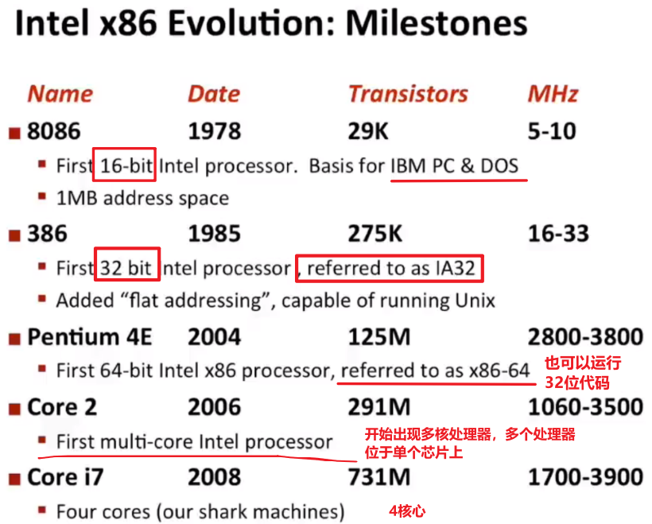  

# 多核处理器
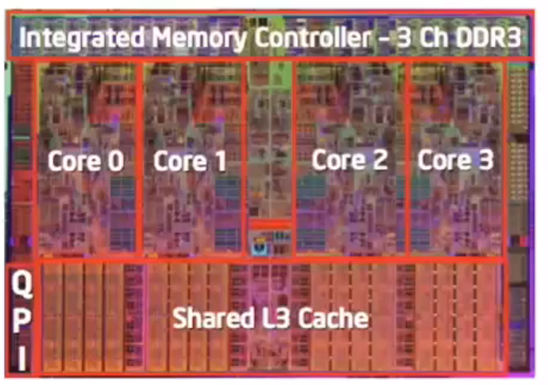    

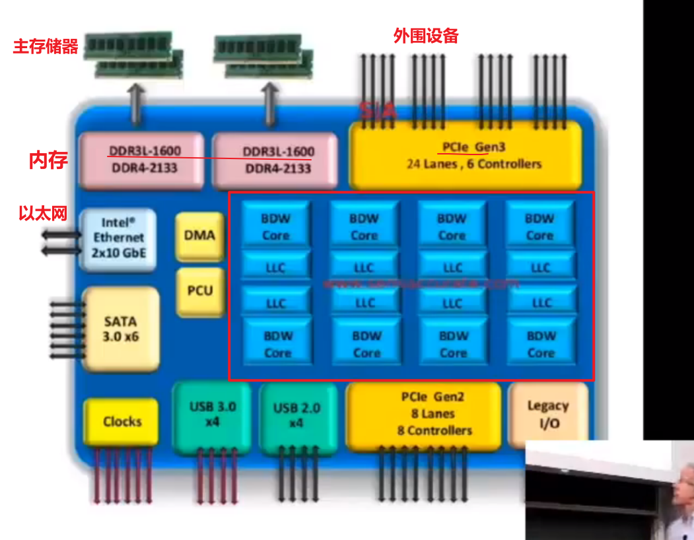  

另一个公司：AMD  
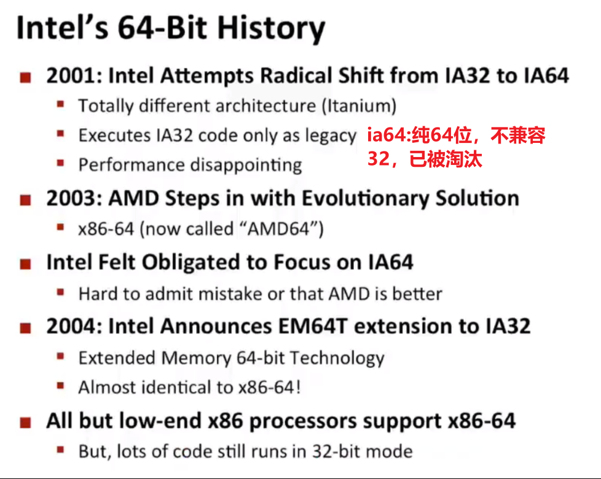  

# 教学范围
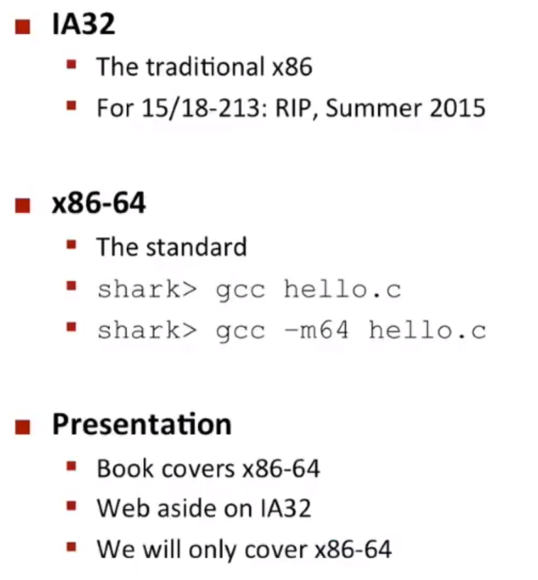  

# 哪些处理器
- ARM(AcornRISCMachine)，比x86机器功耗更低
- x86
# 定义
- 指令集
- 寄存器：非常小的内存位置
- 机器指令  
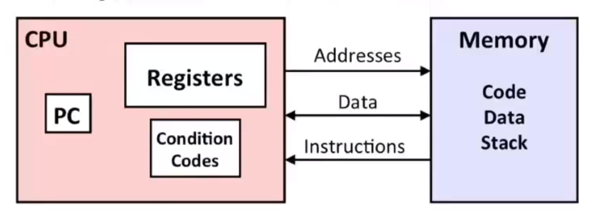  

（无法直接操作缓存(没有这个概念），是机器级别的概念)  
# 将c源代码转换成目标文件
  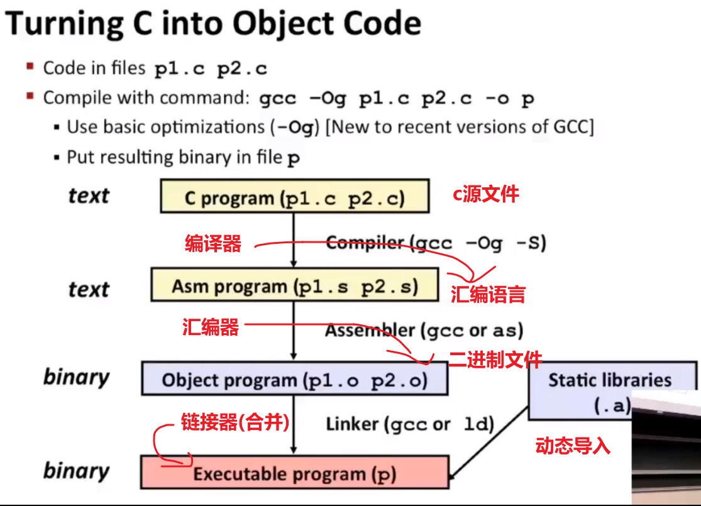  
# 汇编简介
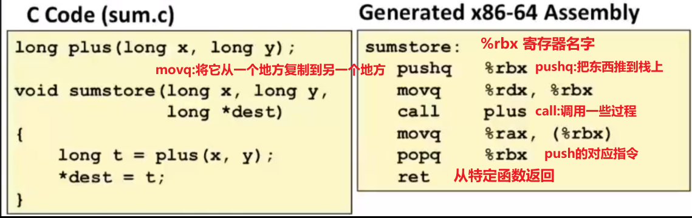  

```shell
gcc -Og -S sum.c #-Og 调试级别的优化过的（英文字母大写O)； -S 生成汇编 
```

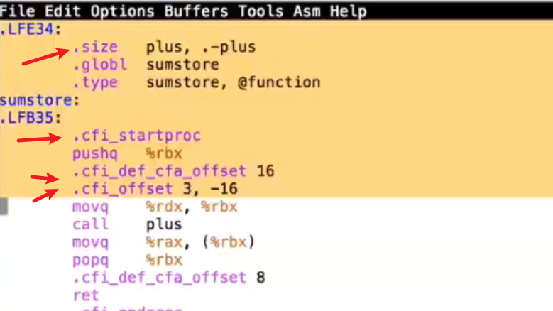  
带点的这些，是给调试器用的(用来定位)；也有一些是给链接器用（告诉它这是个全局定义的函数） 
## 数据类型
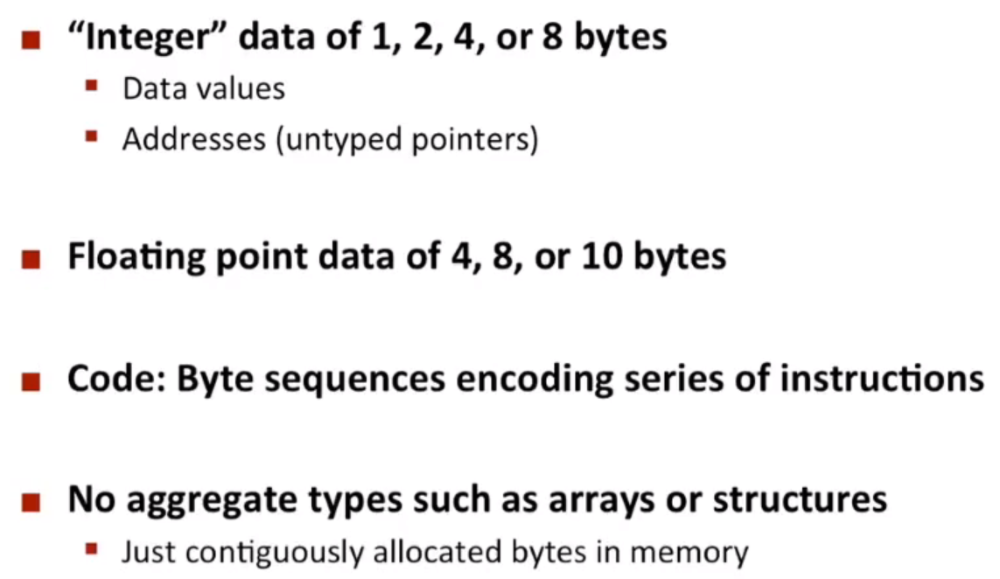  

1. 多种整数数据类型（不区分符号与无符号，都以数字形式存储在计算机）
2. 浮点（使用和整型不一样的寄存器组）
3. 程序本身在x86中，是一系列字节  
4. 没有数组或结构，由编译器人工处理

## 指令
每条指令做的事很有限（只做一件小事）
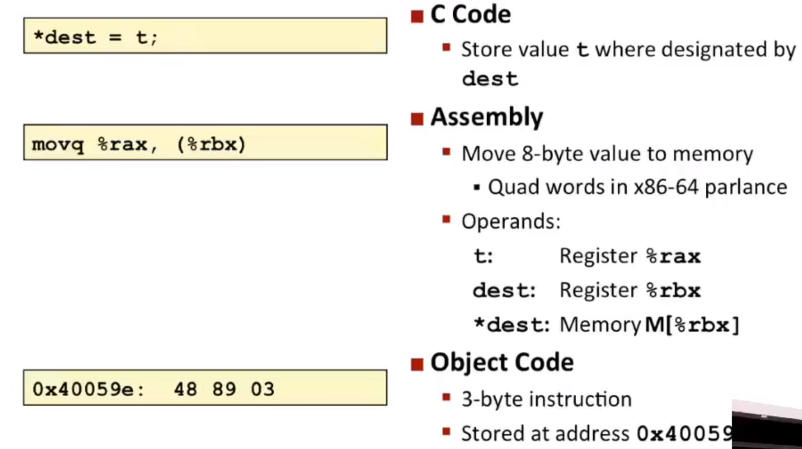  
## 反汇编
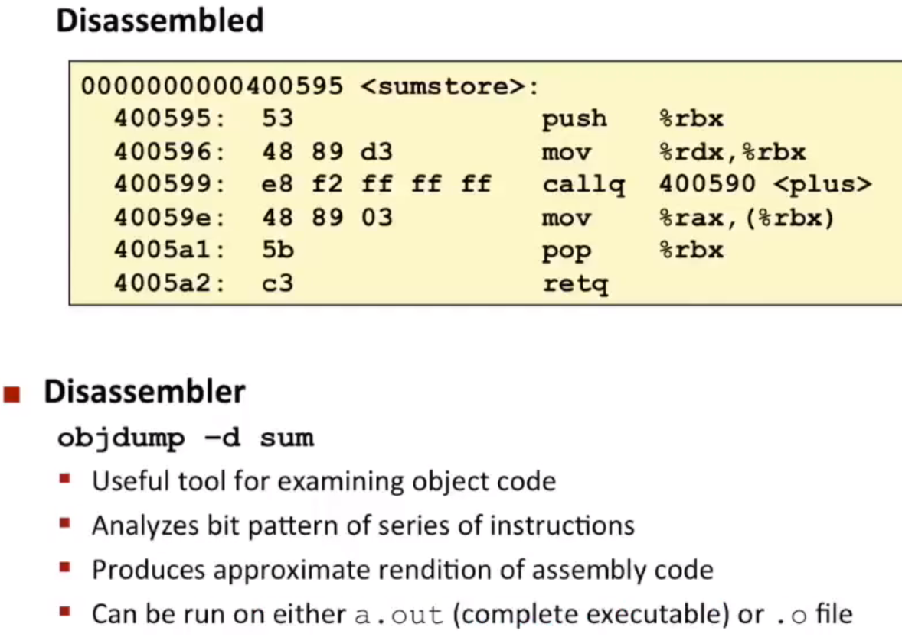  

## 举例
  

- 变量的概念在汇编级别代码中完全消失（变成了寄存器或内存中某个东西）
# 使用gdb反汇编
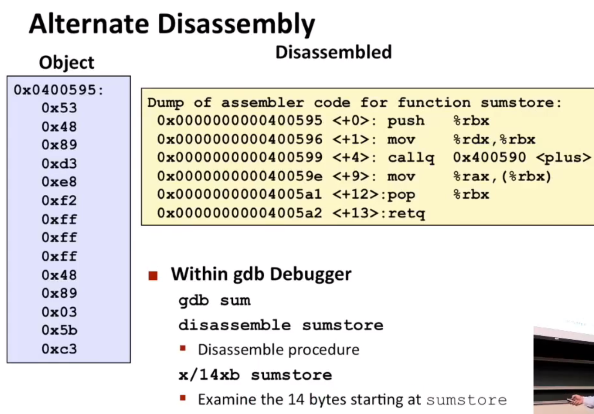  

# 各种寄存器(8,4字节)

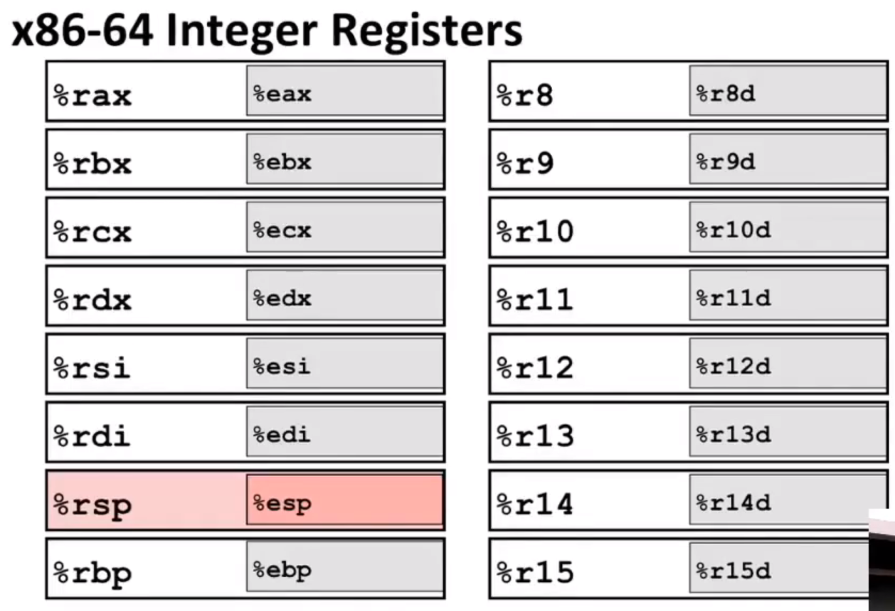  

## IA32寄存器(4，2，1字节)

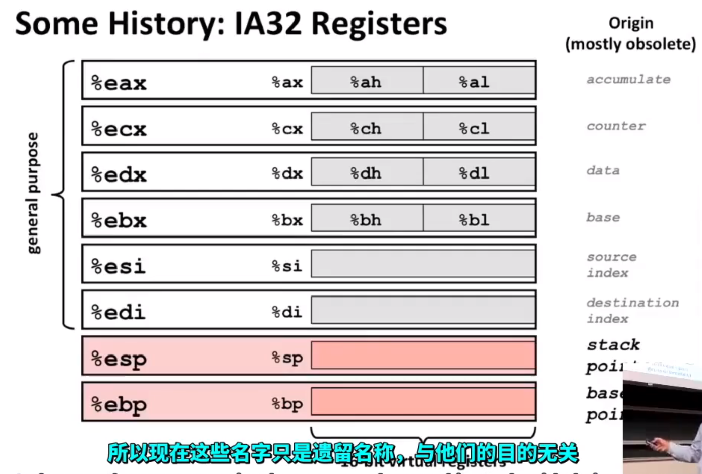  

## x86-64
  

# 操作(移动数据)

