# 概述
procedures：面向过程编程中的函数、过程，或者，面向对象中的方法  
abi(应用程序二进制接口): application binary interface。它要求所有Linux程序、编译器、操作系统、系统所有不同部分，都需要对如何管理机器上的资源有一些共同的理解。机器程序级别的接口。  
- ABI关注的是二进制代码如何在实际硬件上执行和交互 
- Windows、Linux 和 macOS 的 ABI（应用程序二进制接口）在核心设计上有显著差异，这导致它们的二进制程序通常无法直接跨平台运行。  

# 控制(函数调用)

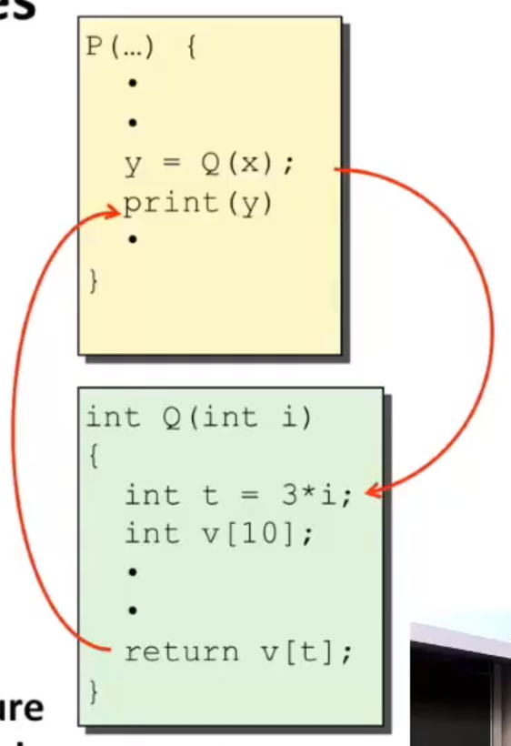  

1. 将控制权转移给另一个函数，且函数执行完毕后返回控制权
2. 如何传参，以及被调用函数如何将结果传给调用函数
3. 被调用函数中的局部变量分配问题
4. 尽量减小过程调用中的开销(对于程序员，良好的编程习惯: 尽量多功能多函数)

# 控制权转移

- stack(栈)：其实只是普通内存的一块区域
- 对于汇编层面的程序员来说，内存只是一个巨大的字节数组
- 用栈来管理==过程调用与返回==的状态
- 利用栈后进先出的特点：调用函数时需要一些信息，从函数返回需要丢掉一些信息。

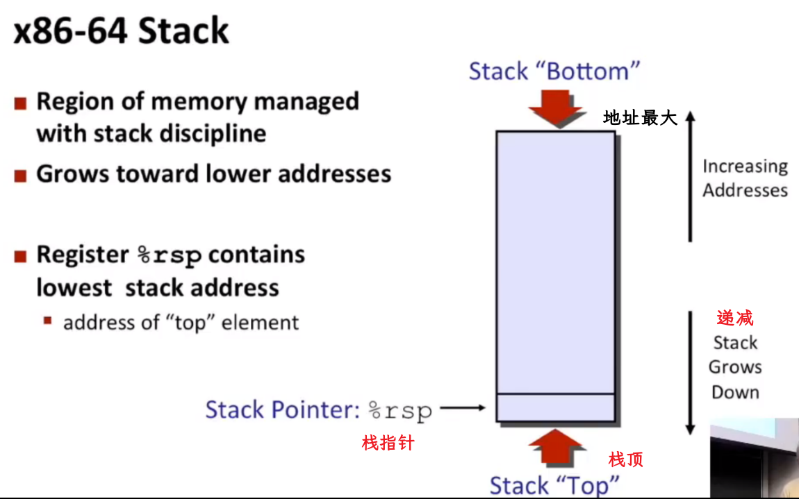  

## pop
这是三个操作复合成一个操作（先读取，后递减栈指针，最后存储值）  

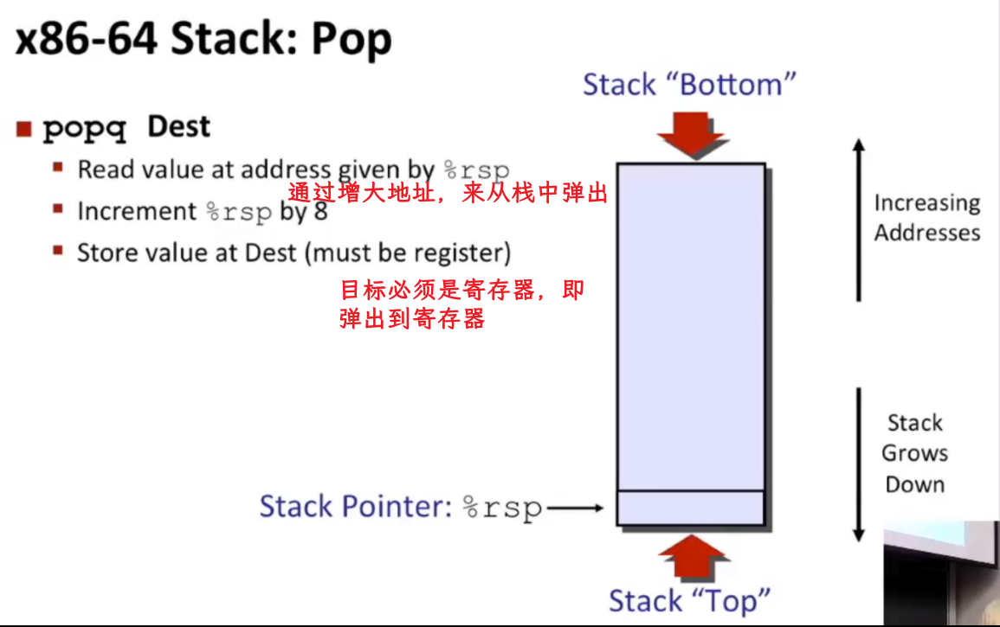  

栈的释放只是移动栈指针，没有其他特殊操作。数据还在内存中，只不过不是栈的一部分了。  

## push

- 被push的参数，也必须是寄存器，或立即数。（因为不允许直接从内存传递数据到内存）  
- 这也是个复合操作：获取操作数，递减栈指针(而且，内存读一个数据，数据的地址指的是它的(最)低地址)，最后写入值  

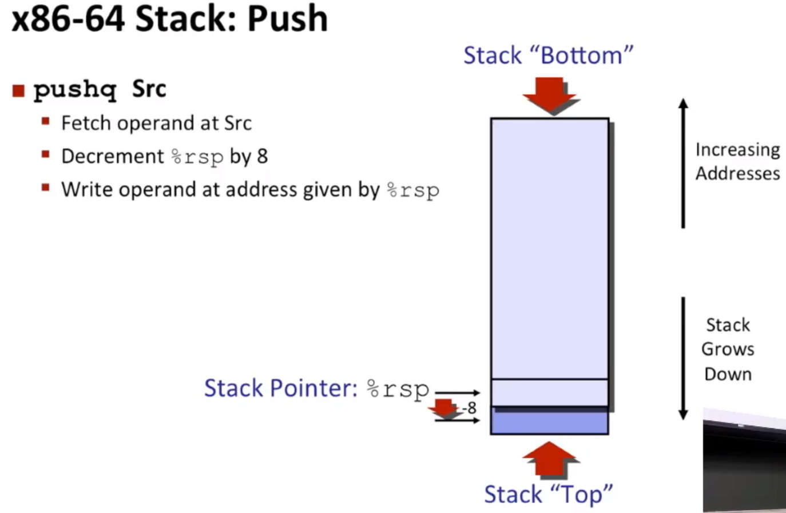  

## 例子1
- call和ret引用了栈的思想 
- 局部变量的存取通过 %rsp 偏移(%rsp-8,%rsp+8之类)实现，不会直接修改 %rsp  

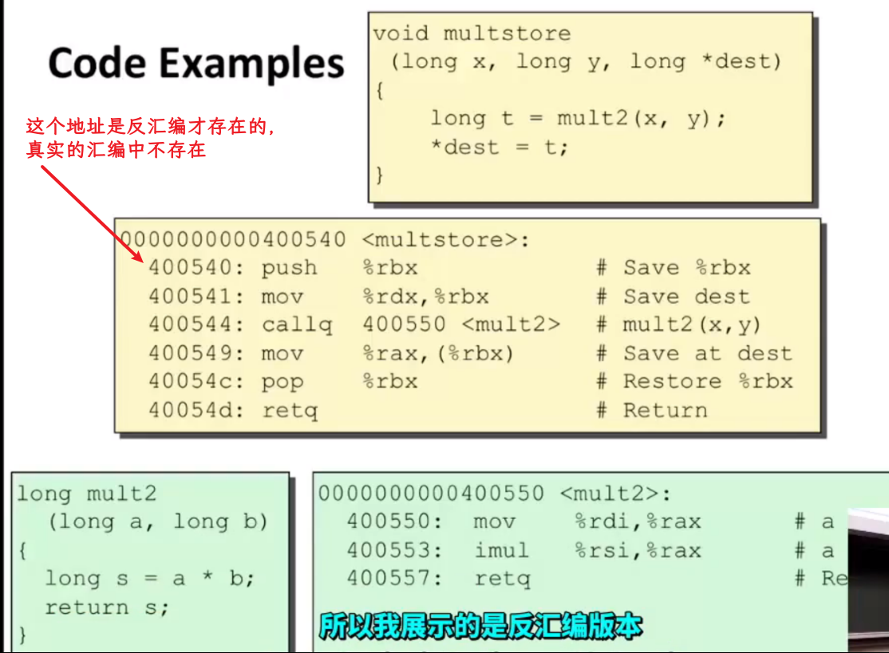  

调用前将返回地址压入栈中，然后去执行函数，调用后从栈顶(%rsp)取出调用函数前存的下一条指令的地址，并将%rip(程序计数器[Program Counter, PC]设置为该值   
~~注意：在函数返回前，需通过 add $N, %rsp 或 leave 指令（相当于 mov %rbp, %rsp + pop %rbp）恢复[很重要!!] %rsp 到调用前的状态。~~    

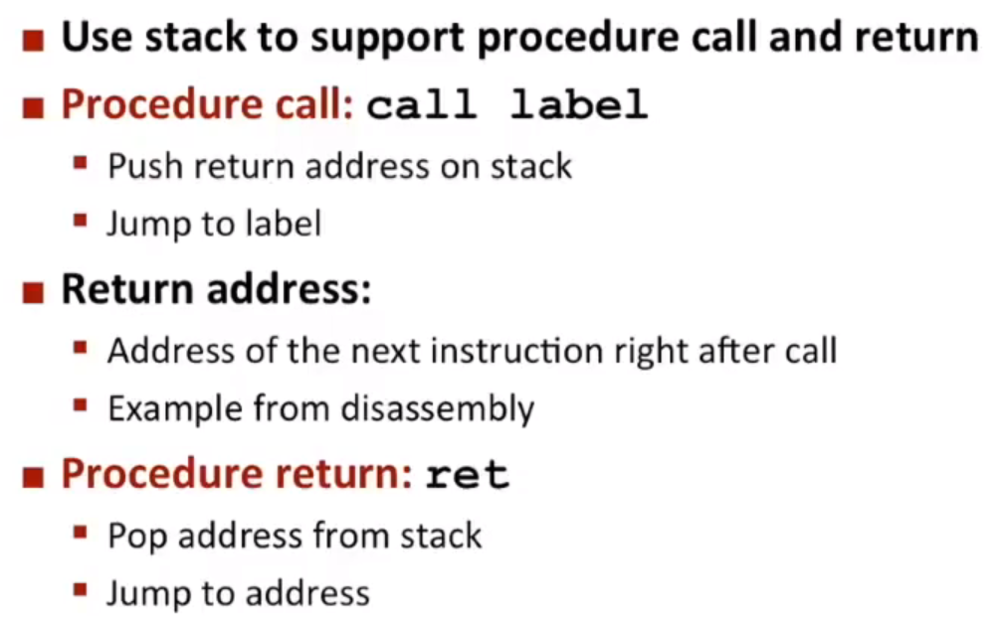  

## 例子2(call)

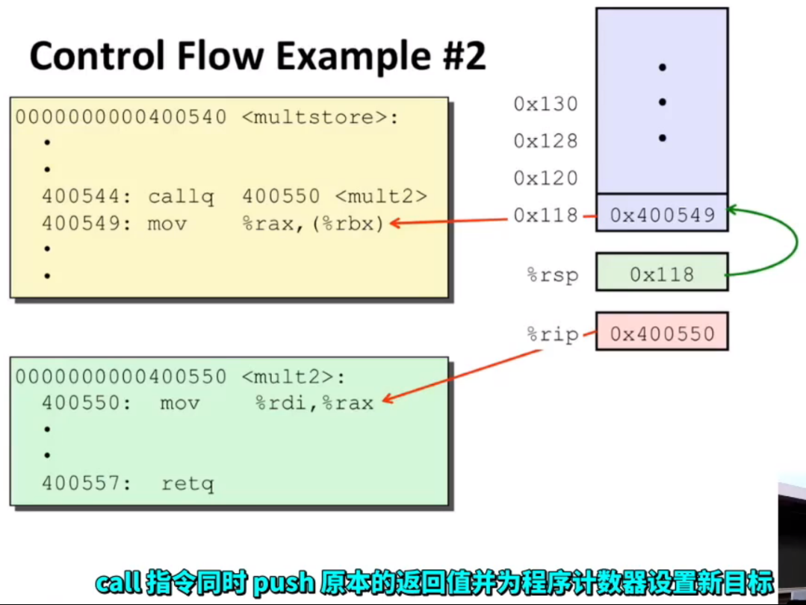  

## 例子3(ret)

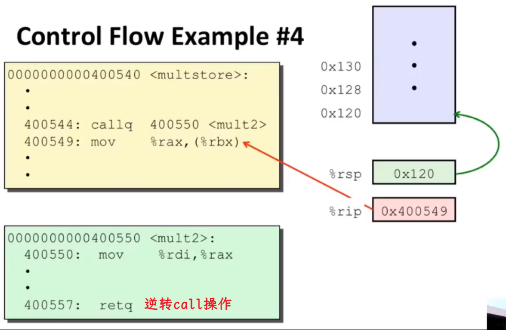  

# 传递数据

这里的参数说的是整型，浮点数是另一组  

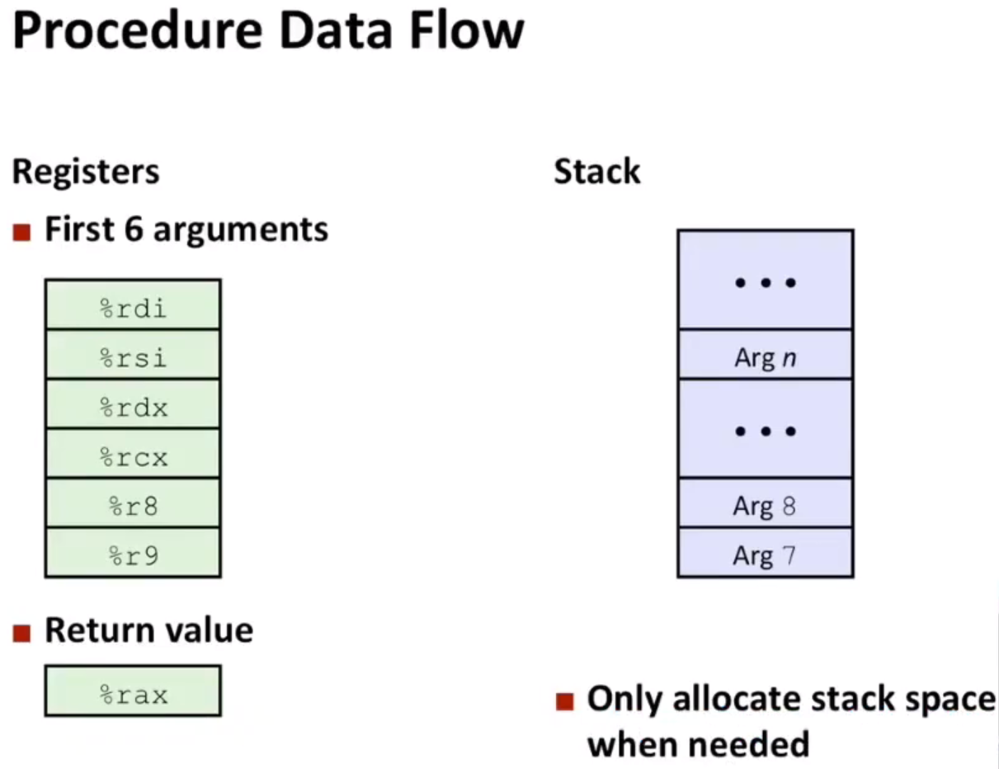  

如果超过了6个，如下图，最后的那个参数(接近栈底)先分配  

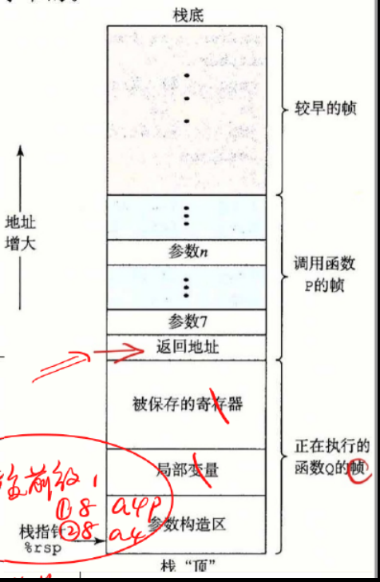  

## 例子

无论是什么参数，都按列出的顺序被传递给这(上图)一系列寄存器  

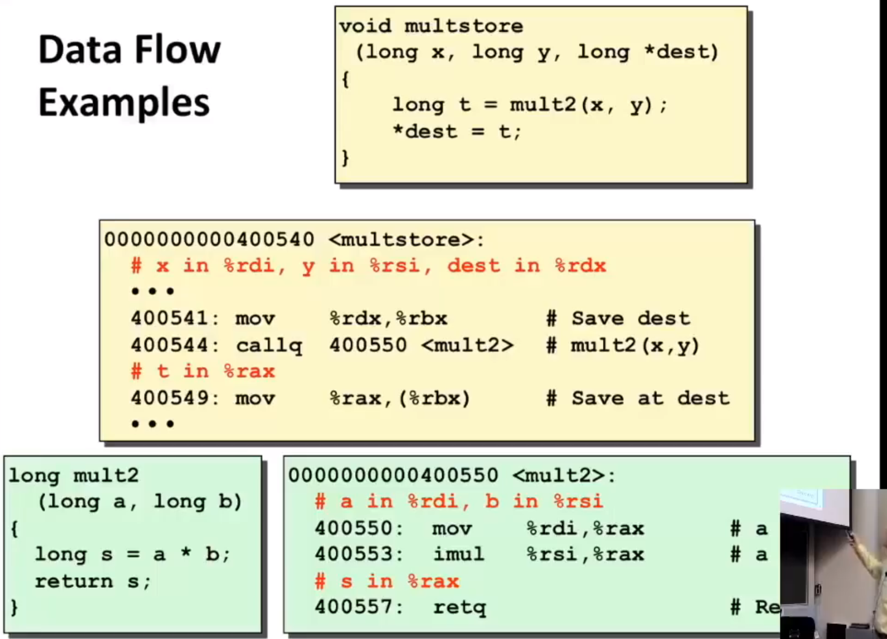  

# 本地数据(local variable)

- 栈帧：一种特别的内存分配模式(在当前函数分配他需要的空间)  
- 给定任何时间内只有一个函数在运行(单线程)  
- 把栈上用于特定call的每个内存块，成为栈帧

## CallChainExample
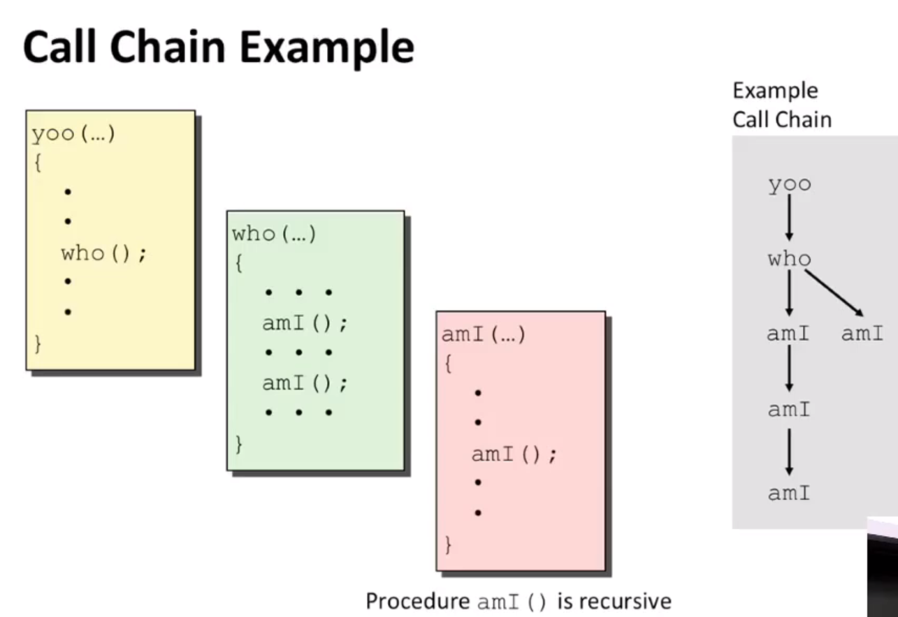  

## 栈帧
- %rsp(栈指针)，始终指向栈的顶部（即当前可用内存的最低地址），由 CPU 硬性维护。必须存在（不可省略）
- %rbp(基址指针/帧指针)，通常用于标记当前栈帧的起始位置，便于访问局部变量和参数，可选（可被优化省略）  

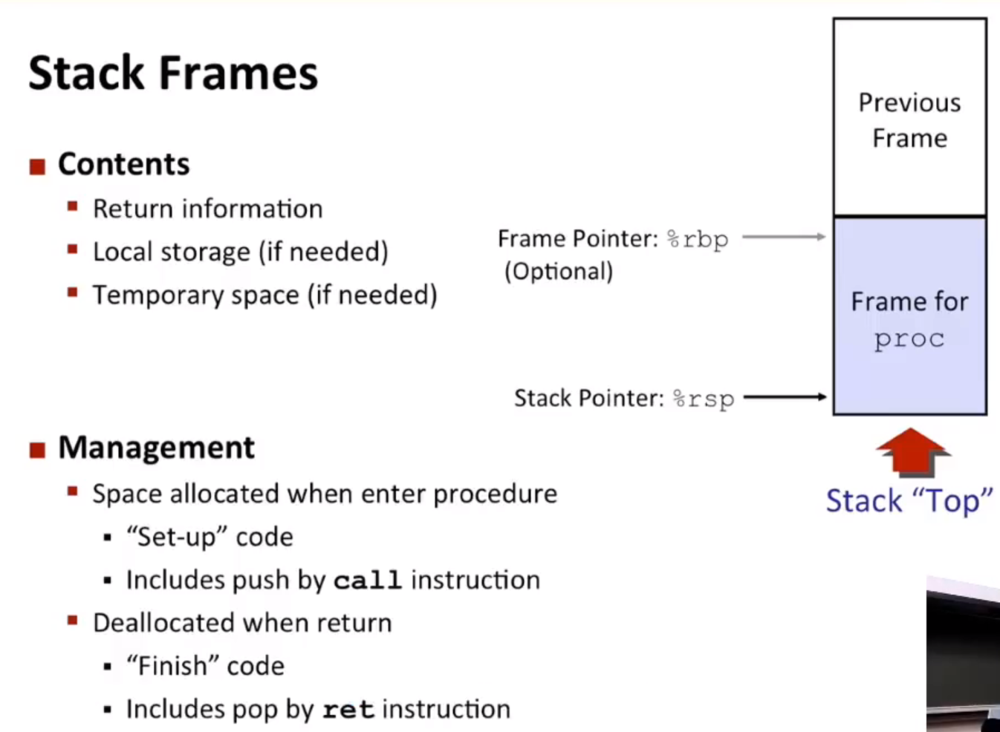  

### 几个误区
1. 误区：返回地址存储在 %rbp 中。事实：返回地址在栈中，由 %rsp 或 %rbp 的偏移量定位（如 8(%rbp)）。
2. 误区：每次访问局部变量都会改变 %rsp。事实：只有分配/释放栈空间时 %rsp 会变，访问变量是通过固定偏移（如 -4(%rbp)）完成。
3. 误区：%rbp 必须用于访问局部变量。事实：优化模式下编译器直接用 %rsp 偏移访问变量（省略 %rbp）。
## 例子
每调用一次函数，%rbp都会改变，如果分配了新变量，%rsp也会改变  

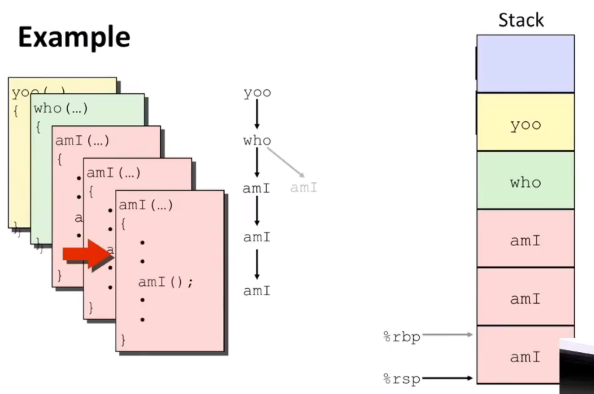  

系统限制了栈的最大深度，`递归`可能耗尽空间  

### 提问
*既然%rbp是可选的，那么程序怎么知道如何释放空间？如何将栈重置回原来位置*  
1. 编译器知道当它分配时，需要分配16(假设)个字节，那么它最终就会释放16个字节  
2. 如果分配的是可变大小的数组或内存缓冲区，会在这种情况下使用%rbp来实现这个目的  

# x86-64/LinuxStackFrame
在函数开始之前，所有的信息都已经在栈中  
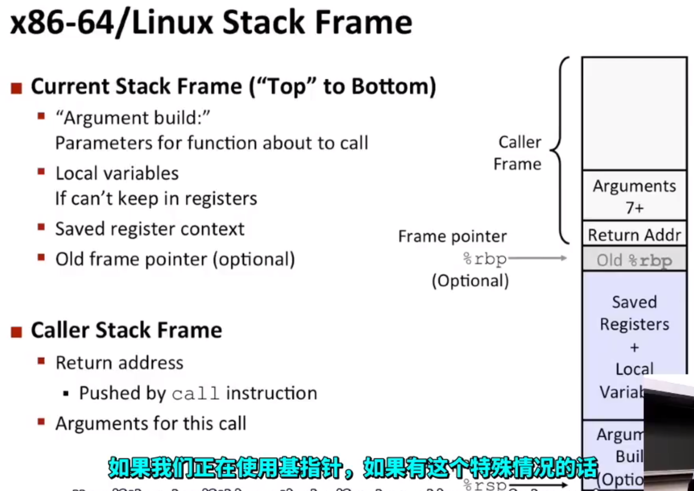  

## 例子1

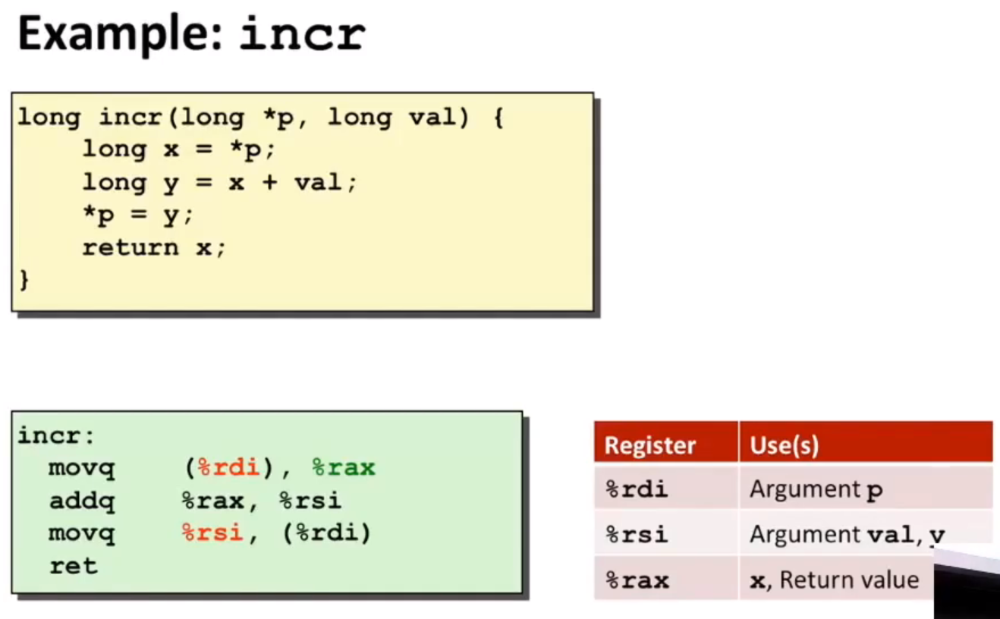  

~~该函数返回第一个参数原来的值，且第一个参数的值改为两参数之和。~~
## 例子2
