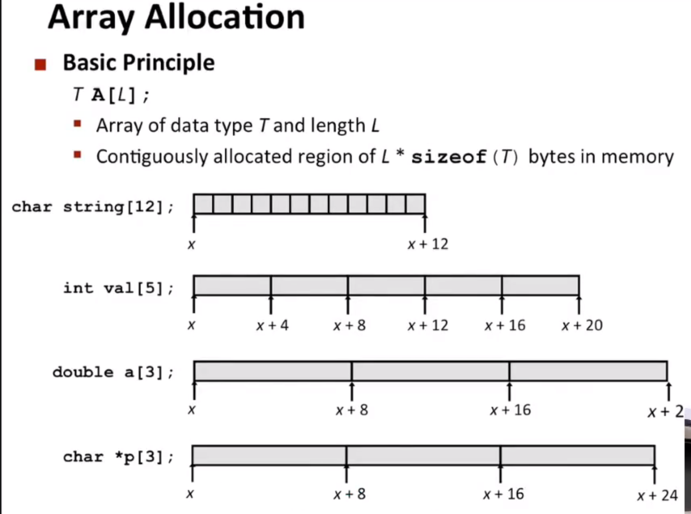
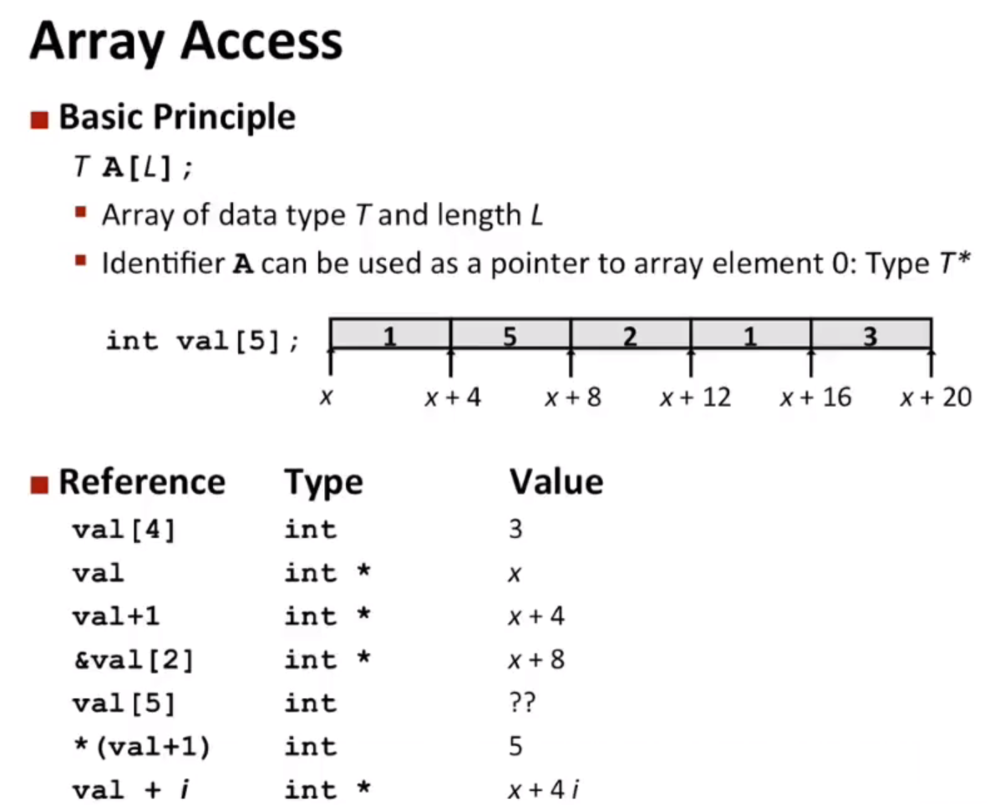
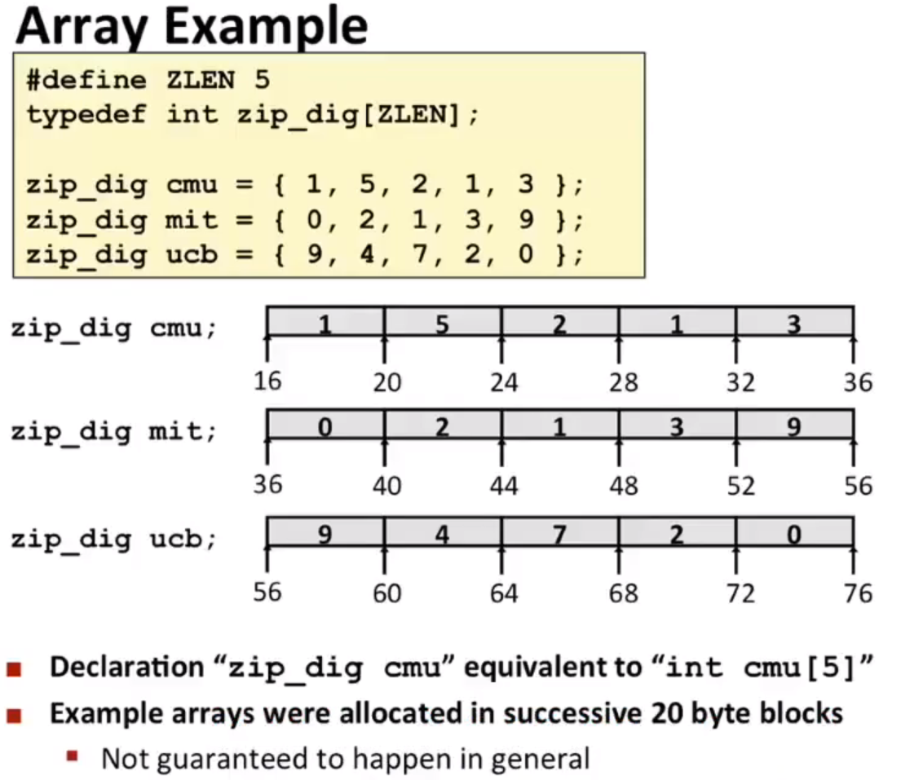
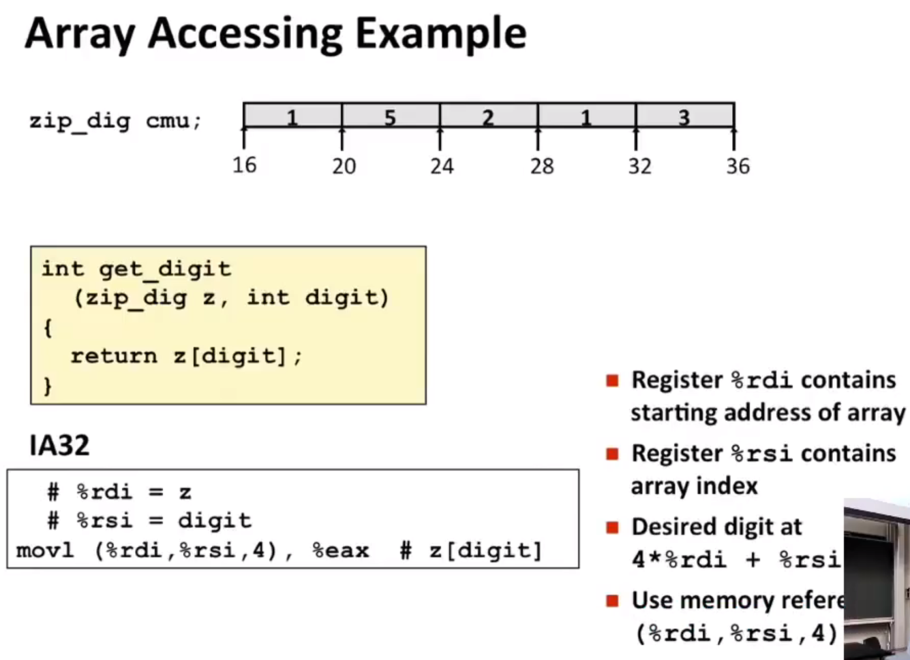
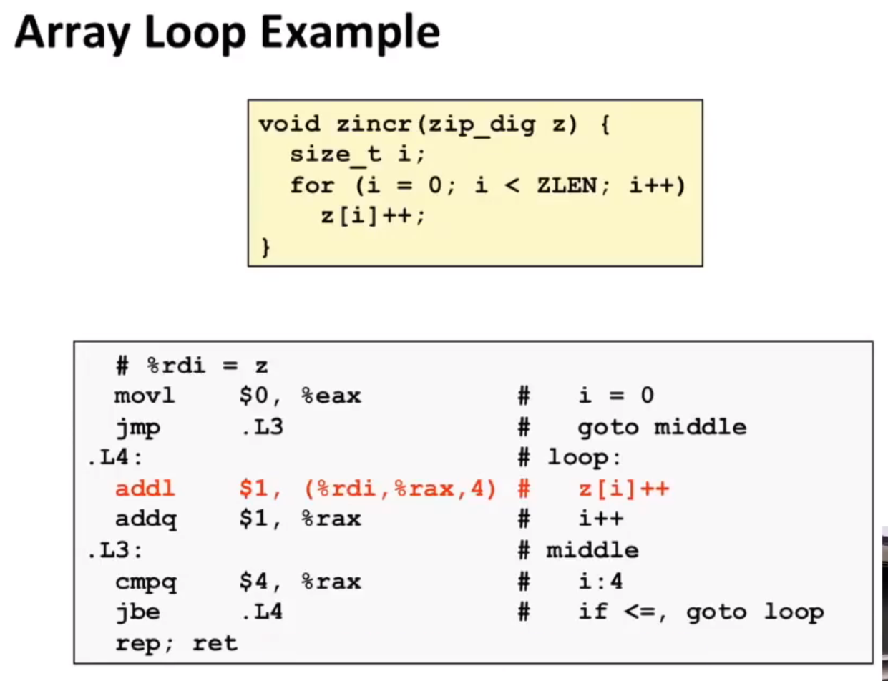

# 概述
~~数据表示~~  
目前都是操作整数、长整数、指针（标量数据），而不是聚合形式的数据  

*数组、结构*    

*在机器内存中的表现方式*  

数组不过是一堆字节，但是这些字节的集合，是在连续位置上存储的；结构也是如此，作为字节集合来分配的  

# 数组分配

x,x+4,x+8这些都是内存地址(机器代码会这么处理)(不是指数组下标)  

  

`T A[L];`  
1. 分配足够的存储字节来保存整个数组 
2. 像对待指针一样对待标识符A  

  

对于找val[4]这个元素，汇编中，编译器知道指针类型后，会自动写出合适的缩放因子，不需要程序员手动处理  

## 例子

  

## 访问数组的例子

  

## 循环处理数组元素

- `ZLEN=5，cmpq b,a` （比较的是a和b），jbe 低于或等于；这里就是说如果%rax 小于或等于4，则跳转到.L4 
	> 程序解释：先比较 %rax和$4，如果小于或等于0，则跳转到.L4
- `addl $1,(%rdi,%rax,4)`，首先从内存中读取原始值，进行加法运算，然后将结果放回内存中

  

# 多维数组
*数组和指针之间真正区别*  
当你在c中声明一个数组时，你既在分配空间，分配某个位置的空间，同时，也在创建一个允许在指针运算使用的数组名称。当你只是声明一个指针时，你所分配的只是==指针本身==的空间，没有给他指向的东西分配空间  

