# 概述
从程序员的角度来讨论这个话题
标准的Unix库：printf和scanf  
低级IO，直接面向操作系统  
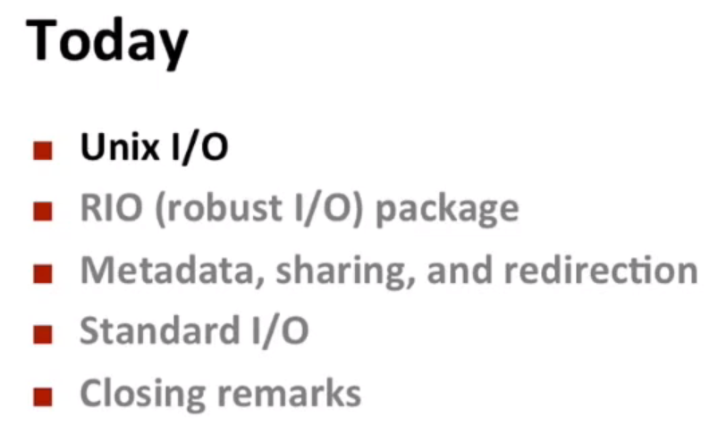  

# Unix I/O概括

用文件(一堆二字节序列)来描述很多抽象的事物，比如I/O设备，打字机；网络连接(套接字)，消息是写入套字节传送，读取套字节接收；

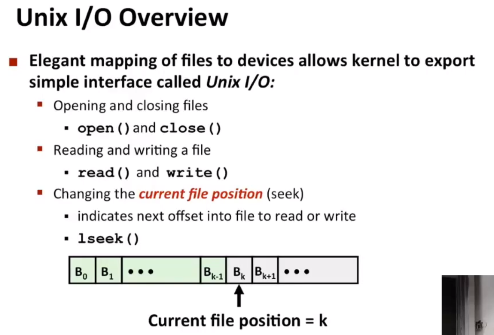  

文件还有个属性：读取位置；网络套接字不允许在时间上跳转，只能在数据包进入时对其进行读或写  

# 文件类型
文件、目录、套接字(作为发送和接收)、应用程序之间接收发送（视频不讲）  
符号链接（多指针指向同一文件等）

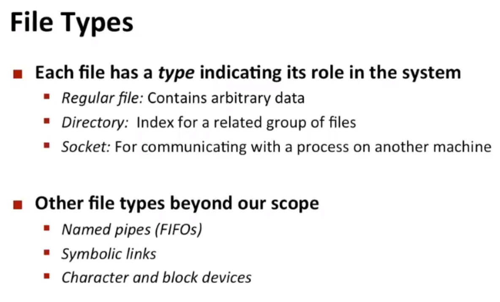  

# 普通文件
- 有些应用程序会区分文本文件和二进制文件(不是在操作系统级别区分，而是在更高级别)
	- 主要区别：文本文件只有标准的ASCII字符或者对非英文字符编码的Unicode字符
	- 二进制文件是*图像*或*实际目标代码*或*音视频文件*等所有其他的文件(这类文件有一个字节序列直接是某种形式编码的数字)
	- 文本文件：新行 符号，0xa；windows：\r\n ~~0xd 0xa~~，Linux：\n ~~0xa~~
	

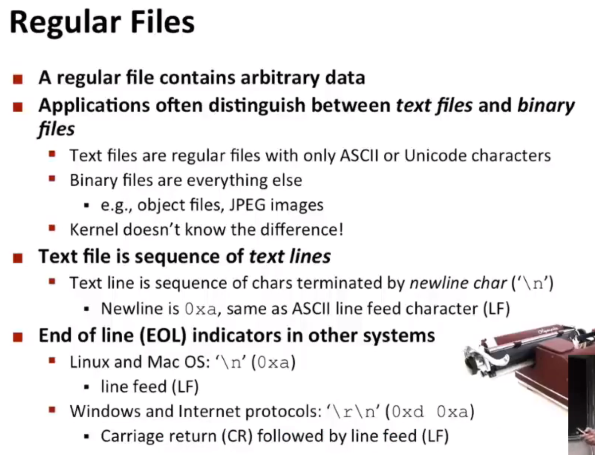  

# 目录
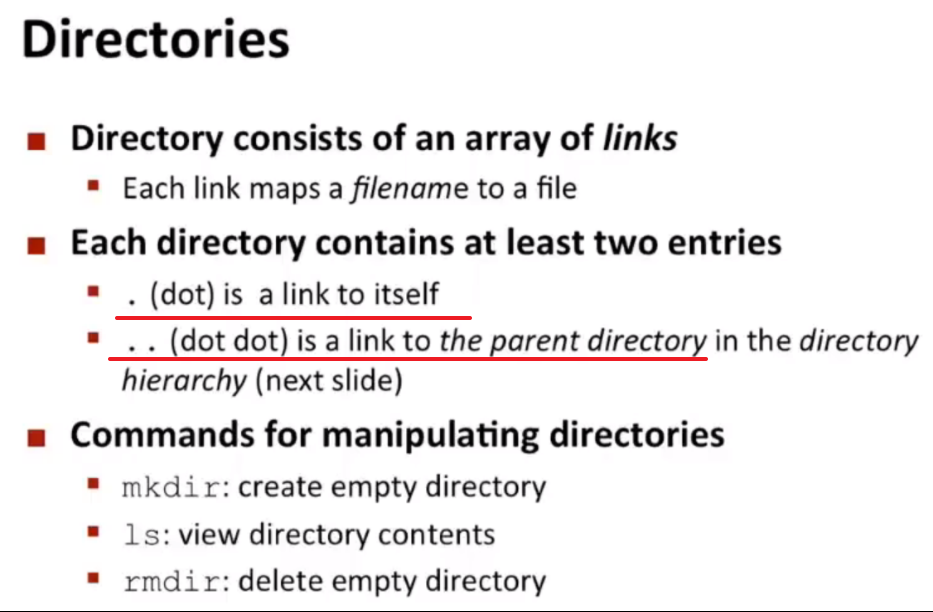  

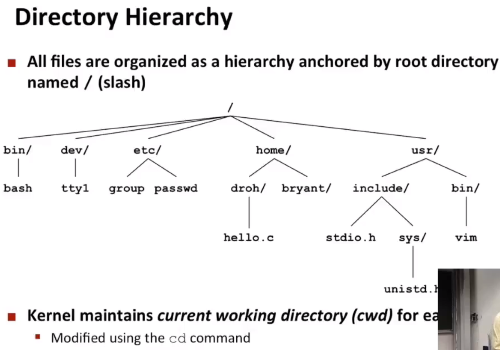  

## 目录名

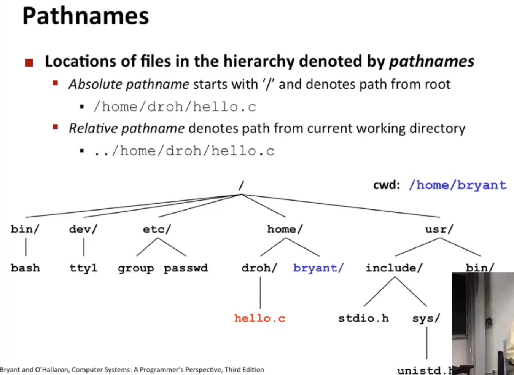  

# 打开文件
- 以指定方式打开文件，这里会返回一个==文件操作符==    
- O_RDONLY（什么模式下访问文件）  

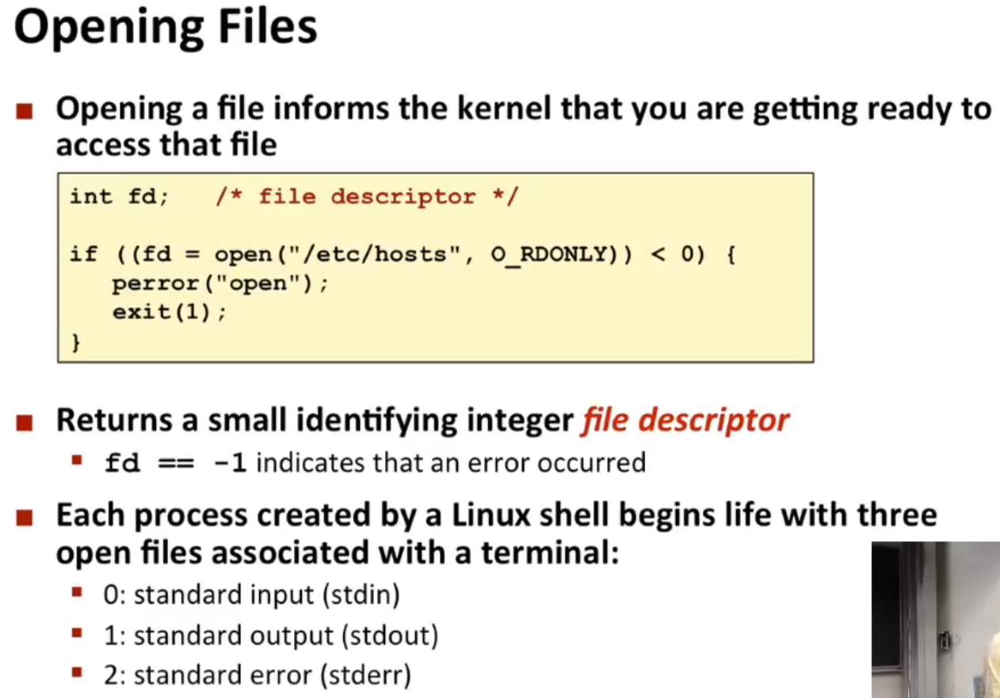    

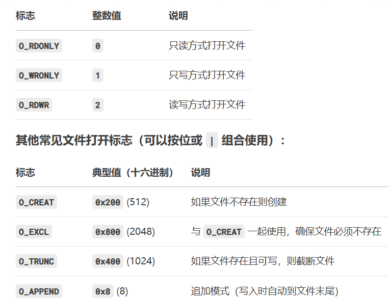  

- 同时打开的文件数量有限  
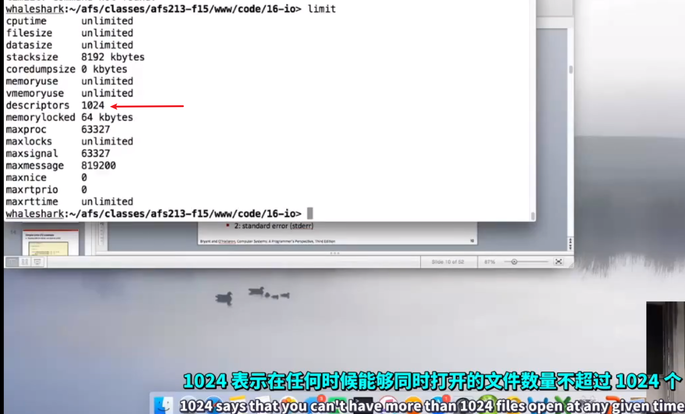  

==每次进行系统调用时都应该检查返回值==，看看是否存在错误，并采取适当方法处理错误  

- 有几种和终端关联的文件：标准输入、标准输出、标准错误  

# 关闭文件
多线程中容易出错，关闭已经关闭的文件  

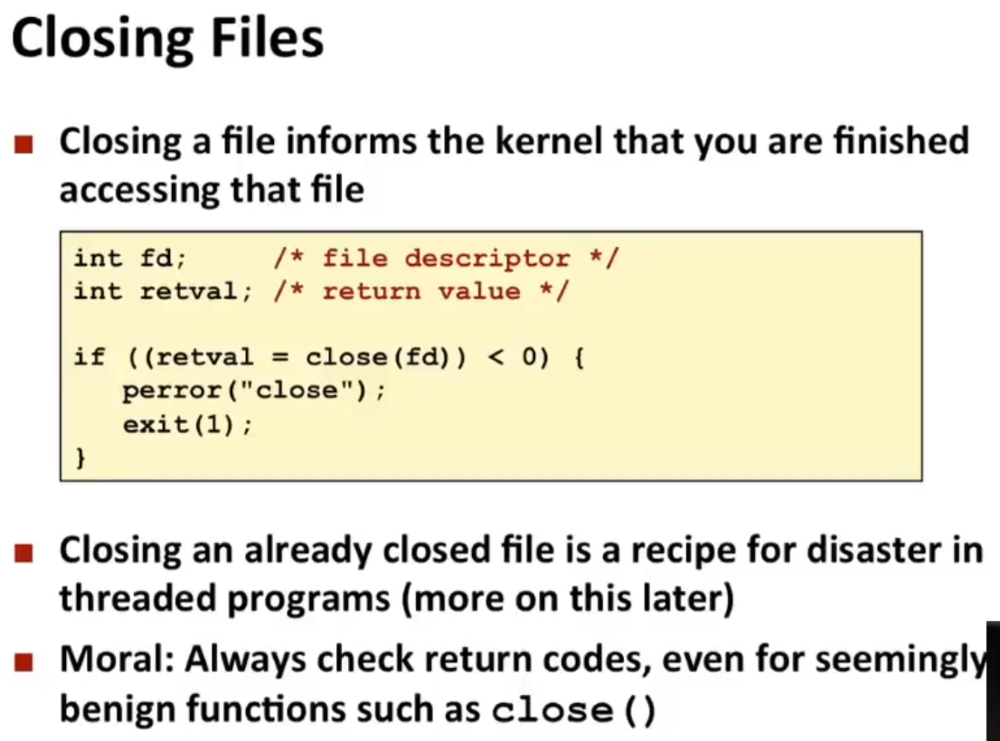  

# 读文件

读入若干字节数（最小是1）