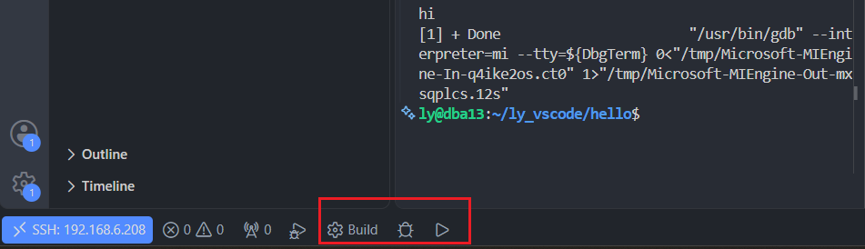

## Remote - SSH

流程：

```bash
Windows VS Code
        |
        | SSH
        ↓
Ubuntu虚拟机
        |
        ↓
/home/ly/ly_vscode/hello
```

VS Code实际上运行在Ubuntu里：

* 文件系统：Ubuntu
* 编译：Ubuntu gcc/cmake
* gdb调试：Ubuntu gdb
* 终端：Ubuntu shell

Windows只是显示界面。

### 1. Ubuntu安装SSH服务

Ubuntu：

```bash
sudo apt update

sudo apt install openssh-server
```

查看：

```bash
systemctl status ssh
```

启动：

```bash
sudo systemctl start ssh
```

### 2. VS Code安装插件

Windows VS Code：

安装：

```bash
Remote - SSH
```

微软官方插件。

### 3.连接Ubuntu

VS Code：

```bash
Ctrl + Shift + P

Remote-SSH: Connect to Host
```

输入：

```bash
ly@192.168.6.206
```

你的情况类似：

```bash
ly@192.168.6.206
```

连接成功后：

左下角：

```bash
SSH: 192.168.6.206
```

## 指定打开目录

连接后：

VS Code：

```bash
File
 ↓
Open Folder
```

输入：

例如：

```bash
/home/ly/ly_vscode/hello
```

那么：

VS Code左侧看到的根目录就是：

```bash
hello
├── CMakeLists.txt
├── src
│   └── main.cpp
└──  
```

这个就是你的“映射根目录”。

# 调试C++程序

安装：

```shell
C/C++ Extension Pack
```

微软的那个。

目录：

```shell
ly_vscode

├── CMakeLists.txt
├── main.cpp 
```

CMake：

```cmake
cmake_minimum_required(VERSION 3.20)

project(test)

add_executable(test main.cpp)
```

## 编译

```bash
apt install g++ cmake -y 
#Linux中，项目根目录下
mkdir build
cd build

cmake ..
make
```

生成：

```
build/test
```

***也可以通过安装CMakeTools编译***

- VSCode中：安装CmakeTools插件 
- 打开项目根目录
- Ctrl+Shift+P --> `CMake:Build`即可

## 调试

你现在 Remote-SSH 已经成功，说明**代码环境已经在 Ubuntu 里面了**。但是 VS Code 默认的“运行”按钮通常只是执行程序，不会启动调试器。

C++ 调试需要走 **gdb + VS Code 调试配置**。

### 1. 先确认 Ubuntu 有 gdb

Ubuntu终端：

```bash
gdb --version
```

如果没有：

```bash
sudo apt install gdb
```

### 2. 安装 VS Code C++ 插件

远程状态下（左下角 SSH）：

安装：

```
C/C++ Extension Pack
```

微软的那个。

注意：

Remote-SSH 下插件会安装到 Ubuntu 里面。

### 3. 创建调试配置

你的项目目录：

例如：

```
test
├── main.cpp
├── CMakeLists.txt
└── build
    └── test
```

VS Code：

```
Run and Debug
    ↓
create a launch.json file
```

选择：

```
C++ (GDB/LLDB)
```

生成：

```
.vscode/launch.json
```


修改：

```json
{
    "version": "0.2.0",
    "configurations": [
        {
            "name": "Debug C++",
            "type": "cppdbg",
            "request": "launch",

            "program": "${workspaceFolder}/build/test",

            "args": [],

            "stopAtEntry": false,

            "cwd": "${workspaceFolder}",

            "MIMode": "gdb",

            "miDebuggerPath": "/usr/bin/gdb",

            "externalConsole": false
        }
    ]
}
```

关键：

```json
"program"
```

必须指向你的可执行文件。

比如你的程序叫：

```
build/test
```

那么：

```json
"program": "${workspaceFolder}/build/test"
```

### 4. 编译时必须带调试信息

否则断点不会生效。

你的 CMake：

```cmake
set(CMAKE_BUILD_TYPE Debug)
```

或者：

```bash
cmake -DCMAKE_BUILD_TYPE=Debug ..
```

然后：

```bash
##build文件夹中执行这个
cmake --build .
```

检查：

```bash
file build/test
```

应该看到类似：

```
with debug_info
```

### 5. 设置断点

例如：

main.cpp

```cpp
#include <iostream>

int main()
{
    int a = 10;

    std::cout << a << std::endl;

    return 0;
}
```

点击：

```
int a = 10;
```

左边出现红点。


### 6. 开始调试

按：

```
F5
```

或者：

左侧：

```
Run and Debug
↓
Debug C++
```

程序会停在断点。

你可以：

| 快捷键       | 功能   |
| --------- | ---- |
| F5        | 继续运行 |
| F10       | 单步跳过 |
| F11       | 进入函数 |
| Shift+F11 | 跳出   |
| Shift+F5  | 停止   |


### 7. CMake项目更推荐这样配置

安装：

```
CMake Tools
```

然后：

底部会出现：

```
Build
Run
Debug
```

 

选择：

```
Debug
```

CMake Tools会自动生成调试配置。

# 你现在的状态应该是：

```
Windows
   |
VS Code
   |
Remote SSH
   |
Ubuntu VM

/home/ly/hello
       |
       |
     CMake
       |
       |
     gcc
       |
       |
     gdb
       |
       |
   VS Code Debug
```

这套流程和以后：

* ROS2
* 云服务器
* C++工程
* SLAM
* OpenCV

基本一致。

你现在可以先做一个小测试：写一个 `while` 循环或者两个变量计算，然后打断点，看变量窗口变化。这样能确认整个 **VS Code → SSH → gdb → C++程序** 链路正常。
