# WelcomeToCpp

- 使用c++可以控制CPU应该执行的每条指令
- C++的代码编译后可以在任何平台运行，前提是有一个==为对应平台生成机器代码的编译器==
- 与C++不同，C#或JAVA，他们在虚拟机中运行，运行时将代码从“中间语言”转换为机器代码
- 学习新事物的关键就是对事物进行实验
- 将讨论如何利用C++库
- C++实际上如何工作
- 关于内存和指针：内存区域，智能指针，移动语义，==模板==
- 宏，以及为多个平台编程
- 编写自己的数据结构，学习如何使他们比C++标准库中的结构更快
- 低级优化，与编译器和汇编相关

# 设置C++
## windows平台

1. 需要文本编辑器，将C++代码编写为文本文件，传递给编译器以生成某种可执行二进制文件，以便可以运行
2. 或者跳过1，直接用IDE，即有一套帮助你编写和调试代码的工具。（Visual Studio，视频用的2017，我这里下载的 Visual Studio Community 2022）
3. 安装勾选：  
   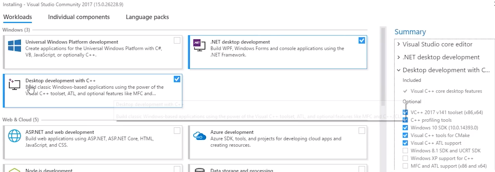  
4. 新建项目 
   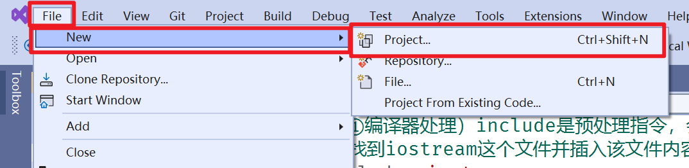
   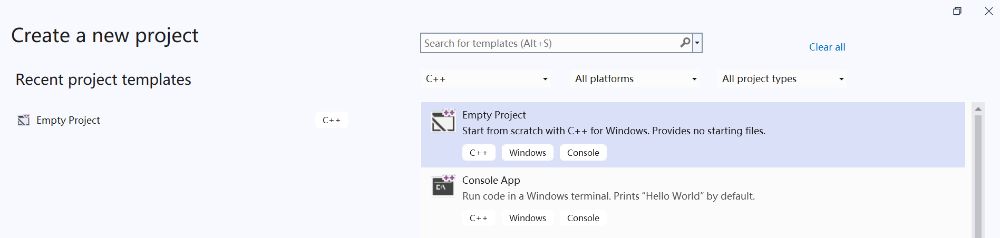  
   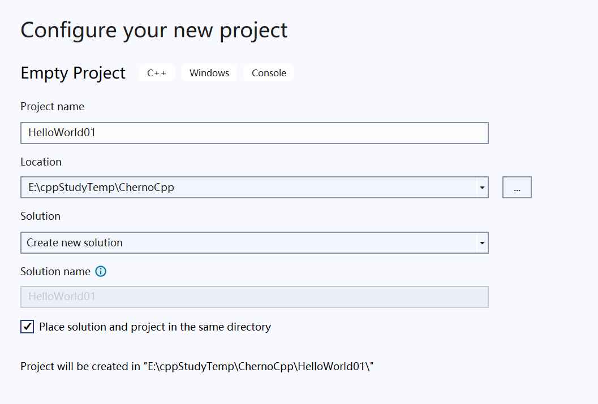  
   解决方案，solution，是一组相互关联的项目，他们有各种项目类型，解决方案就像工作台，每个项目本质上是一组文件，会编译成目标二进制文件（无论是库还是实际的可执行文件）

5. 添加新项
   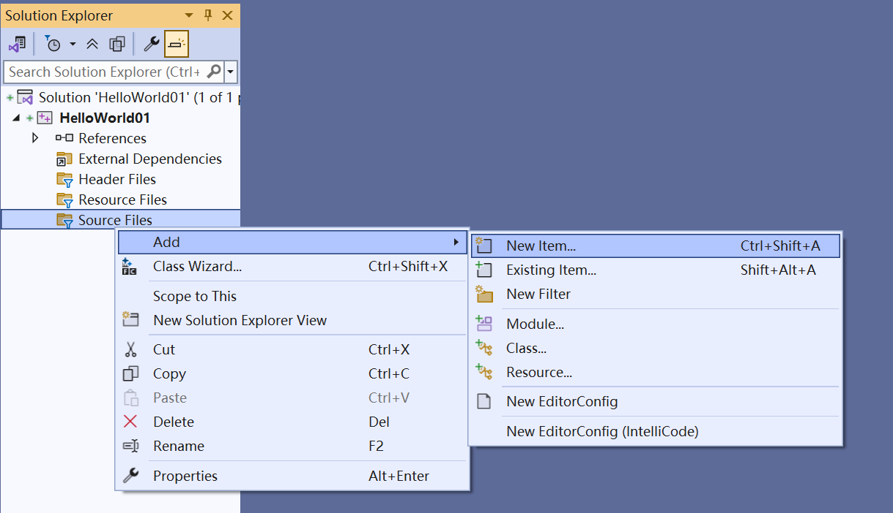  
   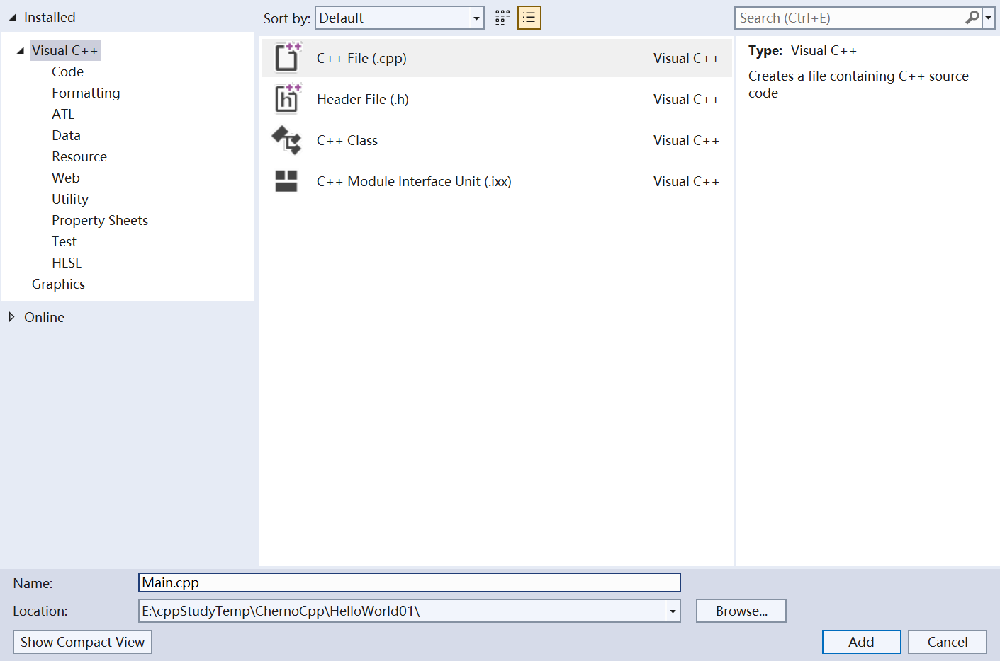
6. 代码文件(Main.cpp)  
   
```c++
#include <iostream>
int main() {
	std::cout << "hello world!" << std::endl;
	std::cin.get();
}
```

### 运行

1. 右键，构建（项目）  
   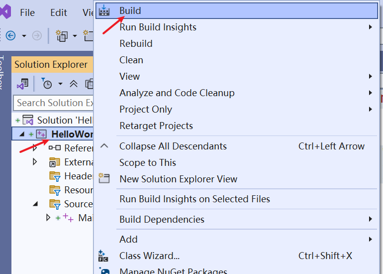  
   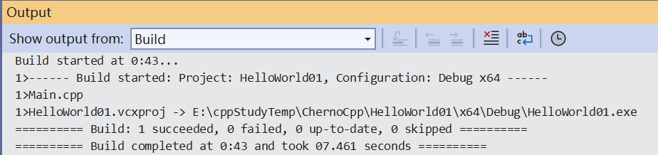  
   文件系统查看：  
   
   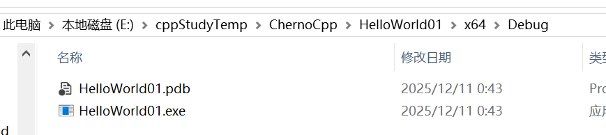  
2. 双击.exe文件，结果：  
   
   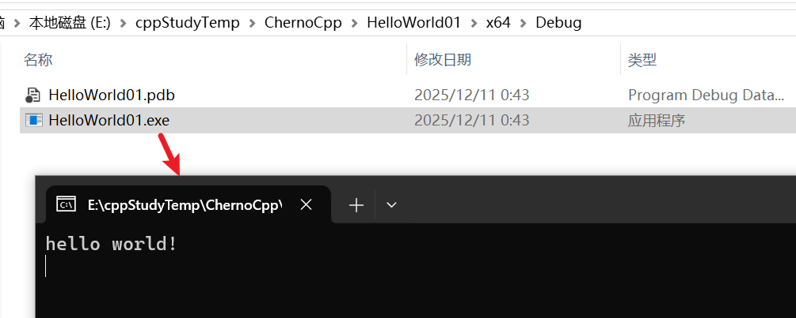  
   按任意键终止  

------  

或者单机本地的Windows调试器来运行它  

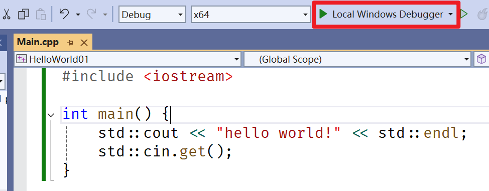  

会自动弹出终端程序  

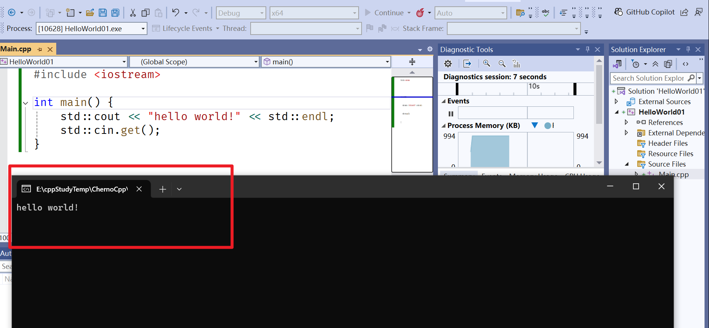  

## Linux平台

视频演示使用cmake为一个名为code light的IDE生成项目文件  

``` shell
sudo apt isntall vim g++ codelite cmake
```

构建这样一个文件结构树  

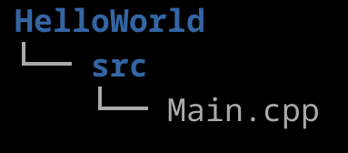  

编辑一个CMakeLists.txt文件  

```shell
# 设置 CMake 的最低版本要求为 3.5
# 这个命令必须放在 CMakeLists.txt 文件的最开头
cmake_minimum_required(VERSION 3.5)

# 定义项目信息
# 项目名称为 HelloWorld
# CMake 会自动生成相关变量，如 PROJECT_NAME, PROJECT_SOURCE_DIR 等
project(HelloWorld)

# 设置 C++ 编译选项
# CMAKE_CXX_FLAGS 是存储 C++ 编译器标志的变量
# -Wall: 启用所有警告信息
# -Werror: 将所有警告视为错误（强制处理所有警告）
# -std=c++14: 使用 C++14 标准
# 注意: 更好的做法是使用 set(CMAKE_CXX_STANDARD 14)
set(CMAKE_CXX_FLAGS "${CMAKE_CXX_FLAGS} -Wall -Werror -std=c++14")

# 定义源代码目录路径
# PROJECT_SOURCE_DIR 是项目的根目录路径
# 这里将 src/ 目录的完整路径保存到 source_dir 变量中
set(source_dir "${PROJECT_SOURCE_DIR}/src/")

# 使用 GLOB 命令自动收集源文件
# 从 source_dir 目录中匹配所有 .cpp 文件
# 注意: 使用 GLOB 时，新添加的源文件可能需要重新运行 CMake
# 对于大型项目，建议显式列出所有源文件
file(GLOB source_files "${source_dir}/*.cpp")

# 创建可执行目标
# HelloWorld 是可执行文件的名称
# ${source_files} 是前面收集的所有 .cpp 源文件
add_executable(HelloWorld ${source_files})

```

需要一个shell脚本  

```shell
#!/bin/bash
cmake -G "CodeLite - Unix Makefiles" -DCMAKE_BUILD_TYPE=Debug

#1. CodeLite IDE 的项目文件（方便在 IDE 中开发）
#2. Unix Makefiles（可以在命令行使用 make 命令）
#3. 配置为 Debug 构建模式（包含调试信息，不优化）
```

解释为什么要使用 `-Unix Makefiles`  

  

文件结构  

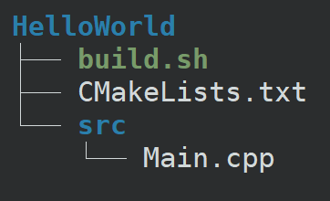  


运行  

```shell
chmod +x build.sh
```

运行信息：    

```shell
╰─❯ ./build.sh  
CMake Warning:
  No source or binary directory provided.  Both will be assumed to be the
  same as the current working directory, but note that this warning will
  become a fatal error in future CMake releases.


-- The C compiler identification is GNU 12.2.0
-- The CXX compiler identification is GNU 12.2.0
-- Detecting C compiler ABI info
-- Detecting C compiler ABI info - done
-- Check for working C compiler: /usr/bin/cc - skipped
-- Detecting C compile features
-- Detecting C compile features - done
-- Detecting CXX compiler ABI info
-- Detecting CXX compiler ABI info - done
-- Check for working CXX compiler: /usr/bin/c++ - skipped
-- Detecting CXX compile features
-- Detecting CXX compile features - done
-- Configuring done
-- Generating done
-- Build files have been written to: /home/ly/Dev/HelloWorld

```

运行结果  

```shell
╭─ ~/Dev/HelloWorld                                                                 ly@debian-ly 19:29:54
╰─❯ tree
.
├── build.sh
├── CMakeCache.txt
├── CMakeFiles
│   ├── 3.25.1
│   │   ├── CMakeCCompiler.cmake
│   │   ├── CMakeCXXCompiler.cmake
│   │   ├── CMakeDetermineCompilerABI_C.bin
│   │   ├── CMakeDetermineCompilerABI_CXX.bin
│   │   ├── CMakeSystem.cmake
│   │   ├── CompilerIdC
│   │   │   ├── a.out
│   │   │   ├── CMakeCCompilerId.c
│   │   │   └── tmp
│   │   └── CompilerIdCXX
│   │       ├── a.out
│   │       ├── CMakeCXXCompilerId.cpp
│   │       └── tmp
│   ├── cmake.check_cache
│   ├── CMakeDirectoryInformation.cmake
│   ├── CMakeOutput.log
│   ├── CMakeScratch
│   ├── HelloWorld.dir
│   │   ├── build.make
│   │   ├── cmake_clean.cmake
│   │   ├── compiler_depend.make
│   │   ├── compiler_depend.ts
│   │   ├── DependInfo.cmake
│   │   ├── depend.make
│   │   ├── flags.make
│   │   ├── link.txt
│   │   ├── progress.make
│   │   └── src
│   ├── Makefile2
│   ├── Makefile.cmake
│   ├── pkgRedirects
│   ├── progress.marks
│   └── TargetDirectories.txt
├── cmake_install.cmake
├── CMakeLists.txt
├── HelloWorld.project
├── HelloWorld.workspace
├── Makefile
└── src
    └── Main.cpp

12 directories, 33 files

# 比较重要的：HelloWorld.project 和  HelloWorld.workspace 

```

使用codelite打开项目  

```shell
codelite HelloWorld.workspace
```

编译整个项目  

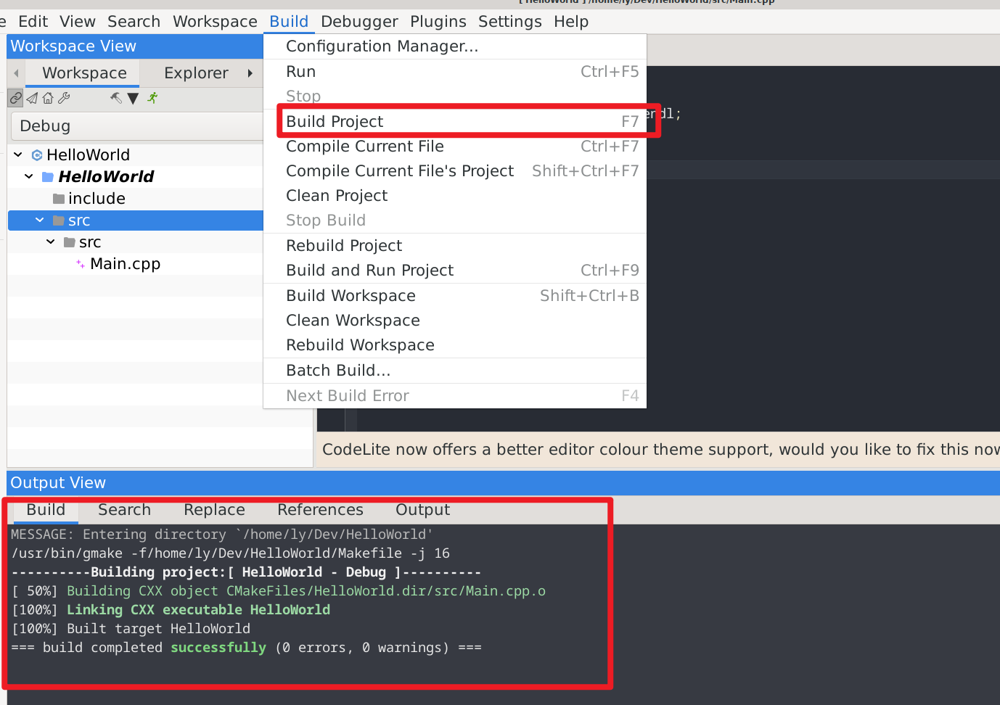  
### 运行

查看编译后的可运行文件  

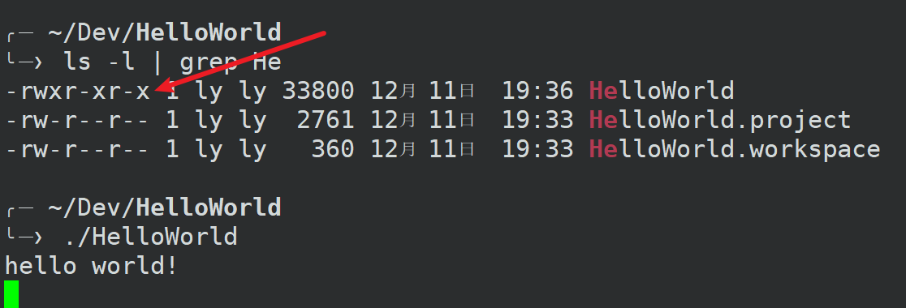  

------  

也可以直接在codelite里面运行


## Mac平台（跳过）