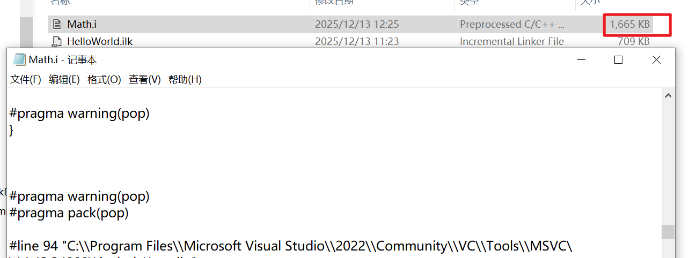
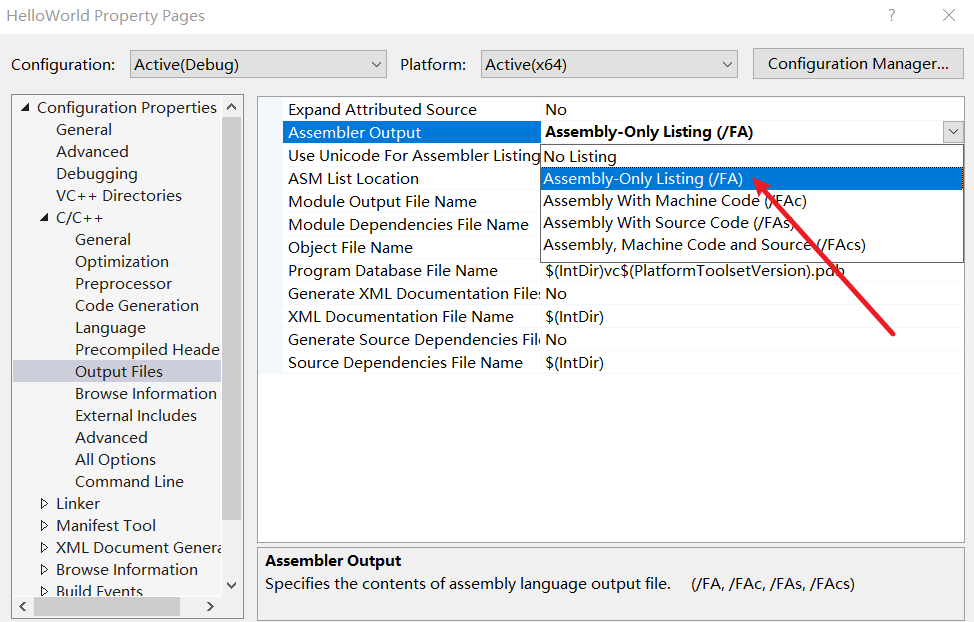
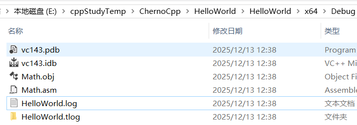
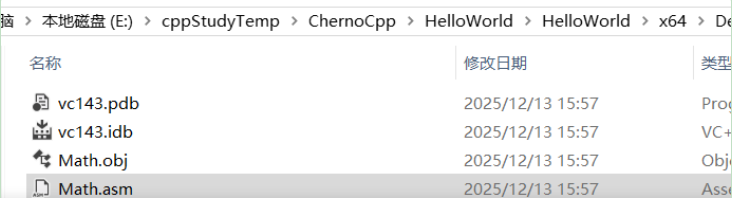
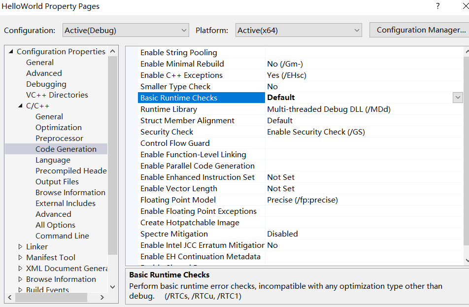

***编译器的工作原理***  

# 介绍

> 
> 源文件  *编译-->* .obj文件  *链接-->* .exe可执行文件  
>


- 预处理(包括标记)  -->  创建一棵抽象语法树(将所有代码转换为常量数据或指令)    --> 创建代码(CPU将执行的实际机器码)   ~~这个有点抽象，其实就是处理代码的过程：源代码从“纯文本”蜕变为“结构化逻辑”，最终落实为“硬件机器指令”的编译全流程~~ 
- 编译器：为每个C++文件（先经过预处理成为翻译单元）生成*目标文件*
- 文件只是C++向编译器提供源代码的方式（并不需要像java那样文件名必须和类名等同）  
- 将.cpp当做C++文件，把.c当做C文件，把.h当做头文件。(默认，也可以改变这个默认约定)
- C++文件先经过预处理后成为翻译单元，之后编译器将翻译单元生成为一个目标文件，有时将CPP文件包含在其他CPP文件中并创建一个包含大量文件的大CPP文件。这种情况下只需要编译这个大的CPP文件并生成一个翻译单元，从而生成一个目标文件
# hash include

```c++
//Math.cpp
int Multiply(int a, int b) {
	int result = a * b;
	return result;
}
```

并编译 

再添加一个文件==EndBrace.h==

```c++
}
```

修改Math.cpp，修改前删除结束括号，会编译出错，之后修改为：    

```c++
//Math.cpp
int Multiply(int a, int b) {
	int result = a * b;
	return result;
#include "EndBrace.h"
```

编译成功

## 告诉编译器输出一个包含所有结果的文件

# 简单例子

修改配置  

==这个选项会导致不会生成obj文件==  

  

> 1. 编译器只执行第一步：展开 #include 头文件、替换 #define 宏定义、删除注释等。
> 2. 预处理完成后，它会把结果直接输出到一个后缀为 .i 的纯文本文件中（例如截图下方的 Math.i）。  
> 3. 中断后续编译：它不会继续构建语法树（AST），也不会生成 CPU 能执行的机器码。因此，磁盘上不会生成 .obj（或 .exe）文件。

  

Math.i  

```c++
#line 1 "E:\\cppStudyTemp\\ChernoCpp\\HelloWorld\\HelloWorld\\Math.cpp"
int Multiply(int a, int b) {
	int result = a * b;
	return result;
#line 1 "E:\\cppStudyTemp\\ChernoCpp\\HelloWorld\\HelloWorld\\EndBrace.h"
}
#line 5 "E:\\cppStudyTemp\\ChernoCpp\\HelloWorld\\HelloWorld\\Math.cpp"

```

# 例子增强

```c++
#define INTEGER int

INTEGER Multiply(int a, int b) {
	INTEGER result = a * b;
	return result;
}
```

Math.i  

```c++
#line 1 "E:\\cppStudyTemp\\ChernoCpp\\HelloWorld\\HelloWorld\\Math.cpp"


int Multiply(int a, int b) {
	int result = a * b;
	return result;
}

```

# if

if之后为真则包含后面的语句块

```c++
#if 1
int Multiply(int a, int b) {
	int result = a * b;
	return result;
}
#endif
```

结果(Math.i)  

```c++
#line 1 "E:\\cppStudyTemp\\ChernoCpp\\HelloWorld\\HelloWorld\\Math.cpp"

int Multiply(int a, int b) {
	int result = a * b;
	return result;
}
#line 7 "E:\\cppStudyTemp\\ChernoCpp\\HelloWorld\\HelloWorld\\Math.cpp"
```

如果if后为零，则结果(Math.i):  

```c++
#line 1 "E:\\cppStudyTemp\\ChernoCpp\\HelloWorld\\HelloWorld\\Math.cpp"


#line 7 "E:\\cppStudyTemp\\ChernoCpp\\HelloWorld\\HelloWorld\\Math.cpp"

```

# include

```c++
#include <iostream>
int Multiply(int a, int b) {
	int result = a * b;
	return result;
}
```

  

==接着恢复生成预处理文件的配置（默认不生成）==

# 查看obj文件  

> 
> 查看前先禁用JMC优化  
  ==配置属性 → C/C++ → 常规 → 支持"仅我的代码"调试 → 否 (/JMC-)==
  >


之后修改项目属性  

  

编译后：  

  

即可读的汇编版本：  
  


```
;Math.asm------
; Line 3
	mov	eax, DWORD PTR a$[rbp]
	imul	eax, DWORD PTR b$[rbp]
	mov	DWORD PTR result$[rbp], eax
; Line 4
	mov	eax, DWORD PTR result$[rbp]
; Line 5
	lea	rsp, QWORD PTR [rbp+80]
	pop	rbp
	ret	0
```
  

这些是CPU在运行函数时将执行的实际指令  

这里做了一个多余的操作，先将a变量放到%eax结果寄存器中，然后再把相乘后的结果放到结果寄存器中，之后将%eax中的值放到一个名为result的变量中，最后再从result变量中取出值==放到 %eax结果寄存器==。而不是直接把它放到%eax中  

修改代码  

```c++
int Multiply(int a, int b) { 
	return a * b;
}
```

查看Math.asm  

```
?Multiply@@YAHHH@Z PROC					; Multiply, COMDAT
; File E:\cppStudyTemp\ChernoCpp\HelloWorld\HelloWorld\Math.cpp
; Line 1
$LN3:
	mov	DWORD PTR [rsp+16], edx
	mov	DWORD PTR [rsp+8], ecx
	push	rbp
	sub	rsp, 64					; 00000040H
	mov	rbp, rsp
; Line 2
	mov	eax, DWORD PTR a$[rbp]
	imul	eax, DWORD PTR b$[rbp] ;这里直接将结果存在了寄存器%eax中 
; Line 3
	lea	rsp, QWORD PTR [rbp+64]
	pop	rbp
	ret	0
?Multiply@@YAHHH@Z ENDP					; Multiply


```

# 优化
## 1

上述的math.asm之所以没有自动优化，是因为我们是在debug模式下编译的，以确保我们的代码尽可能完整、容易调试  

在此之前把代码修改为：  

```c++
int Multiply(int a, int b) {
	int result = a * b;
	return result;
}
```

修改配置：   


此时O2和RTC不兼容  

> 
> O2优化会==重组代码==：==重新排序指令==、消除冗余操作、内联函数等
> RTC需要插入检查代码：在特定位置插入==检查未初始化变量==、栈溢出的代码
> 优化后的代码可能使RTC插入点失效，导致检查不准确或无法插入
> 

关闭基本检查  

  

重编译查看math.asm    

``` 

?Multiply@@YAHHH@Z PROC					; Multiply, COMDAT
; File E:\cppStudyTemp\ChernoCpp\HelloWorld\HelloWorld\Math.cpp
; Line 3
	imul	ecx, edx  ;直接在寄存器中相乘
; Line 4
	mov	eax, ecx  ;结果直接赋给返回寄存器
; Line 5
	ret	0
?Multiply@@YAHHH@Z ENDP					; Multiply

```

还有其他优化没看懂，反正优化了就是了  

## 2 

禁用优化后编辑代码：  

```c++
//Math.cpp
int Multiply( ) { 
	return  5 * 2;
}
```

```
; Math.asm

?Multiply@@YAHXZ PROC					; Multiply, COMDAT
; File E:\cppStudyTemp\ChernoCpp\HelloWorld\HelloWorld\Math.cpp
; Line 2
$LN3:
	push	rbp
	sub	rsp, 64					; 00000040H
	mov	rbp, rsp
; Line 3
	mov	eax, 10 ;直接将结果值移动到结果寄存器
; Line 4
	lea	rsp, QWORD PTR [rbp+64]
	pop	rbp
	ret	0
?Multiply@@YAHXZ ENDP					; Multiply
```

这叫做常量折叠（constant folding），即任何可以在编译时计算出来的常量
## 3

```
const char* Log(const char* message) {
	return message;
}

int Multiply(int a,int b ) { 

	Log("Multiply");
	return  a * b;
}
```

查看Math.asm  

```

; 乘法函数的定义------
?Multiply@@YAHHH@Z PROC					; Multiply, COMDAT
; File E:\cppStudyTemp\ChernoCpp\HelloWorld\HelloWorld\Math.cpp
; Line 5
$LN3:
	mov	DWORD PTR [rsp+16], edx
	mov	DWORD PTR [rsp+8], ecx
	push	rbp
	sub	rsp, 96					; 00000060H
	lea	rbp, QWORD PTR [rsp+32]
; Line 7
	lea	rcx, OFFSET FLAT:??_C@_08EOBDLMOI@Multiply@
	
	;这里调用了Log函数------
	call	?Log@@YAPEBDPEBD@Z			; Log
	npad	1
; Line 8
	mov	eax, DWORD PTR a$[rbp]
	imul	eax, DWORD PTR b$[rbp]
; Line 9
	lea	rsp, QWORD PTR [rbp+64]
	pop	rbp
	ret	0
?Multiply@@YAHHH@Z ENDP					; Multiply
_TEXT	ENDS
; Function compile flags: /Odtp /ZI
;	COMDAT ?Log@@YAPEBDPEBD@Z
_TEXT	SEGMENT
message$ = 80

; Log函数的定义------
?Log@@YAPEBDPEBD@Z PROC					; Log, COMDAT
; File E:\cppStudyTemp\ChernoCpp\HelloWorld\HelloWorld\Math.cpp
; Line 1
$LN3:
	mov	QWORD PTR [rsp+8], rcx
	push	rbp
	sub	rsp, 64					; 00000040H
	mov	rbp, rsp
; Line 2
	mov	rax, QWORD PTR message$[rbp]
; Line 3
	lea	rsp, QWORD PTR [rbp+64]
	pop	rbp
	ret	0
?Log@@YAPEBDPEBD@Z ENDP					; Log
_TEXT	ENDS
END
```

为何函数要用特殊符号，函数签名需要唯一定义，当有多个obj并且我们的函数在多个obj中定义时，链接器的工作就是将他们全部链接在一起，它执行此操作的方式是查找这个函数签名

### 使用O2优化


Math.asm  

```

?Multiply@@YAHHH@Z PROC					; Multiply, COMDAT
; File E:\cppStudyTemp\ChernoCpp\HelloWorld\HelloWorld\Math.cpp
; Line 8
	imul	ecx, edx
	mov	eax, ecx 
; Line 9
	ret	0
?Multiply@@YAHHH@Z ENDP					; Multiply
```

视频说这里不会调用Log函数，但是如果开启了JMC的话，还是会调用该函数的。ai的解释是：JMC (Just My Code) 是Microsoft编译器的调试功能：它会插入额外的代码来区分用户代码和系统代码，阻止了编译器执行某些优化  

