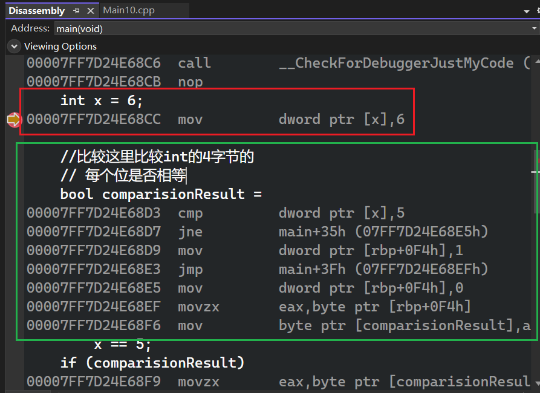
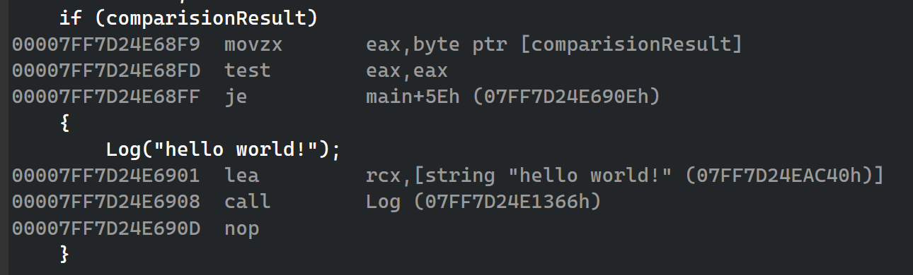

***条件及分支***  

- 先检查一个条件，然后跳转到不同的部分并开始执行指令，意味着条件及分支都有会一点开销。如果想编写稍微快点的代码就不该使用条件语句  
- 如果某事是真的，那么跳转到对应的代码块执行 

# 查看汇编

  

  

- `mov dword ptr [x],6`==意思是==`在内存中名为 x 的位置，写入4个字节的数值 00000006（十六进制）`

	- mov:移动
	- cmp 比较
	- jne:是否为零

- 不相等则跳转  
  


- 并且将某个位置（代表变量comparisionResult设置为0）  

- 其中，`dword ptr [rbp+0F4h],0 ` 表示 `将0存储到内存地址rbp+0xF4处的4字节空间（双字）中` ，rbp通常指基指针寄存器（Base Pointer Register），通常是栈帧的基地址

- test基本是执行 `按位与` 运算  
    
  > 补充：test eax, eax 不会改变 eax 的值，只是临时计算 eax AND eax，然后丢弃结果，唯一目的：设置CPU的标志位 ~~同时，test 指令还会强制清零 溢出标志（OF = 0）和进位标志（CF = 0）~~ 
    > 为什么要自己和自己AND？因为 eax AND eax 的结果就是 eax 本身：如果 eax = 0 → 结果是 0 → ZF=1  ~~零标志位（ZF, Zero Flag）~~ ；如果 eax ≠ 0 → 结果非零 → ZF=0 ；如果 eax < 0（最高位为1） → SF=1  ~~符号标志位（SF, Sign Flag）~~   
    
以上都是在Debug模式下看的，所以并没有优化代码，其实comparisionResult的值在编译前就已经知晓  

- 比较结果是布尔值，布尔值实际上（汇编/机器中）是一个整数，0或1。所以汇编实际就是检查一下这个数字是不是0，如果是1就继续执行(跳进if的代码块中)，不是则直接跳到某语句处

- 不建议将if及代码块放在同一行，这样不利于调试  
```cpp
if (x==5) Log("Hello world!");
```

- 不需要判断
```cpp
if(x)
	//x非零则执行该语句
    Log("Hello World");
```
也可以用来检查指针是否为null(0)  
```cpp
const char* ptr="hello";
if(ptr)
	Log(ptr);
const char* ptr1=nullptr;


if(ptr1)//如果ptr1有值(非空)
//或者if(ptr1!=nullptr)
{
	Log("not null");
	Log(ptr1);
}
else
	Log("Ptr is null!");
/*该代码块仅打印
hello
Ptr is null!
*/
```

# else if

```cpp
const char* ptr = "hello";
if (ptr)
	Log(ptr); 
else if (ptr=="hello")
{
	Log("ptr is hello!");
}
//这里不会打印hello，因为第一个if不符合才会执行第二个if的判断  
```
