***vs用于c++项目的最佳实践***  

# 创建新项目

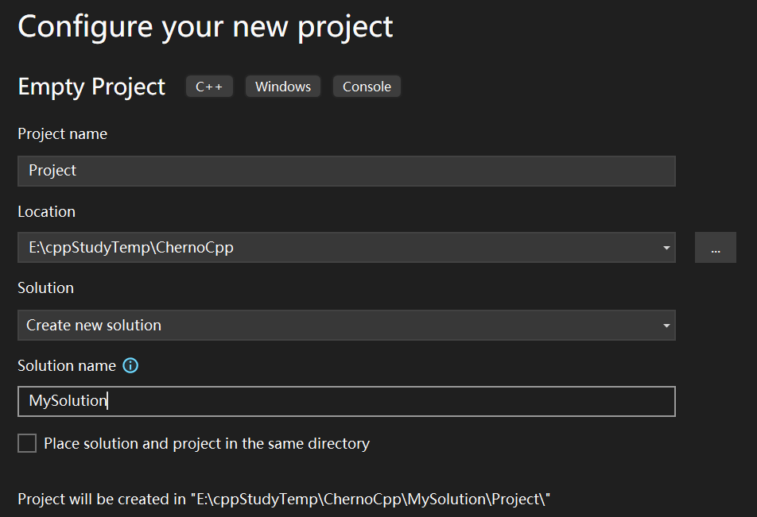

解决方案下有项目  
 
 > MySolusion.sln是解决方案文件
 
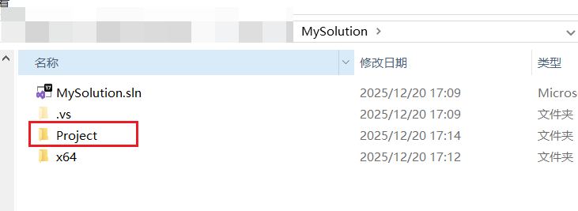  

项目下是源代码  

>Project.vcxproj 是项目相关文件
>Project.vcxproj.filters 是过滤器

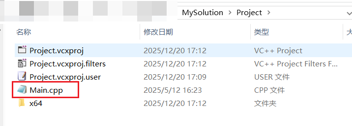  

过滤器决定了vs IDE打开该项目时的视图(实际中不存在文件夹)  

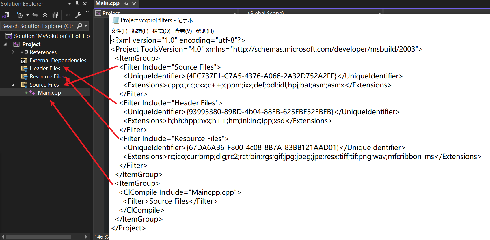  

# 显示所有文件

显示磁盘目录下的所有文件  

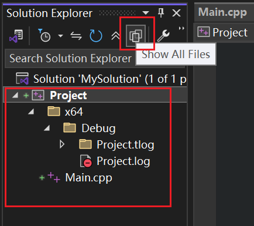  

移动文件位置  

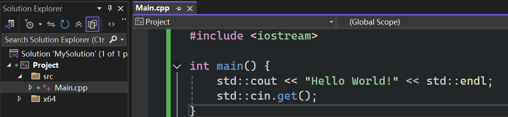  

```cpp
#include <iostream>
int main() {
	std::cout << "Hello World!" << std::endl;
	std::cin.get();
}
```

如图，中间文件(.obj)是放在项目文件夹里  

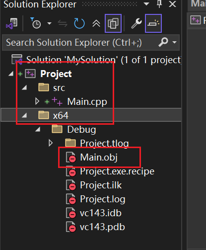  

项目编译后生成的可执行文件放在（总的）解决方案文件夹下  

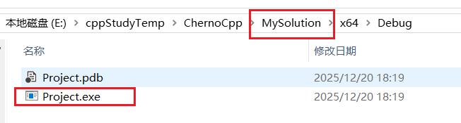  

由来  

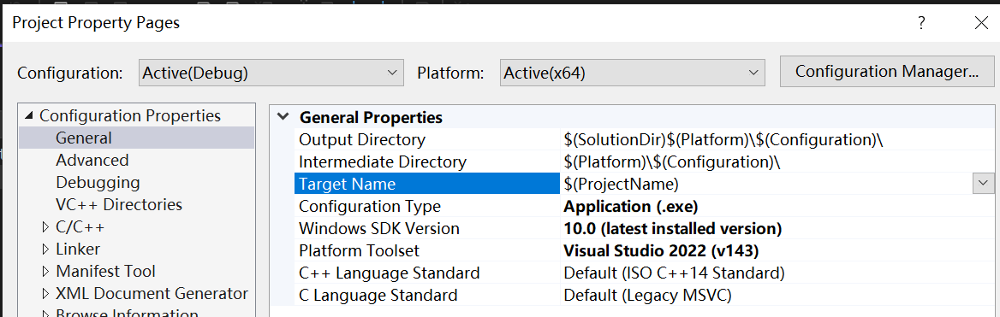

`$(Platform)\$(Configuration)\`，即 `x64\Debug` 文件夹结构的由来  

# 修改配置

OutputDirectory: `$(SolutionDir)bin\$(Platform)\$(Configuration)\`    

> 如果解决方案有多个项目，如果构建DLL文件或者其他需要的东西，我们需要这些在同一个文件夹中（而不用深入每个项目的文件夹）

IntermediateDirectory: `$(SolutionDir)bin\intermediates\$(Platform)\$(Configuration)\`  

~~这里建议加上项目名，避免中间文件冲突(覆盖) `$(SolutionDir)bin\intermediates\$(ProjectName)\$(Platform)\$(Configuration)\`~~

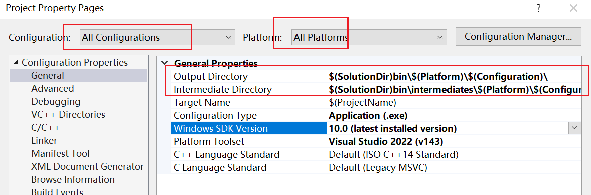  

之后右键项目-clean Solution

> 查看变量值  
> 
> 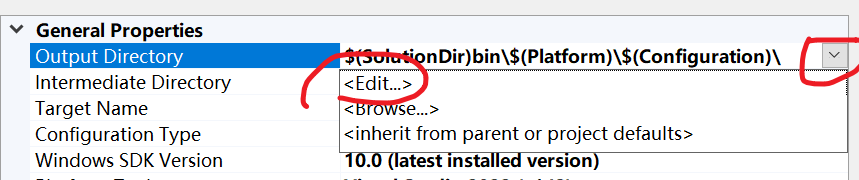
> 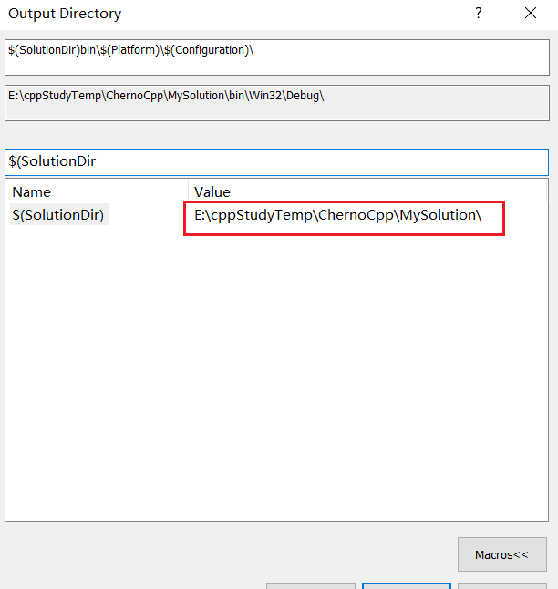
## 清理项目

解决方案下有一个项目  

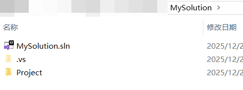  

项目下有过滤器及src文件夹  

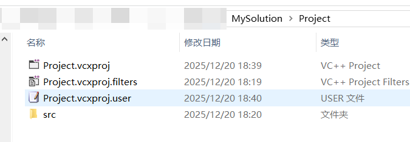

源代码在src文件夹中  

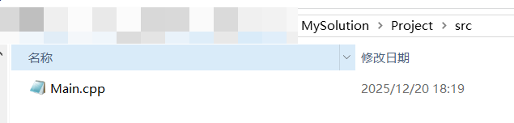  


# 编译

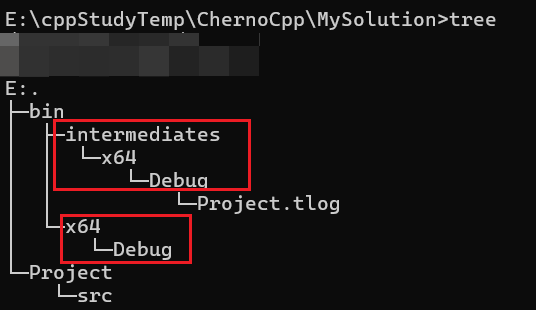  

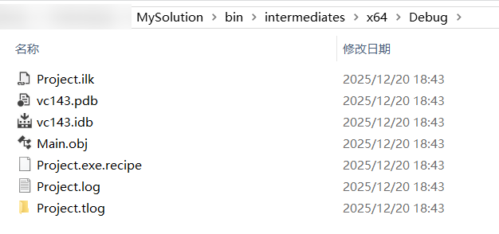  

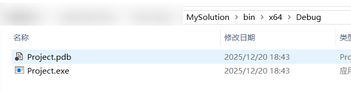  


