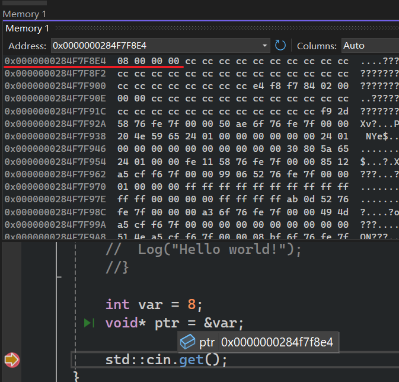
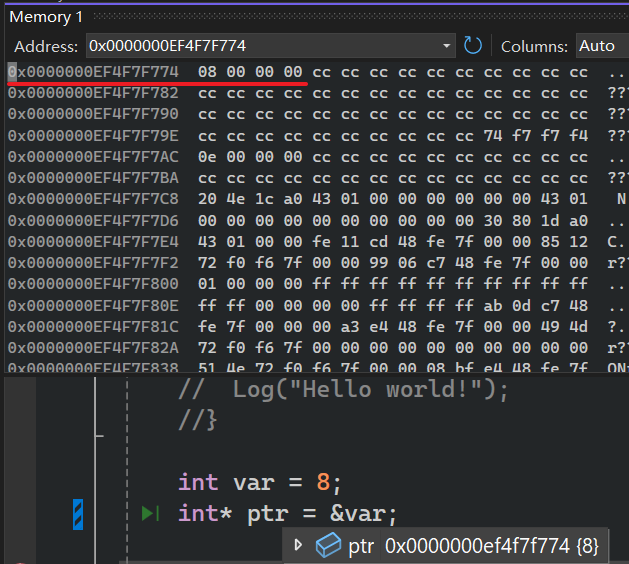
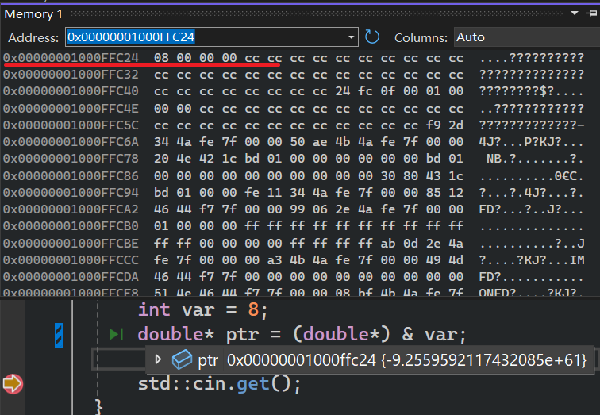
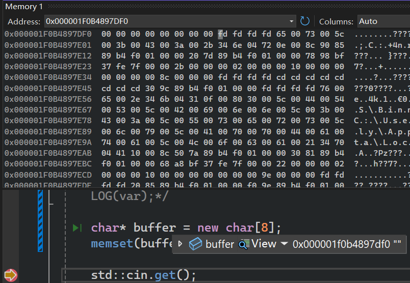
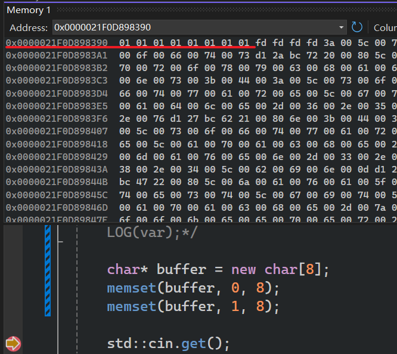
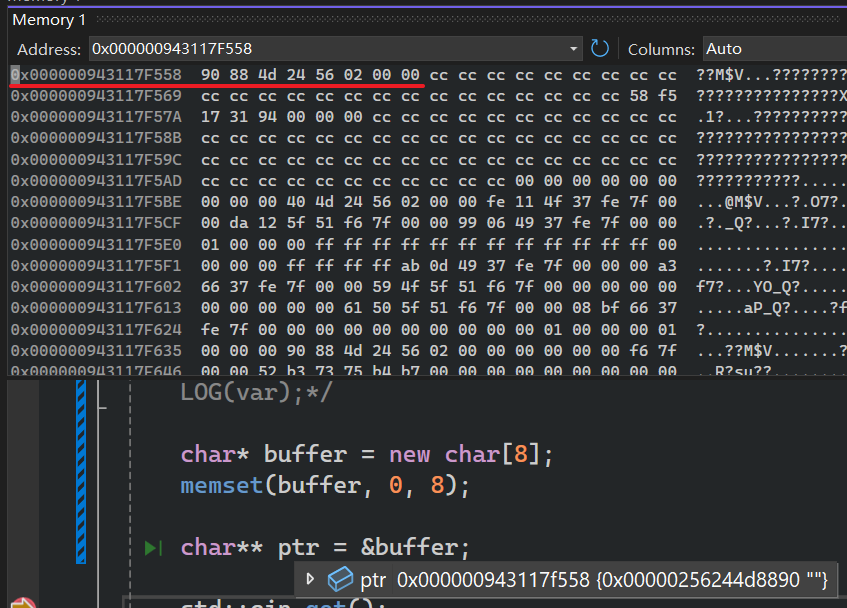
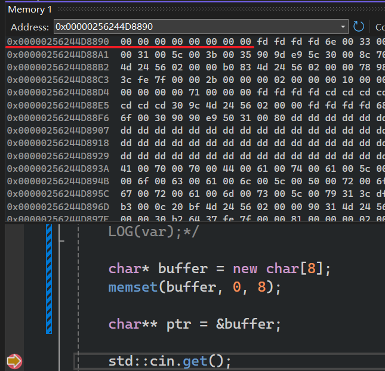

***指针***

当你写一个程序的时候，你启动他，整个应用程序就会加载到内存，告诉计算机根据代码执行的操作都被加载到内存中，这是cpu实际访问你写的变量的方式。  

指针，是一个==存储`内存地址` ~~表示内存地址~~ ==的*数字*  

我们需要从内存中，读取或者写入东西，指针，就是内存的地址  

==忘记指针的类型==  

# 例子1-无类型指针

`void*` 表示我们不关心地址指向的实际数据是什么类型的

```cpp
#include <iostream>
#define LOG(x) std::cout << x << std::endl

int main(){
	void* ptr=0;//0，表示这是一个无效指针
	//void* ptr=NULL;// NULL是一个# define NULL 0，其实也是0
	//void* ptr=nullptr;// c++11引入的
	std::cin.get();
}
```

~~C/C++ 允许==局部函数声明== ~~  

> void func(int);
  void func(void*);
 func(0);//调用func(int)，而不是 func(void*)，存在歧义
 >func(nullptr);// 明确调用 func(void*)

# 例子2-类型指针

```cpp
	int var = 8;
	//void* ptr = &var;
	 int* ptr=&var;
	 double* ptr1=(double*)&ptr; //我知道 ptr 是一个 int* 类型变量(一串表示地址的数字)，但我骗编译器说：ptr 这块内存里放的是一个 double。 骗编译器说 ptr 这个变量里面存放的那几个字节（也就是一个地址值）可以当成 double 来读取。
	//double* ptr=(double*)&var;
	std::cin.get();
```


调试查看ptr地址上的值  

  

  

  

指针类型，只有在读写该地址的数据时才有用(编译器才知道读写几个字节)  

```cpp
	int var = 8;

	//没有指定指针类型，编译器
	//不知道怎么存数据，*ptr=10会报错
	//void* ptr =  & var;
	//*ptr = 10;

	//指针指向的位置需要一个int大小(4字节)的
	//大小来存储数据
	int* ptr = &var;
	*ptr = 10;
	LOG(var);
```

创建堆上面的内存  

```cpp
//在堆上面分配连续的8个字节的内存空间
//并返回指向这块内存起始地址的指针
char* buffer=new char[8];//char* buffer：声明一个指向char类型的指针变量

//具体作用：将buffer指向的8字节内存的每一个字节全部填充为0
memset(buffer,0, 8);
//具体作用：将buffer指向的8字节内存的每一个字节全部填充为1
memset(buffer,1, 8);

delete[] buffer;
```

  

  

# 指针的指针

```cpp

```

- ptr存储的是buffer的地址
    
- 这个地址上的值全被设置成0了  
  
    

- 

