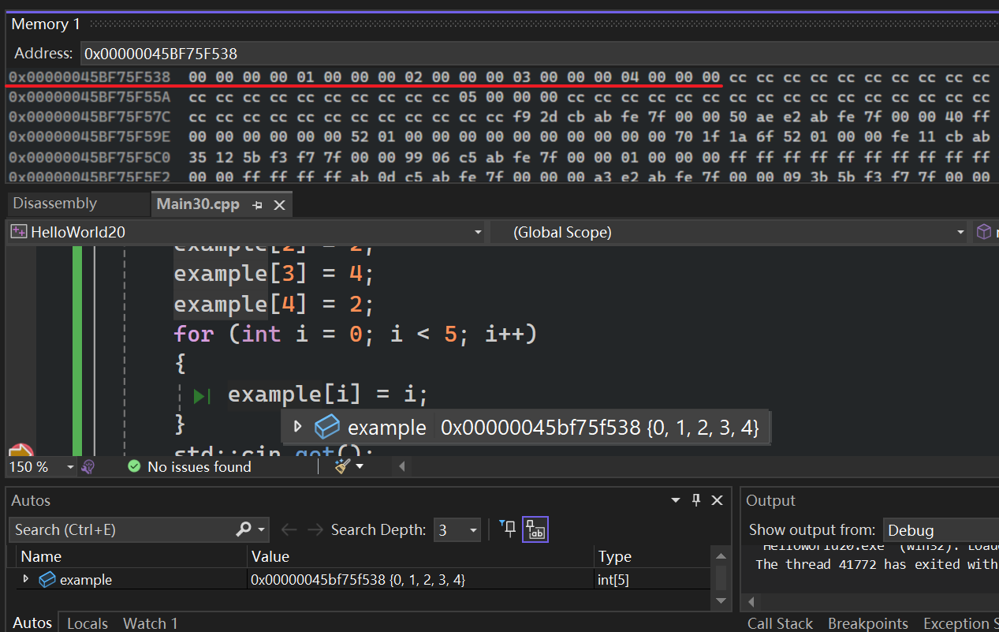
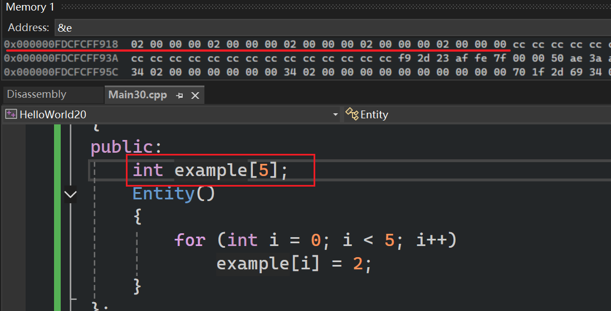
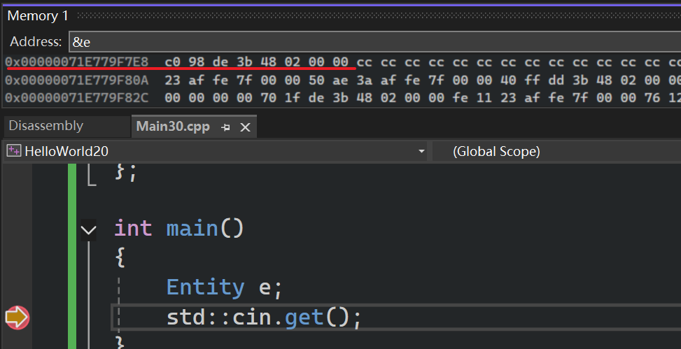
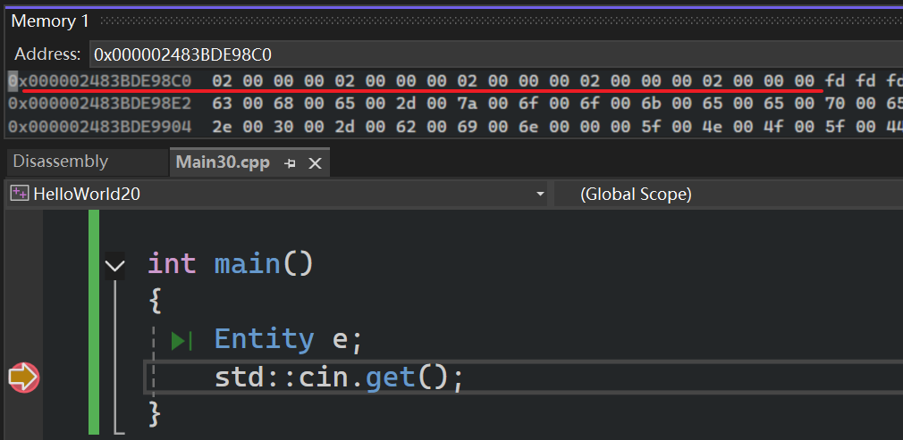

数组：一个集合，一堆元素按照特定的顺序排列起来  

```cpp
#include <iostream> 


int main()
{
	int example[5];
	example[0] = 2;
	example[4] = 4;

	std::cout << example[0] << std::endl;
	//无效值
	std::cout << example[2] << std::endl;
	std::cout << example[4] << std::endl;
	//编译器不检查越界
	std::cout << example[-1] << std::endl;
	std::cout << example[5] << std::endl;
	//数组内存地址
	std::cout << example << std::endl;
	/*
2
-858993460
4
-858993460
-858993460
0000006DC77EFB38
	*/
	std::cin.get();
}
```

# 循环

```cpp
#include <iostream> 


int main()
{
	int example[5];
	example[0] = 2;
	example[1] = 4;
	example[2] = 2;
	example[3] = 4;
	example[4] = 2;
	for (int i = 0; i < 5; i++)
	{
		example[i] = i;
	}
	std::cin.get();
}
```

如果，数组在内存中是连续的同类型数值 ~~小端法， 这里==1个==int占用4字节，在内存中按最低有效字节到最高有效字节顺序在内存中排列  ~~   
  

# 数组指针运算

数组实际上只是一个指针，它是一个整数，指向==内存块==的指针

```cpp
#include <iostream> 

int main()
{
	int example[5];
	int* ptr = example;

	//这里根据指针指向数据类型的字节数来对地址运算(这里是2个(int)4字节)
	*(ptr + 2) = 6;//一个int大小为4字节，这里向右偏移两个int大小(8)的字节位置
	//这行代码和上面是一个效果，都是对
	//第3个元素赋值
	*((char*)ptr + 8) = 7;//一个char大小为1字节，这里向右偏移8个char大小(8)的字节位置
	 
	std::cin.get();
}
```

# 堆上创建数组

```cpp
#include <iostream> 

int main()
{
	//在栈上创建数组
	//直接在堆上创建的数组，直接根据数组地址就能查到数据
	int example[5];
	for (int i = 0; i < 5; i++)
		example[i] = 2;

	//在堆上创建数组
	//在栈上创建的数组，先根据数组地址（another）得到另一个地址(8字节，数组只存储了堆上数组的地址)，然后再根据该地址得到堆上数组  
	int* another = new int[5];
	for (int i = 0; i < 5; i++)
		another[i] = 2;
	delete[] another;

	std::cin.get();
}
```

## 性能略有区别

```cpp
#include <iostream> 

class Entity
{
public:
	int example[5];
	Entity()
	{
		for (int i = 0; i < 5; i++)
			example[i] = 2;
	}
};

int main()
{ 
	Entity e;
	std::cin.get();
}
```


  


  

  

# 计算数组元素个数

```cpp
#include <iostream> 
 
int main()
{ 

	int a[5];
	std::cout << sizeof(a) << std::endl;//20，数组大小(字节数)
	std::cout << sizeof(a)/sizeof(int) << std::endl;//5，数组个数

	int* example = new int[5];
	std::cout << sizeof(example) << std::endl;//8，指针的大小(8字节)
	

	std::cin.get();
}
```

这个计算方式在某些情况下是不可靠的，比如当该数组是作为函数参数时：  

```cpp
// 错误示例
void printSize(int arr[]) {
    // 这里 arr 实际上是指针，不是数组
    size_t size = sizeof(arr) / sizeof(int);  // ❌ 错误的！
    std::cout << "错误的大小: " << size << std::endl;
}
```

## 建议

### 错误

```cpp
class Entity
{ 
	//类内初始化：只是默认初始化值。
	//= 5 是一个默认成员初始化器（default member initializer），它只在没有其他初始化方式时作为备用。
	const int size = 5;
	
	//编译报错，原因是size可变，见下面的构造函数（即使没有明确写下面的构造函数
	//，也会编译报错）
	int arr[size];
	
	//注意，这里使用构造函数初始化就
	//可以在每次创建新对象时初始化const成员的值
	//不同对象之间的size不同 --> 所以它不是一个固定的编译期常量
	Entity(int s) : size(s) {}  // 构造函数初始化 const 成员变量，而不是修改它。

};
```

#### 流程

```shell
Entity e(10);

↓

创建Entity对象

↓

调用构造函数初始化列表

↓

直接把size初始化为10

↓

执行构造函数函数体
```

### 修正

```cpp
class Entity
{ 
    //static const int size 不是对象的成员变量，而是类的成员常量，它的值在编译阶段就可以确定，因此可以用来定义数组大小。
	static const int size = 5;
	
	//编译正常，因为这里是静态成员常量
	int arr[size];
	
};
```
 

## 其他建议

std::array::size()，C++11静态数组  

```cpp
#include <array>
std::array<int, 5> arr = {1, 2, 3, 4, 5};
size_t size = arr.size();  // ✅ 类型安全，不会出错
```

std::vector::size()，动态数组  

```cpp
#include <vector>
std::vector<int> vec = {1, 2, 3, 4, 5};
size_t size = vec.size();  // ✅ 动态大小
```

std::size() (C++17)   

```cpp
#include <iterator>  // C++17

int arr[] = {1, 2, 3, 4, 5};
size_t size = std::size(arr);  // ✅ 最简洁的方式

std::array<int, 5> stdarr = {1, 2, 3, 4, 5};
size_t size2 = std::size(stdarr);  // ✅ 也适用于 std::array

std::vector<int> vec = {1, 2, 3, 4, 5};
size_t size3 = std::size(vec);  // ✅ 也适用于 std::vector
```

# （补充）对象成员变量初始化顺序

```cpp
class Entity
{
	//默认成员初始化器（default member initializer
	int size = 5;

public: 

	Entity()
	{
		size = 6;
	}
};
```


```shell
创建 Entity 对象

↓

初始化 size

↓

发现没有初始化列表 : size(...)
↓

使用默认成员初始化器

↓

size = 5

↓

进入构造函数函数体

↓

执行 size = 6

↓

最终 size = 6
```