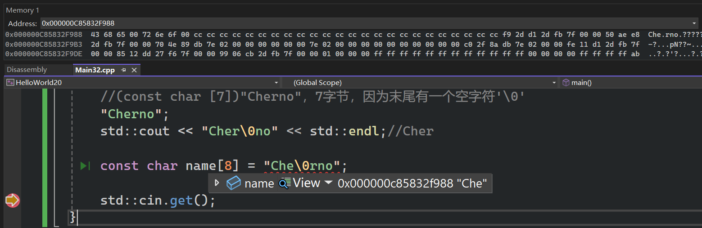
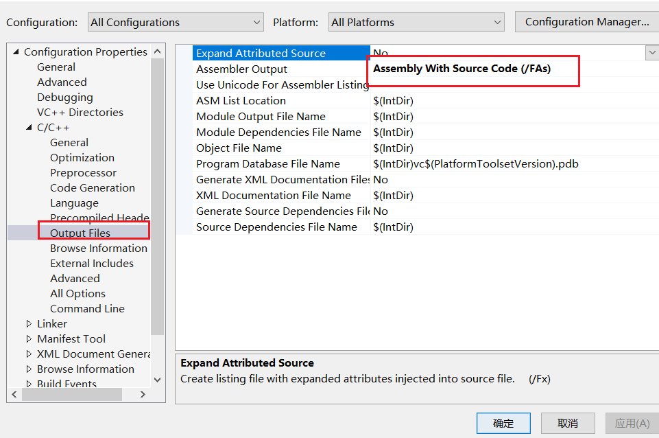

特殊情况  

```cpp
#include <iostream>
#include <stdlib.h>
#include <string>

int main()
{
	//(const char [7])"Cherno"，7字节，因为末尾有一个空字符'\0'
	"Cherno";
	std::cout << "Cher\0no" << std::endl;//Cher

	const char name[8] = "Che\0rno";

	std::cin.get();
}
```

  

# 注意事项

```cpp
#include <iostream>
#include <stdlib.h>
#include <string>

int main()
{
	//(const char [7])"Cherno"，7字节，因为末尾有一个空字符'\0'
	"Cherno";
	std::cout << "Cher\0no" << std::endl;//Cher

	const char name[8] = "Che\0rno";
	std::cout << strlen(name) << std::endl;//3,不把\0算在内

	/* 错误的，某些编译器允许编译通过,但没效果
	char* name1 = "Cherno";
	name1[2] = 'a';
	std::cout << name1 << std::endl;//Cherno
	*/

	//一定要修改的话
	char name2[] = "Cherno";
	name2[2] = 'a';
	std::cout << name2 << std::endl;//Charno

	std::cin.get();
}
```

# 不同类型的字符串

```cpp
#include <iostream>

int main()
{
	const char* name = "Cherno";
	const char* name_ = u8"Cherno";

	//字符串中的每个字符都是宽字符（wchar_t 类型）,
	//通常是16位或32位，取决于系统(大小平台相关)
	//L 前缀表示这是一个宽字符字符串
	const wchar_t* name2 = L"Cherno";

	// C++11后的UTF-16字符串,固定每个字符2字节
	const char16_t* name3 = u"Cherno";

	// C++11后的UTF-32字符串,固定每个字符4字节
	const char32_t* name4 = U"Cherno";

	std::cin.get();
}
```

# 字面量运算符

```cpp
//"" 是字面量运算符名称的一部分
//它表示这个运算符处理的是字符串字面量
//其他类型的字面量有不同的前缀：
// 不同的字面量类型有不同的运算符名称：
std::string operator""s(...);      // 字符串字面量
long double operator""ld(...);     // 浮点数字面量
unsigned long long operator""ull(...); // 整数型字面量
```

```cpp
#include <iostream>
#include <string>

#include <stdlib.h>

int main()
{
	//启用了 "text"s 语法，让创建 std::string 对象更加
	// 直观、类型安全，特别是在自动类型推导和复杂字符串场景下非常有用。
	using namespace std::string_literals;
	//报错
	//std::string name0 = "Cherno" + " hello";
	std::string name0 = std::string("Cherno") + " hello";

	//// 普通运算符重载：没有引号
	//std::string operator+(const std::string & a, const std::string & b);
	// 字面量运算符：必须有 "" 
	//std::string operator""s(const char* str, size_t len);

	//std::string operator""s(const char* str, size_t len);
	//下面的语句,相当于std::string name1 = operator""s("Cherno", 6) + " hello";
	std::string name1 = "Cherno"s + " hello";
	std::cout << name1 << std::endl;

	std::string name2 = u8"Cherno"s + " hello";
	std::wstring name3 = L"Cherno"s + L" hello";
	std::u32string name4 = U"Cherno"s + U" hello";
	//R 表示 Raw string literal（原始字符串字面量），括号内的内容会完全按照原样被存储，包括换行符、制表符等特殊字符。
	const char* example = R"(Line1
Line2
Line3
Line4)";
	/*
Line1
Line2
Line3
Line4
	*/
	std::cout << example << std::endl;
	const char* example1 = "Line1\n"
		"Line2\n"
		"Line3\n"
		"Line4";
	std::cout << example1 << std::endl;
	std::cin.get();
}
```

# 查看字面量汇编文件

```cpp
#include <iostream>

int main()
{
	char name[] = "Cherno";
	name[2] = 'a';
	std::cout << name << std::endl;

	std::cin.get();
}
```

  

==解释：先从只读数据段复制字符串常量到栈变量，然后进行修改。==    

```cpp
; 5    : 	char name[] = "Cherno";

	mov	eax, DWORD PTR ??_C@_06MDBPMDDK@Cherno@

; 6    : 	name[2] = 'a';
; 7    : 	std::cout << name << std::endl;

	lea	rdx, QWORD PTR name$[rsp]
	mov	rcx, QWORD PTR __imp_?cout@std@@3V?$basic_ostream@DU?$char_traits@D@std@@@1@A
	mov	DWORD PTR name$[rsp], eax
	movzx	eax, WORD PTR ??_C@_06MDBPMDDK@Cherno@+4
	mov	WORD PTR name$[rsp+4], ax
	movzx	eax, BYTE PTR ??_C@_06MDBPMDDK@Cherno@+6
	mov	BYTE PTR name$[rsp+6], al
	mov	BYTE PTR name$[rsp+2], 97		; 00000061H
```

- 初始字符串常量在只读内存：
```cpp
??_C@_06MDBPMDDK@Cherno@: 
偏移0: 'C' 'h' 'e' 'r'   (4字节 = DWORD)
偏移4: 'n' 'o'           (2字节 = WORD)
偏移6: '\0'              (1字节 = BYTE)
```
- 复制到栈上（name$[rsp]位置）：
```cpp
[rsp+0] = 'C'  (name[0])
[rsp+1] = 'h'  (name[1])
[rsp+2] = 'e'  (name[2])  <-- 将被修改
[rsp+3] = 'r'  (name[3])
[rsp+4] = 'n'  (name[4])
[rsp+5] = 'o'  (name[5])
[rsp+6] = '\0' (name[6])
```

- 修改后：
```cpp
[rsp+2] = 'a'  (97 = 0x61)
```
   
最终字符串变为"Charno"

