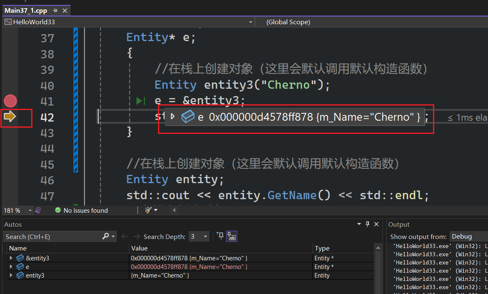
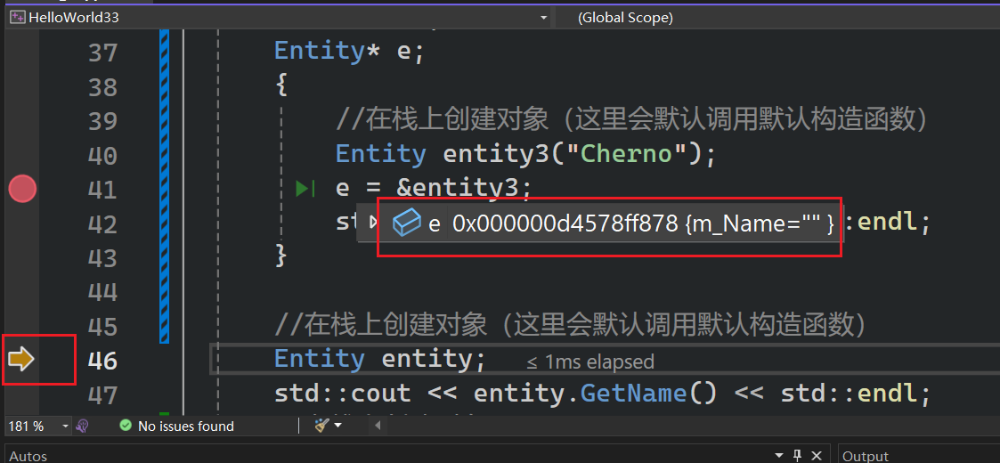
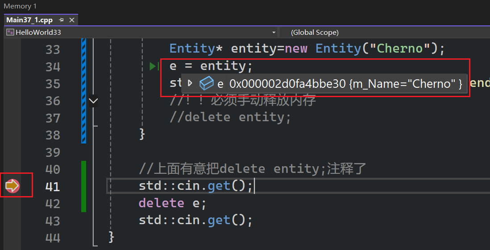
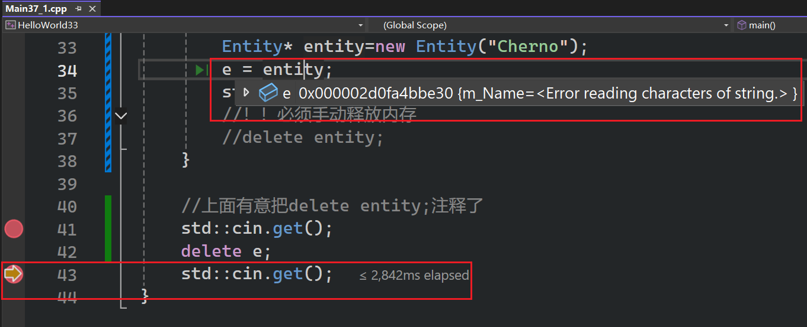

两种方式，取决于我们在内存的哪个位置创建对象(堆heap或栈stack)  

C++ 有一条基本准则：任何不同的对象在内存中都必须有唯一的地址。所以如果创建了两个对象`class Empty {};Empty e1;Empty e2;`，只有他们都有1字节大小的情况下，e1和e2才会有不同的内存地址  

- 栈上创建的对象，有自动的生命周期，由他们的作用域决定的，离开作用域则消失    
- 堆上创建的对象，会一直在，直到你手动释放它

# 栈上创建对象

```cpp
#include <iostream>
#include <string> 

//类型别名 (Type Alias) 声明。
using String = std::string;

// using 声明，使用的时候只能用string(只起到了省略std::的作用)
//using std::string; 

/*
- 如果你把"using String = ... 还是 using std::string;"写
在 .h (头文件) 的全局作用域里，都会产生“污染”：
- 任何 #include 你这个头文件的人，都会被强制接受你的命名习惯。
如果别人也定义了一个 String，代码就会崩溃（冲突）。
*/

class Entity
{
private:
	String m_Name;
public:
	Entity() :m_Name("Unknown") {}
	Entity(const String& name) :m_Name(name) {}

	const String& GetName() const { return m_Name; }
};

void Function()
{
	int a = 2;
	Entity entity = Entity("Cherno");
}

int main()
{
	Function();
	Entity* e;
	{
		//在栈上创建对象（这里会默认调用默认构造函数）
		Entity entity3("Cherno");
		e = &entity3;
		std::cout << e->GetName() << std::endl;
	}

	//在栈上创建对象（这里会默认调用默认构造函数）
	Entity entity;
	std::cout << entity.GetName() << std::endl;
	//在栈上创建对象
	Entity entity1("Cherno1");
	std::cout << entity1.GetName() << std::endl;
	//在栈上创建对象
	Entity entity2 = Entity("Cherno2");
	std::cout << entity2.GetName() << std::endl;

	std::cin.get();
}
```

在`e = &entity3;`加断点，并走到下一步    

  

此时e指向的对象还有值，继续走到`}`之外  

  

因为此时entity3对象被释放并被销毁了  

不在栈上创建对象的原因
- 超出作用域后对象自动销毁
- 栈的空间远小于堆

# 在堆上创建对象

```cpp
#include <iostream>
#include <string> 

//类型别名 (Type Alias) 声明。
using String = std::string;

// using 声明，使用的时候只能用string(只起到了省略std::的作用)
//using std::string; 

/*
- 如果你把"using String = ... 还是 using std::string;"写
在 .h (头文件) 的全局作用域里，都会产生“污染”：
- 任何 #include 你这个头文件的人，都会被强制接受你的命名习惯。
如果别人也定义了一个 String，代码就会崩溃（冲突）。
*/

class Entity
{
private:
	String m_Name;
public:
	Entity() :m_Name("Unknown") {}
	Entity(const String& name) :m_Name(name) {}

	const String& GetName() const { return m_Name; }
}; 

int main()
{  
	Entity* e;
	{
		//在栈上创建对象（这里会默认调用默认构造函数）
		Entity* entity=new Entity("Cherno"); 
		e = entity;
		std::cout << entity->GetName() << std::endl;
		//！！必须手动释放内存
		//delete entity;
	} 

	//上面有意把delete entity;注释了
	std::cin.get();
	delete e;
	std::cin.get();
}
```

## 调试

  

下一步  

  
