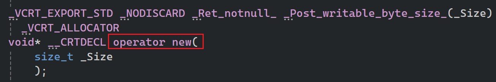
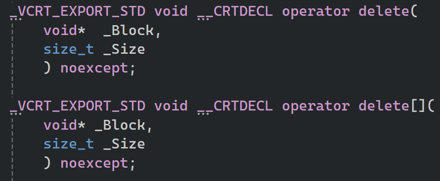

# 常见用法

- `new 指定数据类型`，数据类型包括类、原始类型、数组，根据数据类型确定必要的大小，以字节为单位
- `new int`，4字节。向操作系统找到连续的4字节大小的内存，然后返回指向该内存地址的指针    
- 有一个空闲列表维护具体可用字节的地址，不需要一个个地址扫描是否可用

```cpp
#include <iostream>
#include <string> 

//类型别名 (Type Alias) 声明。
using String = std::string;

class Entity
{
private:
	String m_Name;
public:
	Entity() :m_Name("Unknown") {}
	Entity(const String& name) :m_Name(name) {}

	const String& GetName() const { return m_Name; }
};

int main()
{
	int a = 2;
	int* b = new int;
	//连续的50个元素(200个字节)
	int* b_arr = new int[50];

	Entity* e1 = new Entity;
	//和上面那句一个意思
	Entity* e2 = new Entity();

	
	//为了在执行 delete[] e_arr 时知道要调用多少次析构函数，
	// 编译器通常会在分配的内存块头部额外存储一个计数
	// 器（Cookie），记录数组的长度。
	//e_arr指向内存块的大小：50 * sizeof(Entity) + sizeof(size_t)
	//size_t是 C++ 中专门用来表示内存大小和索引的类型:64位系统中是8字节，
	//32位系统中是4字节
	//连续的50个Entity
	Entity* e_arr = new Entity[50];

	std::cin.get();
}
```

补充：`new`，`delete`，`delete[]` 其实是一个运算符  

  



# 另一种非常见用法

```cpp
#include <iostream>
#include <string> 

//类型别名 (Type Alias) 声明。
using String = std::string;

class Entity
{
private:
	String m_Name;
public:
	Entity() :m_Name("Unknown") {}
	Entity(const String& name) :m_Name(name) {}

	const String& GetName() const { return m_Name; }
};

int main()
{ 
	int* b = new int; 

	//使用的是 Placement New（定位 new）
	//它不分配内存，而是在一个已经存在的内存地址上构造对象
	Entity* e = new(b) Entity();

	//delete e;

	std::cin.get();
}
```

## 有一些问题

- 空间不足 (Memory Overlap)
	- b 是指向 int 的指针，通常只占 4 字节。
	- Entity 对象（包含 std::string）通常占 32 或 40 字节。

	- 你强行把一个大箱子（Entity）塞进了一个小抽屉（int），这会破坏 b 后面的内存数据。

- 错误的释放方式 (Delete vs Destructor)，千万不能对 e 执行 delete e;！
	- delete 操作符会尝试释放内存。由于 e 指向的内存当初是用 new int 申请的，而不是 new Entity，这种类型不匹配会导致内存管理器崩溃。

	- 正确做法：对于 Placement New，必须手动调用析构函数，然后由原始指针负责释放内存。
- 正确的 Placement New 流程，如果你真的想在特定内存位置构造对象，标准的写法应该是：
  
```cpp
// 1. 准备足够大的内存 (比如 100 字节)
void* buffer = operator new(100); 

// 2. Placement New：在 buffer 的位置构造 Entity
Entity* e = new(buffer) Entity("Special Location");

// 3. 手动调用析构函数（因为 delete e 会崩溃）
e->~Entity();

// 4. 释放最开始申请的那块原始内存
operator delete(buffer);
```
