***C++是如何工作的***

源代码 -->  程序启动文件 

多个源文件  *(编译器)-->*  二进制(可执行)文件  

# 分析源码

```c++
/*试着编译单个cpp文件 ctrl+f7
会生成Main.obj文件*/

/*/①（编译器处理）include是预处理指令，会在编
译前找到iostream这个文件并插入该文件内容*/
#include <iostream>


/*②.h文件是在预编译时被处理（插入），并不会被编译；只有
.cpp文件会被编译成 .obj文件，链接器把这些合并成 .exe文件*/

/*③声明，确实有Log函数存在*/
/*④链接器，编译整个项目时，链接器链接时才会去查找这个
函数是否真是存在,如果不存在，则会提示"unresolved external
symbol"：未解析的外部符号，链接器无法找到定义
---链接器的工作是将函数体链接到其标识符(名称)
*/
//参数名message可以省略
//void Log(const char* message);


int main() {
	// << 重载运算符, 运算符可以理解成函数
	//类似下面这句：
	// std::cout.print("hello world!").print(std:endl);//!!编译无法通过
	
	std::cout << "hello world!" << std::endl;
	
	//Log("helloworld!");
	
	//等待按下回车键来移动到程序的下一行
	std::cin.get();
	//可以不写return，默认返回0，表示正确返回程序
}
```

# 编译

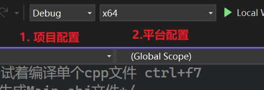  

项目配置：Debug/Release   

平台配置：x64(windows64位系统),x86(windows32位系统)，android....  

## 项目属性

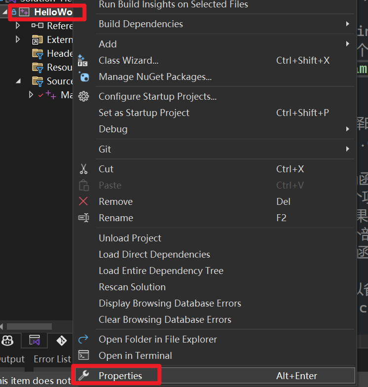  


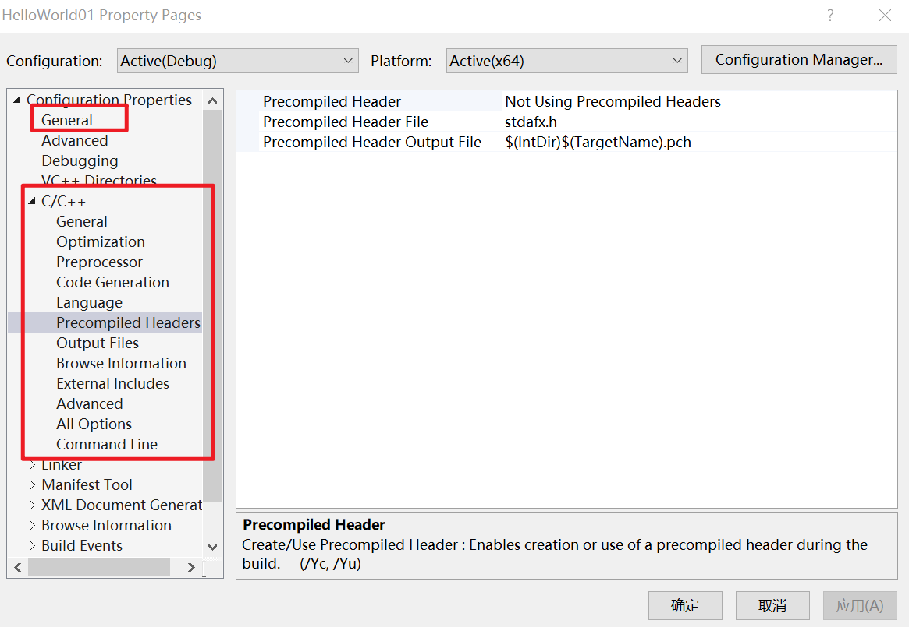  

Release的时候，Optimization这里都是Maximize（最佳优化）  

## 按钮添加

  


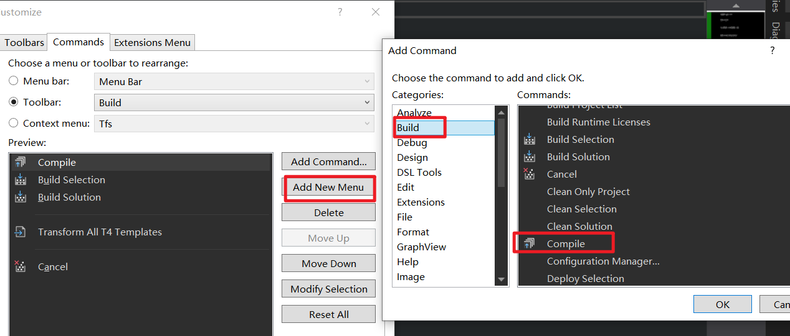  

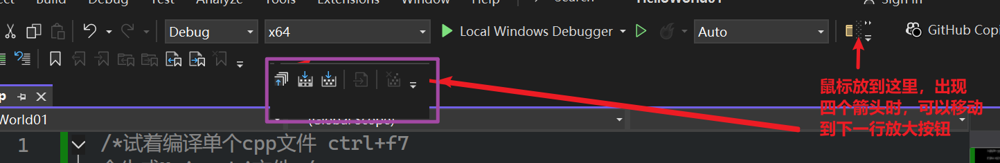  

## 错误查找  

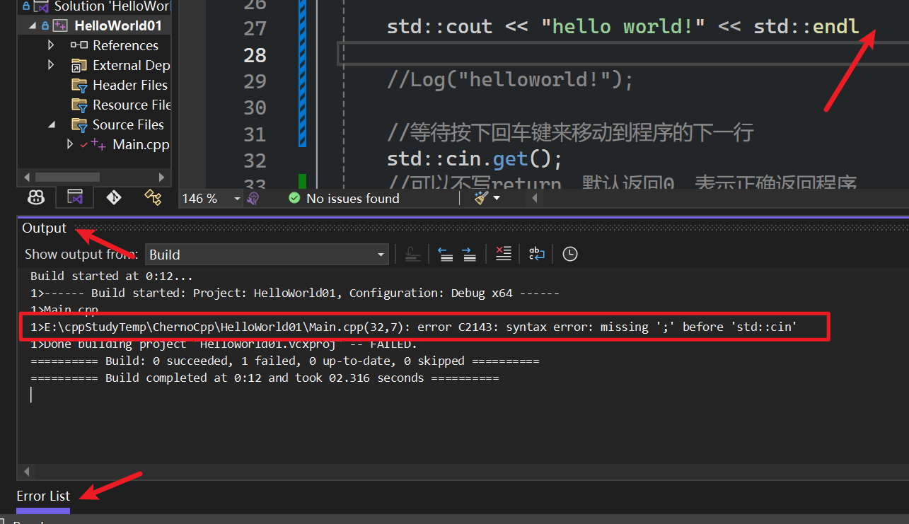  

尽量在output中寻找错误，而不是errorlist 

## 编译文件

ctrl+f7编译Main.cpp，查找文件管理器  

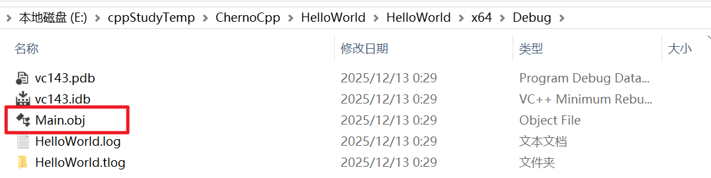  

右键项目名并构建  

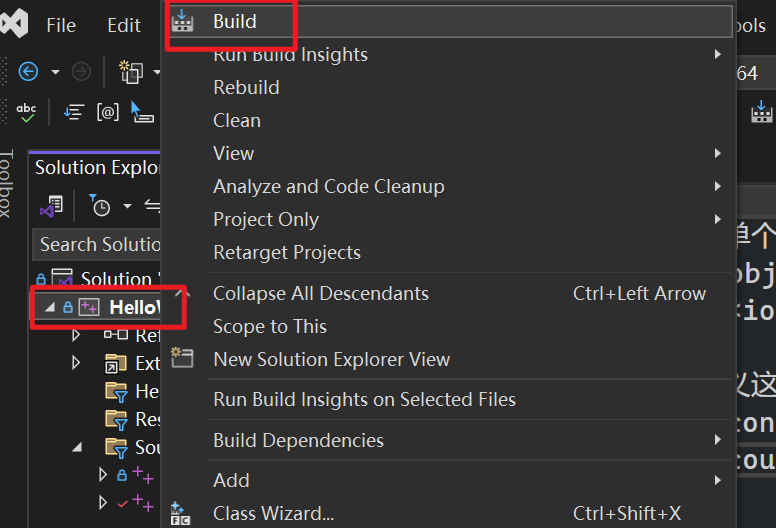  

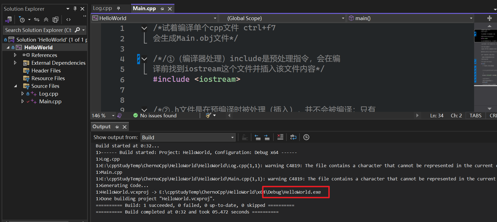  

在和solution（sln）同一个文件夹的x64中找到exe  

  

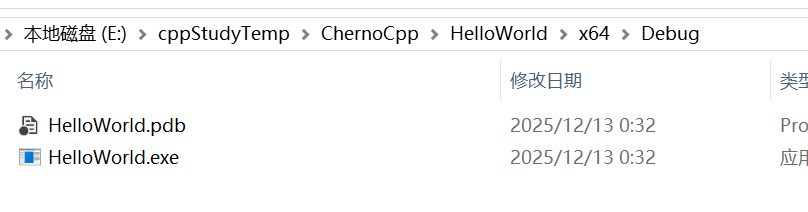  

## 多个文件编译

```c++
//Main.cpp

/*试着编译单个cpp文件 ctrl+f7
会生成Main.obj文件*/

/*/①（编译器处理）include是预处理指令，会在编
译前找到iostream这个文件并插入该文件内容*/
#include <iostream>


/*②.h文件是在预编译时被处理（插入），并不会被编译；只有
.cpp文件会被编译成 .obj文件，链接器把这些合并成 .exe文件*/

/*③声明，确实有Log函数存在*/
/*④链接器，编译整个项目时，(main中调用了该Log函数才会去链接)链接器链接时
才会去查找这个函数是否真是存在,如果不存在，则会提示"unresolved external
symbol"：未解析的外部符号，链接器无法找到定义---链接器的工作是将函数体链
接到其标识符(名称)
*/
//参数名message可以省略
void Log(const char* message);


int main() {
	// << 重载运算符, 运算符可以理解成函数
	//类似下面这句：
	// std::cout.print("hello world!").print(std:endl);//!!编译无法通过
	
	//std::cout << "hello world!" << std::endl;
	
	//演示Log函数
	Log("helloworld!");
	
	//等待按下回车键来移动到程序的下一行
	std::cin.get();
	//可以不写return，默认返回0，表示正确返回程序
}
```

```c++
//log.cpp

/*试着编译单个cpp文件 ctrl+f7
会生成Log.obj文件*/

//如果没有这句，会提示cout不是std的成员，因为
//没有包含这样函数的声明
#include <iostream>


//定义，定义这个函数到底是什么
void Log(const char* message) {
	std::cout << message << std::endl;
}
```

再重复一遍  

==声明：确实有Log函数存在==    

==定义：定义这个函数到底是什么==  

如果只编译Main.cpp，而没有编译Log.cpp，编译器也会认为（相信我们的声明）确实存在Log.cpp  

当我们编译整个项目（而不只是某一个特定文件时），完成编译时，==如果函数调用中调用了Log函数，(言外之意，如果只是声明了Log函数但是没有调用，即使找不到Log函数的定义也不会报错)== 链接器将会去找Log()函数的定义，并将链接到Main.cpp中的函数调用。如果找不到函数定义，将看到链接器错误  

# 演示错误

目前有Log.cpp和Main.cpp两文件，构建项目时是正常的。此时如果将Log.cpp中的Log函数名改为Logr，分别编译Log.cpp和Main.cpp都是正常的，但是，此时build（构建）项目，会出错  

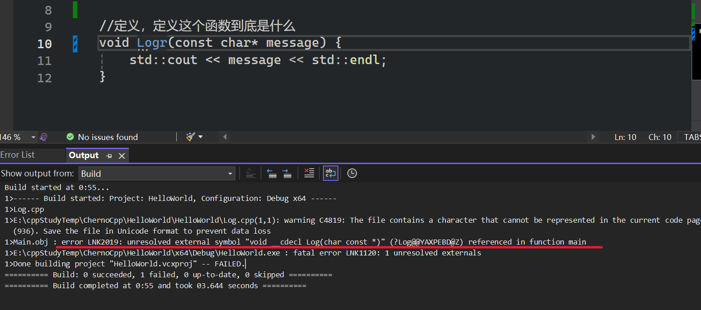  

==链接器的工作：将函数体链接到其标识符==   

# 文件生成

编译器为每一个.cpp文件生成一个.obj文件  

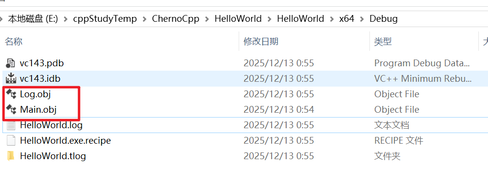  

链接器将它们(.obj)文件组合成一个.exe文件

==Log函数的定义在Log.obj中，main函数定义在Main.obj中，链接器将从Log.obj中获取Log()的定义，并插入到二进制文件HelloWorld.exe中==    


