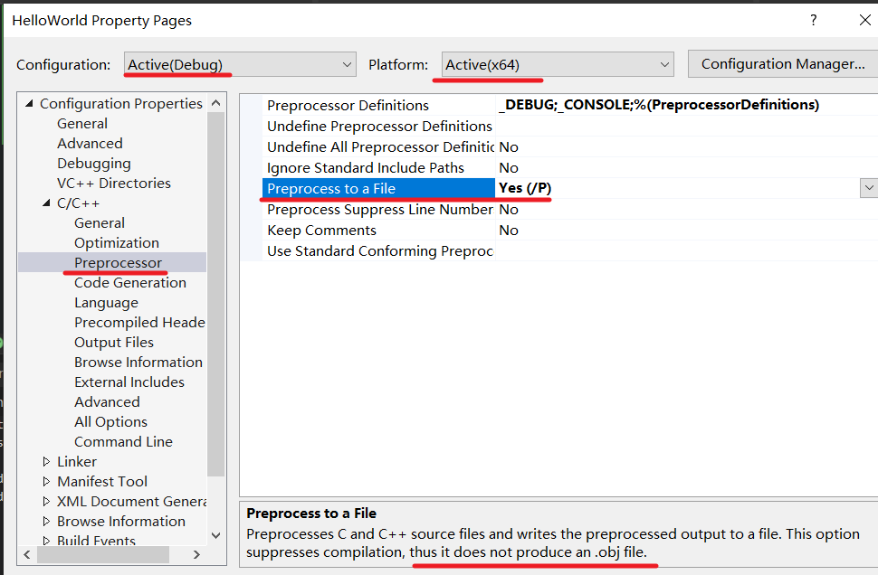
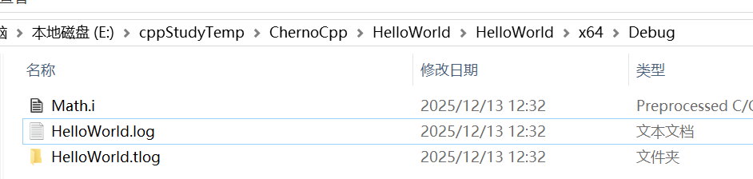
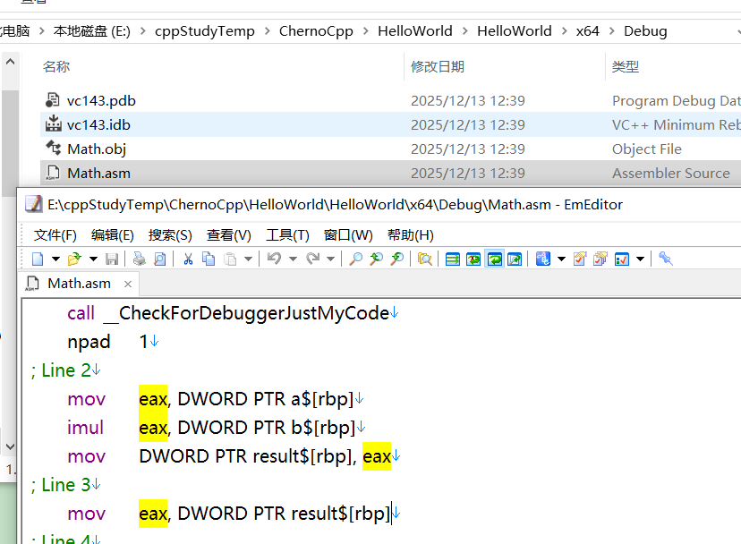
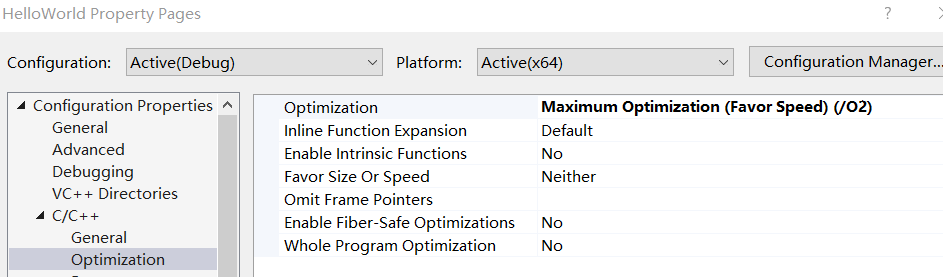

***编译器的工作原理***  

# 介绍

> 
> 源文件  *编译-->* .obj文件  *链接-->* .exe可执行文件  
>


- 预处理(包括标记)  -->  创建一棵抽象语法树(将所有代码转换为常量数据或指令)    --> 创建代码(CPU将执行的实际机器码)  
- 编译器：为每个C++文件（先经过预处理成为翻译单元）生成*目标文件*
- 文件只是C++向编译器提供源代码的方式（并不需要像java那样文件名必须和类名等同）  
- 将.cpp当做C++文件，把.c当做C文件，把.h当做头文件。(默认，也可以改变这个默认约定)
- C++文件先经过预处理后成为翻译单元，之后编译器将翻译单元生成为一个目标文件，有时将CPP文件包含在其他CPP文件中并创建一个包含大量文件的大CPP文件。这种情况下只需要编译这个大的CPP文件并生成一个翻译单元，从而生成一个目标文件
# hash include

```c++
//Math.cpp
int Multiply(int a, int b) {
	int result = a * b;
	return result;
}
```

并编译 

再添加一个文件==EndBrace.h==

```c++
}
```

修改Math.cpp，修改前删除结束括号，会编译出错，之后修改为：    

```c++
//Math.cpp
int Multiply(int a, int b) {
	int result = a * b;
	return result;
#include "EndBrace.h"
```

编译成功

## 告诉编译器输出一个包含所有结果的文件

# 简单例子

修改配置  

==这个选项会导致不会生成obj文件==  

  

  

Math.i  

```c++
#line 1 "E:\\cppStudyTemp\\ChernoCpp\\HelloWorld\\HelloWorld\\Math.cpp"
int Multiply(int a, int b) {
	int result = a * b;
	return result;
#line 1 "E:\\cppStudyTemp\\ChernoCpp\\HelloWorld\\HelloWorld\\EndBrace.h"
}
#line 5 "E:\\cppStudyTemp\\ChernoCpp\\HelloWorld\\HelloWorld\\Math.cpp"

```

# 例子增强

```c++
#define INTEGER int

INTEGER Multiply(int a, int b) {
	INTEGER result = a * b;
	return result;
}
```

Math.i  

```c++
#line 1 "E:\\cppStudyTemp\\ChernoCpp\\HelloWorld\\HelloWorld\\Math.cpp"


int Multiply(int a, int b) {
	int result = a * b;
	return result;
}

```

# if

if之后为真则包含后面的语句块

```c++
#if 1
int Multiply(int a, int b) {
	int result = a * b;
	return result;
}
#endif
```

结果(Math.i)  

```c++
#line 1 "E:\\cppStudyTemp\\ChernoCpp\\HelloWorld\\HelloWorld\\Math.cpp"

int Multiply(int a, int b) {
	int result = a * b;
	return result;
}
#line 7 "E:\\cppStudyTemp\\ChernoCpp\\HelloWorld\\HelloWorld\\Math.cpp"
```

如果if后为零，则结果(Math.i):  

```c++
#line 1 "E:\\cppStudyTemp\\ChernoCpp\\HelloWorld\\HelloWorld\\Math.cpp"


#line 7 "E:\\cppStudyTemp\\ChernoCpp\\HelloWorld\\HelloWorld\\Math.cpp"

```

# include

```c++
#include <iostream>
int Multiply(int a, int b) {
	int result = a * b;
	return result;
}
```

  

接着恢复生成预处理文件的配置（默认不生成）

# 查看obj文件  

修改项目属性  

  

编译后：  

  

即可读的汇编版本：  

  

这些是CPU在运行函数时将执行的实际指令  

这里做了一个多余的操作，先讲计算（临时）结果放到%eax（结果寄存器）中(作为临时数据)，然后再把临时数据从结果寄存器取出放到 %eax寄存器。而不是直接把它放到%eax中  

修改代码  

```c++
int Multiply(int a, int b) { 
	return a * b;
}
```

查看Math.asm  

```
...
; Line 2
	mov	eax, DWORD PTR a$[rbp]
	imul	eax, DWORD PTR b$[rbp]
; Line 3
	lea	rsp, QWORD PTR [rbp+200]
#这里直接将结果存在了%eax中
...
```

# 优化
## 1

上述的math.asm之所以没有自动优化，是因为我们是在debug模式下编译的，以确保我们的代码尽可能完整、容易调试  

在此之前把代码修改为：  

```c++
int Multiply(int a, int b) {
	int result = a * b;
	return result;
}
```

修改配置：   



此时O2和RTC不兼容  

> 
> O2优化会重组代码：重新排序指令、消除冗余操作、内联函数等
> RTC需要插入检查代码：在特定位置插入检查未初始化变量、栈溢出的代码
> 优化后的代码可能使RTC插入点失效，导致检查不准确或无法插入
> 

关闭基本检查  

  

重编译查看math.asm    

``` 
$LN4:
	mov	QWORD PTR [rsp+8], rbx
	push	rdi
	sub	rsp, 32					; 00000020H
	mov	edi, ecx
	mov	ebx, edx
	lea	rcx, OFFSET FLAT:__0893E1C4_Math@cpp
	call	__CheckForDebuggerJustMyCode
	imul	edi, ebx  ;直接在寄存器中相乘
	mov	rbx, QWORD PTR [rsp+48]
	mov	eax, edi  ;结果直接赋给返回寄存器
; Line 4
	add	rsp, 32					; 00000020H
	pop	rdi
	ret	0
```

还有其他优化没看懂，反正优化了就是了  

## 2