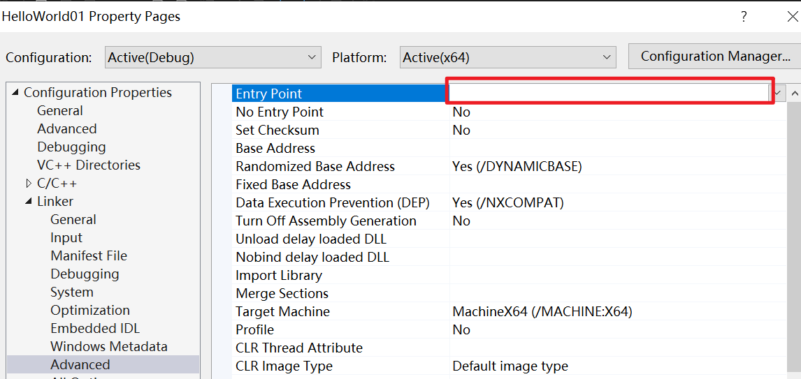

***07链接器***

# 介绍

编译器将C++ 源文件编译成.obj目标文件后，需要进行==链接==：==找到每个符号和函数的位置并将它们链接在一起==，在这之前每个文件都已经被编译成了一个单独的目标文件作为翻译单元，它们彼此之间没有任何联系  

Ctrl+F7只会编译文件，不会将文件链接；build项目会链接文件。  

```c++
#include <iostream>
const char* Log(const char* message) {
	return message;
}

int Multiply(int a,int b ) { 

	Log("Multiply");
	return  a * b;
}
```

编译实际上分为编译和链接两个阶段。如果上面代码去掉一个分号，则出现错误  
```shell
1>E:\cppStudyTemp\ChernoCpp\HelloWorld01\HelloWorld01\Math.cpp(10,1): error 
C2143: syntax error: missing ';' before '}' 
1>Done building project "HelloWorld01.vcxproj" -- FAILED.
========== Build: 0 succeeded, 1 failed, 0 up-to-date, 0 skipped ==========
========== Build completed at 17:51 and took 05.115 seconds ==========
```
这里C2143，==C开头表示是编译阶段的错误==  

补上后将整个项目build构建后，出现另一个错误：  

```shell
1>MSVCRTD.lib(exe_main.obj) : error LNK2019: unresolved external symbol main referenced in function "int __cdecl invoke_main(void)" (?invoke_main@@YAHXZ)
1>E:\cppStudyTemp\ChernoCpp\HelloWorld01\x64\Debug\HelloWorld01.exe : fatal error LNK1120: 1 unresolved externals
1>Done building project "HelloWorld01.vcxproj" -- FAILED.
```
这里出现LNK1120，==LNK开头表示链接阶段出现错误==  

## 指定程序入口

右键项目--属性 ，可以指定程序入口（所以并不一定必须是main函数）  

  

或者直接在程序里编写`#pragma comment(linker, "/ENTRY:haha")`  

必须禁用CRT调试功能才能编译成功，即：  

  

下面代码项目build成功：  

```c++
#pragma comment(linker, "/ENTRY:haha") 
int haha()
{     
    return 0;
}
```

目前我还不知道如何使用`std::cout << "hello"` ，目前要么报错要么没任何提示     

> 绕过main会跳过C++运行时的初始化：==全局/静态对象可能不会正确构造，atexit注册的函数不会被执行，异常处理可能无法工作==  

# 例子

## 编译错误
```c++
//Main.cpp
#include <iostream>
#添加声明，避免编译错误
void Log(const char* message);

int Multiply(int a, int b) {

	Log("Multiply");
	return a * b;

}

int main() {
	std::cout << Multiply(5, 8) << std::endl;
	std::cin.get();
}
```

如果没有`void Log(const char* message);`而去编译Main.cpp，会提示`1>E:\cppStudyTemp\ChernoCpp\HelloWorld01\HelloWorld01\Math.cpp(6,2): error C3861: 'Log': identifier not found ` 。   ~~编译错误~~ 

```c++
//Log.cpp

//没有这行会提示error C2039: 'cout': is not a member of 'std'
#include <iostream>

void Log(const char* message) {
	std::cout << message << std::endl;
}
```

现在可以右键项目名，build整个项目了  

## 链接错误

Main.cpp不变  

```c++
//Main.cpp
#include <iostream>
#添加声明，避免编译错误
void Log(const char* message);

int Multiply(int a, int b) {

	Log("Multiply");
	return a * b;

}

int main() {
	std::cout << Multiply(5, 8) << std::endl;
	std::cin.get();
}
```

*仅修改Log.cpp*文件，修改函数名Log为Logr

```c++
//Log.cpp

//没有这行会提示error C2039: 'cout': is not a member of 'std'
#include <iostream>
void Logr(const char* message) {
	std::cout << message << std::endl;
}
```

此时分别编译两个文件都成功了，继续build构建项目会提示出错：  
```shell
1>Math.obj : error LNK2019: unresolved external symbol "void __cdecl Log(char const *)" (?Log@@YAXPEBD@Z) referenced in function "int __cdecl Multiply(int,int)" (?Multiply@@YAHHH@Z)
1>E:\cppStudyTemp\ChernoCpp\HelloWorld01\x64\Debug\HelloWorld01.exe : fatal error LNK1120: 1 unresolved externals
```
未解析的外部符号Log，Multiply引用了它，但是它找不到要将它链接到哪个函数中  

如果将Multiply函数中的*调用Log*语句`Log("Multiply");`注释掉，则build项目成功无报错  

```c++
int Multiply(int a, int b) {
	//Log("Multiply");
	return a * b;
}
//========== Build: 1 succeeded, 0 failed, 0 up-to-date, 0 skipped ==========
```
如果将Main函数中的Multiply函数调用注释，则build照样提示链接错误  

```c++
#include <iostream>
void Log(const char* message);
int Multiply(int a, int b) {
	Log("Multiply");
	return a * b;

}
int main() {
	//std::cout << Multiply(5, 8) << std::endl;
	std::cin.get();
}

/*1>Math.obj : error LNK2019: unresolved external symbol "void __cdecl Log(char const *)" (?Log@@YAXPEBD@Z) referenced in function "int __cdecl Multiply(int,int)" (?Multiply@@YAHHH@Z)
1>E:\cppStudyTemp\ChernoCpp\HelloWorld01\x64\Debug\HelloWorld01.exe : fatal error LNK1120: 1 unresolved externals
1>Done building project "HelloWorld01.vcxproj" -- FAILED.
========== Build: 0 succeeded, 1 failed, 0 up-to-date, 0 skipped ========== */
```

为什么未使用它却没有删除它并且避免报错？因为虽然该文件(Main.cpp)没有使用Multiply，但是有可能另一个文件可能使用它，所以链接器会链接它，要保证允许使用的函数都必须是可链接的  

## 消除链接的必要性

如果告诉链接器我只会在这个文件中使用它，如下，那么就可以消除链接的必要性：  

```c++
#include <iostream>
void Log(const char* message);
//添加了static 
static int Multiply(int a, int b) {
	Log("Multiply");
	return a * b;

}
int main() {
	//std::cout << Multiply(5, 8) << std::endl;
	std::cin.get();
}
```

Log.cpp文件没有任何修改

```c++
//Log.cpp
//没有这行会提示error C2039: 'cout': is not a member of 'std'
#include <iostream>
void Logr(const char* message) {
	std::cout << message << std::endl;
}
```

即使Log.cpp中函数名错误，此时build项目也不会报错  

## 完整的正确版本

Main.cpp
```c++
#include <iostream>
void Log(const char* message);
static int Multiply(int a, int b) {
	Log("Multiply");
	return a * b;
}
int main() {
	std::cout << Multiply(5, 8) << std::endl;
	std::cin.get();
}
```

Log.cpp
```c++
//没有这行会提示error C2039: 'cout': is not a member of 'std'
#include <iostream>
void Log(const char* message) {
	std::cout << message << std::endl;
}
```

------  

此时项目能正常build成功  

如果将Log函数的返回值修改为int，则build项目会出错
```c++
//没有这行会提示error C2039: 'cout': is not a member of 'std'
#include <iostream>
int Log(const char* message) {
	std::cout << message << std::endl;
	return 0;
}
```

# 重复相同签名的符号链接  

