***如何调试代码***  

- 断点
- 读取内存

1. 光标放到要调试的行，然后鼠标移动到最前面点一下/或者按F9，即可在该行插入断点  
2. 确保是Debug模式，而且点击`LocalWindowsDebugger`  
      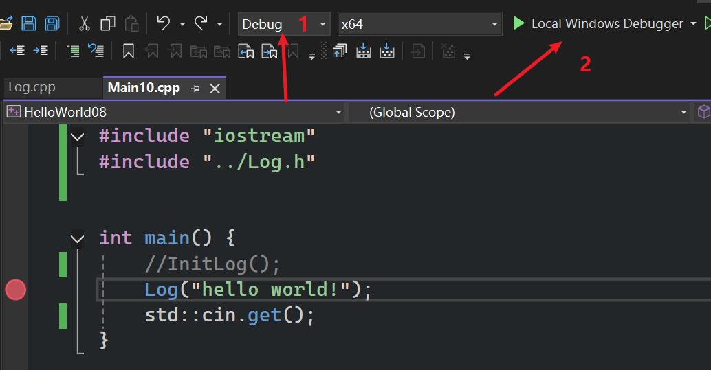  
3. 调试中  
   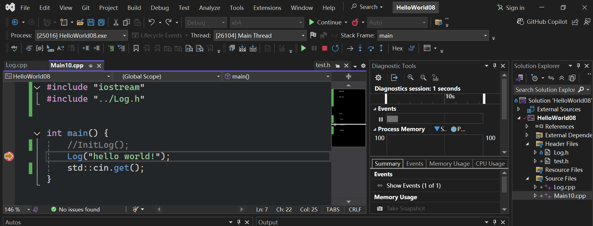
   橘黄色指向指令指针目前的位置
   stepInto(F11):进入目前行所在函数  
   
   stepOver(F10):继续执行到下一行  
   
   stepOut(shift+F11)：跳出当前函数  
   
此时按F11进入函数(这里和视频不太一样，黄色箭头在左括号处是读不到数值的)  

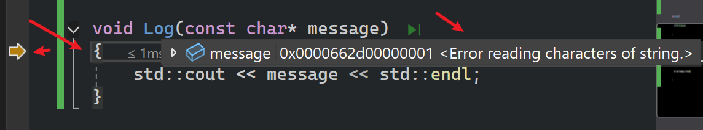

再按一次F10执行到第一行代码前才行

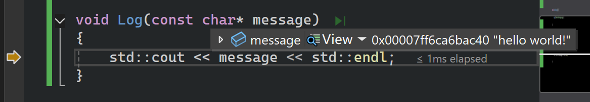  

再按一次F10  

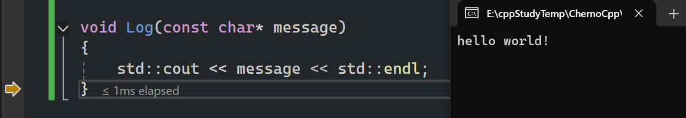  

再按一次F10就继续执行（这里会跳出Log函数）  

按F5会继续执行，直到下一个断点  


# 调试 

```cpp
#include "iostream"
#include "Log.h" 


int main() {
	//InitLog();
	int a = 8;
	a++;
	const char* string = "Hello";
	for (int i = 0; i < 5; i++) {
		const char c = string[i];
		std::cout << c << std::endl;
	}
	Log("hello world!");
	//std::cin.get();
	std::cin.get();
}
```

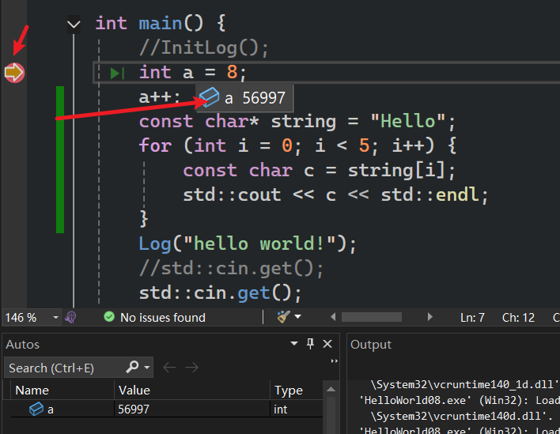  
箭头在此处，表示改行代码即将执行（未执行），所以此时a为任意可能值(未初始化的内存)  

Autos(ide认为比较重要的)，Locals(本地变量)，Watch1(自己添加的监视器)  
- 显示所有的程序内存  

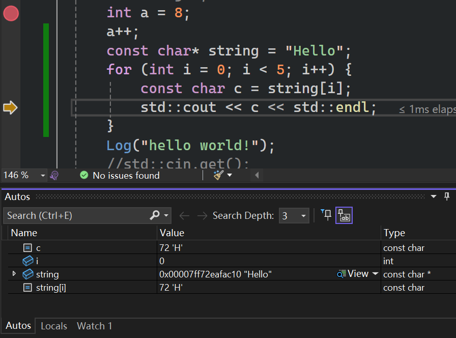  

- 左边是内存地址，右边是实际数据  

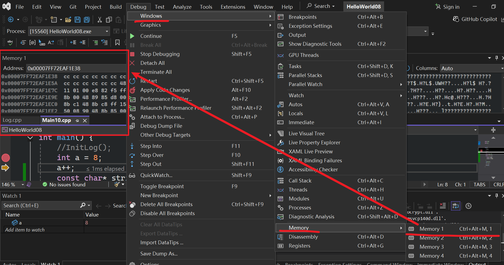  


- Memory中查看变量值(这里1个int变量占用==4个字节==)  

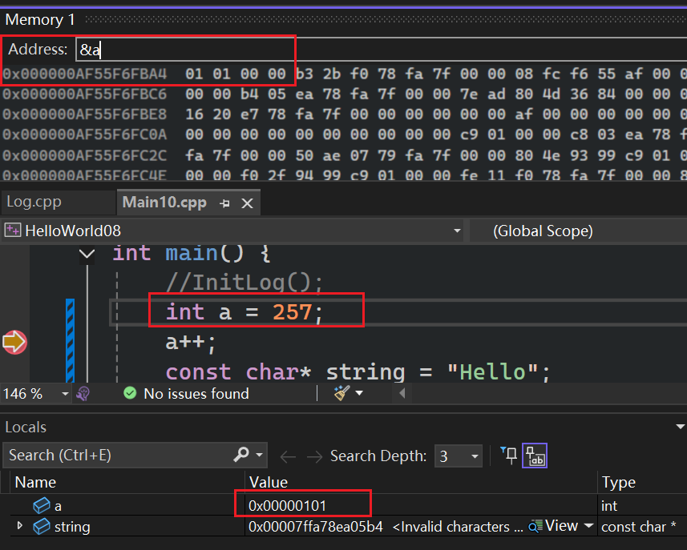    

很明显，这里用的是小端法，在内存中按最低有效字节到最高有效字节(01,01,00,00)的顺序在内存中排列  
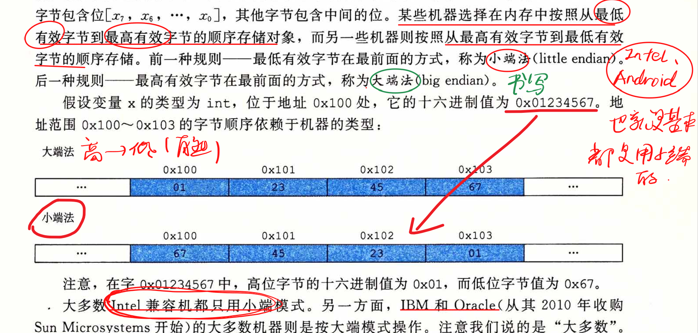  


- 如图，string变量的地址是0x000000A19256F838，值为0x00007ff7d45aac10，这个地址指向的值为Hello

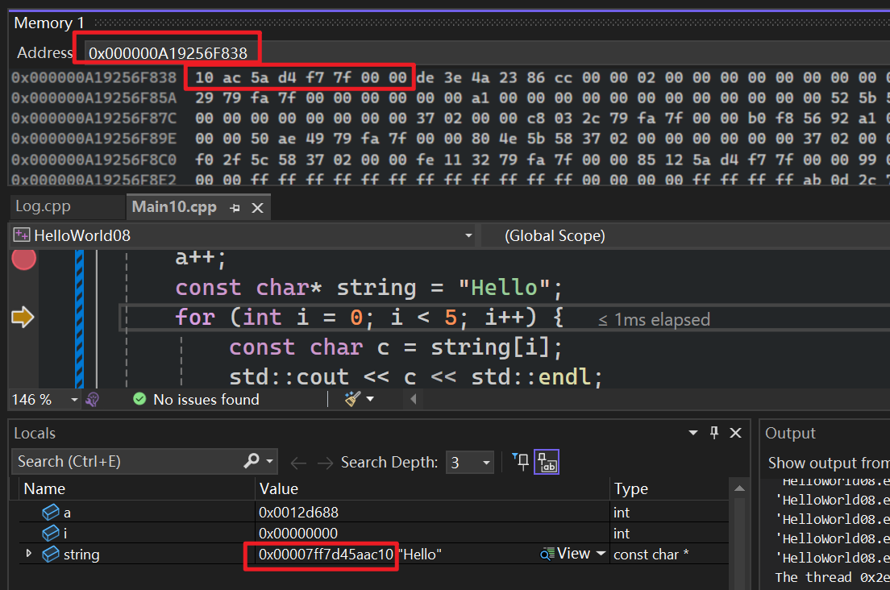  

- 接上，地址0x00007ff7d45aac10值为Hello，即H-72-0x48，e-101-0x65，l-108-0x6C，l-108-0x6C，o-111-0x6F
  
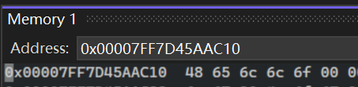  

# 总结

程序由内存组成，甚至指令指针，正在执行的代码、实际的代码，所有都存储在内存中。