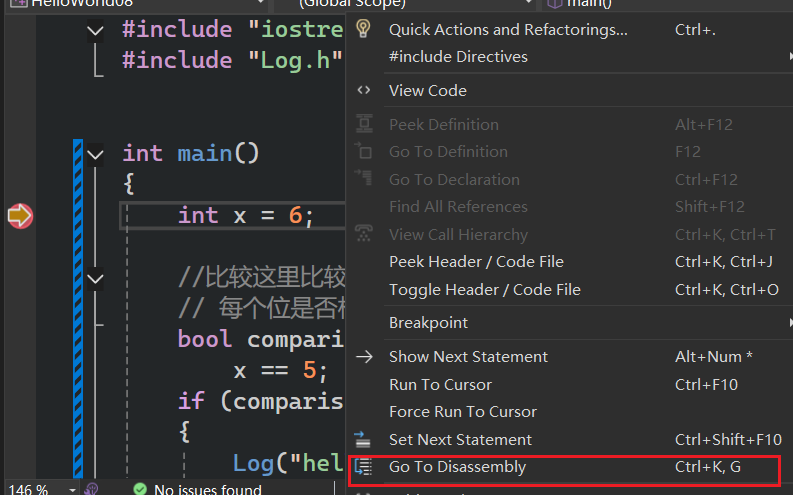
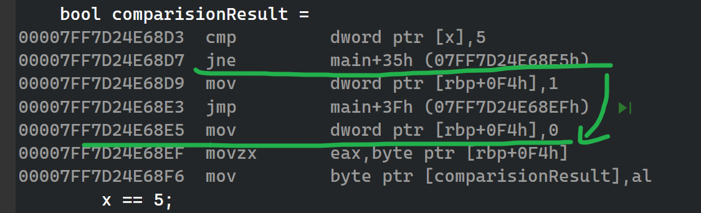

***条件及分支***  

- 先检查一个条件，然后跳转到不同的部分并开始执行指令，意味着条件及分支都有会一点开销。如果想编写稍微快点的代码就不该使用条件语句  
- 如果某事是真的，那么跳转到对应的代码块执行 

# 查看汇编

  

  

`mov dword ptr [x],6`==意思是==`在内存中名为 x 的位置，写入4个字节的数值 00000006（十六进制）`

- mov:移动
- cmp 比较
- jne:是否为零

不相等则跳转  
  

并且将某个位置（代表bia