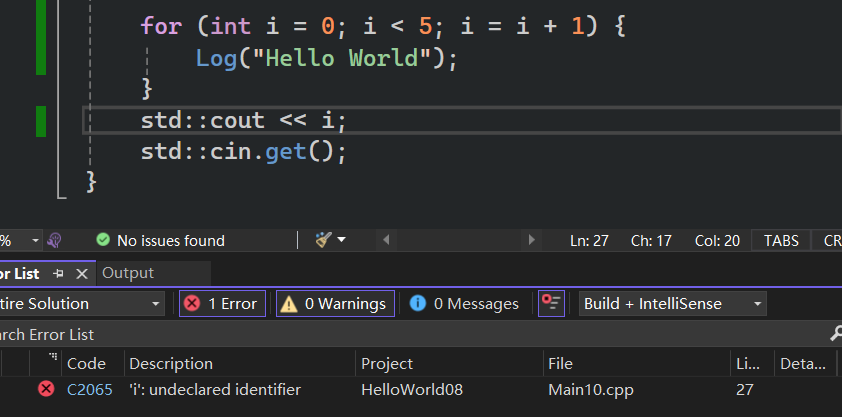

***循环***

# for
当需要执行某些操作多次时  

```cpp
	for (int i = 0; i < 5; i = i + 1) {
		Log("Hello World");
	}
```

1. 先创建变量i(为零)
2. 然后检查i<5，是的话执行下面代码块(否则退出)
3. 然后i=i+1
4. 然后再检查i<5，是的话执行下面代码块(否则退出)
5. 3->4->3->4 反复循环直到退出

> i的作用域仅限于for代码块  
> 
>   

上述代码也可改为  

```cpp
	int i = 0;
	for (; i < 5; ) {
		Log("Hello World");
		i = i + 1;
	}
```

或者  

```cpp
	int i = 0;
	bool condition = true;
	for (; condition; ) {
		Log("Hello World");
		i = i + 1;
		if (!(i < 5))
			condition = false;
	}
```

死循环  
```cpp
for(;;)
{
	
}
```

# while

基本上可以和for语句互转。但是如果有已经存在的条件，优先使用while  

```cpp

	int i = 0;
	while (i < 5) {
		Log("Hello World");
		i++;
	}
```

# do while

```cpp
//执行前先判断
bool condition = false;
while (condition)
{

}

//至少执行一次
do
{

} while (condition);
```

# 控制流

  

continue，break（如果有多重循环，不会影响到外部的循环）  

return  


- continue，跳过当前循环的剩余部分，并继续循环的下一次迭代（下图中红色部分剔除） 
```cpp
	for (int i = 0; i < 5; i++)
	{
		if ((i+1) % 2 == 0)
			continue;
		std::cout << i;
		Log("Hello world!");
	}
	/*
0Hello world!
2Hello world!
4Hello world!
	*/
```
  
- break，跳过当前循环的剩余部分，并结束当前循环的后续迭代  （下图中红色部分剔除）  
  ```cpp
  	for (int i = 0; i < 5; i++)
	{
		if ((i + 1) % 2 == 0)
			break;
		std::cout << i;
		Log("Hello world!");
	}
	/*
	0Hello world!
	*/
  ```
  
- return ，直接退出函数  


