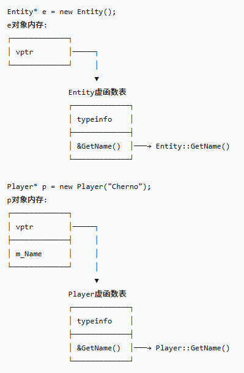

# 继承
## 例子

```cpp
#include <iostream>

class Entity
{
public:
	float X, Y;
	void Move(float xa, float ya)
	{
		X += xa;
		Y += ya;
	}
};

//public表示子类继承的父类的成员变量/方法，
//最高只能是public。如果是class Player :protected Entity
//则原来父类中的public成员变量变成protected，但是原来的protected
//和private成员变量则不变
class Player :public Entity
{
public:
	const char* Name;

	void PrintName()
	{
		std::cout << Name << std::endl;
	};
};
int main()
{
	//64位系统，Entity两个float，占用了16字节
	std::cout << sizeof(float) << std::endl;//4
	std::cout << sizeof(char*) << std::endl;//8
	std::cout << sizeof(Entity) << std::endl;//4+4=8
	std::cout << sizeof(Player) << std::endl;//4+4+8=16
	Player player;
	player.Move(5, 5);
	player.X = 2;

	std::cin.get();
}
```

多态：如果我现在创建一个独立的函数来打印Entity对象，例如通过访问X和Y变量并将它们打印出来。那我其实也可以将Player对象传递给该函数  


如果在Player中重写方法，就需要维护一个叫做虚函数表(vtable)的东西，会占用额外的内存  

# 虚函数

## 例子

```cpp
#include <iostream>
#include <string>

class Entity
{
public:
	std::string GetName() { return "Entity"; }
};

class Player :public Entity
{
private :
	std::string m_Name;
public:
	Player(const std::string& name)
		:m_Name(name){}
	std::string GetName() { return m_Name; }
};

int main()
{
	Entity* e = new Entity();
	std::cout << e->GetName() << std::endl;//Entity

	Player* p = new Player("Cherno");
	std::cout << p->GetName() << std::endl;//Cherno

	Entity* entity = p;
	std::cout << entity->GetName() << std::endl;//Entity ??

	std::cin.get();
}
```

## 例子2

```cpp
#include <iostream>
#include <string>

class Entity
{
public:
	std::string GetName() { return "Entity"; }
};

class Player :public Entity
{
private :
	std::string m_Name;
public:
	Player(const std::string& name)
		:m_Name(name){}
	std::string GetName() { return m_Name; }
};

void PrintName(Entity* entity)
{
	std::cout << entity->GetName() << std::endl;
}

int main()
{
	Entity* e = new Entity();
	PrintName(e);//Entity

	Player* p = new Player("Cherno");
	PrintName(p); //Entity
	 

	std::cin.get();
}
```
如果想要C++以某种方式，通过辨别具体的对象，而调用具体的方法，那么需要加`virtual`关键字  

```cpp
#include <iostream>
#include <string>

class Entity
{
public:
	virtual std::string GetName() { return "Entity"; }
};

class Player :public Entity
{
private :
	std::string m_Name;
public:
	Player(const std::string& name)
		:m_Name(name){}
	//这里override增加了代码的可读性，可以省略
	std::string GetName() override { return m_Name; }
};

void PrintName(Entity* entity)
{
	std::cout << entity->GetName() << std::endl;
}

int main()
{
	Entity* e = new Entity();
	PrintName(e);//Entity

	Player* p = new Player("Cherno");
	PrintName(p); //Cherno
	 

	std::cin.get();
}
```

- 编译器看到virtual关键字，会为该函数生成一个v table(虚函数表)。
- 有代价，1需要额外的内存存储该表，2每次都得额外通过该表确定函数实际映射到哪里，产生额外的性能损失
### 拓展-虚函数表

这里我进一步修改了一下main函数中的代码  

```cpp
int main()
{
	Entity* e = new Entity();
	PrintName(e);//Entity

	Entity* p = new Player("Cherno");
	PrintName(p); //Cherno
	 
	std::cin.get();
}
```

### 补充_虚函数表  

  

- 静态类型（编译时）：Entity*
	- 编译器看到的是 Entity*
	- 决定可以调用哪些方法（Entity的接口）
- 动态类型（运行时）：Player*
	- 实际创建的对象类型
	- 决定 vptr 指向哪个虚函数表
	- 决定虚函数调用哪个实现

