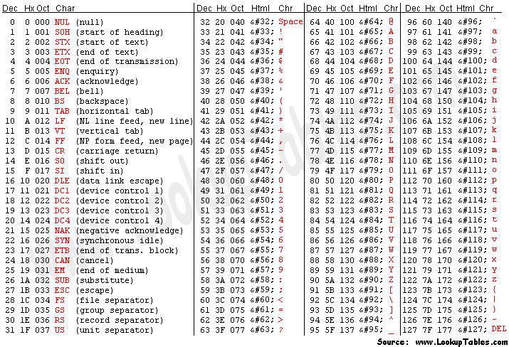
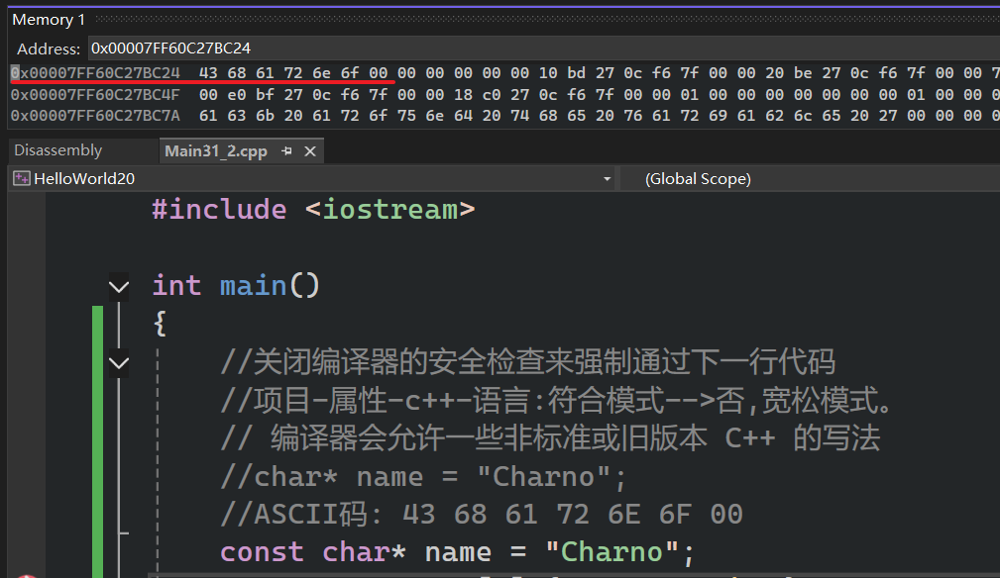

- 字符串本质上是==一组字符(字符数组)==，字符，即数字、字母等等
- 需要在计算机上以某种形式表示文本
- 如果想要在C++中实现字符串功能，先要了解字符的工作原理，以及字符是什么。
- 如果我们只用一个字节(8位)来表示一个字符，那么就有2^8=256种可能性。但是如果考虑到字母、数字、特殊符号、中文、韩文远超过256种。所以后面才有16字符编码(UTF-16),即用16字节表示一个字符(65536种可能性)。但在C++种不使用库就只能使用UTF-8

本章节中，其实字符串指的是字符指针  

# 字符串修改问题

```cpp
#include <iostream> 

int main()
{
	//C风格的定义字符串的方式
	//char* name = "Cherno";
	//正常情况下不修改字符串的值,
	//如果想要新的字符串，那么就要进行全新
	//的内存分配并删除旧字符串(这里不是new，不
	//需要手动delete)
	const char* name = "Cherno";
	char const* name1 = "Cherno";
	//const在*前面，不允许修改数据
	//name[2] = '1';//报错!
	//name1[2] = '1';//报错!

	char buffer[] = "Hello";
	char* const  ptr = buffer;
	//const在*后面，不允许指向另一个字符串
	//ptr = new char[3] {'a','b','c'};//报错!

	std::cin.get();
}
```

# 字符串在内存中

  

```cpp
#include <iostream>

int main()
{
	//关闭编译器的安全检查来强制通过下一行代码
	//项目-属性-c++-语言:符合模式-->否,宽松模式。
	// 编译器会允许一些非标准或旧版本 C++ 的写法
	//char* name = "Charno";
	//ASCII码: 43 68 61 72 6E 6F 00
	const char* name = "Charno";
	name = new char[3] {'a', 'b','\0'};//允许
	//name[2] = 'a'; //不允许
	std::cout << name << std::endl;


	std::cin.get();
}
```

# 字符串的基本原理

字符串在内存中  

  

最后一个`00`是空终止符，即`\0`  

```cpp
#include <iostream>

int main()
{
	//关闭编译器的安全检查来强制通过下一行代码
	//项目-属性-c++-语言:符合模式-->否,宽松模式。
	// 编译器会允许一些非标准或旧版本 C++ 的写法
	//char* name = "Charno";
	//ASCII码: 43 68 61 72 6E 6F 00
	const char* name = "Charno";
	name = new char[3] {'a', 'b', '\0'};//允许
	//name[2] = 'a'; //不允许
	std::cout << name << std::endl;

	name = "Charno";
	std::cout << name << std::endl;

	char name2[6] = { 'C','h','e','r','n','o' };
	//会导致乱码 Cherno烫烫烫烫烫烫烫烫烫烫烫烫烫烫烫???
	std::cout << name2 << std::endl;
	char name3[7] = { 'C','h','e','r','n','o' ,'\0' };
	std::cout << name3 << std::endl;
	char name4[7] = { 'C','h','e','r','n','o' ,0 };
	std::cout << name4 << std::endl;


	std::cin.get();
}
```

# c++中的字符串

使用`std::string`，他其实就是一个字符数组，后面会讲解自己版本的string  

```cpp
#include <iostream>
#include <string>

int main()
{
	//std::string 内部通常包含一个字符指针（指向字符数据的指针）
	//"Cherno"->"const char[7]"
	std::string name = "Cherno";
	std::cout << name << std::endl;
	std::cout << name.size() << std::endl;//6

	//把两个字符串相加,下面这句会报错
	//std::string name2 = "Cherno" + "_hello";
	//这里+,+= 被 std::string重载了
	name = name + "_hello";
	name += "_hello";
	//编译通过
	std::string name3 = std::string("Cherno") + "_hello";

	//std::string::npos 是一个特殊常量，表示 "未找到" 或 "无效位置"。
	bool contains = name.find("no") != std::string::npos;
	std::cin.get();
}
```

## `std::string`作为传参

```cpp
#include <iostream>
#include <string>

//不要用这种形参，这会在使用时另外增加一个string副本
void PrintString(std::string string) {
	string += "h";
	std::cout << string << std::endl;
}

//推荐
void PrintStringRight(const std::string& string) {
	//报错
	//string += "h";
	std::cout << string << std::endl;
}

int main()
{ 
	std::string name = std::string("Cherno") + "_hello";
	PrintString(name);//Cherno_helloh
	std::cout << name << std::endl;//Cherno_hello
	PrintStringRight(name);

	std::cin.get();
}
```

