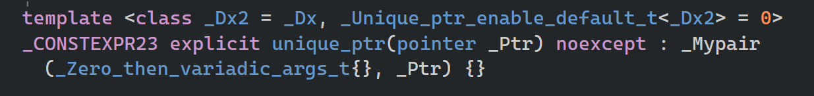

智能指针，是真实原始指针被包装。使用智能指针时，将调用new并分配给你内存，这块内存在某些时候会自动释放  

# unique pointer 唯一指针

在一个作用域内，同一个原始指针只能被一个 unique_ptr 管理。它禁止拷贝，这意味着你不能通过赋值来增加它的引用，只能使用 `std::move()` 将所有权从一个指针转移给另一个。  

## 转让所有权-附加知识点

```cpp
#include <iostream>
#include <memory>
class Entity {};
int main() {
    // 1. 创建第一个 unique_ptr
    std::unique_ptr<Entity> entity = std::make_unique<Entity>();

    // 2. 使用 std::move 转移所有权
    // 此时，entity 原有的内存所有权交给了 e2
    std::unique_ptr<Entity> e2 = std::move(entity);

    // 3. 检查状态
    if (entity == nullptr) {
        std::cout << "entity 现在是空的 (nullptr)" << std::endl;
    }

    if (e2 != nullptr) {
        std::cout << "e2 现在拥有 Entity 的所有权" << std::endl;
    }

    std::cin.get();
    return 0;
} // e2 在这里离开作用域，Entity 被自动销毁
```

## 示例-主要知识点

```cpp
#include <iostream>  
#include <string>
#include <memory>

class Entity
{
public:

	//constructor-构造函数
	Entity()
	{
		std::cout << "Created Entity!" << std::endl;
	}


	//destructor-析构函数
	~Entity()
	{
		std::cout << "Destroyed Entity!" << std::endl;
	}

	void Print()
	{
		std::cout << "hello" << std::endl;
	}

};

int main()
{
	std::cout << "start--" << std::endl;
	{
		//不允许，禁止隐式转换
		//std::unique_ptr<Entity> entity =new Entity();
		
		//允许,直接调用构造函数，但是不建议
		//如果创建完原始对象后发生了异常，没有来得及将它放到智能指针对象
		//会导致不释放指针指向内存，导致内存泄漏
		//std::unique_ptr<Entity> entity(new Entity());
		
		//不会有这问题，因为std::make_unique保证了创建对象和将其
		// 放入智能指针是一个原子操作==，中间不会被其他逻辑插入，因
		// 此它是异常安全的。
		std::unique_ptr<Entity> entity = std::make_unique<Entity>();

		entity->Print();

		std::unique_ptr<Entity> e2 = std::move(entity);//允许
		//std::unique_ptr<Entity> e3 = entity;//不允许，编译报错
		/*查看源码
		* 复制构造函数和赋值操作符被删除
			unique_ptr(const unique_ptr&)            = delete;
			unique_ptr& operator=(const unique_ptr&) = delete;		
		*/

	}
	std::cout << "end--" << std::endl;
	std::cin.get();
}
/*
start--
Created Entity!
hello
Destroyed Entity!
end--
*/
```

不允许`std::unique_ptr<Entity> entity =new Entity();`  因为禁止隐式转换  

  

### 为什么使用`std::make_unique`

异常安全性（最核心的区别）
在复杂的表达式中，`std::unique_ptr<Entity> entity(new Entity());` 写法可能会导致内存泄漏。

假设你有这样一个函数： `void Function(std::unique_ptr<Entity> e, void(*DoSomething)())`

如果你这样调用它： `Function(std::unique_ptr<Entity>(new Entity()), PossibleExceptionFunc());`

风险： C++ 标准并不规定参数的计算顺序。如果编译器先执行了 `new Entity()`，接着执行了 `PossibleExceptionFunc()`，而后者抛出了异常，那么此时 unique_ptr 还没来得及构造。

后果： 刚刚 new 出来的内存就再也没有人能释放它了，导致内存泄漏。

解决： `std::make_unique` ==保证了创建对象和将其放入智能指针是一个原子操作==，中间不会被其他逻辑插入，因此它是异常安全的。  

# share pointer 共享指针

- unique_ptr： 内部只包含一个原始指针。它不维护任何额外的数据。在编译优化后，它的机器码和原始指针几乎一模一样。
- shared_ptr： 必须维护一个控制块 (Control Block)。这个控制块包含：==引用计数（Reference Count）==、弱引用计数（Weak Count）、其他元数据（如自定义删除器）每次拷贝或销毁shared_ptr，都要去更新这个计数。 当没有任何引用指向它时，才会delete原对象  


