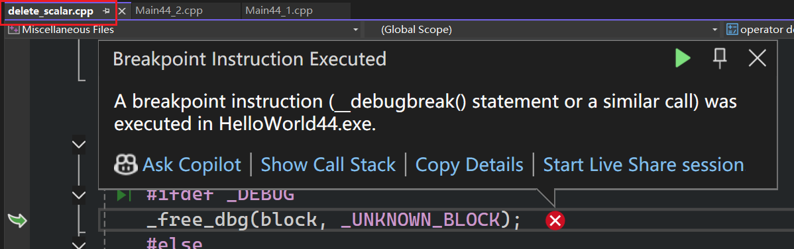
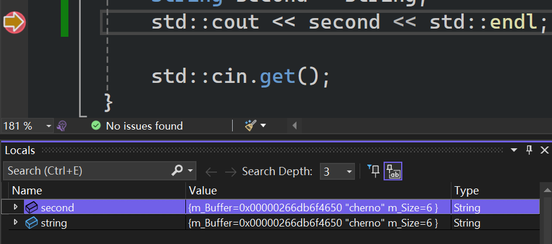

了解在C++中复制的实际运作方式，以及如何让它工作，如何避免它工作（==避免在不想复制时复制，因为复制对性能有影响，有时只想读取对象或者修改现有对象==）    

当你把变量赋值给另一个变量时，都是在使用复制。如果是指针，则是复制指针的地址（一串数字，而不是指针指向的内容）  

```cpp - 点击展开代码
#include <iostream>
#include <string>

struct Vector2
{
	float x, y;
};

int main()
{
	int a1 = 2;
	int b1 = a1;
	//a，b是两个不同的变量，互不影响
	b1 = 3;
	std::cout << a1 << std::endl;//2
	std::cout << b1 << std::endl;//2

	Vector2 a = { 2,3 };
	Vector2 b = a;
	b.x = 5;
	std::cout << a.x << std::endl;//2
	std::cout << b.x << std::endl;//5

	Vector2* aP = new Vector2();
	//复制了指针，没有复制实际数据，复制的是地址
	Vector2* bP = aP;
	bP->x = 2;
	std::cout << aP->x << std::endl;//2
	std::cout << bP->x << std::endl;//2

	bP++;//aP没有被影响到
	std::cout << aP << std::endl;//000002A2946D9EC0
	std::cout << bP << std::endl;//000002A2946D9EC8

	std::cin.get();
	return 0;
}
```

除了引用以外，其他的给变量赋值，都是使用的复制

# 自己写一个基础的String类

```cpp
#include <iostream>
#include <string>

//写一个最原始的String类
class String
{

private:
	char* m_Buffer;
	unsigned int m_Size;
public:
	//接收一个常量字符，初始化
	String(const char* string)
	{
		//strlen 函数的作用是计算字符串的长度，它会从你提供的指针
		// 地址开始扫描，直到遇到第一个空字符（终止符）\0 为止，
		// 但计数结果不计入这个\0
		m_Size = strlen(string);
		//向堆申请m_Size字节的空间
		m_Buffer = new char[m_Size+1];

		/*for (int i = 0; i < m_Size; i++)
			m_Buffer[i] = string[i];*/

		//不使用上面的，而是使用简短的函数拷贝
		//工作方式：它从 src 指向的地址开始，连续复制 count 个字节到 dest 指向的地址。
		memcpy(m_Buffer, string, m_Size);
		m_Buffer[m_Size] = '\0';

	}

	//让该函数在类外访问String私有成员
	friend std::ostream& operator<<(std::ostream& stream, const String& string);

	~String()
	{
		delete[] m_Buffer;
	}

	//测试,无意义
	unsigned int& mytest()
	{
		return m_Size;
	}

	/*
	返回引用意味着你拿到了内存中那个字符的“本体”，而不是它的副本。这样你不仅可以读它（char c = string[2]），还可以写它（string[2] = 'a'）
	*/
	char& operator[](unsigned int index)
	{
		return m_Buffer[index];
	}
};

//如果是成员函数，调用方式会变成 string << std::cout;（这看起来非常反人类）。
//为了实现 std::cout << string; 这种标准写法，左边的对象必须是 std::ostream。
// 因为我们没法修改 C++ 标准库的 ostream 类，所以只能在自己的类里写一个全局函数
// ，并把它设为“友元”。
std::ostream& operator<<(std::ostream& stream, const String& string)
{
	//只有将该函数(operator<<定义为友元函数，才能在类外访问String私有成员
	//std::cout 在处理 char* 时，它的内部逻辑大致如下：
	//它拿到的只是一个内存地址。
	//它并不知道你这个字符串到底有多长（它不读你的 m_Size 变量）。
	//它的唯一指令是：“从这个地址开始打印，直到看到 \0（空终止符）为止。”
	stream << string.m_Buffer;
	return stream;
}

int main()
{
	String string = "cherno";
	std::cout << string << std::endl;

	String second = string;
	std::cout << second << std::endl;

	second[2] = 'a';

	//测试,无意义
	//编译器眼中看到的不是一个函数调用，而是一个左值（lvalue），
	// 也就是一个可以直接被赋值的内存位置。这行代码等同于直接操作：
	// second.m_Size = 3;
	second.mytest() = 3;
	std::cout << second.mytest() << std::endl;//3


	std::cout << string << std::endl;//charno
	std::cout << second << std::endl;//charno


	std::cin.get();
}
```

按enter停止运行后提示出错  

  

因为这里delete了两次m_Buffer  

打上断点，发现 second和string 都是存储同一个内存地址  
  

## 默认复制构造函数

```cpp
Class String
{
	//......
	//......
	
	//如果没有给出复制构造函数，编译器会默认给出这样一个构造函数
	String(const String& other)
		:m_Buffer(other.m_Buffer), m_Size(other.m_Size)
	{
		//C++ 的权限控制是基于“类”（Class）的，而不是基于“对象”（Instance）。
	//编译器认为：既然你已经身处 String 类的内部代码中，你就是“自己人”。作为一个 String 类，你理所当然知道如何处理另一个 String 类的内部数据。
		//std::cout << other.m_Size;
	}
	
	//......
	
}
```

## 简单的复制构造函数

```cpp
	String(const String& other)
	{
		/*
		memcpy(this, &other, sizeof(String)) 会把 other 对象内存里的所有内容（包括它的 vptr）原封不动地覆盖到 this 对象的内存上。
		*/
		memcpy(this, &other, sizeof(String));
	}
```

 [关于memcpy的问题](../44_1使用memcpy的注意事项/index.md)

# 深层复制

上面的String对象中，目前只有pointer和int。  

浅拷贝没有拷贝指针指向的内容  

```cpp
	//深度复制
	String(const String& other)
		:m_Size(other.m_Size)
	{
		m_Buffer = new char[m_Size + 1];
		//把那个空字符也copy过来
		memcpy(m_Buffer, other.m_Buffer, m_Size+1); 

		/*
深度复制的运行结果
cherno
cherno
3
cherno
charno
	*/
	}
```

# 完整深度复制构造  

```cpp
#include <iostream>
#include <string>

//写一个最原始的String类
class String
{

private:
	char* m_Buffer;
	unsigned int m_Size;
public:
	//接收一个常量字符，初始化
	String(const char* string)
	{
		//strlen 函数的作用是计算字符串的长度，它会从你提供的指针
		// 地址开始扫描，直到遇到第一个空字符（终止符）\0 为止，
		// 但计数结果不计入这个\0
		m_Size = strlen(string);
		//向堆申请m_Size字节的空间
		m_Buffer = new char[m_Size + 1];

		/*for (int i = 0; i < m_Size; i++)
			m_Buffer[i] = string[i];*/

		//不使用上面的，而是使用简短的函数拷贝
		//工作方式：它从 src 指向的地址开始，连续复
		// 制 count 个字节到 dest 指向的地址。
		memcpy(m_Buffer, string, m_Size);
		m_Buffer[m_Size] = '\0';

	}


	////如果没有给出复制构造函数，编译器会默认给出这样一个构造函数
	//String(const String& other) 
	//{
	//	//C++ 的权限控制是基于“类”（Class）的，而不是基于“对象”（Instance）。
	////编译器认为：既然你已经身处 String 类的内部代码中，你就是“自己人”。作为一个 String 类，你理所当然知道如何处理另一个 String 类的内部数据。
	//	//std::cout << other.m_Size;
	//}

	//String(const String& other)
	//{
	//	/*
	//	memcpy(this, &other, sizeof(String)) 会把 other 对象内存里的所有内容（包括它的 vptr）原封不动地覆盖到 this 对象的内存上。
	//	*/
	//	memcpy(this, &other, sizeof(String));
	//}

	//不允许复制
	//String(const String& other) = delete;

	//深度复制
	String(const String& other)
		:m_Size(other.m_Size)
	{
		std::cout << "Copied String!" << std::endl;
		m_Buffer = new char[m_Size + 1];
		//把那个空字符也copy过来
		memcpy(m_Buffer, other.m_Buffer, m_Size+1); 

		/*
深度复制的运行结果
cherno
cherno
3
cherno
charno
	*/
	}

	//让该函数在类外访问String私有成员
	friend std::ostream& operator<<(std::ostream& stream, const String& string);

	~String()
	{
		delete[] m_Buffer;
	}

	//测试,无意义
	unsigned int& mytest()
	{
		return m_Size;
	}

	/*
	返回引用意味着你拿到了内存中那个字符的“本体”，而不是它的副本。这样你不仅可以读它（char c = string[2]），还可以写它（string[2] = 'a'）
	*/
	char& operator[](unsigned int index)
	{
		return m_Buffer[index];
	}
};

//如果是成员函数，调用方式会变成 string << std::cout;（这看起来非常反人类）。
//为了实现 std::cout << string; 这种标准写法，左边的对象必须是 std::ostream。
// 因为我们没法修改 C++ 标准库的 ostream 类，所以只能在自己的类里写一个全局函数
// ，并把它设为“友元”。
std::ostream& operator<<(std::ostream& stream, const String& string)
{
	//只有将该函数(operator<<定义为友元函数，才能在类外访问String私有成员
	//std::cout 在处理 char* 时，它的内部逻辑大致如下：
	//它拿到的只是一个内存地址。
	//它并不知道你这个字符串到底有多长（它不读你的 m_Size 变量）。
	//它的唯一指令是：“从这个地址开始打印，直到看到 \0（空终止符）为止。”
	stream << string.m_Buffer;
	return stream;
}

//修改为//void PrintString(String& string) 可以避免复制
void PrintString(String string)
{
	std::cout << string << std::endl;
}

int main()
{
	String string = "cherno";
	std::cout << string << std::endl;

	String second = string;
	std::cout << second << std::endl;

	second[2] = 'a';

	//测试,无意义
	//编译器眼中看到的不是一个函数调用，而是一个左值（lvalue），
	// 也就是一个可以直接被赋值的内存位置。这行代码等同于直接操作：
	// second.m_Size = 3;
	second.mytest() = 3;
	std::cout << second.mytest() << std::endl;//3
	second.mytest() = 6;

	std::cout << second << std::endl;
	PrintString(string);//cherno
	PrintString(second);//charno 


	std::cin.get();
}

/*
cherno
Copied String!
cherno
3
charno
Copied String!
cherno
Copied String!
charno

*/
```

## 避免复制

```cpp
void PrintString(String& string)// 可以避免复制
{
	std::cout << string << std::endl;
}

/*
cherno
Copied String!
cherno
3
charno
cherno
charno

*/
```
