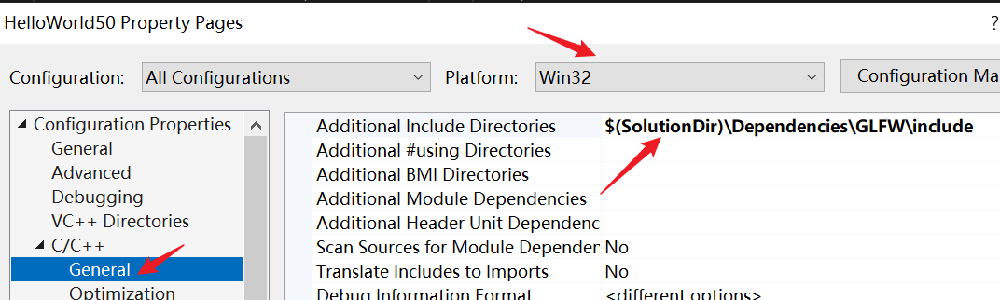
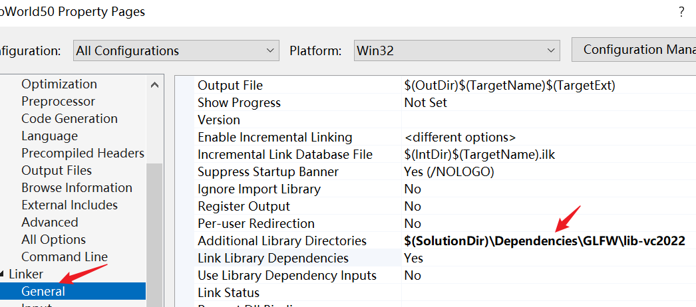
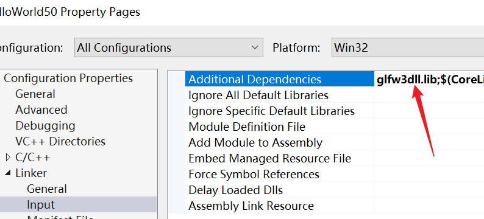
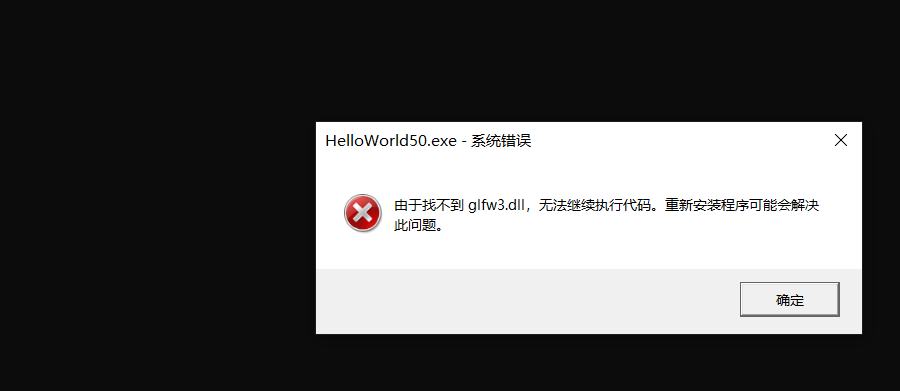
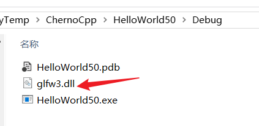
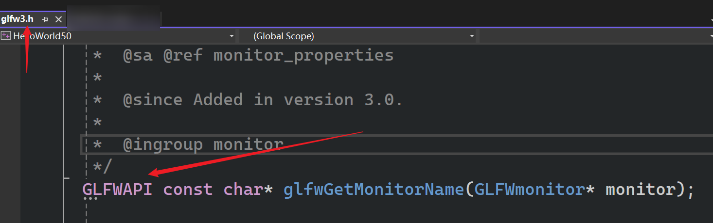
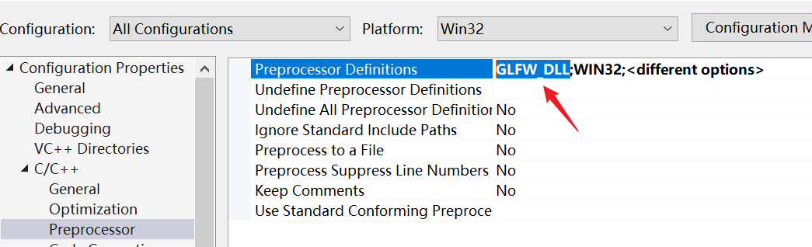

动态链接是什么，以及如何使用  

- 动态链接是在运行时发生的链接，当你实际启动可执行文件时，动态链接库加载时 它并非可执行文件的一部分，此时动态链接库被载入内存。意味着==运行时会动态链接另一个库==，然后运行应用程序 载入一个额外文件到内存。
	- 这种情况下，可执行文件实际上需要某些库存在（外部文件）。比如windows系统经常出现“缺少某些dll文件无法启动”
	- 可执行文件了解动态链接库，==可执行文件是一个独立文件==，在运行时加载的==独立==模块。但也可以==加载动态链接库==，他会在运行时查找并加载动态库，然后可以获取函数指针/动态库中任何内容
- 静态链接是在编译时发生的链接，当你编译一个静态库时，将它链接到可执行文件、应用程序或动态库中。即：==直接获取静态库的内容，然后把它和其他二进制数据放到一起==，静态库实际存在于可执行文件或动态库中，所以编译器、链接器完全清楚这些代码，并会对此进行优化


> 
> 当我们说“链接到一个动态库”时，实际上是指在创建（生成）那个 DLL 的时候，把静态库的代码塞进去。
> 

补充：动态链接包括“隐式链接” ~~需要 header (.h) 和 import library (.lib)~~ 和“显示链接”  ~~编译阶段完全不认识这个 DLL，也不需要 .lib 导入库。用法： 运行时使用 Windows API 函数（如 LoadLibrary 和 GetProcAddress）去手动加载。~~   

# 50使用动态库


复制Dependencies文件夹到根目录  
```cpp
λ tree Dependencies /f

CHERNOCPP\HELLOWORLD49\DEPENDENCIES
└─GLFW
    ├─include
    │  └─GLFW
    │          glfw3.h
    │          glfw3native.h
    │
    └─lib-vc2022
            glfw3.dll
            glfw3.lib
            glfw3dll.lib
            glfw3_mt.lib
```

静态链接和动态链接都是用同一部分的头文件  

  

  

目前按ctrl+f7已经能正常编译  

> glw3dll.lib  ~~glfw3dll.lib不存代码，只有地址~~ ，这是指向glw3.dll的一系列指针，所以我们在运行时无需实际检测所有内容的位置，==这两者同时编译很重要==，因为在运行时如果尝试使用不同静态库与DLL链接，你可能会遇到函数不匹配，并且函数指针会出现内存地址错误。但是这里是由glfw分发的，所以glw3.dll和glw3dll.lib是同时编译的，而且他们直接相互关联，这两者不能分开。

接下来设置库文件  

  

  

右键项目并build成功。但是目前如果会提示找不到dll文件  
```cpp
Rebuild started at 17:40...
1>------ Rebuild All started: Project: HelloWorld50, Configuration: Debug Win32 ------
1>Main50_1.cpp
1>HelloWorld50.vcxproj -> E:\cppStudyTemp\ChernoCpp\HelloWorld50\Debug\HelloWorld50.exe
========== Rebuild All: 1 succeeded, 0 failed, 0 skipped ==========
========== Rebuild completed at 17:40 and took 04.609 seconds ==========
```

  


这里先解释为什么这里不是填`glfw3.dll`而是`glfw3dll.lib`  

- .lib 文件是二进制格式的编译时文件，专门设计给 链接器（Linker） 识别的。它==包含了解析符号所需的元数据==。
- .dll 文件是可执行的运行时文件，它是给 Windows 操作系统 识别的。

结果：链接器根本读不懂 .dll 文件的内部结构。如果你强行把 .dll 填进去，VS 会报错：fatal error LNK1107: 文件无效或损坏。

将.dll文件放到可执行文件相同的文件夹即可处理弹窗报错  

  

或者直接在这个Debug文件夹双击运行也能运行  

==可执行文件所在的文件夹会自动成为搜索路径==  

# 源码

//glfw3.h
这里应该是想解释，一个.h头文件可以给不同情况用  




查看GLFWAPI定义  
```cpp
#if defined(_WIN32) && defined(_GLFW_BUILD_DLL)
 /* We are building GLFW as a Win32 DLL */
 #define GLFWAPI __declspec(dllexport)
#elif defined(_WIN32) && defined(GLFW_DLL)
 /* We are calling a GLFW Win32 DLL */
 #define GLFWAPI __declspec(dllimport)
#elif defined(__GNUC__) && defined(_GLFW_BUILD_DLL)
 /* We are building GLFW as a Unix shared library */
 #define GLFWAPI __attribute__((visibility("default")))
#else
 #define GLFWAPI
#endif
```

分析这个定义 

第一步：你是“造库人”吗？
- 翻译：如果你在 Windows 上，且你正在编译 GLFW 源码本身来生成 DLL。
- 结果：GLFWAPI 变成“出口”标签。此时 GLFWAPI int glfwInit(); 就变成了 __declspec(dllexport) int glfwInit();。

第二步：你是“用库人”吗？（这是你现在的身份）
- 翻译：如果你在 Windows 上，且你在自己的项目里告诉编译器“我要链接动态库”（定义了 GLFW_DLL 宏）。
- 结果：GLFWAPI 变成“进口”标签。此时 GLFWAPI int glfwInit(); 变成了 __declspec(dllimport) int glfwInit();。

第三步：你是用 Linux/Mac 吗？
- 翻译：这是给 Linux（GCC 编译器）用的，原理类似，但 Linux 处理动态库的方式和 Windows 不同，它不需要专门区分进口/出口，只需要设置“可见性”即可。

第四步：你是用静态库吗？（这是默认选项）
- 翻译：如果你既不是在造 DLL，也没有定义 GLFW_DLL（说明你可能在用静态库）。
- 结果：GLFWAPI 直接变成空白。函数就变成了普通的 int glfwInit();。

~~我目前的理解是，定义了宏GLFW_DLL后，程序会更高效~~    

  


