如何在vs中设置多个项目，以及如何创建一个能在所有项目中使用的库  

# 51创建并使用库

先以Game51命名创建一个项目  
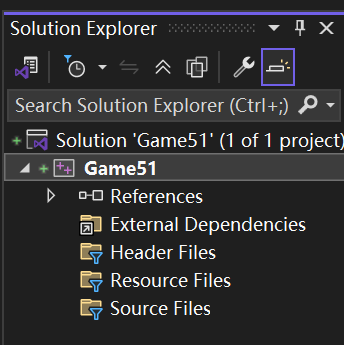

文件夹查看  
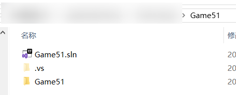  

再新建一个项目，项目名为Engine  

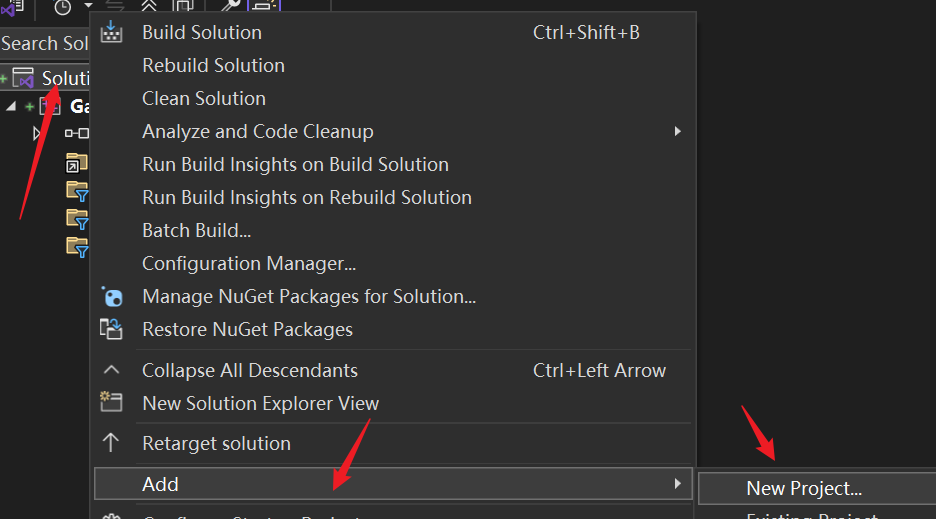  

此时  

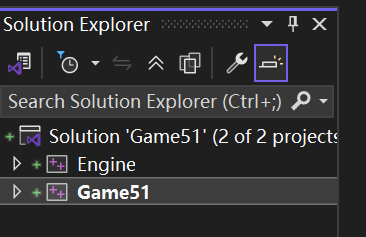  

------  

现在确保设置Game51为应用程序   

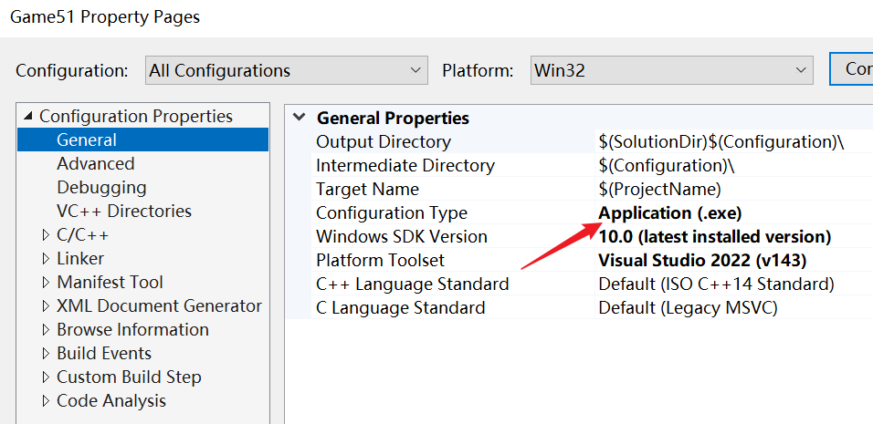  

Engine项目配置为静态库  

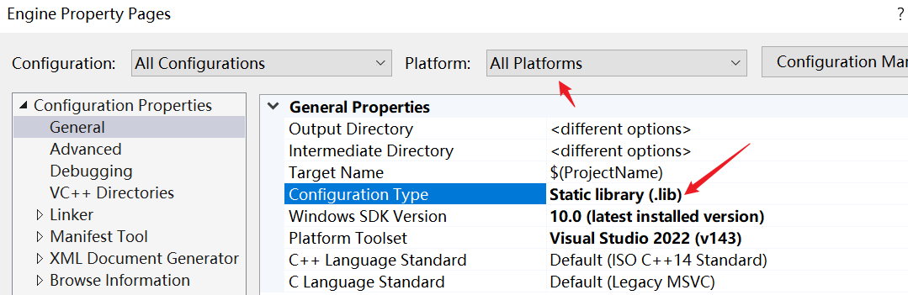  

# 创建文件夹及文件

show All Files  

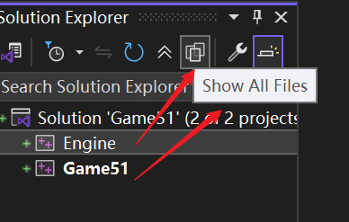

目录结构  

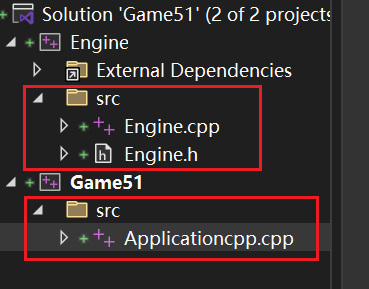  


# （静态链接库）Engine项目

```cpp
//src/Engine.h
#pragma once

namespace engine {
	void PrintMessage();
}
 
//不能这么写,说明:: 被称为作用域解析运算符。它的逻辑
// 是：你只能引用一个已经存在的名字空间。而这里正在定义
//所以不存在
//void engine::PrintMessage();


```

```cpp
///src/Engine.cpp
#include "Engine.h"
#include <iostream>

namespace engine {
	void PrintMessage()
	{
		std::cout << "Hello World!" << std::endl;
	}
}

//或者这么写
//void engine::PrintMessage()
//{
//	std::cout << "Hello World!" << std::endl;
//}
```

# （使用静态链接库）Game51项目中 

## 处理头文件的两个方法

```cpp
//Application.cpp

//添加头文件-方法1
//#include "../../Engine/src/Engine.h"

//直接声明-方法0
//namespace engine {
//	void PrintMessage();
//}


int main()
{

	engine::PrintMessage();
}
```

## 处理头文件的第3个方法

右键项目Game51属性修改  
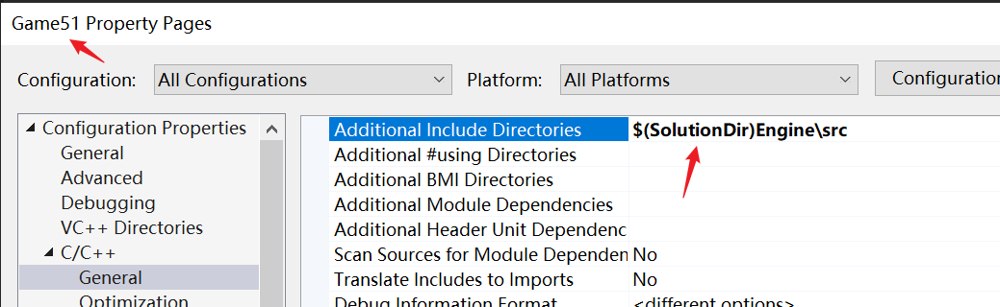  

```cpp
#include <iostream>

//添加头文件-方法3，还要配合项目属性additional include directory
#include "Engine.h" //解决方案内的推荐用""
//#include <Engine.h> //如果是解决方案外的推荐用<> 

int main()
{

	engine::PrintMessage();
	std::cin.get();
}
```

目前编译成功

## 处理链接库

###  方法1
  
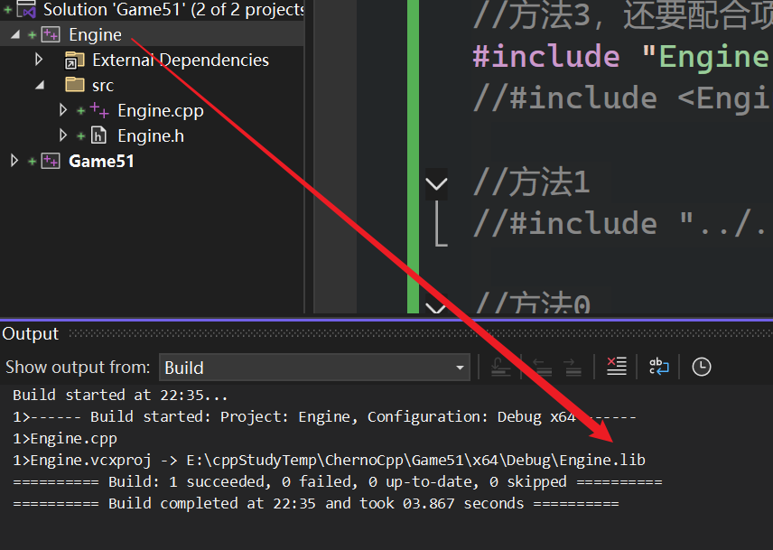  

对Engine项目右键build，然后直接设置静态链接库目录

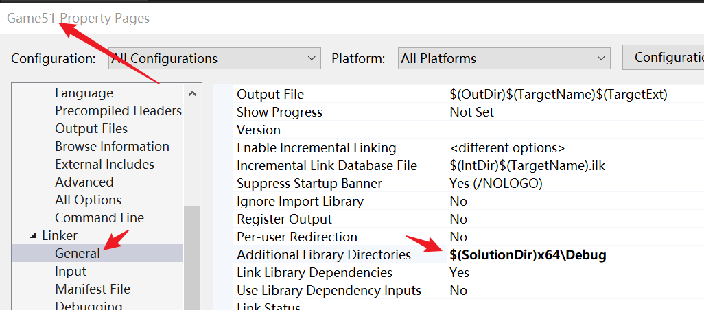  

设置依赖的库文件

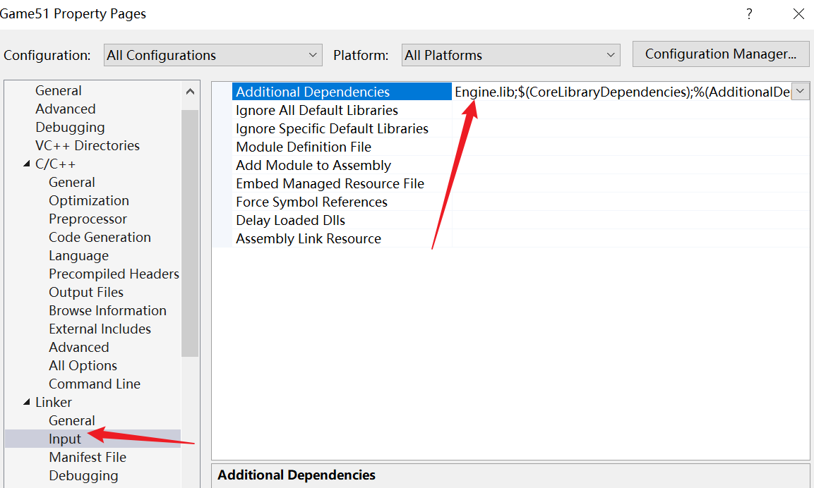  

### 方法2

这两个地方不处理  
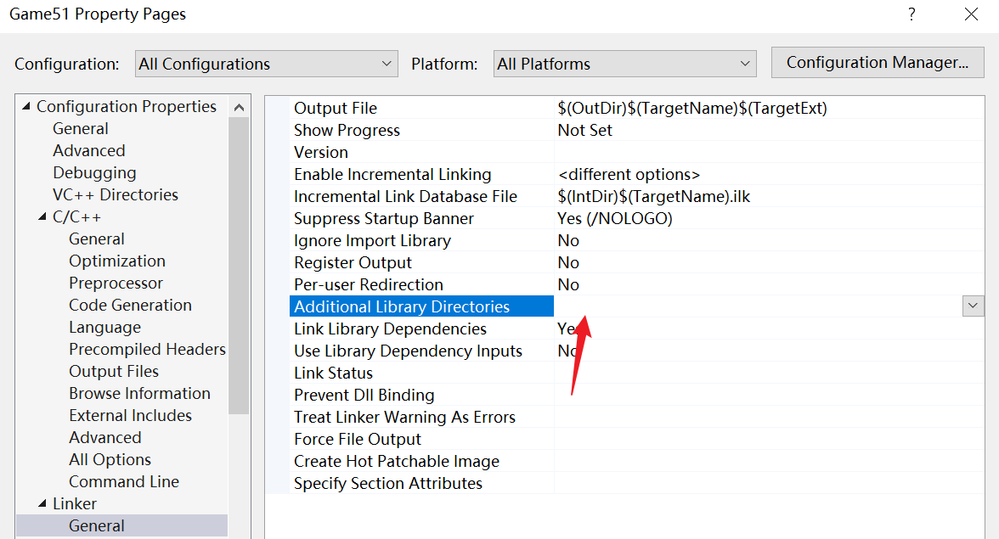  

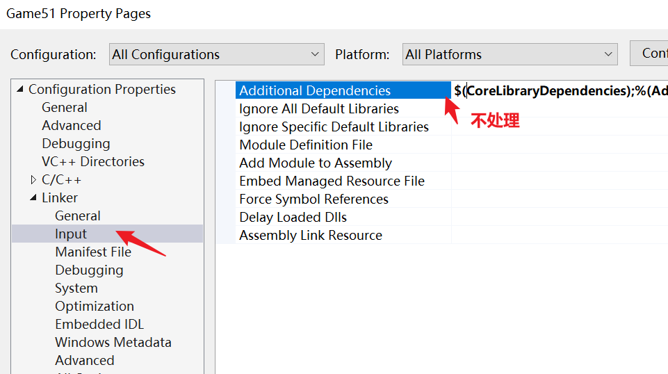  

然后在Game51项目右键Add-Reference  

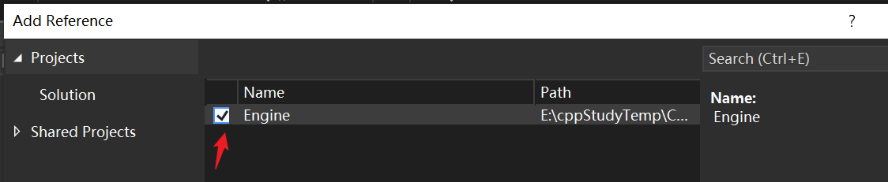  

选中后确定  

现在再build解决方案，就会把库文件链接到我们的可执行文件里，就像我们已经把他添加到链接或输入里了  

好处
- 如果使用方法1，如果Engine的名字改了，那么Engine.lib名称也会改，则需要在Game51项目右键中，修改`AdditionalDependences` 。而此方法2会自动搞定  
- 如果Engine项目内部有变动，我们编译Game项目时， 会先编译Engine，之后再编译Game

这里做了个测试，把项目Engine Clean了，那么此时build 项目Game，则出现  

```cpp
Build started at 23:02...
1>------ Build started: Project: Engine, Configuration: Debug x64 ------
1>Engine.cpp
1>Engine.vcxproj -> E:\cppStudyTemp\ChernoCpp\Game51\x64\Debug\Engine.lib //这里自动编译了Engine,因为Game添加了engine reference
2>------ Build started: Project: Game51, Configuration: Debug x64 ------
2>Game51.vcxproj -> E:\cppStudyTemp\ChernoCpp\Game51\x64\Debug\Game51.exe
========== Build: 2 succeeded, 0 failed, 0 up-to-date, 0 skipped ==========
========== Build completed at 23:02 and took 04.672 seconds ==========
```


# 结束

- 如果把Game.exe直接拖动到任意的其他文件夹，双击依然可以运行，因为它是静态链接Engine  
- 在vs中能有多个项目，很实用。因为如果我们真的在构建一个游戏引擎，我们这个解决方案可能有好几个使用该引擎的示例，或者几个游戏之类的，他们都引用那个引擎文件/殷勤项目，所以我们要对其进行模块化，这样我们就能让所有核心代码都==集中==在一个项目，这样我们的所有示例、可执行文件都与那个集中式项目关联

