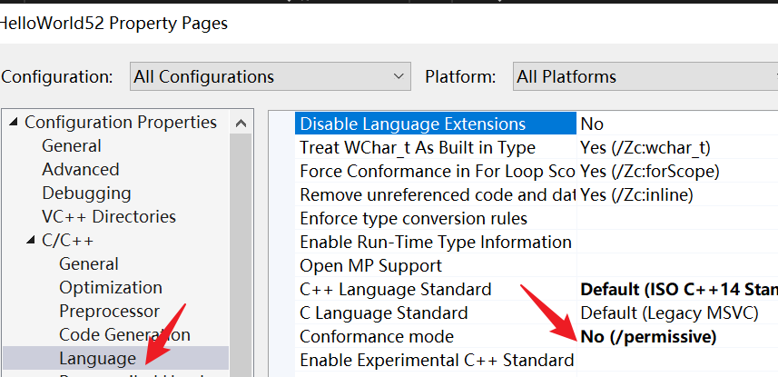

template，能让你定义一个待编译的模版 ~~让编译器用一组规则为你编译代码~~   

> 当我写一个函数时，我在函数中使用一个模板，我实际做的事类似蓝图的东西，当我决定调用那个函数时，==指定一些参数，他们决定了实际放入模板的代码==。

# 简单例子

```cpp
#include <iostream> 

//template表明这是个编译时求值的模板，这不是实际的函数，只有在调用时才会创建并编译成源代码
//可以从实际参数中隐式获取T
template<typename T>
void Print(T value)
{
	std::cout << value << std::endl;
} 
int main()
{
	Print(5);
	//"5.5"被隐式转为const char[4]
	Print("5.5");
	Print(3.7);

	std::cin.get();
}
```

## 额外补充

| 模板定义 | 调用 Print("5.5") 时 T 的类型 | 说明 |
| --- | --- | --- |
| void Print(T value) | const char* | 发生退化。传递的是地址。 |
| void Print(T& value) | const char[4] | 不发生退化。传递的是数组的引用。 |
| void Print(const T& value) | char[4] | 不发生退化。T 本身是 char[4]。 |

```cpp
// 它代表：我只接受一个含有 4个char的数组的“引用”
void Print(const char (&value)[4]) {
    // sizeof(value) == 4
    // 编译器知道这个数组刚好就是 4 个字节
}
```

```cpp
//数组的首地址
void Print(const char* value) {
    // sizeof(value) == 8 (在64位系统上)
    // 编译器不知道这里有 4 个字符
}
```


# 例子2

```cpp
#include <iostream> 

//template表明这是个编译时求值的模板，这不是实际的函数，只有在调用时才会创建并编译成源代码(才会实际创建函数)
//可以从实际参数中隐式获取T
template<typename T>
//和上面一个意思
//template<class T>
void Print(T value)
{
	std::cout << value << std::endl;
}

int main()
{
	//显示指定T
	Print<int>(5);
	//让编译器自己推断T的类型
	Print(5);

	std::cin.get();
}
```

# 例子3

  

==*演示前需要先把 Conformance mode改为 `No(/permissive)`*==  

```cpp
#include <iostream>
#include <string>

//模板只有在实际调用时才会创建
//编译器会根据实际调用情况自动创建函数
template<typename T>
void Print(T value)
{
    // 注意这里是 valu，少了一个 e
    std::cout << valu << std::endl;
}

int main()
{    
    // 只要不在这里写 Print(5); 编译器就不会去检查上面的错误
    //Print(5); //放开注释会提示 error C2065: 'valu': undeclared identifier
    std::cout << "Compiler is happy because Print is never called." << std::endl;
    std::cin.get();
}
```

以上代码编译通过并且可以运行  


# 例子4

```cpp
#include <iostream>
#include <string>
 

//编译器会根据你的模板“蓝图”，为每一个不同的参数生成一份全新的类定义。这个过程被称为模板实例化 (Template Instantiation)。
template<typename T,int N>
class Array
{
private:
	T m_Array[N];
public :
	int GetSize() const
	{
		return N;
	}
};
 
int main()
{
	//int size = 5;
	// 在原生 C++ 中，数组的大小必须是一个常量表
	// 达式 (Constant Expression)，即在编译阶段就能确定的数值。
	//int a[size];//编译不通过

	Array<int,50> array1;
	Array<double,4> array2;
	std::cout << array1.GetSize() << std::endl;
	std::cout << array2.GetSize() << std::endl;

	std::cin.get();
}
```

`Array<int,50>` 和 `Array<double,4>` 在编译阶段会被视为两个完全独立的类型。

编译器会生成类似的伪代码：  

```cpp
// --- 编译器生成的第一个类 ---
class Array_Int_50 {
private:
    int m_Array[50]; // T 被替换为 int, N 被替换为 50
public:
    int GetSize() const {
        return 50; 
    }
};

// --- 编译器生成的第二个类 ---
class Array_Double_4 {
private:
    double m_Array[4]; // T 被替换为 double, N 被替换为 4
public:
    int GetSize() const {
        return 4;
    }
};
```

# 小结

- template，模板，在c++中属于元编程（meta programming）  
- 我们并不是在编写==代码在运行时的行为,而是在编写编译器在编译时实际要做的事情==
- 模板在日志系统很有用，要记录的类型应有尽有
- 用模板实现自动化，让编译器根据你写的规则编写代码
- 不要滥用
 
