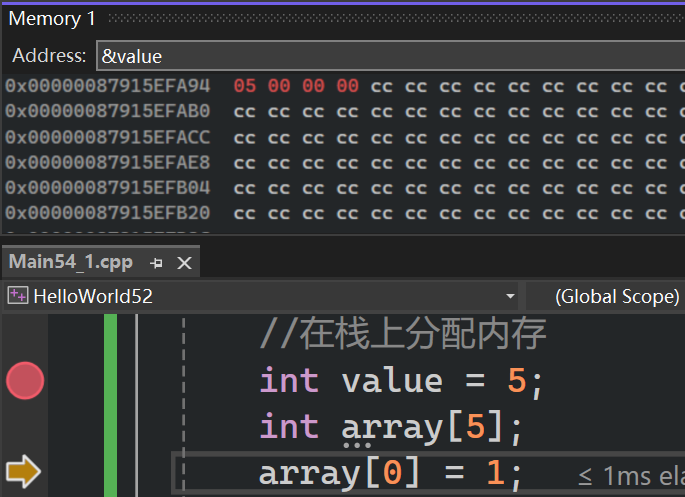
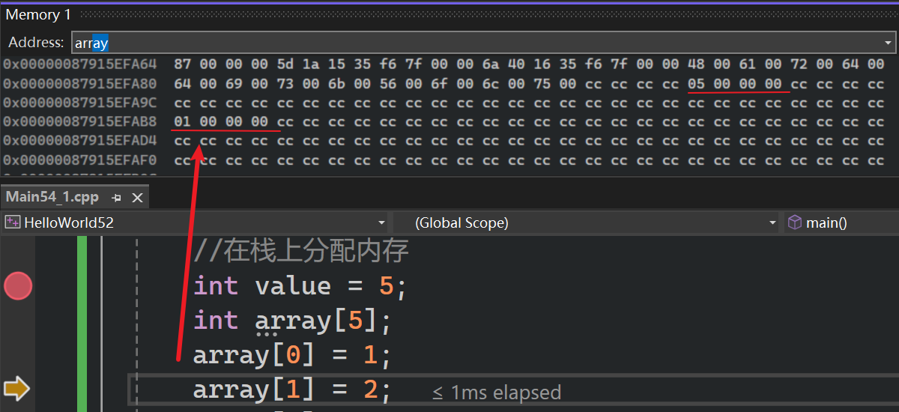
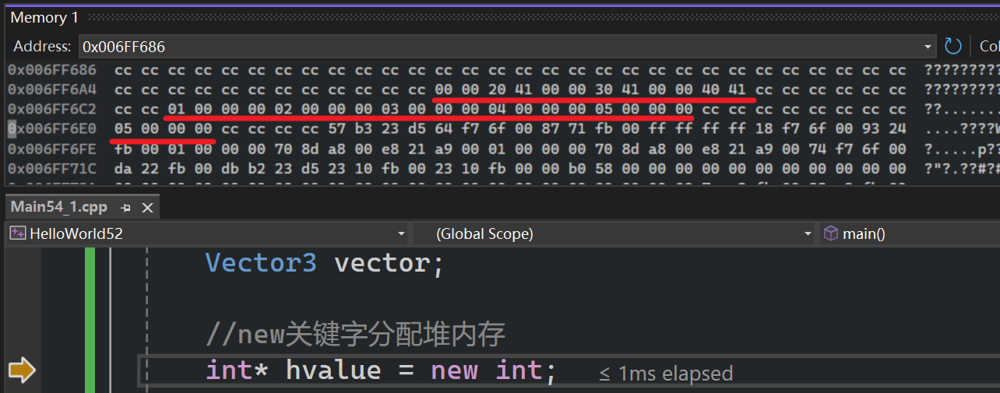
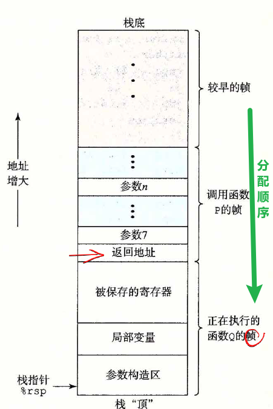
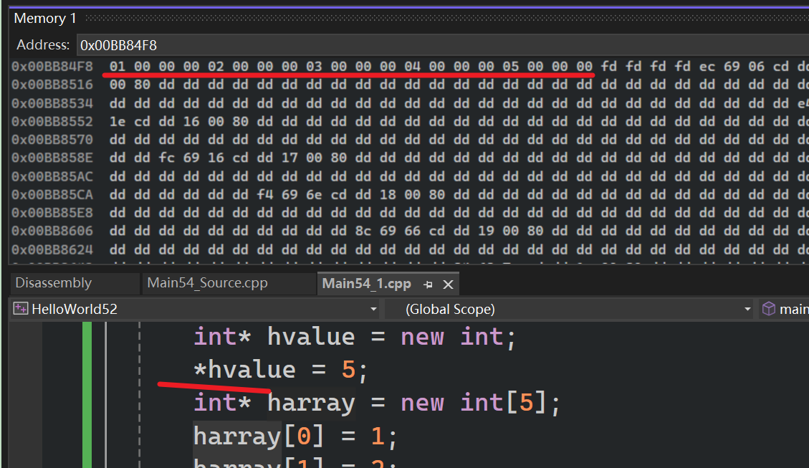
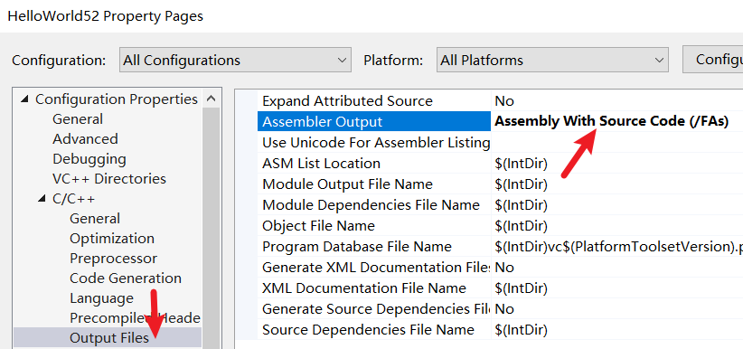

栈和堆何时被使用，为何被使用，以及如何运作  

- 程序运行时，操作系统会把整个程序加载到内存中，同时分配大量物理内存
- 栈和堆是==内存中==实际存在的两个区域
	- 栈具有预定义的大小，通常约2兆字节
	- 堆也有预定义默认值，随着应用程序运行，它会增长变化
	- 我们需要一个地方存储运行程序所需的数据，如局部变量、或者从文件读取数据
- 请求内存，也称内存分配

接下来看看在栈上分配一个整数，和在栈上分配其他数据的差异。与实际c++代码的堆相比  
# 代码

```cpp
#include <iostream>
#include <string>

struct Vector3
{
	float x, y, z;
	Vector3()
		:x(10), y(11), z(12)
	{

	}
};

int main()
{
	{
		//在栈上分配内存
		int value = 5;
		int array[5];
		array[0] = 1;
		array[1] = 2;
		array[2] = 3;
		array[3] = 4;
		array[4] = 5;
		Vector3 vector;

		std::cout << &value << std::endl;
		std::cout << array << std::endl;
		std::cout << &vector << std::endl;
		
	}//作用域结束后，该作用域内栈上分配所有内容都被弹出（内存被释放）
	//在栈上分配内存和释放内存都只是移动栈指针，几乎没有性能损耗

	//new关键字分配堆内存
	int* hvalue = new int;
	*hvalue = 5;
	int* harray = new int[5];
	harray[0] = 1;
	harray[1] = 2;
	harray[2] = 3;
	harray[3] = 4;
	harray[4] = 5;
	//()可以省略
	Vector3* hvector = new Vector3();

	//必须手动释放内存
	delete hvalue;
	delete[] harray;
	delete hvector;

	std::cin.get();
}
```

# 栈
   
  

  

调试模式下，变量之间有一些字节，因为所有变量周围会添加安全防护，以确保不让他们溢出或在错误内存地址访问他们    

  

- 00 00 20 41 $\rightarrow$ 对应 10.0
- 00 00 30 41 $\rightarrow$ 对应 11.0
- 00 00 40 41 $\rightarrow$ 对应 12.0
以上是在x64平台调试时的地址，函数中声明的变量是先放在低地址，再放在高地址  

以下是x86平台调试时，函数中声明的变量是==先放在高地址，再放在低地址==  

  

之前在《深入理解计算机系统》一书中提到栈中先声明的变量是先放在高地址的，这里不知道为啥x86会相反，ai的回答是为了优化调整了顺序  
- x86 的逻辑是“推（Push）”：局部变量是一个个压进去的，所以声明顺序 = 压栈顺序 = 地址递减顺序。
- x64 的逻辑是“填（Fill）”：函数进来先执行 sub rsp, 0x50 挖个大坑。在这个坑里，编译器像是个装修工，它会根据内存对齐需求，从这个坑的“天花板”往“地板”填，或者反过来。
## 解释

*假设以下是先分配高地址，再分配低地址*  

当我们在栈中分配变量时，发生变化的是栈指针，栈顶指针会移动相应字节
- 如果要分配一个int，那么就会把栈顶指针移动4字节
- 如果要分配一个数组，这里是5x4=20，那么就会把栈顶指针移动20字节
- 像栈一样==依次堆叠==，大多数栈实现中栈是向后增长。所以首个值存储在更高的内存地址
- 比如我要分配一个整数，那就把栈指针向后移动4个字节（-4），然后返回该内存地址  
  

```cpp
sub rsp, 4    ; 将栈指针减去 4 (栈向低地址增长，减法代表分配)
mov [rsp], 10 ; 将数值 10 放入刚刚“圈出来”的那块地
```

# 堆

不同变量在内存中地址是无序的，没有先后，更没有相连  

  

当然，同一个数组不同元素间是有序的  

```cpp
//new关键字分配堆内存
	int* hvalue = new int;
	*hvalue = 5;
	int* harray = new int[5];
	harray[0] = 1;
	harray[1] = 2;
	harray[2] = 3;
	harray[3] = 4;
	harray[4] = 5;
	//()可以省略
	Vector3* hvector = new Vector3();

	//必须手动释放内存
	delete hvalue;
	delete[] harray;
	delete hvector;
```

- new实际上只是调用了malloc的函数，转而调用底层操作系统的平台特定函数，并会在堆上分配内存  
- 它实现这一点的方式是，当你启动应用程序时，会给你分配一定量的物理内存，你的程序会维护一个空闲列表，它主要用于跟踪哪些内存块空闲及其位置，以便==当你实际使用malloc请求动态内存（堆内存）时，它能遍历空闲列表，然后找到一个空闲内存块切大小符合需求，然后返回指向该块的指针。之后还会记录一些信息，比如分配的大小、以及它已被分配，并且不能再使用那块内存了==  ~~说明这是个相当繁重的函数~~ ，之后程序员就可以拿回这个指针使用  
	- 如果申请的内存比最初分配的还多，那么程序就要向操作系统申请多些内存，所以存在巨大的潜在成本
# 对比

- 分配方式：在栈上分配内存差不多如一条cpu指令，而在堆上相比有些繁重  
- 栈上分配，内存中彼此相邻，基本可以放入同一条CPU缓存行中
	- 缓存行： 当 CPU 需要内存中的某个数据时，它会一次性把该地址周围的一大块数据（在现代 CPU 上通常是 64 字节）全部加载到自己的 L1/L2 缓存中。这一块 64 字节的数据就叫一个“缓存行”。
	- 情景 A（栈）： 因为变量 $A, B, C, D$ 彼此相邻，当你读取 $A$ 时，CPU 顺便把紧跟在后面的 $B, C, D$ 也一起抓进缓存里了。当你接下来要用 $B$ 时，它已经躺在 CPU 缓存里了，访问速度提升了 10 到 100 倍。这叫 ==空间局部性（Spatial Locality）==。所以说也许请求第一个栈变量之后就不会有==缓存未命中==
	- 情景 B（堆）： 堆分配的对象往往散落在内存的各个角落。读取对象 $A$ 加载了一个缓存行，但里面全是没用的杂质；当你需要对象 $B$ 时，CPU 发现缓存里没有 ~~缓存未命中~~ ，必须再次去缓慢的内存里“跑一趟”。这被称为 ==缓存缺失（Cache Miss）==。
# 查看汇编代码

  

查看`E:\cppStudyTemp\ChernoCpp\HelloWorld52\HelloWorld52\Debug\Main54_1.asm`文件  

## 栈

```cpp

; 16   : 	{
; 17   : 		//在栈上分配内存
; 18   : 		int value = 5;

	mov	DWORD PTR _value$11[ebp], 5 //5移动到具有特定偏移量的栈指针中

; 19   : 		int array[5];
; 20   : 		array[0] = 1;

	mov	eax, 4
	imul	ecx, eax, 0
	mov	DWORD PTR _array$10[ebp+ecx], 1

; 21   : 		array[1] = 2;

	mov	eax, 4
	shl	eax, 0
	mov	DWORD PTR _array$10[ebp+eax], 2

; 22   : 		array[2] = 3;

	mov	eax, 4
	shl	eax, 1
	mov	DWORD PTR _array$10[ebp+eax], 3

; 23   : 		array[3] = 4;

	mov	eax, 4
	imul	ecx, eax, 3
	mov	DWORD PTR _array$10[ebp+ecx], 4

; 24   : 		array[4] = 5;

	mov	eax, 4
	shl	eax, 2
	mov	DWORD PTR _array$10[ebp+eax], 5

; 25   : 		Vector3 vector;

	lea	ecx, DWORD PTR _vector$9[ebp]
	//调用了构造函数
	call	??0Vector3@@QAE@XZ			; Vector3::Vector3
	npad	1
```

## 堆

```cpp
; 34   : 	//new关键字分配堆内存
; 35   : 	int* hvalue = new int;

	push	4
	#这里调用了new运算符
	call	??2@YAPAXI@Z				; operator new 
	add	esp, 4
	mov	DWORD PTR $T8[ebp], eax
	mov	eax, DWORD PTR $T8[ebp]
	mov	DWORD PTR _hvalue$[ebp], eax

; 36   : 	*hvalue = 5;

	mov	eax, DWORD PTR _hvalue$[ebp]
	mov	DWORD PTR [eax], 5

; 37   : 	int* harray = new int[5];

	push	20					; 00000014H
	call	??_U@YAPAXI@Z				; operator new[]
	add	esp, 4
	mov	DWORD PTR $T7[ebp], eax
	mov	eax, DWORD PTR $T7[ebp]
	mov	DWORD PTR _harray$[ebp], eax

; 38   : 	harray[0] = 1;

	mov	eax, 4
	imul	ecx, eax, 0
	mov	edx, DWORD PTR _harray$[ebp]
	mov	DWORD PTR [edx+ecx], 1

; 39   : 	harray[1] = 2;

	mov	eax, 4
	shl	eax, 0
	mov	ecx, DWORD PTR _harray$[ebp]
	mov	DWORD PTR [ecx+eax], 2

; 40   : 	harray[2] = 3;

	mov	eax, 4
	shl	eax, 1
	mov	ecx, DWORD PTR _harray$[ebp]
	mov	DWORD PTR [ecx+eax], 3

; 41   : 	harray[3] = 4;

	mov	eax, 4
	imul	ecx, eax, 3
	mov	edx, DWORD PTR _harray$[ebp]
	mov	DWORD PTR [edx+ecx], 4

; 42   : 	harray[4] = 5;

	mov	eax, 4
	shl	eax, 2
	mov	ecx, DWORD PTR _harray$[ebp]
	mov	DWORD PTR [ecx+eax], 5

; 43   : 	//()可以省略
; 44   : 	Vector3* hvector = new Vector3();

	push	12					; 0000000cH
	call	??2@YAPAXI@Z				; operator new
	add	esp, 4
	mov	DWORD PTR $T5[ebp], eax
	mov	DWORD PTR __$EHRec$[ebp+8], 0
	cmp	DWORD PTR $T5[ebp], 0
	je	SHORT $LN3@main
	mov	ecx, DWORD PTR $T5[ebp]
	call	??0Vector3@@QAE@XZ			; Vector3::Vector3
	mov	DWORD PTR tv153[ebp], eax
	jmp	SHORT $LN4@main
$LN3@main:
	mov	DWORD PTR tv153[ebp], 0
$LN4@main:
	mov	eax, DWORD PTR tv153[ebp]
	mov	DWORD PTR $T6[ebp], eax
	mov	DWORD PTR __$EHRec$[ebp+8], -1
	mov	ecx, DWORD PTR $T6[ebp]
	mov	DWORD PTR _hvector$[ebp], ecx

; 45   : 
; 46   : 	//必须手动释放内存
; 47   : 	delete hvalue;

	mov	eax, DWORD PTR _hvalue$[ebp]
	mov	DWORD PTR $T4[ebp], eax
	push	4
	mov	ecx, DWORD PTR $T4[ebp]
	push	ecx
	call	??3@YAXPAXI@Z				; operator delete
	add	esp, 8

; 48   : 	delete[] harray;

	mov	eax, DWORD PTR _harray$[ebp]
	mov	DWORD PTR $T3[ebp], eax
	mov	ecx, DWORD PTR $T3[ebp]
	push	ecx
	call	??_V@YAXPAX@Z				; operator delete[]
	add	esp, 4

; 49   : 	delete hvector;

	mov	eax, DWORD PTR _hvector$[ebp]
	mov	DWORD PTR $T2[ebp], eax
	push	12					; 0000000cH
	mov	ecx, DWORD PTR $T2[ebp]
	push	ecx
	call	??3@YAXPAXI@Z				; operator delete
	add	esp, 8

```

# 小结

- 尽量尝试在栈上分配，除非放不下栈  
	- 栈：内容连续存储
	- 堆：碎片化存储

