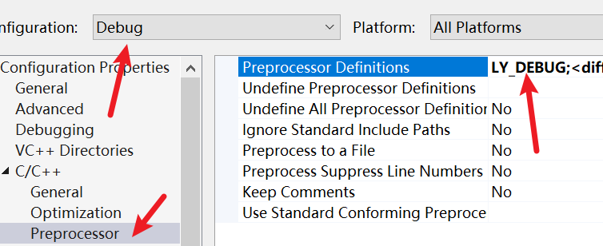
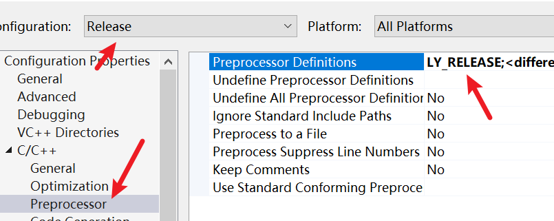
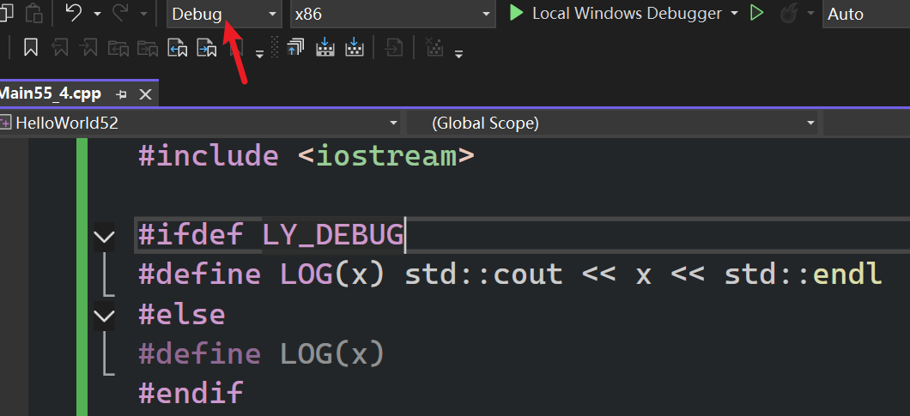
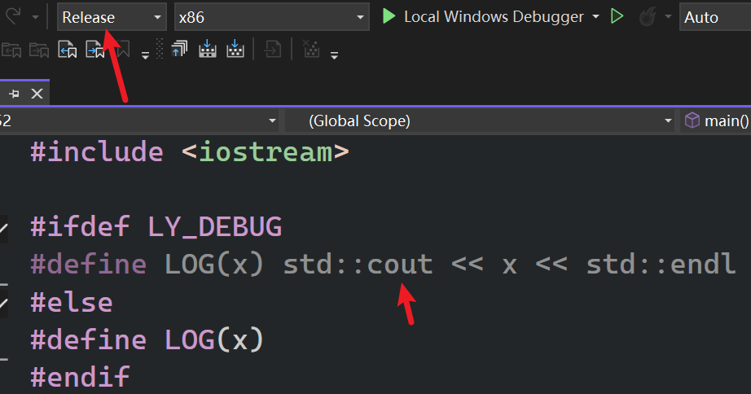
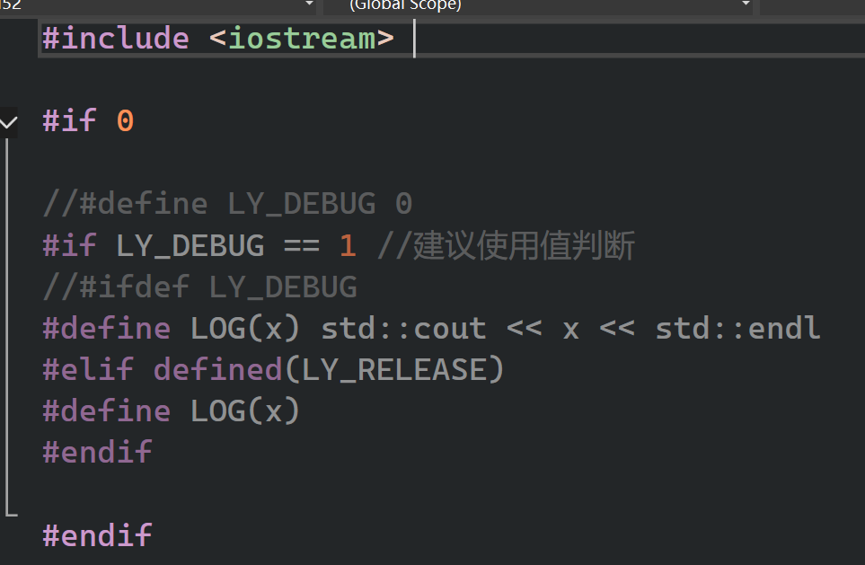

该集只是简单介绍一下  
- 用预处理器对某些操作进行==类似宏处理~~实现自动化~~ ==
- 编译C++程序时，首先要进行预处理器处理
	- 以#开头的都叫做预处理器指令
	- 会被求值，然后处理好。再传递给编译器进行实际编译等操作---文本编辑阶段（可以控制实际输入到编译器的代码）
- 工作阶段：宏是在 预处理（Preprocessing） 阶段处理的。这意味着在编译器真正看到你的代码并进行语法分析之前，宏就已经被处理完毕了。
- 核心功能：宏本质上是 查找与替换（Find and Replace）。预处理器会扫描你的源代码，找到宏的名称，并将其替换为你定义的代码块或值。
- 预处理器（Preprocessor）先处理，模板（Templates）后处理。
	- 预处理器处理完后，编译器再进行模板实例化

- 建议：没有必要频繁的使用高级特性
- 宏是“翻译单元”私有的
	- 在 C++ 编译过程中，每个 .cpp 文件都是独立编译的，这被称为一个翻译单元（Translation Unit）。
	- 如果你想在多个 .cpp 文件中使用同一个宏，你应该把它放在一个头文件（.h）中，然后在需要的 .cpp 文件里`#include`它。

```cpp
#include <iostream>
#include <string>
int main()
{
	//#define在改行代码之后，所以这行编译不过去
	//WAIT;

	#define WAIT std::cin.get()
	//等待从控制台读取一行 
	WAIT;
}
```

代码被预处理器处理后编译器看不出和普通代码有任何区别，我们用宏仅仅是改变了源代码的生成方式  

# 例子1

```cpp
#include <iostream>
#include <string>

//等待从控制台读取一行 
//如果改行末尾带了;分号，也会被替换
#define WAIT std::cin.get()
#define OPEN_CURLY { 
#define SAY_HELLO std::cout << "Hello1" << std::endl

int main()
OPEN_CURLY

	SAY_HELLO;
	WAIT;
}
```

# 例子2

```cpp
#include <iostream>
#include <string>

#define LOG(x) std::cout << x << std::endl

int main()
{

	LOG("Hello");
	std::cin.get();
}
```

# 分别处理调试和正式发布

Debug模式下预处理定义了 LY_DEBUG;  




RELEASE模式下预处理定义了 LY_RELEASE;  

    

先看预览  

  

  

*RELEASE模式下没有打印任何东西*  

## 修正

```cpp
#include <iostream> 

//#define LY_DEBUG 0
#if LY_DEBUG == 1 //建议使用值判断
//#ifdef LY_DEBUG
#define LOG(x) std::cout << x << std::endl
#elif defined(LY_RELEASE)
#define LOG(x)
#endif
int main()
{

	LOG("Hello");
	std::cin.get();
}
```

因为通常是这样：`#define LY_DEBUG` 或者 `#define LY_DEBUG 1` ，如果不需要的时候就可以直接`#define LY_DEBUG 0`而不是注释掉  

修改后还要更改刚才的配置  

# 一些其他用法  

  

使用预处理去除了代码中的一些内容

# 多行

```cpp
#include <iostream>
#include <string>

# define MAIN int main() \
{\
\
	std::cin.get();\
}

MAIN 
```

- 换行前添加反斜杠
- *确保反斜杠之后没有空格*，否则就是在转义空格了，会报错

# 最后的替换系统内的new

```cpp
#include <iostream>
#include <string>

// --- 1. 自定义的内存分配函数 ---
// size 会由 new 运算符自动传入，file 和 line 由宏传入
void* LoggedAllocation(size_t size, const char* file, int line) {
    std::cout << "[Memory Log] 正在分配 " << size << " 字节 | 位置: "
        << file << " | 行号: " << line << std::endl;

    return malloc(size); // 实际调用底层的分配
}

// --- 2. 宏魔法 ---
// __FILE__ 和 __LINE__ 是预处理器的内置宏
// 当你在代码中写 MALLOC(50) 时，它们会被替换为当前文件的路径和当前行号
#define MALLOC(size) LoggedAllocation(size, __FILE__, __LINE__)

// --- 3. 进阶：劫持 new 关键字 ---
// 注意：这种重载 new 的方式通常配合宏来覆盖全局行为
void* operator new(size_t size, const char* file, int line) {
    std::cout << "[New Trace] 分配大小: " << size << " 字节" << std::endl;
    std::cout << "            文件路径: " << file << std::endl;
    std::cout << "            代码行号: " << line << std::endl;
    return malloc(size);
}

// 必须定义匹配的 delete（虽然宏不直接处理 delete 的行号，但语法上需要对应）
void operator delete(void* memory) noexcept {
    free(memory);
}

//这个_DEBUG是visual studio默认添加的定义，目前不知道是在哪，不过可以通过项目配置
//的UndefinePreprocessorDefinitions中添加 _DEBUG 去除定义
// 魔法核心：在 Debug 模式下开启替换
#ifdef _DEBUG
    // 将代码中所有的 "new" 替换为 "new(__FILE__, __LINE__)"
    // 这样编译器会寻找我们上面定义的那个带 3 个参数的 operator new
#define new new(__FILE__, __LINE__)
#endif

class Entity {
public:
    Entity() { std::cout << "Entity 构造成功！" << std::endl; }
};

int main() {
    // 场景 A：使用自定义宏
    void* buffer = MALLOC(100);

    std::cout << "-----------------------------------" << std::endl;

    // 场景 B：由于劫持了 new，这行代码在预处理后会变成：
    // Entity* e = new("C:\\User\\main.cpp", 51) Entity();
    Entity* e = new Entity();

    delete e;
    free(buffer);

    std::cin.get();
}

```

当你写下 new Entity() 时，它被称为 new 表达式 (new expression)。编译器并不会把它简单地看作一个函数调用，而是会将其拆解为两个完全不同的步骤执行：

*第一步：分配原始内存 (Allocation)*  

编译器首先会调用一个名为 operator new 的函数。

- 它的任务： 只负责“找地皮”。它根据对象的大小，在堆（Heap）上申请足够字节的原始内存。
- 返回值： 它返回一个 void* 指针，指向一块未经初始化的、纯粹的“毛坯房”内存。

关联： 这就是你在 Cherno 视频中看到的，我们可以通过宏劫持并重写的部分。

*第二步：初始化对象 (Initialization) —— 关键点*  

一旦第一步成功拿到地址，编译器会立即、自动在那个返回的内存地址上调用 构造函数 (Constructor)。

- 它的任务： 负责“搞装修”。它把原始字节变成一个真正的对象，设置成员变量的初始值。
- 强制性： 这一步是由 C++ 编译器根据 new 表达式 的语法规则强行插入的代码，你无法通过简单的宏替换来跳过这一步（除非你完全不用 new 这个词）。

例子  
```cpp
// 1. 模拟第一步：分配内存（拿到 void*，此时没有调用构造函数）
void* memory = operator new(sizeof(Entity)); 

// 2. 模拟第二步：手动在已有内存上构造（这叫 Placement New）
Entity* e = new(memory) Entity();
```