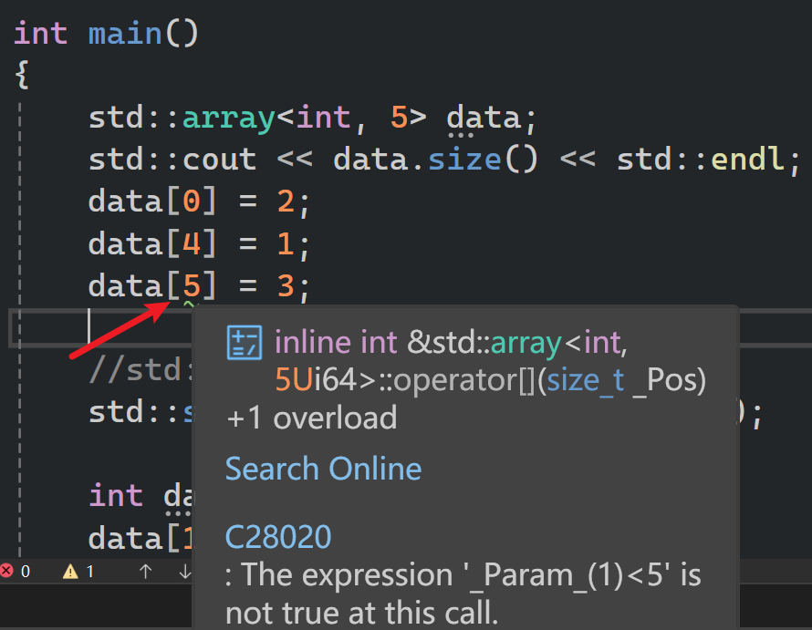
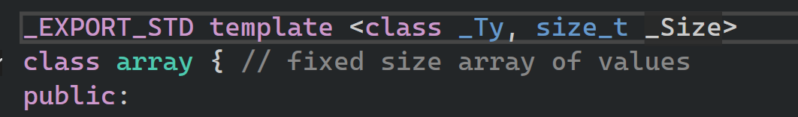
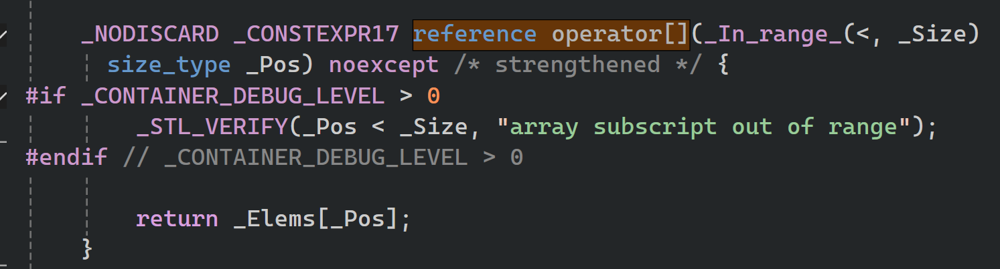
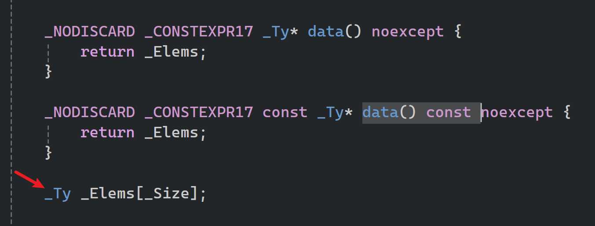
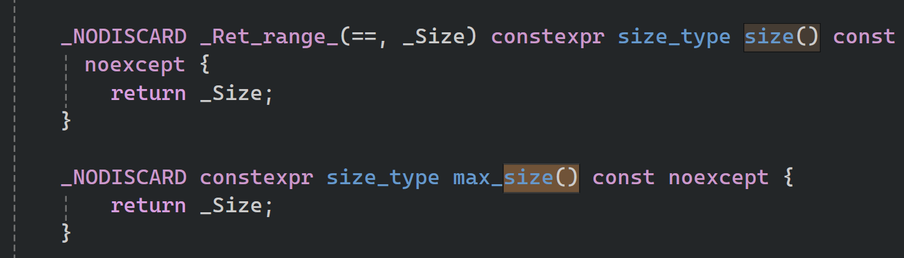

- 本篇讲解==std::array==，c++标准模板库中的标准数组类  
- 这是==静态==数组，所谓的静态，即不会扩容缩小，数组一旦创建就要定义大小 ~~和`std::vector`不同~~  、元素类型。

```cpp
#include <iostream>
#include <array>
#include <algorithm>

void PrintArray1(int* array, unsigned int size)
{
	for (int i = 0; i < size;)
	{

	}
}

//如果不知道数组大小，使用模板。让编译器自己推断
template<size_t N>
void PrintArray(const std::array<int, N>& data)
{
	// 在这里，N 会根据传入的数组自动推导
	for (size_t i = 0; i < data.size(); i++)
	{
		std::cout << data[i] << std::endl;
	}
}

void PrintArray(const std::array<int,5>& data)
{
	for (int i = 0; i < data.size();)
	{

	}
}

int main()
{
	std::array<int, 5> data;
	std::cout << data.size() << std::endl;
	data[0] = 2;
	data[4] = 1;
	//data[5] = 3;

	//std::array能使用迭代器
	std::sort(data.begin(), data.end());

	int data2[5];
	data[1] = 3;
}
```

- 标准数组和普通数组，都是存放在栈上 ~~标准向量是在堆上~~ 
- 有警告  
    
# `data.size()`如何得知大小

`std::array` 的大小（即数字 5）并不存储在程序运行时的内存里，是通过模板推导和常量替换实现的。  

`std::array`源代码大概是：  

```cpp
template<typename T, size_t N>
class array {
public:
    // 注意这个 constexpr，它告诉编译器这是一个编译时常量
    constexpr size_t size() const noexcept {
        return N; // N 就是你定义时的那个 5
    }
};
```

当你写下 data.size() 时：

- 匹配模板：编译器知道 data 的类型是 std::array<int, 5>，也就是其中的 N 等于 5。
- 内联替换：编译器在编译你的代码时，会直接把 data.size() 删掉，把 5 填进去。

所以，在最终生成的机器码里，根本没有“调用函数”的过程，只有数字 5。  

## constexpr 

- constexpr 是 “Compile-time Constant” 的缩写，意思是 “编译时常量”。
- 它告诉编译器：如果参数是常量，请直接把函数的计算结果填在生成的机器码里。

```cpp
constexpr int Square(int x) {
    return x * x;
}

int main() {
    // 编译器在编译时就直接把 25 写进去了
    // 运行的时候根本不需要调用 Square 函数
    int array[Square(5)]; 
}
```

# `std::array` 源文件部分分析 

- 两个参数，一个是类型，一个是大小   
    

- 达到级别时才会提示报错 
  
- 底层实际存储类型和大小
    
- 关于size，即会直接返回5
    

