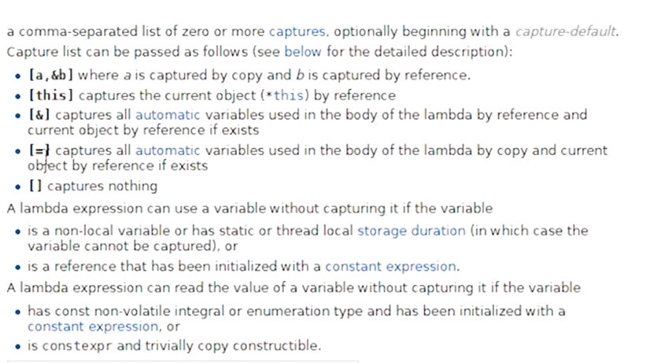

本篇聊聊==来自C语言的那种原始风格函数指针==，后续会讲C++处理函数指针的方法，以及lambda表达式    

- 函数指针，是一种把==函数赋给变量==的方式
- 函数只是个符号，并不能进行任何逻辑计算，但是可以拿来调用
- 可以接受传参，如果返回非void可以得到相应结果
- 函数可以赋值给变量，函数也可以作为参数传递给其他函数
- 函数是cpu指令，存储在我们的二进制文件中的某处
- `auto function = HelloWorld;`，获取cpu指令的内存地址并赋值给function

# 58_59函数指针、lambda表达式

```cpp
#include <iostream>  

void HelloWorld()
{
	std::cout << "HelloWorld!" << std::endl;
}

int main()
{
	//function的类型->void (*function)()
	auto function1 = &HelloWorld;
	//&可以省略，因为有隐式转换
	auto function = HelloWorld;
	//相当于
	void (*function2)() = HelloWorld;

	function();
	(*function)();
	function1();
	(*function1)();
	function2();
	(*function2)();
	std::cin.get();
}
```

## 隐式转换

1. 为什么不需要 &？
当你直接使用函数名 HelloWorld 时，编译器会将其视为该函数在内存中的起始地址。

- auto function = HelloWorld;：编译器看到函数名，自动将其转换为函数指针。
- auto function = &HelloWorld;：显式地取函数地址。

这两行代码生成的机器码通常是完全一样的。

2. 只有一种情况“必须”注意
虽然对于普通函数两者等价，但在处理类成员函数 (Member Functions) 时，规则会变严：

- 普通函数： & 可选。
- 类成员函数： 必须使用 & 并且加上类名限定。

例如：auto func = &MyClass::MemberFunction;（这里不能省略 &）。

# 重载与函数指针

```cpp
#include <iostream>  

void HelloWorld()
{
	std::cout << "HelloWorld!" << std::endl;
} 


void HelloWorld(int a)
{
	std::cout << "HelloWorld!value: " << a << std::endl;
}

int main()
{ 

	//使用别名
	typedef void(*HelloWorldFunction)();
	//声明并赋值
	HelloWorldFunction function = HelloWorld;
	function();

	//使用别名
	typedef void(*HelloWorld1Function)(int);
	//声明并赋值
	HelloWorld1Function function1 = HelloWorld;
	function1(3);


	std::cin.get();
}
```

==重载决议（Overload Resolution）==与函数指针的匹配。

在你的代码中，有两个同名的 HelloWorld 函数，但编译器并没有感到困惑。

1. 编译器是如何“选对”函数的？
虽然两个函数都叫 HelloWorld，但它们的**函数签名（Signature）**不同：

- 一个是 void()
- 一个是 void(int)

当你进行赋值操作时：

分析： 编译器会根据你定义的函数指针类型，自动去重载列表中寻找那个“长得一模一样”的函数。如果没有找到完全匹配的（例如参数类型对不上），编译器就会直接报错。

2. 这里的底层逻辑
在 C++ 中，函数名不仅仅是一个地址，它还是一个==重载集（Overload Set）==。
- 当你直接调用 HelloWorld() 时，编译器根据括号里的参数选函数。
- 当你赋值给指针时，编译器根据指针的声明类型选函数。

3. 注意点：不要让编译器“猜”
有些情况下，编译器会因为无法判断你想选哪个而报错。 例如，如果你使用 auto：

- 修正： 如果非要用 auto 处理重载函数，你必须显式进行类型转换（Static Cast），明确告诉编译器你要哪一个

## 重载决议

当你写下 HelloWorld 这个名字时，由于你定义了两个版本，这个名字就代表了一个重载集合 (Overload Set)。

当你尝试将它赋值给指针，或者直接调用它时，编译器会启动“重载决议”程序，分为三步：

- 候选函数 (Candidate Functions)：找到所有名字叫 HelloWorld 的函数。
- 可行函数 (Viable Functions)：从候选函数中，剔除掉那些参数个数不对、或者类型完全无法转换的函数。
- 最佳匹配 (Best Viable Function)：在剩下的函数中，寻找匹配程度最高的那个。如果此时还有两个函数“不相上下”，编译器就会报 Ambiguous（歧义） 错误。

# 作为回调

```cpp
#include <iostream>
#include <vector>

void PrintValue(int value)
{
	std::cout << "Value: " << value << std::endl;
}

//func：函数指针
void ForEach(const std::vector<int>& values, void(*func)(int))
{
	for (int value : values)
	{
		func(value);
	}
}

int main()
{
	std::vector<int> values = { 1,4,3,2,5 };
	ForEach(values, PrintValue);
	std::cout << "===" << std::endl;

	//使用lambda表达式，下一集会详细讲解
	//ForEach接收一个函数，该函数只有一个参数
	ForEach(values, [](int value)
		{
			std::cout << value << std::endl;
		}
	);


	std::cin.get();
}
```


# lambda表达式

- lambda本质上是一种定义==匿名==函数的方式，而无需实际创建一个匿名函数  
- 认同临时的一次性函数
- 把它当做一个非固定的 ~~变动的非固定的，不是普通的~~ ，而非一个在==实际编译代码==中作为符号存在的实际函数
- 只要是需要用到函数指针就能用lambda，指定将来某个时候要运行的代码

## 代码

```cpp
#include <iostream>
#include <vector> 
#include <functional>
 
//func：函数指针
void ForEach(const std::vector<int>& values, void(*func)(int))
{
	for (int value : values)
	{
		func(value);
	}
}

//const std::function<void(int)>&
// 对 std::function 对象的常引用
void ForEach1(const std::vector<int>& values, const std::function<void(int)>& func)
{
	for (int value : values)
	{
		func(value);
	}
}

int main()
{
	std::vector<int> values = { 1,4,3,2,5 };

	int a = 5;

	//推荐网址：http://cn.cppreference.com/w/cpp/language/lambda.html   
	//可以按值传递a，或者按引用传入a
	//类型->void(*lambda)(int)
	auto lambda = [](int value) { std::cout << "Value:" << value << std::endl; };
	ForEach(values, lambda);

	//C++ 中的 Lambda 表达式在底层会被编译器翻译成一个匿名的结构体（或类）：
	//无捕获的 Lambda[]：它不依赖外部环境，可以被视为一个纯粹的函数。C++ 标准规定，不带捕获的 Lambda 可以隐式转换为普通的函数指针。
	//有捕获的 Lambda[=] 或[&]：它需要存储外部变量的状态。编译器生成的对应类中会有成员变量来保存这些捕获的值。
	auto lambda1 = [=](int value) mutable { a = 3; std::cout << "Value:" << value << std::endl; };
	//mutable 关键字的作用是允许你在 Lambda 内部修改以值捕获（by value）的变量。
	
	//ForEach(values, lambda1);//编译不通过
	ForEach1(values, lambda1);//编译通过


	std::cin.get();
}
```

`void ForEach1(const std::vector<int>& values, const std::function<void(int)>& func)` 代码解释：  

- `std::function<void(int)>`：这是一个类模板。它定义了一个可以接收一个 int 参数且不返回任何值`（void）`的可调用实体。
- `&`：表示引用（Reference）。这意味着在调用 ForEach 时，不会在内存中为这个复杂的包装器创建一个全新的副本，而是直接指向调用者提供的那个对象。
- const：表示不可变（Const）。保证在 ForEach 函数内部，你只能调用这个函数，而不能把这个包装器重新指向另一个函数。
### 捕获参数  

`[]` 被称为 捕获列表 (Capture List)。它是 Lambda 的引出符，用来指定该匿名函数可以访问外部作用域中的哪些变量。

  

- `[a,&b]`  a按值捕获，b按引用捕获
- `[&]`按引用捕获全部
- `=` 按值捕获全部
- `[this]` 捕获当前类对象。允许在成员函数中使用类成员

### 有无捕获列表的区别

`ForEach(values, lambda1);` 编译不通过的原因  

C++ 中的 Lambda 表达式在底层会被编译器翻译成一个匿名的结构体（或类）：
- 无捕获的 `Lambda[]`：它不依赖外部环境，可以被视为一个纯粹的函数。C++ 标准规定，不带捕获的 Lambda 可以隐式转换为普通的函数指针。
- 有捕获的 `Lambda[=]` 或`[&]`：它需要存储外部变量的状态。编译器生成的对应类中会有成员变量来保存这些捕获的值。
## mutable

默认情况下，Lambda 表达式生成的 `operator() 是 const` ~~比如下面的代码块例子~~  的。这意味着，如果你通过 `[=]` 捕获了一个变量，你在 Lambda 函数体内部只能读取它，不能修改它。

- 如果不加 mutable：编译器会报错，提示你正在尝试修改只读变量。
- 如果加上 mutable：它取消了 Lambda 调用操作符的 const 限制。

前面还讲了mutable，复习一下  
```cpp
class Tester {
    mutable int accessCount = 0;
public:
    void getData() const { // 注意这里是 const 函数
        accessCount++;     // 合法，因为有 mutable
    }
};
```

lambda表达式除了加`mutable`，还可以加`constexpr`，表示允许你在编译期（Compile-time）计算该 Lambda 的结果。  


## 代码2

```cpp
#include <iostream>
#include <vector>  
#include <algorithm>


int main()
{
	std::vector<int> values = { 1,5,4,3,2,5 };

	//it是一个迭代器 -> std::vector<int>::iterator
	auto it = std::find_if(values.begin(), values.end(), [](int value) {return value > 3; });

	std::cout << *it << std::endl;//5


	std::cin.get();
}
```

### 分析

1. 算法部分：`std::find_if`
这是一个标准算法（需要包含 `<algorithm>` 头文件）。

- 参数 `1 & 2` `(values.begin(), values.end())`：指定查找的范围（==左闭右开==区间）。它会从头到尾遍历整个容器。
- 参数 3 (Lambda 表达式)：这是一个==谓词（Predicate）==。find_if 会对范围内的每个元素执行这个判断，直到找到第一个让该判断返回 true 的元素为止。

> 谓词就是一个返回布尔值（true 或 false）的可调用对象  
> begin指向容器中的第一个元素；end指向容器最后一个元素之后的那个“虚拟”位置。

2. 核心逻辑：Lambda 表达式
[](int value) { return value > 3; }

- `[]`：不捕获任何外部变量。
- (int value)：参数列表。遍历过程中，容器里的每个元素都会被依次传给这个 value。
- return value > 3：查找条件。只要当前数字大于 3，Lambda 就会返回 true，算法随之停止查找。

3. 返回值：auto it
std::find_if 返回的是一个迭代器（Iterator）。

- 如果找到了：it 指向第一个符合条件的元素。你可以通过 `*it` 来获取这个值。
- 如果没找到：it 会等于 values.end()。