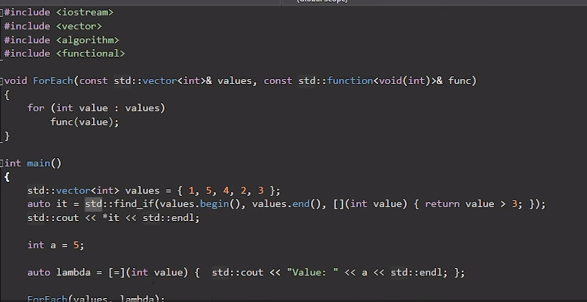
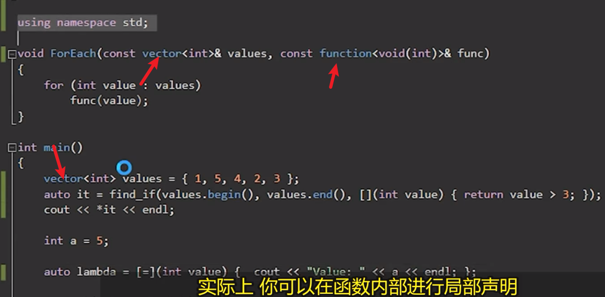
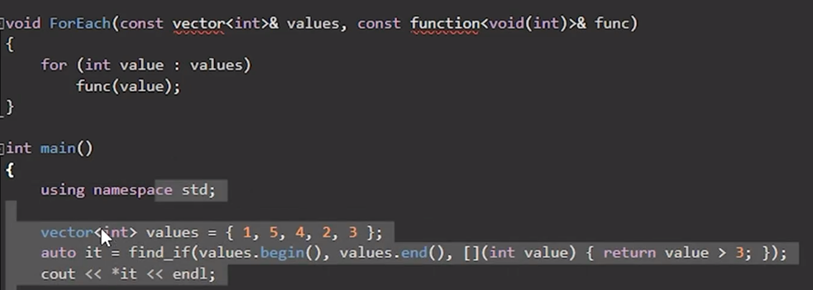

# 例子



代码简化  

  

也可以只在函数内部（或者其他作用域）声明  

  

但是有个缺点，没法直接判断vector是哪来的，==标准的？还是自己写的==。  

# 代码示例

```cpp
#include <iostream> 
#include <string>

namespace apple {
	void print(const std::string& text)
	{
		std::cout << text << std::endl;
	}
}

namespace orange {
	void print(const char* text)
	{
		std::string temp = text;
		std::reverse(temp.begin(), temp.end());
		std::cout << temp << std::endl;
	}
}

using namespace apple;
using namespace orange;

int main()
{
	//::  这个是作用域解析运算符  
	apple::print("Hello");

	//寻找更为匹配的 orange::print
	print("hello");
	/*
Hello
olleh
	*/


	std::cin.get();
}
```

# 建议

- 任何时候都不要在头文件(xx.h)里面放入`using namespace xx;`，因为没人知道它会被include到哪里
- 尽量只有自己的库才用它
- 尽量在更小的作用域内使用 ~~if、函数、最多是在文件~~ 