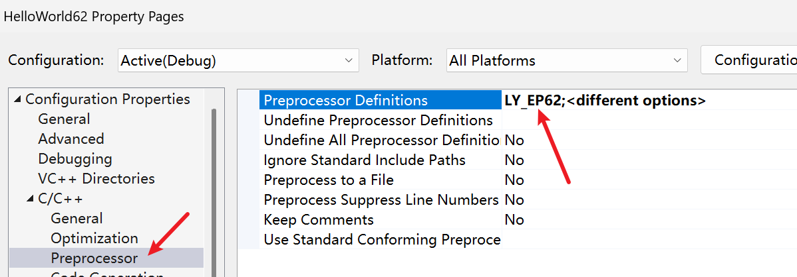

- `std::cin.get()` *等待用户输入的那段时间*，什么也做不了。此时就可以在后台开另一个线程做其他事

从这篇开始，代码都会写在同一个项目中，使用`Mainxx_yy.cpp`的类似名字。由于同一个项目有多个main函数（同一篇都好几个），所以文件最顶端添加宏进行判断，visual studio中对项目配置如下  
  


# 函数声明与类创建`[区别]`

```cpp
#ifdef LY_EP62

#include <iostream>
#include <thread>

class Test
{
public:
	Test()
	{
		std::cout << "Test()" << std::endl;
	}

	Test(int k)
	{
		std::cout << "Test(int)" << std::endl;
	}
};
void DoWork()
{

}

int main()
{
	//声明一个类Test的对象
	Test t{};

	// 这是一个函数声明，声明一个函数名
	// 为 t1，没有参数，返回类型
	// 是 Test
	Test t1();

	// 这是一个函数声明，声明一个函数名
	// 为 worker，没有参数，返回类型
	// 是 int
	std::thread worker1();
	
	//声明一个线程对象
	std::thread worker2{};

	//创建线程并立即启动DoWork内的操作
	std::thread worker(DoWork);
	worker.join();

	std::cin.get();
}
#endif
```

# 线程简单例子

```cpp
#ifdef LY_EP62

#include <iostream>
#include <thread>
 
void DoWork()
{

}

int main()
{
	// 这是一个函数声明，声明一个函数名
	// 为 worker，没有参数，返回类型
	// 是 int
	std::thread worker1();

	//创建的是一个“空”线程对象，内部没有关联
	// 任何实际的执行函数，也不启动线程
	std::thread worker2{};

	//创建线程并立即启动DoWork内的操作
	std::thread worker(DoWork);

	//...启动->到join这期间的代码并
	//不会阻塞

	//主线程会等待
	//主线程会停在 join() 这一行，像在车站等
	// 朋友一样，直到子线程这辆车“到站”并合
	// 二为一，主线程才会继续往下走。
	worker.join();

	//子线程完成前不会执行该行代码
	std::cin.get();
}
#endif
```

- join的作用：让当前线程（通常是主线程）停下来，进入阻塞状态，直到子线程执行完毕为止。
- 主线程启动一个工作线程，工作线程执行任务，然后在主线程上等待工作线程完成所有任务

# 子线程无限循环

```cpp
#ifdef LY_EP62

#include <iostream>
#include <thread>

void DoWork()
{
	while (true)
	{
		std::cout << "working..." << std::endl;
	}
}

int main()
{ 
	std::thread worker(DoWork); 

	worker.join();

	//子线程完成前不会执行该行代码
	std::cin.get();
}
#endif
```

# 阻止无限循环

```cpp
#ifdef LY_EP62

#include <iostream>
#include <thread>

// 显式包含时间库
//cherno视频里没有却能运行，可能是有些编译器中，
// <thread> 头文件为了实现 sleep_for 等功能，
// 其内部已经写了 #include <chrono>。(ai回答)
#include <chrono> 

static bool s_Finished = false;

void DoWork()
{ 
	using namespace std::literals::chrono_literals;
	while (!s_Finished)
	{
		std::cout << "working..." << std::endl;
		std::this_thread::sleep_for(1s);
	}
}

int main()
{
	std::thread worker(DoWork);

	//主线程自己阻塞自己了
	std::cin.get();
	//用户按下回车后
	s_Finished=true;

	//按下回车后，子线程或许刚进入
	//while语句块{ ，且还没到达打印语句
	//所以可能子线程要再打印一行，之后下
	//一次循环才不会进入


	worker.join();
	std::cout << "===child thread finished~~==" << std::endl;

	//子线程完成前不会执行该行代码
	std::cin.get();
}
#endif
/* 输出
working...
working...
working...
working...
working...
		 //这就是用户按下的回车行
working...
===child thread over~==

*/
```

子线程配合join可以用来做==清理==工作，主线程等待子线程清理完毕后再退出或执行某些操作  

