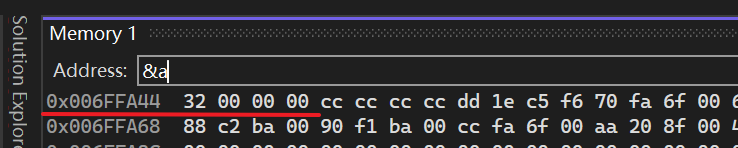
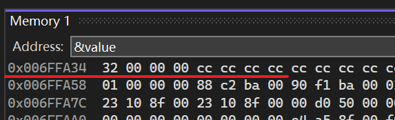
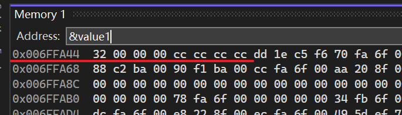
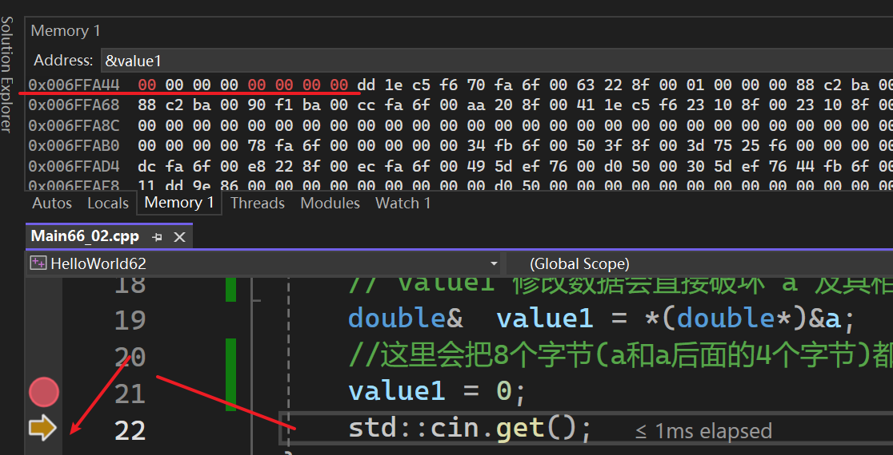

- 类型双关指的是，C++绕过类型系统的一种方式，C++是强类型语言，不会把所有东西都设置为auto（可以，但不推荐）  
- C++中类型在一定程度上==由编译器强制限定==，但你可以==直接访问内存==
- 本章节实例会访问某个int数值的内存，并把它当做双精度数来处理（轻易绕过类型系统）
	- 假设有一个类（基本类型结构体），我们想把它写成字节流，它没有其他指针指向它，那么我们可以直接解释整个结构体、类、或者其他东西，这里会视为字节数组：只要我们知道任何大小，就可以直接访问数据 
# 转换

```cpp
#ifdef LY_EP66
#include <iostream>

int main()
{ 
	//小端法，低字节的数据存储在内存的低地址处，
	// 高字节的数据存储在内存的高地址处
	//Ox00000032
	int a = 50;// 32 00 00 00 
	 
	//隐式转换，a隐式转换成了double类型
	//相当于 double value =(double)a
	//Ox404900000000000000，double数值50
	//的16进制表示为0x4049000000000000
	double value = a;// 00 00 00 00 00 00 49 40 
	std::cout << value << std::endl;

	std::cin.get();
}
#endif
```

==转换后内存中的数值变了==

# 类型双关-不同方式读取同一内存

```cpp
#ifdef LY_EP66
#include <iostream>

int main()
{
	int a = 50;
	//把a(内存处）的内存以double类型的方式进行访问
	//将整型进行类型双关变成双精度型
	//* 操作符会尝试从该地址开始，一口气往后读 8 个字节，这里是
	//32 00 00 00 cc cc cc cc （小端法）
	double  value = *(double*)&a;
	std::cout << a << std::endl;
	std::cout << value << std::endl;

	//不想创建全新变量，只是想把这个整数当成双精度数来访问，
	//那么可以在这个双精度数后面加&，这样就能引用他
	//强行让 value1 成为 &a 处那块 8 字节内存的别名。通过
	// value1 修改数据会直接破坏 a 及其相邻内存。
	double&  value1 = *(double*)&a;
	//这里会把8个字节(a和a后面的4个字节)都写入0
	value1 = 0;
	std::cin.get();
}
#endif
```

  

value在新的内存地址上：  

  

  

跳到下一步把value1改了  

  

# 类型双关-不同方式解释内存

```cpp
#ifdef LY_EP66
#include <iostream>

struct Entity
{
	int x, y;
	 
	int* GetPosition()
	{
		//替换了复制的写法
		/*int* array = new int[2];
		array[0] = x; 
		array[1] = y;*/
		return &x;
	}
};

struct EmptyStr
{

};

int main()
{
	//聚合初始化（Aggregate Initialization）机制
	Entity e = { 5,8 };//05 00 00 00 08 00 00 00 
	Entity e1 = { 5 };//05 00 00 00 00 00 00 00
	Entity e2 = {};//00 00 00 00 00 00 00 00
	EmptyStr es = {};//00 空结构体但是也占用了一个字节

	int  x1 = e.x;

	//指针形式的原始地址
	//这是一个：指向一个整数的指针
	int* position = (int*)&e;

	std::cout << position[0] << "," << position[1] << std::endl;

	int y1 = e.y;

	// 1. (char*)&e: 
	// 将 e 的首地址强制看作 char* 指针。
	// 意义：因为 char 占用 1 字节，这能让指针的“步长”变为 1 字节，方便我们进行精确的地址加减。
	// 2. + 4: 
	// 在 char* 的基础上移动 4 个单位。
	// 意义：因为步长是 1，所以这里实际上是向后偏移了 4 个字节，跳过了第一个成员 x。
	// 3. (int*): 
	// 将偏移后的新地址再次强制转换回 int*。
	// 意义：告诉编译器：“从这个位置开始，请用 int 的滤镜来看待这块内存”。
	// 4. *: 
	// 对 int* 进行解引用。
	// 意义：从当前偏移后的地址起，一口气读取 4 个字节，并将其作为整数赋值给 y。
	int y = *(int*)((char*)&e + 4);

	std::cout << y << std::endl;

	//得到一个有两个元素的实际整型数组
	int* position1 = e.GetPosition();
	std::cout << position1[0] << std::endl;
	std::cout << position1[1] << std::endl;

	std::cin.get();
}
#endif
```

- 通过重新解释内存，实现了“类型转换”  
- 把那个类型当做指针，然后将其转换为另一个指针，之后如有必要 解引用并处理它就行

