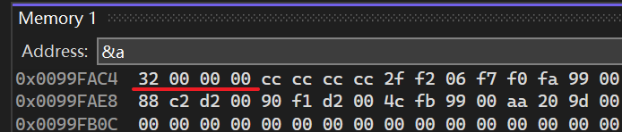
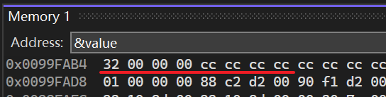

- 类型双关指的是，C++绕过类型系统的一种方式，C++是强类型语言，不会把所有东西都设置为auto（可以，但不推荐）  
- C++中类型在一定程度上==由编译器强制限定==，但你可以==直接访问内存==
- 本章节实例会访问某个int数值的内存，并把它当做双精度数来处理（轻易绕过类型系统）
	- 假设有一个类（基本类型结构体），我们想把它写成字节流，它没有其他指针指向它，那么我们可以直接解释整个结构体、类、或者其他东西，这里会视为字节数组：只要我们知道任何大小，就可以直接访问数据 
# 转换

```cpp
#ifdef LY_EP66
#include <iostream>

int main()
{ 
	//小端法，低字节的数据存储在内存的低地址处，
	// 高字节的数据存储在内存的高地址处
	//Ox00000032
	int a = 50;// 32 00 00 00 
	 
	//隐式转换，a隐式转换成了double类型
	//相当于 double value =(double)a
	//Ox404900000000000000，double数值50
	//的16进制表示为0x4049000000000000
	double value = a;// 00 00 00 00 00 00 49 40 
	std::cout << value << std::endl;

	std::cin.get();
}
#endif
```

==转换后内存中的数值变了==

# 类型双关-不同方式读取同一内存

```cpp
#ifdef LY_EP66
#include <iostream>

int main()
{
	int a = 50;
	//把a(内存处）的内存以double类型的方式进行访问
	//将整型进行类型双关变成双精度型
	//* 操作符会尝试从该地址开始，一口气往后读 8 个字节
	double  value = *(double*)&a;
	std::cin.get();
}
#endif
```

  

  


