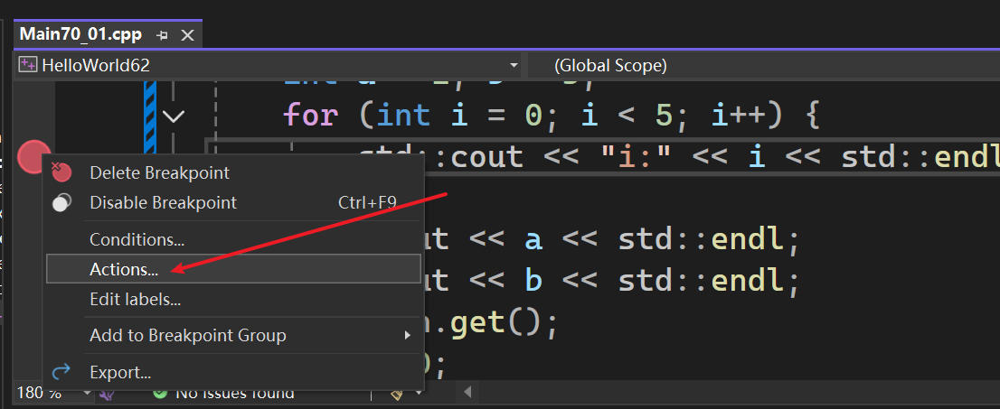
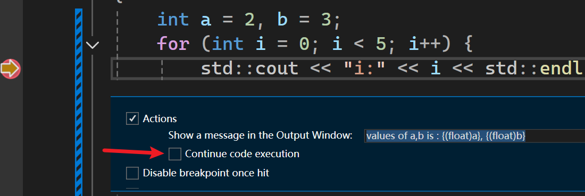
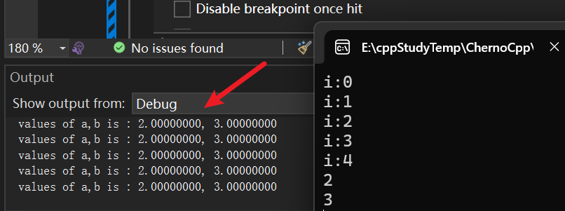

- 本节介绍visual studio 快速小技巧，也是一个适用于开发和调试的通用技巧，围绕断点展开
- 围绕条件展开，以及一些可应用于断点的操作
	- 条件断点 ~~断点在特定条件下触发~~ 
	- 动作断点 ~~断点触发时进行一些操作在控制台打印内容并继续/或暂停执行程序~~ 

断点在代码里也可以实现
- 写if语句并（手动）设置断点 ~~也可以直接`debug break;`之类的编译器内部函数~~ 

调试中发现问题的情况下，如果使用ide的调试断点功能，就能省去重编译、编写代码再调试运行  

# 添加Action

```cpp
#ifdef LY_EP70
#include <iostream>

int main()
{ 
	int a = 2, b = 3;
	for (int i = 0; i < 5; i++) {
		std::cout << "i:" << i << std::endl;
	}
	std::cout << a << std::endl;
	std::cout << b << std::endl;
	std::cin.get();
	return 0;
}
#endif
```

先添加断点，然后再点击Action，最后添加打印内容`values of a,b is : {(float)a}, {(float)b}` 
  

  

  

这个`contine code execution`如果勾上了，则调试时不会停止，会直接跳过该断点  


如下图，打印了五次  

  

